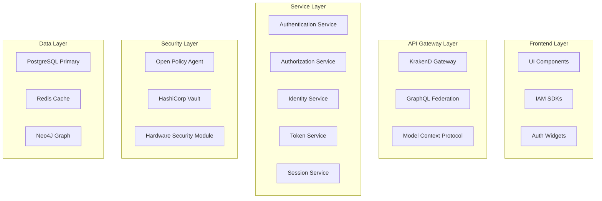

# 🏗️ Arquitetura do Módulo Core IAM

## 📊 **VISÃO GERAL DA ARQUITETURA**

### **Princípios Arquiteturais**
- **Zero Trust Architecture**: Nunca confiar, sempre verificar
- **Defense in Depth**: Múltiplas camadas de segurança
- **Least Privilege**: Acesso mínimo necessário
- **Separation of Duties**: Segregação de responsabilidades
- **Privacy by Design**: Privacidade desde a concepção

## 🎯 **ARQUITETURA DE ALTO NÍVEL**

## 🔧 **COMPONENTES PRINCIPAIS**

### **1. Authentication Engine**
- **Métodos Suportados**: 400+ métodos
- **Biometria**: Face, Fingerprint, Iris, Voice, Behavior
- **Passwordless**: Magic Links, WebAuthn, FIDO2
- **Traditional**: Username/Password, PIN, OTP
- **Social**: OAuth2, SAML, OpenID Connect
- **Blockchain**: DID, Verifiable Credentials