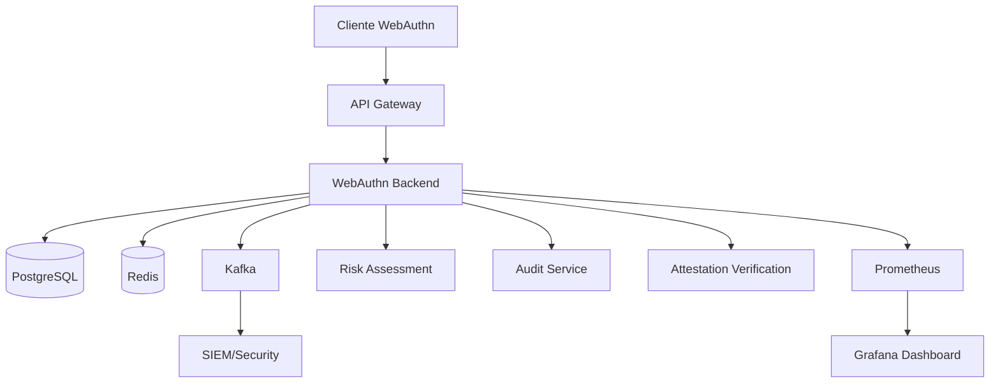

# INNOVABIZ IAM - WebAuthn/FIDO2 Backend

[](https://github.com/innovabiz/iam-webauthn-backend)
[](LICENSE)
[](https://nodejs.org/)
[](https://www.typescriptlang.org/)
[](https://www.pcisecuritystandards.org/)
[](https://gdpr.eu/)

## 📋 Índice

- [Visão Geral](#-visão-geral)
- [Características](#-características)
- [Arquitetura](#-arquitetura)
- [Pré-requisitos](#-pré-requisitos)
- [Instalação](#-instalação)
- [Configuração](#-configuração)
- [Uso](#-uso)
- [API Documentation](#-api-documentation)
- [Segurança](#-segurança)
- [Monitoramento](#-monitoramento)
- [Testes](#-testes)
- [Deploy](#-deploy)
- [Contribuição](#-contribuição)
- [Licença](#-licença)

## 🎯 Visão Geral

O **INNOVABIZ IAM WebAuthn Backend** é um serviço de autenticação de alta segurança que implementa os padrões **WebAuthn/FIDO2** para autenticação sem senha. Este serviço faz parte da suíte INNOVABIZ de sistemas de governança empresarial e oferece:

- ✅ **Autenticação sem senha** usando biometria e chaves de segurança
- ✅ **Conformidade total** com W3C WebAuthn Level 3 e FIDO2 CTAP2.1
- ✅ **Segurança enterprise-grade** com PCI DSS 4.0, GDPR/LGPD, PSD2
- ✅ **Multi-tenant** com isolamento completo de dados
- ✅ **Observabilidade completa** com métricas, logs e tracing
- ✅ **Avaliação de risco** em tempo real
- ✅ **Auditoria completa** de todos os eventos

## 🚀 Características

### Padrões e Conformidade
- **W3C WebAuthn Level 3** - Implementação completa da especificação
- **FIDO2 CTAP2.1** - Suporte a autenticadores FIDO2
- **NIST SP 800-63B** - Níveis de garantia de autenticação (AAL1, AAL2, AAL3)
- **PCI DSS 4.0** - Conformidade com padrões de segurança de cartões
- **GDPR/LGPD** - Proteção de dados pessoais
- **PSD2** - Autenticação forte para serviços financeiros
- **ISO 27001** - Gestão de segurança da informação

### Funcionalidades Técnicas
- **Registro de Credenciais** - Suporte a todos os tipos de autenticadores
- **Autenticação Primária** - Login sem senha
- **Step-up Authentication** - Elevação de privilégios
- **Usernameless Login** - Autenticação apenas com credencial
- **Attestation Verification** - Verificação de autenticidade do autenticador
- **Risk Assessment** - Avaliação de risco em tempo real
- **Rate Limiting** - Proteção contra ataques de força bruta
- **Multi-context** - Suporte a múltiplos contextos (região, tenant, ambiente)

### Tecnologias
- **Node.js 18+** - Runtime JavaScript
- **TypeScript 5.0+** - Tipagem estática
- **Express.js** - Framework web
- **PostgreSQL 15+** - Banco de dados principal
- **Redis 7+** - Cache e sessões
- **Kafka 3.5+** - Streaming de eventos (opcional)
- **Prometheus** - Métricas
- **Winston** - Logging estruturado

## 🏗️ Arquitetura



### Componentes Principais

1. **WebAuthn Service** - Lógica principal de WebAuthn
2. **Credential Service** - Gerenciamento de credenciais
3. **Risk Assessment Service** - Avaliação de risco
4. **Audit Service** - Auditoria e compliance
5. **Attestation Service** - Verificação de attestation

## 📋 Pré-requisitos

### Software Necessário
- **Node.js** >= 18.17.1
- **npm** >= 9.6.7
- **PostgreSQL** >= 15.0
- **Redis** >= 7.0
- **Docker** >= 20.10 (opcional)
- **Docker Compose** >= 2.0 (opcional)

### Conhecimentos Recomendados
- TypeScript/JavaScript
- WebAuthn/FIDO2
- PostgreSQL
- Redis
- Docker
- Segurança web

## 🔧 Instalação

### 1. Clone o Repositório
```bash
git clone https://github.com/innovabiz/iam-webauthn-backend.git
cd iam-webauthn-backend
```

### 2. Instale as Dependências
```bash
npm install
```

### 3. Configure o Ambiente
```bash
cp .env.example .env
# Edite o arquivo .env com suas configurações
```

### 4. Configure o Banco de Dados
```bash
# Execute os scripts de banco de dados
psql -U postgres -d innovabiz_iam -f scripts/database/01_webauthn_schema.sql
psql -U postgres -d innovabiz_iam -f scripts/database/02_webauthn_performance_optimization.sql
psql -U postgres -d innovabiz_iam -f scripts/database/03_webauthn_initial_data.sql
```

### 5. Inicie o Serviço
```bash
# Desenvolvimento
npm run dev

# Produção
npm run build
npm start
```

## ⚙️ Configuração

### Variáveis de Ambiente Principais

```bash
# WebAuthn
WEBAUTHN_RP_NAME=INNOVABIZ IAM
WEBAUTHN_RP_ID=innovabiz.com
WEBAUTHN_ORIGINS=https://innovabiz.com,https://app.innovabiz.com

# Banco de Dados
DB_HOST=localhost
DB_PORT=5432
DB_NAME=innovabiz_iam
DB_USER=postgres
DB_PASSWORD=your_password

# Redis
REDIS_HOST=localhost
REDIS_PORT=6379

# Segurança
JWT_SECRET=your_jwt_secret_key
ENCRYPTION_KEY=your_encryption_key
```

### Configuração Regional

O sistema suporta configurações específicas por região:

```typescript
// Brasil (LGPD, Banco Central)
BR: {
  requireUserVerification: true,
  attestationRequirement: 'indirect',
  minimumAAL: 'AAL2'
}

// União Europeia (GDPR, PSD2)
EU: {
  requireUserVerification: true,
  attestationRequirement: 'direct',
  minimumAAL: 'AAL3'
}
```

## 🔌 Uso

### Registro de Credencial

```typescript
// 1. Gerar opções de registro
POST /api/v1/webauthn/registration/options
{
  "username": "user@example.com",
  "displayName": "João Silva",
  "attestation": "indirect"
}

// 2. Verificar registro
POST /api/v1/webauthn/registration/verify
{
  "id": "credential_id",
  "rawId": "raw_credential_id",
  "response": {
    "clientDataJSON": "...",
    "attestationObject": "..."
  },
  "type": "public-key"
}
```

### Autenticação

```typescript
// 1. Gerar opções de autenticação
POST /api/v1/webauthn/authentication/options
{
  "userVerification": "preferred"
}

// 2. Verificar autenticação
POST /api/v1/webauthn/authentication/verify
{
  "id": "credential_id",
  "rawId": "raw_credential_id",
  "response": {
    "clientDataJSON": "...",
    "authenticatorData": "...",
    "signature": "..."
  },
  "type": "public-key"
}
```

### Gerenciamento de Credenciais

```typescript
// Listar credenciais do usuário
GET /api/v1/webauthn/credentials

// Atualizar nome da credencial
PUT /api/v1/webauthn/credentials/:id/name
{
  "friendlyName": "Meu iPhone Touch ID"
}

// Remover credencial
DELETE /api/v1/webauthn/credentials/:id
```

## 📚 API Documentation

### Endpoints Principais

| Método | Endpoint | Descrição |
|--------|----------|-----------|
| POST | `/api/v1/webauthn/registration/options` | Gera opções de registro |
| POST | `/api/v1/webauthn/registration/verify` | Verifica registro |
| POST | `/api/v1/webauthn/authentication/options` | Gera opções de autenticação |
| POST | `/api/v1/webauthn/authentication/verify` | Verifica autenticação |
| GET | `/api/v1/webauthn/credentials` | Lista credenciais |
| PUT | `/api/v1/webauthn/credentials/:id/name` | Atualiza nome |
| DELETE | `/api/v1/webauthn/credentials/:id` | Remove credencial |
| GET | `/api/v1/webauthn/stats` | Estatísticas |

### Headers Obrigatórios

```http
Content-Type: application/json
X-Correlation-ID: uuid-v4
X-Tenant-ID: tenant-identifier
X-Region: region-code
```

### Códigos de Erro

| Código | Descrição |
|--------|-----------|
| `REGISTRATION_OPTIONS_FAILED` | Falha ao gerar opções de registro |
| `REGISTRATION_VERIFICATION_FAILED` | Falha na verificação de registro |
| `AUTHENTICATION_OPTIONS_FAILED` | Falha ao gerar opções de autenticação |
| `AUTHENTICATION_VERIFICATION_FAILED` | Falha na verificação de autenticação |
| `CREDENTIAL_NOT_FOUND` | Credencial não encontrada |
| `SIGN_COUNT_ANOMALY` | Anomalia de sign count detectada |
| `RATE_LIMIT_EXCEEDED` | Limite de taxa excedido |

## 🔒 Segurança

### Medidas de Segurança Implementadas

1. **Validação de Origem** - Verificação rigorosa de origens permitidas
2. **Rate Limiting** - Proteção contra ataques de força bruta
3. **Attestation Verification** - Verificação de autenticidade do autenticador
4. **Sign Count Monitoring** - Detecção de clonagem de credenciais
5. **Risk Assessment** - Avaliação de risco em tempo real
6. **Audit Logging** - Log completo de todos os eventos
7. **Encryption at Rest** - Criptografia de dados sensíveis
8. **TLS/HTTPS** - Criptografia em trânsito

### Configurações de Segurança

```typescript
// Configuração de segurança
security: {
  requireOriginValidation: true,
  requireRPIDValidation: true,
  allowInsecureOrigins: false,
  signCountAnomalyThreshold: 0
}

// Rate limiting
rateLimiting: {
  registrationPerUser: 5,
  authenticationPerUser: 10,
  registrationPerIP: 20,
  authenticationPerIP: 50,
  windowMinutes: 15
}
```

### Compliance

- **PCI DSS 4.0** - Conformidade com padrões de segurança
- **GDPR/LGPD** - Proteção de dados pessoais
- **PSD2** - Autenticação forte para serviços financeiros
- **ISO 27001** - Gestão de segurança da informação
- **NIST SP 800-63B** - Níveis de garantia de autenticação

## 📊 Monitoramento

### Métricas Prometheus

O serviço expõe métricas detalhadas para monitoramento:

```typescript
// Métricas de registro
innovabiz_webauthn_registration_attempts_total
innovabiz_webauthn_registration_duration_seconds

// Métricas de autenticação
innovabiz_webauthn_authentication_attempts_total
innovabiz_webauthn_authentication_duration_seconds

// Métricas de segurança
innovabiz_webauthn_sign_count_anomalies_total
innovabiz_webauthn_high_risk_events_total

// Métricas de sistema
innovabiz_webauthn_http_requests_total
innovabiz_webauthn_database_connections_active
```

### Health Checks

```bash
# Health check geral
GET /health

# Health check específico do WebAuthn
GET /health/webauthn

# Métricas Prometheus
GET /metrics
```

### Dashboards Grafana

O projeto inclui dashboards pré-configurados para:
- Performance de APIs
- Métricas de segurança
- Saúde do sistema
- Compliance e auditoria

## 🧪 Testes

### Executar Testes

```bash
# Todos os testes
npm test

# Testes com watch
npm run test:watch

# Cobertura de código
npm run test:coverage

# Testes de performance
npm run performance:test
```

### Tipos de Teste

1. **Unit Tests** - Testes unitários dos serviços
2. **Integration Tests** - Testes de integração
3. **E2E Tests** - Testes end-to-end
4. **Security Tests** - Testes de segurança
5. **Performance Tests** - Testes de carga

### Cobertura de Código

O projeto mantém cobertura mínima de 80% em:
- Branches
- Functions
- Lines
- Statements

## 🚀 Deploy

### Docker

```bash
# Build da imagem
docker build -t innovabiz/iam-webauthn-backend .

# Executar container
docker run -p 3000:3000 innovabiz/iam-webauthn-backend
```

### Docker Compose

```yaml
version: '3.8'
services:
  webauthn-backend:
    build: .
    ports:
      - "3000:3000"
    environment:
      - NODE_ENV=production
      - DB_HOST=postgres
      - REDIS_HOST=redis
    depends_on:
      - postgres
      - redis
  
  postgres:
    image: postgres:15-alpine
    environment:
      POSTGRES_DB: innovabiz_iam
      POSTGRES_USER: postgres
      POSTGRES_PASSWORD: password
  
  redis:
    image: redis:7-alpine
```

### Kubernetes

```yaml
apiVersion: apps/v1
kind: Deployment
metadata:
  name: webauthn-backend
spec:
  replicas: 3
  selector:
    matchLabels:
      app: webauthn-backend
  template:
    metadata:
      labels:
        app: webauthn-backend
    spec:
      containers:
      - name: webauthn-backend
        image: innovabiz/iam-webauthn-backend:1.0.0
        ports:
        - containerPort: 3000
        env:
        - name: NODE_ENV
          value: "production"
```

### CI/CD Pipeline

O projeto inclui pipelines para:
- **GitHub Actions** - CI/CD automatizado
- **Security Scanning** - Análise de vulnerabilidades
- **Quality Gates** - Verificação de qualidade
- **Automated Testing** - Testes automatizados
- **Deployment** - Deploy automatizado

## 🤝 Contribuição

### Processo de Contribuição

1. Fork o projeto
2. Crie uma branch para sua feature (`git checkout -b feature/nova-feature`)
3. Commit suas mudanças (`git commit -am 'Adiciona nova feature'`)
4. Push para a branch (`git push origin feature/nova-feature`)
5. Abra um Pull Request

### Padrões de Código

- **ESLint** - Linting de código
- **Prettier** - Formatação de código
- **Husky** - Git hooks
- **Conventional Commits** - Padrão de commits
- **TypeScript** - Tipagem estática

### Code Review

Todos os PRs passam por:
- ✅ Revisão de código
- ✅ Testes automatizados
- ✅ Verificação de segurança
- ✅ Análise de performance
- ✅ Verificação de compliance

## 📄 Licença

Este projeto é propriedade da **INNOVABIZ** e está licenciado sob termos proprietários. 

**© 2025 INNOVABIZ. Todos os direitos reservados.**

Para informações sobre licenciamento, entre em contato:
- Email: innovabizdevops@gmail.com
- Website: https://innovabiz.com

---

## 📞 Suporte

### Contatos

- **Email**: innovabizdevops@gmail.com
- **Documentação**: https://docs.innovabiz.com
- **Issues**: https://github.com/innovabiz/iam-webauthn-backend/issues

### Recursos Adicionais

- [WebAuthn Specification](https://www.w3.org/TR/webauthn-3/)
- [FIDO Alliance](https://fidoalliance.org/)
- [NIST SP 800-63B](https://pages.nist.gov/800-63-3/sp800-63b.html)
- [PCI DSS](https://www.pcisecuritystandards.org/)

---

**Desenvolvido com ❤️ pela equipe INNOVABIZ**