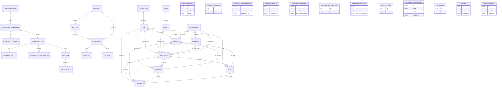

# ERD – Compliance, Governança e Risco (Mermaid)

```mermaid
erDiagram
    COMPLIANCE_NORMA ||--o{ COMPLIANCE_FRAMEWORK : contains
    COMPLIANCE_FRAMEWORK ||--o{ COMPLIANCE_CONSENT : has
    COMPLIANCE_FRAMEWORK ||--o{ GOVERNANCE_ORG : governs
    GOVERNANCE_ORG ||--o{ GOVERNANCE_ROLE : has
    GOVERNANCE_ORG ||--o{ GOVERNANCE_RESPONSIBILITY : assigns
    GOVERNANCE_ORG ||--o{ RISK_RISK : faces
    RISK_RISK ||--o{ RISK_MITIGATION : mitigated_by
    CONTRACT ||--o{ PROCESS : regulates
    PROCESS ||--o{ KPI_INDICATOR : measures
    KPI_INDICATOR ||--o{ KPI_TARGET : targets
    KPI_INDICATOR ||--o{ KPI_RESULT : results
    CONTRACT ||--o{ KPI_INDICATOR : linked_to
    ORGANIZATION ||--o{ CITY : located_in
    CITY ||--o{ DISTRICT : in_district
    CITY ||--o{ MUNICIPALITY : in_municipality
    CITY ||--o{ STATE : in_state
    CITY ||--o{ PROVINCE : in_province
    CITY ||--o{ COUNTRY : in_country
    MUNICIPALITY ||--o{ STATE : in_state
    MUNICIPALITY ||--o{ PROVINCE : in_province
    MUNICIPALITY ||--o{ COUNTRY : in_country
    DISTRICT ||--o{ MUNICIPALITY : in_municipality
    DISTRICT ||--o{ STATE : in_state
    DISTRICT ||--o{ PROVINCE : in_province
    DISTRICT ||--o{ COUNTRY : in_country
    COUNTY ||--o{ DISTRICT : in_district
    COUNTY ||--o{ MUNICIPALITY : in_municipality
    PARISH ||--o{ COUNTY : in_county
    COMMUNE ||--o{ MUNICIPALITY : in_municipality
    NEIGHBORHOOD ||--o{ DISTRICT : in_district
    NEIGHBORHOOD ||--o{ MUNICIPALITY : in_municipality
    NEIGHBORHOOD ||--o{ COMMUNE : in_commune
    PROVINCE ||--o{ COUNTRY : in_country
    STATE ||--o{ COUNTRY : in_country

    compliance_norma {
        UUID id
        string codigo
        string nome
    }
    compliance_framework {
        UUID id
        string nome
    }
    compliance_norma_framework {
        UUID id
        UUID norma_id
        UUID framework_id
    }
    compliance_audit_log {
        UUID id
        string entidade
        UUID entidade_id
    }
    compliance_consentimento {
        UUID id
        UUID usuario_id
        string tipo_consentimento
    }
    governance_tipo_orgao_social {
        UUID id
        string nome
    }
    governance_orgao_social {
        UUID id
        string nome
        UUID tipo_orgao_social_id
    }
    governance_papel {
        UUID id
        string nome
    }
    governance_responsabilidade {
        UUID id
        UUID papel_id
        string entidade
        UUID entidade_id
    }
    risk_tipo_risco {
        UUID id
        string nome
    }
    risk_risco {
        UUID id
        string nome
        UUID tipo_risco_id
    }
    risk_plano_mitigacao {
        UUID id
        UUID risco_id
        string descricao
    }
```
