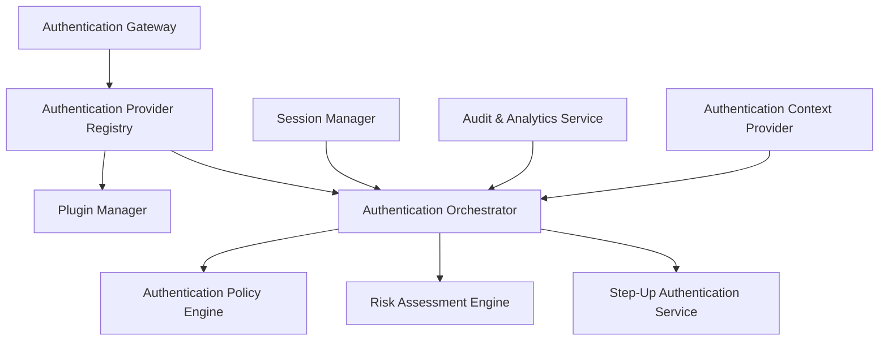
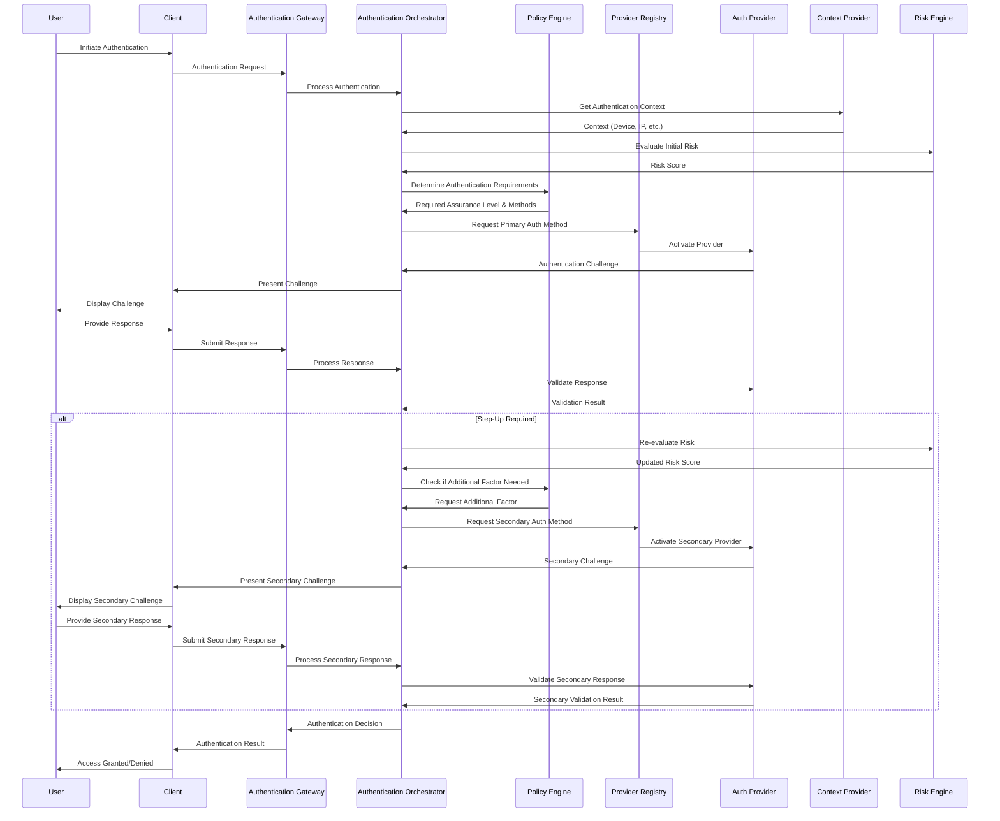

# Authentication Framework Design

## Overview

This document outlines the technical design of the extensible authentication framework for the INNOVABIZ platform. The framework is designed to support 50+ authentication methods through a plugin-based architecture, while ensuring security, scalability, and compliance with regional requirements.

## Architecture

### Core Components



### Component Descriptions

| Component | Description | Responsibilities |
|-----------|-------------|------------------|
| **Authentication Gateway** | Entry point for all authentication requests | Request routing, protocol adaptation, initial validation |
| **Authentication Provider Registry** | Central registry of all authentication methods | Method discovery, registration, lifecycle management |
| **Plugin Manager** | Manages authentication method plugins | Plugin loading, versioning, configuration, updates |
| **Authentication Orchestrator** | Coordinates authentication flows | Multi-step authentication, step-up logic, method chaining |
| **Authentication Policy Engine** | Enforces authentication policies | Rule evaluation, policy resolution, context-based decisions |
| **Risk Assessment Engine** | Evaluates authentication risk in real-time | User behavior analysis, threat detection, risk scoring |
| **Step-Up Authentication Service** | Manages progressive authentication | Determining when additional verification is needed |
| **Session Manager** | Manages authenticated sessions | Session creation, validation, expiration, revocation |
| **Audit & Analytics Service** | Records authentication events | Comprehensive logging, analytics, compliance reporting |
| **Authentication Context Provider** | Supplies contextual information | Device, location, network, and behavioral context |

## Authentication Provider Interface

All authentication method plugins must implement the standard Authentication Provider Interface:

```typescript
interface AuthenticationProvider {
  // Basic properties
  id: string;                 // Unique identifier for the provider
  name: string;               // Display name
  description: string;        // Description of the authentication method
  version: string;            // Provider version
  category: AuthMethodCategory; // Category classification
  capabilities: AuthCapabilities[]; // Supported capabilities
  
  // Lifecycle methods
  initialize(config: ProviderConfig): Promise<void>;
  shutdown(): Promise<void>;
  
  // Core authentication methods
  startAuthentication(context: AuthContext): Promise<AuthenticationChallenge>;
  validateResponse(response: AuthenticationResponse, context: AuthContext): Promise<AuthenticationResult>;
  cancelAuthentication(sessionId: string): Promise<void>;
  
  // Optional methods
  supportsEnrollment(): boolean;
  startEnrollment(userId: string, context: EnrollmentContext): Promise<EnrollmentChallenge>;
  completeEnrollment(response: EnrollmentResponse, context: EnrollmentContext): Promise<EnrollmentResult>;
  
  // MFA & Step-up specific
  getAssuranceLevel(): AssuranceLevel;
  supportsStepUp(currentLevel: AssuranceLevel, targetLevel: AssuranceLevel): boolean;
  
  // Health & status
  getStatus(): ProviderStatus;
  getMetrics(): ProviderMetrics;
}

enum AuthMethodCategory {
  BASIC = 'basic',
  MULTIFACTOR = 'multifactor',
  BIOMETRIC = 'biometric',
  FEDERATION = 'federation',
  CONTEXTUAL = 'contextual',
  SPECIALIZED = 'specialized'
}

enum AssuranceLevel {
  LOW = 1,     // Basic authentication
  MEDIUM = 2,  // Single factor with some assurance
  HIGH = 3,    // Strong single factor or basic multi-factor
  VERY_HIGH = 4 // Strong multi-factor
}

interface AuthCapabilities {
  supportsPasswordless: boolean;
  supportsFederatedLogin: boolean;
  supportsCrossPlatform: boolean;
  supportsOfflineMode: boolean;
  supportsSilentAuthentication: boolean;
  requiresUserInteraction: boolean;
  isPhishingResistant: boolean;
}
```

## Plugin System Design

The plugin system follows a modular architecture allowing dynamic loading and configuration of authentication methods:

### Plugin Manifest

Each authentication plugin must provide a manifest file with metadata:

```json
{
  "id": "fido2-webauthn",
  "name": "FIDO2/WebAuthn",
  "version": "1.0.0",
  "description": "FIDO2/WebAuthn authentication using security keys and platform authenticators",
  "entryPoint": "Fido2WebAuthnProvider",
  "category": "multifactor",
  "assuranceLevel": 4,
  "capabilities": {
    "supportsPasswordless": true,
    "supportsFederatedLogin": false,
    "supportsCrossPlatform": true,
    "supportsOfflineMode": false,
    "supportsSilentAuthentication": false,
    "requiresUserInteraction": true,
    "isPhishingResistant": true
  },
  "configSchema": {
    "type": "object",
    "properties": {
      "rpId": {
        "type": "string",
        "description": "Relying Party ID"
      },
      "rpName": {
        "type": "string",
        "description": "Relying Party Name"
      },
      "timeout": {
        "type": "number",
        "description": "Timeout in milliseconds",
        "default": 60000
      }
    },
    "required": ["rpId", "rpName"]
  },
  "dependencies": ["cryptography-service", "device-database"],
  "targetPlatforms": ["web", "android", "ios"]
}
```

### Plugin Loading Process

1. **Discovery Phase**:
   - Scan plugin directories for manifest files
   - Validate manifest format
   - Check for version compatibility
   
2. **Registration Phase**:
   - Load plugin module
   - Instantiate provider class
   - Register capabilities with the provider registry
   
3. **Initialization Phase**:
   - Apply configuration
   - Establish dependencies
   - Verify connectivity
   - Update status

## Authentication Orchestration

The Authentication Orchestrator manages the flow of authentication, allowing for complex scenarios like multi-factor, step-up, and adaptive authentication.

### Workflow



### Adaptive Authentication Flow

The framework supports adaptive authentication based on risk assessment:

1. **Initial Risk Assessment**
   - Evaluate device, location, behavior, and other contexts
   - Generate a preliminary risk score
   
2. **Method Selection**
   - Choose authentication methods based on risk score
   - Apply policies based on resource sensitivity
   
3. **Dynamic Adjustment**
   - Continuously evaluate risk during authentication
   - Add additional factors if risk increases
   - Simplify flow if risk is low (e.g., trusted device)

## Risk Assessment Engine

The Risk Assessment Engine provides real-time evaluation of authentication risk based on multiple factors:

### Risk Factors

| Factor | Description | Weight | Data Sources |
|--------|-------------|--------|--------------|
| **Device Trust** | Known vs. unknown device | High | Device fingerprint, certificates |
| **Location** | Geographical location | Medium | IP geolocation, GPS |
| **Network** | Network characteristics | Medium | IP reputation, VPN detection |
| **Behavioral** | User behavior patterns | High | Typing pattern, interaction model |
| **Temporal** | Time-based patterns | Low | Time of day, access frequency |
| **Resource Sensitivity** | Value of target resource | High | Resource classification |
| **Historical** | Previous authentication patterns | Medium | Authentication history |
| **Threat Intelligence** | Known threats | Very High | Threat feeds, blocklists |

### Risk Scoring Algorithm

```
RiskScore = Σ(FactorScore × FactorWeight) / Σ(FactorWeight)

Where:
- FactorScore is normalized to a range of 0.0-1.0
- FactorWeight represents the importance of each factor
- Final RiskScore ranges from 0.0 (lowest risk) to 1.0 (highest risk)
```

### Risk-Based Authentication Requirements

| Risk Level | Score Range | Required Assurance Level | Authentication Requirements |
|------------|-------------|--------------------------|----------------------------|
| **Minimal** | 0.0 - 0.2 | LOW | Single factor, may allow passwordless |
| **Low** | 0.2 - 0.4 | MEDIUM | Strong single factor |
| **Medium** | 0.4 - 0.6 | HIGH | Multi-factor authentication |
| **High** | 0.6 - 0.8 | VERY_HIGH | Strong MFA with phishing resistance |
| **Critical** | 0.8 - 1.0 | VERY_HIGH+APPROVAL | Strong MFA + additional approval |

## Authentication Context

The Authentication Context provides a comprehensive view of the environment in which authentication is occurring:

```typescript
interface AuthContext {
  // Request metadata
  requestId: string;
  timestamp: Date;
  clientIp: string;
  userAgent: string;
  
  // User information
  userId?: string;
  username?: string;
  tenantId: string;
  
  // Device information
  deviceId?: string;
  deviceFingerprint?: DeviceFingerprint;
  deviceTrustLevel?: TrustLevel;
  
  // Location information
  geoLocation?: GeoLocation;
  locationTrustLevel?: TrustLevel;
  
  // Session information
  existingSessionId?: string;
  sessionAttributes?: Record<string, any>;
  
  // Request attributes
  resourceId?: string;
  resourceType?: string;
  resourceSensitivity?: SensitivityLevel;
  
  // Risk information
  riskScore?: number;
  riskFactors?: RiskFactor[];
  
  // Other contextual data
  attributes: Record<string, any>;
}

enum TrustLevel {
  UNKNOWN = 0,
  UNTRUSTED = 1,
  LOW_TRUST = 2,
  MEDIUM_TRUST = 3,
  HIGH_TRUST = 4,
  FULLY_TRUSTED = 5
}

enum SensitivityLevel {
  PUBLIC = 0,
  INTERNAL = 1,
  CONFIDENTIAL = 2,
  RESTRICTED = 3,
  CRITICAL = 4
}
```

## Multi-Tenant Support

The authentication framework is designed to support multi-tenancy from the ground up:

### Tenant Isolation

- Each tenant has isolated configuration for authentication providers
- Tenant-specific policy rules
- Separate credential storage
- Tenant-specific branding and user experience

### Tenant Configuration Model

```typescript
interface TenantAuthConfiguration {
  tenantId: string;
  
  // Enabled authentication methods for this tenant
  enabledProviders: {
    providerId: string;
    providerConfig: Record<string, any>;
    priority: number;
    required: boolean;
  }[];
  
  // Tenant-specific authentication policies
  policies: AuthPolicy[];
  
  // Branding configuration for authentication UI
  branding: BrandingConfig;
  
  // Regional settings
  region: string;
  locales: string[];
  
  // Compliance requirements
  complianceProfiles: string[];
}
```

## Regional Adaptations

The framework includes specific adaptations for each target region:

### EU/Portugal
- Support for eIDAS assurance levels
- Integration with European digital identity wallets
- GDPR-compliant credential storage
- Cartão de Cidadão integration

### Brazil
- ICP-Brasil certificate support
- Gov.br integration
- LGPD-compliant consent management
- PIX authentication integration

### Africa/Angola
- Offline authentication capabilities
- Low-bandwidth optimization
- PNDSB compliance
- Mobile money provider integration

### USA
- NIST 800-63-3 IAL/AAL compliance
- Healthcare-specific adaptations (HIPAA)
- Financial sector compliance (PCI-DSS)
- State-specific privacy requirements

## Security Considerations

### Credential Protection

- All authentication secrets stored using appropriate encryption
- Hardware Security Module (HSM) integration for cryptographic operations
- Zero-knowledge approaches where possible
- Separate encryption keys per tenant

### Attack Resistance

- Anti-automation measures (rate limiting, CAPTCHA)
- Phishing resistance in supported methods
- Brute force protection
- Session fixation prevention
- Replay attack prevention

### Secure Communications

- All authentication traffic over TLS 1.3+
- Certificate pinning for mobile clients
- Secure, short-lived tokens
- Signed authentication assertions

## Implementation Plan

The implementation will proceed according to the phased approach detailed in the Primary Implementation Plan document, with the following immediate next steps:

1. Set up infrastructure for the Authentication Framework
2. Implement the Provider Registry and Plugin Manager
3. Develop the base Authentication Orchestrator
4. Create the initial set of authentication providers (Basic methods)
5. Implement the Risk Assessment Engine foundation

## References

- [NIST SP 800-63-3](https://pages.nist.gov/800-63-3/)
- [FIDO2 Specifications](https://fidoalliance.org/specifications/)
- [OAuth 2.0 and OpenID Connect](https://openid.net/specs/openid-connect-core-1_0.html)
- [eIDAS Regulation](https://digital-strategy.ec.europa.eu/en/policies/eidas-regulation)
- [INNOVABIZ IAM Architecture](../02-Arquitetura/IAM_Technical_Architecture.md)
- [IAM Data Model](../03-Desenvolvimento/Modelo_Dados_IAM.md)
- [IAM Compliance Framework](../10-Governanca/Framework_Compliance_IAM.md)
