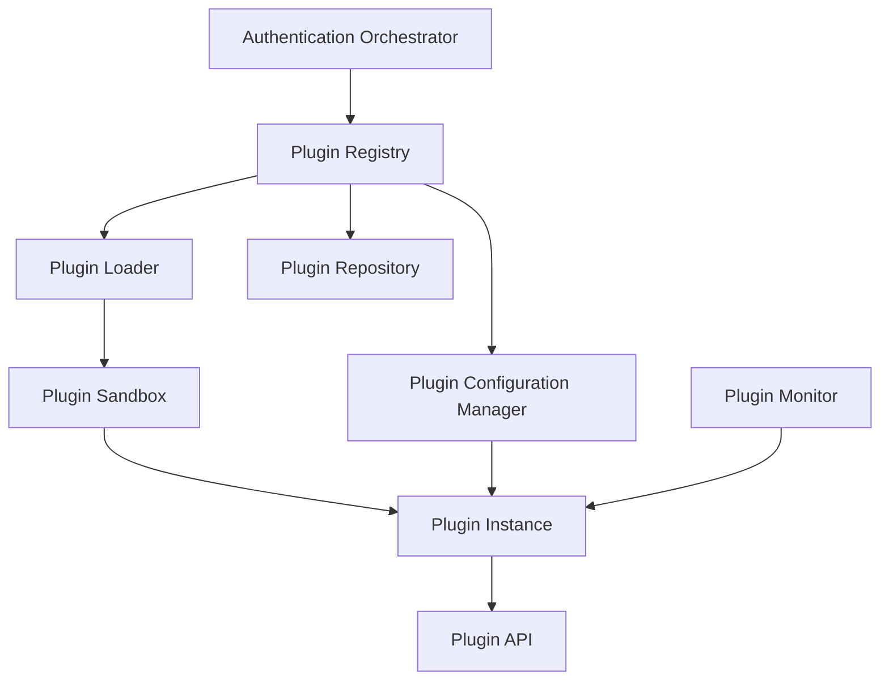

# Authentication Plugin System - Part 1

## Introduction

The Authentication Plugin System is a core component of the INNOVABIZ IAM architecture, enabling the platform to support 50+ authentication methods through a flexible, extensible plugin architecture. This document details the design and implementation of the plugin system, focusing on the infrastructure, interfaces, and lifecycle management.

## System Architecture

The plugin system follows a modular architecture that allows for runtime discovery, loading, and management of authentication providers. This approach provides several benefits:

1. **Extensibility**: New authentication methods can be added without modifying the core system
2. **Isolation**: Each authentication method runs in its own context with controlled resource access
3. **Versioning**: Multiple versions of the same plugin can coexist
4. **Configuration**: Each plugin can be configured independently per tenant
5. **Metrics**: Performance and usage metrics are collected at the plugin level

### High-Level Architecture



### Component Descriptions

| Component | Description | Responsibility |
|-----------|-------------|----------------|
| **Plugin Registry** | Central registry of all available plugins | Registration, discovery, status tracking |
| **Plugin Loader** | Loads plugin code and initializes instances | Code loading, dependency injection, error handling |
| **Plugin Repository** | Storage for plugin packages | Version management, distribution, updates |
| **Plugin Configuration Manager** | Manages plugin configurations | Tenant-specific settings, defaults, validation |
| **Plugin Sandbox** | Isolated execution environment | Resource limits, security boundaries |
| **Plugin Instance** | Running instance of an authentication provider | Implementation of authentication protocol |
| **Plugin API** | Interface between plugins and core system | Standardized communication contract |
| **Plugin Monitor** | Observes plugin health and performance | Health checks, metrics collection, alerts |

## Plugin Package Structure

Each authentication provider plugin is packaged as a self-contained module with the following structure:

```
plugin-id/
├── manifest.json           # Plugin metadata and configuration schema
├── index.js                # Main entry point
├── lib/                    # Provider-specific code
│   ├── provider.js         # Provider implementation
│   ├── validators.js       # Input/output validation
│   └── utils.js            # Utility functions
├── ui/                     # UI components (optional)
│   ├── authentication.js   # Authentication UI
│   └── enrollment.js       # Enrollment UI
├── locales/                # Internationalization
│   ├── en.json             # English translations
│   ├── pt.json             # Portuguese translations
│   └── ...                 # Other languages
└── README.md               # Plugin documentation
```

### Manifest File

The manifest.json file contains essential metadata about the plugin:

```json
{
  "id": "sample-auth-provider",
  "name": "Sample Authentication Provider",
  "version": "1.0.0",
  "description": "A sample authentication provider for demonstration",
  "author": "INNOVABIZ",
  "license": "Proprietary",
  "main": "index.js",
  "type": "authentication-provider",
  "category": "multifactor",
  "assuranceLevel": 3,
  "capabilities": {
    "supportsPasswordless": false,
    "supportsFederatedLogin": false,
    "supportsCrossPlatform": true,
    "supportsOfflineMode": false,
    "supportsSilentAuthentication": false,
    "requiresUserInteraction": true,
    "isPhishingResistant": true
  },
  "compatibility": {
    "apiVersion": "1.0",
    "platforms": ["web", "android", "ios"],
    "minPlatformVersions": {
      "web": "1.0.0",
      "android": "1.0.0",
      "ios": "1.0.0"
    }
  },
  "dependencies": [
    {
      "id": "crypto-service",
      "version": "^1.0.0"
    }
  ],
  "configSchema": {
    "type": "object",
    "properties": {
      "timeout": {
        "type": "number",
        "description": "Authentication timeout in seconds",
        "default": 60
      },
      "maxAttempts": {
        "type": "number",
        "description": "Maximum authentication attempts",
        "default": 3
      }
    }
  },
  "regions": ["EU", "BR", "AO", "US"],
  "tags": ["sample", "demo"]
}
```

## Plugin API

The Plugin API defines the contract between the authentication framework and individual plugins. This standardized interface ensures consistent behavior across all authentication methods.

### Core Provider Interface

```typescript
export interface AuthenticationProvider {
  /**
   * Unique identifier for this provider
   */
  readonly id: string;
  
  /**
   * Provider metadata
   */
  readonly metadata: ProviderMetadata;
  
  /**
   * Initialize the provider with configuration
   * @param config Provider configuration
   */
  initialize(config: Record<string, any>): Promise<void>;
  
  /**
   * Start the authentication process
   * @param context Authentication context
   * @returns Authentication challenge to be presented to the user
   */
  startAuthentication(context: AuthContext): Promise<AuthenticationChallenge>;
  
  /**
   * Process authentication response
   * @param response Authentication response from client
   * @param context Authentication context
   * @returns Authentication result
   */
  verifyResponse(
    response: AuthenticationResponse, 
    context: AuthContext
  ): Promise<AuthenticationResult>;
  
  /**
   * Cancel an ongoing authentication
   * @param sessionId ID of authentication session to cancel
   */
  cancelAuthentication(sessionId: string): Promise<void>;
  
  /**
   * Check if this provider supports enrollment
   */
  supportsEnrollment(): boolean;
  
  /**
   * Start enrollment process (if supported)
   * @param userId User to enroll
   * @param context Enrollment context
   * @returns Enrollment challenge
   */
  startEnrollment?(
    userId: string,
    context: EnrollmentContext
  ): Promise<EnrollmentChallenge>;
  
  /**
   * Complete enrollment process
   * @param response Enrollment response from client
   * @param context Enrollment context
   * @returns Enrollment result
   */
  completeEnrollment?(
    response: EnrollmentResponse, 
    context: EnrollmentContext
  ): Promise<EnrollmentResult>;
  
  /**
   * Check provider health
   * @returns Health status
   */
  checkHealth(): Promise<HealthStatus>;
  
  /**
   * Get provider metrics
   * @returns Usage and performance metrics
   */
  getMetrics(): ProviderMetrics;
  
  /**
   * Shutdown the provider
   */
  shutdown(): Promise<void>;
}

export interface ProviderMetadata {
  name: string;
  description: string;
  version: string;
  category: AuthMethodCategory;
  assuranceLevel: AssuranceLevel;
  capabilities: AuthCapabilities;
}

export interface AuthenticationChallenge {
  sessionId: string;
  challengeType: string;
  challenge: any;
  expiresAt: Date;
  uiOptions?: {
    title?: string;
    message?: string;
    uiExtension?: string;
    uiData?: any;
  };
}

export interface AuthenticationResponse {
  sessionId: string;
  responseType: string;
  response: any;
}

export interface AuthenticationResult {
  success: boolean;
  userId?: string;
  authTime: Date;
  expiresAt?: Date;
  amr?: string[]; // Authentication Methods References
  acr?: string;   // Authentication Context Class Reference
  sessionId?: string;
  identityAttributes?: Record<string, any>;
  error?: {
    code: string;
    message: string;
    details?: any;
  };
  stepUp?: {
    required: boolean;
    methods?: string[];
    reason?: string;
  };
}
```

### Provider Registration

Plugins register themselves with the Plugin Registry during initialization:

```typescript
// Sample plugin registration
export default class SampleAuthProvider implements AuthenticationProvider {
  public readonly id = 'sample-auth-provider';
  public readonly metadata = {
    name: 'Sample Authentication Provider',
    description: 'A sample provider for demonstration',
    version: '1.0.0',
    category: AuthMethodCategory.MULTIFACTOR,
    assuranceLevel: AssuranceLevel.HIGH,
    capabilities: {
      supportsPasswordless: false,
      supportsFederatedLogin: false,
      supportsCrossPlatform: true,
      supportsOfflineMode: false,
      supportsSilentAuthentication: false,
      requiresUserInteraction: true,
      isPhishingResistant: true
    }
  };
  
  // Implementation of required methods...
}

// Registration function called by the plugin loader
export function register(registry) {
  registry.registerProvider(new SampleAuthProvider());
}
```

## Plugin Lifecycle Management

The plugin system manages the complete lifecycle of authentication providers:

### Installation

1. Plugin package is uploaded to the Plugin Repository
2. Plugin Registry validates the package structure and manifest
3. Compatibility check ensures the plugin can work with the current platform version
4. Plugin is made available but not yet activated

### Activation

1. Administrator activates the plugin for specific tenants
2. Tenant-specific configuration is provided
3. Plugin Loader loads the plugin code
4. Plugin's register function is called
5. Plugin instance is initialized with configuration

### Runtime Management

1. Plugin instances are managed in the provider pool
2. Health is monitored continuously
3. Metrics are collected for performance and usage
4. Configuration changes are applied without restarting when possible

### Deactivation

1. Administrator deactivates a plugin
2. Ongoing authentications are allowed to complete
3. Plugin instance is gracefully shut down
4. Resources are released

### Updates

1. New version of plugin is uploaded
2. Version compatibility is checked
3. Update can be scheduled or applied immediately
4. Blue-green deployment for zero-downtime updates

## Security Considerations

### Plugin Isolation

Plugins run in isolated environments with controlled access to resources:

1. **Sandboxing**: Each plugin runs in its own sandbox with memory and CPU limits
2. **Permission Model**: Plugins request permissions in manifest for specific resources
3. **Dependency Isolation**: Each plugin has its own dependency tree
4. **Error Containment**: Errors in one plugin cannot affect others

### Plugin Verification

All plugins undergo verification before being made available:

1. **Code Scanning**: Automated scanning for vulnerabilities and malicious code
2. **Signature Verification**: Plugins must be digitally signed by trusted developers
3. **Compliance Check**: Verification against security policies
4. **Manual Review**: Security review for plugins with elevated privileges

### Credential Handling

Plugins follow strict rules for credential handling:

1. **No Credential Storage**: Authentication plugins should not store credentials directly
2. **Secure Communication**: All in-transit credentials must be encrypted
3. **Memory Protection**: Credentials in memory are protected against disclosure
4. **Credential Lifecycle**: Clear guidelines for credential lifetime and disposal

## Multi-Tenant Considerations

The plugin system is designed for multi-tenancy with the following capabilities:

### Tenant-Specific Configuration

Each tenant can have its own configuration for each plugin:

```typescript
interface TenantPluginConfiguration {
  tenantId: string;
  pluginId: string;
  enabled: boolean;
  configuration: Record<string, any>;
  activationDate: Date;
  modifiedDate: Date;
  modifiedBy: string;
}
```

### Tenant Isolation

1. **Data Isolation**: Authentication data is strictly isolated by tenant
2. **Configuration Isolation**: Configuration changes in one tenant don't affect others
3. **Resource Allocation**: Resource limits can be defined per tenant
4. **Branding**: UI elements can be customized per tenant

### Plugin Availability Control

Administrators can control which plugins are available to which tenants:

1. **Global Availability**: Available to all tenants
2. **Limited Availability**: Available only to specific tenants
3. **Region-Based Availability**: Available based on tenant's region
4. **Plan-Based Availability**: Available based on tenant's subscription plan
