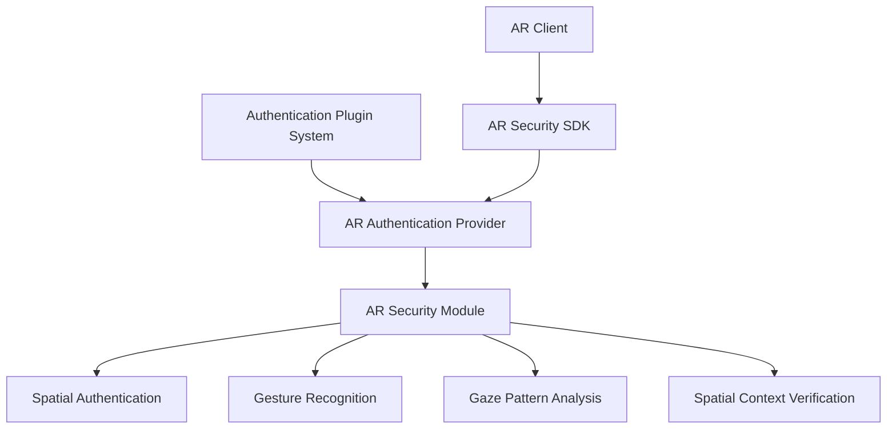
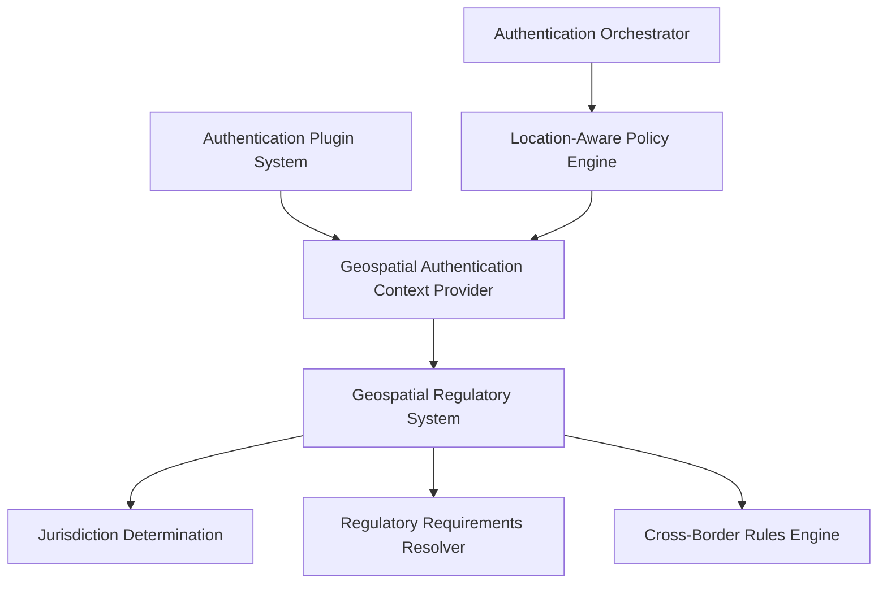

# Authentication Plugin System - Part 2

## Integration With Specialized Systems

The Authentication Plugin System is designed to integrate seamlessly with specialized systems across the INNOVABIZ platform, leveraging existing infrastructure and capabilities while providing consistent identity and access management.

### AR Security Integration

The integration with the AR Security framework enables specialized authentication methods for Augmented Reality environments, as implemented in the `ar_security` module:



#### AR Authentication Methods

The AR Authentication Provider plugin interfaces with the existing AR Security framework to provide the following authentication methods:

1. **Spatial Gestures Authentication**
   - 3D gesture patterns as authentication factors
   - Spatial coordinates validation
   - Movement velocity and precision analysis

2. **Gaze Pattern Authentication**
   - Eye-tracking based authentication
   - Fixation point sequence validation
   - Pupil dilation analysis (biometric component)

3. **Spatial Password Entry**
   - 3D object placement and arrangement
   - Spatial relationship verification
   - Hidden virtual objects as authentication tokens

4. **Continuous Contextual Authentication**
   - Movement patterns
   - Environmental interaction patterns
   - Behavioral biometrics in spatial contexts

#### Implementation Example

```typescript
// AR Authentication Provider implementation
export class ARAuthenticationProvider implements AuthenticationProvider {
  public readonly id = 'ar-authentication-provider';
  public readonly metadata = {
    name: 'AR Authentication Provider',
    description: 'Authentication in Augmented Reality environments',
    version: '1.0.0',
    category: AuthMethodCategory.SPECIALIZED,
    assuranceLevel: AssuranceLevel.VERY_HIGH,
    capabilities: {
      supportsPasswordless: true,
      supportsFederatedLogin: false,
      supportsCrossPlatform: false,
      supportsOfflineMode: false,
      supportsSilentAuthentication: true,
      requiresUserInteraction: true,
      isPhishingResistant: true
    }
  };
  
  private arSecurityService: ARSecurityService;
  private spatialAuthenticator: SpatialAuthenticator;
  private gazeAuthenticator: GazeAuthenticator;
  
  async initialize(config: Record<string, any>): Promise<void> {
    this.arSecurityService = new ARSecurityService(config.arSecurityEndpoint);
    this.spatialAuthenticator = new SpatialAuthenticator(config.spatialConfig);
    this.gazeAuthenticator = new GazeAuthenticator(config.gazeConfig);
    
    // Initialize the AR security components
    await this.arSecurityService.initialize();
  }
  
  async startAuthentication(context: AuthContext): Promise<AuthenticationChallenge> {
    // Determine the best AR authentication method based on context
    const method = this.determineARMethod(context);
    
    switch (method) {
      case 'spatial-gesture':
        return this.spatialAuthenticator.generateChallenge(context);
      case 'gaze-pattern':
        return this.gazeAuthenticator.generateChallenge(context);
      // Other AR methods...
      default:
        throw new Error('Unsupported AR authentication method');
    }
  }
  
  async verifyResponse(
    response: AuthenticationResponse, 
    context: AuthContext
  ): Promise<AuthenticationResult> {
    // Verify the AR authentication response
    const responseType = response.responseType;
    
    switch (responseType) {
      case 'spatial-gesture':
        return this.spatialAuthenticator.verifyResponse(response, context);
      case 'gaze-pattern':
        return this.gazeAuthenticator.verifyResponse(response, context);
      // Other AR verification methods...
      default:
        throw new Error('Unsupported AR response type');
    }
  }
  
  // Implementation of other required methods...
}
```

### Geospatial Regulatory Integration

The integration with the Geospatial Regulatory System enables location-aware authentication policies and compliance enforcement:



#### Geospatial Authentication Features

1. **Jurisdiction-Based Authentication Requirements**
   - Dynamic determination of required authentication factors based on user location
   - Enforcement of local regulatory requirements
   - Cross-border authentication rules

2. **Location Verification**
   - IP-based geolocation with confidence scoring
   - GPS-based location verification (mobile)
   - Cellular network triangulation
   - Location history analysis

3. **Geofencing Authentication Policies**
   - Define geographical boundaries for specific authentication policies
   - Restricted access zones requiring heightened authentication
   - Safe zones allowing simplified authentication

#### Implementation Example

```typescript
// Geospatial Context Provider for Authentication
export class GeospatialContextProvider implements AuthContextProvider {
  private geoRegulatoryService: GeoRegulatoryService;
  private locationVerificationService: LocationVerificationService;
  
  constructor(config: GeoContextConfig) {
    this.geoRegulatoryService = new GeoRegulatoryService(config.regulatoryEndpoint);
    this.locationVerificationService = new LocationVerificationService(config);
  }
  
  async enrichContext(context: AuthContext): Promise<AuthContext> {
    // Get the user's location from the context
    const locationInfo = await this.determineLocation(context);
    
    // Determine the applicable jurisdictions
    const jurisdictions = await this.geoRegulatoryService.determineJurisdictions(
      locationInfo
    );
    
    // Get regulatory requirements for authentication
    const regulatoryRequirements = await this.geoRegulatoryService.getAuthRequirements(
      jurisdictions,
      context.resourceSensitivity
    );
    
    // Enrich the authentication context with geospatial information
    return {
      ...context,
      geoLocation: locationInfo,
      locationTrustLevel: await this.assessLocationTrust(locationInfo, context),
      jurisdictions: jurisdictions,
      regulatoryRequirements: regulatoryRequirements,
      crossBorderContext: this.determineCrossBorderContext(context, jurisdictions)
    };
  }
  
  private async determineLocation(context: AuthContext): Promise<GeoLocation> {
    // Try to determine location from multiple sources
    const sources = [
      this.locationVerificationService.fromClientIP(context.clientIp),
      context.deviceGps ? 
        this.locationVerificationService.fromGps(context.deviceGps) : 
        Promise.resolve(null),
      context.cellularInfo ?
        this.locationVerificationService.fromCellular(context.cellularInfo) :
        Promise.resolve(null)
    ];
    
    // Get all available location information
    const locations = await Promise.all(sources);
    
    // Return the most reliable location
    return this.selectBestLocation(locations.filter(Boolean));
  }
  
  private async assessLocationTrust(
    location: GeoLocation, 
    context: AuthContext
  ): Promise<TrustLevel> {
    // Assess how much we trust the location information
    const factors = [];
    
    // Check for location consistency
    factors.push(await this.locationVerificationService.checkConsistency(location, context));
    
    // Check for anomalies in location
    factors.push(await this.locationVerificationService.checkAnomalies(location, context));
    
    // Check location history if available
    if (context.userId) {
      factors.push(await this.locationVerificationService.checkHistory(
        location, 
        context.userId
      ));
    }
    
    // Calculate overall trust level
    return this.calculateTrustLevel(factors);
  }
  
  // Implementation of other required methods...
}
```

## Specialized Authentication Providers

In addition to standard authentication methods, the Authentication Plugin System includes specialized providers for specific use cases and industries.

### Healthcare Authentication Provider

Specialized authentication for healthcare environments, integrating with the Healthcare module:

```typescript
export class HealthcareAuthenticationProvider implements AuthenticationProvider {
  public readonly id = 'healthcare-authentication-provider';
  public readonly metadata = {
    name: 'Healthcare Authentication Provider',
    description: 'Specialized authentication for healthcare contexts',
    version: '1.0.0',
    category: AuthMethodCategory.SPECIALIZED,
    assuranceLevel: AssuranceLevel.VERY_HIGH,
    capabilities: {
      supportsPasswordless: false,
      supportsFederatedLogin: true,
      supportsCrossPlatform: true,
      supportsOfflineMode: false,
      supportsSilentAuthentication: false,
      requiresUserInteraction: true,
      isPhishingResistant: true
    }
  };
  
  private healthcareContextService: HealthcareContextService;
  
  async initialize(config: Record<string, any>): Promise<void> {
    this.healthcareContextService = new HealthcareContextService(
      config.healthcareEndpoint
    );
  }
  
  async startAuthentication(context: AuthContext): Promise<AuthenticationChallenge> {
    // Enrich context with healthcare-specific information
    const healthcareContext = await this.healthcareContextService.enrichContext(context);
    
    // Determine authentication requirements based on healthcare context
    const authRequirements = this.determineHealthcareAuthRequirements(healthcareContext);
    
    // Generate appropriate challenge
    return {
      sessionId: uuidv4(),
      challengeType: 'healthcare-auth',
      challenge: {
        requiredFactors: authRequirements.requiredFactors,
        contextualQuestions: authRequirements.contextualQuestions,
        relationshipVerification: authRequirements.relationshipVerification
      },
      expiresAt: new Date(Date.now() + 5 * 60 * 1000), // 5 minutes
      uiOptions: {
        title: 'Healthcare Authentication',
        message: 'Please complete healthcare verification',
        uiExtension: 'healthcare-auth-ui'
      }
    };
  }
  
  // Implementation of other required methods...
}
```

### Financial Services Authentication Provider

Enhanced security for financial transactions with regulatory compliance:

```typescript
export class FinancialServicesAuthenticationProvider implements AuthenticationProvider {
  public readonly id = 'financial-services-provider';
  public readonly metadata = {
    name: 'Financial Services Authentication',
    description: 'Enhanced security for financial transactions',
    version: '1.0.0',
    category: AuthMethodCategory.SPECIALIZED,
    assuranceLevel: AssuranceLevel.VERY_HIGH,
    capabilities: {
      supportsPasswordless: false,
      supportsFederatedLogin: false,
      supportsCrossPlatform: true,
      supportsOfflineMode: false,
      supportsSilentAuthentication: false,
      requiresUserInteraction: true,
      isPhishingResistant: true
    }
  };
  
  // Implementation specific to financial services...
}
```

## Plugin Development Tools

To facilitate the development of authentication plugins, the framework includes a comprehensive set of development tools:

### Plugin Development Kit (PDK)

The PDK provides a complete environment for developing and testing authentication plugins:

```
authentication-pdk/
├── cli/                   # Command-line tools
│   ├── create-plugin.js   # Scaffold new plugins
│   ├── test-plugin.js     # Test runner
│   └── package-plugin.js  # Packaging tool
├── templates/             # Starter templates
│   ├── basic/             # Basic authentication
│   ├── mfa/               # Multi-factor authentication
│   ├── biometric/         # Biometric authentication
│   └── federation/        # Federated authentication
├── sdk/                   # Development libraries
│   ├── core/              # Core interfaces
│   ├── testing/           # Testing utilities
│   ├── ui/                # UI components
│   └── utils/             # Utility functions
└── docs/                  # Documentation
```

### Plugin Testing Framework

The testing framework enables comprehensive testing of authentication plugins:

```typescript
// Sample test for an authentication plugin
import { PluginTestHarness } from '@innovabiz/auth-pdk/testing';

describe('Sample Authentication Provider', () => {
  let harness: PluginTestHarness;
  
  beforeEach(async () => {
    // Initialize the test harness with the plugin
    harness = new PluginTestHarness();
    await harness.loadPlugin('./path/to/plugin');
  });
  
  test('should successfully authenticate with valid credentials', async () => {
    // Set up test context
    const context = harness.createAuthContext({
      clientIp: '192.168.1.1',
      userAgent: 'Test Browser',
      tenantId: 'test-tenant'
    });
    
    // Start authentication
    const challenge = await harness.startAuthentication(context);
    
    // Simulate user response
    const response = {
      sessionId: challenge.sessionId,
      responseType: challenge.challengeType,
      response: {
        username: 'testuser',
        password: 'testpassword'
      }
    };
    
    // Verify response
    const result = await harness.verifyResponse(response, context);
    
    // Assert
    expect(result.success).toBe(true);
    expect(result.userId).toBe('test-user-id');
  });
  
  // More tests...
});
```

### Plugin Simulator

The simulator allows developers to test plugins in a simulated environment:

```typescript
// Plugin Simulator usage
import { PluginSimulator } from '@innovabiz/auth-pdk/testing';

// Create simulator
const simulator = new PluginSimulator({
  plugin: './path/to/plugin',
  config: {
    // Plugin configuration
  },
  scenarios: [
    {
      name: 'Normal Authentication',
      context: {
        clientIp: '192.168.1.1',
        userAgent: 'Chrome/90.0.4430.212',
        tenantId: 'test-tenant'
      },
      responses: [
        {
          responseType: 'password',
          response: {
            username: 'testuser',
            password: 'testpassword'
          }
        }
      ],
      expectedResult: {
        success: true
      }
    }
    // More scenarios...
  ]
});

// Run simulation
simulator.run()
  .then(results => {
    console.log('Simulation results:', results);
  });
```

## Database Integration

The Authentication Plugin System integrates with the INNOVABIZ PostgreSQL database infrastructure, leveraging the existing schema and extensions:

### Database Schema

The plugin system extends the IAM data model with plugin-specific tables:

```sql
-- Authentication provider plugins
CREATE TABLE iam.auth_provider_plugins (
    plugin_id VARCHAR(64) PRIMARY KEY,
    name VARCHAR(128) NOT NULL,
    description TEXT,
    version VARCHAR(32) NOT NULL,
    category VARCHAR(32) NOT NULL,
    assurance_level INTEGER NOT NULL,
    capabilities JSONB NOT NULL,
    status VARCHAR(16) NOT NULL DEFAULT 'inactive',
    created_at TIMESTAMPTZ NOT NULL DEFAULT NOW(),
    updated_at TIMESTAMPTZ NOT NULL DEFAULT NOW(),
    metadata JSONB
);

-- Plugin configuration per tenant
CREATE TABLE iam.tenant_auth_provider_config (
    tenant_id UUID NOT NULL REFERENCES iam.tenants(tenant_id),
    plugin_id VARCHAR(64) NOT NULL REFERENCES iam.auth_provider_plugins(plugin_id),
    enabled BOOLEAN NOT NULL DEFAULT FALSE,
    configuration JSONB NOT NULL DEFAULT '{}',
    created_at TIMESTAMPTZ NOT NULL DEFAULT NOW(),
    updated_at TIMESTAMPTZ NOT NULL DEFAULT NOW(),
    created_by VARCHAR(128),
    updated_by VARCHAR(128),
    PRIMARY KEY (tenant_id, plugin_id)
);

-- User authentication methods
CREATE TABLE iam.user_auth_methods (
    user_id UUID NOT NULL REFERENCES iam.users(user_id),
    plugin_id VARCHAR(64) NOT NULL REFERENCES iam.auth_provider_plugins(plugin_id),
    method_id VARCHAR(128) NOT NULL,
    status VARCHAR(16) NOT NULL DEFAULT 'active',
    created_at TIMESTAMPTZ NOT NULL DEFAULT NOW(),
    updated_at TIMESTAMPTZ NOT NULL DEFAULT NOW(),
    last_used_at TIMESTAMPTZ,
    metadata JSONB,
    PRIMARY KEY (user_id, plugin_id, method_id)
);

-- Authentication events for audit
CREATE TABLE iam.authentication_events (
    event_id UUID PRIMARY KEY DEFAULT gen_random_uuid(),
    tenant_id UUID NOT NULL REFERENCES iam.tenants(tenant_id),
    user_id UUID REFERENCES iam.users(user_id),
    plugin_id VARCHAR(64) REFERENCES iam.auth_provider_plugins(plugin_id),
    event_type VARCHAR(32) NOT NULL,
    success BOOLEAN NOT NULL,
    timestamp TIMESTAMPTZ NOT NULL DEFAULT NOW(),
    client_ip VARCHAR(45),
    user_agent TEXT,
    geolocation JSONB,
    details JSONB,
    session_id UUID,
    correlation_id VARCHAR(64)
);

-- Create indexes
CREATE INDEX idx_auth_events_tenant_timestamp ON iam.authentication_events(tenant_id, timestamp);
CREATE INDEX idx_auth_events_user_timestamp ON iam.authentication_events(user_id, timestamp);
CREATE INDEX idx_auth_events_plugin_timestamp ON iam.authentication_events(plugin_id, timestamp);
CREATE INDEX idx_auth_events_session ON iam.authentication_events(session_id);
CREATE INDEX idx_auth_events_correlation ON iam.authentication_events(correlation_id);

-- Add spatial index for geolocation queries
CREATE INDEX idx_auth_events_geolocation ON iam.authentication_events USING GIN (geolocation);
```

### Data Storage Strategy

The plugin system follows these data storage principles:

1. **Plugin Configuration**: Stored in PostgreSQL for durability and transactional integrity
2. **User Credentials**: Stored according to the specific plugin's security requirements
   - High-value secrets stored in HSM
   - Biometric templates stored in specialized secure storage
   - Password hashes stored in PostgreSQL with appropriate algorithms
3. **Metadata and Analytics**: Stored in TimescaleDB for time-series analysis
4. **Temporary Data**: Stored in Redis for performance
5. **Session Data**: Stored in distributed cache with encryption

## Deployment and Operations

The Authentication Plugin System is designed for robust operational management across all deployment environments:

### Deployment Mechanisms

1. **Plugin Distribution**:
   - Packaged as container images
   - Versioned in container registry
   - Deployed via Terraform and Kubernetes

2. **Configuration Management**:
   - Configuration stored in PostgreSQL
   - Secrets managed via Vault
   - Environment-specific overrides

3. **Multi-Region Deployment**:
   - Region-specific plugin instances
   - Regional data residency
   - Centralized management

### Operational Monitoring

1. **Health Monitoring**:
   - Individual plugin health checks
   - Performance metrics collection
   - Error rate tracking
   - Availability monitoring

2. **Security Monitoring**:
   - Authentication attempt patterns
   - Abnormal behavior detection
   - Cross-region authentication analysis
   - Compliance verification

3. **Performance Metrics**:
   - Authentication latency
   - Success rates by method
   - Resource utilization
   - Cache hit ratios

### Operational Procedures

1. **Plugin Updates**:
   - Zero-downtime updates using blue-green deployment
   - Canary deployments for high-risk changes
   - Automated rollback on failure
   - Regional staged rollouts

2. **Disaster Recovery**:
   - Plugin state backup
   - Configuration versioning
   - Cross-region failover
   - Graceful degradation strategies

3. **Capacity Management**:
   - Auto-scaling based on authentication volume
   - Resource allocation by tenant
   - Peak load handling

## Implementing the 50 Authentication Methods

The Authentication Plugin System will be used to implement all 50 authentication methods in a phased approach:

### Implementation Strategy

1. **Core Framework Development** (Weeks 1-4)
   - Plugin system infrastructure
   - Provider interfaces
   - Plugin registry
   - Basic plugins (6 methods)

2. **Plugin Development Waves**:
   - Wave 1: Standard MFA (8 methods, Weeks 5-8)
   - Wave 2: Biometrics (6 methods, Weeks 9-12)
   - Wave 3: Federation (6 methods, Weeks 13-16)
   - Wave 4: Context & Adaptive (7 methods, Weeks 17-20)
   - Wave 5: Specialized & Advanced (17 methods, Weeks 21-28)

3. **Integration & Refinement** (Weeks 29-34)
   - Cross-plugin orchestration
   - Policy refinement
   - Performance optimization
   - Final security review

### Development Prioritization

Authentication methods will be prioritized based on:

1. **Business Impact**: Methods with highest usage potential
2. **Security Level**: Methods providing highest security
3. **Regional Requirements**: Methods needed for specific regions
4. **Complexity**: Starting with simpler methods to build momentum

## Conclusion

The Authentication Plugin System provides a robust, extensible foundation for implementing the 50 authentication methods required for the INNOVABIZ platform. Its modular design enables ongoing innovation in authentication while maintaining security, compliance, and operational excellence.

The integration with specialized systems like AR Security and Geospatial Regulatory frameworks ensures that authentication is context-aware and compliant across all regions and use cases.

## Next Steps

1. Begin implementation of the Plugin Registry and core interfaces
2. Set up the development environment and testing framework
3. Implement the first basic authentication plugins
4. Establish CI/CD pipeline for plugin development and deployment
5. Start development of the first wave of MFA plugins

## References

- [Authentication Framework Design](./Authentication_Framework_Design.md)
- [IAM Technical Architecture](../02-Arquitetura/IAM_Technical_Architecture.md)
- [IAM Data Model](../03-Desenvolvimento/Modelo_Dados_IAM.md)
- [AR Security Implementation](../05-Seguranca/IAM_AR_Security_Integration.md)
- [Geospatial Compliance Integration](../05-Seguranca/IAM_Geospatial_Compliance_Integration.md)
