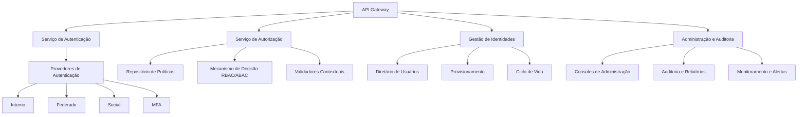

# Plano de Implementação Final do IAM

## 1. Introdução

Este documento apresenta o plano de implementação final para o módulo de Gestão de Identidade e Acesso (IAM) da plataforma INNOVABIZ. O plano integra todos os componentes documentados anteriormente e estabelece um roteiro claro para a implementação completa do módulo IAM, abordando requisitos técnicos, operacionais, de segurança e conformidade.

O módulo IAM é um componente crítico e transversal da plataforma INNOVABIZ, fornecendo serviços de autenticação, autorização, gestão de identidades e controle de acesso para todos os outros módulos da plataforma. A implementação abrange todas as regiões de operação (UE/Portugal, Brasil, África/Angola, EUA) e incorpora requisitos específicos de cada região, incluindo conformidade regulatória, considerações culturais e infraestruturais.

## 2. Visão Geral da Arquitetura

### 2.1 Arquitetura de Alto Nível

O módulo IAM da plataforma INNOVABIZ segue uma arquitetura moderna baseada em microserviços, com os seguintes componentes principais:

### 2.2 Componentes Principais

| Componente | Descrição | Tecnologias |
|------------|-----------|-------------|
| **API Gateway** | Ponto de entrada unificado para todos os serviços IAM | KrakenD, GraphQL |
| **Serviço de Autenticação** | Gerencia autenticação de usuários e emissão de tokens | OAuth 2.1, OpenID Connect, SAML 2.0 |
| **Serviço de Autorização** | Implementa controle de acesso baseado em políticas | OPA (Open Policy Agent), XACML |
| **Gestão de Identidades** | Gerencia o ciclo de vida das identidades e entidades | SCIM 2.0, diretório customizado |
| **Provedores de Autenticação** | Métodos de autenticação suportados | FIDO2/WebAuthn, TOTP, SMS, Email |
| **Repositório de Políticas** | Armazena e gerencia políticas de acesso | Base de dados de políticas versionada |
| **Diretório de Usuários** | Armazenamento das identidades e atributos | PostgreSQL, Redis (cache) |
| **Monitoramento e Alertas** | Observabilidade e notificações | Prometheus, Grafana, Loki |
| **Auditoria e Relatórios** | Registro e análise de eventos | Elastic Stack, relatórios customizados |

### 2.3 Integrações com Outros Módulos

| Módulo | Pontos de Integração | Método |
|--------|----------------------|--------|
| **Healthcare** | Autenticação com contexto clínico, autorização baseada em relacionamento paciente-provedor | APIs RESTful, SMART on FHIR |
| **Sistema Regulatório Geoespacial** | Autorização baseada em jurisdição, visualização de compliance | APIs RESTful, compartilhamento de metadados |
| **Gateway de Pagamentos** | Autenticação forte para transações, autorização para operações financeiras | OAuth 2.0 com escopos financeiros |
| **CRM** | Integração de identidade de cliente, autenticação B2C | APIs RESTful, OIDC |
| **ERP** | Identidades corporativas, autorizações de processos de negócios | SAML 2.0, RBAC integrado |

## 3. Estratégia de Implementação

### 3.1 Princípios de Implementação

1. **Abordagem Incremental**: Implementação por fases, com entregas incrementais de valor
2. **Segurança por Design**: Segurança incorporada em todas as etapas do desenvolvimento
3. **Multi-Regional por Padrão**: Todos os componentes projetados para operação multi-regional desde o início
4. **Infraestrutura como Código**: Toda infraestrutura gerenciada através de IaC (Terraform)
5. **DevSecOps**: Integração contínua, entrega contínua e monitoramento automatizado
6. **Modularidade**: Componentes desenvolvidos com acoplamento fraco para facilitar evolução
7. **Rastreabilidade**: Logging abrangente e auditoria end-to-end

### 3.2 Estratégia de Multi-Tenancy

A plataforma INNOVABIZ utiliza uma estratégia de multi-tenancy híbrida, com os seguintes princípios aplicados ao módulo IAM:

| Aspecto | Abordagem | Justificativa |
|---------|-----------|---------------|
| **Modelo de Dados** | Database-per-Tenant para dados críticos; Schema-Sharing para dados não sensíveis | Isolamento de dados sensíveis; eficiência de recursos |
| **Políticas** | Hierarquia de políticas (globais → regionais → tenant → grupo → usuário) | Flexibilidade com governança centralizada |
| **Autenticação** | Branded por tenant com fluxos customizáveis | Experiência do usuário consistente com a marca |
| **Provisionamento** | API unificada com controles de isolamento | Operação simplificada com segurança |
| **Auditoria** | Logs segregados por tenant com capacidade de agregação | Conformidade e privacidade |

### 3.3 Considerações Regionais

| Região | Considerações Específicas | Adaptações |
|--------|---------------------------|------------|
| **UE/Portugal** | GDPR, eIDAS, NIS2 | Gestão granular de consentimento, suporte a identidades eIDAS, mecanismos avançados de privacidade |
| **Brasil** | LGPD, requisitos do Banco Central | Módulos específicos de compliance LGPD, integração com ICP-Brasil |
| **África/Angola** | PNDSB, infraestrutura emergente | Modos offline, sincronização otimizada, localização específica |
| **EUA** | Regulamentações setoriais (HIPAA, GLBA, etc.) | Frameworks de compliance específicos por setor, controles de privacidade estaduais |

## 4. Cronograma de Implementação

### 4.1 Visão Geral das Fases

| Fase | Descrição | Duração | Entregáveis Principais |
|------|-----------|---------|------------------------|
| **Fase 1: Fundação** | Implementação dos componentes core de autenticação e autorização | 3 meses | Serviço de autenticação básico, integração de diretório, API Gateway |
| **Fase 2: Expansão** | Adição de recursos avançados e integração com módulos principais | 3 meses | MFA, federação, integração Healthcare e ERP |
| **Fase 3: Regionalização** | Implementação completa multi-regional e configurações específicas | 2 meses | Instâncias regionais, configurações jurisdicionais |
| **Fase 4: Avançada** | Recursos de segurança avançados e otimizações | 2 meses | Análise comportamental, controles adaptativos |
| **Fase 5: Operacionalização** | Implementação de ferramentas e processos operacionais | 2 meses | Dashboards operacionais, automação de resposta |

### 4.2 Marcos Principais

| Marco | Data Prevista | Critério de Conclusão |
|-------|---------------|------------------------|
| **M1: Autenticação Básica** | Semana 6 | Serviço de autenticação funcional com OAuth 2.0 e OpenID Connect |
| **M2: Estrutura de Políticas** | Semana 10 | Framework RBAC/ABAC implementado com repositório de políticas |
| **M3: Gestão de Identidades** | Semana 14 | APIs de gerenciamento de usuários e grupos com ciclo de vida completo |
| **M4: Autenticação Avançada** | Semana 18 | Suporte a MFA, SSO e federação de identidades |
| **M5: Implantação Multi-Regional** | Semana 26 | Instâncias funcionais em todas as regiões alvo |
| **M6: Integração Completa** | Semana 34 | Integração com todos os módulos INNOVABIZ |
| **M7: Operacionalização** | Semana 44 | Ferramentas e processos operacionais implementados |
| **M8: Conformidade Validada** | Semana 48 | Validação de conformidade para todas as regiões |

## 5. Fase 1: Fundação (Meses 1-3)

### 5.1 Objetivos da Fase

- Estabelecer a infraestrutura base do IAM em ambiente de desenvolvimento
- Implementar serviços core de autenticação e autorização
- Configurar APIs e integrações básicas
- Estabelecer pipeline de CI/CD e práticas de DevSecOps

### 5.2 Atividades e Cronograma

| Semana | Atividades | Responsáveis | Dependências |
|--------|------------|--------------|--------------|
| 1-2 | Configuração de infraestrutura e ambientes | Equipe DevOps | Nenhuma |
| 3-4 | Implementação do serviço básico de autenticação | Equipe de Desenvolvimento | Infraestrutura pronta |
| 5-6 | Implementação de OAuth 2.0 e OpenID Connect | Equipe de Desenvolvimento | Serviço básico de autenticação |
| 7-8 | Desenvolvimento do diretório de usuários | Equipe de Desenvolvimento | Modelo de dados finalizado |
| 9-10 | Implementação do mecanismo básico de políticas | Equipe de Desenvolvimento | API Gateway funcional |
| 11-12 | Desenvolvimento da API de administração | Equipe de Desenvolvimento | Diretório de usuários, mecanismo de políticas |

### 5.3 Entregáveis

1. **Infraestrutura do IAM**
   - Ambientes de desenvolvimento, teste e homologação configurados
   - Pipeline de CI/CD estabelecido
   - Repositórios e gestão de código configurados

2. **Serviço de Autenticação**
   - Implementação de OAuth 2.0 e OpenID Connect
   - Endpoints de autenticação básica
   - Geração e validação de tokens JWT
   - Revogação e refresh de tokens

3. **Diretório de Usuários**
   - Esquema base de usuários, grupos e tenants
   - API para CRUD de entidades
   - Mecanismo de busca e filtragem
   - Camada de persistência segura

4. **Mecanismo de Políticas**
   - Implementação básica de RBAC
   - Estrutura para políticas ABAC
   - Avaliação e aplicação de políticas
   - Interfaces para gerenciamento de políticas

5. **Console de Administração**
   - Interface básica de administração
   - Funcionalidades de gerenciamento de usuários
   - Gestão básica de políticas
   - Relatórios básicos de auditoria
