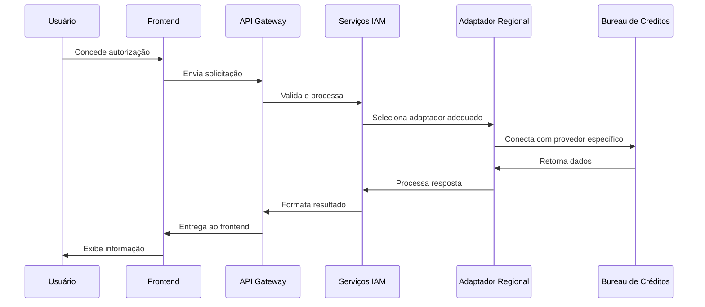
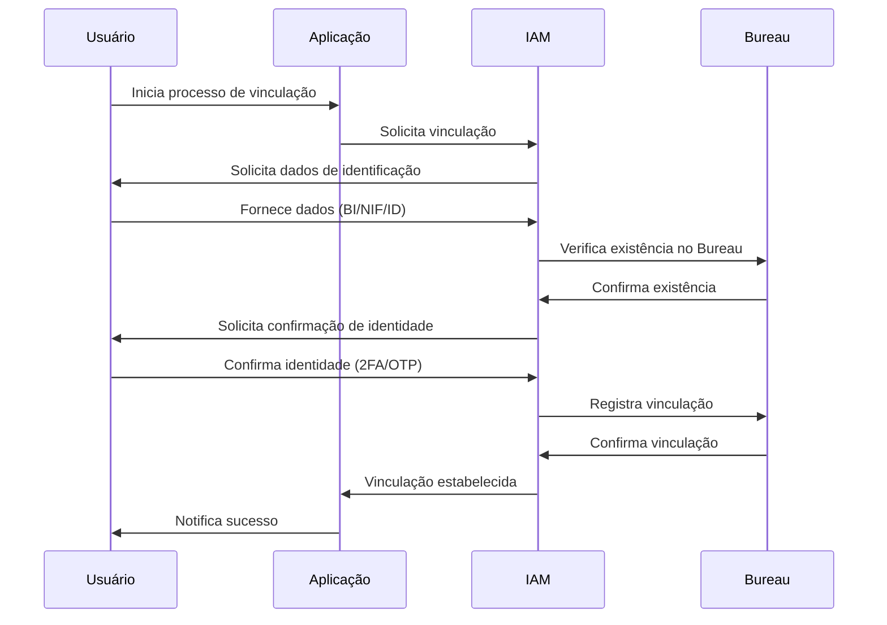
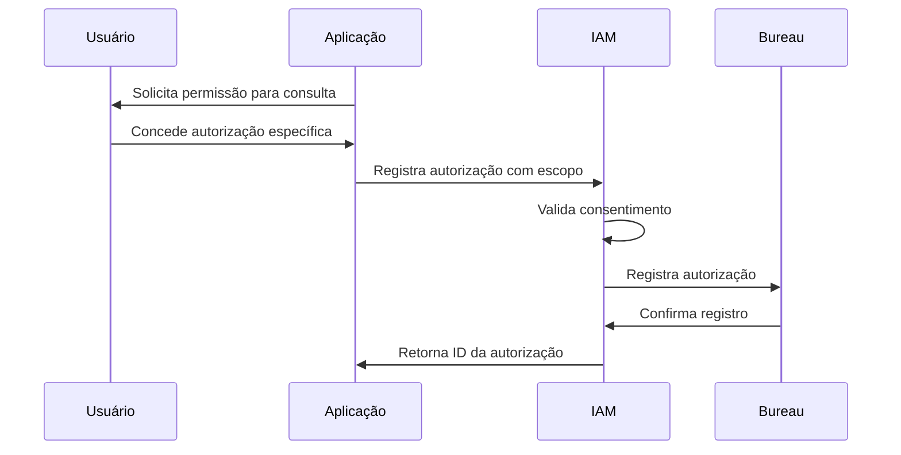
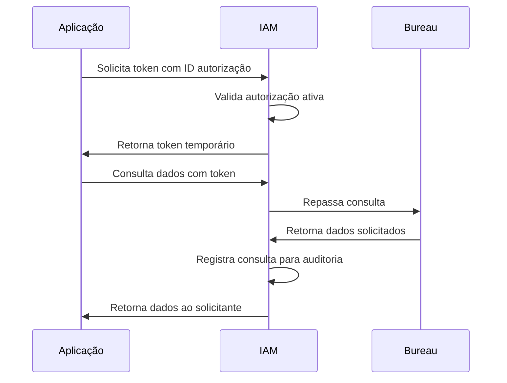

# Manual de Integração Bureau de Créditos
# Mercados PALOP e SADC

**Autor:** Eduardo Jeremias - InnovaBiz  
**Data:** 19/08/2025  
**Versão:** 1.0  
**Classificação:** Confidencial  

## Índice

1. [Introdução](#1-introdução)
2. [Arquitetura de Integração](#2-arquitetura-de-integração)
3. [Requisitos Regulatórios](#3-requisitos-regulatórios)
4. [Configuração por País](#4-configuração-por-país)
5. [APIs e Endpoints](#5-apis-e-endpoints)
6. [Autenticação e Autorização](#6-autenticação-e-autorização)
7. [Fluxos de Integração](#7-fluxos-de-integração)
8. [Adaptadores Regionais](#8-adaptadores-regionais)
9. [Casos de Uso](#9-casos-de-uso)
10. [Monitoramento e Observabilidade](#10-monitoramento-e-observabilidade)
11. [Troubleshooting](#11-troubleshooting)
12. [FAQ](#12-faq)
13. [Suporte](#13-suporte)

## 1. Introdução

Este manual fornece instruções detalhadas para a integração do módulo IAM da InnovaBiz com serviços de Bureau de Créditos nos mercados PALOP (Países Africanos de Língua Oficial Portuguesa) e SADC (Comunidade de Desenvolvimento da África Austral). O documento é destinado a desenvolvedores, arquitetos de sistemas e equipes de integração que necessitam implementar conexões seguras e conformes com estes serviços.

### 1.1. Escopo

Este manual abrange:

- Integração com serviços de Bureau de Créditos em Angola, Moçambique, Cabo Verde, Guiné-Bissau, São Tomé e Príncipe (PALOP)
- Integração com serviços de Bureau de Créditos na África do Sul, Namíbia, Botswana, Zimbabwe e outros países da SADC
- Configurações específicas por país e requisitos regulatórios
- Implementação de mecanismos de consentimento e autorização
- Gerenciamento de identidades e vínculos
- Especificações de API e exemplos de código

### 1.2. Benefícios da Integração

- **Verificação de Identidade:** Validação avançada de identidades de clientes
- **Avaliação de Risco:** Análise de histórico de crédito para decisões de crédito
- **Conformidade Regulatória:** Atendimento a requisitos KYC/AML específicos de cada mercado
- **Onboarding Digital:** Simplificação do processo de cadastro de clientes
- **Redução de Fraudes:** Identificação de padrões suspeitos e prevenção de fraudes

### 1.3. Terminologia

| Termo | Definição |
|-------|-----------|
| Bureau de Créditos | Entidade que mantém registros de histórico de crédito de consumidores e empresas |
| Vinculação | Relacionamento estabelecido entre uma identidade no IAM e um registro no Bureau |
| Autorização | Permissão explícita concedida pelo usuário para consulta ao Bureau |
| Token de Acesso | Credencial temporária que permite acesso aos serviços do Bureau |
| Multi-tenant | Arquitetura que permite separação lógica completa entre diferentes organizações |
| PALOP | Países Africanos de Língua Oficial Portuguesa |
| SADC | Comunidade de Desenvolvimento da África Austral |## 2. Arquitetura de Integração

A integração entre o módulo IAM e os serviços de Bureau de Créditos segue uma arquitetura multicamadas com adaptadores específicos por região e país.

### 2.1. Visão Geral


A arquitetura de integração consiste em:

1. **Camada de Frontend:** Interfaces web e mobile para interação com usuários
2. **Camada de API Gateway:** Krakend como gateway de API para roteamento e segurança
3. **Camada de Serviços:** Microserviços para lógica de negócios e orquestração
4. **Camada de Adaptadores:** Conectores específicos para cada provedor de Bureau
5. **Camada de Persistência:** Armazenamento seguro de autorizações, tokens e histórico

### 2.2. Fluxo de Dados



### 2.3. Padrão Multi-tenant

Todas as integrações implementam isolamento completo por tenant, com:

- Configurações específicas por tenant
- Segredos e chaves isolados
- Logs separados
- Métricas segregadas
- Controles de acesso independentes

## 3. Requisitos Regulatórios

A integração com Bureaus de Crédito deve atender aos requisitos regulatórios específicos de cada região.

### 3.1. Requisitos Comuns

Todos os países PALOP e SADC exigem:

- **Consentimento Explícito:** Autorização documentada do titular dos dados
- **Propósito Limitado:** Finalidade específica e documentada para cada consulta
- **Registro de Auditoria:** Histórico completo de todas as consultas realizadas
- **Prazo de Retenção:** Limitação do tempo de armazenamento dos dados
- **Segurança:** Criptografia e controles de acesso para proteção dos dados### 3.2. Requisitos Específicos por País

#### 3.2.1. Angola

- **Base Legal:** Lei 22/11 - Lei das Instituições Financeiras, Aviso 12/2016 do BNA
- **Entidade Reguladora:** Banco Nacional de Angola (BNA)
- **Exigências Específicas:**
  - Comunicação mensal de operações ao BNA
  - Proteção de dados conforme Lei 22/11
  - Armazenamento de registros por 5 anos
  - Notificação obrigatória ao cliente antes da consulta
  - Relatórios de atividade trimestrais ao BNA

#### 3.2.2. Moçambique

- **Base Legal:** Lei 15/2020, Aviso 10/GBM/2016
- **Entidade Reguladora:** Banco de Moçambique
- **Exigências Específicas:**
  - Consentimento em português e línguas locais
  - Registro de operações por 7 anos
  - Certificação de segurança pelo Banco de Moçambique
  - Autenticação multi-fator para operadores

#### 3.2.3. África do Sul

- **Base Legal:** National Credit Act, POPIA
- **Entidade Reguladora:** National Credit Regulator, Information Regulator
- **Exigências Específicas:**
  - Conformidade com POPIA para processamento de dados
  - Armazenamento de registros por 5 anos
  - Direito de acesso e correção pelo titular
  - Regras de prescrição para informações negativas
  - Relatórios de atividade ao National Credit Regulator

#### 3.2.4. Outros países PALOP

- **Cabo Verde:** Lei das Instituições de Crédito, supervisão pelo Banco de Cabo Verde
- **Guiné-Bissau:** Regulamentações do BCEAO, conformidade com UEMOA
- **São Tomé e Príncipe:** Lei 9/2018, supervisão pelo Banco Central

#### 3.2.5. Outros países SADC

- **Namíbia:** Banking Institutions Act, Payment System Management Act
- **Botswana:** Credit Information Act, Data Protection Act
- **Zimbabwe:** Credit Registry Act, Banking Act

## 4. Configuração por País

### 4.1. Configuração para Angola

```json
{
  "country": "Angola",
  "bureau_providers": [
    {
      "name": "CIRC-BNA",
      "adapter": "angola_bna_adapter",
      "endpoint": "https://circ.bna.ao/api/v2/",
      "required_fields": ["bi_number", "nif", "full_name", "birth_date"],
      "optional_fields": ["phone", "address", "employer"],
      "retention_period_days": 1825,
      "consent_validity_days": 90,
      "notification_required": true
    }
  ],
  "regulatory_settings": {
    "bna_reporting_enabled": true,
    "bna_reporting_frequency": "monthly",
    "data_residency": "local"
  }
}
```### 4.2. Configuração para Moçambique

```json
{
  "country": "Mozambique",
  "bureau_providers": [
    {
      "name": "CIC-BM",
      "adapter": "mozambique_bm_adapter",
      "endpoint": "https://cic.bancomoc.mz/api/v1/",
      "required_fields": ["nuit", "bi_number", "full_name", "birth_date"],
      "optional_fields": ["phone", "address", "employer"],
      "retention_period_days": 2555,
      "consent_validity_days": 60,
      "notification_required": true
    },
    {
      "name": "CreditInfo Moçambique",
      "adapter": "mozambique_creditinfo_adapter",
      "endpoint": "https://api.creditinfo.co.mz/v3/",
      "required_fields": ["nuit", "bi_number", "full_name", "birth_date"],
      "optional_fields": ["phone", "address", "employer"],
      "retention_period_days": 2555,
      "consent_validity_days": 60,
      "notification_required": true
    }
  ],
  "regulatory_settings": {
    "bm_reporting_enabled": true,
    "bm_reporting_frequency": "quarterly",
    "data_residency": "local",
    "multi_language_consent": true,
    "supported_languages": ["pt", "xi", "ny", "sw"]
  }
}
```

### 4.3. Configuração para África do Sul

```json
{
  "country": "South Africa",
  "bureau_providers": [
    {
      "name": "TransUnion South Africa",
      "adapter": "sa_transunion_adapter",
      "endpoint": "https://api.transunion.co.za/v2/",
      "required_fields": ["id_number", "full_name", "birth_date"],
      "optional_fields": ["phone", "address", "employer"],
      "retention_period_days": 1825,
      "consent_validity_days": 30,
      "notification_required": true
    },
    {
      "name": "Experian South Africa",
      "adapter": "sa_experian_adapter",
      "endpoint": "https://api.experian.co.za/v2/",
      "required_fields": ["id_number", "full_name", "birth_date"],
      "optional_fields": ["phone", "address", "employer"],
      "retention_period_days": 1825,
      "consent_validity_days": 30,
      "notification_required": true
    }
  ],
  "regulatory_settings": {
    "ncr_reporting_enabled": true,
    "ncr_reporting_frequency": "monthly",
    "popia_compliance": true,
    "data_residency": "local",
    "multi_language_consent": true,
    "supported_languages": ["en", "af", "zu", "xh", "st"]
  }
}
```## 5. APIs e Endpoints

### 5.1. Visão Geral da API

A integração com o Bureau de Créditos é disponibilizada através de APIs GraphQL e REST, com o GraphQL sendo o método preferencial para consultas complexas. Todas as APIs são versionadas e seguem os princípios de design REST ou GraphQL conforme apropriado.

### 5.2. Base URLs

| Ambiente | URL Base |
|----------|----------|
| Desenvolvimento | `https://api-dev.innovabiz.com/bureau/` |
| Homologação | `https://api-hml.innovabiz.com/bureau/` |
| Produção | `https://api.innovabiz.com/bureau/` |

### 5.3. GraphQL Endpoints

#### 5.3.1. Endpoint Principal

```
POST /graphql
```

Headers obrigatórios:
- `Authorization: Bearer {token}`
- `Content-Type: application/json`
- `X-Tenant-ID: {tenant_id}`
- `X-Bureau-Provider: {provider_id}`

#### 5.3.2. Principais Queries

```graphql
query GetCreditScore($userId: ID!, $authorizationId: ID!) {
  bureauCreditScore(userId: $userId, authorizationId: $authorizationId) {
    score
    scoreRange {
      min
      max
    }
    riskCategory
    lastUpdate
    scoreFactors {
      factor
      impact
    }
  }
}

query GetPaymentHistory($userId: ID!, $authorizationId: ID!, $period: Int = 24) {
  bureauPaymentHistory(
    userId: $userId,
    authorizationId: $authorizationId,
    monthsBack: $period
  ) {
    accounts {
      accountId
      accountType
      institution
      openDate
      status
      balance
      payments {
        dueDate
        paymentDate
        amountDue
        amountPaid
        status
      }
    }
  }
}
```

#### 5.3.3. Principais Mutations

```graphql
mutation CreateBureauIdentityLink($input: CreateIdentityLinkInput!) {
  createBureauIdentityLink(input: $input) {
    link {
      id
      userId
      bureauId
      provider
      status
      createdAt
    }
    errors {
      code
      message
    }
  }
}

mutation CreateBureauAuthorization($input: CreateAuthorizationInput!) {
  createBureauAuthorization(input: $input) {
    authorization {
      id
      linkId
      purpose
      scope
      expiresAt
      status
    }
    errors {
      code
      message
    }
  }
}

mutation GenerateBureauAccessToken($authorizationId: ID!) {
  generateBureauAccessToken(authorizationId: $authorizationId) {
    token {
      accessToken
      expiresAt
      scope
    }
    errors {
      code
      message
    }
  }
}
```### 5.4. REST Endpoints

Para compatibilidade com sistemas legados e integrações simples, também oferecemos uma API REST:

#### 5.4.1. Vínculos de Identidade

```
POST /api/v1/bureau/identity-links
GET /api/v1/bureau/identity-links
GET /api/v1/bureau/identity-links/{id}
DELETE /api/v1/bureau/identity-links/{id}
```

#### 5.4.2. Autorizações

```
POST /api/v1/bureau/authorizations
GET /api/v1/bureau/authorizations
GET /api/v1/bureau/authorizations/{id}
DELETE /api/v1/bureau/authorizations/{id}
```

#### 5.4.3. Tokens de Acesso

```
POST /api/v1/bureau/tokens
GET /api/v1/bureau/tokens
DELETE /api/v1/bureau/tokens/{id}
```

#### 5.4.4. Consultas

```
GET /api/v1/bureau/credit-score/{userId}
GET /api/v1/bureau/payment-history/{userId}
GET /api/v1/bureau/credit-report/{userId}
```

## 6. Autenticação e Autorização

### 6.1. Modelo de Autenticação

O acesso às APIs do Bureau de Créditos requer autenticação em duas camadas:

1. **Autenticação da Aplicação/Sistema:** Via tokens JWT com chaves assimétricas
2. **Autenticação do Usuário Final:** Via tokens de autorização específicos para Bureau

### 6.2. Fluxo de Autorização

A autorização para acesso aos dados do Bureau segue o seguinte fluxo:

1. **Vinculação de Identidade:** Estabelecimento do vínculo entre a identidade no IAM e o Bureau
2. **Consentimento Explícito:** Obtenção e registro do consentimento do usuário
3. **Criação de Autorização:** Registro de uma autorização com escopo e finalidade específicos
4. **Geração de Token:** Criação de um token temporário para acesso aos dados
5. **Consulta com Token:** Utilização do token para realizar a consulta específica

### 6.3. Escopos de Acesso

| Escopo | Descrição |
|--------|-----------|
| `bureau:identity:read` | Leitura de dados básicos de identificação |
| `bureau:score:read` | Leitura de score de crédito |
| `bureau:history:read` | Leitura de histórico de pagamentos |
| `bureau:report:read` | Leitura de relatório de crédito completo |
| `bureau:alerts:read` | Leitura de alertas cadastrados |
| `bureau:identity:write` | Atualização de dados de identificação |## 7. Fluxos de Integração

### 7.1. Fluxo de Vinculação de Identidade



### 7.2. Fluxo de Autorização



### 7.3. Fluxo de Consulta



## 8. Adaptadores Regionais

O sistema utiliza adaptadores específicos para cada provedor de Bureau de Créditos, abstraindo as diferenças de implementação.

### 8.1. Estrutura de Adaptadores

```typescript
interface BureauAdapter {
  // Métodos obrigatórios
  createIdentityLink(identityData: IdentityData): Promise<LinkResult>;
  validateIdentity(linkId: string, validationData: any): Promise<ValidationResult>;
  registerAuthorization(linkId: string, purpose: string, scope: string[]): Promise<AuthorizationResult>;
  getCreditScore(authorizationId: string): Promise<CreditScoreResult>;
  getPaymentHistory(authorizationId: string, period?: number): Promise<PaymentHistoryResult>;
  getCreditReport(authorizationId: string): Promise<CreditReportResult>;
  
  // Métodos opcionais específicos por região
  registerNotification?(linkId: string, type: string): Promise<NotificationResult>;
  getAlerts?(authorizationId: string): Promise<AlertsResult>;
}
```### 8.2. Adaptadores Disponíveis

#### 8.2.1. Angola

- **angola_bna_adapter:** Adaptador para Central de Informação e Risco de Crédito do BNA
- **angola_creditinfo_adapter:** Adaptador para CreditInfo Angola

#### 8.2.2. Moçambique

- **mozambique_bm_adapter:** Adaptador para Central de Informação de Crédito do Banco de Moçambique
- **mozambique_creditinfo_adapter:** Adaptador para CreditInfo Moçambique

#### 8.2.3. África do Sul

- **sa_transunion_adapter:** Adaptador para TransUnion África do Sul
- **sa_experian_adapter:** Adaptador para Experian África do Sul
- **sa_compuscan_adapter:** Adaptador para Compuscan África do Sul

#### 8.2.4. Outros Países

- **namibia_creditbureau_adapter:** Adaptador para TransUnion Namíbia
- **botswana_transunion_adapter:** Adaptador para TransUnion Botswana
- **zimbabwe_creditbureau_adapter:** Adaptador para Credit Bureau Zimbabwe

### 8.3. Configuração de Adaptador

Cada adaptador requer configuração específica conforme o provedor:

```typescript
// Exemplo de configuração para Angola BNA
const angolaBnaConfig = {
  adapter: "angola_bna_adapter",
  apiKey: process.env.BNA_API_KEY,
  apiSecret: process.env.BNA_API_SECRET,
  endpoint: "https://circ.bna.ao/api/v2/",
  timeout: 30000, // ms
  retryAttempts: 3,
  certPath: "/path/to/certificate.pem",
  reportingEnabled: true
};

// Inicialização do adaptador
const angolaBnaAdapter = new AngolaBnaAdapter(angolaBnaConfig);
```

## 9. Casos de Uso

### 9.1. Onboarding Digital

Implementação do fluxo de onboarding digital com verificação de identidade e análise de crédito:

```typescript
// 1. Criar vínculo de identidade
const linkResult = await bureauService.createIdentityLink({
  userId: "user-12345",
  documentType: "BI",
  documentNumber: "123456789LA042",
  fullName: "João Manuel Silva",
  birthDate: "1985-10-15",
  bureauProvider: "CIRC-BNA"
});

// 2. Solicitar autorização para verificação de identidade
const authResult = await bureauService.createAuthorization({
  linkId: linkResult.linkId,
  purpose: "identity_verification",
  scope: ["bureau:identity:read"],
  validityDays: 1
});

// 3. Verificar identidade
const verificationResult = await bureauService.verifyIdentity(
  authResult.authorizationId
);

if (verificationResult.verified) {
  // Prosseguir com onboarding
}
```### 9.2. Avaliação de Crédito

Implementação de fluxo para avaliação de crédito de um cliente:

```typescript
// 1. Obter autorização para consulta de crédito
const authResult = await bureauService.createAuthorization({
  linkId: existingLinkId,
  purpose: "credit_evaluation",
  scope: ["bureau:score:read", "bureau:history:read"],
  validityDays: 30
});

// 2. Gerar token de acesso
const tokenResult = await bureauService.generateAccessToken(
  authResult.authorizationId
);

// 3. Consultar score de crédito
const scoreResult = await bureauService.getCreditScore({
  authorizationId: authResult.authorizationId,
  accessToken: tokenResult.accessToken
});

// 4. Consultar histórico de pagamentos
const historyResult = await bureauService.getPaymentHistory({
  authorizationId: authResult.authorizationId,
  accessToken: tokenResult.accessToken,
  period: 24 // últimos 24 meses
});

// 5. Tomar decisão de crédito com base nos resultados
const creditDecision = creditEngine.evaluateApplication({
  bureauScore: scoreResult.score,
  bureauScoreMax: scoreResult.scoreRange.max,
  paymentHistory: historyResult.accounts,
  // Outros critérios internos
});
```

### 9.3. Monitoramento de Crédito

Implementação de monitoramento contínuo do perfil de crédito de um cliente:

```typescript
// 1. Criar autorização de longa duração para monitoramento
const authResult = await bureauService.createAuthorization({
  linkId: existingLinkId,
  purpose: "credit_monitoring",
  scope: ["bureau:alerts:read", "bureau:score:read"],
  validityDays: 365 // 1 ano
});

// 2. Configurar alertas
await bureauService.configureAlerts({
  authorizationId: authResult.authorizationId,
  alertTypes: [
    "score_decrease",
    "new_account",
    "payment_delay",
    "inquiry"
  ],
  notificationChannel: "webhook",
  notificationEndpoint: "https://api.client.com/webhooks/bureau-alerts"
});

// 3. Verificar alertas periodicamente
schedule.daily(async () => {
  const alerts = await bureauService.getAlerts(
    authResult.authorizationId
  );
  
  if (alerts.hasNewAlerts) {
    await notificationService.notifyUser(
      userId,
      "Novos alertas de crédito disponíveis"
    );
  }
});
```## 10. Monitoramento e Observabilidade

### 10.1. Métricas

Todas as integrações com Bureau de Créditos geram métricas que podem ser monitoradas:

| Métrica | Descrição |
|---------|-----------|
| `bureau_request_count` | Número total de requisições ao Bureau |
| `bureau_request_latency` | Latência das requisições (ms) |
| `bureau_request_error_rate` | Taxa de erro nas requisições |
| `bureau_authorization_count` | Número de autorizações criadas |
| `bureau_token_generated_count` | Número de tokens gerados |
| `bureau_token_error_count` | Número de erros de validação de token |

As métricas são disponibilizadas nos formatos:

- Prometheus (endpoint `/metrics`)
- JSON (endpoint `/api/v1/metrics`)
- Grafana Dashboard (pré-configurado)

### 10.2. Logs

Os logs relacionados às integrações com Bureau são estruturados e contém:

```json
{
  "timestamp": "2025-08-19T14:37:22.123Z",
  "level": "info",
  "service": "bureau-integration",
  "tenant_id": "tenant-123",
  "user_id": "user-456",
  "event": "bureau_request",
  "provider": "CIRC-BNA",
  "operation": "getCreditScore",
  "authorization_id": "auth-789",
  "request_id": "req-012",
  "duration_ms": 345,
  "status": "success"
}
```

Os logs são exportados para:
- Elasticsearch
- Loki
- CloudWatch (AWS)
- Log Analytics (Azure)

### 10.3. Alertas

Os seguintes alertas são configurados por padrão:

- Taxa de erro > 5% em um período de 5 minutos
- Latência média > 2000ms em um período de 5 minutos
- Falha consecutiva em > 3 requisições ao mesmo provedor
- Rejeição de token > 10 vezes em um período de 1 hora

## 11. Troubleshooting

### 11.1. Códigos de Erro

| Código | Descrição | Resolução |
|--------|-----------|-----------|
| `BUREAU_001` | Falha na autenticação com o Bureau | Verificar credenciais e certificados |
| `BUREAU_002` | Usuário não encontrado no Bureau | Verificar dados de identificação |
| `BUREAU_003` | Autorização inválida ou expirada | Criar nova autorização |
| `BUREAU_004` | Token inválido ou expirado | Gerar novo token de acesso |
| `BUREAU_005` | Limite de consultas excedido | Aguardar próximo ciclo ou solicitar aumento |
| `BUREAU_006` | Dados inconsistentes | Verificar dados de identificação |
| `BUREAU_007` | Timeout na comunicação | Tentar novamente ou verificar conectividade |
| `BUREAU_008` | Provedor não disponível | Verificar status do serviço do Bureau |
| `BUREAU_009` | Erro interno do adaptador | Contatar suporte técnico |
| `BUREAU_010` | Consentimento não registrado ou expirado | Obter novo consentimento do usuário |

### 11.2. Logs de Diagnóstico

Para habilitar logs de diagnóstico detalhados:

```typescript
bureauService.setLogLevel('debug');
```

Exemplo de saída de log de diagnóstico:

```
[DEBUG] 2025-08-19T14:37:22.123Z - BureauAdapter:angola_bna_adapter - Iniciando solicitação HTTP
[DEBUG] 2025-08-19T14:37:22.234Z - BureauAdapter:angola_bna_adapter - Headers: {"Authorization": "Bearer ***", "Content-Type": "application/json"}
[DEBUG] 2025-08-19T14:37:22.345Z - BureauAdapter:angola_bna_adapter - Payload: {"id": "***", "requestType": "score"}
[DEBUG] 2025-08-19T14:37:22.678Z - BureauAdapter:angola_bna_adapter - Resposta recebida: Status 200
[DEBUG] 2025-08-19T14:37:22.789Z - BureauService - Transformando resposta para formato padrão
```## 12. FAQ

### 12.1. Questões Gerais

**P: Quais são os pré-requisitos para integração com Bureau de Créditos?**  
R: Sua organização precisa:
- Ter contrato com provedor de Bureau na região desejada
- Possuir certificados digitais válidos para autenticação
- Implementar os requisitos regulatórios da região
- Ter políticas de privacidade e termos de uso adequados

**P: Quanto tempo leva para implementar a integração?**  
R: O tempo médio varia de 2 a 8 semanas, dependendo da complexidade da integração e dos requisitos específicos do país.

**P: É possível integrar com múltiplos provedores de Bureau simultaneamente?**  
R: Sim, o sistema suporta integração simultânea com múltiplos provedores, utilizando adaptadores específicos para cada um.

**P: Como garantir a conformidade com leis de proteção de dados?**  
R: O sistema implementa:
- Consentimento explícito e específico
- Propósito limitado para cada consulta
- Controles de acesso granulares
- Registro de auditoria completo
- Criptografia de dados em trânsito e repouso

### 12.2. Questões Técnicas

**P: Como lidar com diferenças de formatos de dados entre países?**  
R: Os adaptadores regionais abstraem as diferenças de formato, padronizando as respostas para um formato comum na plataforma.

**P: O que fazer quando um provedor de Bureau está indisponível?**  
R: O sistema implementa mecanismos de retry com backoff exponencial e, quando configurado com múltiplos provedores, pode alternar automaticamente entre eles.

**P: Como testar a integração sem acessar dados reais?**  
R: Fornecemos ambientes de sandbox para cada provedor, com dados fictícios que simulam os diferentes cenários possíveis.

**P: Como monitorar o desempenho e disponibilidade das integrações?**  
R: Utilize os dashboards Grafana pré-configurados e configure alertas para as métricas principais como latência e taxa de erro.

**P: Quais são os limites de taxa (rate limits) para as APIs?**  
R: Os limites variam por provedor e por nível de serviço. Consulte a documentação específica de cada provedor e implemente mecanismos de throttling apropriados.

## 13. Suporte

### 13.1. Canais de Suporte

| Canal | Descrição | Contato |
|-------|-----------|---------|
| Portal de Desenvolvedores | Documentação, exemplos e SDKs | [developers.innovabiz.com](https://developers.innovabiz.com) |
| Email de Suporte | Suporte técnico por email | support@innovabiz.com |
| Telefone | Suporte técnico por telefone | +244 923 456 789 |
| Slack | Canal para parceiros | [Solicitar acesso](https://innovabiz.com/partners/slack) |

### 13.2. Suporte por País

#### 13.2.1. Angola
- Email: angola-support@innovabiz.com
- Telefone: +244 923 456 789
- Horário: 08:00 - 17:00 WAT (Segunda a Sexta)

#### 13.2.2. Moçambique
- Email: mozambique-support@innovabiz.com
- Telefone: +258 84 123 4567
- Horário: 08:00 - 17:00 CAT (Segunda a Sexta)

#### 13.2.3. África do Sul
- Email: southafrica-support@innovabiz.com
- Telefone: +27 10 123 4567
- Horário: 08:00 - 17:00 SAST (Segunda a Sexta)

### 13.3. Processo de Escalonamento

Para problemas críticos que requerem escalonamento:

1. Abra um ticket prioritário via portal de suporte
2. Inclua "URGENTE" no assunto do email
3. Ligue para a linha de suporte e informe o número do ticket
4. Para incidentes de produção, utilize o código "PRODDOWN" para escalonamento imediato

---

## Controle de Versões

| Versão | Data | Autor | Descrição |
|--------|------|-------|-----------|
| 1.0 | 19/08/2025 | Eduardo Jeremias | Versão inicial |
| 0.9 | 05/08/2025 | Equipe IAM | Versão draft para revisão |
| 0.8 | 20/07/2025 | Equipe IAM | Especificações técnicas iniciais |

---

© 2025 InnovaBiz. Todos os direitos reservados.