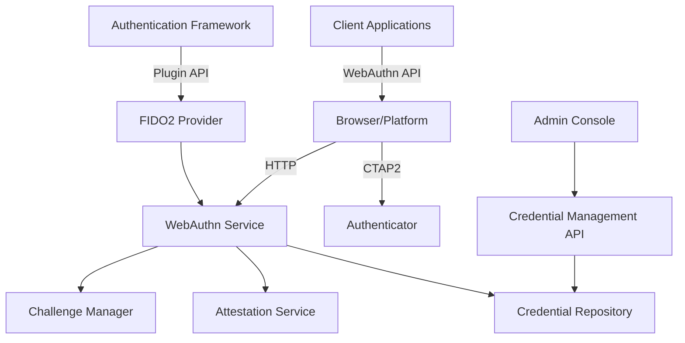

# FIDO2/WebAuthn Authentication Provider

## Overview

The FIDO2/WebAuthn Authentication Provider is a high-assurance authentication plugin for the INNOVABIZ IAM module. It leverages the FIDO2 WebAuthn standard to provide passwordless and/or multi-factor authentication using platform authenticators (such as Windows Hello, Apple Touch ID) and roaming authenticators (such as security keys).

This implementation follows the W3C WebAuthn Level 2 specification and provides phishing-resistant, hardware-backed authentication capabilities.

## Features

- **Passwordless Authentication**: Support for single-factor passwordless flows
- **Multi-factor Authentication**: Use as a second factor with another authentication method
- **Cross-Platform Support**: Works across browsers, operating systems, and devices
- **Attestation Support**: Optional verification of authenticator security properties
- **User Verification**: Support for user presence and user verification
- **Credential Management**: Full lifecycle management for FIDO2 credentials
- **Regional Adaptations**: Specific configurations for each target region

## Integration Points

- **IAM Core**: Integrates with Authentication Orchestrator for multi-factor flows
- **Risk Engine**: Provides context for adaptive authentication decisions
- **Audit System**: Comprehensive logging of all FIDO2 operations
- **User Management**: Registration and management of FIDO2 credentials

## Technical Specifications

- **Standard Compliance**: W3C WebAuthn Level 2, FIDO2 CTAP2
- **Algorithms Supported**: ES256, RS256, EdDSA
- **Attestation Formats**: Packed, TPM, Android Key, Android SafetyNet, Apple
- **Transport Methods**: USB, NFC, BLE, internal
- **Platform Support**: All major browsers on desktop and mobile

## Implementation Details

The implementation consists of:

1. **Backend Service**: NodeJS implementation of WebAuthn server operations
2. **Client Libraries**: JavaScript implementation for browsers, React Native for mobile
3. **Database Schema**: PostgreSQL schema for credential storage
4. **Admin Interface**: Management console for FIDO2 credential administration

## Architecture



## Usage Examples

### Registration Flow

```javascript
// Example client-side code for registration
async function registerFido2Credential() {
  // 1. Request challenge from server
  const challengeResponse = await fetch('/api/auth/fido2/register/start', {
    method: 'POST',
    headers: { 'Content-Type': 'application/json' },
    body: JSON.stringify({ userId: 'user123' })
  });
  const options = await challengeResponse.json();
  
  // 2. Create credential using WebAuthn API
  const credential = await navigator.credentials.create({
    publicKey: options
  });
  
  // 3. Send credential to server for verification
  const verificationResponse = await fetch('/api/auth/fido2/register/complete', {
    method: 'POST',
    headers: { 'Content-Type': 'application/json' },
    body: JSON.stringify({
      userId: 'user123',
      credential: {
        id: credential.id,
        rawId: Array.from(new Uint8Array(credential.rawId)),
        response: {
          attestationObject: Array.from(new Uint8Array(credential.response.attestationObject)),
          clientDataJSON: Array.from(new Uint8Array(credential.response.clientDataJSON))
        },
        type: credential.type
      }
    })
  });
  
  const result = await verificationResponse.json();
  return result.success;
}
```

### Authentication Flow

```javascript
// Example client-side code for authentication
async function authenticateWithFido2() {
  // 1. Request challenge from server
  const challengeResponse = await fetch('/api/auth/fido2/authenticate/start', {
    method: 'POST',
    headers: { 'Content-Type': 'application/json' },
    body: JSON.stringify({ userId: 'user123' })
  });
  const options = await challengeResponse.json();
  
  // 2. Get credential using WebAuthn API
  const assertion = await navigator.credentials.get({
    publicKey: options
  });
  
  // 3. Send assertion to server for verification
  const verificationResponse = await fetch('/api/auth/fido2/authenticate/complete', {
    method: 'POST',
    headers: { 'Content-Type': 'application/json' },
    body: JSON.stringify({
      userId: 'user123',
      assertion: {
        id: assertion.id,
        rawId: Array.from(new Uint8Array(assertion.rawId)),
        response: {
          authenticatorData: Array.from(new Uint8Array(assertion.response.authenticatorData)),
          clientDataJSON: Array.from(new Uint8Array(assertion.response.clientDataJSON)),
          signature: Array.from(new Uint8Array(assertion.response.signature)),
          userHandle: assertion.response.userHandle ? 
            Array.from(new Uint8Array(assertion.response.userHandle)) : null
        },
        type: assertion.type
      }
    })
  });
  
  const result = await verificationResponse.json();
  return result.success;
}
```

## Security Considerations

### Credential Storage

FIDO2 credentials are stored securely in the database:

- Public key credentials stored in PostgreSQL
- No private keys are ever stored on the server
- Credential IDs are encrypted at rest
- Challenge secrets stored in Redis with short TTL

### Attestation Verification

The implementation supports attestation verification to ensure the security properties of authenticators:

- Root certificates for major authenticator manufacturers
- Verification of attestation statements
- Support for metadata service (FIDO MDS)
- Policy-based attestation requirements per tenant

### Additional Security Measures

- Strict origin checking
- User verification enforcement options
- Resident key support
- Authenticator attachment policies
- Rate limiting and anti-automation measures

## Regional Adaptations

### EU/Portugal (GDPR, eIDAS)

- Support for qualified FIDO2 authenticators under eIDAS
- Portuguese Cartão de Cidadão integration
- Compliance with GDPR for biometric data processing
- Support for EU Digital Identity Wallet (future)

### Brazil (LGPD)

- Integration with ICP-Brasil certificates
- Support for gov.br authentication
- LGPD-compliant consent management for biometric data
- Portuguese language support

### Africa/Angola (PNDSB)

- Optimized for limited connectivity scenarios
- Support for offline authentication when needed
- Lightweight client implementation for lower-end devices
- Compliance with emerging PNDSB requirements

### USA (NIST, HIPAA, PCI-DSS)

- Alignment with NIST SP 800-63-3 AAL3
- Healthcare-specific configurations for HIPAA
- Financial-sector configurations for PCI-DSS
- Support for US government PIV/CAC integration

## Multi-Tenant Considerations

The plugin supports multi-tenancy with the following features:

- Tenant-specific Relying Party IDs
- Customizable authentication policies per tenant
- Tenant-isolated credential storage
- Branding and customization options per tenant

## Installation

### Prerequisites

- Node.js 16+
- PostgreSQL 13+
- Redis 6+

### Installation Steps

1. Install the package:
   ```
   npm install @innovabiz/auth-plugin-fido2-webauthn
   ```

2. Register the plugin with the Authentication Framework:
   ```javascript
   const { registerPlugin } = require('@innovabiz/auth-framework');
   const Fido2Provider = require('@innovabiz/auth-plugin-fido2-webauthn');
   
   registerPlugin(new Fido2Provider({
     rpId: 'innovabiz.com',
     rpName: 'INNOVABIZ Platform',
     origin: 'https://innovabiz.com',
     timeout: 60000
   }));
   ```

3. Run database migrations:
   ```
   npx innovabiz-auth migrate --plugin fido2-webauthn
   ```

## Configuration Options

| Option | Description | Default | Required |
|--------|-------------|---------|----------|
| `rpId` | Relying Party ID (domain) | - | Yes |
| `rpName` | Human-readable RP name | - | Yes |
| `origin` | Allowed origin(s) | - | Yes |
| `timeout` | Authentication timeout (ms) | 60000 | No |
| `userVerification` | User verification requirement | 'preferred' | No |
| `attestation` | Attestation conveyance preference | 'none' | No |
| `authenticatorAttachment` | Authenticator attachment preference | 'platform' | No |
| `challengeTtl` | Challenge lifetime (seconds) | 300 | No |
| `allowCredentials` | Maximum allowed credentials per user | 10 | No |
| `metadataService` | FIDO Metadata Service configuration | null | No |

## API Reference

### Server API

#### Registration

- `startRegistration(userId, options)`: Initiates registration process
- `completeRegistration(userId, credential)`: Completes registration process

#### Authentication

- `startAuthentication(userId, options)`: Initiates authentication process
- `completeAuthentication(userId, assertion)`: Completes authentication process

#### Management

- `listCredentials(userId)`: Lists registered credentials for a user
- `getCredential(credentialId)`: Gets information about a specific credential
- `removeCredential(credentialId)`: Removes a registered credential
- `updateCredentialName(credentialId, name)`: Updates credential display name

### Events

The plugin emits the following events:

- `registration:started`: Registration process initiated
- `registration:completed`: Registration process completed
- `registration:failed`: Registration process failed
- `authentication:started`: Authentication process initiated
- `authentication:completed`: Authentication process completed
- `authentication:failed`: Authentication process failed
- `credential:removed`: Credential removed

## Testing

### Automated Tests

Run the automated test suite:

```
npm test
```

### Manual Testing

1. Start the test server:
   ```
   npm run test:server
   ```

2. Visit http://localhost:8080 in your browser

3. Follow the on-screen instructions to test registration and authentication

## Troubleshooting

### Common Issues

1. **Origin Mismatch**: Ensure the origin in your configuration matches your actual application origin
2. **Relying Party ID Mismatch**: RPId must be a suffix of your origin
3. **User Verification Failed**: Some authenticators don't support user verification
4. **Timeout Too Short**: Increase timeout for slower devices or network conditions

### Debugging

Enable debug logging:

```javascript
// Set debug environment variable
process.env.DEBUG = 'innovabiz:auth:fido2:*';
```

## License and Copyright

© 2025 INNOVABIZ. All rights reserved.

## References

- [W3C WebAuthn Specification](https://www.w3.org/TR/webauthn-2/)
- [FIDO2 CTAP Specification](https://fidoalliance.org/specs/fido-v2.0-ps-20190130/fido-client-to-authenticator-protocol-v2.0-ps-20190130.html)
- [NIST SP 800-63-3](https://pages.nist.gov/800-63-3/)
- [IAM Authentication Framework Design](../../Authentication_Framework_Design.md)
