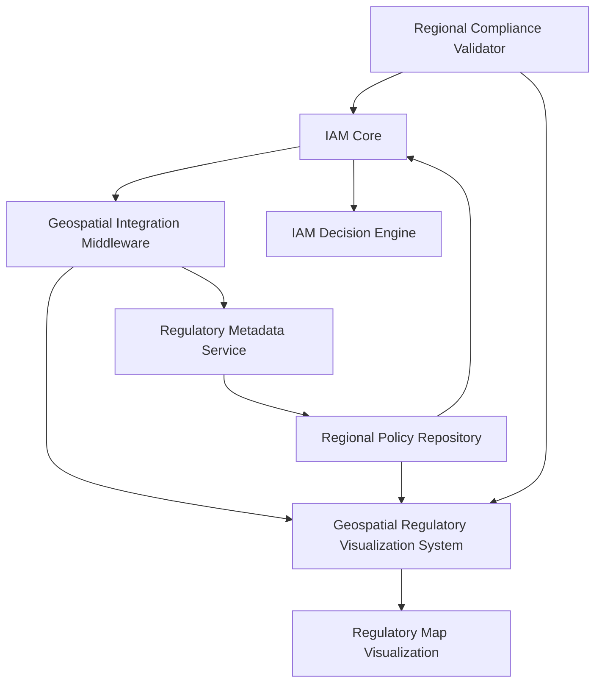
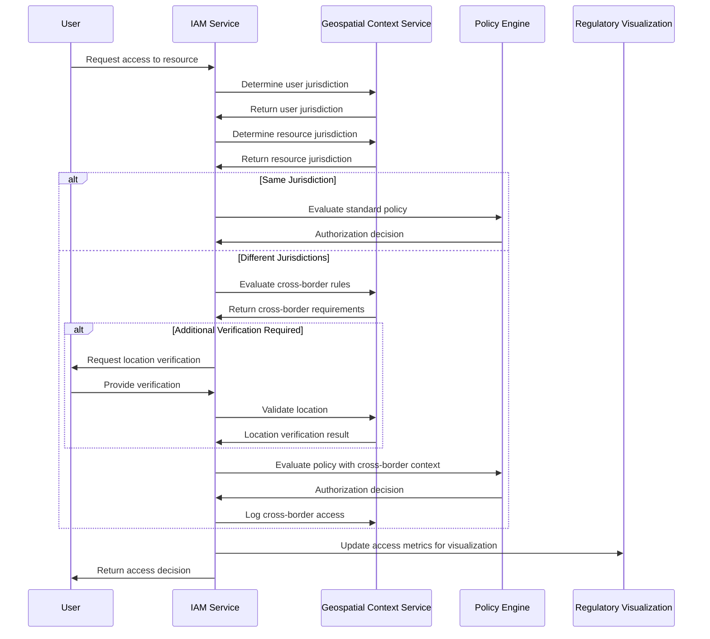

# IAM Geospatial Compliance Integration

## Introduction

This document outlines the integration between the IAM module and the Geospatial Regulatory Visualization System of the INNOVABIZ platform. This integration enhances the platform's capability to manage identity and access controls based on geographical regulatory contexts, supporting the multi-regional implementation strategy across EU/Portugal, Brazil, Africa/Angola, and the United States.

## Purpose and Scope

The purpose of this integration is to:

1. Enable geospatially-aware access control decisions based on regulatory contexts
2. Provide visualization and management of identity and access regulations by geographic region
3. Support compliance with region-specific identity and privacy regulations
4. Facilitate cross-regional operations while maintaining regulatory compliance
5. Enhance auditability and reporting of access patterns across geographic boundaries

This document is intended for:
- Security architects and engineers
- IAM administrators and operators
- Compliance officers and auditors
- Regulatory affairs specialists

## Architectural Overview

### System Integration

The IAM module integrates with the Geospatial Regulatory Visualization System through a series of well-defined interfaces:



### Key Components

| Component | Description | Responsibility |
|-----------|-------------|----------------|
| **Geospatial Integration Middleware** | API layer between IAM and visualization system | Translation of IAM data into geospatial context |
| **Regional Policy Repository** | Storage for region-specific access policies | Management of policy metadata and geographic attributes |
| **IAM Decision Engine** | Core authorization service with geo-awareness | Enforcement of location-based access rules |
| **Regulatory Map Visualization** | Interactive display of compliance status | Visual representation of IAM compliance by region |
| **Regulatory Metadata Service** | Maps regulations to IAM controls | Maintenance of relationships between regulations and controls |
| **Regional Compliance Validator** | Validates IAM configurations against regional requirements | Automated compliance checking and reporting |

## Geospatial Data Model

### Core Entities

The integration is built on the following data model extensions to the IAM system:

#### Regulatory Jurisdiction

```typescript
interface RegulatoryJurisdiction {
  id: string;
  name: string;
  code: string;
  level: 'GLOBAL' | 'REGIONAL' | 'NATIONAL' | 'STATE' | 'LOCAL';
  parentJurisdictionId?: string;
  geographicBoundaries: GeoJSON.Polygon;
  effectiveDate: Date;
  supersededDate?: Date;
  regulatoryAuthorities: RegulatorInfo[];
}
```

#### Identity Regulation

```typescript
interface IdentityRegulation {
  id: string;
  name: string;
  jurisdictionId: string;
  category: 'PRIVACY' | 'AUTHENTICATION' | 'AUTHORIZATION' | 'AUDIT' | 'REPORTING';
  subCategory: string;
  description: string;
  effectiveDate: Date;
  complianceDeadline: Date;
  supersededDate?: Date;
  implementingControls: IAMControlReference[];
  riskLevel: 'HIGH' | 'MEDIUM' | 'LOW';
  applicableEntities: EntityScope[];
}
```

#### IAM Control Reference

```typescript
interface IAMControlReference {
  controlId: string;
  controlName: string;
  controlType: 'TECHNICAL' | 'ADMINISTRATIVE' | 'PHYSICAL';
  implementationStatus: 'IMPLEMENTED' | 'PARTIALLY_IMPLEMENTED' | 'PLANNED' | 'NOT_APPLICABLE';
  implementationDetails: string;
  testingFrequency: 'CONTINUOUS' | 'DAILY' | 'WEEKLY' | 'MONTHLY' | 'QUARTERLY' | 'ANNUALLY';
  lastTestDate: Date;
  nextTestDate: Date;
  responsibleParty: string;
  relatedPolicies: string[];
}
```

### Regional IAM Policy Model

The IAM system extends its policy model to include geographical context:

```typescript
interface GeospatialAccessPolicy extends AccessPolicy {
  jurisdictionIds: string[];
  geographicRestrictions?: {
    allowedRegions?: GeoJSON.Polygon[];
    deniedRegions?: GeoJSON.Polygon[];
    requiresPresenceVerification: boolean;
    presenceVerificationMethod?: 'IP_GEOLOCATION' | 'GPS' | 'CELLULAR' | 'MANUAL_VERIFICATION';
  };
  crossBorderDataControls?: {
    allowDataTransfer: boolean;
    requiredProtections: string[];
    transferDocumentationRequired: boolean;
    dataResidencyRequirements: string[];
  };
}
```

## Functional Capabilities

### Geospatial Policy Management

The integrated system provides the following capabilities for IAM policy management:

1. **Jurisdiction-Based Policy Creation**
   - Define policies for specific geographical jurisdictions
   - Inherit and override policies from parent jurisdictions
   - Validate policy compatibility across jurisdictions

2. **Cross-Border Access Management**
   - Define rules for cross-border authentication and authorization
   - Implement data residency and transfer restrictions
   - Enforce jurisdiction-specific step-up authentication requirements

3. **Location-Aware Access Decisions**
   - Runtime evaluation of user location
   - Dynamic application of location-based restrictions
   - Adaptive authentication based on geographic risk assessment

### Visualization and Analytics

The integration enables the following visualization capabilities:

1. **Regulatory Compliance Map**
   - Interactive world map with color-coded compliance status
   - Drill-down from global to local jurisdictions
   - Temporal view of changing regulatory landscape

2. **Compliance Gap Analysis**
   - Visual identification of control gaps by region
   - Trend analysis for compliance scores over time
   - Comparison of compliance across different jurisdictions

3. **Access Pattern Visualization**
   - Geographic distribution of authentication and authorization activities
   - Identification of unusual cross-border access patterns
   - Risk hotspot identification by region

## Implementation Components

### IAM Extensions

The IAM system includes the following extensions to support geospatial regulatory integration:

#### Geospatial Context Provider

```typescript
interface GeospatialContextProvider {
  /**
   * Determines the applicable jurisdictions for a request
   */
  resolveJurisdictions(request: AuthRequest): Promise<RegulatoryJurisdiction[]>;
  
  /**
   * Validates if a request complies with jurisdictional requirements
   */
  validateJurisdictionalCompliance(
    request: AuthRequest, 
    jurisdictions: RegulatoryJurisdiction[]
  ): Promise<ComplianceResult>;
  
  /**
   * Determines if cross-border access is permitted
   */
  evaluateCrossBorderAccess(
    userJurisdiction: RegulatoryJurisdiction,
    resourceJurisdiction: RegulatoryJurisdiction,
    operation: string
  ): Promise<CrossBorderDecision>;
}
```

#### Location Verification Service

```typescript
interface LocationVerificationService {
  /**
   * Verifies user's location using available methods
   */
  verifyLocation(
    userId: string, 
    claimedLocation: GeoLocation, 
    requiredAccuracy: number
  ): Promise<LocationVerificationResult>;
  
  /**
   * Determines if location verification is required
   */
  isVerificationRequired(
    userId: string,
    resource: string,
    action: string
  ): Promise<boolean>;
  
  /**
   * Logs location verification for audit purposes
   */
  logLocationVerification(
    userId: string,
    verificationResult: LocationVerificationResult,
    requestContext: RequestContext
  ): Promise<void>;
}
```

### Visualization Components

The Geospatial Regulatory Visualization System includes:

1. **Regulation Map Component**
   - Interactive world map with regulatory information
   - Filtering by regulation category, date, and status
   - Export and reporting capabilities

2. **Compliance Dashboard**
   - Real-time compliance status by region
   - Drill-down capabilities for specific regulations
   - Time-series analysis of compliance trends

3. **Administrator Interface**
   - Management of jurisdiction definitions
   - Configuration of regulatory requirements
   - Mapping of regulations to IAM controls

## Regional Compliance Integration

### EU/Portugal Compliance

Integration with EU regulations, particularly focusing on:

| Regulation | IAM Integration Points | Geospatial Aspects |
|------------|------------------------|-------------------|
| **GDPR** | Consent management, data subject rights | Cross-border data transfers, territorial scope determination |
| **eIDAS** | Identity verification levels, signature validation | Mutual recognition of electronic IDs across EU |
| **NIS2** | Authentication requirements for critical infrastructure | Sector-specific controls by EU member state |
| **EU AI Act** | Identity systems using AI/ML components | Geographic application of AI governance rules |

### Brazil Compliance

Integration with Brazilian regulations:

| Regulation | IAM Integration Points | Geospatial Aspects |
|------------|------------------------|-------------------|
| **LGPD** | Consent records, processing restrictions | Data localization requirements, territorial application |
| **MP 2.200-2** | Digital signature requirements | Jurisdiction-based certificate recognition |
| **Resolution 4.658** | Financial identity requirements | Geographic restrictions for financial data |
| **Marco Civil** | Internet identity provisions | Brazilian territorial jurisdiction for services |

### Africa/Angola Compliance

Integration with Angolan and regional African regulations:

| Regulation | IAM Integration Points | Geospatial Aspects |
|------------|------------------------|-------------------|
| **PNDSB** | Personal data protection | Data sovereignty requirements, cross-border limitations |
| **Angola Telecommunications Law** | Electronic identity provisions | Geographic telecommunications requirements |
| **African Union Convention on Cybersecurity** | Identity security requirements | Regional application across AU member states |
| **Local Data Protection Laws** | Emerging requirements | Tracking of developing regulations by country |

### USA Compliance

Integration with U.S. federal and state regulations:

| Regulation | IAM Integration Points | Geospatial Aspects |
|------------|------------------------|-------------------|
| **CCPA/CPRA** | California-specific consent and rights | State-based jurisdiction and application |
| **HIPAA** | Healthcare identity requirements | Geographic application of healthcare privacy rules |
| **NIST 800-63-3** | Federal identity assurance levels | Federal vs. state jurisdiction mapping |
| **State Privacy Laws** | Various state-specific requirements | Multi-state operations compliance tracking |

## Operational Procedures

### Regulatory Change Management

Process for handling changes to identity-related regulations:

1. **Regulatory Monitoring**
   - Continuous tracking of regulatory changes by region
   - Automated alerts for relevant IAM-related regulations
   - Categorization and prioritization of changes

2. **Impact Assessment**
   - Analysis of regulatory impact on IAM controls
   - Mapping to existing policies and configurations
   - Gap identification and remediation planning

3. **Implementation**
   - Update of affected IAM policies and controls
   - Adjustment of geospatial boundaries and rules
   - Testing and validation in regional contexts

4. **Documentation and Reporting**
   - Update of compliance documentation
   - Generation of evidence for regulatory purposes
   - Communication to relevant stakeholders

### Cross-Border Access Handling

Process for managing access across regulatory boundaries:

1. **Access Request Evaluation**
   - Determination of user and resource jurisdictions
   - Identification of applicable cross-border rules
   - Validation of legal basis for cross-border access

2. **Enhanced Authentication**
   - Risk-based step-up authentication for cross-border access
   - Additional verification for high-risk cross-border operations
   - Location verification when required by regulations

3. **Transfer Documentation**
   - Automated recording of cross-border access
   - Documentation of legitimate basis for transfer
   - Generation of required regulatory reports

4. **Audit and Monitoring**
   - Enhanced monitoring of cross-border activities
   - Periodic review of cross-border access patterns
   - Compliance verification against transfer regulations

## Security and Privacy Considerations

### Geolocation Data Protection

The handling of user location data requires special protection:

1. **Data Minimization**
   - Collection of location data only when necessary
   - Appropriate level of precision based on use case
   - Limited retention periods for location history

2. **User Transparency**
   - Clear notification of location data collection
   - Purpose specification for location verification
   - User control over location sharing preferences

3. **Secure Processing**
   - Encryption of location data in transit and at rest
   - Access controls for location information systems
   - Anonymization for analytical purposes

### Sovereign Identity and Cross-Border Challenges

Addressing challenges related to identity across jurisdictions:

1. **Legal Identity Basis**
   - Recognition of varying legal frameworks for digital identity
   - Support for multiple identity assurance frameworks
   - Mapping between different regional standards

2. **Compliance Conflicts**
   - Resolution of contradictory regulatory requirements
   - Prioritization framework for conflicting rules
   - Exception handling for unresolvable conflicts

3. **Extraterritorial Application**
   - Management of regulations with extraterritorial scope
   - Implementation of controls for overlapping jurisdictions
   - Documentation of compliance approach for complex scenarios

## Implementation and Testing

### Jurisdictional Testing Matrix

| Test Scenario | Description | Expected Outcome |
|---------------|-------------|------------------|
| **Same-Region Access** | User accesses resource in same jurisdiction | Standard policy application, baseline logging |
| **Cross-Region Access** | User accesses resource in different jurisdiction | Enhanced verification, transfer documentation |
| **Multi-Jurisdictional Resource** | Resource governed by multiple regulations | Application of all relevant controls, most restrictive wins |
| **Conflict Resolution** | Access scenario with regulatory conflicts | Documented exception handling, compensating controls |
| **Jurisdiction Change** | User or resource changes jurisdiction | Dynamic policy application, transition management |

### Implementation Validation

1. **Compliance Testing**
   - Automatic validation against regional requirements
   - Simulation of regulatory authority audits
   - Independent assessment of control effectiveness

2. **Geographical Accuracy**
   - Validation of jurisdiction boundary definitions
   - Testing of location determination methods
   - Verification of overlap handling

3. **Performance Impact**
   - Measurement of geo-aware decisioning latency
   - Optimization of cross-region operations
   - Caching strategies for geographical data

## Reference Implementation Examples

### Policy Definition Example

```json
{
  "policyId": "eu-health-data-access",
  "displayName": "EU Healthcare Data Access Policy",
  "description": "Controls access to healthcare data within EU jurisdiction",
  "jurisdictionIds": ["EU", "EU-PT"],
  "geographicRestrictions": {
    "allowedRegions": [
      {
        "type": "Polygon",
        "coordinates": [[ 
          [EU boundary coordinates]
        ]]
      }
    ],
    "requiresPresenceVerification": true,
    "presenceVerificationMethod": "IP_GEOLOCATION"
  },
  "crossBorderDataControls": {
    "allowDataTransfer": true,
    "requiredProtections": ["EU_ADEQUATE_COUNTRY", "SCCs", "BCRs"],
    "transferDocumentationRequired": true,
    "dataResidencyRequirements": ["EU_STORAGE_REQUIRED_FOR_PHI"]
  },
  "conditions": [
    {
      "effect": "ALLOW",
      "actions": ["VIEW", "SEARCH"],
      "resources": ["healthcare:patient:*"],
      "subjects": ["healthcare:provider:*"],
      "contextConditions": {
        "patientConsent": true,
        "treatmentRelationship": true
      }
    }
  ]
}
```

### Geospatial Decision Flow



## Regulatory Visualization Interface

The geospatial visualization system provides the following capabilities for IAM stakeholders:

### Compliance Officer View

1. **Regulatory Heat Map**
   - Global visualization of compliance status by region
   - Trend visualization for compliance changes
   - Drill-down from global to national to local requirements

2. **Gap Analysis Dashboard**
   - Identification of control gaps by jurisdiction
   - Prioritized recommendations for remediation
   - Compliance roadmap visualization

3. **Reporting Interface**
   - Generation of jurisdiction-specific compliance reports
   - Evidence collection for regulatory audits
   - Executive dashboards for compliance status

### IAM Administrator View

1. **Policy Coverage Map**
   - Visualization of policy application by region
   - Identification of regions without specific policies
   - Overlap analysis for multiple applicable policies

2. **Access Pattern Analysis**
   - Geographic distribution of authentication attempts
   - Cross-border access flow visualization
   - Anomaly highlighting for unusual patterns

3. **Configuration Assistant**
   - Jurisdiction-based policy recommendation
   - Regulatory requirement translation to controls
   - Impact analysis for policy changes

## References

- [IAM Technical Architecture](../02-Arquitetura/IAM_Technical_Architecture.md)
- [IAM Compliance Framework](../10-Governanca/IAM_Compliance_Framework_EN.md)
- [Regulatory Map Documentation](../../common/regulatory-map/Regulatory_Map_Documentation.md)
- [IAM Incident Response Procedures](../08-Operacoes/IAM_Incident_Response_Procedures.md)
- [IAM Healthcare Integration Security](../05-Seguranca/IAM_Healthcare_Integration_Security.md)

## Appendices

### Appendix A: Supported Jurisdiction Codes

| Code | Name | Level | Parent |
|------|------|-------|--------|
| GLOBAL | Global | GLOBAL | - |
| EU | European Union | REGIONAL | GLOBAL |
| EU-PT | Portugal | NATIONAL | EU |
| BR | Brazil | NATIONAL | GLOBAL |
| AO | Angola | NATIONAL | GLOBAL |
| US | United States | NATIONAL | GLOBAL |
| US-CA | California | STATE | US |
| US-NY | New York | STATE | US |
| US-TX | Texas | STATE | US |
| US-IL | Illinois | STATE | US |

### Appendix B: Regulatory Authority Contact Information

| Jurisdiction | Authority | Contact | Reporting Requirements |
|--------------|-----------|---------|------------------------|
| EU | European Data Protection Board | contact@edpb.europa.eu | 72-hour breach notification |
| EU-PT | Comissão Nacional de Proteção de Dados | geral@cnpd.pt | GDPR Article 33 procedures |
| BR | Autoridade Nacional de Proteção de Dados | anpd@gov.br | Incident reporting procedures |
| AO | Agência de Proteção de Dados (APD) | apd@gov.ao | Local reporting requirements |
| US | Multiple (sector-specific) | Various | Varies by state and sector |
| US-CA | California Privacy Protection Agency | info@cppa.ca.gov | CPRA requirements |

### Appendix C: Integration API Documentation

Comprehensive API documentation for the Geospatial Regulatory Integration is available at:
`https://developer.innovabiz.com/api/iam/geospatial-integration/`
