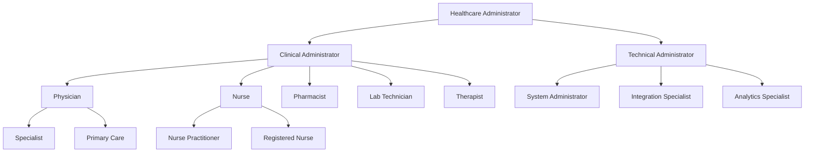
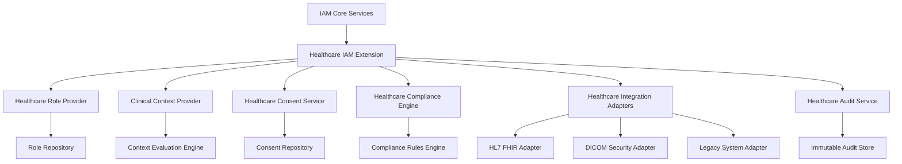
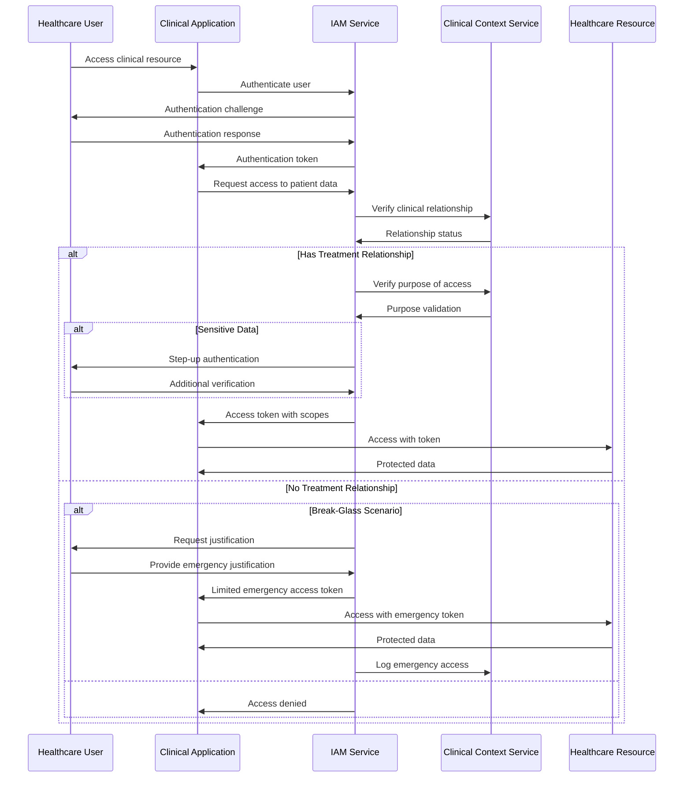

# IAM Healthcare Integration Security

## Introduction

This document outlines the security architecture and implementation details for integrating the IAM module with the Healthcare module of the INNOVABIZ platform. This integration addresses the unique security, privacy, and compliance requirements specific to healthcare data and systems across all implementation regions (EU/Portugal, Brazil, Africa/Angola, USA).

## Scope and Purpose

The IAM-Healthcare integration provides secure identity and access management capabilities tailored to healthcare environments, including:

1. Authentication and authorization for healthcare professionals
2. Patient identity management and consent handling
3. Role-based access control for clinical data
4. Secure integration with healthcare systems (EHR/EMR)
5. Compliance with regional healthcare regulations

This document is intended for:
- Security architects
- IAM and Healthcare module developers
- Compliance officers
- System administrators and operations staff

## Healthcare-Specific Security Requirements

### Data Classification and Protection

Healthcare data in the INNOVABIZ platform is classified according to sensitivity:

| Classification | Examples | Protection Requirements |
|----------------|----------|-------------------------|
| **PHI/PII** | Patient identifiable information, medical records | Encryption at rest and in transit, access logging, strict RBAC |
| **Clinical** | Anonymized medical data, diagnostic information | Encryption at rest, role-based access, integrity protection |
| **Operational** | Scheduling, non-sensitive workflow data | Standard controls, regular access review |
| **Administrative** | Staff records, non-clinical operations | Standard controls, departmental segregation |

### Special Data Handling Requirements

| Data Type | Special Requirements |
|-----------|----------------------|
| Genetic Information | Additional consent verification, specialized roles |
| Mental Health Records | Heightened access restrictions, special audit requirements |
| Substance Abuse | 42 CFR Part 2 compliance (US), additional compartmentalization |
| HIV/Infectious Disease | Specialized consent and disclosure controls |
| Pediatric Records | Age-based consent delegation, guardian access management |

## Healthcare Role Architecture

### Clinical Role Hierarchy

The IAM system implements a healthcare-specific role hierarchy:



### Context-Based Access Models

Access to healthcare data is controlled through contextual factors:

1. **Provider-Patient Relationship**
   - Treatment relationship verification
   - Care team membership
   - Referral status verification

2. **Purpose-Based Access**
   - Treatment
   - Payment
   - Healthcare operations
   - Research (with appropriate consent)
   - Legal/regulatory purposes

3. **Break-Glass Protocols**
   - Emergency access procedures
   - Automatic notification and review
   - Mandatory justification
   - Enhanced logging and monitoring

## Regional Compliance Integration

The IAM-Healthcare integration implements region-specific controls to ensure compliance with local regulations:

| Region | Regulations | Key IAM Controls |
|--------|-------------|------------------|
| **EU/Portugal** | GDPR, NIS2 | Consent management, right to access/erasure, data portability, explicit access justification |
| **Brazil** | LGPD | Consent records, data subject rights management, processing records |
| **Africa/Angola** | PNDSB | Data localization, access restrictions, patient consent management |
| **USA** | HIPAA, 42 CFR Part 2, State-specific laws | Minimum necessary access, accounting of disclosures, business associate management |

### Compliance Validators

The system includes healthcare-specific compliance validators:

```typescript
// Example validator structure
interface HealthcareComplianceValidator {
  validateAccess(user: User, patient: Patient, context: AccessContext): ValidationResult;
  validateConsent(patient: Patient, purpose: Purpose, data: DataCategory): ValidationResult;
  validateDisclosure(recipient: Entity, patient: Patient, data: DataCategory): ValidationResult;
  generateComplianceReport(timeframe: DateRange): ComplianceReport;
}

// Region-specific implementations
class HIPAAValidator implements HealthcareComplianceValidator { /* ... */ }
class GDPRHealthcareValidator implements HealthcareComplianceValidator { /* ... */ }
class LGPDHealthcareValidator implements HealthcareComplianceValidator { /* ... */ }
class PNDSBValidator implements HealthcareComplianceValidator { /* ... */ }
```

### Consent Management Architecture

Patient consent is managed through a granular consent model:

1. **Consent Types**
   - Treatment consent
   - Data sharing consent
   - Research participation
   - Telehealth consent
   - Third-party access consent

2. **Consent Operations**
   - Capture (including method and verification)
   - Validation (at point of access)
   - Revocation
   - Expiration
   - Update

3. **Consent Storage**
   - Immutable consent records
   - Blockchain-backed for non-repudiation (optional)
   - Complete audit trail
   - Version history

## Healthcare System Integration Security

### Authentication for Healthcare Systems

The IAM module provides multiple authentication methods for healthcare systems:

| Method | Use Case | Security Features |
|--------|----------|------------------|
| SAML 2.0 | EHR/EMR integration, large healthcare systems | Federation, strong encryption, attribute mapping |
| OAuth 2.0 + SMART on FHIR | Modern healthcare application integration | Scoped tokens, resource-based permissions |
| OpenID Connect | User authentication with identity provision | Identity assurance, multi-factor authentication |
| Client Certificates | System-to-system integration, IoT medical devices | PKI-based authentication, certificate lifecycle management |
| API Keys | Legacy system integration | Rotation policies, usage restrictions, enhanced monitoring |

### Healthcare Data Exchange Protection

For data exchanged with healthcare systems:

1. **Transport Security**
   - TLS 1.3+ with strong cipher suites
   - Certificate pinning for critical systems
   - Network segregation and micro-segmentation

2. **Message Security**
   - FHIR resource encryption
   - Digital signatures for data integrity
   - Non-repudiation through signed audit records

3. **API Security**
   - Rate limiting specific to healthcare endpoints
   - Healthcare-specific input validation
   - Health data leakage prevention

## Healthcare-Specific IAM Monitoring

### Healthcare-Specific Security Events

| Event Category | Examples | Response Priority |
|----------------|----------|-------------------|
| Patient Privacy Violations | Unauthorized PHI access, excessive record viewing | High |
| Clinical Workflow Anomalies | Off-hours access, unusual volume of patient lookups | Medium-High |
| Authentication Anomalies | Credential sharing, simultaneous logins from different locations | High |
| System Interface Violations | Unauthorized API access, unusual query patterns | Medium |
| Consent Violations | Access without valid consent, expired consent usage | High |

### Behavioral Analytics for Healthcare

The IAM system implements specialized behavioral analytics for healthcare contexts:

1. **Provider Access Patterns**
   - Baseline normal access patterns by role and specialty
   - Detect deviations from historical access patterns
   - Identify outlier behavior compared to peer groups

2. **Clinical Context Correlation**
   - Correlate access with scheduled appointments
   - Verify departmental relevance of record access
   - Validate clinical workflow consistency

3. **Cross-System Correlation**
   - Track access patterns across integrated systems
   - Compare identity assertion consistency
   - Detect anomalous cross-system behavior

## Healthcare User Lifecycle Management

### Provider Identity Validation

Enhanced verification for healthcare provider identity:

1. **Credential Verification**
   - Integration with professional licensing boards
   - Verification of medical credentials
   - Sanctions and restrictions checking

2. **Clinical Privileges Management**
   - Mapping of system privileges to clinical credentials
   - Time-limited privilege grants based on credential status
   - Automatic privilege adjustments based on credential changes

3. **Identity Proofing Levels**
   - NIST SP 800-63-3 IAL2/AAL2 minimum for clinical staff
   - IAL3/AAL3 for high-privilege clinical roles
   - Continuous verification through credential monitoring

### Patient Identity Management

Special considerations for patient identity:

1. **Identity Matching**
   - Probabilistic matching algorithms
   - Demographic data verification
   - De-duplication processes
   - Regional identifier integration (when available)

2. **Proxy Access Management**
   - Guardian/parent access controls
   - Healthcare power of attorney
   - Age-based automatic access transitions
   - Caregiver limited delegation

3. **Patient Portal Integration**
   - Self-service identity verification
   - Consent management interface
   - Access log review capabilities
   - Secure messaging authentication

## Technical Implementation

### IAM Healthcare Component Architecture



### Authentication Extensions for Healthcare

```typescript
// Example authentication policy for healthcare
interface HealthcareAuthenticationPolicy extends AuthenticationPolicy {
  requireMfaForPhiAccess: boolean;
  clinicalContextValidation: boolean;
  workstationRestrictions: WorkstationRestriction[];
  sessionTimeoutMinutes: number;
  concurrentSessionPolicy: ConcurrentSessionHandling;
}

// Example authentication step-up logic
class HealthcareAuthStepUp {
  evaluateStepUpRequirement(
    user: User, 
    resource: HealthcareResource, 
    action: string, 
    context: RequestContext
  ): StepUpRequirement {
    // Logic to determine if additional authentication is needed
    // based on sensitivity of healthcare resource
  }
}
```

### Authorization Model Extensions

```typescript
// Example RBAC+ABAC model for healthcare
interface ClinicalAccessPolicy {
  role: ClinicalRole;
  dataCategories: HealthcareDataCategory[];
  requiredRelationships: PatientRelationshipType[];
  requiredPurposes: ClinicalPurpose[];
  timeRestrictions?: TimeRestriction;
  locationRestrictions?: LocationRestriction;
  overridePermitted: boolean;
}

// Clinical context provider
interface ClinicalContextProvider {
  getPatientRelationships(userId: string, patientId: string): PatientRelationshipType[];
  getCurrentClinicalPurpose(userId: string, context: RequestContext): ClinicalPurpose;
  validateClinicalNeed(userId: string, patientId: string, dataCategory: HealthcareDataCategory): ValidationResult;
}
```

## Security Testing and Validation

### Healthcare-Specific Security Testing

1. **Clinical Scenario Testing**
   - Realistic clinical workflow security testing
   - Multi-role collaboration scenarios
   - Emergency access testing
   - Shift change and handoff scenarios

2. **Healthcare Attack Scenarios**
   - Targeted patient record access attempts
   - Healthcare insider threat simulation
   - Healthcare-specific data exfiltration attempts
   - Medical identity theft scenarios

3. **Compliance Verification Testing**
   - Automated regulation compliance checks
   - Access control matrix validation
   - Consent enforcement verification
   - Audit comprehensiveness validation

### Validation Methodologies

| Validation Type | Frequency | Methodology |
|-----------------|-----------|-------------|
| Access Control Validation | Quarterly | Comprehensive matrix testing, role-permission verification |
| Consent Enforcement | Monthly | Automated testing of consent boundaries |
| Audit Completeness | Continuous | Automated verification of audit trail completeness |
| Segregation of Duties | Quarterly | Analysis of role assignments and potential conflicts |
| Break-Glass Procedures | Semi-annually | Simulated emergency scenarios |

## Operational Security Procedures

### PHI Access Monitoring

1. **Real-time Monitoring**
   - High-risk data access alerts
   - Pattern-based anomaly detection
   - Volume and frequency monitoring

2. **Access Review**
   - Mandatory periodic reviews by data custodians
   - Automated suspicious access highlighting
   - Patient-initiated access reviews

3. **Privacy Breach Response**
   - Integration with incident response procedures
   - Specialized PHI breach procedures
   - Regulatory notification workflows

### Healthcare Access Governance

1. **Clinical Role Certification**
   - Periodic role membership review
   - Clinical privilege verification
   - Supervisor attestation requirements

2. **Least Privilege Enforcement**
   - Regular entitlement reviews
   - Unused permission removal
   - Role optimization analysis

3. **Segregation of Duties**
   - Clinical conflict matrix
   - Administrative/clinical separation
   - Research/treatment segregation

## Interoperability Security

### Healthcare Standards Security Implementation

| Standard | Security Implementation |
|----------|-------------------------|
| HL7 FHIR | SMART on FHIR OAuth profiles, CDS Hooks security, FHIR consent resources |
| DICOM | TLS with mutual authentication, DICOM de-identification, attribute-level access control |
| HL7 v2 | Message-level encryption, VPN tunnels, enhanced authentication |
| IHE Profiles | ATNA audit controls, XDS.b security, XUA identity assertions |
| SNOMED CT | Terminology service access control, controlled vocabulary management |

### Healthcare API Security

1. **API Gateway Configuration**
   - Healthcare-specific API policies
   - FHIR resource-level authorization
   - Medical terminology validation

2. **Medical Device Integration**
   - IoMT device authentication
   - Medical device identity management
   - Biometric data protection

## Training and Awareness

### Healthcare-Specific Security Training

1. **Clinical Staff Training**
   - Patient privacy requirements
   - Appropriate access guidelines
   - Security incident reporting

2. **Technical Staff Training**
   - Healthcare data security requirements
   - PHI handling procedures
   - Healthcare integration security

### Simulation and Testing

1. **Red Team Exercises**
   - Targeted healthcare scenario testing
   - Social engineering with healthcare context
   - Physical security in clinical settings

2. **Tabletop Exercises**
   - Healthcare data breach response
   - Ransomware in clinical environments
   - Medical identity compromise

## References

- [IAM Technical Architecture](../02-Arquitetura/IAM_Technical_Architecture.md)
- [Healthcare Module Overview](../../healthcare/01-Visao-Geral/Healthcare_Overview.md)
- [IAM Compliance Framework](../10-Governanca/IAM_Compliance_Framework_EN.md)
- [Healthcare Compliance Framework](../../healthcare/10-Governanca/Healthcare_Compliance_Framework.md)
- [IAM Incident Response Procedures](../08-Operacoes/IAM_Incident_Response_Procedures.md)

## Appendices

### A. Healthcare IAM Decision Matrix

| Access Scenario | Required Relationship | Required Authentication | Additional Controls |
|-----------------|------------------------|-------------------------|---------------------|
| Emergency access to patient record | None required (break-glass) | Standard + post-access justification | Full audit, automatic notification, time-limited |
| Routine patient care | Treatment relationship | Standard clinical authentication | Patient assignment verification |
| Sensitive diagnosis access | Direct care provider | Standard + step-up | Purpose verification, limited data elements |
| Research access to de-identified data | Research protocol approval | Standard + research role | Limited dataset, aggregate access only |
| Billing/administrative access | Department relationship | Standard administrative | Limited clinical data, purpose restrictions |

### B. Healthcare IAM Compliance Mapping

```json
{
  "hipaa": {
    "privacy_rule": {
      "minimum_necessary": ["ClinicalAccessPolicy", "PurposeValidation"],
      "patient_access": ["PatientPortalAuthentication", "AccessRequestWorkflow"],
      "authorization": ["ConsentManagement", "DisclosureTracking"]
    },
    "security_rule": {
      "access_control": ["RoleBasedAccess", "ContextualAccess", "AuthenticationPolicies"],
      "audit_controls": ["HealthcareAuditService", "AccessMonitoring"],
      "integrity": ["DataSignatures", "VersionControl"]
    }
  },
  "gdpr_health": {
    "special_categories": ["HealthDataClassification", "ExplicitConsentManagement"],
    "data_subject_rights": ["AccessRequestWorkflow", "EraseRequestHandler"],
    "processing_records": ["ProcessingRegistry", "LawfulBasisDocumentation"]
  }
}
```

### C. Healthcare Authentication Flow


