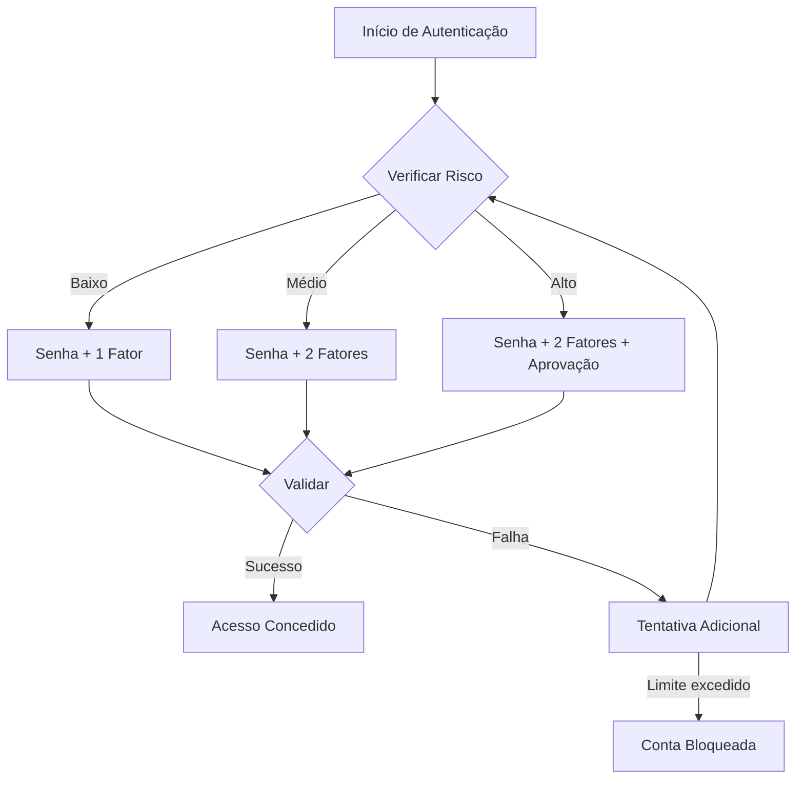

# Guia de Implementação do Módulo IAM INNOVABIZ para Angola (BNA)

**Versão:** 1.0.0  
**Data:** 07/08/2025  
**Autor:** Equipa de Desenvolvimento INNOVABIZ  
**Classificação:** Confidencial  

## Índice

1. [Introdução](#1-introdução)
2. [Contexto Regulatório](#2-contexto-regulatório)
3. [Requisitos de Conformidade](#3-requisitos-de-conformidade)
   1. [Identificação e Verificação de Identidade (KYC)](#31-identificação-e-verificação-de-identidade-kyc)
   2. [Autenticação](#32-autenticação)
   3. [Autorização](#33-autorização)
   4. [Gestão de Sessões](#34-gestão-de-sessões)
   5. [Auditoria e Rastreabilidade](#35-auditoria-e-rastreabilidade)
   6. [Proteção de Dados](#36-proteção-de-dados)
4. [Arquitetura de Implementação](#4-arquitetura-de-implementação)
5. [Configuração e Personalização](#5-configuração-e-personalização)
6. [Integração com Sistemas Angolanos](#6-integração-com-sistemas-angolanos)
7. [Ciclo de Vida do Utilizador](#7-ciclo-de-vida-do-utilizador)
8. [Monitorização e Relatórios](#8-monitorização-e-relatórios)
9. [Plano de Validação e Certificação](#9-plano-de-validação-e-certificação)
10. [Referências](#10-referências)

## 1. Introdução

Este guia apresenta as diretrizes detalhadas para a implementação do módulo IAM (Identity and Access Management) da plataforma INNOVABIZ em conformidade com as normas e regulamentos do Banco Nacional de Angola (BNA). O documento destina-se a equipas técnicas responsáveis pela implementação, configuração e manutenção do sistema IAM em instituições financeiras, fintechs e outras organizações reguladas pelo BNA.

### 1.1 Objetivos

- Estabelecer um roteiro claro para implementação do IAM em conformidade com os requisitos do BNA
- Detalhar as configurações específicas para o mercado angolano
- Fornecer orientações sobre integração com sistemas locais
- Documentar os processos de validação e certificação necessários

### 1.2 Público-Alvo

- Equipas de implementação técnica
- Oficiais de conformidade regulatória
- Administradores de sistemas
- Auditores internos e externos
- Gestores de segurança da informação

## 2. Contexto Regulatório

### 2.1 Principais Regulamentações

| Regulamento | Descrição | Data de Publicação | Impacto no IAM |
|-------------|-----------|-------------------|----------------|
| Aviso nº 02/2018 do BNA | Requisitos para Sistemas Informáticos das Instituições Financeiras | 21/03/2018 | Segurança de acesso e autenticação |
| Instrutivo nº 07/2021 | Sistemas de Pagamento Eletrónicos | 15/05/2021 | Autenticação forte de clientes |
| Lei nº 22/11 | Lei da Proteção de Dados Pessoais | 17/06/2011 | Privacidade, consentimento e gestão de dados |
| Aviso nº 10/2021 | Cibersegurança para Instituições Financeiras | 30/08/2021 | Proteção de identidade e gestão de acessos |
| Diretiva nº 03/DSI/2022 | Diretrizes para Sistemas de Autenticação Digital | 12/04/2022 | Requisitos de MFA e biometria |

### 2.2 Entidades Reguladoras

- **Banco Nacional de Angola (BNA)**: Autoridade monetária e de supervisão do sistema financeiro
- **Centro Nacional de Coordenação de Cibersegurança (CNCS)**: Supervisão de aspectos de cibersegurança
- **Agência de Proteção de Dados de Angola (APDA)**: Fiscalização da conformidade com a lei de proteção de dados

## 3. Requisitos de Conformidade

### 3.1 Identificação e Verificação de Identidade (KYC)

#### 3.1.1 Requisitos Mínimos de KYC

- **Pessoas Singulares:**
  - Nome completo
  - Bilhete de Identidade ou Passaporte
  - Número de Identificação Fiscal (NIF)
  - Data de nascimento
  - Nacionalidade
  - Residência
  - Contactos (telefone e email)
  - Profissão e entidade empregadora

- **Pessoas Coletivas:**
  - Denominação social
  - Número de registo comercial
  - NIF
  - Sede
  - Identificação dos representantes legais
  - Estrutura de propriedade e controlo
  - Demonstrações financeiras (quando aplicável)

#### 3.1.2 Verificação de Identidade

- **Verificação Documental**:
  - Validação de BI através da base SIME (Sistema de Identificação e Movimentação de Estrangeiros)
  - Validação de NIF através da interface com AGT (Administração Geral Tributária)

- **Verificação Biométrica**:
  - Obrigatória para transações superiores a 100.000 Kwanzas (≈ 120 USD)
  - Comparação facial com documento de identificação
  - Prova de vida (liveness detection)
  - Armazenamento seguro de templates biométricos

### 3.2 Autenticação

#### 3.2.1 Requisitos de Autenticação Forte (MFA)

Conforme Diretiva nº 03/DSI/2022 do BNA, a autenticação forte deve ser implementada utilizando pelo menos dois dos seguintes fatores:

- **Conhecimento**: Senha, PIN, resposta a perguntas de segurança
- **Posse**: Dispositivo móvel, token físico, cartão inteligente
- **Inerência**: Biometria (facial, impressão digital, voz)

#### 3.2.2 Contextos Obrigatórios para MFA

- Acesso inicial a contas
- Transações financeiras acima de 50.000 Kwanzas (≈ 60 USD)
- Alteração de dados sensíveis
- Acesso a partir de novos dispositivos ou localizações
- Acesso administrativo a sistemas

#### 3.2.3 Política de Senhas

De acordo com o Aviso nº 10/2021, as senhas devem:

- Conter no mínimo 10 caracteres
- Incluir letras maiúsculas, minúsculas, números e caracteres especiais
- Ser alteradas a cada 90 dias
- Não reutilizar as últimas 5 senhas
- Bloquear a conta após 5 tentativas incorrectas
- Impedir o uso de informações pessoais identificáveis

### 3.3 Autorização

#### 3.3.1 Modelo de Controlo de Acesso

O sistema deve implementar:

- **RBAC (Role-Based Access Control)**: Controlo baseado em funções
- **ABAC (Attribute-Based Access Control)**: Controlo baseado em atributos para decisões contextuais
- **Segregação de funções**: Prevenção de conflitos de interesse

#### 3.3.2 Requisitos de Privileged Access Management (PAM)

- Aprovação dupla para alterações críticas
- Monitorização em tempo real de sessões privilegiadas
- Rotação automática de credenciais privilegiadas
- Auditoria detalhada de todas as ações de administradores

### 3.4 Gestão de Sessões

#### 3.4.1 Timeout e Expiração

- Sessões inativas devem expirar após 15 minutos
- Duração máxima de sessão: 4 horas para utilizadores comuns, 2 horas para administradores
- Encerramento automático de sessão após detecção de actividade suspeita

#### 3.4.2 Segurança de Sessão

- Tokens JWT com prazo de validade curto (máximo 15 minutos)
- Renovação baseada em refresh tokens (validade máxima de 7 dias)
- Vinculação de sessão ao dispositivo, IP e outros parâmetros contextuais
- Invalidação imediata de todas as sessões em caso de suspeita de comprometimento

### 3.5 Auditoria e Rastreabilidade

#### 3.5.1 Eventos de Auditoria Obrigatórios

- Tentativas de login (sucedidas e falhadas)
- Alterações de credenciais ou métodos de autenticação
- Alterações em dados de clientes
- Transações financeiras
- Alterações de configuração de sistema
- Acessos administrativos
- Exportação de dados

#### 3.5.2 Requisitos de Registo

Cada registro de auditoria deve incluir:

- Timestamp com precisão de milissegundos
- Identificação do utilizador
- Tipo de evento
- Resultado da ação (sucesso/falha)
- Origem da ação (IP, dispositivo, canal)
- Detalhes específicos da ação
- Identificadores de sessão

#### 3.5.3 Retenção e Proteção

- Retenção mínima de 10 anos para registos de auditoria
- Proteção contra modificação ou eliminação
- Backup diário com armazenamento seguro
- Certificação digital de logs para garantir integridade

### 3.6 Proteção de Dados

#### 3.6.1 Requisitos de Criptografia

- Criptografia AES-256 para dados em repouso
- TLS 1.3 para transmissão de dados
- HSM (Hardware Security Module) para gestão de chaves
- Assinatura digital para documentos eletrónicos

#### 3.6.2 Classificação e Tratamento de Dados

| Classificação | Exemplos | Requisitos de Tratamento |
|---------------|----------|--------------------------|
| Altamente Sensível | Biometria, dados bancários | Criptografia forte, acesso restrito, auditoria detalhada |
| Sensível | Documentos pessoais, endereços | Criptografia, acesso controlado, auditoria |
| Interno | Dados demográficos básicos | Proteção básica, acesso autenticado |
| Público | Informações gerais publicadas | Sem restrições especiais |

#### 3.6.3 Consentimento e Direitos do Titular

- Obtenção e registo de consentimento explícito
- Interface para visualização e gestão de consentimentos
- Mecanismos para exercício dos direitos de acesso, retificação e eliminação
- Processo para portabilidade de dados

## 4. Arquitetura de Implementação

### 4.1 Componentes Principais

```
+------------------------------------------+
|          IAM INNOVABIZ para Angola       |
+------------------------------------------+
|                                          |
|  +-------------+      +---------------+  |
|  | Autenticação|<---->| Autorização   |  |
|  | Multi-Fator |      | Contextual    |  |
|  +-------------+      +---------------+  |
|         ^                    ^           |
|         |                    |           |
|  +-------------+      +---------------+  |
|  | Gestão de   |<---->| Auditoria e   |  |
|  | Identidade  |      | Conformidade  |  |
|  +-------------+      +---------------+  |
|         ^                    ^           |
|         |                    |           |
|  +-------------+      +---------------+  |
|  | Integração  |<---->| Adaptador BNA |  |
|  | Biometrica  |      | Compliance    |  |
|  +-------------+      +---------------+  |
|                                          |
+------------------------------------------+
         ^                    ^
         |                    |
+----------------+   +------------------+
| Sistemas Core  |   | Sistemas Externos|
| INNOVABIZ      |   | Angolanos        |
+----------------+   +------------------+
```

### 4.2 Configuração Multi-tenant para Angola

A implementação deve seguir a arquitetura multi-tenant do INNOVABIZ com partição específica para Angola:

- **Tenant Config Angolano**:
  - Aplicação automática de políticas do BNA
  - Suporte a múltiplas entidades financeiras angolanas
  - Segregação lógica de dados entre instituições
  - Modelo de governo específico para requisitos angolanos

### 4.3 Adaptações para Alta Disponibilidade

- Replicação geográfica com centros de dados em Luanda e Talatona
- Disponibilidade mínima de 99,95% conforme exigido pelo BNA
- RTO (Recovery Time Objective) < 4 horas
- RPO (Recovery Point Objective) < 15 minutos

## 5. Configuração e Personalização

### 5.1 Configurações Específicas para Angola

#### 5.1.1 Política de Autenticação

```json
{
  "mfaPolicy": {
    "enabled": true,
    "requiredMethods": 2,
    "allowedMethods": ["sms", "email", "totp", "webauthn", "biometric"],
    "biometricPriority": ["facial", "fingerprint", "voice"],
    "localValidation": {
      "documentTypes": ["BI_ANGOLA", "PASSPORT", "RESIDENCE_CARD"],
      "validateWithSIME": true,
      "validateWithAGT": true
    },
    "failedAttempts": {
      "maxAttempts": 5,
      "lockoutPeriodMinutes": 30,
      "progressiveDelay": true
    }
  }
}
```

#### 5.1.2 Configuração de Auditoria

```json
{
  "auditConfig": {
    "retentionYears": 10,
    "detailedEvents": [
      "LOGIN", "LOGOUT", "PASSWORD_CHANGE", "MFA_CHANGE",
      "PROFILE_UPDATE", "TRANSACTION", "ADMIN_ACTION"
    ],
    "storageLocation": {
      "primary": "local_encrypted_storage",
      "backup": "compliant_cloud_storage"
    },
    "exportFormats": ["PDF", "CSV", "JSON"],
    "digitalSignature": {
      "enabled": true,
      "provider": "ANGOLA_PKI",
      "renewalIntervalHours": 24
    }
  }
}
```

### 5.2 Localização

#### 5.2.1 Idiomas Suportados

- Português (padrão)
- Inglês
- Línguas nacionais: Umbundu, Kimbundu, Kikongo (opcional)

#### 5.2.2 Formatos e Padrões

- Formato de data: DD/MM/AAAA
- Formato de moeda: Kz (Kwanzas)
- Formatos de documentos:
  - BI: 000000000LA000
  - NIF: 000000000
  - Telefone: +244 XXX XXX XXX

## 6. Integração com Sistemas Angolanos

### 6.1 Sistemas de Identificação Nacional

| Sistema | Finalidade | Método de Integração | Documentação |
|---------|-----------|----------------------|--------------|
| SIME | Validação de Bilhetes de Identidade | API REST / Batch | [Link para docs SIME] |
| AGT | Validação de NIF | API SOAP | [Link para docs AGT] |
| CIRC | Consulta de informações de crédito | VPN dedicada + API | [Link para docs CIRC] |

### 6.2 Serviços Financeiros

| Sistema | Finalidade | Método de Integração | Documentação |
|---------|-----------|----------------------|--------------|
| SPTR | Sistema de Pagamentos em Tempo Real | ISO 20022 + VPN | [Link para docs SPTR] |
| STC | Câmara de Compensação | API proprietária | [Link para docs STC] |
| EMIS | Rede multicaixa | ISO 8583 + Gateway seguro | [Link para docs EMIS] |

### 6.3 Exemplos de Configuração de Integração

#### 6.3.1 Integração SIME (validação de identidade)

```yaml
sime:
  endpoint: https://api.sime.gov.ao/validate
  authType: certificado_digital
  certificateId: sime_innovabiz_client_001
  requestFormat: json
  responseTimeout: 30s
  cacheValidResults: true
  cacheValidityHours: 24
  fallbackValidation: true
```

#### 6.3.2 Integração AGT (validação fiscal)

```yaml
agt:
  endpoint: https://servicos.agt.ao/validacao/api/nif
  authType: oauth2
  clientId: ${AGT_CLIENT_ID}
  clientSecret: ${AGT_CLIENT_SECRET}
  tokenEndpoint: https://auth.agt.ao/token
  tokenRenewalMinutes: 55
  requestFormat: xml
  responseValidation: schema+signature
```

## 7. Ciclo de Vida do Utilizador

### 7.1 Processo de Onboarding para Angola

1. **Pré-registo**:
   - Captura de dados básicos
   - Validação preliminar de contactos

2. **Verificação de Identidade**:
   - Upload de BI/Passaporte
   - Validação via SIME
   - Verificação de NIF via AGT
   - Biometria facial comparada com documento

3. **KYC Complementar**:
   - Comprovativo de residência
   - Declaração de origem de fundos (para contas com movimentação > 5.000.000 Kz mensais)
   - Verificação contra listas PEP e sanções

4. **Criação de Credenciais**:
   - Definição de senha
   - Configuração de MFA (mínimo 2 fatores)
   - Criação de PIN para operações

5. **Aprovação**:
   - Automática para riscos baixos
   - Manual para riscos médios/altos
   - Notificação ao cliente

### 7.2 Fluxo de Autenticação Adaptativa



## 8. Monitorização e Relatórios

### 8.1 Relatórios Regulatórios

| Relatório | Periodicidade | Formato | Destinatário |
|-----------|--------------|---------|-------------|
| Incidentes de Segurança | Imediato + Mensal | XML estruturado | BNA + CNCS |
| Estatísticas de Autenticação | Trimestral | CSV + PDF | BNA |
| Falhas de Sistema | Mensal | JSON estruturado | BNA |
| Alterações Significativas | Antes da implementação | PDF | BNA |
| Auditoria de Acessos | Semestral | XLS + PDF | Auditoria Interna + BNA (sob demanda) |

### 8.2 Dashboards de Monitorização

- **Dashboard de Conformidade**:
  - Status de integração com sistemas obrigatórios
  - Métricas de validação de identidade
  - Sucesso de verificação biométrica
  - Tempo médio de onboarding

- **Dashboard de Segurança**:
  - Tentativas de autenticação falhadas
  - Acessos de alto privilégio
  - Alertas de actividade suspeita
  - Distribuição geográfica de acessos

- **Dashboard Operacional**:
  - Disponibilidade dos serviços
  - Latência das verificações
  - Taxa de sucesso de integrações
  - Utilização de recursos

## 9. Plano de Validação e Certificação

### 9.1 Checklist de Conformidade

| Requisito | Base Legal | Método de Validação | Evidência |
|-----------|-----------|---------------------|-----------|
| Autenticação MFA | Diretiva 03/DSI/2022 | Teste funcional + Código | Relatório de teste + Screenshots |
| Retenção de logs | Aviso 10/2021 | Inspeção de config + Teste de recuperação | Configs + Evidência de recuperação |
| Proteção de dados | Lei 22/11 | Revisão de código + Teste de penetração | Relatório de segurança |
| Integração SIME | Instrutivo 09/2019 | Teste de integração | Logs de chamada + Respostas |
| Biometria | Diretiva 03/DSI/2022 | Teste funcional | Relatório de eficácia + FAR/FRR |

### 9.2 Processo de Certificação

1. **Auto-avaliação**:
   - Revisão interna de conformidade
   - Testes automatizados
   - Documentação de evidências

2. **Revisão Independente**:
   - Auditoria por parceiro certificado
   - Testes de penetração
   - Revisão de código

3. **Submissão ao BNA**:
   - Dossier técnico completo
   - Demonstração ao vivo
   - Resposta a questionamentos

4. **Certificação Final**:
   - Emissão de certificado pelo BNA
   - Inclusão no registo de sistemas aprovados
   - Autorização para operação

## 10. Referências

1. Banco Nacional de Angola - [https://www.bna.ao](https://www.bna.ao)
2. Aviso nº 02/2018 - Requisitos para Sistemas Informáticos das Instituições Financeiras
3. Instrutivo nº 07/2021 - Sistemas de Pagamento Eletrónicos
4. Lei nº 22/11 - Lei da Proteção de Dados Pessoais
5. Aviso nº 10/2021 - Cibersegurança para Instituições Financeiras
6. Diretiva nº 03/DSI/2022 - Diretrizes para Sistemas de Autenticação Digital
7. ISO/IEC 27001:2013 - Sistema de Gestão de Segurança da Informação
8. NIST Special Publication 800-63B - Digital Identity Guidelines
9. RFC 8252 - OAuth 2.0 for Native Apps
10. FIDO Alliance - Authenticator Certification Requirements

---

*Nota: Este documento é confidencial e exclusivo para uso interno da INNOVABIZ e seus clientes autorizados. A distribuição ou reprodução não autorizada é proibida.*

*© INNOVABIZ 2025. Todos os direitos reservados.*