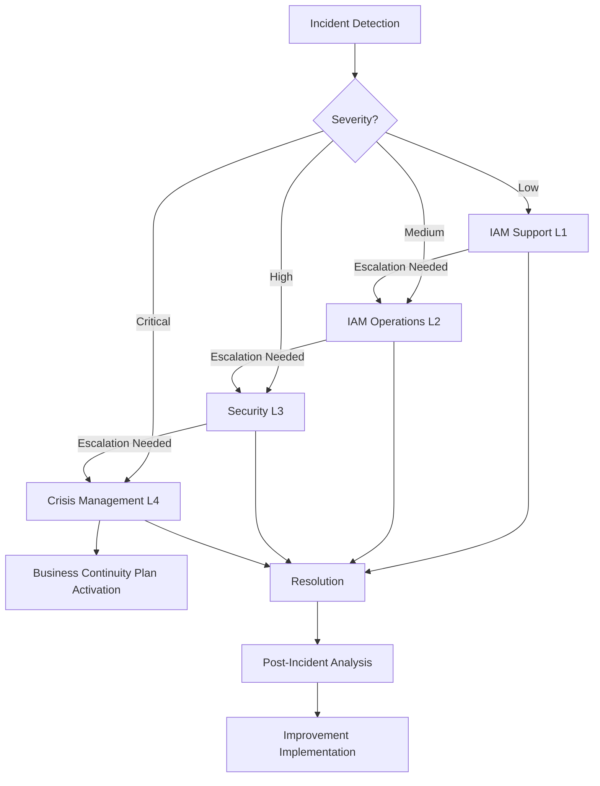

# IAM Incident Response Procedures

## Introduction

This document describes the incident response procedures for the IAM module of the INNOVABIZ platform. These procedures have been developed to ensure a rapid, effective, and coordinated response to incidents related to authentication, authorization, and identity management, minimizing business impact and maintaining compliance with applicable regulatory requirements.

## Definition of IAM Incidents

An IAM incident is defined as any event that:

1. Compromises or potentially compromises the confidentiality, integrity, or availability of IAM services
2. Violates or potentially violates security policies related to identities and access
3. Results in unauthorized access, privilege escalation, or loss of critical functionality
4. Affects the ability of legitimate users to access necessary resources

### Incident Classification

| Level | Description | Examples | Response Time |
|-------|-------------|----------|---------------|
| **Critical** | Severe business impact, significant security risk | Privileged account compromise, complete authentication service failure, data breach | Immediate (15 minutes) |
| **High** | Significant impact, business operations affected | Partial authentication service failure, systematic attack attempts, vulnerability exploit | 30 minutes |
| **Medium** | Moderate impact, business operations partially affected | Unauthorized privilege escalation, recurring authentication failures, performance degradation | 2 hours |
| **Low** | Limited impact, little or no effect on business operations | Minor configuration errors, isolated suspicious activity, policy deviations | 8 hours |

## Incident Response Team

### Team Structure

IAM incident response involves a multidisciplinary team with clearly defined roles and responsibilities:

| Role | Responsibilities | Requirements |
|------|-----------------|--------------|
| **Incident Coordinator** | Overall coordination, communication, decision-making | Knowledge of incident response plan, decision-making authority |
| **IAM Specialist** | Technical investigation, containment, and remediation | Deep knowledge of IAM architecture, security certifications |
| **Security Analyst** | Log analysis, digital forensics, threat investigation | Experience in security analysis, monitoring tools |
| **Systems Administrator** | Infrastructure support, backups, restoration | Knowledge of underlying systems |
| **Legal/Compliance Representative** | Assessment of legal and regulatory requirements | Knowledge of applicable laws (GDPR, LGPD, etc.) |
| **Communications Representative** | Internal and external communication | Crisis communication experience |

### Contacts and Escalation

| Level | Team | Contact | Availability Hours |
|-------|------|---------|-------------------|
| L1 | IAM Support | iam-support@innovabiz.com | 24x7 |
| L2 | IAM Operations | iam-ops@innovabiz.com | 24x7 |
| L3 | Security | security@innovabiz.com | 24x7 |
| L4 | Crisis Management | ciso@innovabiz.com | 24x7 |

## Incident Response Flow

The IAM incident response process follows the six phases recommended by NIST, adapted for the specific context of identity and access management:

### 1. Preparation

Continuous activities to ensure readiness:

- Maintaining an updated inventory of IAM systems
- Regular training of the response team
- Conducting incident simulations
- Maintaining updated runbooks and playbooks
- Regular verification of detection and response tools

### 2. Detection and Analysis

Processes to identify and validate incidents:

- Continuous monitoring of IAM security logs
- Analysis of alerts generated by the monitoring system
- Initial triage to determine the legitimacy of the incident
- Incident classification according to criticality
- Initial documentation of the incident

**Indicators of Compromise (IoCs) to Monitor:**

- Unauthorized changes to access policies
- Anomalous authentication patterns
- Multiple authentication failures
- Access from unusual locations
- Activity outside normal hours
- Unauthorized creation of privileged accounts
- Modifications to audit logs

### 3. Containment

Actions to limit damage:

#### Immediate Containment

- Blocking suspicious or compromised accounts
- Revoking access tokens and active sessions
- Implementing restrictive access policies
- Isolating compromised systems
- Rotating critical keys and credentials

#### Strategic Containment

- Implementing additional monitoring
- Reviewing and adjusting access controls
- Reinforcing authentication validations

### 4. Eradication

Removing the threat from the environment:

- Identifying and removing backdoors or unauthorized access
- Removing malicious accounts
- Fixing exploited vulnerabilities
- Validating security configurations
- Implementing additional protections

### 5. Recovery

Secure restoration of operations:

- Restoring IAM services according to business priorities
- Resetting credentials and secrets
- Implementing additional multi-factor authentication (when applicable)
- Intensified monitoring during the recovery period
- Validation tests to confirm proper functioning
- Gradual return to normal operation

### 6. Lessons Learned

Post-incident analysis:

- Conducting root cause analysis
- Detailed documentation of the incident and response
- Identifying improvements in the response process
- Updating procedures and controls
- Sharing knowledge with the team
- Implementing preventive measures

## Specific Procedures for IAM Incidents

### 1. Privileged Account Compromise

**Detection:**
- Alerts of anomalous activity in administrative accounts
- Unauthorized changes to critical configurations
- Suspicious authentication activity

**Response:**
1. Isolate the compromised account by immediately deactivating it
2. Revoke all active sessions and associated tokens
3. Preserve logs for forensic investigation
4. Identify the attack vector (phishing, leaked credentials, etc.)
5. Check other administrative accounts for signs of compromise
6. Investigate all actions performed by the compromised account
7. Reset credentials using a secure process
8. Implement additional controls (example: multi-person approval for privileged actions)

### 2. Authentication System Failure

**Detection:**
- Service availability monitoring
- Increase in authentication errors
- Reports of users unable to access the system

**Response:**
1. Identify the specific failing component (server, database, external service)
2. Check system and application logs to identify the cause
3. Determine if it's a failure or an attack (DoS)
4. For technical failures:
   - Restart affected services if necessary
   - Apply auto-scaling if appropriate
   - Restore from backup if necessary
5. For DoS attacks:
   - Implement mitigations (traffic filtering, rate limiting)
   - Inform the network security team
6. Activate alternative authentication mechanisms (if available)
7. Communicate the status to affected users

### 3. Identity Data Breach

**Detection:**
- Data exfiltration alerts
- Unusual queries to the IAM database
- Identity information found externally

**Response:**
1. Identify the extent and nature of the leaked data
2. Isolate affected systems to prevent additional leaks
3. Preserve evidence for investigation
4. Notify legal and compliance teams
5. Initiate regulatory notification process (GDPR/LGPD)
6. Force password reset for affected accounts
7. Implement additional monitoring for compromised identities
8. Prepare communication for affected users

### 4. Brute Force Attempts

**Detection:**
- Multiple authentication failures from the same IP or for the same account
- Systematic pattern of login attempts

**Response:**
1. Implement temporary lockout after repeated failures (if not already active)
2. Block source IPs of the attempts
3. Check if any account has been compromised
4. Consider implementing additional protection mechanisms (CAPTCHA, progressive delay)
5. Analyze patterns to identify specific targets
6. Consider notifying users with accounts targeted by multiple attempts

### 5. Unauthorized Policy Changes

**Detection:**
- Alerts of modification to access policies
- Periodic configuration checks
- Reports of unexpected access or denial

**Response:**
1. Identify the modified policies and the nature of the changes
2. Immediately revert to a previous version known to be secure
3. Identify the accounts used to make the changes
4. Check if the accounts have been compromised
5. Implement additional review for policy changes
6. Reinforce the principle of segregation of duties

## Incident Documentation Requirements

Each incident must be documented in detail, including:

1. **Incident Summary**
   - Unique incident ID
   - Date and time of detection
   - Incident duration
   - Affected systems
   - Severity classification
   - Response team involved

2. **Technical Details**
   - Technical nature of the incident
   - Attack methods or cause of failure
   - Evidence collected
   - Relevant logs
   - Indicators of compromise

3. **Response Actions**
   - Detailed timeline of actions taken
   - Containment measures implemented
   - Eradication actions
   - Recovery steps

4. **Impact**
   - Affected systems and data
   - Operational impact
   - Financial impact (if applicable)
   - Reputational impact (if applicable)
   - Compliance or regulatory violations

5. **Post-Incident Analysis**
   - Identified root cause
   - Failures in existing controls
   - Lessons learned
   - Recommendations for improvements

## Regional Adaptation and Compliance

Incident responses must be adapted to meet the specific regulatory requirements of each operating region:

| Region | Incident Response Requirements | Mandatory Notifications |
|--------|--------------------------------|-------------------------|
| **EU/Portugal** | GDPR Article 33 - Notification within 72h | National authority (CNPD), affected individuals |
| **Brazil** | LGPD - Notification in reasonable time | ANPD, affected individuals |
| **Africa/Angola** | PNDSB - Notification requirements | Local regulatory authority |
| **USA** | Varies by state and sector (HIPAA, SOX) | State/federal agencies, affected individuals |

## Communication During Incidents

### Internal Communication

- Use pre-established secure channels
- Maintain records of all communications
- Follow the defined escalation matrix
- Provide regular status updates

### External Communication

- All external communication must be approved by the legal team
- Use pre-approved communication templates
- Be transparent but do not disclose details that may increase risk
- Designate a single spokesperson for external communications

## Training and Simulations

To maintain the effectiveness of response procedures:

1. **Regular Training**
   - Basic training for all IAM team
   - Specialized training for the response team
   - Relevant certifications (CISSP, CISM, etc.)

2. **Simulations**
   - Quarterly tabletop exercises
   - Semi-annual full technical simulation
   - Annual penetration tests focused on IAM

3. **Review and Update**
   - Quarterly review of procedures
   - Update as necessary after incidents or simulations
   - Complete annual assessment

## Incident Response Tools

| Category | Tools | Purpose |
|----------|-------|---------|
| **Detection** | SIEM, IDS/IPS, UEBA | Identification of suspicious activities |
| **Analysis** | Forensic tools, log analyzers | Investigation of causes and impacts |
| **Containment** | Automation scripts, blocking tools | Limit damage and propagate responses |
| **Communication** | Incident management platforms, notification systems | Response coordination |
| **Recovery** | Backup systems, restoration tools | Return to normal operation |
| **Documentation** | Ticketing systems, knowledge management tools | Registration and analysis |

## Integration with Other Processes

### Vulnerability Management

- Prioritize fixes for vulnerabilities in IAM components
- Establish risk-based SLAs for remediation
- Implement post-remediation verification processes

### Change Management

- Review all changes to IAM components for security risks
- Implement additional approvals for changes to critical components
- Maintain maintenance windows to minimize impact

### Backup and Recovery

- Include IAM components in regular backup processes
- Periodically test the recovery of IAM systems
- Maintain updated documentation of recovery procedures

## References

- [IAM Operational Guide](../08-Operacoes/IAM_Operational_Guide.md)
- [IAM Backup and Recovery Procedures](../08-Operacoes/IAM_Backup_Recovery_Procedures.md)
- [IAM Monitoring and Alerts](../08-Operacoes/IAM_Monitoring_Alerts.md)
- [IAM Compliance Framework](../10-Governanca/IAM_Compliance_Framework_EN.md)
- [NIST SP 800-61 Computer Security Incident Handling Guide](https://nvlpubs.nist.gov/nistpubs/SpecialPublications/NIST.SP.800-61r2.pdf)
- [ISO/IEC 27035 Information technology — Security techniques — Information security incident management](https://www.iso.org/standard/60803.html)

## Appendices

### A. Incident Response Templates

#### Initial Incident Report Template

```
Incident ID: 
Detection Date/Time:
Detected by:
Affected Systems:
Initial Classification:
Description:
Immediate Actions Taken:
Next Steps:
Designated Response Team:
```

#### Incident Status Report Template

```
Incident ID:
Update Date/Time:
Current Status:
Progress since Last Update:
Challenges Encountered:
Next Actions:
Estimated Timeline:
Additional Resources Needed:
```

#### Post-Incident Report Template

```
Incident ID:
Incident Period:
Affected Systems:
Final Impact:
Root Cause:
Complete Timeline:
Actions Taken:
Effectiveness of Actions:
Lessons Learned:
Recommendations:
Improvement Implementation Plan:
```

### B. Escalation Flowchart


