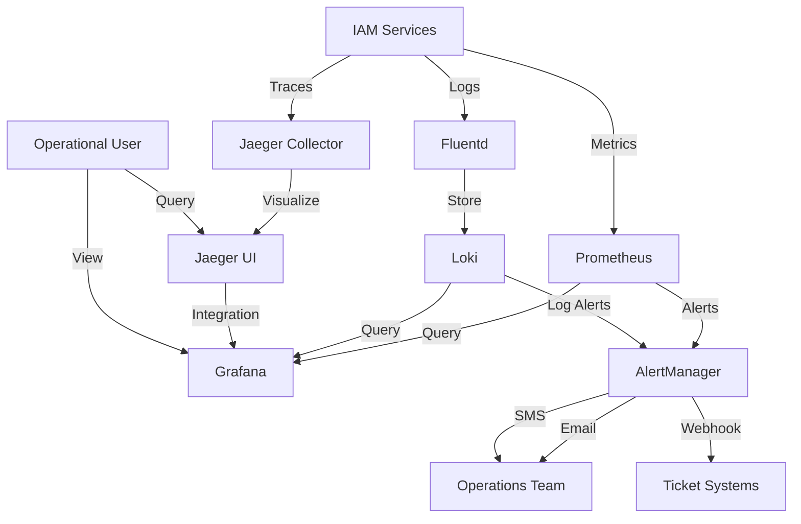

# IAM Monitoring and Alerts

## Introduction

This document describes the monitoring and alerting strategy for the IAM module of the INNOVABIZ platform. Proper monitoring is essential to ensure the availability, security, compliance, and performance of the IAM service across all implementation environments and regions.

## Monitoring Architecture

### Overview

The IAM monitoring architecture is based on the concept of complete observability, which encompasses metrics, logs, and distributed tracing. This architecture aligns with DevOps, DevSecOps, MLOps, and AIOps best practices as specified in the project requirements.


### Components

| Component | Tool | Primary Function |
|------------|------------|------------------|
| Metrics Collection | Prometheus | Capture and storage of performance and operational metrics |
| Visualization | Grafana | Dashboards for visualization of metrics and alerts |
| Log Management | Loki | Aggregation, indexing, and querying of logs |
| Distributed Tracing | Jaeger | Tracing of transactions between services |
| Alerts | AlertManager | Alert management and routing |
| Notifications | Various | Email, SMS, Webhook, Teams, Slack |
| Operational Intelligence | AIOps Tool | Pattern analysis, correlation, and prediction |

### Integration with INNOVABIZ Infrastructure

The IAM monitoring system integrates with the existing INNOVABIZ infrastructure, including:

- Integration with Kafka for event ingestion
- Use of PostgreSQL/TimescaleDB for long-term metrics storage
- Support for multi-tenancy for monitoring data isolation
- Integration with Neo4j for relationship analysis between components

## Metrics Strategy

### Golden Signals

Following the SRE methodology, IAM monitors the following golden signals for all services:

1. **Latency**: Response time of operations
2. **Traffic**: Request volume
3. **Errors**: Failure rate
4. **Saturation**: Resource utilization

### IAM-Specific Metrics

| Category | Metric | Description | Source |
|-----------|---------|-----------|-------|
| **Authentication** | auth_requests_total | Total authentication requests | auth-service |
| | auth_success_rate | Authentication success rate | auth-service |
| | auth_failure_rate | Authentication failure rate | auth-service |
| | auth_latency_ms | Authentication operation latency | auth-service |
| | token_validation_rate | Token validation rate | token-service |
| | mfa_usage_rate | MFA usage rate | auth-service |
| **Authorization** | policy_evaluations_total | Total policy evaluations | rbac-service |
| | policy_evaluation_latency_ms | Policy evaluation latency | rbac-service |
| | policy_cache_hit_ratio | Policy cache hit ratio | rbac-service |
| | rbac_decision_time_ms | Authorization decision time | rbac-service |
| **Users** | active_user_count | Active users per tenant | user-management |
| | user_provisioning_rate | User provisioning rate | user-management |
| | failed_login_attempts | Failed login attempts | auth-service |
| | password_change_rate | Password change rate | user-management |
| **Multi-tenancy** | tenant_count | Number of active tenants | tenant-service |
| | cross_tenant_operations | Cross-tenant operations | tenant-service |
| | tenant_isolation_violations | Isolation violations | security-service |
| **Resources** | cpu_usage_percent | CPU utilization per service | node-exporter |
| | memory_usage_percent | Memory utilization per service | node-exporter |
| | db_connection_count | Database connection count | postgres-exporter |
| | db_query_latency_ms | Database query latency | postgres-exporter |
| **API** | api_requests_total | Total API requests | api-gateway |
| | api_error_rate | API error rate | api-gateway |
| | api_latency_ms | API latency | api-gateway |
| **Security** | security_events_total | Total security events | security-service |
| | brute_force_attempts | Detected brute force attempts | security-service |
| | suspicious_activities | Detected suspicious activities | security-service |

### Dimensions and Labels

All metrics are labeled with the following dimensions:

- `tenant_id`: Tenant identifier
- `service`: Service name
- `environment`: Environment (dev, qa, prod)
- `region`: Geographic region
- `instance`: Specific instance
- `version`: Service version
- `endpoint`: Specific endpoint (for API metrics)

## Logging Strategy

### Logging Model

IAM follows a structured logging model with the following principles:

1. **Standardized format**: JSON logs to facilitate analysis
2. **Enriched context**: Inclusion of relevant contextual information
3. **Correlation**: Correlation IDs for cross-service tracing
4. **Appropriate levels**: Different verbosity levels per environment

### Log Categories

| Category | Description | Retention | 
|-----------|-----------|----------|
| **Audit** | Critical actions and security-related state changes | 7 years |
| **Operational** | Operational events such as startup, shutdown, configuration | 1 year |
| **Debug** | Detailed information for troubleshooting | 30 days |
| **Performance** | Transaction-level specific performance metrics | 90 days |
| **Security** | Security events, denied access attempts, threat detections | 2 years |

### Standardized Log Fields

```json
{
  "timestamp": "2025-05-09T20:38:00.123Z",
  "level": "INFO",
  "service": "auth-service",
  "instance": "auth-service-pod-1234",
  "tenant_id": "tenant-xyz",
  "correlation_id": "abcd-1234-efgh-5678",
  "user_id": "user-123",
  "category": "AUDIT",
  "event": "USER_LOGIN",
  "details": {
    "method": "PASSWORD",
    "source_ip": "192.168.1.1",
    "user_agent": "Mozilla/5.0...",
    "success": true
  },
  "duration_ms": 45
}
```

### Log Management

- **Collection**: Fluentd/Fluent Bit on each node
- **Processing**: Filters for enrichment and normalization
- **Storage**: Loki for operational logs, immutable storage system for audit logs
- **Retention**: Specific policies by category and region (as per regulatory requirements)
- **Query**: Grafana interface for ad-hoc queries and logging dashboards

## Tracing Strategy

### Distributed Tracing Implementation

IAM uses OpenTelemetry for code instrumentation and Jaeger for trace collection and visualization.

Each request receives a unique trace ID that is propagated through all involved services, allowing:

- Visualization of complete authentication/authorization flows
- Identification of bottlenecks in complex operations
- Analysis of dependencies and failure impact
- Correlation of events between services

### Critical Operations Traced

- Complete authentication flows
- Authorization policy evaluations
- User management operations
- Tenant provisioning
- Identity federation
- Administrative operations

## Alerting Strategy

### Alerting Philosophy

IAM alerts follow these principles:

1. **Actionable**: Each alert should indicate a clear action
2. **Accurate**: Minimization of false positives and false negatives
3. **Relevant**: Focus on conditions that affect users
4. **Contextualized**: Sufficient information for initial diagnosis
5. **Prioritized**: Classified by severity and impact

### Alert Policies

| Category | Condition | Severity | Threshold | Interval | Recipients |
|-----------|----------|------------|-----------|-----------|---------------|
| **Availability** | auth-service unavailable | Critical | >=2 min | 1m | Operations Team, Management |
| | API endpoint with 5xx error | High | >1% for 5 min | 5m | Operations Team |
| | Authentication latency | Medium | >500ms for 10 min | 10m | Operations Team |
| **Security** | Multiple login failures | High | >10 failures in 2 min | 2m | Security Team |
| | Privileged access attempt | High | Any occurrence | Immediate | Security Team |
| | Tenant isolation violation | Critical | Any occurrence | Immediate | Security Team, CISO |
| **Performance** | High CPU | Medium | >80% for 15 min | 15m | Operations Team |
| | High memory | Medium | >85% for 10 min | 10m | Operations Team |
| | High DB latency | High | >200ms for 5 min | 5m | DBA, Operations Team |
| | Low cache hit ratio | Low | <60% for 30 min | 30m | Operations Team |
| **Capacity** | High disk usage | High | >85% | 1h | Infrastructure Team |
| | Rapid log growth | Medium | >2x normal for 1h | 1h | Operations Team |
| | Active session spike | Low | >120% of average | 1h | Planning Team |
| **Functional** | Token validation failure | High | >1% for 5 min | 5m | Development Team, Operations |
| | Policy sync error | High | Any failure | 5m | Development Team |
| | Key rotation failure | Critical | Any failure | Immediate | Security Team, Operations |

### Notification Routes

| Severity | Channels | Hours | Response SLA |
|------------|--------|---------|-----------------|
| Critical | SMS, Email, Phone call, Ticket | 24x7 | 15 minutes |
| High | SMS, Email, Ticket | 24x7 | 30 minutes |
| Medium | Email, Ticket | Business hours | 4 hours |
| Low | Email, Dashboard | Business hours | Next business day |

### Silencing and Maintenance

- Planned maintenance periods should be registered in the silencing calendar
- Recurring maintenance windows should be configured
- Ad-hoc silencing requires justification and expiration time
- Repetitive alerts should be reviewed, not indefinitely silenced

## Dashboards and Visualization

### Operational Dashboards

1. **IAM Overview Dashboard**
   - Status of all IAM services
   - Consolidated key metrics
   - Active top alerts
   - Capacity and trends

2. **Authentication Dashboard**
   - Authentication volume
   - Authentication success/failure rate
   - Distribution by method (password, MFA, SSO)
   - Authentication latency

3. **Authorization Dashboard**
   - Policy evaluations per second
   - Decision distribution (allowed/denied)
   - Policy evaluation time
   - Cache efficiency

4. **Security Dashboard**
   - Security events
   - Brute force attempts
   - Privileged activities
   - Geographic distribution of accesses

5. **Multi-tenancy Dashboard**
   - Metrics by tenant
   - Resource isolation
   - Utilization comparison
   - Tenant health

### Specialized Visualizations

1. **Authentication Heat Map**
   - Geographic distribution
   - Temporal patterns (time of day, day of week)
   - Anomaly detection

2. **Service Dependency Graph**
   - Dependency visualization
   - Health status
   - Failure impact

3. **User Flow Tracing**
   - User journey visualization
   - Failure points
   - Response times at each step

## Regional Monitoring

### Multi-Regional Considerations

The INNOVABIZ platform is implemented in multiple regions (EU/Portugal, Brazil, Africa/Angola, USA) with region-specific requirements:

| Region | Specific Considerations | Regulatory Requirements |
|--------|---------------------------|-------------------------|
| **EU/Portugal** | GDPR, data residency rules | Access logs for 6 months, complete traceability |
| **Brazil** | LGPD, variable connectivity | Access logging for 6 months, consent logs |
| **Africa/Angola** | High latency, emerging infrastructure | PNDSB, resilience requirements |
| **USA** | Sectoral compliance, high scale | HIPAA (health), SOX (financial), FedRAMP (gov) |

### Multi-regional Monitoring Strategy

1. **Local Monitoring**
   - Collection instances in each region
   - Local storage of metrics and logs as per regulatory requirements
   - Region-specific alerts

2. **Global Aggregation**
   - Consolidation of metrics in global dashboard
   - Performance comparison between regions
   - Global trend analysis

3. **Latency Considerations**
   - Threshold adjustment by region
   - Compensation for infrastructure differences
   - Inter-regional connectivity metrics

## Security Monitoring

### Threat Detection

IAM implements specific monitoring for threat detection:

1. **Behavioral Anomaly Detection**
   - Unusual authentication patterns
   - Accesses from unusual locations
   - Anomalous user behavior

2. **Attack Detection**
   - Brute force attempts
   - Known vulnerability exploitations
   - Injection attacks

3. **Advanced Security Alerts**
   - Privilege escalation
   - Unauthorized policy changes
   - Suspicious token or credential creation

### Security Event Correlation

- Integration with corporate SIEM
- Correlation between authentication, authorization, and activity events
- Advanced threat detection through ML/AI
- Privileged account monitoring

## Multi-tenant Monitoring

### Monitoring Isolation

IAM implements monitoring isolation by tenant:

1. **Data Isolation**
   - Log separation by tenant
   - Access control to tenant-specific metrics
   - Isolated dashboards by tenant

2. **Isolation Metrics**
   - Active monitoring of tenant boundaries
   - Detection of isolation violations
   - Continuous validation of segregation policies

### Tenant Monitoring Portal

Each tenant has access to a dedicated portal with:

- Specific usage dashboard
- Performance metrics
- Activity logs (within privacy boundaries)
- Specific alerts

## Automation and AIOps

### Automated Recovery

IAM implements automated recovery for common issues:

1. **Auto-healing**
   - Automatic restart in case of failure
   - Load rebalancing
   - Recovery of lost connections

2. **Predefined Remediation**
   - Recovery scripts for known scenarios
   - Automated playbooks
   - Automated escalation

### AIOps and Predictive Analysis

Integrating with the platform's AIOps strategy:

1. **Proactive Detection**
   - Early identification of degradation
   - Prediction of potential issues
   - Trend detection

2. **Root Cause Analysis**
   - Automatic event correlation
   - Root cause suggestions
   - Learning from past incidents

3. **Continuous Optimization**
   - Threshold adjustment suggestions
   - Identification of improvement opportunities
   - Feedback loop for development

## Operational Procedures

### Health Checks

| Check | Frequency | Method | Responsible |
|-------------|------------|--------|-------------|
| Basic service check | 1 minute | Healthcheck on endpoints | Automated system |
| Synthetic transaction | 5 minutes | Authentication and authorization test | Automated system |
| Deep check | 1 hour | Complete functional validation | Automated system |
| Monitoring audit | Weekly | Manual verification of dashboards and alerts | Operations Analyst |

### Alert Response

1. **General Procedure**
   - Acknowledge alert
   - Assess impact and scope
   - Consult specific runbook
   - Execute mitigation actions
   - Escalate if necessary
   - Document actions and results

2. **Escalation Matrix**

| Level | Time | Team | Contact |
|-------|-------|--------|---------|
| L1 | Immediate | IAM Support | iam-support@innovabiz.com |
| L2 | After 30 min | IAM Operations | iam-ops@innovabiz.com |
| L3 | After 60 min | IAM Development | iam-dev@innovabiz.com |
| L4 | Critical incidents | Crisis Management | ciso@innovabiz.com |

### Operation Runbooks

The following runbooks are available for monitoring operations:

- Authentication failure investigation
- Performance issue resolution
- Security violation analysis
- Tenant isolation verification
- Security alert validation

## Implementation and Maintenance

### Implementation

The monitoring system deployment follows the methodology:

1. **Code Instrumentation**
   - OpenTelemetry libraries in all services
   - API middlewares for metrics
   - Interceptors for distributed tracing

2. **Infrastructure**
   - Prometheus for metrics
   - Loki for logs
   - Jaeger for tracing
   - AlertManager for alerts
   - Grafana for visualization

3. **Configuration**
   - Managed via GitOps
   - Versioned and auditable
   - Applied via CI/CD pipeline

### Lifecycle

1. **Evolution**
   - Quarterly review of metrics and alerts
   - Addition of new dashboards as needed
   - Threshold refinement based on historical data

2. **Maintenance**
   - Monthly completeness check
   - Alert validation
   - Documentation update

## References

- [IAM Infrastructure Requirements](../04-Infraestrutura/IAM_Infrastructure_Requirements.md)
- [IAM Technical Architecture](../02-Arquitetura/IAM_Technical_Architecture.md)
- [IAM Operational Guide](../08-Operacoes/IAM_Operational_Guide.md)
- [IAM Troubleshooting Procedures](../08-Operacoes/IAM_Authentication_Troubleshooting.md)
- [IAM Compliance Framework](../10-Governanca/IAM_Compliance_Framework_EN.md)

## Appendices

### A. Useful PromQL Queries

```promql
# Authentication error rate
sum(rate(auth_failures_total[5m])) / sum(rate(auth_requests_total[5m]))

# Authentication latency (95th percentile)
histogram_quantile(0.95, sum(rate(auth_duration_seconds_bucket[5m])) by (le))

# CPU utilization by service
sum(rate(container_cpu_usage_seconds_total[5m])) by (service)

# Errors by tenant
sum(rate(api_errors_total[5m])) by (tenant_id)

# Policies evaluated per second
sum(rate(policy_evaluations_total[5m]))
```

### B. Alert Configuration Examples

```yaml
groups:
- name: iam_alerts
  rules:
  - alert: IAMAuthServiceDown
    expr: up{job="auth-service"} == 0
    for: 2m
    labels:
      severity: critical
      service: iam
    annotations:
      summary: "Authentication Service is down"
      description: "Auth service instance {{ $labels.instance }} has been down for more than 2 minutes."
      runbook: "https://innovabiz.com/docs/iam/runbooks/auth-service-down"

  - alert: IAMHighAuthFailureRate
    expr: sum(rate(auth_failures_total[5m])) by (tenant_id) / sum(rate(auth_requests_total[5m])) by (tenant_id) > 0.1
    for: 5m
    labels:
      severity: warning
      service: iam
    annotations:
      summary: "High authentication failure rate"
      description: "Tenant {{ $labels.tenant_id }} has authentication failure rate above 10% for more than 5 minutes."
      runbook: "https://innovabiz.com/docs/iam/runbooks/high-auth-failure"
```

### C. Monitoring Data Flow Diagram


