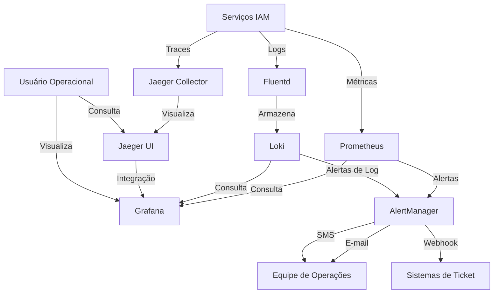

# Monitoramento e Alertas do IAM

## Introdução

Este documento descreve a estratégia de monitoramento e alertas para o módulo IAM da plataforma INNOVABIZ. O monitoramento adequado é essencial para garantir a disponibilidade, segurança, conformidade e desempenho do serviço IAM em todos os ambientes e regiões de implementação.

## Arquitetura de Monitoramento

### Visão Geral

A arquitetura de monitoramento do IAM é baseada no conceito de observabilidade completa, que abrange métricas, logs e rastreamento distribuído. Esta arquitetura está alinhada com as melhores práticas de DevOps, DevSecOps, MLOps e AIOps conforme especificado nos requisitos do projeto.


### Componentes

| Componente | Ferramenta | Função Principal |
|------------|------------|------------------|
| Coleta de Métricas | Prometheus | Captura e armazenamento de métricas de desempenho e operacionais |
| Visualização | Grafana | Dashboards para visualização de métricas e alertas |
| Gerenciamento de Logs | Loki | Agregação, indexação e consulta de logs |
| Rastreamento Distribuído | Jaeger | Rastreamento de transações entre serviços |
| Alertas | AlertManager | Gerenciamento e roteamento de alertas |
| Notificações | Diversas | E-mail, SMS, Webhook, Teams, Slack |
| Inteligência Operacional | AIOps Tool | Análise de padrões, correlação e previsão |

### Integração com a Infraestrutura INNOVABIZ

O sistema de monitoramento do IAM integra-se com a infraestrutura existente do INNOVABIZ, incluindo:

- Integração com Kafka para ingestão de eventos
- Utilização do PostgreSQL/TimescaleDB para armazenamento de métricas de longo prazo
- Suporte à multi-tenancy para isolamento de dados de monitoramento
- Integração com Neo4j para análise de relacionamentos entre componentes

## Estratégia de Métricas

### Métricas Principais (Golden Signals)

Seguindo a metodologia SRE, o IAM monitora os seguintes sinais dourados para todos os serviços:

1. **Latência**: Tempo de resposta das operações
2. **Tráfego**: Volume de requisições
3. **Erros**: Taxa de falhas
4. **Saturação**: Utilização de recursos

### Métricas Específicas do IAM

| Categoria | Métrica | Descrição | Fonte |
|-----------|---------|-----------|-------|
| **Autenticação** | auth_requests_total | Total de requisições de autenticação | auth-service |
| | auth_success_rate | Taxa de sucesso de autenticação | auth-service |
| | auth_failure_rate | Taxa de falhas de autenticação | auth-service |
| | auth_latency_ms | Latência de operações de autenticação | auth-service |
| | token_validation_rate | Taxa de validações de token | token-service |
| | mfa_usage_rate | Taxa de uso de MFA | auth-service |
| **Autorização** | policy_evaluations_total | Total de avaliações de políticas | rbac-service |
| | policy_evaluation_latency_ms | Latência de avaliação de políticas | rbac-service |
| | policy_cache_hit_ratio | Taxa de acerto de cache de políticas | rbac-service |
| | rbac_decision_time_ms | Tempo de decisão de autorização | rbac-service |
| **Usuários** | active_user_count | Usuários ativos por tenant | user-management |
| | user_provisioning_rate | Taxa de provisionamento de usuários | user-management |
| | failed_login_attempts | Tentativas de login malsucedidas | auth-service |
| | password_change_rate | Taxa de alteração de senhas | user-management |
| **Multi-tenancy** | tenant_count | Número de tenants ativos | tenant-service |
| | cross_tenant_operations | Operações entre tenants | tenant-service |
| | tenant_isolation_violations | Violações de isolamento | security-service |
| **Recursos** | cpu_usage_percent | Utilização de CPU por serviço | node-exporter |
| | memory_usage_percent | Utilização de memória por serviço | node-exporter |
| | db_connection_count | Número de conexões com banco de dados | postgres-exporter |
| | db_query_latency_ms | Latência de consultas ao banco | postgres-exporter |
| **API** | api_requests_total | Total de requisições à API | api-gateway |
| | api_error_rate | Taxa de erros da API | api-gateway |
| | api_latency_ms | Latência da API | api-gateway |
| **Segurança** | security_events_total | Total de eventos de segurança | security-service |
| | brute_force_attempts | Tentativas de força bruta detectadas | security-service |
| | suspicious_activities | Atividades suspeitas detectadas | security-service |

### Dimensões e Etiquetas

Todas as métricas são etiquetadas com as seguintes dimensões:

- `tenant_id`: Identificador do tenant
- `service`: Nome do serviço
- `environment`: Ambiente (dev, qa, prod)
- `region`: Região geográfica
- `instance`: Instância específica
- `version`: Versão do serviço
- `endpoint`: Endpoint específico (para métricas de API)

## Estratégia de Logs

### Modelo de Logging

O IAM segue um modelo de logging estruturado com os seguintes princípios:

1. **Formato padronizado**: Logs em JSON para facilitar a análise
2. **Contexto enriquecido**: Inclusão de informações contextuais relevantes
3. **Correlação**: IDs de correlação para rastreamento entre serviços
4. **Níveis adequados**: Diferentes níveis de verbosidade por ambiente

### Categorias de Logs

| Categoria | Descrição | Retenção | 
|-----------|-----------|----------|
| **Auditoria** | Ações críticas e mudanças de estado relacionadas a segurança | 7 anos |
| **Operacional** | Eventos operacionais como inicialização, desligamento, configuração | 1 ano |
| **Debug** | Informações detalhadas para resolução de problemas | 30 dias |
| **Performance** | Métricas de desempenho específicas a nível de transação | 90 dias |
| **Segurança** | Eventos de segurança, tentativas de acesso negado, detecções de ameaças | 2 anos |

### Campos Padronizados de Log

```json
{
  "timestamp": "2025-05-09T20:38:00.123Z",
  "level": "INFO",
  "service": "auth-service",
  "instance": "auth-service-pod-1234",
  "tenant_id": "tenant-xyz",
  "correlation_id": "abcd-1234-efgh-5678",
  "user_id": "user-123",
  "category": "AUDIT",
  "event": "USER_LOGIN",
  "details": {
    "method": "PASSWORD",
    "source_ip": "192.168.1.1",
    "user_agent": "Mozilla/5.0...",
    "success": true
  },
  "duration_ms": 45
}
```

### Gestão de Logs

- **Coleta**: Fluentd/Fluent Bit em cada nó
- **Processamento**: Filtros para enriquecimento e normalização
- **Armazenamento**: Loki para logs operacionais, sistema de armazenamento imutável para logs de auditoria
- **Retenção**: Políticas específicas por categoria e região (conforme requisitos regulatórios)
- **Consulta**: Interface Grafana para consultas ad-hoc e dashboards de logging

## Estratégia de Rastreamento

### Implementação de Rastreamento Distribuído

O IAM utiliza o OpenTelemetry para instrumentação de código e o Jaeger para coleta e visualização de traces.

Cada requisição recebe um ID de trace único que é propagado por todos os serviços envolvidos, permitindo:

- Visualização de fluxos completos de autenticação/autorização
- Identificação de bottlenecks em operações complexas
- Análise de dependências e impacto de falhas
- Correlação de eventos entre serviços

### Operações Críticas Rastreadas

- Fluxos completos de autenticação
- Avaliações de políticas de autorização
- Operações de gerenciamento de usuários
- Provisionamento de tenant
- Federação de identidade
- Operações administrativas

## Estratégia de Alertas

### Filosofia de Alertas

Os alertas do IAM seguem os princípios:

1. **Acionáveis**: Cada alerta deve indicar uma ação clara
2. **Precisos**: Minimização de falsos positivos e falsos negativos
3. **Relevantes**: Foco em condições que afetam os usuários
4. **Contextualizados**: Informações suficientes para diagnóstico inicial
5. **Priorizados**: Classificados por severidade e impacto

### Políticas de Alertas

| Categoria | Condição | Severidade | Threshold | Intervalo | Destinatários |
|-----------|----------|------------|-----------|-----------|---------------|
| **Disponibilidade** | auth-service indisponível | Crítica | >=2 min | 1m | Equipe de Operações, Gerência |
| | Endpoint de API com erro 5xx | Alta | >1% por 5 min | 5m | Equipe de Operações |
| | Latência de autenticação | Média | >500ms por 10 min | 10m | Equipe de Operações |
| **Segurança** | Múltiplas falhas de login | Alta | >10 falhas em 2 min | 2m | Equipe de Segurança |
| | Tentativa de acesso privilegiado | Alta | Qualquer ocorrência | Imediato | Equipe de Segurança |
| | Violação de isolamento de tenant | Crítica | Qualquer ocorrência | Imediato | Equipe de Segurança, CISO |
| **Performance** | CPU elevada | Média | >80% por 15 min | 15m | Equipe de Operações |
| | Memória elevada | Média | >85% por 10 min | 10m | Equipe de Operações |
| | Latência de DB elevada | Alta | >200ms por 5 min | 5m | DBA, Equipe de Operações |
| | Cache hit ratio baixo | Baixa | <60% por 30 min | 30m | Equipe de Operações |
| **Capacidade** | Uso de disco elevado | Alta | >85% | 1h | Equipe de Infraestrutura |
| | Crescimento rápido de logs | Média | >2x normal por 1h | 1h | Equipe de Operações |
| | Pico de sessões ativas | Baixa | >120% da média | 1h | Equipe de Planejamento |
| **Funcional** | Falha em validação de token | Alta | >1% por 5 min | 5m | Equipe de Desenvolvimento, Operações |
| | Erro em sincronização de política | Alta | Qualquer falha | 5m | Equipe de Desenvolvimento |
| | Falha em rotação de chaves | Crítica | Qualquer falha | Imediato | Equipe de Segurança, Operações |

### Rotas de Notificação

| Severidade | Canais | Horário | SLA de Resposta |
|------------|--------|---------|-----------------|
| Crítica | SMS, E-mail, Chamada telefônica, Ticket | 24x7 | 15 minutos |
| Alta | SMS, E-mail, Ticket | 24x7 | 30 minutos |
| Média | E-mail, Ticket | Horário comercial | 4 horas |
| Baixa | E-mail, Dashboard | Horário comercial | Próximo dia útil |

### Silenciamento e Manutenção

- Períodos de manutenção planejada devem ser registrados no calendário de silenciamento
- Janelas de manutenção recorrentes devem ser configuradas
- Silenciamentos ad-hoc requerem justificativa e prazo de expiração
- Alertas repetitivos devem ser revisados, não silenciados indefinidamente

## Dashboards e Visualização

### Dashboards Operacionais

1. **Dashboard de Visão Geral do IAM**
   - Status de todos os serviços IAM
   - Métricas principais consolidadas
   - Principais alertas ativos
   - Capacidade e tendências

2. **Dashboard de Autenticação**
   - Volume de autenticações
   - Taxa de sucesso/falha de autenticação
   - Distribuição por método (senha, MFA, SSO)
   - Latência de autenticação

3. **Dashboard de Autorização**
   - Avaliações de políticas por segundo
   - Distribuição de decisões (permitido/negado)
   - Tempo de avaliação de políticas
   - Eficiência de cache

4. **Dashboard de Segurança**
   - Eventos de segurança
   - Tentativas de força bruta
   - Atividades privilegiadas
   - Distribuição geográfica de acessos

5. **Dashboard de Multi-tenancy**
   - Métricas por tenant
   - Isolamento de recursos
   - Comparativo de utilização
   - Saúde por tenant

### Visualizações Especializadas

1. **Mapa de Calor de Autenticação**
   - Distribuição geográfica
   - Padrões temporais (hora do dia, dia da semana)
   - Detecção de anomalias

2. **Gráfico de Dependência de Serviços**
   - Visualização de dependências
   - Status de saúde
   - Impacto de falhas

3. **Rastreamento de Fluxos de Usuário**
   - Visualização de jornadas de usuário
   - Pontos de falha
   - Tempos de resposta em cada etapa

## Monitoramento por Região

### Considerações Multi-Regionais

A plataforma INNOVABIZ é implementada em múltiplas regiões (UE/Portugal, Brasil, África/Angola, EUA) com requisitos específicos por região:

| Região | Considerações Específicas | Requisitos Regulatórios |
|--------|---------------------------|-------------------------|
| **UE/Portugal** | GDPR, regras de residência de dados | Logs de acesso por 6 meses, rastreabilidade completa |
| **Brasil** | LGPD, conectividade variável | Registro de acesso por 6 meses, logs de consentimento |
| **África/Angola** | Latência elevada, infraestrutura emergente | PNDSB, requisitos de resiliência |
| **EUA** | Compliance setorial, alta escala | HIPAA (saúde), SOX (financeiro), FedRAMP (gov) |

### Estratégia de Monitoramento Multi-regional

1. **Monitoramento Local**
   - Instâncias de coleta em cada região
   - Armazenamento local de métricas e logs conforme requisitos regulatórios
   - Alertas específicos por região

2. **Agregação Global**
   - Consolidação de métricas em dashboard global
   - Comparativo de performance entre regiões
   - Análise de tendências globais

3. **Considerações de Latência**
   - Ajuste de thresholds por região
   - Compensação de diferenças na infraestrutura
   - Métricas de conectividade inter-regional

## Monitoramento de Segurança

### Detecção de Ameaças

O IAM implementa monitoramento específico para detecção de ameaças:

1. **Detecção de Anomalias Comportamentais**
   - Padrões incomuns de autenticação
   - Acessos de localizações não usuais
   - Comportamento de usuário anômalo

2. **Detecção de Ataques**
   - Tentativas de força bruta
   - Explorações de vulnerabilidades conhecidas
   - Ataques de injeção

3. **Alertas de Segurança Avançados**
   - Escalonamento de privilégios
   - Mudanças não autorizadas em políticas
   - Criação suspeita de tokens ou credenciais

### Correlação de Eventos de Segurança

- Integração com SIEM corporativo
- Correlação entre eventos de autenticação, autorização e atividade
- Detecção de ameaças avançadas através de ML/AI
- Monitoramento de contas privilegiadas

## Monitoramento Multi-tenant

### Isolamento de Monitoramento

O IAM implementa isolamento de monitoramento por tenant:

1. **Isolamento de Dados**
   - Separação de logs por tenant
   - Controle de acesso a métricas específicas do tenant
   - Dashboards isolados por tenant

2. **Métricas de Isolamento**
   - Monitoramento ativo de fronteiras de tenant
   - Detecção de violações de isolamento
   - Validação contínua de políticas de segregação

### Portal de Monitoramento por Tenant

Cada tenant tem acesso a um portal dedicado com:

- Dashboard específico de utilização
- Métricas de performance
- Logs de atividade (dentro dos limites de privacidade)
- Alertas específicos

## Automação e AIOps

### Recuperação Automatizada

O IAM implementa recuperação automatizada para problemas comuns:

1. **Auto-healing**
   - Restart automático em caso de falha
   - Rebalanceamento de carga
   - Recuperação de conexões perdidas

2. **Remediação Predefinida**
   - Scripts de recuperação para cenários conhecidos
   - Playbooks automatizados
   - Escalonamento automatizado

### AIOps e Análise Preditiva

Integrando com a estratégia AIOps da plataforma:

1. **Detecção Proativa**
   - Identificação precoce de degradação
   - Predição de problemas potenciais
   - Detecção de tendências

2. **Análise de Causa Raiz**
   - Correlação automática de eventos
   - Sugestões de causa raiz
   - Aprendizado com incidentes passados

3. **Otimização Contínua**
   - Sugestões de ajustes de threshold
   - Identificação de oportunidades de melhoria
   - Feedback loop para desenvolvimento

## Procedimentos Operacionais

### Verificações de Saúde

| Verificação | Frequência | Método | Responsável |
|-------------|------------|--------|-------------|
| Verificação básica de serviços | 1 minuto | Healthcheck em endpoints | Sistema automatizado |
| Transação sintética | 5 minutos | Teste de autenticação e autorização | Sistema automatizado |
| Verificação profunda | 1 hora | Validação funcional completa | Sistema automatizado |
| Auditoria de monitoramento | Semanal | Verificação manual de dashboards e alertas | Analista de Operações |

### Resposta a Alertas

1. **Procedimento Geral**
   - Reconhecer alerta
   - Avaliar impacto e escopo
   - Consultar runbook específico
   - Executar ações de mitigação
   - Escalar se necessário
   - Documentar ações e resultados

2. **Matriz de Escalação**

| Nível | Tempo | Equipe | Contato |
|-------|-------|--------|---------|
| L1 | Imediato | Suporte IAM | iam-support@innovabiz.com |
| L2 | Após 30 min | Operações IAM | iam-ops@innovabiz.com |
| L3 | Após 60 min | Desenvolvimento IAM | iam-dev@innovabiz.com |
| L4 | Incidentes críticos | Gestão de Crise | ciso@innovabiz.com |

### Runbooks de Operação

Os seguintes runbooks estão disponíveis para operações de monitoramento:

- Investigação de falhas de autenticação
- Resolução de problemas de performance
- Análise de violações de segurança
- Verificação de isolamento de tenant
- Validação de alertas de segurança

## Implementação e Manutenção

### Implementação

A implantação do sistema de monitoramento segue a metodologia:

1. **Instrumentação de Código**
   - Bibliotecas OpenTelemetry em todos os serviços
   - Middlewares para métricas em APIs
   - Interceptores para rastreamento distribuído

2. **Infraestrutura**
   - Prometheus para métricas
   - Loki para logs
   - Jaeger para rastreamento
   - AlertManager para alertas
   - Grafana para visualização

3. **Configuração**
   - Gerenciada via GitOps
   - Versionada e auditável
   - Aplicada via pipeline CI/CD

### Ciclo de Vida

1. **Evolução**
   - Revisão trimestral de métricas e alertas
   - Adição de novos dashboards conforme necessidade
   - Refinamento de thresholds baseado em dados históricos

2. **Manutenção**
   - Verificação mensal de completude
   - Validação de alertas
   - Atualização de documentação

## Referências

- [Requisitos de Infraestrutura IAM](../04-Infraestrutura/Requisitos_Infraestrutura_IAM.md)
- [Arquitetura Técnica IAM](../02-Arquitetura/Arquitetura_Tecnica_IAM.md)
- [Guia Operacional IAM](../08-Operacoes/Guia_Operacional_IAM.md)
- [Procedimentos de Troubleshooting IAM](../08-Operacoes/Troubleshooting_Autenticacao_IAM.md)
- [Framework de Compliance IAM](../10-Governanca/Framework_Compliance_IAM.md)

## Apêndices

### A. Queries PromQL Úteis

```promql
# Taxa de erros de autenticação
sum(rate(auth_failures_total[5m])) / sum(rate(auth_requests_total[5m]))

# Latência de autenticação (percentil 95)
histogram_quantile(0.95, sum(rate(auth_duration_seconds_bucket[5m])) by (le))

# Utilização de CPU por serviço
sum(rate(container_cpu_usage_seconds_total[5m])) by (service)

# Erros por tenant
sum(rate(api_errors_total[5m])) by (tenant_id)

# Políticas avaliadas por segundo
sum(rate(policy_evaluations_total[5m]))
```

### B. Exemplos de Configuração de Alertas

```yaml
groups:
- name: iam_alerts
  rules:
  - alert: IAMAuthServiceDown
    expr: up{job="auth-service"} == 0
    for: 2m
    labels:
      severity: critical
      service: iam
    annotations:
      summary: "Authentication Service is down"
      description: "Auth service instance {{ $labels.instance }} has been down for more than 2 minutes."
      runbook: "https://innovabiz.com/docs/iam/runbooks/auth-service-down"

  - alert: IAMHighAuthFailureRate
    expr: sum(rate(auth_failures_total[5m])) by (tenant_id) / sum(rate(auth_requests_total[5m])) by (tenant_id) > 0.1
    for: 5m
    labels:
      severity: warning
      service: iam
    annotations:
      summary: "High authentication failure rate"
      description: "Tenant {{ $labels.tenant_id }} has authentication failure rate above 10% for more than 5 minutes."
      runbook: "https://innovabiz.com/docs/iam/runbooks/high-auth-failure"
```

### C. Diagrama de Fluxo de Dados de Monitoramento


