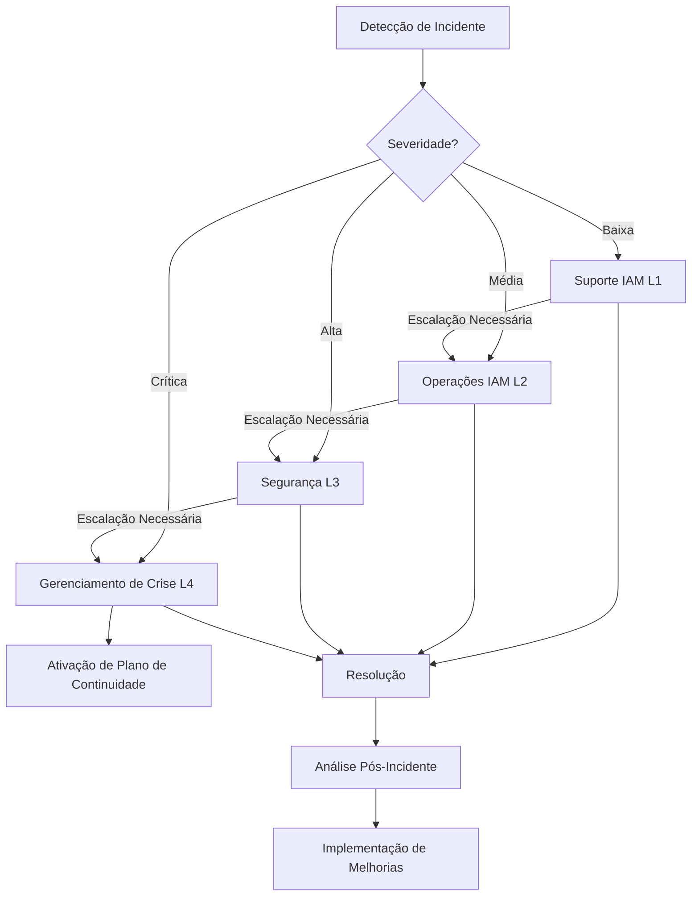

# Procedimentos de Resposta a Incidentes IAM

## Introdução

Este documento descreve os procedimentos de resposta a incidentes para o módulo IAM da plataforma INNOVABIZ. Estes procedimentos foram desenvolvidos para garantir uma resposta rápida, eficaz e coordenada a incidentes relacionados à autenticação, autorização e gestão de identidades, minimizando o impacto nos negócios e mantendo a conformidade com os requisitos regulatórios aplicáveis.

## Definição de Incidentes IAM

Um incidente IAM é definido como qualquer evento que:

1. Comprometa ou potencialmente comprometa a confidencialidade, integridade ou disponibilidade dos serviços IAM
2. Viole ou potencialmente viole as políticas de segurança relacionadas a identidades e acessos
3. Resulte em acesso não autorizado, elevação de privilégios ou perda de funcionalidade crítica
4. Afete a capacidade dos usuários legítimos de acessar os recursos necessários

### Classificação de Incidentes

| Nível | Descrição | Exemplos | Tempo de Resposta |
|-------|-----------|----------|-------------------|
| **Crítico** | Impacto severo nos negócios, risco significativo de segurança | Comprometimento de conta privilegiada, falha completa do serviço de autenticação, violação de dados | Imediato (15 minutos) |
| **Alto** | Impacto significativo, operações de negócio afetadas | Falha parcial no serviço de autenticação, tentativas sistemáticas de ataque, exploit de vulnerabilidade | 30 minutos |
| **Médio** | Impacto moderado, operações de negócio parcialmente afetadas | Elevação de privilégios não autorizada, falhas recorrentes de autenticação, degradação de desempenho | 2 horas |
| **Baixo** | Impacto limitado, pouco ou nenhum efeito nas operações de negócio | Pequenos erros de configuração, atividade suspeita isolada, desvios de política | 8 horas |

## Equipe de Resposta a Incidentes

### Estrutura da Equipe

A resposta a incidentes IAM envolve uma equipe multidisciplinar com papéis e responsabilidades claramente definidos:

| Papel | Responsabilidades | Requisitos |
|-------|-------------------|------------|
| **Coordenador de Incidentes** | Coordenação geral, comunicação, tomada de decisão | Conhecimento do plano de resposta a incidentes, autoridade decisória |
| **Especialista IAM** | Investigação técnica, contenção e remediação | Conhecimento profundo da arquitetura IAM, certificações de segurança |
| **Analista de Segurança** | Análise de logs, forense digital, investigação de ameaças | Experiência em análise de segurança, ferramentas de monitoramento |
| **Administrador de Sistemas** | Suporte de infraestrutura, backups, restauração | Conhecimento dos sistemas subjacentes |
| **Representante Legal/Compliance** | Avaliação de requisitos legais e regulatórios | Conhecimento das leis aplicáveis (GDPR, LGPD, etc.) |
| **Representante de Comunicações** | Comunicação interna e externa | Experiência em comunicação de crise |

### Contatos e Escalação

| Nível | Equipe | Contato | Horário de Disponibilidade |
|-------|--------|---------|---------------------------|
| L1 | Suporte IAM | iam-support@innovabiz.com | 24x7 |
| L2 | Operações IAM | iam-ops@innovabiz.com | 24x7 |
| L3 | Segurança | security@innovabiz.com | 24x7 |
| L4 | Gerenciamento de Crise | ciso@innovabiz.com | 24x7 |

## Fluxo de Resposta a Incidentes

O processo de resposta a incidentes IAM segue as seis fases recomendadas pelo NIST e adaptadas para o contexto específico de gerenciamento de identidades e acessos:

### 1. Preparação

Atividades contínuas para garantir prontidão:

- Manutenção de inventário atualizado de sistemas IAM
- Treinamento regular da equipe de resposta
- Realização de simulações de incidentes
- Manutenção de runbooks e playbooks atualizados
- Verificação regular das ferramentas de detecção e resposta

### 2. Detecção e Análise

Processos para identificar e validar incidentes:

- Monitoramento contínuo dos logs de segurança IAM
- Análise de alertas gerados pelo sistema de monitoramento
- Triagem inicial para determinar a legitimidade do incidente
- Classificação do incidente conforme criticidade
- Documentação inicial do incidente

**Indicadores de Comprometimento (IoCs) a Monitorar:**

- Alterações não autorizadas em políticas de acesso
- Padrões anômalos de autenticação
- Falhas múltiplas de autenticação
- Acessos a partir de localizações incomuns
- Atividade fora do horário normal
- Criação não autorizada de contas privilegiadas
- Modificações em logs de auditoria

### 3. Contenção

Ações para limitar o dano:

#### Contenção Imediata

- Bloqueio de contas suspeitas ou comprometidas
- Revogação de tokens de acesso e sessões ativas
- Implementação de políticas de acesso restritivas
- Isolamento de sistemas comprometidos
- Rotação de chaves e credenciais críticas

#### Contenção Estratégica

- Implementação de monitoramento adicional
- Revisão e ajuste de controles de acesso
- Reforço de validações de autenticação

### 4. Erradicação

Remoção da ameaça do ambiente:

- Identificação e remoção de backdoors ou acessos não autorizados
- Remoção de contas maliciosas
- Correção de vulnerabilidades exploradas
- Validação de configurações de segurança
- Implementação de proteções adicionais

### 5. Recuperação

Restauração segura das operações:

- Restauração de serviços IAM conforme prioridades de negócio
- Redefinição de credenciais e segredos
- Implementação de autenticação multifator adicional (quando aplicável)
- Monitoramento intensificado durante o período de recuperação
- Testes de validação para confirmar o funcionamento adequado
- Retorno gradual à operação normal

### 6. Lições Aprendidas

Análise pós-incidente:

- Realização de análise de causa raiz
- Documentação detalhada do incidente e resposta
- Identificação de melhorias no processo de resposta
- Atualização de procedimentos e controles
- Compartilhamento de conhecimento com a equipe
- Implementação de medidas preventivas

## Procedimentos Específicos para Incidentes IAM

### 1. Comprometimento de Conta Privilegiada

**Detecção:**
- Alertas de atividade anômala em contas administrativas
- Alterações não autorizadas em configurações críticas
- Atividade de autenticação suspeita

**Resposta:**
1. Isole a conta comprometida, desativando-a imediatamente
2. Revogue todas as sessões ativas e tokens associados
3. Preserve logs para investigação forense
4. Identifique o vetor de ataque (phishing, credenciais vazadas, etc.)
5. Verifique outras contas administrativas para sinais de comprometimento
6. Investigue todas as ações realizadas pela conta comprometida
7. Redefina as credenciais usando um processo seguro
8. Implemente controles adicionais (exemplo: aprovação multi-pessoa para ações privilegiadas)

### 2. Falha no Sistema de Autenticação

**Detecção:**
- Monitoramento de disponibilidade do serviço
- Aumento em erros de autenticação
- Relatórios de usuários incapazes de acessar o sistema

**Resposta:**
1. Identifique o componente específico com falha (servidor, banco de dados, serviço externo)
2. Verifique logs de sistema e aplicação para identificar a causa
3. Determine se é uma falha ou um ataque (DoS)
4. Para falhas técnicas:
   - Reinicie serviços afetados se necessário
   - Aplique escalonamento automático se apropriado
   - Restaure a partir de backup se necessário
5. Para ataques DoS:
   - Implemente mitigações (filtragem de tráfego, rate limiting)
   - Informe a equipe de segurança de rede
6. Ative mecanismos alternativos de autenticação (se disponíveis)
7. Comunique o status aos usuários afetados

### 3. Vazamento de Dados de Identidade

**Detecção:**
- Alertas de exfiltração de dados
- Consultas incomuns ao banco de dados IAM
- Informações de identidade encontradas externamente

**Resposta:**
1. Identifique a extensão e natureza dos dados vazados
2. Isole os sistemas afetados para prevenir vazamentos adicionais
3. Preserve evidências para investigação
4. Notifique as equipes jurídica e de compliance
5. Inicie processo de notificação regulatória (GDPR/LGPD)
6. Force redefinição de senha para contas afetadas
7. Implemente monitoramento adicional para identidades comprometidas
8. Prepare comunicação para os usuários afetados

### 4. Tentativas de Força Bruta

**Detecção:**
- Múltiplas falhas de autenticação de um mesmo IP ou para mesma conta
- Padrão sistemático de tentativas de login

**Resposta:**
1. Implemente bloqueio temporário após falhas repetidas (se ainda não ativo)
2. Bloqueie os IPs de origem das tentativas
3. Verifique se alguma conta foi comprometida
4. Considere implementação de mecanismos adicionais de proteção (CAPTCHA, atraso progressivo)
5. Analise padrões para identificar alvos específicos
6. Considere notificar usuários com contas alvo de múltiplas tentativas

### 5. Alterações Não Autorizadas em Políticas

**Detecção:**
- Alertas de modificação em políticas de acesso
- Verificações periódicas de configuração
- Relatórios de acesso inesperado ou negado

**Resposta:**
1. Identifique as políticas modificadas e a natureza das alterações
2. Reverta imediatamente para versão anterior conhecida como segura
3. Identifique as contas utilizadas para realizar as alterações
4. Verifique se as contas foram comprometidas
5. Implemente revisão adicional para alterações de políticas
6. Reforce o princípio de segregação de funções

## Requisitos de Documentação de Incidentes

Cada incidente deve ser documentado detalhadamente, incluindo:

1. **Resumo do Incidente**
   - ID único do incidente
   - Data e hora de detecção
   - Duração do incidente
   - Sistemas afetados
   - Classificação de severidade
   - Equipe de resposta envolvida

2. **Detalhes Técnicos**
   - Natureza técnica do incidente
   - Métodos de ataque ou causa da falha
   - Evidências coletadas
   - Logs relevantes
   - Indicadores de comprometimento

3. **Ações de Resposta**
   - Cronologia detalhada de ações tomadas
   - Medidas de contenção implementadas
   - Ações de erradicação
   - Etapas de recuperação

4. **Impacto**
   - Sistemas e dados afetados
   - Impacto operacional
   - Impacto financeiro (se aplicável)
   - Impacto reputacional (se aplicável)
   - Violações de compliance ou regulatórias

5. **Análise Pós-Incidente**
   - Causa raiz identificada
   - Falhas em controles existentes
   - Lições aprendidas
   - Recomendações para melhorias

## Adequação Regional e Compliance

As respostas a incidentes devem ser adaptadas para atender aos requisitos regulatórios específicos de cada região de operação:

| Região | Requisitos de Resposta a Incidentes | Notificações Obrigatórias |
|--------|--------------------------------------|---------------------------|
| **UE/Portugal** | GDPR Artigo 33 - Notificação em 72h | Autoridade nacional (CNPD), indivíduos afetados |
| **Brasil** | LGPD - Notificação em tempo razoável | ANPD, indivíduos afetados |
| **África/Angola** | PNDSB - Requisitos de notificação | Autoridade reguladora local |
| **EUA** | Varia por estado e setor (HIPAA, SOX) | Agências estaduais/federais, indivíduos afetados |

## Comunicação Durante Incidentes

### Comunicação Interna

- Utilizar canais seguros pré-estabelecidos
- Manter registros de todas as comunicações
- Seguir a matriz de escalação definida
- Fornecer atualizações regulares de status

### Comunicação Externa

- Toda comunicação externa deve ser aprovada pela equipe jurídica
- Utilizar modelos de comunicação pré-aprovados
- Ser transparente mas não divulgar detalhes que possam aumentar o risco
- Designar um único porta-voz para comunicações externas

## Treinamento e Simulações

Para manter a eficácia dos procedimentos de resposta:

1. **Treinamento Regular**
   - Treinamento básico para toda a equipe IAM
   - Treinamento especializado para a equipe de resposta
   - Certificações relevantes (CISSP, CISM, etc.)

2. **Simulações**
   - Exercícios de mesa trimestrais
   - Simulação técnica completa semestral
   - Testes de invasão anuais focados no IAM

3. **Revisão e Atualização**
   - Revisão trimestral dos procedimentos
   - Atualização conforme necessário após incidentes ou simulações
   - Avaliação anual completa

## Ferramentas de Resposta a Incidentes

| Categoria | Ferramentas | Propósito |
|-----------|-------------|-----------|
| **Detecção** | SIEM, IDS/IPS, UEBA | Identificação de atividades suspeitas |
| **Análise** | Ferramentas forenses, analisadores de log | Investigação de causas e impactos |
| **Contenção** | Scripts de automação, ferramentas de bloqueio | Limitar danos e propagar respostas |
| **Comunicação** | Plataformas de gestão de incidentes, sistemas de notificação | Coordenação de resposta |
| **Recuperação** | Sistemas de backup, ferramentas de restauração | Retorno à operação normal |
| **Documentação** | Sistemas de ticketing, ferramentas de gerenciamento de conhecimento | Registro e análise |

## Integração com Outros Processos

### Gestão de Vulnerabilidades

- Priorizar correções para vulnerabilidades em componentes IAM
- Estabelecer SLAs para correção baseados no risco
- Implementar processos de verificação pós-correção

### Gestão de Mudanças

- Revisar todas as mudanças nos componentes IAM para riscos de segurança
- Implementar aprovações adicionais para mudanças em componentes críticos
- Manter janelas de manutenção para minimizar impacto

### Backup e Recuperação

- Incluir componentes IAM nos processos regulares de backup
- Testar periodicamente a recuperação de sistemas IAM
- Manter documentação atualizada de procedimentos de recuperação

## Referências

- [Guia Operacional IAM](../08-Operacoes/Guia_Operacional_IAM.md)
- [Procedimentos de Backup e Recuperação IAM](../08-Operacoes/Procedimentos_Backup_Recovery_IAM.md)
- [Monitoramento e Alertas IAM](../08-Operacoes/Monitoramento_Alertas_IAM.md)
- [Framework de Compliance IAM](../10-Governanca/Framework_Compliance_IAM.md)
- [NIST SP 800-61 Computer Security Incident Handling Guide](https://nvlpubs.nist.gov/nistpubs/SpecialPublications/NIST.SP.800-61r2.pdf)
- [ISO/IEC 27035 Information technology — Security techniques — Information security incident management](https://www.iso.org/standard/60803.html)

## Apêndices

### A. Templates de Resposta a Incidentes

#### Template de Relatório Inicial de Incidente

```
ID do Incidente: 
Data/Hora de Detecção:
Detectado por:
Sistemas Afetados:
Classificação Inicial:
Descrição:
Ações Imediatas Tomadas:
Próximos Passos:
Equipe de Resposta Designada:
```

#### Template de Relatório de Status de Incidente

```
ID do Incidente:
Data/Hora da Atualização:
Status Atual:
Progresso desde Última Atualização:
Desafios Encontrados:
Próximas Ações:
Cronograma Estimado:
Recursos Adicionais Necessários:
```

#### Template de Relatório Pós-Incidente

```
ID do Incidente:
Período do Incidente:
Sistemas Afetados:
Impacto Final:
Causa Raiz:
Cronologia Completa:
Ações Tomadas:
Eficácia das Ações:
Lições Aprendidas:
Recomendações:
Plano de Implementação de Melhorias:
```

### B. Fluxograma de Escalação


