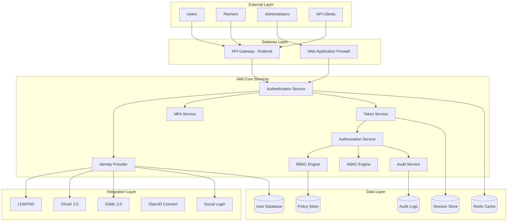

# Arquitetura IAM - INNOVABIZ Identity & Access Management

## 📋 Informações do Documento

- **Autor**: Eduardo Jeremias
- **Data**: 09/01/2025
- **Versão**: 1.0.0
- **Módulo**: IAM Core
- **Classificação**: Crítico
- **Revisão**: Trimestral
- **Audiência**: Arquitetos, Security Team, Desenvolvedores

## 🎯 Visão Geral

O módulo IAM (Identity and Access Management) da plataforma INNOVABIZ fornece serviços centralizados de autenticação, autorização, gestão de identidades e controle de acesso, implementando Zero Trust Architecture e conformidade com GDPR, LGPD, SOX e PCI-DSS.

## 🏗️ Arquitetura do Sistema

### 1. Componentes Principais



## 🔐 Authentication Architecture

### 2. Multi-Factor Authentication (MFA)

```typescript
// mfa.service.ts
import { Injectable } from '@nestjs/common';
import * as speakeasy from 'speakeasy';
import * as QRCode from 'qrcode';
import { SmsService } from './sms.service';
import { EmailService } from './email.service';
import { BiometricService } from './biometric.service';

@Injectable()
export class MFAService {
  private readonly MFA_METHODS = {
    TOTP: 'totp',
    SMS: 'sms',
    EMAIL: 'email',
    BIOMETRIC: 'biometric',
    HARDWARE_TOKEN: 'hardware',
    PUSH: 'push'
  };

  /**
   * Setup MFA for user
   */
  async setupMFA(userId: string, method: string): Promise<MFASetupResponse> {
    switch (method) {
      case this.MFA_METHODS.TOTP:
        return this.setupTOTP(userId);
      
      case this.MFA_METHODS.SMS:
        return this.setupSMS(userId);
      
      case this.MFA_METHODS.EMAIL:
        return this.setupEmail(userId);
      
      case this.MFA_METHODS.BIOMETRIC:
        return this.setupBiometric(userId);
      
      case this.MFA_METHODS.PUSH:
        return this.setupPushNotification(userId);
      
      default:
        throw new Error('Invalid MFA method');
    }
  }

  /**
   * Setup TOTP (Time-based One-Time Password)
   */
  private async setupTOTP(userId: string): Promise<MFASetupResponse> {
    const secret = speakeasy.generateSecret({
      name: `InnovaBiz (${userId})`,
      issuer: 'InnovaBiz IAM',
      length: 32
    });

    const qrCodeUrl = await QRCode.toDataURL(secret.otpauth_url);

    // Store encrypted secret
    await this.storeSecret(userId, secret.base32, 'TOTP');

    return {
      method: 'TOTP',
      qrCode: qrCodeUrl,
      secret: secret.base32,
      backupCodes: await this.generateBackupCodes(userId)
    };
  }

  /**
   * Verify MFA token
   */
  async verifyMFA(
    userId: string,
    token: string,
    method: string
  ): Promise<MFAVerificationResult> {
    const attempts = await this.checkAttempts(userId);
    
    if (attempts >= 5) {
      await this.lockAccount(userId);
      throw new Error('Account locked due to multiple failed attempts');
    }

    let isValid = false;

    switch (method) {
      case this.MFA_METHODS.TOTP:
        isValid = await this.verifyTOTP(userId, token);
        break;
      
      case this.MFA_METHODS.SMS:
      case this.MFA_METHODS.EMAIL:
        isValid = await this.verifyOTP(userId, token);
        break;
      
      case this.MFA_METHODS.BIOMETRIC:
        isValid = await this.verifyBiometric(userId, token);
        break;
      
      case this.MFA_METHODS.PUSH:
        isValid = await this.verifyPushApproval(userId, token);
        break;
    }

    if (!isValid) {
      await this.incrementAttempts(userId);
      throw new Error('Invalid MFA token');
    }

    await this.resetAttempts(userId);
    await this.logMFASuccess(userId, method);

    return {
      verified: true,
      userId,
      method,
      timestamp: new Date()
    };
  }

  /**
   * Adaptive MFA based on risk score
   */
  async adaptiveMFA(context: AuthContext): Promise<string[]> {
    const riskScore = await this.calculateRiskScore(context);
    const requiredMethods: string[] = [];

    if (riskScore < 30) {
      // Low risk - no additional MFA
      return [];
    } else if (riskScore < 60) {
      // Medium risk - one factor
      requiredMethods.push(this.MFA_METHODS.TOTP);
    } else if (riskScore < 80) {
      // High risk - two factors
      requiredMethods.push(this.MFA_METHODS.TOTP);
      requiredMethods.push(this.MFA_METHODS.SMS);
    } else {
      // Very high risk - three factors + admin approval
      requiredMethods.push(this.MFA_METHODS.TOTP);
      requiredMethods.push(this.MFA_METHODS.SMS);
      requiredMethods.push(this.MFA_METHODS.BIOMETRIC);
      await this.requestAdminApproval(context);
    }

    return requiredMethods;
  }

  /**
   * Calculate risk score based on context
   */
  private async calculateRiskScore(context: AuthContext): Promise<number> {
    let score = 0;

    // Location risk
    if (await this.isNewLocation(context.ip, context.userId)) score += 20;
    if (await this.isHighRiskCountry(context.country)) score += 30;
    
    // Device risk
    if (await this.isNewDevice(context.deviceId, context.userId)) score += 15;
    if (context.isRootedDevice) score += 25;
    
    // Behavior risk
    if (await this.isUnusualTime(context.timestamp, context.userId)) score += 10;
    if (await this.hasRecentFailedAttempts(context.userId)) score += 20;
    
    // Transaction risk
    if (context.transactionAmount > 10000) score += 30;
    if (context.isHighValueOperation) score += 25;

    return Math.min(score, 100);
  }
}
```

## 🛡️ Authorization Engine

### 3. RBAC + ABAC Implementation

```typescript
// authorization.service.ts
import { Injectable } from '@nestjs/common';
import { PolicyEngine } from '@ory/keto-client';
import * as OPA from '@open-policy-agent/opa-wasm';

@Injectable()
export class AuthorizationService {
  private policyEngine: PolicyEngine;
  private opaModule: any;

  async onModuleInit() {
    // Initialize OPA with policies
    const policyWasm = await this.loadPolicyWasm();
    this.opaModule = await OPA.loadPolicy(policyWasm);
  }

  /**
   * Check authorization using RBAC + ABAC
   */
  async authorize(
    subject: Subject,
    resource: Resource,
    action: string,
    context: Context
  ): Promise<AuthorizationResult> {
    // 1. Check RBAC permissions
    const rbacResult = await this.checkRBAC(subject, resource, action);
    
    if (!rbacResult.allowed) {
      return {
        allowed: false,
        reason: 'RBAC denied',
        policy: rbacResult.policy
      };
    }

    // 2. Check ABAC policies
    const abacResult = await this.checkABAC(subject, resource, action, context);
    
    if (!abacResult.allowed) {
      return {
        allowed: false,
        reason: 'ABAC denied',
        policy: abacResult.policy
      };
    }

    // 3. Check dynamic policies
    const dynamicResult = await this.checkDynamicPolicies(
      subject,
      resource,
      action,
      context
    );

    if (!dynamicResult.allowed) {
      return {
        allowed: false,
        reason: 'Dynamic policy denied',
        policy: dynamicResult.policy
      };
    }

    // 4. Log successful authorization
    await this.logAuthorization({
      subject,
      resource,
      action,
      context,
      result: 'allowed',
      timestamp: new Date()
    });

    return {
      allowed: true,
      permissions: await this.getEffectivePermissions(subject, resource),
      attributes: await this.getApplicableAttributes(subject, resource, context)
    };
  }

  /**
   * Check RBAC permissions
   */
  private async checkRBAC(
    subject: Subject,
    resource: Resource,
    action: string
  ): Promise<RBACResult> {
    const roles = await this.getUserRoles(subject.id);
    
    for (const role of roles) {
      const permissions = await this.getRolePermissions(role);
      
      if (permissions.includes(`${resource.type}:${action}`)) {
        return {
          allowed: true,
          role,
          permission: `${resource.type}:${action}`
        };
      }
    }

    return { allowed: false };
  }

  /**
   * Check ABAC policies using OPA
   */
  private async checkABAC(
    subject: Subject,
    resource: Resource,
    action: string,
    context: Context
  ): Promise<ABACResult> {
    const input = {
      subject: {
        id: subject.id,
        attributes: subject.attributes,
        roles: subject.roles,
        department: subject.department,
        clearanceLevel: subject.clearanceLevel
      },
      resource: {
        id: resource.id,
        type: resource.type,
        owner: resource.owner,
        sensitivity: resource.sensitivity,
        tags: resource.tags
      },
      action,
      context: {
        time: context.timestamp,
        location: context.location,
        ip: context.ip,
        device: context.device,
        sessionAge: context.sessionAge,
        mfaVerified: context.mfaVerified
      }
    };

    const result = await this.opaModule.evaluate(input);
    
    return {
      allowed: result.allowed,
      policy: result.policy,
      obligations: result.obligations
    };
  }

  /**
   * Define complex ABAC policies
   */
  async definePolicies(): Promise<void> {
    const policies = [
      {
        id: 'sensitive-data-access',
        description: 'Access to sensitive data requires MFA and specific clearance',
        rule: `
          allow if {
            input.resource.sensitivity > 3
            input.context.mfaVerified = true
            input.subject.clearanceLevel >= input.resource.sensitivity
            input.context.location.country in ["BR", "US", "EU"]
          }
        `
      },
      {
        id: 'time-based-access',
        description: 'Certain operations only during business hours',
        rule: `
          allow if {
            input.action in ["delete", "modify_critical"]
            hour(input.context.time) >= 8
            hour(input.context.time) <= 18
            weekday(input.context.time) not in ["Saturday", "Sunday"]
          }
        `
      },
      {
        id: 'delegation-policy',
        description: 'Users can delegate permissions with restrictions',
        rule: `
          allow if {
            input.action = "delegate"
            input.subject.canDelegate = true
            input.resource.delegatable = true
            input.context.delegationExpiry > now()
          }
        `
      }
    ];

    await this.policyEngine.createPolicies(policies);
  }
}
```

## 🔑 Token Management

### 4. JWT & Session Management

```typescript
// token.service.ts
@Injectable()
export class TokenService {
  private readonly jwtConfig = {
    algorithm: 'RS256',
    issuer: 'https://iam.innovabiz.com',
    audience: 'innovabiz-platform',
    accessTokenTTL: 900, // 15 minutes
    refreshTokenTTL: 86400, // 24 hours
    idTokenTTL: 3600 // 1 hour
  };

  /**
   * Generate token set for authenticated user
   */
  async generateTokens(user: User, context: AuthContext): Promise<TokenSet> {
    const tokenId = crypto.randomUUID();
    const sessionId = crypto.randomUUID();

    // Generate Access Token
    const accessToken = await this.generateAccessToken(user, tokenId);
    
    // Generate Refresh Token
    const refreshToken = await this.generateRefreshToken(user, sessionId);
    
    // Generate ID Token
    const idToken = await this.generateIdToken(user);

    // Store session
    await this.storeSession({
      sessionId,
      userId: user.id,
      tokenId,
      createdAt: new Date(),
      expiresAt: new Date(Date.now() + this.jwtConfig.refreshTokenTTL * 1000),
      context
    });

    return {
      accessToken,
      refreshToken,
      idToken,
      tokenType: 'Bearer',
      expiresIn: this.jwtConfig.accessTokenTTL
    };
  }

  /**
   * Generate Access Token with permissions
   */
  private async generateAccessToken(user: User, tokenId: string): Promise<string> {
    const permissions = await this.getUserPermissions(user.id);
    const roles = await this.getUserRoles(user.id);

    const payload = {
      sub: user.id,
      jti: tokenId,
      iat: Math.floor(Date.now() / 1000),
      exp: Math.floor(Date.now() / 1000) + this.jwtConfig.accessTokenTTL,
      iss: this.jwtConfig.issuer,
      aud: this.jwtConfig.audience,
      scope: permissions.join(' '),
      roles: roles,
      typ: 'access'
    };

    return jwt.sign(payload, this.privateKey, {
      algorithm: this.jwtConfig.algorithm
    });
  }

  /**
   * Token validation with introspection
   */
  async validateToken(token: string): Promise<ValidationResult> {
    try {
      // Verify signature
      const decoded = jwt.verify(token, this.publicKey, {
        algorithms: [this.jwtConfig.algorithm],
        issuer: this.jwtConfig.issuer,
        audience: this.jwtConfig.audience
      });

      // Check revocation
      if (await this.isTokenRevoked(decoded.jti)) {
        throw new Error('Token has been revoked');
      }

      // Check session
      const session = await this.getSession(decoded.sub);
      if (!session || session.terminated) {
        throw new Error('Session invalid or terminated');
      }

      // Introspection response
      return {
        active: true,
        scope: decoded.scope,
        sub: decoded.sub,
        aud: decoded.aud,
        iss: decoded.iss,
        exp: decoded.exp,
        iat: decoded.iat,
        jti: decoded.jti,
        token_type: 'Bearer'
      };
    } catch (error) {
      return {
        active: false,
        error: error.message
      };
    }
  }
}
```

## 🚀 Roadmap IAM

### 5. Evolução 2025

#### Q1 2025
- ✅ OAuth 2.0 / OIDC
- ✅ SAML 2.0
- 🔄 Passwordless Auth
- 🔄 WebAuthn/FIDO2

#### Q2 2025
- 📅 Decentralized Identity (DID)
- 📅 Blockchain-based Auth
- 📅 Zero-Knowledge Proofs
- 📅 Biometric Authentication

#### Q3 2025
- 📅 AI-powered Risk Assessment
- 📅 Behavioral Authentication
- 📅 Quantum-safe Cryptography
- 📅 Self-Sovereign Identity

#### Q4 2025
- 📅 Neural Authentication
- 📅 Continuous Authentication
- 📅 Federated IAM
- 📅 Universal Identity Fabric

---

**Mantido por**: Security Team  
**Última Atualização**: 09/01/2025  
**Próxima Revisão**: 09/04/2025  
**Contato**: iam-team@innovabiz.com
