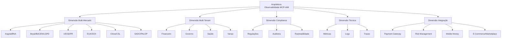
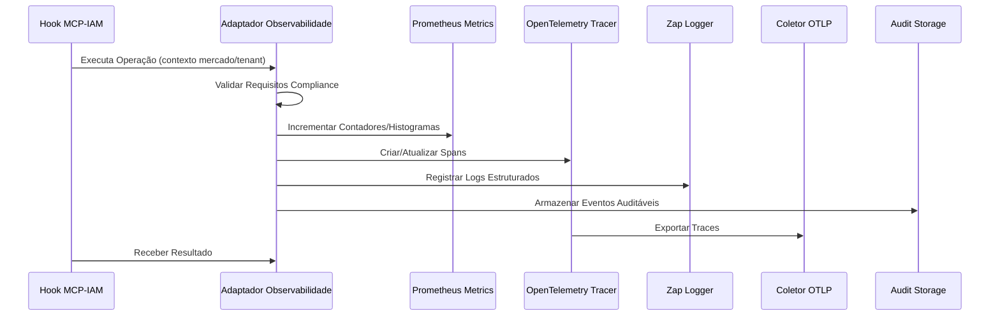

# Arquitetura Técnica: Observabilidade MCP-IAM INNOVABIZ

## 🌐 Visão Geral da Arquitetura

A arquitetura de observabilidade para os hooks MCP-IAM da plataforma INNOVABIZ foi projetada com uma abordagem multi-dimensional que atende a requisitos globais de conformidade regulatória, garantindo adaptação contextual por mercado e segmento de negócio, alinhada com frameworks internacionais como TOGAF 10.0, COBIT 2019 e ISO 27001.

### Dimensões Arquiteturais Principais

## 🔄 Fluxo de Dados e Processamento

A solução implementa uma abordagem de pipeline de observabilidade que captura, processa e expõe dados de telemetria em conformidade com padrões internacionais:

## 🏗️ Componentes Arquiteturais

### 1. Adaptador de Observabilidade Core (`observability/adapter/adapter.go`)

Implementa o padrão de adaptador com uma interface uniforme para todos os hooks MCP-IAM, gerenciando internamente:

- **Métricas Prometheus**: Contadores, gauges e histogramas para operações, erros e performance
- **Tracing OpenTelemetry**: Spans para rastreamento de operações com atributos de mercado e tenant
- **Logging Estruturado**: Registros em formato JSON com metadados de compliance e contexto
- **Auditoria Compliance**: Gravação de eventos auditáveis segmentados por mercado e framework

### 2. CLI de Observabilidade (`cmd/observability-cli/main.go`)

Interface de linha de comando que permite:

- **Configuração**: Validação e ajuste de parâmetros de observabilidade
- **Testes**: Simulação de operações e verificação de exportação de telemetria
- **Monitoramento**: Exposição de métricas Prometheus para integração com sistemas de monitoramento

### 3. Sistema de Contextualização por Mercado

Implementação do padrão Strategy para adaptar comportamentos conforme o contexto:

- **MarketContext**: Encapsula metadados específicos por mercado e tipo de tenant
- **ComplianceMetadata**: Armazena requisitos regulatórios específicos por framework
- **Validação Contextual**: Aplica regras específicas para MFA, aprovação dual e retenção de logs

## 🔐 Modelo de Segurança e Compliance

A arquitetura implementa uma abordagem multi-camada para segurança e compliance:

### Camadas de Proteção

1. **Validação de Entrada**: Verificação rigorosa de parâmetros e configurações
2. **Contextualização Regulatória**: Adaptação automática para requisitos por mercado
3. **Auditoria Multinível**: Registro de eventos segmentado por severidade e categoria
4. **Rastreabilidade Completa**: Spans aninhados para operações complexas
5. **Validação MFA Adaptativa**: Verificação de níveis MFA conforme requisitos regulatórios

### Frameworks de Compliance Suportados

| Mercado | Frameworks | Requisitos Específicos |
|---------|------------|------------------------|
| Angola | BNA | MFA nível alto, aprovação dual, 7 anos de retenção |
| Brasil | LGPD, BACEN | MFA nível alto, aprovação dual, 5-10 anos de retenção |
| UE | GDPR | MFA nível alto, aprovação dual, 7 anos de retenção |
| EUA | SOX | MFA nível médio, aprovação dual, 7 anos de retenção |
| China | CSL | MFA nível alto, aprovação dual, 5 anos de retenção |
| Global | ISO27001 | MFA nível médio, 3 anos de retenção |

## 🔌 Integrações Corporativas

A arquitetura foi projetada para integração nativa com:

### Sistemas de Observabilidade

- **Prometheus/Grafana**: Métricas e dashboards
- **Jaeger/Zipkin**: Visualização de traces distribuídos
- **Elasticsearch/Kibana**: Agregação e visualização de logs
- **OpenTelemetry Collector**: Coleta e exportação de telemetria

### Módulos Core INNOVABIZ

- **Payment Gateway**: Rastreamento de transações financeiras e compliance
- **Risk Management**: Correlação de eventos de segurança e avaliação de risco
- **Mobile Money**: Observabilidade em canais móveis e detecção de fraude
- **E-Commerce/Marketplace**: Monitoramento de atividades de comércio eletrônico
- **CRM**: Visibilidade de interações com clientes e consentimento de dados

## 🔄 Modelo de Escalabilidade

A solução implementa estratégias para garantir escalabilidade horizontal e vertical:

1. **Concorrência Segura**: Utilização de mutex para acesso a recursos compartilhados
2. **Amostragem Configurável**: Taxa de amostragem de traces ajustável por ambiente
3. **Externalização de Estado**: Armazenamento externo para logs de auditoria e compliance
4. **Exportação Assíncrona**: Processamento não-bloqueante de telemetria
5. **Configuração Adaptativa**: Ajustes de configuração por ambiente

## 🔬 Monitoramento e Observabilidade

### Métricas Chave Expostas

- **Hook Call Rate**: Taxa de chamadas de hook por mercado/tenant/tipo
- **Error Rate**: Taxa de erros por mercado/tenant/tipo
- **Latency Distribution**: Distribuição de latência de operações
- **MFA Validation Success Rate**: Taxa de sucesso de validações MFA
- **Scope Validation Success Rate**: Taxa de sucesso de validações de escopo
- **Active Privilege Elevations**: Elevações de privilégio ativas por mercado
- **Compliance Event Rate**: Taxa de eventos de compliance por framework
- **Security Event Rate**: Taxa de eventos de segurança por severidade

## 🏭 Ambientes Suportados

A arquitetura suporta implantação em múltiplos ambientes, com configurações específicas:

- **Desenvolvimento**: Logging detalhado, amostragem total, métricas detalhadas
- **Homologação**: Logging estruturado, alta amostragem, validação de compliance
- **Produção**: Logging otimizado, amostragem parcial, telemetria completa
- **Sandbox**: Ambiente isolado para testes de integração e simulações

## 📊 Dashboards Recomendados

1. **Visão Operacional**: Taxas de chamada, latência e erros por hook
2. **Visão de Segurança**: Eventos de segurança, validações MFA e elevações de privilégio
3. **Visão de Compliance**: Cobertura por framework, eventos de auditoria e violações
4. **Visão por Mercado**: Métricas segmentadas por mercado e requisitos regulatórios específicos

## 🔍 ADR: Decisões Arquiteturais

### ADR-001: Uso de OpenTelemetry para Tracing Distribuído

**Contexto**: Necessidade de rastreabilidade de operações em ambiente distribuído.

**Decisão**: Adotar OpenTelemetry como framework de instrumentação para traces.

**Justificativa**: 
- Padrão aberto com suporte da CNCF
- Compatibilidade com múltiplos backends (Jaeger, Zipkin, etc.)
- Instrumentação unificada para métricas, logs e traces
- Suporte a contexto cross-process para operações distribuídas

### ADR-002: Logs Estruturados via Zap

**Contexto**: Necessidade de logs consistentes, performáticos e processáveis.

**Decisão**: Utilizar Zap para logging estruturado em formato JSON.

**Justificativa**:
- Alta performance (ordem de magnitude mais rápido que alternativas)
- Suporte a logs estruturados em JSON
- Níveis configuráveis e amostragem
- Campos de contexto para correlação com traces

### ADR-003: Prometheus para Métricas

**Contexto**: Necessidade de coletar e expor métricas de operação e negócio.

**Decisão**: Adotar Prometheus para instrumentação de métricas.

**Justificativa**:
- Modelo pull escalável
- Linguagem de consulta poderosa (PromQL)
- Integração nativa com Grafana
- Suporte a múltiplos tipos de métricas (counter, gauge, histogram)
- Padrão de facto para monitoramento em ambientes cloud-native

### ADR-004: Contextualização Multi-Mercado

**Contexto**: Necessidade de adaptar comportamento para diferentes mercados e regulações.

**Decisão**: Implementar modelo de contextualização com metadados por mercado.

**Justificativa**:
- Flexibilidade para atender requisitos regulatórios específicos
- Menor acoplamento entre lógica de negócio e regras de compliance
- Facilidade de extensão para novos mercados
- Capacidade de reutilização de código com comportamentos adaptáveis