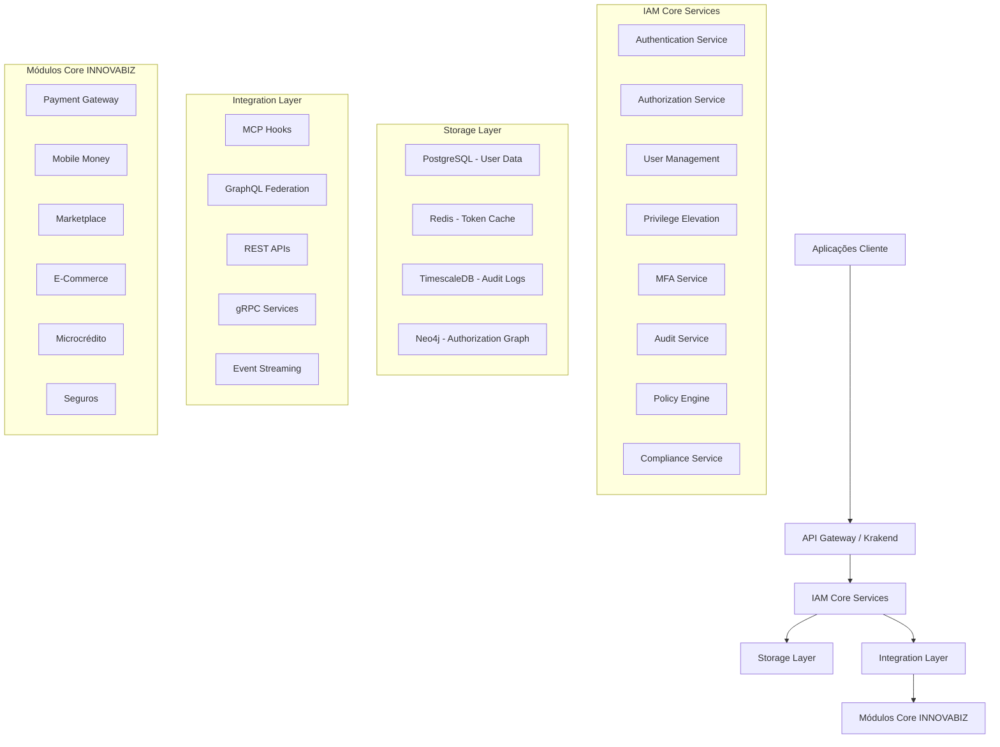
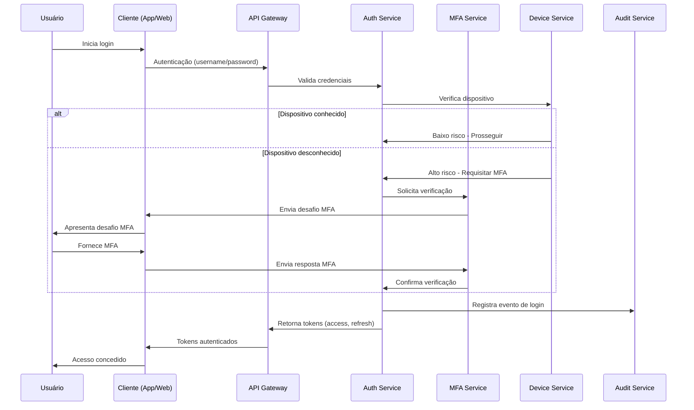
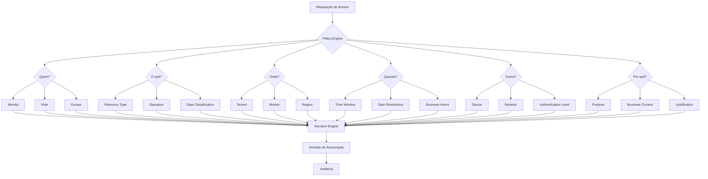

# Arquitetura Técnica do MCP-IAM INNOVABIZ

## 1. Visão Geral da Arquitetura

O MCP-IAM (Model Context Protocol - Identity and Access Management) representa o núcleo de segurança da plataforma INNOVABIZ, implementando uma arquitetura de identidade e acesso multi-dimensional que se adapta dinamicamente aos contextos regulatórios, operacionais e de negócio em múltiplos mercados e clientes.

### 1.1. Princípios Arquiteturais

1. **Segurança por Design**: Segurança implementada em todas as camadas e componentes
2. **Multi-Dimensionalidade**: Adaptação a múltiplos contextos, tenants e mercados
3. **Zero-Trust**: Verificação contínua de identidade e autorizações
4. **Privacy by Default**: Proteção de dados incorporada na arquitetura
5. **Resiliência**: Alta disponibilidade e tolerância a falhas
6. **Observabilidade Total**: Visibilidade completa de todas operações de segurança
7. **Extensibilidade**: Arquitetura modular e baseada em hooks
8. **Compliance Automatizada**: Adaptação dinâmica a requisitos regulatórios

### 1.2. Visão de Alto Nível



## 2. Componentes da Arquitetura

### 2.1. Autenticação

#### 2.1.1. Serviços de Autenticação

| Serviço | Responsabilidade | Tecnologia |
|---------|------------------|------------|
| **Token Service** | Geração, validação e revogação de tokens JWT | Go + PASETO |
| **Credential Manager** | Validação de credenciais e senhas | Argon2id + Go |
| **Federation Service** | Integração com IdPs externos (OIDC, SAML) | Go + node-oidc-provider |
| **Session Manager** | Gestão de sessões e dispositivos confiáveis | Redis + PostgreSQL |
| **Biometric Auth** | Autenticação biométrica (facial, impressão digital) | Go + AWS Rekognition |

#### 2.1.2. Fluxos de Autenticação



#### 2.1.3. Estrutura de Token JWT

```json
{
  "header": {
    "alg": "ES384",
    "typ": "JWT",
    "kid": "key-id-1"
  },
  "payload": {
    "iss": "https://iam.innovabiz.com",
    "sub": "user123",
    "aud": ["payment-gateway", "mobile-money"],
    "exp": 1627968000,
    "iat": 1627964400,
    "jti": "random-unique-id",
    "tenant_id": "tenant-abc",
    "market": "angola",
    "roles": ["payment_agent", "support_l1"],
    "scopes": ["payment:read", "transaction:list"],
    "context": {
      "device_id": "dev-xyz",
      "ip_address": "192.168.1.1",
      "user_agent": "Mozilla/5.0...",
      "mfa_verified": true,
      "risk_score": 15,
      "elevation_id": null
    }
  }
}
```

### 2.2. Autorização

#### 2.2.1. Serviços de Autorização

| Serviço | Responsabilidade | Tecnologia |
|---------|------------------|------------|
| **Policy Engine** | Avaliação de políticas de autorização | OPA (Rego) |
| **Authorization Graph** | Gerenciamento do grafo de autorização | Neo4j |
| **Permission Service** | Gerenciamento de permissões e papéis | PostgreSQL + Go |
| **Context Provider** | Enriquecimento de contexto para decisões | Go |
| **Role Manager** | Gerenciamento de RBAC e ABAC | PostgreSQL + Redis |

#### 2.2.2. Modelo de Autorização Multi-Dimensional



#### 2.2.3. Exemplo de Política OPA (Rego)

```rego
# Política para acesso a transações de pagamento
package payment

import data.roles
import data.tenants
import data.markets.regulations

# Regra default - negar acesso
default allow = false

# Permitir acesso a transações
allow {
    # Verificar tipo de operação
    input.action == "read"
    input.resource_type == "transaction"
    
    # Verificar role do usuário
    user_has_role("payment_agent")
    
    # Verificar tenant
    same_tenant
    
    # Verificar compliance com regulações do mercado
    compliant_with_market_regulations
}

# Permitir acesso completo a transações para suporte avançado
allow {
    # Verificar tipo de operação
    input.action == "read"
    input.resource_type == "transaction"
    
    # Verificar role do usuário e elevação de privilégios
    user_has_role("support_l2")
    has_active_elevation
    
    # Verificar tenant
    same_tenant
    
    # Verificar compliance com regulações do mercado
    compliant_with_market_regulations
    
    # Registrar acesso como sensível para auditoria
    audit_sensitive_access
}

# Funções auxiliares
user_has_role(role) {
    input.user.roles[_] == role
}

same_tenant {
    input.user.tenant_id == input.resource.tenant_id
}

has_active_elevation {
    input.user.context.elevation_id != null
    elevation := data.elevations[input.user.context.elevation_id]
    elevation.status == "active"
    elevation.expiration > current_time_ms
}

compliant_with_market_regulations {
    market := input.user.market
    regulation_checks := regulations[market].transaction_access
    
    # Executar todas verificações específicas do mercado
    regulation_checks.min_auth_level <= input.user.auth_level
    
    # Condições específicas para mercados que exigem verificações adicionais
    not requires_special_checks[market] or special_check_passed[market]
}

audit_sensitive_access {
    # Esta função tem efeito colateral via API para registrar acesso sensível
    http.send({
        "method": "POST",
        "url": "http://audit-service/log",
        "body": {
            "user_id": input.user.id,
            "action": input.action,
            "resource": input.resource,
            "sensitivity": "high",
            "elevation_id": input.user.context.elevation_id
        }
    })
}

# Verificações específicas por mercado
requires_special_checks = {
    "angola": true,
    "brazil": true
}

special_check_passed = {
    "angola": input.user.kyc_level == "full",
    "brazil": input.user.context.purpose_validated == true
}
```