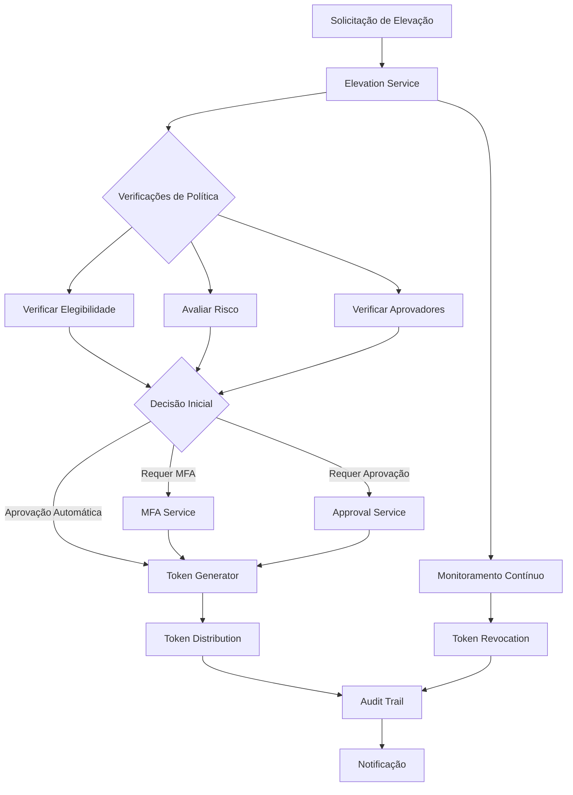
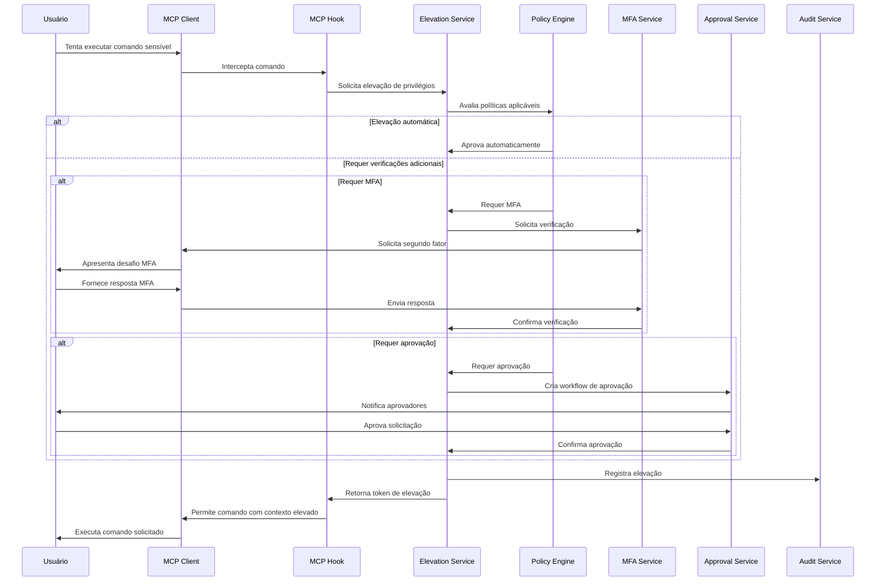
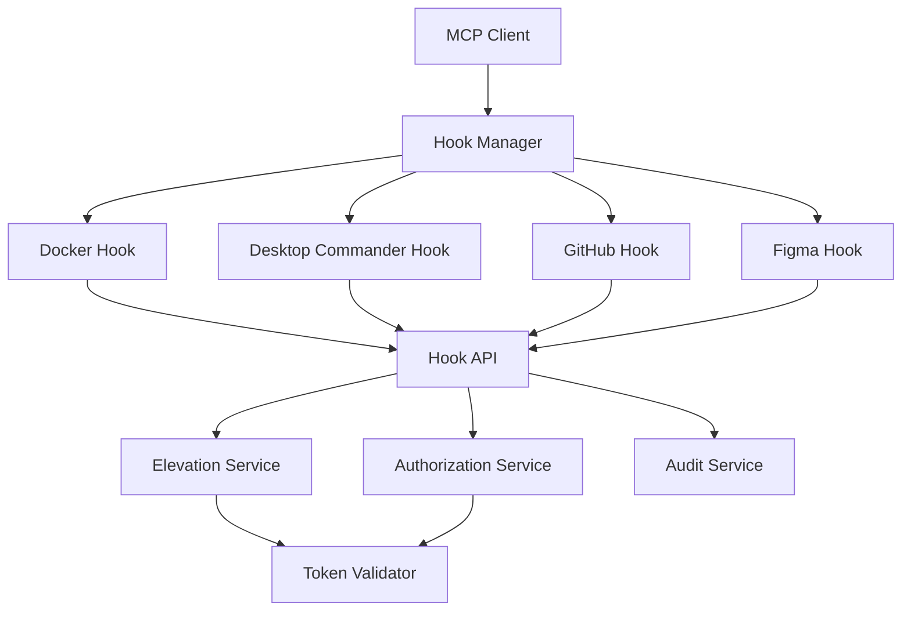

# Arquitetura Técnica do MCP-IAM INNOVABIZ - Parte 2

## 3. Elevação de Privilégios e MCP Hooks

### 3.1. Arquitetura do Sistema de Elevação de Privilégios



### 3.2. Componentes do Sistema de Elevação

#### 3.2.1. Serviços de Elevação

| Serviço | Responsabilidade | Tecnologia |
|---------|------------------|------------|
| **Elevation Service** | Gerenciamento do ciclo de vida de elevações | Go |
| **Approval Service** | Workflow de aprovações | Temporal |
| **Token Generator** | Geração de tokens de elevação | Go + HSM |
| **Policy Evaluator** | Avaliação de políticas de elevação | OPA (Rego) |
| **Risk Assessor** | Avaliação de risco da operação | Go + ML models |
| **Revocation Service** | Revogação de privilégios elevados | Go + Redis |

#### 3.2.2. Fluxo de Elevação de Privilégios



#### 3.2.3. Estrutura do Token de Elevação

```json
{
  "elevation_id": "elev-123456789",
  "user_id": "user123",
  "tenant_id": "tenant-abc",
  "elevated_scopes": [
    "docker:container:exec",
    "docker:volume:mount"
  ],
  "justification": "Manutenção emergencial de container de produção",
  "elevated_at": "2025-08-06T15:30:00Z",
  "expires_at": "2025-08-06T16:30:00Z",
  "approval_chain": [
    {
      "approver_id": "manager456",
      "approved_at": "2025-08-06T15:25:00Z",
      "approval_context": {
        "method": "slack",
        "ip_address": "10.0.1.23"
      }
    }
  ],
  "mfa_verified": {
    "method": "totp",
    "verified_at": "2025-08-06T15:29:30Z"
  },
  "emergency_access": false,
  "context": {
    "risk_score": 35,
    "source_ip": "192.168.1.5",
    "device_id": "dev-xyz",
    "market": "angola",
    "client_app": "desktop-commander"
  },
  "signature": "base64-encoded-signature"
}
```

### 3.3. Integração com MCP Hooks

#### 3.3.1. Arquitetura dos MCP Hooks



#### 3.3.2. Componentes dos MCP Hooks

| Hook | Comandos Protegidos | Escopos | Mercados Suportados |
|------|---------------------|---------|---------------------|
| **Docker** | container exec, privileged run, volume mount | docker:container:exec, docker:container:run:privileged, docker:volume:mount | Todos |
| **Desktop Commander** | write_file em caminhos sensíveis, execute_command com sudo | desktop:file:write:sensitive, desktop:command:execute:privileged | Todos |
| **GitHub** | push para branches protegidos, merge em main | github:branch:push:protected, github:pr:merge:main | Todos |
| **Figma** | modificação de arquivos protegidos, exportação | figma:file:modify:protected, figma:file:export | Todos |

#### 3.3.3. Processo de Interceptação e Autorização

Para cada hook MCP, o processo de interceptação e autorização segue um fluxo similar:

1. **Interceptação de Comando**:
   ```go
   // Exemplo de interceptação de comando Docker
   func (h *DockerHook) InterceptCommand(ctx context.Context, cmd string, args []string) (bool, error) {
       // Verificar se o comando requer elevação
       if h.requiresElevation(cmd, args) {
           // Extrair tenant do contexto
           tenantID, err := h.extractTenantFromContext(ctx)
           if err != nil {
               return false, fmt.Errorf("falha ao extrair tenant: %w", err)
           }
           
           // Verificar token de elevação
           elevationToken := h.extractElevationToken(ctx)
           if elevationToken == "" {
               // Solicitar elevação se não houver token
               return false, &ElevationRequiredError{
                   Command: cmd,
                   Args:    args,
                   Scopes:  h.getScopesForCommand(cmd, args),
               }
           }
           
           // Validar token de elevação
           valid, err := h.validateElevationToken(ctx, elevationToken, cmd, args)
           if err != nil || !valid {
               return false, &UnauthorizedError{
                   Command: cmd,
                   Reason:  "token de elevação inválido ou expirado",
               }
           }
           
           // Registrar uso do comando com elevação
           h.auditElevatedCommand(ctx, cmd, args, elevationToken)
       }
       
       // Permitir execução
       return true, nil
   }
   ```

2. **Mapeamento de Comando para Escopos**:
   ```go
   // Mapeamento de comandos Docker para escopos
   var dockerCommandScopes = map[string][]string{
       "exec":    {"docker:container:exec"},
       "run":     {"docker:container:run"},
       "volume":  {"docker:volume:mount", "docker:volume:create"},
       "system":  {"docker:system:admin"},
       "network": {"docker:network:admin"},
   }

   // Função para determinar escopos necessários
   func (h *DockerHook) getScopesForCommand(cmd string, args []string) []string {
       baseScopes, exists := dockerCommandScopes[cmd]
       if !exists {
           return []string{"docker:default"}
       }
       
       // Adicionar escopos especiais para comandos com flags específicas
       var requiredScopes []string
       requiredScopes = append(requiredScopes, baseScopes...)
       
       // Verificar flags especiais
       for _, arg := range args {
           if arg == "--privileged" && cmd == "run" {
               requiredScopes = append(requiredScopes, "docker:container:run:privileged")
           }
       }
       
       return requiredScopes
   }
   ```

3. **Validação de Token de Elevação**:
   ```go
   // Validação de token de elevação
   func (h *DockerHook) validateElevationToken(ctx context.Context, token string, cmd string, args []string) (bool, error) {
       // Requisitar validação do serviço de elevação
       req := &pb.ValidateElevationRequest{
           Token:        token,
           RequiredScopes: h.getScopesForCommand(cmd, args),
           Context: &pb.RequestContext{
               Command:     cmd,
               CommandArgs: strings.Join(args, " "),
               Timestamp:   time.Now().Unix(),
           },
       }
       
       resp, err := h.elevationClient.ValidateElevation(ctx, req)
       if err != nil {
           return false, fmt.Errorf("falha na validação de elevação: %w", err)
       }
       
       return resp.Valid, nil
   }
   ```

4. **Auditoria de Comandos Elevados**:
   ```go
   // Registro de auditoria para comandos elevados
   func (h *DockerHook) auditElevatedCommand(ctx context.Context, cmd string, args []string, elevationToken string) {
       // Extrair informações do token
       tokenInfo, err := h.elevationClient.GetElevationInfo(ctx, &pb.GetElevationInfoRequest{
           Token: elevationToken,
       })
       if err != nil {
           h.logger.Error("Falha ao obter informações de elevação", "error", err)
           return
       }
       
       // Registrar evento de auditoria
       event := &pb.AuditEvent{
           EventType:   "elevated_command_execution",
           UserId:      tokenInfo.UserId,
           TenantId:    tokenInfo.TenantId,
           ElevationId: tokenInfo.ElevationId,
           Resource:    fmt.Sprintf("docker:%s", cmd),
           Action:      strings.Join(append([]string{cmd}, args...), " "),
           Timestamp:   time.Now().Unix(),
           Success:     true,
           Metadata: map[string]string{
               "scopes_used":       strings.Join(h.getScopesForCommand(cmd, args), ","),
               "command_category":  h.getCommandCategory(cmd),
               "sensitivity_level": h.getSensitivityLevel(cmd, args),
           },
       }
       
       _, err = h.auditClient.RecordEvent(ctx, event)
       if err != nil {
           h.logger.Error("Falha ao registrar evento de auditoria", "error", err)
       }
   }
   ```

### 3.4. Configuração de Proteções Específicas por Mercado

```yaml
# Exemplo de configuração YAML para proteções específicas por mercado
markets:
  angola:
    name: "Angola"
    code: "AO"
    default_mfa_policy:
      require_mfa: true
      allowed_methods: ["totp", "sms", "email"]
      require_mfa_for_emergency: true
      mfa_cooldown_minutes: 30
    elevations:
      max_duration_minutes: 60
      max_emergency_duration_minutes: 120
      default_duration_minutes: 30
      require_approval_threshold: "medium"
    hooks:
      docker:
        protected_commands:
          - "exec"
          - "run --privileged"
          - "system prune -a"
        regulatory_requirements:
          - "Todas operações privilegiadas devem ser aprovadas por supervisor"
          - "Acesso a containers de produção requer justificativa documentada"
      desktop_commander:
        protected_areas:
          - "/etc"
          - "/var/lib/postgresql"
          - "C:\\Windows\\System32"
        regulatory_requirements:
          - "Modificação de arquivos de sistema requer documentação de mudança"
      github:
        protected_branches:
          - "main"
          - "release/*"
        mfa_required: true
        regulatory_requirements:
          - "Mudanças em código de produção requerem revisor certificado"
      figma:
        protected_files:
          - "Design System Master"
          - "Corporate Brand Guidelines"
        regulatory_requirements:
          - "Alterações de marca corporativa requerem aprovação do departamento de marketing"
    
  brazil:
    name: "Brasil"
    code: "BR"
    default_mfa_policy:
      require_mfa: true
      allowed_methods: ["totp", "push", "biometrics"]
      require_mfa_for_emergency: true
      mfa_cooldown_minutes: 15
    elevations:
      max_duration_minutes: 45
      max_emergency_duration_minutes: 90
      default_duration_minutes: 20
      require_approval_threshold: "high"
    hooks:
      docker:
        protected_commands:
          - "exec"
          - "run --privileged"
          - "system prune -a"
          - "network"
        regulatory_requirements:
          - "Acesso a ambientes com dados pessoais exige registro LGPD"
          - "Operações com potencial impacto em serviços financeiros exigem janela de mudança"
      desktop_commander:
        protected_areas:
          - "/etc"
          - "/var/lib/postgresql"
          - "C:\\Windows\\System32"
          - "/usr/local/financial-data"
        regulatory_requirements:
          - "Acesso a dados pessoais requer registro de finalidade e base legal"
      github:
        protected_branches:
          - "main"
          - "release/*"
          - "compliance/*"
        mfa_required: true
        regulatory_requirements:
          - "Alterações em código de compliance exigem revisão documentada"
          - "Proteção adicional para código que processa dados financeiros"
      figma:
        protected_files:
          - "Design System Master"
          - "Corporate Brand Guidelines"
          - "Interfaces de Dados Sensíveis"
        regulatory_requirements:
          - "Interfaces de coleta de dados pessoais exigem revisão de DPO"

  mozambique:
    name: "Moçambique"
    code: "MZ"
    default_mfa_policy:
      require_mfa: true
      allowed_methods: ["totp", "sms", "voice"]
      require_mfa_for_emergency: true
      mfa_cooldown_minutes: 30
    elevations:
      max_duration_minutes: 60
      max_emergency_duration_minutes: 120
      default_duration_minutes: 30
      require_approval_threshold: "medium"
    hooks:
      docker:
        protected_commands:
          - "exec"
          - "run --privileged"
          - "system prune"
        regulatory_requirements:
          - "Operações em sistemas financeiros requerem notificação ao Banco de Moçambique"
          - "Acesso a dados de clientes exige registro detalhado"
      desktop_commander:
        protected_areas:
          - "/etc"
          - "/var/lib/postgresql"
          - "C:\\Windows\\System32"
          - "/usr/local/mz-payments"
        regulatory_requirements:
          - "Modificação de parâmetros de pagamento exige documentação específica"
      github:
        protected_branches:
          - "main"
          - "release/*"
          - "banking-modules/*"
        mfa_required: true
        regulatory_requirements:
          - "Alterações em módulos bancários exigem aprovação documentada"
          - "Revisão de código por desenvolvedor certificado em segurança"
      figma:
        protected_files:
          - "Design System Master"
          - "Corporate Brand Guidelines"
          - "Banking Interfaces"
        regulatory_requirements:
          - "Interfaces bancárias exigem conformidade com acessibilidade e segurança"
```