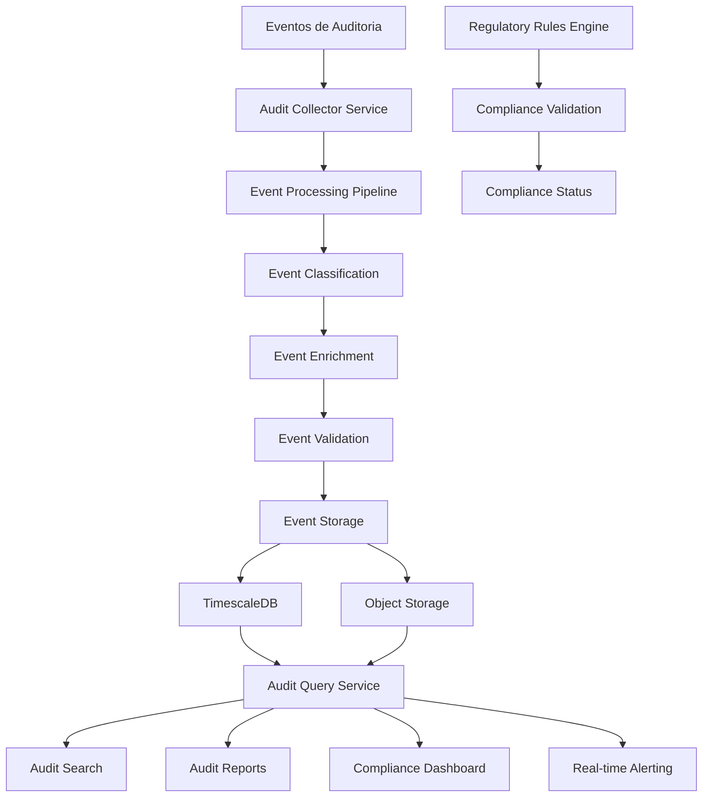
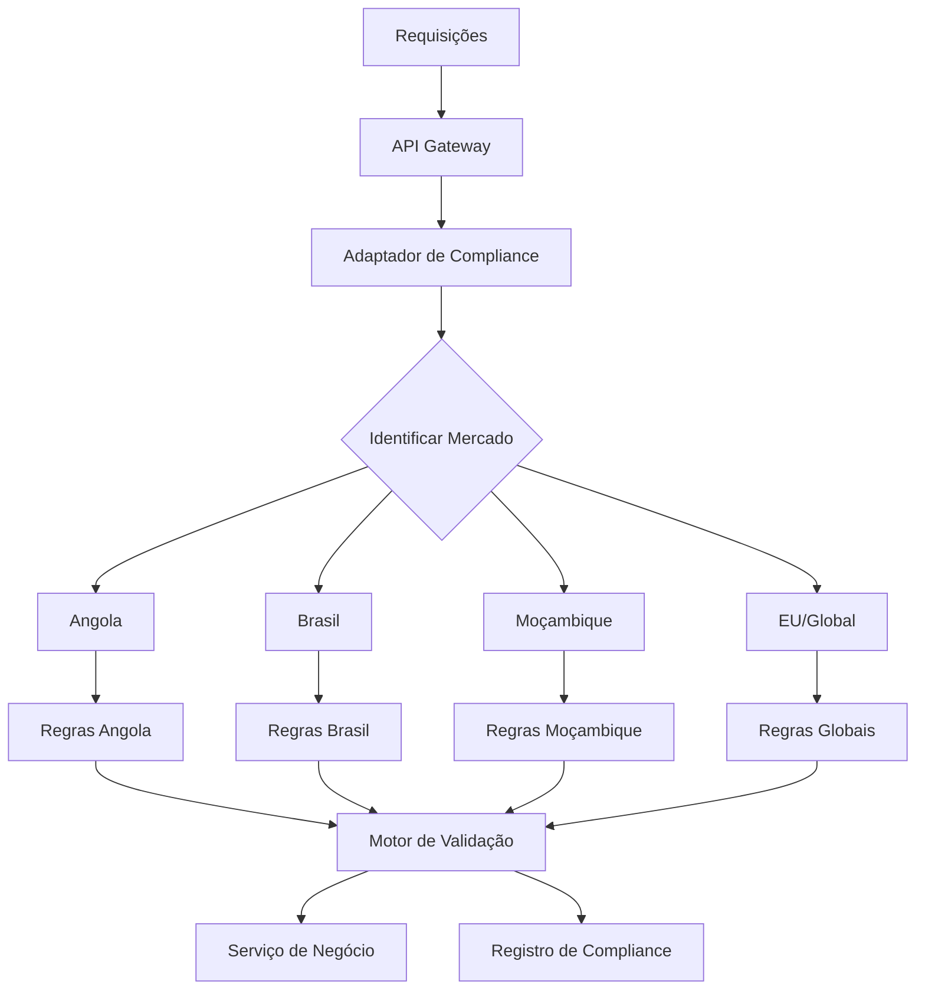
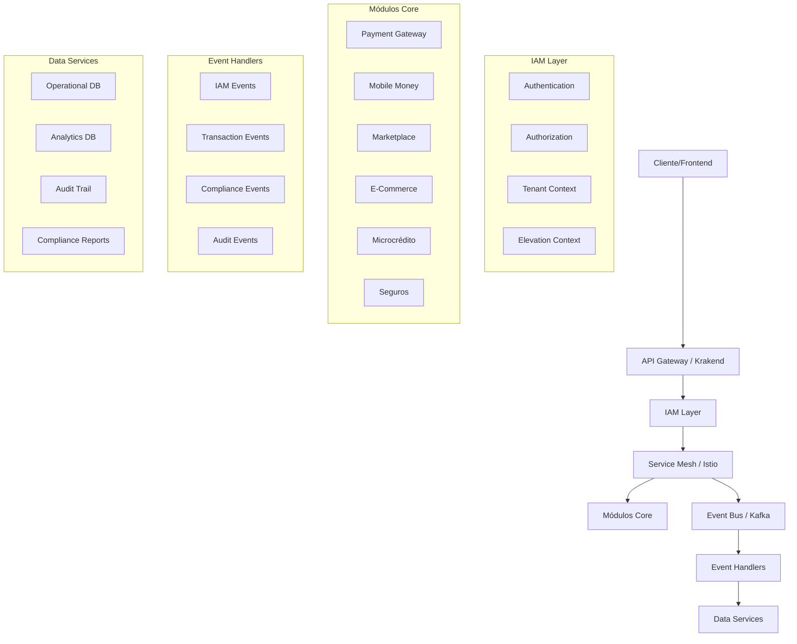
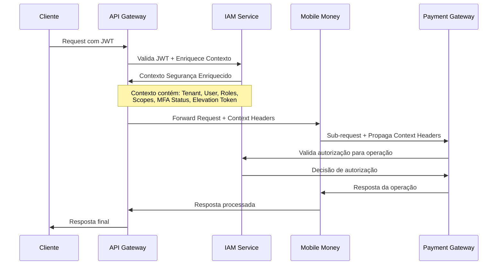
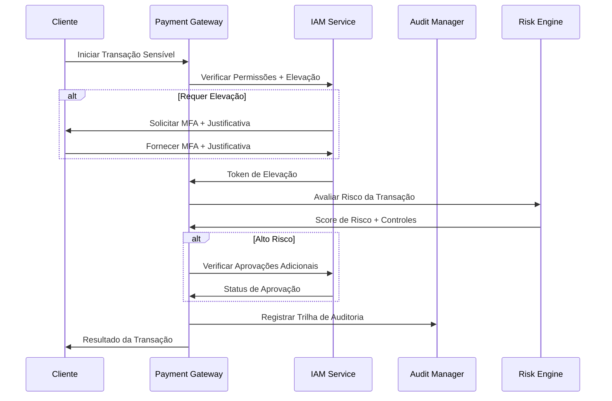
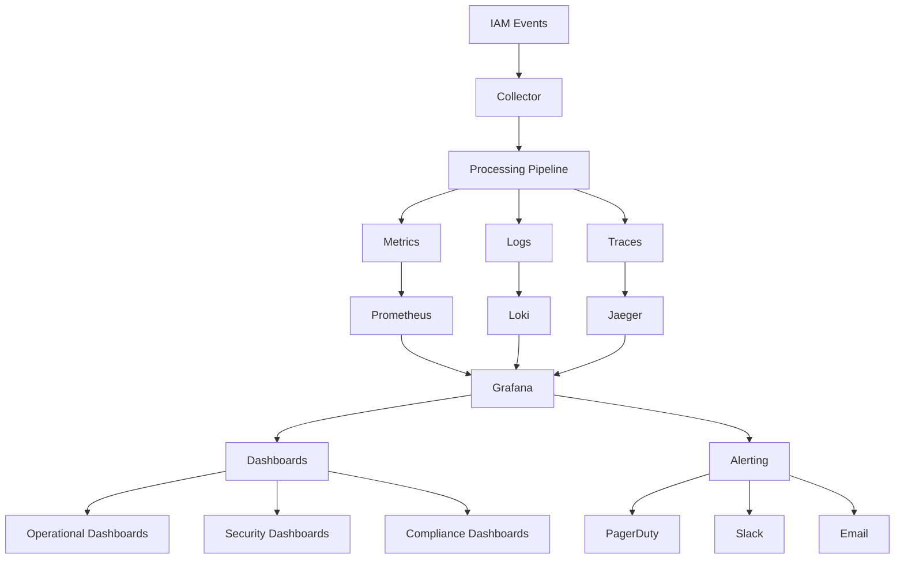
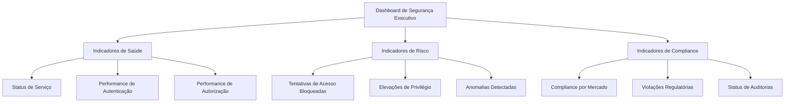

# Arquitetura Técnica do MCP-IAM INNOVABIZ - Parte 3

## 4. Auditoria e Compliance

### 4.1. Arquitetura do Sistema de Auditoria



### 4.2. Componentes do Sistema de Auditoria

#### 4.2.1. Serviços de Auditoria

| Serviço | Responsabilidade | Tecnologia |
|---------|------------------|------------|
| **Audit Collector** | Coleta e validação inicial de eventos | Go + Kafka |
| **Event Processing Pipeline** | Processamento e enriquecimento | Go + Kafka Streams |
| **Event Storage** | Armazenamento otimizado para consulta | TimescaleDB + S3 |
| **Audit Query Service** | API para busca e relatórios | GraphQL + Go |
| **Compliance Engine** | Validação de compliance com regulações | Go + Rules Engine |
| **Alert Manager** | Detecção e alerta de anomalias | Go + Prometheus |

#### 4.2.2. Categorias de Eventos de Auditoria

| Categoria | Descrição | Nível de Retenção |
|-----------|-----------|-------------------|
| **Authentication** | Eventos de autenticação (login, logout, MFA) | 2 anos |
| **Authorization** | Decisões de autorização (permitido/negado) | 2 anos |
| **Identity Management** | Mudanças em usuários, grupos, roles | 5 anos |
| **Privilege Elevation** | Solicitações, aprovações e uso de elevações | 5 anos |
| **Resource Access** | Acesso a recursos protegidos | 1-5 anos (por tipo) |
| **Configuration** | Mudanças em configurações do sistema | 5 anos |
| **Security** | Eventos de segurança (ameaças, violações) | 7 anos |

#### 4.2.3. Formato de Eventos de Auditoria

```json
{
  "event_id": "evt-abcdef123456",
  "correlation_id": "corr-xyz789",
  "event_type": "privilege_elevation.approved",
  "event_category": "privilege_elevation",
  "tenant_id": "tenant-abc",
  "user_id": "user123",
  "actor": {
    "id": "approver456",
    "type": "user",
    "roles": ["security_admin"],
    "tenant_id": "tenant-abc"
  },
  "resource": {
    "type": "elevation_request",
    "id": "elev-123456789",
    "owner_id": "user123"
  },
  "action": "approve",
  "timestamp": "2025-08-06T16:42:15.342Z",
  "status": "success",
  "market": "angola",
  "client_info": {
    "ip_address": "192.168.1.5",
    "user_agent": "MCP Desktop Commander/1.0",
    "device_id": "dev-xyz",
    "location": {
      "country": "AO",
      "region": "Luanda"
    }
  },
  "context": {
    "request_id": "req-12345",
    "session_id": "sess-67890",
    "elevation_id": "elev-123456789",
    "business_justification": "Manutenção emergencial em container de produção",
    "scopes": ["docker:container:exec", "docker:volume:mount"],
    "risk_score": 35
  },
  "regulatory_context": {
    "regulations": ["SADC_Finance", "Angola_Banking_Law", "PCI_DSS"],
    "compliance_checks": [
      {
        "rule_id": "AO-BANKING-002",
        "description": "Aprovação por supervisor para operação sensível",
        "status": "passed"
      },
      {
        "rule_id": "PCI-10.2.2",
        "description": "Logging de acesso a componentes de sistema",
        "status": "passed"
      }
    ]
  },
  "metadata": {
    "elevation_duration_minutes": 60,
    "emergency_access": false,
    "previous_violations": 0,
    "approval_path": "manager_approval"
  }
}
```

### 4.3. Compliance e Adaptação Regulatória

#### 4.3.1. Framework de Compliance Multi-Regulação



#### 4.3.2. Mapeamento de Regulações por Mercado

| Mercado | Regulações Primárias | Requisitos Específicos de IAM |
|---------|----------------------|-------------------------------|
| **Angola** | BNA Banking Security, Lei de Proteção de Dados, SADC Financial Regs | MFA para operações > 250.000 Kz, KYC digital com biometria, validação de ID com registro civil |
| **Brasil** | LGPD, Resoluções BACEN, Open Finance, CVM | Consentimento explícito para dados pessoais, certificados ICP-Brasil, gravação de sessões para ops financeiras |
| **Moçambique** | Banco Moçambique, Lei Transações Eletrônicas, SADC | MFA adaptado para baixa conectividade, escalabilidade de autenticação off-line, validação de documentos locais |
| **SADC/CPLP** | Regulações regionais específicas, acordos multi-laterais | Identidade federada entre países, adaptação a documentos transfronteiriços |
| **Global/EU** | GDPR, PCI-DSS, ISO 27001, SOC2 | Privacy by design, direito ao esquecimento, portabilidade de dados, minimização de dados |

#### 4.3.3. Implementação do Adaptador de Compliance

```go
// Adaptador de Compliance para contexto multi-regulatório
type ComplianceAdapter struct {
    tenantRegistry   *TenantRegistry
    ruleEngine       *RuleEngine
    complianceLogger *ComplianceLogger
    marketRules      map[string]*RegulationSet
}

// Interceptor de compliance para requisições
func (ca *ComplianceAdapter) InterceptRequest(ctx context.Context, req interface{}) (context.Context, error) {
    // Extrair tenant e mercado do contexto
    tenantID, err := extractTenantID(ctx)
    if err != nil {
        return ctx, fmt.Errorf("falha ao extrair tenant: %w", err)
    }
    
    // Obter informações de tenant
    tenant, err := ca.tenantRegistry.GetTenant(ctx, tenantID)
    if err != nil {
        return ctx, fmt.Errorf("falha ao obter informações do tenant: %w", err)
    }
    
    // Determinar mercado principal e regulações aplicáveis
    market := tenant.PrimaryMarket
    applicableRegulations := ca.determineApplicableRegulations(market, tenant.SecondaryMarkets)
    
    // Criar contexto de compliance
    complianceCtx := compliance.NewContext(
        compliance.WithMarket(market),
        compliance.WithRegulations(applicableRegulations),
        compliance.WithTenant(tenantID),
    )
    
    // Adicionar contexto de compliance à requisição
    ctx = compliance.ContextWithCompliance(ctx, complianceCtx)
    
    return ctx, nil
}

// Validação de compliance pós-processamento
func (ca *ComplianceAdapter) ValidateCompliance(ctx context.Context, req interface{}, resp interface{}) error {
    // Obter contexto de compliance
    compCtx, err := compliance.ComplianceFromContext(ctx)
    if err != nil {
        return fmt.Errorf("contexto de compliance não encontrado: %w", err)
    }
    
    // Validar compliance com base nas regulações aplicáveis
    validationReq := &validation.Request{
        Market:           compCtx.Market(),
        Regulations:      compCtx.Regulations(),
        RequestContext:   ctx,
        RequestPayload:   req,
        ResponsePayload:  resp,
        OperationType:    determineOperationType(req),
        DataClassification: determineDataClassification(req, resp),
    }
    
    result, err := ca.ruleEngine.Validate(ctx, validationReq)
    if err != nil {
        return fmt.Errorf("falha na validação de compliance: %w", err)
    }
    
    // Verificar resultado da validação
    if !result.Compliant {
        // Registrar falhas de compliance
        ca.complianceLogger.LogComplianceFailure(ctx, validationReq, result.Violations)
        return &ComplianceViolationError{
            Violations: result.Violations,
            Market:     compCtx.Market(),
        }
    }
    
    // Registrar sucesso de compliance para auditoria
    ca.complianceLogger.LogComplianceSuccess(ctx, validationReq)
    
    return nil
}

// Determinar regulações aplicáveis por mercado e configuração de tenant
func (ca *ComplianceAdapter) determineApplicableRegulations(primaryMarket string, secondaryMarkets []string) []string {
    var regulations []string
    
    // Adicionar regulações globais sempre aplicáveis
    regulations = append(regulations, ca.marketRules["global"].MandatoryRegulations...)
    
    // Adicionar regulações do mercado primário
    if rules, exists := ca.marketRules[primaryMarket]; exists {
        regulations = append(regulations, rules.MandatoryRegulations...)
    }
    
    // Adicionar regulações de mercados secundários
    for _, market := range secondaryMarkets {
        if rules, exists := ca.marketRules[market]; exists {
            regulations = append(regulations, rules.OptionalRegulations...)
        }
    }
    
    // Remover duplicatas
    return uniqueRegulations(regulations)
}
```

## 5. Integração Avançada entre Módulos

### 5.1. Arquitetura de Integração Multi-Camada



### 5.2. Padrões de Integração entre IAM e Módulos Core

#### 5.2.1. Propagação de Contexto



#### 5.2.2. Comunicação via GraphQL Federation

```graphql
# Schema IAM (Serviço de Identidade)
type User @key(fields: "id") {
  id: ID!
  email: String
  name: String
  roles: [Role!]
  tenants: [Tenant!]
  activeElevations: [ElevationToken!]
}

type Role {
  id: ID!
  name: String!
  permissions: [String!]!
}

type Tenant @key(fields: "id") {
  id: ID!
  name: String!
  market: String!
  features: [String!]!
}

type ElevationToken {
  id: ID!
  scopes: [String!]!
  expiresAt: DateTime!
  emergency: Boolean!
}

# Schema Payment Gateway (Referencia IAM)
type PaymentTransaction {
  id: ID!
  amount: Float!
  currency: String!
  status: TransactionStatus!
  createdAt: DateTime!
  processor: PaymentProcessor!
  
  # Referencia para IAM
  createdBy: User! @provides(fields: "id")
  tenant: Tenant! @provides(fields: "id")
  
  # Campo com diretiva de autorização
  settlementDetails: SettlementDetails @requireAuth(scopes: ["payment:settlement:read"])
  
  # Campo com diretiva de mascaramento baseada em role
  cardDetails: CardDetails @maskData(unless: "payment_admin")
}

# Schema Mobile Money (Referencia IAM)
type MobileMoneyAccount {
  id: ID!
  phoneNumber: String!
  balance: Float!
  status: AccountStatus!
  
  # Referencia para IAM
  owner: User! @provides(fields: "id")
  tenant: Tenant! @provides(fields: "id")
  
  # Transações com diretiva de autorização
  transactions(limit: Int = 10): [MobileTransaction!]! 
    @requireAuth(scopes: ["mm:transactions:list"])
    
  # Campo com restrição baseada em mercado
  kycDetails: KYCDetails @restrictByMarket(rules: "ao_kyc_rules")
}

# Diretivas personalizadas de segurança
directive @requireAuth(scopes: [String!]!) on FIELD_DEFINITION
directive @maskData(unless: String!) on FIELD_DEFINITION
directive @restrictByMarket(rules: String!) on FIELD_DEFINITION
```

#### 5.2.3. Integração via Event Stream

```json
// Exemplo de evento IAM publicado no Kafka
{
  "event_type": "iam.user.role_changed",
  "version": "1.0",
  "id": "evt-123456789",
  "time": "2025-08-06T17:30:00Z",
  "tenant_id": "tenant-abc",
  "source": "iam-service",
  "data": {
    "user_id": "user123",
    "previous_roles": ["customer_support"],
    "current_roles": ["customer_support", "payment_agent"],
    "changed_by": "admin456",
    "change_reason": "Promoção para agente de pagamentos"
  },
  "metadata": {
    "market": "angola",
    "correlation_id": "corr-xyz789",
    "causation_id": "req-abcdef"
  }
}
```

Consumidores típicos:
- Payment Gateway: Atualiza permissões em cache
- Mobile Money: Atualiza limites de transação baseados em role
- CRM: Atualiza informações de perfil de usuário
- Audit System: Registra mudança para compliance

### 5.3. Integração entre MCP-IAM e Módulos Específicos

#### 5.3.1. Integração com Payment Gateway



#### 5.3.2. Integração com Mobile Money

| Ponto de Integração | Descrição | Módulos Envolvidos |
|---------------------|-----------|-------------------|
| **KYC Verification** | Verificação de identidade para abertura de conta | IAM, Mobile Money, Risk Management |
| **Transaction Authorization** | Autorização de transações baseada em limites regulatórios | IAM, Mobile Money, Payment Gateway |
| **Agent Authentication** | Autenticação forte para agentes com MFA adaptativo | IAM, Mobile Money |
| **Regulatory Reporting** | Geração de relatórios regulatórios por mercado | IAM, Mobile Money, Compliance |
| **Fraud Prevention** | Detecção de fraudes em tempo real | IAM, Mobile Money, Risk Management |

#### 5.3.3. Integração com Marketplace/E-Commerce

| Ponto de Integração | Descrição | Módulos Envolvidos |
|---------------------|-----------|-------------------|
| **Vendor Onboarding** | Verificação de identidade e compliance para vendedores | IAM, Marketplace, Compliance |
| **Customer Identity** | Gestão de identidade de compradores com privacy | IAM, E-Commerce, CRM |
| **Payment Processing** | Integração segura de pagamentos | IAM, E-Commerce, Payment Gateway |
| **Dispute Resolution** | Workflow de aprovação para disputas | IAM, Marketplace, CRM |
| **Cross-Border Commerce** | Adaptação a regulações de múltiplos mercados | IAM, E-Commerce, Compliance |

## 6. Observabilidade e Monitoramento

### 6.1. Framework de Observabilidade



### 6.2. KPIs de Segurança e Desempenho

| Categoria | KPI | Descrição | Alvo | Alerta |
|-----------|-----|-----------|------|--------|
| **Autenticação** | Taxa de Sucesso | % de autenticações bem-sucedidas | >99% | <95% |
| **Autenticação** | Tempo Médio de Login | Latência média de autenticação | <500ms | >1s |
| **Autenticação** | Taxa de MFA | % de logins com MFA | >95% | <85% |
| **Autorização** | Taxa de Negação | % de acessos negados | <5% | >10% |
| **Autorização** | Latência de Decisão | Tempo para decisão de autorização | <50ms | >200ms |
| **Elevação** | Taxa de Aprovação | % de elevações aprovadas | 80-90% | <60% ou >95% |
| **Elevação** | Tempo de Aprovação | Tempo médio até aprovação | <5min | >15min |
| **Auditoria** | Cobertura de Eventos | % de ações auditadas | 100% | <98% |
| **Sistema** | Disponibilidade | Uptime do serviço IAM | >99.999% | <99.9% |
| **Compliance** | Taxa de Conformidade | % de verificações em conformidade | 100% | <99% |

### 6.3. Monitoramento de Segurança

#### 6.3.1. Alertas de Segurança Críticos

| Alerta | Condição | Severidade | Resposta |
|--------|----------|-----------|----------|
| **Tentativas de Acesso Cross-Tenant** | Detecção de acesso a recursos de outro tenant | Crítica | Notificação SOC + Bloqueio Automático |
| **Falhas Múltiplas de MFA** | >3 falhas de MFA em 10 minutos | Alta | Bloqueio de conta + Notificação |
| **Elevação Sem Uso** | Elevação aprovada mas não utilizada por 30min | Média | Revogação automática + Registro |
| **Acesso Admin Fora de Horário** | Acesso administrativo fora do horário comercial | Média | Verificação adicional + Notificação |
| **Mudança em Políticas Críticas** | Alteração em políticas de segurança sensíveis | Alta | Aprovação obrigatória + Notificação |
| **Atividade Geográfica Suspeita** | Login de localização inesperada | Alta | MFA adicional + Verificação |
| **Violação de Política de Senha** | Senha não conforme com política atual | Média | Forçar troca + Notificação |

#### 6.3.2. Dashboard de Segurança Executivo

