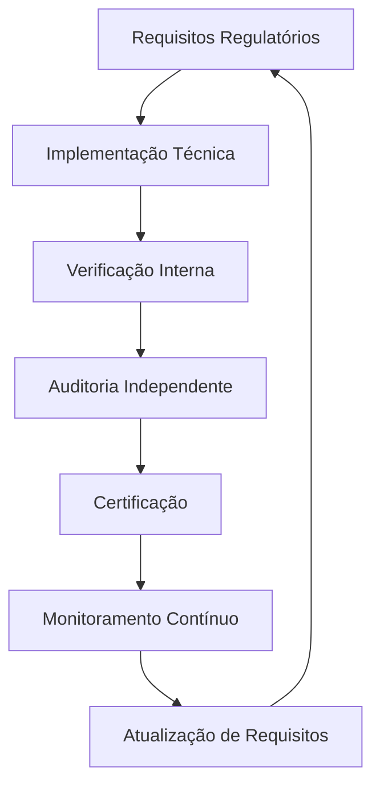
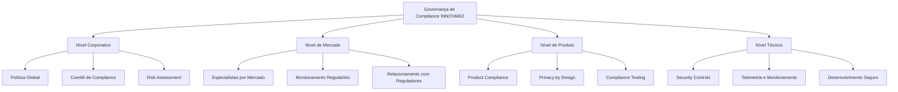

# Modelo de Compliance Regulatório Multi-Mercado

## 🌐 Visão Geral do Compliance na Plataforma INNOVABIZ

A arquitetura de observabilidade MCP-IAM da INNOVABIZ implementa um modelo de compliance multi-dimensional que atende aos requisitos regulatórios específicos de múltiplos mercados, com ênfase nas regiões estratégicas (Angola, Brasil, UE, EUA, China, CPLP, SADC, PALOP, BRICS) e segmentos de negócio. Este documento detalha a estrutura de compliance, requisitos regulatórios por mercado e estratégias de implementação técnica para garantir conformidade total.

## 📊 Matriz de Compliance Multi-Dimensional

```mermaid
graph TD
    A[Compliance Regulatório INNOVABIZ] --> B[Compliance por Mercado]
    A --> C[Compliance por Indústria]
    A --> D[Compliance por Framework]
    A --> E[Compliance por Funcionalidade]
    
    B --> B1[África: BNA/POPIA]
    B --> B2[América Latina: LGPD/BACEN]
    B --> B3[Europa: GDPR/PSD2]
    B --> B4[América do Norte: SOX/CCPA]
    B --> B5[Ásia: CSL/PIPL]
    
    C --> C1[Financeiro]
    C --> C2[Seguros]
    C --> C3[Saúde]
    C --> C4[Varejo]
    C --> C5[Governo]
    
    D --> D1[Segurança: ISO 27001]
    D --> D2[Privacidade: GDPR/LGPD]
    D --> D3[Financeiro: PCI DSS/SOX]
    D --> D4[Gestão: COBIT/TOGAF]
    D --> D5[Continuidade: ISO 22301]
    
    E --> E1[Autenticação]
    E --> E2[Autorização]
    E --> E3[Auditoria]
    E --> E4[Privacidade]
    E --> E5[Armazenamento]
```



## 🌍 Requisitos Regulatórios por Mercado

### 1. Angola e PALOP (Países Africanos de Língua Oficial Portuguesa)

#### Marcos Regulatórios Principais
- **BNA (Banco Nacional de Angola)**: Avisos 02/2018, 07/2021 e Diretiva 01/DSI/2021
- **Lei de Proteção de Dados de Angola**: Lei n.º 22/11, de 17 de Junho
- **Regulação de Pagamentos Eletrônicos**: Decreto Presidencial n.º 63/13, de 28 de Junho
- **CMC (Comissão do Mercado de Capitais)**: Lei 22/15 dos Valores Mobiliários

#### Requisitos Específicos Implementados
1. **Autenticação Robusta**:
   - MFA de nível alto obrigatório para todas as operações sensíveis
   - Verificação biométrica para transações acima de valores definidos pelo BNA
   - Registro de sessão com dados de geolocalização

2. **Retenção de Dados**:
   - Retenção de registros de transações por 7 anos
   - Armazenamento local de dados críticos dentro do território angolano
   - Capacidade de fornecer dados auditáveis ao BNA sob demanda

3. **Monitoramento e Reporte**:
   - Sistema de alerta para detecção de transações suspeitas conforme normas BNA
   - Geração automática de relatórios regulatórios mensais
   - Rastreamento de transferências internacionais com conversões cambiais

4. **Adaptações para PALOP**:
   - Framework flexível que acomoda variações regulatórias em Moçambique, Guiné-Bissau, Cabo Verde e São Tomé e Príncipe
   - Mapeamento automático de requisitos equivalentes entre países PALOP

### 2. Brasil e América Latina

#### Marcos Regulatórios Principais
- **LGPD (Lei Geral de Proteção de Dados)**: Lei nº 13.709/2018
- **BACEN (Banco Central do Brasil)**: Resolução BCB Nº 32/2020 e Resolução CMN Nº 4.893/2021
- **Open Finance Brasil**: Resolução Conjunta nº 1/2020
- **Marco Civil da Internet**: Lei nº 12.965/2014
- **Banco Central do Brasil**: Circular 3.978/2020 (Prevenção à Lavagem de Dinheiro)

#### Requisitos Específicos Implementados
1. **Proteção de Dados**:
   - Mecanismos de anonimização e pseudonimização de dados pessoais
   - Controle granular de consentimento com registros imutáveis
   - Procedimentos automatizados para atender direitos dos titulares (acesso, correção, exclusão)

2. **Segurança Financeira**:
   - Validação de identidade com bases oficiais (ex: CPF, CNPJ)
   - Implementação de mecanismos anti-fraude com base em IA
   - Controles para Prevenção à Lavagem de Dinheiro e Financiamento ao Terrorismo

3. **Open Finance**:
   - Autenticação OAuth 2.0 com FAPI (Financial-grade API)
   - Gerenciamento de consentimento específico para compartilhamento de dados
   - Rastreabilidade completa de acessos a APIs financeiras

4. **Auditoria**:
   - Logs inalteráveis para todas as operações sensíveis
   - Trilhas de auditoria em conformidade com requisitos BACEN
   - Retenção de dados por 5-10 anos conforme natureza da operação

### 3. União Europeia

#### Marcos Regulatórios Principais
- **GDPR (General Data Protection Regulation)**: Regulation (EU) 2016/679
- **PSD2 (Payment Services Directive 2)**: Directive (EU) 2015/2366
- **eIDAS Regulation**: Regulation (EU) N°910/2014
- **NIS2 Directive**: Directive (EU) 2022/2555
- **DORA (Digital Operational Resilience Act)**: Regulation (EU) 2022/2554

#### Requisitos Específicos Implementados
1. **Proteção de Dados**:
   - Base legal clara para cada processamento de dados
   - Mecanismos automáticos para implementar direito ao esquecimento
   - Avaliação de impacto de proteção de dados (DPIA) automatizada

2. **Autenticação Forte (SCA)**:
   - Implementação completa de Autenticação Forte do Cliente conforme RTS da PSD2
   - Gerenciamento de exceções de SCA conforme casos previstos na regulamentação
   - Monitoramento dinâmico de fraudes para aplicação de exceções

3. **Identidade Digital**:
   - Suporte a esquemas de identificação eletrônica (eID) conformes com eIDAS
   - Validação de assinaturas eletrônicas qualificadas
   - Interoperabilidade com sistemas de identidade nacionais europeus

4. **Resiliência Operacional**:
   - Monitoramento contínuo alinhado às exigências do DORA
   - Testes regulares de resiliência cibernética
   - Gestão de terceiros e cadeia de suprimentos conforme NIS2

### 4. China e Mercados Asiáticos

#### Marcos Regulatórios Principais
- **Cybersecurity Law of the PRC (CSL)**: Lei de 2017
- **Personal Information Protection Law (PIPL)**: Lei de 2021
- **Data Security Law (DSL)**: Lei de 2021
- **Medidas de Segurança para Dados Transfronteiriços**: CAC, 2022
- **Regulamentações de Serviços de Pagamento Online**: PBOC Decreto nº 2

#### Requisitos Específicos Implementados
1. **Localização de Dados**:
   - Armazenamento segregado para dados coletados na China
   - Mecanismos de aprovação para transferências transfronteiriças
   - Avaliação de segurança para dados críticos conforme CAC

2. **Consentimento e Notificação**:
   - Mecanismos robustos de notice-and-consent
   - Granularidade por tipo de dado pessoal conforme PIPL
   - Registro de consentimento com níveis separados para dados sensíveis

3. **Segurança de Infraestrutura Crítica**:
   - Proteções específicas para operações classificadas como infraestrutura crítica
   - Mecanismos avançados de detecção de intrusão
   - Capacidade de resposta a solicitações regulatórias

4. **Pagamentos Digitais**:
   - Integração com sistemas de pagamento locais (UnionPay, Alipay, WeChat Pay)
   - Implementação de requisitos de KYC específicos da China
   - Controles anti-fraude adaptados ao mercado chinês

### 5. EUA e América do Norte

#### Marcos Regulatórios Principais
- **Sarbanes-Oxley Act (SOX)**: Lei federal de 2002
- **California Consumer Privacy Act (CCPA)/CPRA**: Lei estadual da Califórnia
- **Gramm-Leach-Bliley Act (GLBA)**: Lei federal para instituições financeiras
- **NYDFS Cybersecurity Regulation**: 23 NYCRR 500
- **Federal Reserve SR 11-7**: Guidance on Model Risk Management

#### Requisitos Específicos Implementados
1. **Controles SOX**:
   - Segregação de funções e aprovações duais para operações financeiras
   - Auditoria rigorosa de alterações em sistemas financeiros
   - Documentação de controles internos com testes automatizados

2. **Privacidade do Consumidor**:
   - Implementação de "Do Not Sell My Personal Information"
   - Suporte a múltiplas leis estaduais de privacidade (CCPA, VCDPA, CPA)
   - Gerenciamento de preferências de privacidade por jurisdição

3. **Segurança Financeira**:
   - Proteção de dados financeiros conforme GLBA Safeguards Rule
   - Monitoramento contínuo conforme requisitos NYDFS
   - Validação de modelos conforme SR 11-7 para análises baseadas em IA

4. **Notificação de Violações**:
   - Sistemas automatizados para detecção e notificação de violações
   - Fluxos de trabalho específicos por estado para requisitos de notificação
   - Documentação forense para incidentes de segurança

## 📏 Implementação Técnica de Compliance no Adaptador de Observabilidade

### Estratégia de Contextualização por Mercado

O adaptador implementa o padrão Strategy para adaptar comportamentos específicos por mercado:

```go
// Registro de metadados de compliance por mercado
func registerComplianceMetadata(obs *adapter.HookObservability) {
    // Angola - Banco Nacional de Angola (BNA)
    obs.RegisterComplianceMetadata(
        constants.MarketAngola,
        "BNA",
        true,  // Requer aprovação dual
        constants.MFALevelHigh,
        7,     // 7 anos de retenção
    )

    // Brasil - LGPD e BACEN
    obs.RegisterComplianceMetadata(
        constants.MarketBrazil,
        "LGPD",
        true,  // Requer aprovação dual
        constants.MFALevelHigh,
        5,     // 5 anos de retenção
    )
    
    // União Europeia - GDPR
    obs.RegisterComplianceMetadata(
        constants.MarketEU,
        "GDPR",
        true,  // Requer aprovação dual
        constants.MFALevelHigh,
        7,     // 7 anos de retenção
    )
    
    // China - Cybersecurity Law
    obs.RegisterComplianceMetadata(
        constants.MarketChina,
        "CSL",
        true,  // Requer aprovação dual
        constants.MFALevelHigh,
        5,     // 5 anos de retenção
    )
    
    // Estados Unidos - SOX
    obs.RegisterComplianceMetadata(
        constants.MarketUSA,
        "SOX",
        true,  // Requer aprovação dual
        constants.MFALevelMedium,
        7,     // 7 anos de retenção
    )
    
    // Configuração global padrão
    obs.RegisterComplianceMetadata(
        constants.MarketGlobal,
        "ISO27001",
        false, // Não requer aprovação dual por padrão
        constants.MFALevelMedium,
        3,     // 3 anos de retenção
    )
}
```

### Auditoria Adaptativa por Mercado

O sistema de auditoria ajusta automaticamente seu comportamento com base no contexto do mercado:

```go
// TraceAuditEvent registra eventos de auditoria adaptados por mercado
func (h *HookObservability) TraceAuditEvent(
    ctx context.Context,
    marketCtx MarketContext,
    userId string,
    eventType string,
    description string,
) {
    // Obter metadados de compliance para o mercado
    metadata, exists := h.GetComplianceMetadata(marketCtx.Market)
    
    // Utilizar configuração global se não existir específica
    if !exists {
        metadata, _ = h.GetComplianceMetadata(constants.MarketGlobal)
    }
    
    // Registrar log estruturado
    h.logger.Info("Audit Event",
        zap.String("market", marketCtx.Market),
        zap.String("tenant_type", marketCtx.TenantType),
        zap.String("user_id", userId),
        zap.String("event_type", eventType),
        zap.String("description", description),
        zap.String("framework", metadata.Framework),
        zap.Int("retention_years", metadata.LogRetentionYears),
    )
    
    // Criar span de auditoria
    spanCtx, span := h.tracer.Start(ctx, "audit_event",
        trace.WithAttributes(
            attribute.String("market", marketCtx.Market),
            attribute.String("tenant_type", marketCtx.TenantType),
            attribute.String("user_id", userId),
            attribute.String("event_type", eventType),
            attribute.String("framework", metadata.Framework),
        ),
    )
    defer span.End()
    
    // Gravar evento em arquivo de auditoria específico do mercado
    if h.config.EnableComplianceAudit && h.config.ComplianceLogsPath != "" {
        h.writeAuditEvent(marketCtx.Market, userId, eventType, description, metadata)
    }
}
```

## 🛡️ Matriz de Conformidade Multi-Framework

O adaptador de observabilidade implementa controles técnicos que atendem simultaneamente a múltiplos frameworks regulatórios:

| Controle Implementado | ISO 27001 | GDPR | LGPD | SOX | PCI DSS | BNA | CSL |
|-----------------------|-----------|------|------|-----|---------|-----|-----|
| Autenticação MFA | A.9.4.2 | Art. 32 | Art. 46 | 404 | 8.3 | Aviso 02/18 | Art. 21 |
| Registro de Auditoria | A.12.4.1 | Art. 30 | Art. 37 | 302 | 10.2 | Aviso 07/21 | Art. 21 |
| Gestão de Identidade | A.9.2 | Art. 25 | Art. 46 | 404 | 7.1 | Aviso 02/18 | Art. 21 |
| Aprovação Dual | A.9.2.3 | Art. 32 | Art. 46 | 404 | 6.4 | Aviso 07/21 | Art. 21 |
| Monitoramento | A.12.4.1 | Art. 32 | Art. 46 | 404 | 10.6 | Aviso 07/21 | Art. 21 |
| Gestão de Incidentes | A.16 | Art. 33 | Art. 48 | 404 | 12.10 | Aviso 07/21 | Art. 25 |
| Controle de Acesso | A.9 | Art. 32 | Art. 46 | 404 | 7 | Aviso 02/18 | Art. 21 |

## 📜 Políticas e Procedimentos de Compliance

O adaptador de observabilidade é acompanhado por políticas e procedimentos que formalizam as práticas de compliance:

1. **Política de Observabilidade e Compliance**
   - Define responsabilidades e processos para observabilidade
   - Estabelece requisitos mínimos por mercado
   - Determina periodicidade de revisões e testes

2. **Procedimento de Auditoria de Telemetria**
   - Detalha como os dados de observabilidade devem ser auditados
   - Define processo para investigação de anomalias
   - Estabelece cadeia de custódia para evidências

3. **Política de Resposta a Incidentes**
   - Define critérios para classificação de incidentes
   - Estabelece procedimentos de escalação
   - Determina processo de notificação por jurisdição

4. **Procedimento de Verificação de Compliance**
   - Detalha testes periódicos de controles
   - Define processo de validação regulatória
   - Estabelece ciclos de avaliação por mercado

## 📋 Avaliação e Certificação de Compliance

Para garantir a conformidade contínua, a plataforma INNOVABIZ implementa um ciclo de avaliação e certificação:



### Certificações Relevantes por Mercado

| Mercado | Certificações Aplicáveis |
|---------|--------------------------|
| Global | ISO 27001, ISO 27701, SOC 2 Type II, CSA STAR |
| Angola/PALOP | Certificação BNA, Compliance SADC |
| Brasil | LGPD Assessment, Certificação BACEN |
| UE | GDPR Compliance Assessment, PSD2 Certification |
| EUA | SOC 2 Type II, SOX Compliance, PCI DSS |
| China | Certificação de Segurança Cibernética, MLPS 2.0 |

## 🔄 Estratégia de Atualização Regulatória

Para manter-se atualizado com a evolução dos requisitos regulatórios, o adaptador de observabilidade implementa:

1. **Monitoramento Regulatório**:
   - Acompanhamento sistemático de alterações regulatórias por mercado
   - Análise de impacto em funcionalidades existentes
   - Planejamento de atualizações para novas exigências

2. **Versionamento de Compliance**:
   - Cada versão do adaptador documenta requisitos regulatórios atendidos
   - Matriz de compatibilidade entre versões e marcos regulatórios
   - Histórico de alterações de compliance por mercado

3. **Roadmap de Compliance**:
   - Planejamento estratégico para novos requisitos com horizonte de 24 meses
   - Priorização baseada em datas de enforcement e impacto
   - Integração com ciclo de desenvolvimento de produto

## 🌐 Governança de Compliance Global

A estrutura de governança para compliance do adaptador de observabilidade opera em múltiplos níveis:



## 🚨 Gestão de Incidentes de Compliance

O adaptador de observabilidade fornece recursos para detecção, investigação e remediação de incidentes de compliance:

1. **Detecção**:
   - Alertas automáticos para anomalias em padrões de autenticação
   - Monitoramento de validações de MFA e escopo
   - Detecção de alterações não autorizadas em configurações de compliance

2. **Investigação**:
   - Traces distribuídos para reconstrução de eventos
   - Correlação entre logs, métricas e traces
   - Timeline de eventos com contextualização de mercado e tenant

3. **Remediação**:
   - Procedimentos automatizados para contenção de incidentes
   - Rollback de alterações não autorizadas
   - Geração de relatórios para reguladores por mercado

4. **Notificação**:
   - Templates de notificação por framework regulatório
   - Prazos específicos por mercado
   - Canais de comunicação com reguladores

## 📊 KPIs de Compliance

Para medir a eficácia das medidas de compliance implementadas, o adaptador de observabilidade expõe as seguintes métricas:

1. **Conformidade Técnica**:
   - % de controles implementados por framework
   - % de testes de compliance bem-sucedidos
   - Tempo médio de adaptação a novos requisitos

2. **Gestão de Incidentes**:
   - Tempo médio de detecção de incidentes de compliance
   - Tempo médio de resolução de incidentes
   - % de incidentes com remediação completa

3. **Qualidade de Observabilidade**:
   - % de operações com rastreabilidade completa
   - Precisão de correlação entre eventos
   - Disponibilidade de dados de compliance para auditoria

4. **Maturidade por Mercado**:
   - Nível de automação de controles por mercado
   - Cobertura de testes por requisito regulatório
   - Grau de integração com sistemas de monitoramento