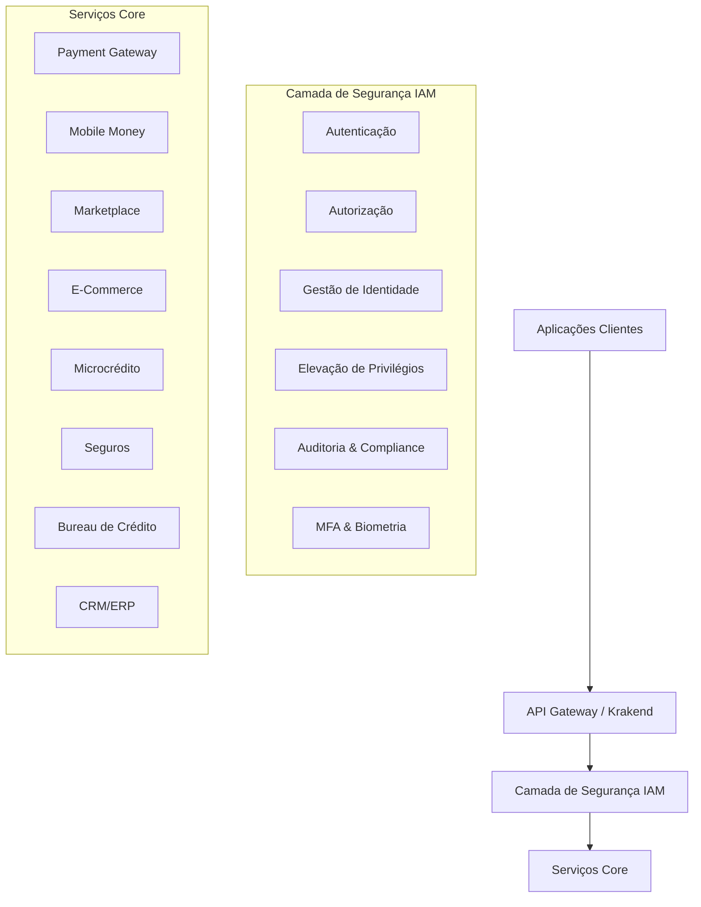
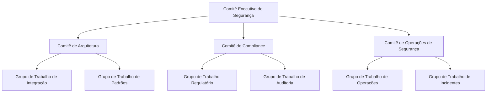

# Estratégia de Integração - IAM com Módulos Core INNOVABIZ

## 1. Visão Geral da Integração Total Avançada

O módulo IAM (Identity and Access Management) representa o núcleo central de segurança da plataforma INNOVABIZ, fornecendo serviços críticos de autenticação, autorização e governança para todos os demais módulos. Esta estratégia define a abordagem de **Integração Total Avançada** do IAM com todos os módulos core da plataforma, garantindo segurança, conformidade regulatória e isolamento multi-dimensional.

### 1.1. Princípios Fundamentais de Integração

1. **Integração por Design**: Todos os módulos são projetados com IAM como requisito fundamental
2. **Autenticação Centralizada**: Single Sign-On (SSO) com suporte a múltiplos fatores e biometria
3. **Autorização Contextual**: Decisões de acesso baseadas em múltiplas dimensões (tenant, mercado, regulação)
4. **Elevação de Privilégios Auditada**: Todo acesso privilegiado é registrado e rastreável
5. **Isolamento Multi-Tenant**: Garantia absoluta de separação entre clientes e mercados
6. **Conformidade por Configuração**: Adaptação automática às regulações específicas por mercado
7. **Observabilidade Total**: Monitoramento e auditoria de todas as operações de identidade

## 2. Arquitetura de Integração Multi-Dimensional

### 2.1. Camadas de Integração

### 2.2. Dimensões de Integração

| Dimensão | Descrição | Mecanismo de Integração |
|----------|-----------|------------------------|
| **Multi-Tenant** | Segregação entre organizações/clientes | Tenant ID em tokens JWT, isolamento de dados, políticas OPA |
| **Multi-Mercado** | Adaptação a requisitos específicos por país | Configurações regulatórias por mercado, validações específicas |
| **Multi-Contexto** | Adaptação baseada em caso de uso | Políticas contextual-aware, autorização adaptativa |
| **Multi-Camada** | Segurança em cada nível da stack | Validações em API, serviços, banco de dados e cliente |
| **Multi-Dimensão** | Combinação de todos os fatores acima | Motor de decisão baseado em grafos de autorização |

## 3. Integração Específica com Módulos Core

### 3.1. Payment Gateway

#### Pontos de Integração:
- **Autenticação de Transações**: Validação multi-fator para transações de alto valor
- **Autorização Contextual**: Decisões baseadas em perfil de risco, histórico e localização
- **Elevação de Privilégios**: Para operações de liquidação, chargebacks e configurações
- **Auditoria Regulatória**: Registro detalhado para compliance com PCI-DSS, regulações locais
- **Isolamento de Dados**: Separação absoluta de dados transacionais entre tenants

#### Fluxos Críticos:
1. **Onboarding de Merchant**: Validação de identidade e KYC/AML
2. **Configuração de Parâmetros de Risco**: Elevação de privilégios com MFA
3. **Processamento de Disputas**: Autorização baseada em função e contexto
4. **Operações de Liquidação**: Autenticação forte e autorização multi-nível

### 3.2. Mobile Money

#### Pontos de Integração:
- **Autenticação de Usuário**: Biometria e OTP para transações
- **KYC Digital**: Validação de identidade integrada com bureau de identidade
- **Autorização de Transações**: Baseada em limites regulatórios por mercado
- **Gestão de Agentes**: Hierarquia de privilégios e delegação
- **Compliance Regulatório**: Adaptação às regras de e-money por país

#### Fluxos Críticos:
1. **Registro de Cliente**: Validação biométrica e verificação de documentos
2. **Cash-In/Cash-Out**: Autenticação de agente e cliente
3. **Transferências P2P**: Validação biométrica e contextual
4. **Gestão de Limites**: Baseada em regulações locais (Angola, Moçambique, SADC)

### 3.3. Marketplace/E-Commerce

#### Pontos de Integração:
- **Identity Federation**: SSO com provedores sociais e corporativos
- **Gestão de Permissões de Vendedor**: Controle granular por categoria/função
- **Proteção de Dados de Comprador**: Mascaramento e criptografia de PII
- **Autorização para Disputas**: Workflow de aprovação para reembolsos
- **Compliance GDPR/LGPD**: Gestão de consentimento e direito ao esquecimento

#### Fluxos Críticos:
1. **Onboarding de Vendedor**: Verificação de identidade e documentação
2. **Gestão de Catálogo**: Controle de acesso baseado em categoria/loja
3. **Processamento de Pedidos**: Autenticação e autorização para diferentes etapas
4. **Gestão de Reembolsos**: Elevação de privilégios para valores altos

### 3.4. Microcrédito/Bureau de Crédito

#### Pontos de Integração:
- **Autenticação Forte**: MFA para consultas de crédito
- **Autorização por Finalidade**: Controle de propósito de consulta
- **Auditoria de Acesso**: Registro detalhado de todas consultas de dados
- **Gestão de Consentimento**: Rastreamento explícito de autorizações
- **Segregação Regulatória**: Adaptação às leis de proteção de dados por país

#### Fluxos Críticos:
1. **Consulta de Score**: Autenticação, autorização e registro de propósito
2. **Reporte de Informação**: Validação de fontes e autorização
3. **Disputas de Informação**: Workflow com elevação de privilégios
4. **Análise de Crédito**: Autorização contextual baseada em finalidade declarada

### 3.5. Seguros/Corretoras

#### Pontos de Integração:
- **Autenticação de Corretores**: Validação de credenciais regulatórias
- **Autorização por Linha de Produto**: Controle granular por tipo de seguro
- **Elevação para Subscrição**: Workflow de aprovação para casos especiais
- **Compliance Regulatório**: Adaptação a SUSEP, ASF, ISSM por mercado
- **Auditoria de Comissionamento**: Controle de acesso a dados financeiros

#### Fluxos Críticos:
1. **Cotação de Apólice**: Autenticação e autorização por produto
2. **Subscrição de Risco**: Elevação de privilégios para casos excepcionais
3. **Gestão de Sinistros**: Workflow de aprovação multi-nível
4. **Pagamento de Comissões**: Autorização e auditoria detalhada

### 3.6. CRM/ERP

#### Pontos de Integração:
- **Identity Lifecycle**: Sincronização com AD/LDAP corporativo
- **RBAC/ABAC Avançado**: Controle granular por departamento/função
- **Delegação de Acessos**: Aprovação workflow para acessos temporários
- **Auditoria SOX**: Registro detalhado para compliance financeiro
- **Segregação de Funções**: Prevenção de conflitos de interesse

#### Fluxos Críticos:
1. **Gestão de Clientes**: Controle de acesso a dados sensíveis
2. **Operações Financeiras**: Aprovação multi-nível e segregação de funções
3. **Relatórios Gerenciais**: Autorização contextual baseada em hierarquia
4. **Configuração de Sistema**: Elevação de privilégios com MFA obrigatório

## 4. Mecanismos de Integração

### 4.1. Integração via API Gateway (Krakend)

O Krakend Gateway atua como ponto central de autenticação e autorização, utilizando:

- **Validação de JWT**: Verificação de tokens e claims
- **Rate Limiting por Tenant**: Prevenção de abusos
- **Enriquecimento de Contexto**: Adição de metadados de segurança
- **Transformação de Requisições**: Injeção de headers de segurança
- **Circuit Breaking**: Proteção contra falhas em cascata

### 4.2. Integração via MCP (Model Context Protocol)

Para operações privilegiadas, o MCP fornece:

- **Hooks de Elevação**: Interceptação de comandos sensíveis
- **Verificação de Tokens de Elevação**: Validação de privilégios temporários
- **Verificação de MFA**: Solicitação de segundos fatores quando necessário
- **Registro de Auditoria**: Logging detalhado de todas operações sensíveis
- **Injeção de Contexto**: Propagação de tenant_id e elevation_token

### 4.3. Integração via GraphQL Federation

Para APIs de negócio, utilizamos:

- **Diretivas de Autorização**: `@requireAuth` com escopos necessários
- **Resolvers Protegidos**: Validação de permissões por campo/tipo
- **Field-level Security**: Mascaramento de dados sensíveis por perfil
- **Introspection Controlada**: Limitação de descoberta de schema por perfil
- **Observabilidade**: Tracing de operações sensíveis

### 4.4. Integração via OPA (Open Policy Agent)

Para decisões complexas de autorização:

- **Políticas Declarativas**: Regras Rego por módulo/mercado
- **Decisões em Tempo Real**: Avaliação de múltiplos fatores
- **Bundle Distribution**: Atualização controlada de políticas
- **Policy Testing**: Validação automatizada de políticas
- **Auditoria de Decisões**: Registro de fatores considerados

## 5. Aspectos Regulatórios e de Compliance por Mercado

### 5.1. Angola

- **Banco Nacional de Angola (BNA)**: Avisos sobre segurança bancária
- **Lei de Proteção de Dados (Lei 22/11)**: Controles de PII
- **Regulamentações SADC**: Conformidade regional
- **Controles AML/CFT**: Validação e monitoramento KYC

#### Adaptações Específicas:
1. Biometria adaptada ao registro civil angolano
2. Limites específicos para mobile money conforme regulação BNA
3. Validações de identidade específicas para documentos locais
4. Reporte regulatório automatizado para BNA

### 5.2. Brasil

- **LGPD (Lei Geral de Proteção de Dados)**: Controles de privacidade
- **Resoluções BACEN**: Requisitos de segurança bancária
- **Normativas do BACEN para Open Finance**: Compartilhamento de dados
- **Regulamentações CVM**: Para operações de investimento

#### Adaptações Específicas:
1. Integração com ICP-Brasil para assinaturas digitais
2. Workflow de consentimento LGPD com registro temporal
3. Autenticação via Gov.br para serviços públicos
4. Validação biométrica com base SERPRO

### 5.3. Moçambique

- **Banco de Moçambique**: Regulamentos de segurança financeira
- **Lei de Transações Eletrônicas**: Requisitos de validação digital
- **Regulamentações SADC**: Conformidade regional
- **Controles AML/CFT**: Conformidade com GIFIM

#### Adaptações Específicas:
1. Integração com sistema de identidade moçambicano
2. Suporte a operações offline para áreas rurais
3. Auditoria específica para requisitos do Banco de Moçambique
4. Limites transacionais adaptados à economia local

### 5.4. União Europeia / BRICS / SADC / CPLP

- **GDPR**: Proteção de dados abrangente
- **PSD2**: Autenticação forte para pagamentos
- **eIDAS**: Identidade digital transfronteiriça
- **Regulamentações específicas por bloco/país**

#### Adaptações Específicas:
1. Mecanismos de portabilidade de dados (GDPR Art. 20)
2. Sistemas de consentimento granular e revogável
3. Armazenamento regionalizado de dados conforme requisitos locais
4. Suporte a múltiplos idiomas para interfaces de segurança

## 6. Governança da Integração

### 6.1. Modelo de Governança Multi-Camada

### 6.2. Processos de Governança

| Processo | Periodicidade | Responsáveis | Entregáveis |
|----------|---------------|--------------|-------------|
| **Review de Arquitetura de Segurança** | Trimestral | Arquitetos de Segurança, Líderes de Módulo | Relatório de Gaps, Roadmap |
| **Avaliação de Compliance** | Mensal | Compliance Officers, DPO | Dashboard de Conformidade |
| **Teste de Penetração** | Semestral | Red Team, Blue Team | Relatório de Vulnerabilidades |
| **Revisão de Políticas** | Trimestral | Comitê de Segurança | Políticas Atualizadas |
| **Análise de Logs & Alertas** | Diária | SOC | Indicadores de Segurança |
| **Verificação de Integração** | Sprint | DevSecOps | Testes de Integração |

### 6.3. Métricas de Governança

| Métrica | Descrição | Alvo | Periodicidade |
|---------|-----------|------|---------------|
| **Cobertura de Testes de Integração** | % de fluxos críticos cobertos por testes E2E | >95% | Sprint |
| **Tempo de Resolução de Vulnerabilidades** | Tempo médio até correção | Crítica: <24h, Alta: <72h | Mensal |
| **Falhas de Autorização** | Tentativas de acesso não autorizado | <0.01% | Diária |
| **Incidentes de Cross-Tenant** | Violações de isolamento | 0 | Imediato |
| **Compliance Score** | % de controles em conformidade por mercado | >98% | Mensal |
| **Disponibilidade do IAM** | Uptime do serviço | >99.999% | Mensal |
| **Tempo de Resposta MFA** | Latência de verificação | <500ms (p95) | Diária |

## 7. Roteiro de Implementação

### 7.1. Fase 1: Fundação (Q3-2025)

- **Autenticação Unificada**: SSO para todos os módulos
- **Autorização Básica**: RBAC implementado para todos os serviços
- **Testes de Integração**: Cobertura dos fluxos críticos
- **Compliance Baseline**: Controles fundamentais para Angola, Brasil, Moçambique

### 7.2. Fase 2: Extensão (Q4-2025)

- **MFA Avançado**: Biometria, FIDO2/WebAuthn
- **Autorização Contextual**: ABAC com Open Policy Agent
- **Elevação de Privilégios**: Workflow completo para todos os módulos
- **Auditoria Avançada**: Logging centralizado e rastreabilidade

### 7.3. Fase 3: Otimização (Q1-2026)

- **IAM como Serviço**: APIs para terceiros integrados
- **Machine Learning**: Detecção de anomalias de acesso
- **Gestão de Consentimento**: Framework avançado de privacidade
- **Compliance Automatizada**: Evidências e reporting automatizado

### 7.4. Fase 4: Transformação (Q2-2026)

- **Zero Trust**: Implementação completa para todos os serviços
- **Identity Intelligence**: Analytics avançados de comportamento
- **Decentralized Identity**: Suporte a credenciais verificáveis
- **Adaptive Authentication**: Segurança baseada em risco em tempo real

## 8. Matriz RACI de Integração

| Atividade | IAM Team | Módulo Team | Compliance | Security Ops | Arquitetura |
|-----------|----------|-------------|------------|--------------|------------|
| **Design de Integração** | R | A | I | C | A |
| **Implementação de Auth** | R | C | I | I | A |
| **Testes de Integração** | A | R | C | C | I |
| **Monitoramento** | C | C | I | R | I |
| **Resolução de Incidentes** | A | R | I | R | C |
| **Compliance Review** | C | C | R | I | A |
| **Security Assessment** | C | I | C | R | A |

R = Responsável, A = Aprovador, C = Consultado, I = Informado

## 9. Próximos Passos

1. **Consolidação da Documentação Técnica** por módulo de integração
2. **Desenvolvimento dos Testes de Integração** para todos os módulos core
3. **Implementação de Dashboards de Observabilidade** unificados
4. **Estabelecimento do Comitê de Governança** com representantes de cada módulo
5. **Criação de Runbooks de Operação** para gestão de incidentes inter-módulos

---

**Documento Aprovado por**:  
Comitê de Arquitetura de Segurança INNOVABIZ  
Data: 06/08/2025  
Versão: 1.0.0

**Próxima Revisão**: 06/11/2025