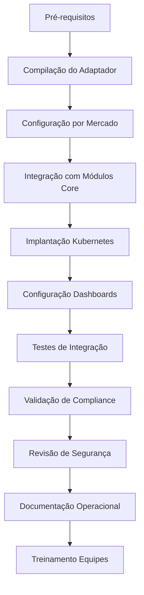

# Guia de Implementação Prática - MCP-IAM Observability

## 🌐 Visão Geral da Implementação

Este guia detalha a implementação prática do adaptador MCP-IAM Observability na plataforma INNOVABIZ, assegurando integração completa entre todos os módulos core e conformidade regulatória multi-dimensional para os mercados-alvo (Angola, Brasil, UE, EUA, China, CPLP, SADC, PALOP, BRICS).

## 📋 Pré-requisitos

1. **Infraestrutura Kubernetes** configurada com recursos para:
   - Namespaces dedicados por módulo
   - Prometheus Operator
   - OpenTelemetry Collector
   - Jaeger/Zipkin para rastreabilidade
   - Elasticsearch/Kibana para logs

2. **API Gateway Krakend** configurado com:
   - Propagação de headers de rastreabilidade
   - Autenticação/autorização IAM integrada
   - Segmentação por mercado e tenant

3. **Acesso aos Repositórios**:
   - `innovabizdevops/innovabiz-iam`
   - Módulos core (Payment Gateway, Risk Management, etc.)

## 🔄 Fluxo de Implementação



## 🚀 Passos de Implementação

### 1. Compilação e Empacotamento

```bash
# Navegar até o diretório raiz do IAM
cd C:\Users\EDUARDO JEREMIAS\Dropbox\InnovaBiz\CoreModules\IAM

# Compilar CLI de Observabilidade
go build -o bin/observability-cli ./cmd/observability-cli

# Compilar biblioteca adaptadora
go build -o bin/libobservability.so -buildmode=c-shared ./observability/adapter

# Criar imagem Docker
docker build -t innovabiz/mcp-iam-observability:v1.0.0 -f scripts/Dockerfile .
```

### 2. Configuração Específica por Mercado

#### 2.1 Angola (BNA) e PALOP

```bash
# Criar diretório específico para Angola
mkdir -p /etc/innovabiz/config/angola

# Configurar CLI para Angola
./bin/observability-cli config --market=Angola --tenant-type=business \
  --compliance-framework=BNA \
  --mfa-level=high \
  --log-retention-years=7 \
  --dual-approval=true \
  --regulators=BNA,CMC,ARSSI \
  --output=/etc/innovabiz/config/angola/config.json
```

**Requisitos específicos BNA**:
- Auditoria estendida (7 anos)
- MFA de nível alto obrigatório para todas as operações sensíveis
- Mecanismos de validação de identidade locais
- Armazenamento de dados críticos no território angolano

#### 2.2 Brasil (BACEN/LGPD)

```bash
# Criar diretório específico para Brasil
mkdir -p /etc/innovabiz/config/brazil

# Configurar CLI para Brasil
./bin/observability-cli config --market=Brazil --tenant-type=business \
  --compliance-framework=LGPD \
  --mfa-level=high \
  --log-retention-years=5 \
  --dual-approval=true \
  --regulators=BACEN,CVM,SUSEP,ANPD \
  --output=/etc/innovabiz/config/brazil/config.json
```

**Requisitos específicos BACEN/LGPD**:
- Conformidade com PLD/FT (Circular 3.978/2020)
- Consentimento granular para processamento de dados
- Direitos do titular (acesso, correção, exclusão)
- Validação com bases oficiais (CPF/CNPJ)

#### 2.3 União Europeia (GDPR/PSD2)

```bash
# Criar diretório específico para UE
mkdir -p /etc/innovabiz/config/eu

# Configurar CLI para UE
./bin/observability-cli config --market=EU --tenant-type=business \
  --compliance-framework=GDPR \
  --mfa-level=high \
  --log-retention-years=7 \
  --dual-approval=true \
  --regulators=EBA,ESMA,EIOPA \
  --output=/etc/innovabiz/config/eu/config.json
```

**Requisitos específicos GDPR/PSD2**:
- Autenticação Forte do Cliente (SCA)
- Base legal para cada processamento
- Direito ao esquecimento automatizado
- Interoperabilidade com sistemas eIDAS

### 3. Integração com Módulos Core

#### 3.1 Payment Gateway

```go
// Importar adaptador de observabilidade
import "github.com/innovabizdevops/innovabiz-iam/observability/adapter"

// Inicializar adaptador no módulo Payment Gateway
obs, err := adapter.NewHookObservability(adapter.NewConfig().
    WithMarketContext(adapter.MarketContext{
        Market:     "Angola", // Configurar conforme mercado-alvo
        TenantType: "business",
    }).
    WithComplianceLogsPath("/var/log/innovabiz/payment-gateway").
    WithEnvironment("production"))

// Registrar eventos de pagamento
ctx, span := obs.Tracer().Start(ctx, "payment_processing")
obs.TraceAuditEvent(ctx, marketCtx, userID, "payment_initiated", "Detalhes...")
```

#### 3.2 Risk Management

```go
// Inicializar adaptador no módulo Risk Management
obs, err := adapter.NewHookObservability(adapter.NewConfig().
    WithMarketContext(adapter.MarketContext{
        Market:     "Brazil", // Configurar conforme mercado-alvo
        TenantType: "business",
    }).
    WithComplianceLogsPath("/var/log/innovabiz/risk-management").
    WithEnvironment("production"))

// Validar MFA conforme requisitos de mercado
mfaResult, err := obs.ValidateMFA(ctx, marketCtx, userID, "high")

// Registrar métricas de risco
obs.RecordMetric(marketCtx, "risk_assessment", "fraud", riskScore)
```

#### 3.3 Mobile Money

```go
// Inicializar adaptador no módulo Mobile Money
obs, err := adapter.NewHookObservability(adapter.NewConfig().
    WithMarketContext(adapter.MarketContext{
        Market:     "Angola", // Mercado principal para Mobile Money
        TenantType: "individual",
    }).
    WithComplianceLogsPath("/var/log/innovabiz/mobile-money").
    WithEnvironment("production"))

// Verificar autorização específica BNA para Mobile Money
scopeResult, err := obs.ValidateScope(ctx, marketCtx, userID, "mobile_money:transfer")

// Registrar eventos de transação mobile
obs.TraceSecurityEvent(ctx, marketCtx, userID, "high", "money_transfer", "Transferência...")
```

### 4. Implantação com Kubernetes

Aplicar os manifestos de implantação:

```bash
# Aplicar ConfigMaps de configuração específica por mercado
kubectl apply -f scripts/kubernetes-deployment.yml

# Verificar status da implantação
kubectl get pods -n innovabiz-iam

# Verificar logs do adaptador
kubectl logs -n innovabiz-iam deploy/mcp-iam-observability
```

### 5. Configuração de Dashboards

#### 5.1 Dashboard de Compliance Multi-Mercado

```yaml
# Grafana Dashboard - Compliance Multi-Mercado
dashboard:
  title: "INNOVABIZ Compliance Multi-Mercado"
  panels:
    - title: "Autenticação MFA por Mercado"
      metrics:
        - expr: 'sum(rate(mcp_iam_mfa_validations_total{result="success"}[5m])) by (market, mfa_level)'
    
    - title: "Eventos de Auditoria por Framework"
      metrics:
        - expr: 'sum(rate(mcp_iam_audit_events_total[5m])) by (market, framework)'
    
    - title: "Validações de Escopo por Mercado"
      metrics:
        - expr: 'sum(rate(mcp_iam_scope_validations_total{result="success"}[5m])) by (market)'
    
    - title: "Eventos de Segurança por Severidade"
      metrics:
        - expr: 'sum(rate(mcp_iam_security_events_total[5m])) by (market, severity)'
```

#### 5.2 Dashboard Operacional por Módulo

```yaml
# Grafana Dashboard - Operacional por Módulo
dashboard:
  title: "INNOVABIZ Operacional por Módulo"
  panels:
    - title: "Tempo de Resposta por Módulo"
      metrics:
        - expr: 'histogram_quantile(0.95, sum(rate(mcp_iam_operation_duration_seconds_bucket[5m])) by (le, module))'
    
    - title: "Volume de Operações por Módulo"
      metrics:
        - expr: 'sum(rate(mcp_iam_operations_total[5m])) by (module, market)'
    
    - title: "Taxa de Erros por Módulo"
      metrics:
        - expr: 'sum(rate(mcp_iam_errors_total[5m])) by (module, market, error_type)'
```

### 6. Testes de Integração

Execute os testes de integração para validar a solução:

```bash
# Executar testes de integração
cd C:\Users\EDUARDO JEREMIAS\Dropbox\InnovaBiz\CoreModules\IAM
go test -v ./observability/adapter/tests/...

# Executar teste de integração específico de mercado
go test -v ./observability/adapter/tests/... -tags=angola,bna
go test -v ./observability/adapter/tests/... -tags=brazil,lgpd
go test -v ./observability/adapter/tests/... -tags=eu,gdpr
```

### 7. Validação de Compliance

#### 7.1 Checklist de Validação por Mercado

**Angola/BNA:**
- [ ] Autenticação MFA de nível alto implementada
- [ ] Logs de auditoria configurados para 7 anos de retenção
- [ ] Verificação de limites BNA implementada
- [ ] Armazenamento local de dados conforme requisitos
- [ ] Alertas para transações suspeitas conforme Aviso 02/2018

**Brasil/LGPD/BACEN:**
- [ ] Consentimento granular implementado
- [ ] Mecanismos para atender direitos do titular
- [ ] PLD/FT conforme Circular 3.978/2020
- [ ] Validação com bases oficiais
- [ ] Open Finance Brasil (APIs e consentimento)

**Europa/GDPR/PSD2:**
- [ ] Autenticação Forte do Cliente (SCA)
- [ ] Base legal para cada processamento
- [ ] Mecanismos para direito ao esquecimento
- [ ] Interoperabilidade com sistemas eIDAS
- [ ] Exceções SCA implementadas corretamente

#### 7.2 Comandos de Validação via CLI

```bash
# Validar compliance para mercado específico
./bin/observability-cli validate --market=Angola --compliance=BNA

# Gerar relatório de compliance
./bin/observability-cli report --market=Brazil --output=compliance-report.pdf

# Validar exportação de traces para auditoria
./bin/observability-cli trace-export --market=EU --type=audit --days=7
```

### 8. Documentação Operacional

#### 8.1 Runbooks de Operação

Crie runbooks operacionais para cada módulo e mercado:

- **Runbook - Troubleshooting Angola**
  - Verificar conectividade com reguladores BNA
  - Validar certificados locais
  - Procedimentos de escalação para eventos críticos

- **Runbook - Compliance Brasil**
  - Procedimentos para atender solicitações LGPD
  - Validação de relatórios BACEN
  - Resposta a incidentes de segurança

#### 8.2 Monitoramento e Alertas

Configure alertas específicos:

```yaml
# Prometheus Alert Rules
groups:
  - name: compliance_alerts
    rules:
      - alert: HighMFAFailureRate
        expr: rate(mcp_iam_mfa_validations_total{result="failure"}[5m]) / rate(mcp_iam_mfa_validations_total[5m]) > 0.05
        labels:
          severity: critical
          market: '{{ $labels.market }}'
        annotations:
          summary: "Alta taxa de falhas MFA em {{ $labels.market }}"
          description: "Taxa de falha de MFA em {{ $labels.market }} supera 5%"

      - alert: ComplianceFrameworkFailure
        expr: increase(mcp_iam_compliance_failures_total[1h]) > 0
        labels:
          severity: critical
          market: '{{ $labels.market }}'
          framework: '{{ $labels.framework }}'
        annotations:
          summary: "Falha de compliance em {{ $labels.framework }} ({{ $labels.market }})"
          description: "Falhas de compliance detectadas para framework {{ $labels.framework }}"
```

## 📝 Configurações Específicas por Módulo

### 1. IAM (Identity and Access Management)

```yaml
# Configuração de Observabilidade IAM
observability:
  metrics_endpoint: "/metrics"
  traces_exporter: "otlp"
  logs_path: "/var/log/innovabiz/iam"
  market_configs:
    angola:
      mfa_level: "high"
      dual_approval: true
      retention_years: 7
      local_validation: true
    brazil:
      mfa_level: "high"
      consent_granularity: "detailed"
      retention_years: 5
    eu:
      mfa_level: "high"
      data_minimization: true
      right_to_be_forgotten: true
      retention_years: 7
```

### 2. Payment Gateway

```yaml
# Configuração de Observabilidade Payment Gateway
observability:
  metrics_endpoint: "/metrics"
  traces_exporter: "otlp"
  logs_path: "/var/log/innovabiz/payment-gateway"
  market_configs:
    angola:
      transaction_limits:
        daily: 500000
        single: 100000
      bna_reporting: true
    brazil:
      bacen_pix_integration: true
      anti_fraud_enhanced: true
    eu:
      psd2_sca_required: true
      exemptions_enabled: true
```

### 3. Mobile Money

```yaml
# Configuração de Observabilidade Mobile Money
observability:
  metrics_endpoint: "/metrics"
  traces_exporter: "otlp"
  logs_path: "/var/log/innovabiz/mobile-money"
  market_configs:
    angola:
      emis_integration: true
      multicaixa_compliance: true
    mozambique:
      mpesa_integration: true
    kenya:
      mpesa_integration: true
```

### 4. Risk Management

```yaml
# Configuração de Observabilidade Risk Management
observability:
  metrics_endpoint: "/metrics"
  traces_exporter: "otlp"
  logs_path: "/var/log/innovabiz/risk-management"
  market_configs:
    angola:
      bna_rules_enabled: true
      suspicious_transaction_monitoring: true
    brazil:
      pld_ft_circular_3978: true
      bacen_reporting: true
    eu:
      aml_directive_compliance: true
      transaction_monitoring_enhanced: true
```

## 📊 Métricas e Rastreabilidade

### Métricas Principais por Módulo

| Módulo | Métrica | Descrição | Dimensões |
|--------|---------|-----------|-----------|
| IAM | `mcp_iam_mfa_validations_total` | Total de validações MFA | mercado, tenant, resultado |
| IAM | `mcp_iam_scope_validations_total` | Total de validações de escopo | mercado, tenant, resultado |
| Payment | `payment_transactions_total` | Total de transações de pagamento | mercado, tenant, método, resultado |
| Payment | `payment_amount_sum` | Valor total de pagamentos | mercado, tenant, moeda |
| Risk | `risk_assessments_total` | Total de avaliações de risco | mercado, tenant, nível |
| Risk | `risk_rule_matches_total` | Total de regras correspondidas | mercado, regra, framework |
| Mobile | `mobile_transfers_total` | Total de transferências mobile | mercado, tenant, tipo |

### Spans de Rastreabilidade

| Nome do Span | Módulo | Atributos Importantes |
|-------------|--------|----------------------|
| `auth_validation` | IAM | `user_id`, `market`, `mfa_level`, `auth_method` |
| `scope_validation` | IAM | `user_id`, `market`, `scope`, `resource` |
| `payment_processing` | Payment | `transaction_id`, `amount`, `currency`, `method` |
| `risk_assessment` | Risk | `assessment_id`, `entity_id`, `risk_score`, `risk_level` |
| `mobile_transfer` | Mobile | `transfer_id`, `amount`, `sender`, `recipient` |

## 🛡️ Considerações de Segurança

### Hardening da Solução

1. **Proteção de Dados Sensíveis**:
   - Implementar encryption-at-rest para logs de auditoria
   - Utilizar secrets do Kubernetes para credenciais
   - Aplicar mascaramento de dados em logs e traces

2. **Segurança de Rede**:
   - Utilizar Service Mesh para comunicação entre serviços
   - Implementar mTLS para todas as comunicações
   - Restringir comunicação apenas para serviços necessários

3. **Controles de Acesso**:
   - RBAC rigoroso para acesso a recursos Kubernetes
   - Segregação de responsabilidades por mercado
   - Controle de acesso baseado em contexto (CBAC)

### Mitigação de Riscos

1. **Plano de Continuidade**:
   - Estratégia de backup para dados de observabilidade
   - Procedimento de recuperação para falhas de telemetria
   - Operação em modo degradado para falhas de observabilidade

2. **Gestão de Incidentes**:
   - Playbooks de resposta por tipo de alerta
   - Cadeia de responsabilidades por mercado
   - Procedimentos de notificação por framework regulatório

## 📈 Verificação e Validação

### Testes Unitários por Componente

```bash
# Executar testes unitários de validação MFA
go test -v ./observability/adapter/tests/mfa_test.go

# Executar testes unitários de validação de escopo
go test -v ./observability/adapter/tests/scope_test.go

# Executar testes de auditoria
go test -v ./observability/adapter/tests/audit_test.go
```

### Testes de Integração End-to-End

```bash
# Testar integração completa IAM + Payment Gateway
go test -v ./integration/tests/payment_integration_test.go

# Testar integração completa IAM + Risk Management
go test -v ./integration/tests/risk_integration_test.go

# Testar observabilidade multi-módulo
go test -v ./integration/tests/multi_module_observability_test.go
```

## 📚 Referências Normativas

1. **Angola**:
   - [Aviso 02/2018 do BNA](https://www.bna.ao)
   - [Diretiva 01/DSI/2021 do BNA](https://www.bna.ao)
   - [Lei n.º 22/11 de Proteção de Dados](https://www.governo.gov.ao)

2. **Brasil**:
   - [LGPD - Lei nº 13.709/2018](https://www.planalto.gov.br)
   - [Circular BACEN 3.978/2020](https://www.bcb.gov.br)
   - [Resolução Conjunta nº 1/2020 (Open Finance)](https://www.bcb.gov.br)

3. **União Europeia**:
   - [GDPR - Regulation (EU) 2016/679](https://gdpr.eu)
   - [PSD2 - Directive (EU) 2015/2366](https://ec.europa.eu)
   - [eIDAS - Regulation (EU) N°910/2014](https://ec.europa.eu)

4. **Global**:
   - [ISO/IEC 27001:2022](https://www.iso.org)
   - [TOGAF 10.0](https://www.opengroup.org)
   - [COBIT 2019](https://www.isaca.org)
   - [DMBOK 2.0](https://www.dama.org)

## 🚀 Próximos Passos

1. **Expansão de Mercados**:
   - Implementação específica para SADC (Southern African Development Community)
   - Adaptações para mercados PALOP adicionais
   - Suporte a requisitos BRICS

2. **Integração com Módulos Adicionais**:
   - Bureau de Crédito
   - Microcrédito
   - E-Commerce/Marketplace
   - Seguros

3. **Aprimoramentos Técnicos**:
   - Autoscaling baseado em telemetria
   - Machine Learning para detecção de anomalias
   - Alertas preditivos com análise de tendências

## 🔄 Manutenção e Evolução

1. **Ciclo de Atualização Regulatória**:
   - Monitoramento contínuo de alterações regulatórias
   - Processo de atualização de regras por mercado
   - Validação de compliance após atualizações

2. **Revisão Periódica**:
   - Auditoria trimestral de configurações de compliance
   - Revisão mensal de alertas e incidentes
   - Análise semestral de eficácia dos controles