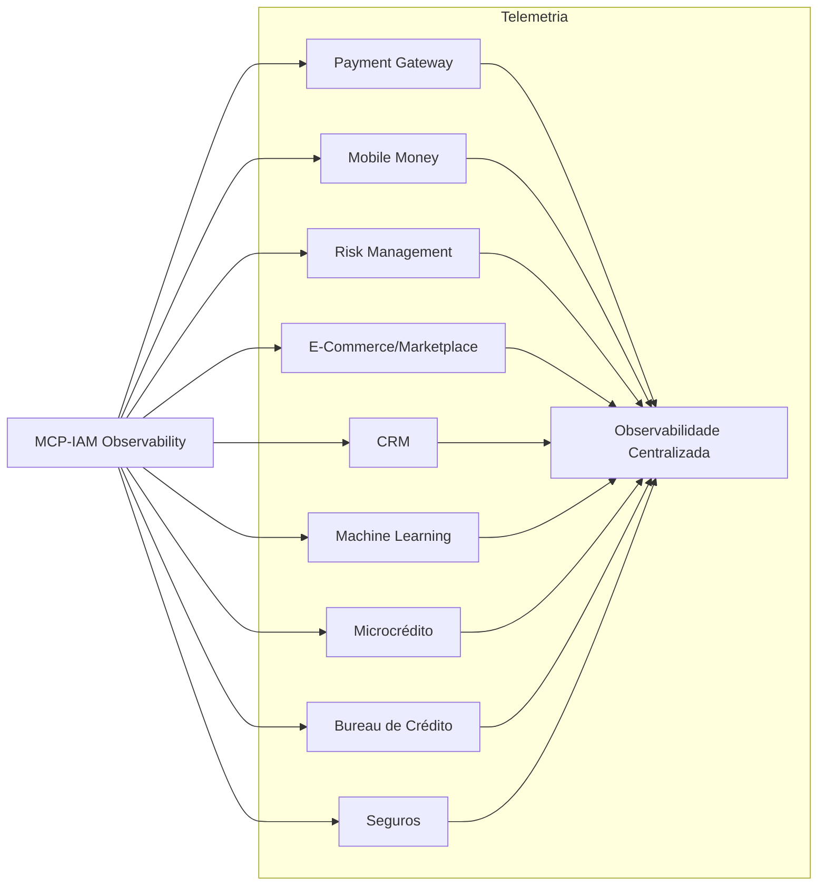
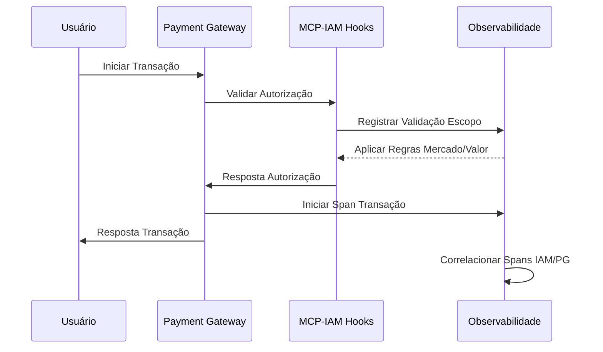
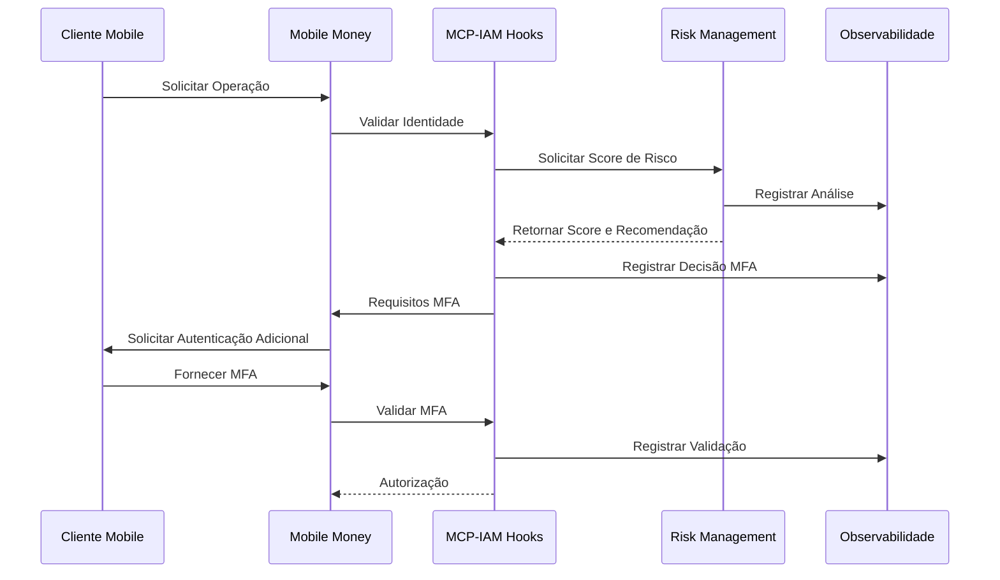
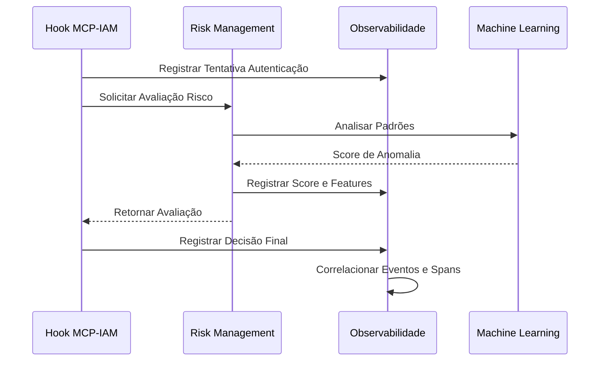
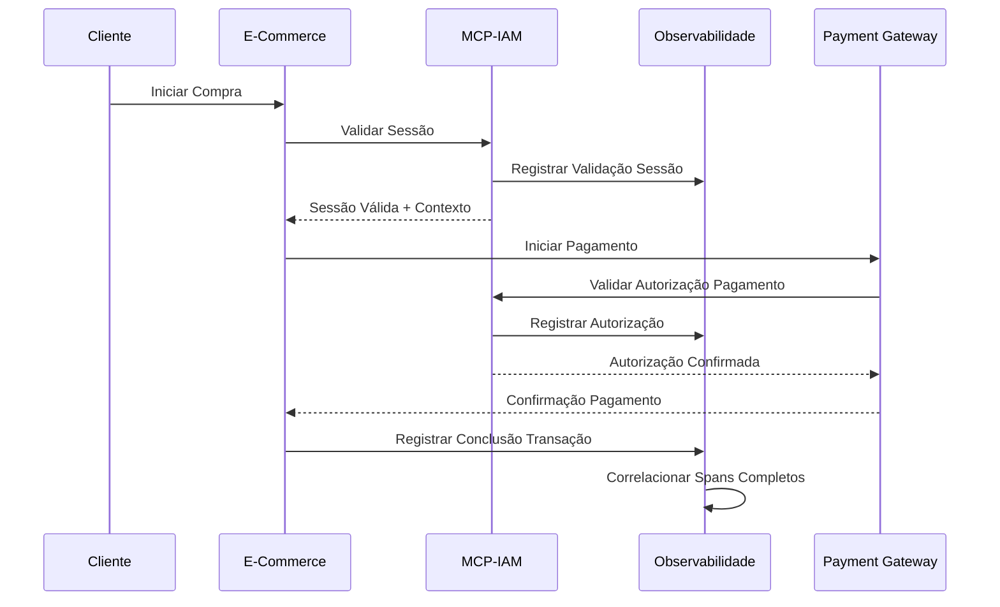
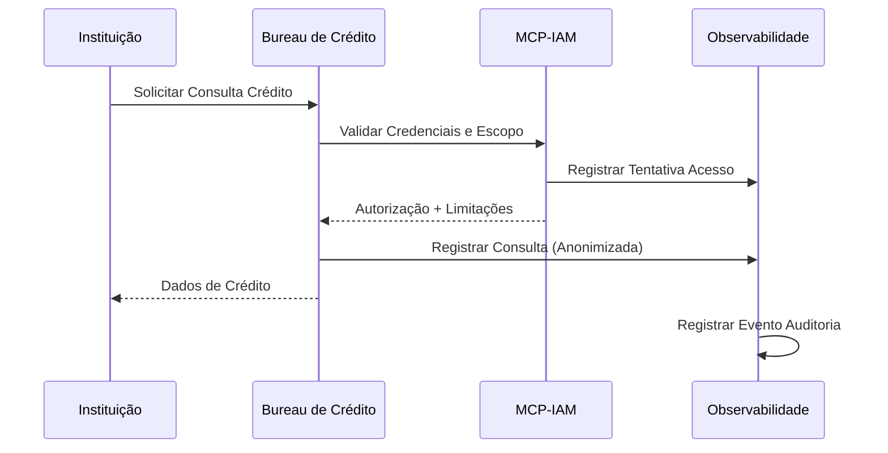
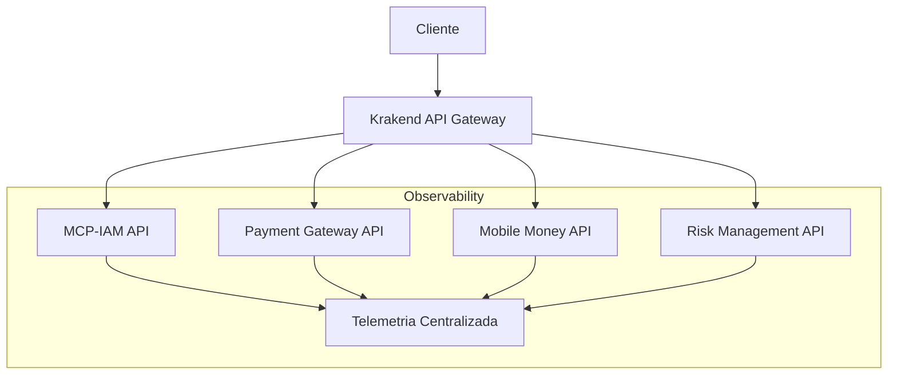
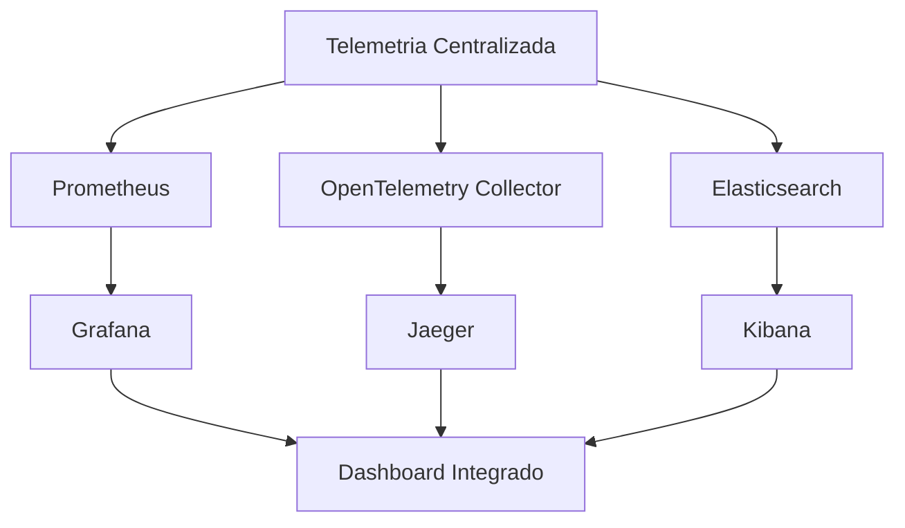

# Integração Total: Observabilidade MCP-IAM com Ecossistema INNOVABIZ

## 🔄 Visão Geral de Integração

A camada de observabilidade MCP-IAM foi projetada para integração total com todos os módulos da plataforma INNOVABIZ, seguindo princípios de interoperabilidade baseados em TOGAF 10.0, APIs RESTful padronizadas, OpenTelemetry para telemetria distribuída e Prometheus para agregação de métricas. Este documento detalha as estratégias e padrões de integração entre o adaptador de observabilidade MCP-IAM e os demais módulos Core da plataforma.

## 📊 Matriz de Integração Multi-Dimensional

### Dimensão Técnica: Camadas de Integração

| Camada | Protocolo/Tecnologia | Padrões Aplicados | Conformidade |
|--------|----------------------|-------------------|--------------|
| Métricas | Prometheus HTTP | OpenMetrics, OTLP | ISO 20000, ITIL 4.0 |
| Tracing | gRPC, HTTP | OpenTelemetry | ISO 27001, ISO 20000 |
| Logging | OTLP, Fluent Bit | ECS, OTLP | GDPR, LGPD, BNA |
| Alertas | Webhook, SMTP, SMS | SMTP, HTTP | ISO 27001, ISO 22301 |
| Auditoria | REST, Arquivo | JSON, CSV | SOX, GDPR, LGPD, BNA |

### Dimensão Funcional: Integração com Módulos Core



## 🔌 Padrões de Integração por Módulo Core

### 1. Payment Gateway

#### Pontos de Integração
- **Telemetria de Transações**: Rastreamento de operações de pagamento com enriquecimento de contexto IAM
- **Autenticação Contextual**: Validações MFA e escopo adaptadas por tipo de transação e valor
- **Métricas Agregadas**: Correlação entre métricas de autorização e transações financeiras

#### Fluxo de Integração



#### Especificações Técnicas
- **Trace Context**: Propagação via OpenTelemetry de IDs entre IAM e Payment Gateway
- **Métricas Compartilhadas**: Exposição de métricas de autorização para correlação com taxas de aprovação
- **Alertas Integrados**: Notificações para desvios significativos em padrões de autorização
- **Conformidade**: BNA (Angola), BACEN (Brasil), PSD2 (UE), PCI DSS (Global)

### 2. Mobile Money

#### Pontos de Integração
- **Autenticação Multi-Canal**: Validação de identidade em dispositivos móveis com contexto de localização
- **MFA Adaptativo**: Escalação de fatores de autenticação baseado em análise de risco
- **Auditoria Distribuída**: Registro de operações sensíveis conformes com regulações locais

#### Fluxo de Integração



#### Especificações Técnicas
- **Contexto Geográfico**: Enriquecimento de spans com dados de localização para análise de anomalias
- **Métricas de Dispositivo**: Agregação de métricas por tipo de dispositivo e canal
- **Validação Regulatória**: Conformidade com BNA (Angola), BACEN (Brasil), PSD2 (UE)
- **Dashboards Integrados**: Visibilidade unificada de autenticação e transações por canal

### 3. Risk Management

#### Pontos de Integração
- **Enriquecimento de Contexto**: Fornecimento de dados de identidade e histórico para avaliação de risco
- **Feedback Loop**: Integração de resultados de análise de risco nas decisões de autenticação
- **Correlação de Anomalias**: Identificação de padrões suspeitos entre identidade e comportamento

#### Fluxo de Integração



#### Especificações Técnicas
- **Feature Sharing**: Compartilhamento de atributos de usuário e sessão via contexto OpenTelemetry
- **Métricas Preditivas**: Exposição de métricas de precisão de modelos de risco
- **Traces Enriched**: Spans enriquecidos com scores de risco para auditoria
- **Conformidade**: LGPD (Brasil), GDPR (UE), SOX (EUA), BNA (Angola)

### 4. E-Commerce/Marketplace

#### Pontos de Integração
- **Single Sign-On**: Autenticação unificada com propagação de contexto entre plataformas
- **Autorização Granular**: Validação de permissões específicas por operação comercial
- **Rastreabilidade de Transações**: Correlação entre identidade e atividade comercial

#### Fluxo de Integração



#### Especificações Técnicas
- **Context Propagation**: Propagação de contexto de autenticação via headers HTTP padronizados
- **B2B Authorization**: Suporte a autorizações entre empresas para marketplace
- **Compliance por Produto**: Validações específicas por categoria de produto conforme regulações
- **Métricas de Conversão**: Correlação entre métricas de autenticação e conversão de vendas

### 5. Bureau de Crédito/Microcrédito

#### Pontos de Integração
- **Verificação de Identidade**: Validação robusta de identidade para consultas de crédito
- **Controle de Acesso a Dados**: Autorização granular para acesso a informações sensíveis
- **Auditoria Detalhada**: Registro completo de consultas e modificações de dados de crédito

#### Fluxo de Integração



#### Especificações Técnicas
- **Tokenização de Identidade**: Uso de tokens para consultas preservando privacidade
- **Registro Imutável**: Garantia de não-repúdio para operações de consulta e alteração
- **Conformidade**: LGPD (Brasil), GDPR (UE), POPIA (África), BNA (Angola)
- **Métricas Regulatórias**: Exposição de métricas de compliance para relatórios regulatórios

## 🛠️ Implementação Técnica de Integração

### Interface de Integração Padrão

Todos os módulos que integram com o adaptador de observabilidade MCP-IAM devem implementar a interface padrão para consumo de telemetria:

```go
// ObservabilityConsumer define a interface para módulos que consomem telemetria do adaptador MCP-IAM
type ObservabilityConsumer interface {
    // ConfigureTracer configura o tracer com propagação de contexto
    ConfigureTracer(ctx context.Context, serviceName string) (trace.Tracer, error)
    
    // ConfigureMetrics registra métricas específicas do módulo
    ConfigureMetrics(registry *prometheus.Registry) error
    
    // ConfigureLogging configura logging estruturado com campos contextuais
    ConfigureLogging(config adapter.Config) (*zap.Logger, error)
    
    // RegisterComplianceHooks registra hooks de compliance específicos do módulo
    RegisterComplianceHooks(marketCtx adapter.MarketContext) error
    
    // Close libera recursos utilizados pelo consumidor
    Close() error
}
```

### Krakend como API Gateway

A integração entre o adaptador de observabilidade MCP-IAM e os demais módulos utiliza o Krakend como API Gateway central:



#### Configuração Krakend para Propagação de Telemetria

```json
{
  "endpoints": [
    {
      "endpoint": "/v1/auth",
      "method": "POST",
      "backend": [
        {
          "url_pattern": "/auth",
          "host": ["http://mcp-iam:8080"],
          "extra_config": {
            "plugin/req-resp-modifier": {
              "name": "telemetry-propagator",
              "path": "krakend-telemetry.so",
              "sources": ["traceparent", "tracestate", "x-innovabiz-market"]
            }
          }
        }
      ]
    }
  ]
}
```

## 📈 Dashboard Integrado Multi-Módulos

Para visualização unificada da telemetria entre MCP-IAM e os módulos core, recomenda-se a implementação do Dashboard Unificado INNOVABIZ:



### Visões Principais do Dashboard

1. **Visão Operacional**: Saúde dos serviços, taxas de erro e latência
2. **Visão de Segurança**: Tentativas de acesso, validações MFA e anomalias
3. **Visão de Negócio**: Conversão de vendas, volume de transações e uso de serviços
4. **Visão de Compliance**: Conformidade por mercado e framework regulatório

## 🔒 Considerações de Segurança na Integração

1. **Zero Trust**: Autenticação e autorização em cada ponto de integração
2. **Confidencialidade de Telemetria**: Remoção de dados sensíveis de spans e logs
3. **Segmentação por Mercado**: Isolamento de telemetria por requisitos regulatórios
4. **Proteção de Dados em Trânsito**: TLS 1.3 para todas as comunicações
5. **Observabilidade da Segurança**: Monitoramento ativo de padrões suspeitos

## 🌍 Estratégia de Implantação por Mercado

A estratégia de implantação da integração de observabilidade considera as particularidades de cada mercado:

### Angola (BNA)

- **Requisitos Específicos**: Retenção estendida (7 anos), relatórios regulatórios ao BNA
- **Adaptações**: Armazenamento local de telemetria, dashboards específicos para compliance
- **Integrações Prioritárias**: Mobile Money, Payment Gateway, Microcrédito

### Brasil (BACEN/LGPD)

- **Requisitos Específicos**: Anonimização de dados pessoais, compartimentalização de dados
- **Adaptações**: Processadores de spans para remoção de PII, separação de armazenamento
- **Integrações Prioritárias**: Open Finance, Marketplace, Bureau de Crédito

### União Europeia (GDPR/PSD2)

- **Requisitos Específicos**: Consentimento explícito, direito à portabilidade, direito ao esquecimento
- **Adaptações**: Mecanismos de expiração de telemetria, rastreamento de consentimento
- **Integrações Prioritárias**: Payment Gateway, E-Commerce, Risk Management

### SADC/PALOP

- **Requisitos Específicos**: Adaptação a múltiplos frameworks regulatórios
- **Adaptações**: Configuração flexível por país dentro da região
- **Integrações Prioritárias**: Mobile Money, Microcrédito, Payment Gateway

## 📋 Checklist de Integração

Ao integrar novos módulos com o adaptador de observabilidade MCP-IAM, utilize o seguinte checklist:

1. **Preparação**
   - [ ] Identificar requisitos específicos de mercado e compliance
   - [ ] Definir métricas e KPIs relevantes para o módulo
   - [ ] Mapear operações críticas para instrumentação detalhada

2. **Implementação**
   - [ ] Implementar interface ObservabilityConsumer
   - [ ] Configurar propagação de contexto OpenTelemetry
   - [ ] Registrar métricas Prometheus específicas do módulo
   - [ ] Implementar logging estruturado com contexto de IAM

3. **Validação**
   - [ ] Testar propagação de contexto entre módulos
   - [ ] Verificar correlação de spans entre IAM e módulo
   - [ ] Validar métricas em dashboards integrados
   - [ ] Confirmar compliance com requisitos regulatórios

4. **Operacionalização**
   - [ ] Configurar alertas para anomalias de segurança e performance
   - [ ] Documentar padrões de telemetria para equipe de operações
   - [ ] Implementar runbooks para incidentes comuns
   - [ ] Estabelecer baselines de performance e segurança