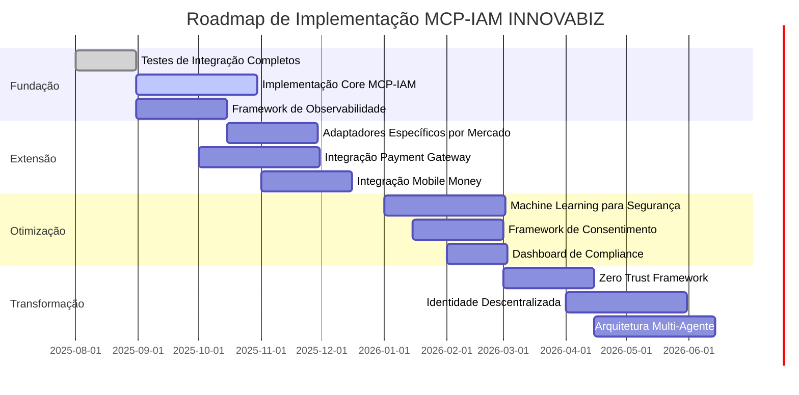
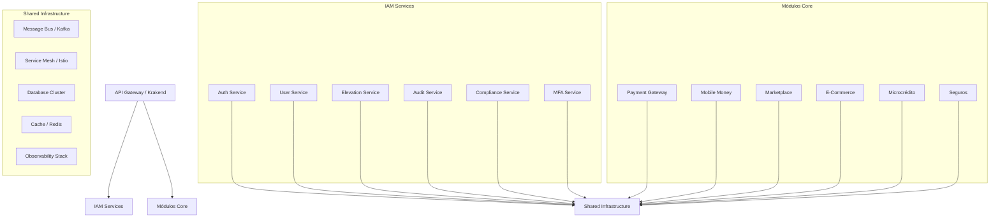
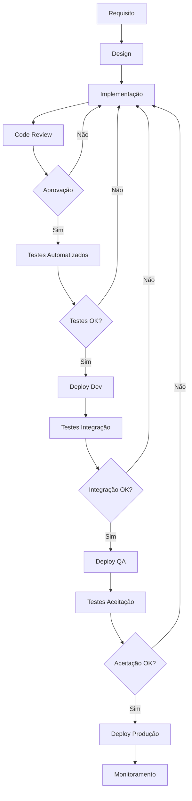

# Plano de Implementação do MCP-IAM INNOVABIZ

## 1. Próximos Passos - Roadmap de Implementação

### 1.1. Visão Geral do Roadmap Q3-2025 a Q2-2026



### 1.2. Prioridades Imediatas (Próximos 30 dias)

1. **Completar Testes de Integração E2E**
   - Finalizar testes para MCP GitHub e Figma
   - Adicionar testes multi-tenant para todos os hooks
   - Implementar testes de compliance específicos por mercado

2. **Implementação do Serviço de Elevação**
   - Desenvolver componentes core do serviço
   - Criar adaptadores para cada MCP hook
   - Implementar workflows de aprovação

3. **Framework de Observabilidade**
   - Desenvolver coletores de eventos de auditoria
   - Criar dashboards operacionais
   - Implementar alertas de segurança

4. **Documentação e Governança**
   - Finalizar especificação técnica
   - Desenvolver guias de integração para outros módulos
   - Criar runbooks operacionais

## 2. Plano de Teste Abrangente

### 2.1. Estratégia de Teste Multi-Dimensional

| Dimensão | Estratégia | Ferramentas | Cobertura Alvo |
|----------|-----------|-------------|----------------|
| **Funcional** | Testes unitários e integração | Go testing, Testify | >90% |
| **Performance** | Testes de carga e stress | K6, Gatling | <100ms p95 |
| **Segurança** | Análise estática e penetração | SonarQube, OWASP ZAP | Sem vulnerabilidades críticas |
| **Conformidade** | Validação regulatória | Frameworks específicos | 100% por mercado |
| **Multi-Tenant** | Isolamento e separação | Testes específicos | Sem vazamentos |
| **Resiliência** | Chaos engineering | Chaos Mesh | 99.999% disponibilidade |

### 2.2. Matriz de Teste de Integração

| Módulo Core | Pontos de Integração | Cenários Críticos | Status |
|-------------|----------------------|-------------------|--------|
| **Payment Gateway** | Autenticação, Autorização, Elevação, Auditoria | Transações de alto valor, Chargeback, Config de risco | Pendente |
| **Mobile Money** | KYC, Autenticação de agentes, Limites | Verificação biométrica, Cash-in/out, P2P | Pendente |
| **Marketplace** | Onboarding de vendedores, Dispute resolution | Verificação de documentos, Reembolsos | Pendente |
| **E-Commerce** | Checkout seguro, Payment processing | Autenticação 3DS, Tokenização | Pendente |
| **Microcrédito** | Acesso a score, Aprovações | Consulta de bureau, Aprovação de crédito | Pendente |
| **Seguros** | Cotação, Subscrição, Sinistros | Underwriting especial, Aprovação de indenização | Pendente |

### 2.3. Cobertura de Testes por Mercado

| Mercado | Regulações Testadas | Cenários Específicos | Status |
|---------|---------------------|----------------------|--------|
| **Angola** | BNA, Lei de Dados, SADC | Biometria local, Limites de mobile money | Em progresso |
| **Brasil** | LGPD, BACEN, Open Finance | Consentimento, Gov.br, PIX | Pendente |
| **Moçambique** | Banco Moçambique, SADC | Operações offline, Documentos locais | Pendente |
| **SADC/CPLP** | Regulações regionais | Identidade transfronteiriça | Pendente |
| **Global/EU** | GDPR, PCI-DSS | Direito ao esquecimento, Tokenização | Pendente |

## 3. Adaptação Multi-Mercado

### 3.1. Customização por Mercado

#### 3.1.1. Angola

```yaml
# Configuração específica para Angola
angola:
  language: "pt-AO"
  currency: "AOA"
  regulators:
    - name: "Banco Nacional de Angola"
      apis:
        - name: "BNA Reporting API"
          endpoint: "https://api.bna.ao/reporting"
          auth_method: "certificate"
    - name: "FADESA"
      apis:
        - name: "FADESA Monitoring API"
          endpoint: "https://api.fadesa.ao/monitoring"
          auth_method: "oauth2"
  
  identity_providers:
    - name: "Registo Civil de Angola"
      type: "government_id"
      verification_methods:
        - "biometric"
        - "document_scan"
      integration_method: "rest_api"
  
  mfa_options:
    - type: "totp"
      enabled: true
      default: true
    - type: "sms"
      enabled: true
      timeout_seconds: 300
    - type: "biometric"
      enabled: true
      verification_level: "high"
      
  transaction_limits:
    - type: "mobile_money_daily"
      amount: 250000
      currency: "AOA"
      mfa_required: true
    - type: "payment_gateway_transaction"
      amount: 1000000
      currency: "AOA"
      approval_required: true
  
  compliance_rules:
    - id: "AO-BANKING-001"
      description: "Validação biométrica para abertura de contas"
      applies_to: ["mobile_money", "microfinance", "payment_gateway"]
      validation: "kyc.biometric_verification == true"
    - id: "AO-BANKING-002" 
      description: "Limite de transações diárias"
      applies_to: ["mobile_money", "payment_gateway"]
      validation: "daily_total < limits.daily_max"
```

#### 3.1.2. Brasil

```yaml
# Configuração específica para Brasil
brasil:
  language: "pt-BR"
  currency: "BRL"
  regulators:
    - name: "Banco Central do Brasil"
      apis:
        - name: "BACEN Open Finance"
          endpoint: "https://api.openfinance.bcb.gov.br"
          auth_method: "mutual_tls"
    - name: "ANPD"
      apis:
        - name: "ANPD Reporting"
          endpoint: "https://api.anpd.gov.br"
          auth_method: "oauth2"
  
  identity_providers:
    - name: "Gov.br"
      type: "government_id"
      verification_levels:
        - "bronze"
        - "prata"
        - "ouro"
      integration_method: "oauth2"
    - name: "ICP-Brasil"
      type: "certificate"
      verification_level: "qualified"
      integration_method: "x509"
  
  mfa_options:
    - type: "totp"
      enabled: true
      default: true
    - type: "push"
      enabled: true
      timeout_seconds: 120
    - type: "biometric"
      enabled: true
      verification_level: "high"
      
  transaction_limits:
    - type: "pix_instant"
      amount: 5000
      currency: "BRL"
      mfa_required: true
    - type: "open_finance_data_sharing"
      approval_required: true
      consent_expiry_days: 90
  
  compliance_rules:
    - id: "BR-LGPD-001"
      description: "Consentimento explícito para dados pessoais"
      applies_to: ["all"]
      validation: "consent.explicit == true && consent.purpose_defined == true"
    - id: "BR-BACEN-001"
      description: "Autenticação forte para transações PIX acima do limite"
      applies_to: ["payment_gateway"]
      validation: "transaction.amount > limits.strong_auth_threshold ? auth.strong == true : true"
```

#### 3.1.3. Moçambique

```yaml
# Configuração específica para Moçambique
mocambique:
  language: "pt-MZ"
  currency: "MZN"
  regulators:
    - name: "Banco de Moçambique"
      apis:
        - name: "BM Reporting"
          endpoint: "https://api.bancomoc.mz/reporting"
          auth_method: "certificate"
  
  identity_providers:
    - name: "Registo Civil de Moçambique"
      type: "government_id"
      verification_methods:
        - "document_scan"
        - "agent_verification"
      integration_method: "rest_api"
  
  mfa_options:
    - type: "totp"
      enabled: true
      default: true
    - type: "sms"
      enabled: true
      timeout_seconds: 600  # Tempo maior para áreas rurais
    - type: "offline_token"
      enabled: true  # Para áreas com conectividade limitada
      
  transaction_limits:
    - type: "mobile_money_daily"
      amount: 50000
      currency: "MZN"
      mfa_required: true
    - type: "agent_transaction"
      amount: 200000
      currency: "MZN"
      approval_required: true
  
  compliance_rules:
    - id: "MZ-BANKING-001"
      description: "Operações offline com validação posterior"
      applies_to: ["mobile_money"]
      validation: "transaction.offline ? sync_status.validated_within_24h : true"
    - id: "MZ-BANKING-002"
      description: "KYC simplificado para contas básicas"
      applies_to: ["mobile_money", "microfinance"]
      validation: "account.type == 'basic' ? kyc.basic_verified : kyc.full_verified"
```

## 4. Integração de Serviços

### 4.1. Arquitetura de Microserviços



### 4.2. Contrato de API GraphQL

```graphql
# Schema compartilhado entre MCP-IAM e módulos core

type Query {
  # IAM Queries
  me: User!
  user(id: ID!): User
  tenant(id: ID!): Tenant
  elevation(id: ID!): ElevationToken
  
  # Queries para módulos integrados
  paymentTransactions(filter: TransactionFilter): [PaymentTransaction!]!
  mobileMoneyAccount(id: ID!): MobileMoneyAccount
  marketplaceVendors(filter: VendorFilter): [MarketplaceVendor!]!
}

type Mutation {
  # IAM Mutations
  login(username: String!, password: String!): AuthResponse!
  verifyMFA(code: String!, challengeId: String!): AuthResponse!
  requestElevation(input: ElevationRequest!): ElevationResponse!
  approveElevation(id: ID!): ElevationResponse!
  revokeElevation(id: ID!): Boolean!
  
  # Mutations integradas com módulos
  createPayment(input: PaymentInput!): PaymentTransaction! @requireAuth(scopes: ["payment:create"])
  transferMoney(input: TransferInput!): MobileTransaction! @requireAuth(scopes: ["mm:transfer"])
  resolveMerchantDispute(input: DisputeResolutionInput!): DisputeResolution! @requireAuth(scopes: ["marketplace:dispute:resolve"])
}

# Tipos Core IAM
type User {
  id: ID!
  username: String!
  email: String
  displayName: String
  status: UserStatus!
  roles: [Role!]!
  tenants: [TenantMembership!]!
  activeElevations: [ElevationToken!]
  lastLogin: DateTime
  mfaEnabled: Boolean!
  mfaMethods: [MFAMethod!]
}

type Tenant {
  id: ID!
  name: String!
  code: String!
  primaryMarket: String!
  secondaryMarkets: [String!]
  status: TenantStatus!
  features: [String!]!
  createdAt: DateTime!
}

type ElevationToken {
  id: ID!
  user: User!
  tenant: Tenant!
  scopes: [String!]!
  createdAt: DateTime!
  expiresAt: DateTime!
  approvedBy: User
  justification: String
  emergency: Boolean!
  status: ElevationStatus!
}

# Interfaces para integração
interface AuditableEntity {
  id: ID!
  createdAt: DateTime!
  createdBy: User!
  tenant: Tenant!
  market: String!
}

interface MultiTenantEntity {
  tenant: Tenant!
}

interface ComplianceEntity {
  complianceStatus: ComplianceStatus!
  regulatoryContext: RegulatoryContext
}

# Tipos específicos de módulos
type PaymentTransaction implements AuditableEntity & ComplianceEntity {
  id: ID!
  amount: Float!
  currency: String!
  status: TransactionStatus!
  createdAt: DateTime!
  createdBy: User!
  tenant: Tenant!
  market: String!
  complianceStatus: ComplianceStatus!
  regulatoryContext: RegulatoryContext
  
  # Campos específicos
  processor: String!
  paymentMethod: PaymentMethod!
  merchantId: String
  cardMasked: String
}

type MobileMoneyAccount implements MultiTenantEntity & AuditableEntity {
  id: ID!
  phoneNumber: String!
  balance: Float!
  status: AccountStatus!
  tier: AccountTier!
  tenant: Tenant!
  createdAt: DateTime!
  createdBy: User!
  market: String!
  
  # Campos específicos
  kycLevel: KYCLevel!
  transactions(limit: Int = 10): [MobileTransaction!]!
  dailyLimits: TransactionLimits!
}

# Diretivas de segurança
directive @requireAuth(scopes: [String!]!) on FIELD_DEFINITION
directive @requireElevation(justification: Boolean = false) on FIELD_DEFINITION
directive @auditEvent(type: String!) on FIELD_DEFINITION
directive @validateCompliance(rules: [String!]) on FIELD_DEFINITION
directive @maskData(fields: [String!]) on FIELD_DEFINITION
```

### 4.3. Integração via Message Bus (Kafka)

#### 4.3.1. Tópicos Kafka

| Tópico | Descrição | Produtores | Consumidores | Retenção |
|--------|-----------|------------|--------------|----------|
| `iam.user.events` | Eventos de usuário (criação, mudança de status, etc.) | IAM User Service | Todos os módulos | 7 dias |
| `iam.auth.events` | Eventos de autenticação (login, logout, falhas) | IAM Auth Service | Audit Service, Risk Management | 3 dias |
| `iam.elevation.events` | Eventos de elevação (solicitações, aprovações) | IAM Elevation Service | Audit Service, Todos os módulos | 7 dias |
| `iam.tenant.events` | Eventos de tenant (criação, configuração) | IAM Tenant Service | Todos os módulos | 30 dias |
| `payment.transaction.events` | Eventos de transação de pagamento | Payment Gateway | IAM Audit, Risk Management | 30 dias |
| `mm.transaction.events` | Eventos de transação mobile money | Mobile Money | IAM Audit, Risk Management | 30 dias |
| `audit.compliance.events` | Eventos de conformidade regulatória | IAM Compliance Service | Audit Service, Compliance Dashboard | 90 dias |

#### 4.3.2. Esquema de Mensagem Kafka

```json
{
  "$schema": "http://json-schema.org/draft-07/schema#",
  "title": "IAM Event Schema",
  "type": "object",
  "required": [
    "event_id", 
    "event_type", 
    "version", 
    "source", 
    "time", 
    "data"
  ],
  "properties": {
    "event_id": {
      "type": "string",
      "description": "Unique identifier for the event",
      "pattern": "^evt-[a-f0-9]{32}$"
    },
    "event_type": {
      "type": "string",
      "description": "Type of the event in dot notation",
      "pattern": "^[a-z]+\\.[a-z]+\\.[a-z_]+$"
    },
    "version": {
      "type": "string",
      "description": "Schema version",
      "pattern": "^\\d+\\.\\d+$"
    },
    "source": {
      "type": "string",
      "description": "Service that emitted the event"
    },
    "time": {
      "type": "string",
      "format": "date-time",
      "description": "Time when event occurred (ISO 8601)"
    },
    "data": {
      "type": "object",
      "description": "Event payload, varies by event type"
    },
    "metadata": {
      "type": "object",
      "description": "Additional metadata",
      "properties": {
        "tenant_id": {
          "type": "string"
        },
        "market": {
          "type": "string"
        },
        "correlation_id": {
          "type": "string"
        },
        "causation_id": {
          "type": "string"
        }
      }
    }
  }
}
```

## 5. Governança de Desenvolvimento

### 5.1. Processo de Desenvolvimento



### 5.2. Padrões de Codificação

- **Linguagem Primária**: Go para serviços core
- **Padrões Arquiteturais**: Hexagonal Architecture, CQRS para serviços complexos
- **Convenções de Nomenclatura**: Portuguese para documentação, English para código
- **Práticas de Teste**: TDD, BDD para casos críticos
- **Gestão de Dependências**: Go Modules, versionamento semântico
- **Segurança de Código**: SAST (SonarQube), DAST (OWASP ZAP)

### 5.3. Documentação

- **Documentação Técnica**: Markdown em repositório Git
- **Documentação de API**: GraphQL Schema, OpenAPI para REST
- **Documentação de Arquitetura**: Diagramas C4 Model, ADRs
- **Documentação Regulatória**: Por mercado, com rastreabilidade a requisitos

## 6. Próximas Entregas

### 6.1. Sprint Atual (Sprint 24 - Agosto 2025)

| ID | Tarefa | Responsável | Status | Prioridade |
|----|--------|-------------|--------|------------|
| IAM-301 | Finalizar testes de integração E2E | Equipe DevSecOps | 🚀 Iniciada | Alta |
| IAM-302 | Implementar serviço de elevação de privilégios | Equipe Core | ⚙ Em Progresso | Alta |
| IAM-303 | Criar hooks MCP para GitHub e Figma | Equipe de Integração | ⚙ Em Progresso | Média |
| IAM-304 | Documentação técnica do sistema MCP-IAM | Equipe de Arquitetura | ⚙ Em Progresso | Média |
| IAM-305 | Adaptadores de compliance Angola | Equipe de Compliance | ⌛ Pendente | Média |

### 6.2. Sprint Seguinte (Sprint 25 - Setembro 2025)

| ID | Tarefa | Responsável | Status | Prioridade |
|----|--------|-------------|--------|------------|
| IAM-306 | Integração Payment Gateway - IAM | Equipe de Integração | ⌛ Pendente | Alta |
| IAM-307 | Dashboard de observabilidade | Equipe DevOps | ⌛ Pendente | Média |
| IAM-308 | Adaptadores de compliance Brasil | Equipe de Compliance | ⌛ Pendente | Média |
| IAM-309 | Framework de monitoramento de segurança | Equipe DevSecOps | ⌛ Pendente | Alta |
| IAM-310 | Testes de performance e carga | Equipe QA | ⌛ Pendente | Média |

## 7. Riscos e Mitigações

| Risco | Impacto | Probabilidade | Mitigação | Responsável |
|-------|---------|--------------|-----------|------------|
| Atraso na integração com módulos core | Alto | Média | Priorizar interfaces mock para testes | Líder de Integração |
| Mudanças regulatórias em mercados-chave | Alto | Média | Monitoramento contínuo, design adaptável | Equipe de Compliance |
| Performance abaixo do esperado | Médio | Baixa | Testes de carga antecipados, profiling | Equipe de Performance |
| Complexidade de multi-tenant | Alto | Média | Testes de isolamento rigorosos, revisão de segurança | Equipe DevSecOps |
| Resistência de equipes a novos padrões | Médio | Alta | Documentação clara, sessões de conhecimento | Líderes Técnicos |

---

**Documento Aprovado por**:  
Comitê de Arquitetura e Governança INNOVABIZ  
Data: 06/08/2025  
Versão: 1.0.0  
**Próxima Revisão**: 06/09/2025