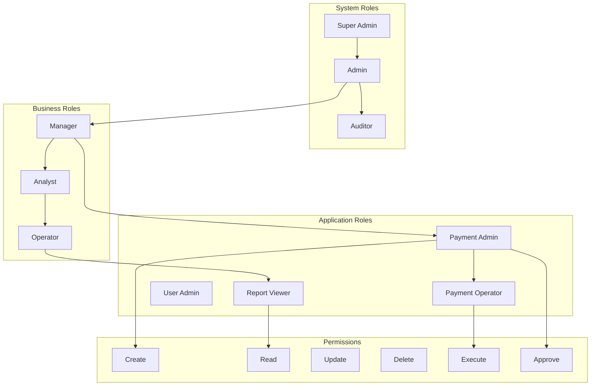

# RBAC & ABAC - INNOVABIZ IAM

## 📋 Informações do Documento

- **Autor**: Eduardo Jeremias
- **Data**: 09/01/2025
- **Versão**: 1.0.0
- **Módulo**: IAM Core
- **Classificação**: Crítico
- **Revisão**: Trimestral
- **Audiência**: Security Team, Arquitetos, Administradores

## 🎯 Visão Geral

Este documento detalha a implementação de controle de acesso baseado em papéis (RBAC) e atributos (ABAC) no módulo IAM da plataforma INNOVABIZ, fornecendo autorização granular e contextual alinhada com Zero Trust Architecture.

## 🔐 RBAC Implementation

### 1. Modelo de Papéis Hierárquico



### 2. RBAC Service Implementation

```typescript
// rbac.service.ts
import { Injectable } from '@nestjs/common';
import { InjectRepository } from '@nestjs/typeorm';
import { Repository } from 'typeorm';

@Injectable()
export class RBACService {
  constructor(
    @InjectRepository(Role) private roleRepository: Repository<Role>,
    @InjectRepository(Permission) private permissionRepository: Repository<Permission>,
    @InjectRepository(UserRole) private userRoleRepository: Repository<UserRole>
  ) {}

  /**
   * Create hierarchical role structure
   */
  async createRole(roleData: CreateRoleDto): Promise<Role> {
    const role = new Role();
    role.name = roleData.name;
    role.description = roleData.description;
    role.level = roleData.level;
    role.isSystem = roleData.isSystem || false;
    
    // Set parent role for hierarchy
    if (roleData.parentRoleId) {
      const parentRole = await this.roleRepository.findOne({
        where: { id: roleData.parentRoleId }
      });
      role.parent = parentRole;
    }

    // Attach permissions
    if (roleData.permissions) {
      const permissions = await this.permissionRepository.findByIds(
        roleData.permissions
      );
      role.permissions = permissions;
    }

    // Define constraints
    role.constraints = {
      maxSessionDuration: roleData.maxSessionDuration || 28800, // 8 hours
      requireMFA: roleData.requireMFA || false,
      allowedIPRanges: roleData.allowedIPRanges || [],
      allowedTimeRanges: roleData.allowedTimeRanges || [],
      geographicRestrictions: roleData.geographicRestrictions || []
    };

    await this.roleRepository.save(role);
    
    // Audit role creation
    await this.auditService.log({
      action: 'ROLE_CREATED',
      resource: `role:${role.id}`,
      details: { roleName: role.name },
      actor: this.currentUser.id
    });

    return role;
  }

  /**
   * Check user permissions with inheritance
   */
  async checkPermission(
    userId: string,
    resource: string,
    action: string
  ): Promise<boolean> {
    // Get user's roles including inherited ones
    const userRoles = await this.getUserRolesWithInheritance(userId);
    
    // Check each role's permissions
    for (const role of userRoles) {
      const hasPermission = await this.roleHasPermission(
        role.id,
        resource,
        action
      );
      
      if (hasPermission) {
        // Log successful authorization
        await this.auditService.log({
          action: 'PERMISSION_GRANTED',
          resource,
          details: { action, roleId: role.id },
          actor: userId
        });
        return true;
      }
    }

    // Log denied authorization
    await this.auditService.log({
      action: 'PERMISSION_DENIED',
      resource,
      details: { action },
      actor: userId
    });
    
    return false;
  }

  /**
   * Get effective permissions for user
   */
  async getEffectivePermissions(userId: string): Promise<Permission[]> {
    const userRoles = await this.getUserRolesWithInheritance(userId);
    const permissionSet = new Set<string>();
    const permissions: Permission[] = [];

    for (const role of userRoles) {
      const rolePermissions = await this.getRolePermissions(role.id);
      
      for (const permission of rolePermissions) {
        const key = `${permission.resource}:${permission.action}`;
        
        if (!permissionSet.has(key)) {
          permissionSet.add(key);
          permissions.push(permission);
        }
      }
    }

    return permissions;
  }

  /**
   * Role assignment with validation
   */
  async assignRole(
    userId: string,
    roleId: string,
    context: AssignmentContext
  ): Promise<UserRole> {
    // Validate role assignment
    await this.validateRoleAssignment(userId, roleId, context);
    
    // Check for conflicts
    const conflicts = await this.checkRoleConflicts(userId, roleId);
    if (conflicts.length > 0) {
      throw new Error(`Role conflicts detected: ${conflicts.join(', ')}`);
    }

    // Create assignment
    const assignment = new UserRole();
    assignment.userId = userId;
    assignment.roleId = roleId;
    assignment.assignedBy = context.assignedBy;
    assignment.assignedAt = new Date();
    assignment.expiresAt = context.expiresAt;
    assignment.conditions = context.conditions;
    
    await this.userRoleRepository.save(assignment);
    
    // Send notification
    await this.notificationService.send({
      userId,
      type: 'ROLE_ASSIGNED',
      data: { roleId, assignedBy: context.assignedBy }
    });

    return assignment;
  }

  /**
   * Dynamic role activation
   */
  async activateRole(
    userId: string,
    roleId: string,
    duration?: number
  ): Promise<RoleActivation> {
    const userRole = await this.userRoleRepository.findOne({
      where: { userId, roleId },
      relations: ['role']
    });

    if (!userRole) {
      throw new Error('Role not assigned to user');
    }

    // Check activation conditions
    const canActivate = await this.checkActivationConditions(
      userRole,
      this.currentContext
    );

    if (!canActivate) {
      throw new Error('Role activation conditions not met');
    }

    // Create activation session
    const activation = new RoleActivation();
    activation.userId = userId;
    activation.roleId = roleId;
    activation.activatedAt = new Date();
    activation.expiresAt = new Date(
      Date.now() + (duration || userRole.role.maxSessionDuration) * 1000
    );
    activation.sessionId = crypto.randomUUID();
    
    await this.activationRepository.save(activation);
    
    return activation;
  }
}
```

## 🎯 ABAC Implementation

### 3. Attribute-Based Policies

```typescript
// abac.service.ts
import { Injectable } from '@nestjs/common';
import { PolicyEngine } from './policy-engine';

@Injectable()
export class ABACService {
  private policyEngine: PolicyEngine;

  constructor() {
    this.policyEngine = new PolicyEngine();
    this.loadPolicies();
  }

  /**
   * Define ABAC policies
   */
  private async loadPolicies(): Promise<void> {
    const policies = [
      {
        id: 'payment-approval-policy',
        name: 'Payment Approval Policy',
        description: 'Controls who can approve payments based on amount and department',
        rules: `
          allow if {
            resource.type == "payment" and
            action == "approve" and
            subject.department == resource.department and
            (
              (resource.amount <= 1000 and subject.role contains "operator") or
              (resource.amount <= 10000 and subject.role contains "manager") or
              (resource.amount <= 100000 and subject.role contains "director") or
              (resource.amount > 100000 and subject.role contains "cfo")
            ) and
            subject.mfaVerified == true and
            time.hour >= 8 and time.hour <= 18
          }
        `
      },
      {
        id: 'data-classification-policy',
        name: 'Data Classification Access Policy',
        description: 'Controls access based on data sensitivity and user clearance',
        rules: `
          allow if {
            resource.classification in ["public", "internal"] or
            (resource.classification == "confidential" and subject.clearanceLevel >= 2) or
            (resource.classification == "secret" and subject.clearanceLevel >= 3) or
            (resource.classification == "top-secret" and 
             subject.clearanceLevel >= 4 and 
             subject.backgroundCheckValid == true and
             context.location.secure == true)
          }
        `
      },
      {
        id: 'geographic-restriction-policy',
        name: 'Geographic Access Policy',
        description: 'Restricts access based on geographic location',
        rules: `
          allow if {
            resource.geographicRestriction == "none" or
            (resource.geographicRestriction == "domestic" and 
             context.location.country == "BR") or
            (resource.geographicRestriction == "americas" and 
             context.location.continent == "Americas") or
            (resource.geographicRestriction == "approved" and 
             context.location.country in resource.approvedCountries)
          }
        `
      },
      {
        id: 'time-based-access-policy',
        name: 'Time-Based Access Policy',
        description: 'Controls access based on time constraints',
        rules: `
          allow if {
            (resource.accessSchedule == "always") or
            (resource.accessSchedule == "business-hours" and 
             time.weekday not in ["Saturday", "Sunday"] and
             time.hour >= 8 and time.hour <= 18) or
            (resource.accessSchedule == "maintenance-window" and 
             time.weekday == "Sunday" and
             time.hour >= 2 and time.hour <= 6) or
            (resource.temporaryAccess == true and 
             time.current >= resource.accessStart and
             time.current <= resource.accessEnd)
          }
        `
      },
      {
        id: 'delegation-policy',
        name: 'Permission Delegation Policy',
        description: 'Controls delegation of permissions',
        rules: `
          allow if {
            action == "delegate" and
            subject.canDelegate == true and
            resource.delegatable == true and
            delegatee.trustLevel >= resource.minTrustLevel and
            delegation.expiresIn <= subject.maxDelegationDuration and
            delegation.scope subset_of subject.permissions
          }
        `
      }
    ];

    for (const policy of policies) {
      await this.policyEngine.registerPolicy(policy);
    }
  }

  /**
   * Evaluate ABAC policies
   */
  async evaluate(request: AccessRequest): Promise<AccessDecision> {
    const context = await this.buildContext(request);
    
    // Evaluate all applicable policies
    const decisions = await this.policyEngine.evaluate({
      subject: {
        id: request.subject.id,
        roles: request.subject.roles,
        attributes: request.subject.attributes,
        department: request.subject.department,
        clearanceLevel: request.subject.clearanceLevel,
        mfaVerified: request.subject.mfaVerified,
        backgroundCheckValid: request.subject.backgroundCheckValid
      },
      resource: {
        id: request.resource.id,
        type: request.resource.type,
        owner: request.resource.owner,
        classification: request.resource.classification,
        department: request.resource.department,
        amount: request.resource.amount,
        tags: request.resource.tags,
        geographicRestriction: request.resource.geographicRestriction,
        accessSchedule: request.resource.accessSchedule
      },
      action: request.action,
      context: {
        time: {
          current: new Date(),
          hour: new Date().getHours(),
          weekday: this.getWeekday(),
          timestamp: Date.now()
        },
        location: {
          ip: context.ip,
          country: context.country,
          continent: context.continent,
          secure: context.secureLocation
        },
        session: {
          id: context.sessionId,
          age: context.sessionAge,
          authenticated: context.authenticated
        }
      }
    });

    // Combine decisions
    const decision = this.combineDecisions(decisions);
    
    // Apply obligations
    if (decision.allowed && decision.obligations) {
      await this.applyObligations(decision.obligations);
    }

    // Audit the decision
    await this.auditDecision(request, decision);
    
    return decision;
  }

  /**
   * Dynamic policy creation
   */
  async createDynamicPolicy(policyData: DynamicPolicyDto): Promise<Policy> {
    const policy = {
      id: crypto.randomUUID(),
      name: policyData.name,
      description: policyData.description,
      priority: policyData.priority || 100,
      enabled: true,
      conditions: [],
      effect: policyData.effect,
      obligations: policyData.obligations || []
    };

    // Build conditions
    for (const condition of policyData.conditions) {
      policy.conditions.push({
        attribute: condition.attribute,
        operator: condition.operator,
        value: condition.value,
        dataType: condition.dataType
      });
    }

    // Validate policy syntax
    const validation = await this.policyEngine.validatePolicy(policy);
    if (!validation.valid) {
      throw new Error(`Invalid policy: ${validation.errors.join(', ')}`);
    }

    // Register policy
    await this.policyEngine.registerPolicy(policy);
    
    // Store in database
    await this.policyRepository.save(policy);
    
    return policy;
  }
}
```

## 🔄 Policy Engine

### 4. Policy Evaluation Engine

```typescript
// policy-engine.ts
export class PolicyEngine {
  private policies: Map<string, Policy> = new Map();
  private cache: LRUCache<string, EvaluationResult>;

  constructor() {
    this.cache = new LRUCache<string, EvaluationResult>({
      max: 10000,
      ttl: 1000 * 60 * 5 // 5 minutes
    });
  }

  /**
   * Evaluate access request against policies
   */
  async evaluate(request: EvaluationRequest): Promise<EvaluationResult> {
    const cacheKey = this.generateCacheKey(request);
    
    // Check cache
    const cached = this.cache.get(cacheKey);
    if (cached) {
      return cached;
    }

    // Get applicable policies
    const applicablePolicies = await this.getApplicablePolicies(request);
    
    // Sort by priority
    applicablePolicies.sort((a, b) => b.priority - a.priority);
    
    let finalDecision: Decision = 'NotApplicable';
    const appliedPolicies: string[] = [];
    const obligations: Obligation[] = [];
    const advice: Advice[] = [];

    for (const policy of applicablePolicies) {
      const result = await this.evaluatePolicy(policy, request);
      
      if (result.decision !== 'NotApplicable') {
        appliedPolicies.push(policy.id);
        
        // Combine decisions based on algorithm
        finalDecision = this.combineDecisions(
          finalDecision,
          result.decision,
          policy.combiningAlgorithm
        );
        
        // Collect obligations and advice
        if (result.obligations) {
          obligations.push(...result.obligations);
        }
        if (result.advice) {
          advice.push(...result.advice);
        }
        
        // Early termination for deny-override
        if (finalDecision === 'Deny' && policy.combiningAlgorithm === 'DenyOverride') {
          break;
        }
      }
    }

    const result: EvaluationResult = {
      decision: finalDecision,
      allowed: finalDecision === 'Permit',
      appliedPolicies,
      obligations,
      advice,
      timestamp: new Date()
    };

    // Cache result
    this.cache.set(cacheKey, result);
    
    return result;
  }

  /**
   * Evaluate single policy
   */
  private async evaluatePolicy(
    policy: Policy,
    request: EvaluationRequest
  ): Promise<PolicyResult> {
    try {
      // Check target
      if (!this.matchTarget(policy.target, request)) {
        return { decision: 'NotApplicable' };
      }

      // Evaluate rules
      const ruleResults: RuleResult[] = [];
      
      for (const rule of policy.rules) {
        const ruleResult = await this.evaluateRule(rule, request);
        ruleResults.push(ruleResult);
      }

      // Combine rule results
      const decision = this.combineRuleResults(
        ruleResults,
        policy.ruleCombiningAlgorithm
      );

      return {
        decision,
        obligations: policy.obligations,
        advice: policy.advice
      };
    } catch (error) {
      return {
        decision: 'Indeterminate',
        error: error.message
      };
    }
  }

  /**
   * Evaluate rule conditions
   */
  private async evaluateRule(
    rule: Rule,
    request: EvaluationRequest
  ): Promise<RuleResult> {
    // Evaluate condition
    const conditionResult = await this.evaluateCondition(
      rule.condition,
      request
    );

    if (conditionResult) {
      return {
        decision: rule.effect === 'Permit' ? 'Permit' : 'Deny',
        ruleId: rule.id
      };
    }

    return { decision: 'NotApplicable', ruleId: rule.id };
  }

  /**
   * Complex condition evaluation
   */
  private async evaluateCondition(
    condition: Condition,
    request: EvaluationRequest
  ): Promise<boolean> {
    if (condition.type === 'composite') {
      const results = await Promise.all(
        condition.conditions.map(c => this.evaluateCondition(c, request))
      );

      switch (condition.operator) {
        case 'AND':
          return results.every(r => r === true);
        case 'OR':
          return results.some(r => r === true);
        case 'NOT':
          return !results[0];
        default:
          return false;
      }
    }

    // Simple condition
    const attributeValue = this.getAttributeValue(
      condition.attribute,
      request
    );

    return this.compareValues(
      attributeValue,
      condition.value,
      condition.operator
    );
  }
}
```

## 📊 Matriz de Permissões

### 5. Permission Matrix

| Papel | Recurso | Create | Read | Update | Delete | Execute | Approve |
|-------|---------|--------|------|--------|--------|---------|---------|
| Super Admin | All | ✅ | ✅ | ✅ | ✅ | ✅ | ✅ |
| Admin | Users | ✅ | ✅ | ✅ | ✅ | ❌ | ✅ |
| Admin | Payments | ❌ | ✅ | ❌ | ❌ | ❌ | ✅ |
| Manager | Reports | ✅ | ✅ | ✅ | ❌ | ✅ | ❌ |
| Operator | Transactions | ✅ | ✅ | ❌ | ❌ | ✅ | ❌ |
| Viewer | All | ❌ | ✅ | ❌ | ❌ | ❌ | ❌ |

## 🔒 Segregation of Duties

### 6. SoD Implementation

```typescript
// sod.service.ts
@Injectable()
export class SoDService {
  /**
   * Define conflicting roles
   */
  private readonly conflictingRoles = [
    ['payment_creator', 'payment_approver'],
    ['user_creator', 'user_auditor'],
    ['policy_creator', 'policy_approver'],
    ['transaction_initiator', 'transaction_validator']
  ];

  /**
   * Check for SoD violations
   */
  async checkSoDViolation(
    userId: string,
    newRoleId: string
  ): Promise<SoDViolation[]> {
    const violations: SoDViolation[] = [];
    const existingRoles = await this.getUserRoles(userId);
    const newRole = await this.getRole(newRoleId);

    for (const existingRole of existingRoles) {
      // Check direct conflicts
      if (this.hasConflict(existingRole.name, newRole.name)) {
        violations.push({
          type: 'ROLE_CONFLICT',
          existingRole: existingRole.name,
          newRole: newRole.name,
          severity: 'HIGH'
        });
      }

      // Check permission conflicts
      const permissionConflicts = await this.checkPermissionConflicts(
        existingRole,
        newRole
      );
      
      violations.push(...permissionConflicts);
    }

    // Check toxic combinations
    const toxicCombination = await this.checkToxicCombination(
      [...existingRoles, newRole]
    );
    
    if (toxicCombination) {
      violations.push(toxicCombination);
    }

    return violations;
  }
}
```

## 🚀 Roadmap RBAC/ABAC

### 7. Evolução 2025

#### Q1 2025
- ✅ RBAC Hierarchy
- ✅ Basic ABAC
- 🔄 Policy Engine
- 🔄 SoD Enforcement

#### Q2 2025
- 📅 Dynamic Roles
- 📅 Context-Aware Access
- 📅 Risk-Based Authorization
- 📅 Temporal Permissions

#### Q3 2025
- 📅 AI-Driven Policies
- 📅 Behavioral Authorization
- 📅 Zero-Trust Policies
- 📅 Distributed Authorization

#### Q4 2025
- 📅 Quantum-Safe Policies
- 📅 Self-Learning Access
- 📅 Predictive Authorization
- 📅 Autonomous Policy Management

---

**Mantido por**: IAM Security Team  
**Última Atualização**: 09/01/2025  
**Próxima Revisão**: 09/04/2025  
**Contato**: rbac-abac@innovabiz.com
