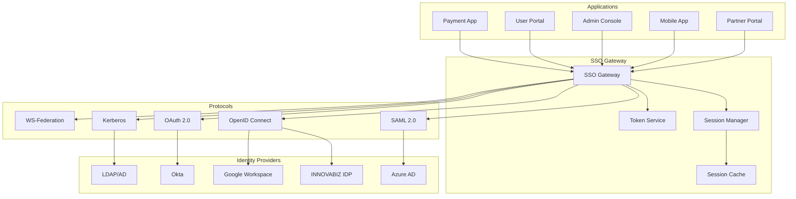

# SSO & Federação - INNOVABIZ IAM

## 📋 Informações do Documento

- **Autor**: Eduardo Jeremias
- **Data**: 09/01/2025
- **Versão**: 1.0.0
- **Módulo**: IAM Core
- **Classificação**: Técnico
- **Revisão**: Trimestral
- **Audiência**: Arquitetos, Desenvolvedores, Security Team

## 🎯 Visão Geral

Este documento detalha a implementação de Single Sign-On (SSO) e Federação de Identidades no módulo IAM da plataforma INNOVABIZ, permitindo autenticação unificada e integração com provedores de identidade externos.

## 🔐 Arquitetura SSO

### 1. SSO Architecture Overview



## 🔄 SSO Implementation

### 2. SSO Service Core

```typescript
// sso.service.ts
import { Injectable } from '@nestjs/common';
import * as saml from 'samlify';
import { JwtService } from '@nestjs/jwt';

@Injectable()
export class SSOService {
  private readonly ssoProviders = new Map<string, SSOProvider>();
  private readonly sessionStore = new Map<string, SSOSession>();

  constructor(
    private jwtService: JwtService,
    private cacheService: CacheService
  ) {
    this.initializeProviders();
  }

  /**
   * Initialize SSO providers
   */
  private async initializeProviders(): Promise<void> {
    // SAML Provider
    this.ssoProviders.set('saml', {
      type: 'SAML',
      serviceProvider: saml.ServiceProvider({
        entityID: 'https://iam.innovabiz.com',
        authnRequestsSigned: false,
        wantAssertionsSigned: true,
        wantMessageSigned: true,
        wantLogoutResponseSigned: true,
        wantLogoutRequestSigned: true,
        signatureAlgorithm: 'http://www.w3.org/2001/04/xmldsig-more#rsa-sha256',
        digestAlgorithm: 'http://www.w3.org/2001/04/xmlenc#sha256',
        requestIdExpirationPeriodMs: 3600000,
        clockDrifts: [-300000, 300000],
        privateKey: process.env.SAML_PRIVATE_KEY,
        privateKeyPass: process.env.SAML_PRIVATE_KEY_PASS,
        encPrivateKey: process.env.SAML_ENC_PRIVATE_KEY,
        assertionConsumerService: [{
          Binding: 'urn:oasis:names:tc:SAML:2.0:bindings:HTTP-POST',
          Location: 'https://iam.innovabiz.com/sso/saml/acs'
        }],
        singleLogoutService: [{
          Binding: 'urn:oasis:names:tc:SAML:2.0:bindings:HTTP-POST',
          Location: 'https://iam.innovabiz.com/sso/saml/sls'
        }]
      })
    });

    // OIDC Provider
    this.ssoProviders.set('oidc', {
      type: 'OIDC',
      config: {
        issuer: 'https://iam.innovabiz.com',
        client_id: process.env.OIDC_CLIENT_ID,
        client_secret: process.env.OIDC_CLIENT_SECRET,
        redirect_uri: 'https://iam.innovabiz.com/sso/oidc/callback',
        scope: 'openid profile email',
        response_type: 'code',
        grant_type: 'authorization_code'
      }
    });

    // OAuth2 Provider
    this.ssoProviders.set('oauth2', {
      type: 'OAuth2',
      config: {
        authorizationURL: 'https://oauth.provider.com/authorize',
        tokenURL: 'https://oauth.provider.com/token',
        clientID: process.env.OAUTH_CLIENT_ID,
        clientSecret: process.env.OAUTH_CLIENT_SECRET,
        callbackURL: 'https://iam.innovabiz.com/sso/oauth/callback',
        scope: ['read', 'write']
      }
    });
  }

  /**
   * Initiate SSO login
   */
  async initiateSSO(
    provider: string,
    application: string,
    returnUrl?: string
  ): Promise<SSOInitiationResponse> {
    const ssoProvider = this.ssoProviders.get(provider);
    
    if (!ssoProvider) {
      throw new Error(`SSO provider ${provider} not configured`);
    }

    const sessionId = crypto.randomUUID();
    const state = crypto.randomBytes(32).toString('hex');
    
    // Store SSO session
    const session: SSOSession = {
      id: sessionId,
      provider,
      application,
      state,
      returnUrl: returnUrl || '/',
      createdAt: new Date(),
      status: 'initiated'
    };
    
    await this.cacheService.set(
      `sso:session:${sessionId}`,
      session,
      300 // 5 minutes TTL
    );

    switch (ssoProvider.type) {
      case 'SAML':
        return this.initiateSAMLSSO(ssoProvider, session);
      case 'OIDC':
        return this.initiateOIDCSSO(ssoProvider, session);
      case 'OAuth2':
        return this.initiateOAuth2SSO(ssoProvider, session);
      default:
        throw new Error(`Unsupported SSO type: ${ssoProvider.type}`);
    }
  }

  /**
   * Handle SAML SSO
   */
  private async initiateSAMLSSO(
    provider: SSOProvider,
    session: SSOSession
  ): Promise<SSOInitiationResponse> {
    const idp = saml.IdentityProvider({
      entityID: 'https://idp.external.com',
      singleSignOnService: [{
        Binding: 'urn:oasis:names:tc:SAML:2.0:bindings:HTTP-Redirect',
        Location: 'https://idp.external.com/sso/saml'
      }],
      singleLogoutService: [{
        Binding: 'urn:oasis:names:tc:SAML:2.0:bindings:HTTP-Redirect',
        Location: 'https://idp.external.com/sso/saml/logout'
      }],
      wantAuthnRequestsSigned: false,
      isAssertionEncrypted: true,
      messageSigningOrder: 'encrypt-then-sign',
      signatureConfig: {
        prefix: 'ds',
        location: {
          reference: '/samlp:Response/saml:Issuer',
          action: 'after'
        }
      }
    });

    const { id, context } = provider.serviceProvider.createLoginRequest(
      idp,
      'redirect'
    );

    return {
      type: 'redirect',
      url: context,
      sessionId: session.id,
      requestId: id
    };
  }

  /**
   * Process SSO callback
   */
  async processSSOCallback(
    provider: string,
    params: any
  ): Promise<SSOCallbackResult> {
    const ssoProvider = this.ssoProviders.get(provider);
    
    if (!ssoProvider) {
      throw new Error(`SSO provider ${provider} not configured`);
    }

    let user: User;
    let attributes: UserAttributes;

    switch (ssoProvider.type) {
      case 'SAML':
        const samlResponse = await this.processSAMLResponse(params);
        user = await this.mapSAMLUser(samlResponse);
        attributes = samlResponse.attributes;
        break;
        
      case 'OIDC':
        const oidcTokens = await this.processOIDCCallback(params);
        user = await this.mapOIDCUser(oidcTokens);
        attributes = oidcTokens.claims;
        break;
        
      case 'OAuth2':
        const oauth2Tokens = await this.processOAuth2Callback(params);
        user = await this.mapOAuth2User(oauth2Tokens);
        attributes = oauth2Tokens.profile;
        break;
    }

    // Create or update user
    const localUser = await this.findOrCreateUser(user, provider);
    
    // Create SSO session
    const ssoToken = await this.createSSOToken(localUser, provider, attributes);
    
    // Store session
    await this.storeSSOSession(ssoToken, localUser);
    
    return {
      success: true,
      token: ssoToken,
      user: localUser,
      attributes
    };
  }

  /**
   * Create SSO token
   */
  private async createSSOToken(
    user: User,
    provider: string,
    attributes: any
  ): Promise<string> {
    const payload = {
      sub: user.id,
      email: user.email,
      name: user.name,
      provider,
      attributes,
      sessionId: crypto.randomUUID(),
      iat: Math.floor(Date.now() / 1000),
      exp: Math.floor(Date.now() / 1000) + 3600 // 1 hour
    };

    return this.jwtService.sign(payload, {
      algorithm: 'RS256'
    });
  }

  /**
   * Validate SSO session
   */
  async validateSSOSession(token: string): Promise<SSOValidationResult> {
    try {
      const payload = this.jwtService.verify(token);
      
      // Check if session exists in cache
      const session = await this.cacheService.get(
        `sso:token:${payload.sessionId}`
      );
      
      if (!session) {
        throw new Error('Session not found or expired');
      }

      // Validate with provider if needed
      if (session.requiresValidation) {
        const isValid = await this.validateWithProvider(
          session.provider,
          session.providerToken
        );
        
        if (!isValid) {
          throw new Error('Provider validation failed');
        }
      }

      return {
        valid: true,
        user: payload.sub,
        provider: payload.provider,
        attributes: payload.attributes,
        expiresAt: new Date(payload.exp * 1000)
      };
    } catch (error) {
      return {
        valid: false,
        error: error.message
      };
    }
  }

  /**
   * Single Logout (SLO)
   */
  async singleLogout(token: string): Promise<void> {
    const validation = await this.validateSSOSession(token);
    
    if (!validation.valid) {
      throw new Error('Invalid session');
    }

    // Get all sessions for user
    const userSessions = await this.getUserSessions(validation.user);
    
    // Logout from all applications
    const logoutPromises = userSessions.map(session => 
      this.logoutFromApplication(session)
    );
    
    await Promise.all(logoutPromises);
    
    // Logout from identity provider
    await this.logoutFromProvider(validation.provider, token);
    
    // Clear all sessions
    await this.clearUserSessions(validation.user);
  }
}
```

## 🌐 Federação de Identidades

### 3. Identity Federation Service

```typescript
// federation.service.ts
@Injectable()
export class FederationService {
  private federatedProviders: Map<string, FederatedProvider> = new Map();

  /**
   * Configure federated identity provider
   */
  async configureFederatedProvider(
    config: FederatedProviderConfig
  ): Promise<void> {
    const provider: FederatedProvider = {
      id: config.id,
      name: config.name,
      type: config.type,
      enabled: true,
      priority: config.priority || 100,
      
      metadata: {
        entityId: config.entityId,
        metadataUrl: config.metadataUrl,
        certificate: config.certificate,
        endpoints: config.endpoints
      },
      
      attributeMapping: {
        email: config.emailAttribute || 'email',
        name: config.nameAttribute || 'name',
        groups: config.groupsAttribute || 'groups',
        department: config.departmentAttribute || 'department',
        customAttributes: config.customAttributes || {}
      },
      
      trustConfiguration: {
        validateSignature: true,
        validateExpiry: true,
        maxClockSkew: 300, // 5 minutes
        trustedIssuers: config.trustedIssuers || [],
        audienceRestriction: config.audienceRestriction
      },
      
      authenticationContext: {
        minimumAuthLevel: config.minimumAuthLevel || 1,
        requiredAuthMethods: config.requiredAuthMethods || [],
        maxSessionDuration: config.maxSessionDuration || 28800 // 8 hours
      }
    };

    this.federatedProviders.set(config.id, provider);
    
    // Validate provider connectivity
    await this.validateProvider(provider);
    
    // Exchange metadata
    await this.exchangeMetadata(provider);
  }

  /**
   * Federated authentication flow
   */
  async federatedAuthentication(
    providerId: string,
    request: AuthenticationRequest
  ): Promise<FederatedAuthResponse> {
    const provider = this.federatedProviders.get(providerId);
    
    if (!provider || !provider.enabled) {
      throw new Error('Provider not available');
    }

    // Create federation request
    const federationRequest = await this.createFederationRequest(
      provider,
      request
    );

    // Send to provider
    const providerResponse = await this.sendToProvider(
      provider,
      federationRequest
    );

    // Validate response
    const validation = await this.validateProviderResponse(
      provider,
      providerResponse
    );

    if (!validation.valid) {
      throw new Error(`Federation failed: ${validation.error}`);
    }

    // Map federated identity to local identity
    const localIdentity = await this.mapFederatedIdentity(
      provider,
      providerResponse
    );

    // Apply authorization policies
    const authorization = await this.applyAuthorizationPolicies(
      localIdentity,
      provider
    );

    // Create federated session
    const session = await this.createFederatedSession(
      localIdentity,
      provider,
      authorization
    );

    return {
      success: true,
      sessionId: session.id,
      token: session.token,
      user: localIdentity,
      provider: provider.name,
      attributes: providerResponse.attributes,
      authorization
    };
  }

  /**
   * Cross-domain identity federation
   */
  async crossDomainFederation(
    domains: string[],
    user: User
  ): Promise<CrossDomainFederationResult> {
    const federationToken = crypto.randomUUID();
    const federationClaims = {
      sub: user.id,
      email: user.email,
      domains: domains,
      iat: Date.now(),
      exp: Date.now() + 300000 // 5 minutes
    };

    // Create federation tickets for each domain
    const tickets = await Promise.all(
      domains.map(domain => this.createFederationTicket(
        domain,
        user,
        federationClaims
      ))
    );

    // Store federation state
    await this.storeFederationState({
      token: federationToken,
      user: user.id,
      domains,
      tickets,
      createdAt: new Date()
    });

    return {
      federationToken,
      tickets,
      domains,
      expiresAt: new Date(federationClaims.exp)
    };
  }

  /**
   * Attribute aggregation from multiple providers
   */
  async aggregateAttributes(
    user: User,
    providers: string[]
  ): Promise<AggregatedAttributes> {
    const attributes: AggregatedAttributes = {
      core: {},
      extended: {},
      custom: {},
      sources: {}
    };

    for (const providerId of providers) {
      const provider = this.federatedProviders.get(providerId);
      
      if (!provider) continue;

      try {
        const providerAttributes = await this.fetchAttributesFromProvider(
          provider,
          user
        );

        // Merge attributes based on priority
        this.mergeAttributes(
          attributes,
          providerAttributes,
          provider.priority
        );

        // Track source
        attributes.sources[providerId] = {
          fetchedAt: new Date(),
          attributes: Object.keys(providerAttributes)
        };
      } catch (error) {
        this.logger.error(
          `Failed to fetch attributes from ${providerId}: ${error.message}`
        );
      }
    }

    // Apply attribute policies
    await this.applyAttributePolicies(attributes, user);

    return attributes;
  }
}
```

## 🔄 Trust Relationships

### 4. Trust Management

```typescript
// trust-management.service.ts
@Injectable()
export class TrustManagementService {
  /**
   * Establish trust relationship
   */
  async establishTrust(
    partner: TrustPartner
  ): Promise<TrustRelationship> {
    // Validate partner
    await this.validatePartner(partner);
    
    // Exchange certificates
    const certificates = await this.exchangeCertificates(partner);
    
    // Create trust agreement
    const agreement: TrustAgreement = {
      id: crypto.randomUUID(),
      partnerId: partner.id,
      establishedAt: new Date(),
      
      cryptographic: {
        signingCertificate: certificates.signing,
        encryptionCertificate: certificates.encryption,
        tlsCertificate: certificates.tls,
        algorithms: {
          signing: ['RS256', 'ES256'],
          encryption: ['RSA-OAEP', 'A256KW'],
          hashing: ['SHA256', 'SHA512']
        }
      },
      
      policies: {
        attributeRelease: partner.attributeReleasePolicy,
        consentRequired: partner.consentRequired,
        dataRetention: partner.dataRetentionDays,
        auditLogging: true
      },
      
      technical: {
        endpoints: partner.endpoints,
        protocols: partner.supportedProtocols,
        maxTokenLifetime: partner.maxTokenLifetime || 3600,
        requireEncryption: partner.requireEncryption || true
      },
      
      legal: {
        dataProcessingAgreement: partner.dpaUrl,
        privacyPolicy: partner.privacyPolicyUrl,
        jurisdiction: partner.jurisdiction,
        complianceFrameworks: partner.complianceFrameworks || []
      }
    };

    // Store trust relationship
    await this.trustRepository.save(agreement);
    
    // Configure technical integration
    await this.configureTechnicalIntegration(agreement);
    
    return {
      agreement,
      status: 'active',
      validUntil: new Date(Date.now() + 365 * 24 * 60 * 60 * 1000) // 1 year
    };
  }

  /**
   * Validate trust chain
   */
  async validateTrustChain(
    token: string,
    issuer: string
  ): Promise<TrustValidation> {
    const trustPath = await this.findTrustPath(issuer);
    
    if (!trustPath) {
      return {
        valid: false,
        reason: 'No trust path found'
      };
    }

    // Validate each hop in trust chain
    for (const hop of trustPath) {
      const validation = await this.validateHop(hop, token);
      
      if (!validation.valid) {
        return {
          valid: false,
          reason: `Trust chain broken at ${hop.id}: ${validation.reason}`
        };
      }
    }

    return {
      valid: true,
      trustPath,
      trustLevel: this.calculateTrustLevel(trustPath)
    };
  }
}
```

## 🚀 Roadmap SSO & Federação

### 5. Evolução 2025

#### Q1 2025
- ✅ SAML 2.0 SSO
- ✅ OIDC Federation
- 🔄 Multi-Provider SSO
- 🔄 Attribute Aggregation

#### Q2 2025
- 📅 Passwordless SSO
- 📅 Blockchain Federation
- 📅 Decentralized Identity
- 📅 Zero-Knowledge SSO

#### Q3 2025
- 📅 AI-Powered Federation
- 📅 Adaptive Authentication
- 📅 Cross-Cloud Federation
- 📅 Identity Fabric

#### Q4 2025
- 📅 Quantum-Safe Federation
- 📅 Neural Authentication
- 📅 Universal Identity
- 📅 Self-Sovereign SSO

---

**Mantido por**: IAM Team  
**Última Atualização**: 09/01/2025  
**Próxima Revisão**: 09/04/2025  
**Contato**: sso-federation@innovabiz.com
