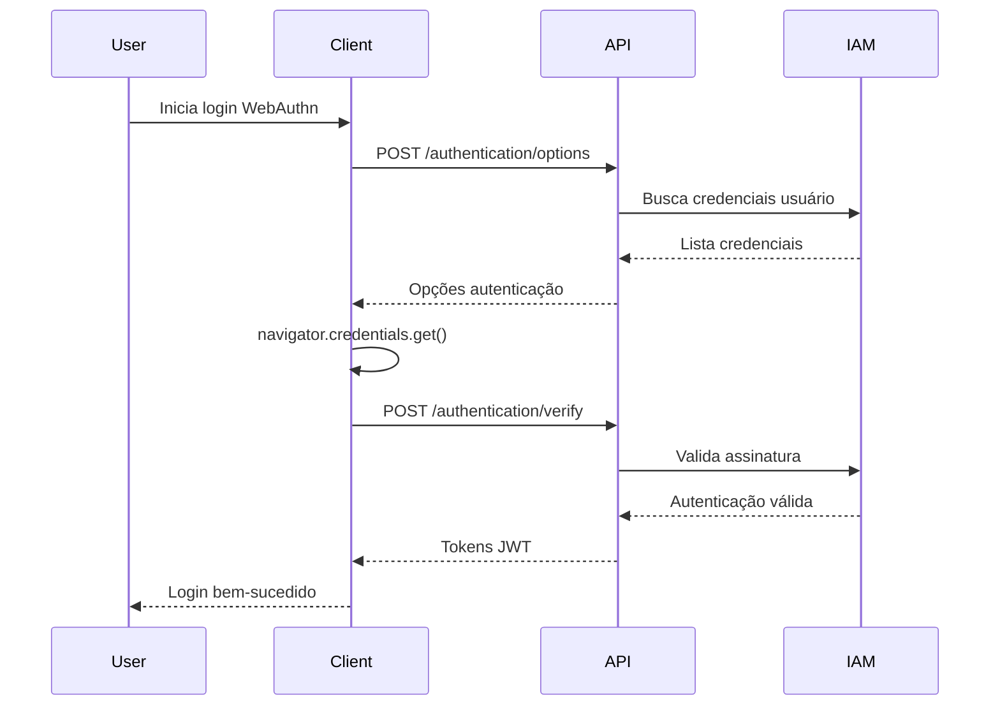
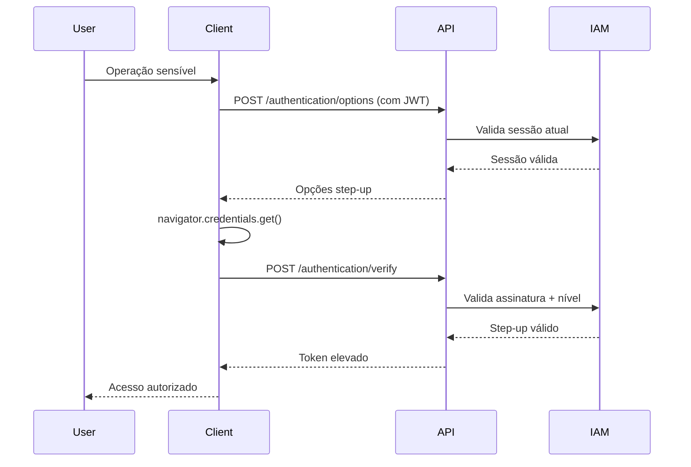

# 🔓 API de Autenticação WebAuthn/FIDO2
# INNOVABIZ IAM

```yaml
version: 1.0.0
date: 31/07/2025
status: Em desenvolvimento
classification: Confidencial - Interno
```

## 📑 Visão Geral

API para autenticação usando credenciais WebAuthn/FIDO2 previamente registradas. Implementa os padrões W3C WebAuthn Level 3 para autenticação sem senha resistente a phishing, suportando tanto autenticação primária quanto como segundo fator.

### 🎯 Objetivos

- Autenticação segura sem senhas
- Suporte autenticação primária e MFA
- Validação criptográfica de asserções
- Detecção de clonagem de credenciais
- Performance otimizada para milhões de usuários

## 🏛️ Conformidade

### Padrões Aplicados

```yaml
standards:
  - name: "W3C WebAuthn Level 3"
    version: "Julho 2024"
    aspects: ["PublicKeyCredential.get()", "Assertion verification"]
  
  - name: "FIDO2 CTAP2.1"
    version: "Junho 2023"
    aspects: ["User presence", "User verification"]
    
  - name: "NIST SP 800-63B"
    version: "Rev. 4, 2024"
    aspects: ["AAL2/AAL3 authentication", "Replay protection"]
```

### Compliance Regulatório

| Regulação | Região | Implementação |
|-----------|--------|---------------|
| PSD2 | UE | Strong Customer Authentication |
| NIST SP 800-63B | EUA | Multi-factor authentication |
| LGPD/GDPR | BR/EU | Privacy-preserving authentication |
| PCI DSS | Global | Strong authentication para pagamentos |

## 🔌 Especificação Técnica

### Informações Gerais

```yaml
api_info:
  base_path: "/api/v1/auth/webauthn/authentication"
  authentication: "Opcional (para autenticação primária)"
  rate_limiting: "10 tentativas/IP/minuto"
  protocols: ["https"]
```

### Ambientes

| Ambiente | URL | Disponibilidade |
|----------|-----|----------------|
| Produção | https://iam.innovabiz.com | 99.99% |
| Homologação | https://iam-staging.innovabiz.com | 99.5% |
| Desenvolvimento | https://iam-dev.innovabiz.com | Horário comercial |

### Segurança

```yaml
security:
  authentication: "Opcional para login primário, JWT para step-up"
  authorization: "Context-based"
  scopes:
    - "webauthn:authenticate"
    - "auth:primary" (para login primário)
  protection:
    - "Rate limiting por IP e usuário"
    - "Replay attack protection"
    - "Sign count verification"
    - "Origin validation"
```

### Headers Obrigatórios

| Header | Descrição | Exemplo |
|--------|-----------|---------|
| `X-Correlation-ID` | Rastreamento | `uuid-v4` |
| `X-Tenant-ID` | Identificador tenant | `acme-corp` |
| `X-Region-Code` | Código região | `BR-SP` |
| `Content-Type` | Tipo conteúdo | `application/json` |
| `Authorization` | JWT (apenas step-up) | `Bearer eyJhbGci...` |

## 🛣️ Endpoints

### 1. Gerar Opções de Autenticação

#### `POST /api/v1/auth/webauthn/authentication/options`

Gera opções para `navigator.credentials.get()`.

**Requisição (Login Primário):**
```json
{
  "username": "joao.silva@empresa.com",
  "userVerification": "preferred"
}
```

**Requisição (Step-up Authentication):**
```json
{
  "userVerification": "required",
  "allowCredentials": [
    "AQIDBAUGBwgJCgsMDQ4PEBESExQVFhcYGRobHB0eHyAhIiMkJSYnKCkqKywtLi8w"
  ]
}
```

**Resposta (200 OK):**
```json
{
  "challenge": "Y2hhbGxlbmdlLWZyb20tc2VydmVy",
  "timeout": 60000,
  "rpId": "innovabiz.com",
  "allowCredentials": [
    {
      "type": "public-key",
      "id": "AQIDBAUGBwgJCgsMDQ4PEBESExQVFhcYGRobHB0eHyAhIiMkJSYnKCkqKywtLi8w",
      "transports": ["internal", "hybrid"]
    }
  ],
  "userVerification": "preferred",
  "extensions": {
    "appid": "https://legacy.innovabiz.com"
  }
}
```

### 2. Verificar Autenticação

#### `POST /api/v1/auth/webauthn/authentication/verify`

Processa resposta de `navigator.credentials.get()`.

**Requisição:**
```json
{
  "id": "AQIDBAUGBwgJCgsMDQ4PEBESExQVFhcYGRobHB0eHyAhIiMkJSYnKCkqKywtLi8w",
  "rawId": "AQIDBAUGBwgJCgsMDQ4PEBESExQVFhcYGRobHB0eHyAhIiMkJSYnKCkqKywtLi8w",
  "type": "public-key",
  "response": {
    "clientDataJSON": "eyJ0eXBlIjoid2ViYXV0aG4uZ2V0Ii...",
    "authenticatorData": "SZYN5YgOjGh0NBcPZHZgW4_krrmihjLHmVzzuoMdl2NFAAAAAQ",
    "signature": "MEUCIQDTGOLbdFhkpf7Y2QjgEkSTMELzpy..."
  }
}
```

**Resposta Login Primário (200 OK):**
```json
{
  "accessToken": "eyJhbGciOiJSUzI1NiIsInR5cCI6IkpXVCJ9...",
  "refreshToken": "eyJhbGciOiJSUzI1NiIsInR5cCI6IkpXVCJ9...",
  "tokenType": "Bearer",
  "expiresIn": 3600,
  "user": {
    "id": "user-uuid",
    "email": "joao.silva@empresa.com",
    "displayName": "João Silva",
    "tenantId": "acme-corp"
  },
  "authenticationMethod": "webauthn",
  "authenticationLevel": "AAL2",
  "credentialUsed": {
    "id": "AQIDBAUGBwgJCgsMDQ4PEBESExQVFhcYGRobHB0eHyAhIiMkJSYnKCkqKywtLi8w",
    "displayName": "iPhone TouchID",
    "lastUsed": "2025-07-31T19:13:42Z"
  }
}
```

**Resposta Step-up (200 OK):**
```json
{
  "stepUpToken": "eyJhbGciOiJSUzI1NiIsInR5cCI6IkpXVCJ9...",
  "authenticationLevel": "AAL3",
  "validUntil": "2025-07-31T20:13:42Z",
  "credentialUsed": {
    "id": "AQIDBAUGBwgJCgsMDQ4PEBESExQVFhcYGRobHB0eHyAhIiMkJSYnKCkqKywtLi8w",
    "displayName": "YubiKey 5 NFC"
  }
}
```

### 3. Autenticação Sem Nome de Usuário

#### `POST /api/v1/auth/webauthn/authentication/usernameless`

Autenticação usando credenciais residentes (discoverable credentials).

**Requisição:**
```json
{
  "userVerification": "required"
}
```

**Resposta (200 OK):**
```json
{
  "challenge": "Y2hhbGxlbmdlLWZyb20tc2VydmVy",
  "timeout": 60000,
  "rpId": "innovabiz.com",
  "userVerification": "required",
  "allowCredentials": []
}
```

## 🚨 Tratamento de Erros

### Formato Padrão

```json
{
  "error": {
    "code": "WEBAUTHN_AUTHENTICATION_FAILED",
    "message": "Falha na autenticação WebAuthn",
    "target": "signature",
    "details": [
      {
        "code": "INVALID_SIGNATURE",
        "message": "Assinatura inválida",
        "target": "response.signature"
      }
    ]
  },
  "correlation_id": "uuid-v4",
  "timestamp": "2025-07-31T19:13:42Z"
}
```

### Códigos de Erro

| Status | Código | Descrição | Ação |
|--------|--------|-----------|------|
| 400 | `INVALID_AUTHENTICATION_REQUEST` | Dados inválidos | Verificar formato |
| 400 | `INVALID_SIGNATURE` | Assinatura inválida | Tentar novamente |
| 400 | `SIGN_COUNT_ERROR` | Contador assinatura inválido | Credencial comprometida |
| 404 | `CREDENTIAL_NOT_FOUND` | Credencial não encontrada | Verificar ID credencial |
| 404 | `USER_NOT_FOUND` | Usuário não encontrado | Verificar username |
| 429 | `AUTHENTICATION_RATE_LIMIT_EXCEEDED` | Limite excedido | Aguardar |

## 🔄 Fluxos de Autenticação

### Login Primário



### Step-up Authentication



## 🧪 Testes

### Cenários de Teste

| Cenário | Descrição | Resultado Esperado |
|---------|-----------|-------------------|
| Login Sucesso | Credencial válida | 200 OK + tokens |
| Assinatura Inválida | Signature corrompida | 400 Bad Request |
| Credencial Inexistente | ID não encontrado | 404 Not Found |
| Sign Count Baixo | Possível clonagem | 400 + alerta segurança |
| Rate Limit | Excesso tentativas | 429 Too Many Requests |

### Ambiente Sandbox

```yaml
sandbox:
  url: "https://iam-sandbox.innovabiz.com"
  test_credentials:
    - username: "test@innovabiz.com"
      credential_id: "test-credential-123"
  limitations:
    - "Apenas credenciais de teste"
    - "Tokens expiram em 1 hora"
```

## 📊 Observabilidade

### Métricas

| Métrica | Descrição | Relevância |
|---------|-----------|-----------|
| `webauthn_authentication_attempts_total` | Total tentativas | Volume operacional |
| `webauthn_authentication_success_rate` | Taxa sucesso | Qualidade serviço |
| `webauthn_authentication_duration` | Tempo verificação | Performance |
| `webauthn_sign_count_errors_total` | Erros contador | Segurança |

### Logs

| Evento | Nível | Dados |
|--------|-------|-------|
| `WEBAUTHN_AUTH_STARTED` | INFO | userId, credentialId, userAgent |
| `WEBAUTHN_AUTH_SUCCESS` | INFO | authLevel, method, duration |
| `WEBAUTHN_AUTH_FAILED` | WARN | errorCode, reason, ipAddress |
| `WEBAUTHN_SIGN_COUNT_ERROR` | ERROR | credentialId, expected, actual |

### Alertas

| Alerta | Condição | Ação |
|--------|----------|------|
| `HighAuthFailureRate` | Taxa falha > 15% | Investigar problemas |
| `SignCountAnomalies` | Múltiplos erros contador | Alerta segurança |
| `AuthenticationLatencyHigh` | Latência > 3s | Otimizar verificação |

## 🔄 Integrações

### Dependências

| Serviço | Propósito | Criticidade |
|---------|-----------|-------------|
| IAM Core | Gestão usuários | Alta |
| Credential Store | Armazenamento credenciais | Alta |
| Session Manager | Gestão sessões | Alta |
| Risk Engine | Avaliação risco | Média |

### Eventos Produzidos

| Evento | Tópico | Consumidores |
|--------|--------|--------------|
| `UserAuthenticated` | `iam.auth.events` | Session, Audit, Analytics |
| `AuthenticationFailed` | `iam.auth.events` | Security, Risk, Monitoring |
| `StepUpCompleted` | `iam.auth.events` | Audit, Compliance |

---

*Preparado pela Equipe de Segurança INNOVABIZ | Última Atualização: 31/07/2025*