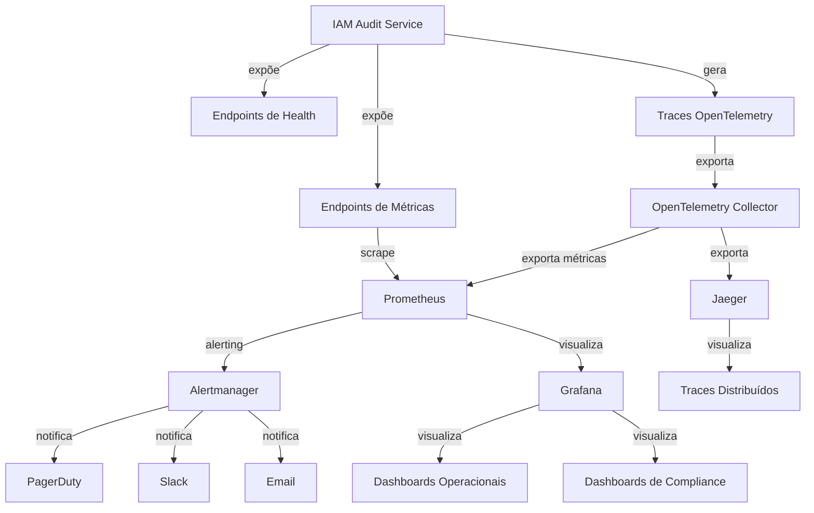
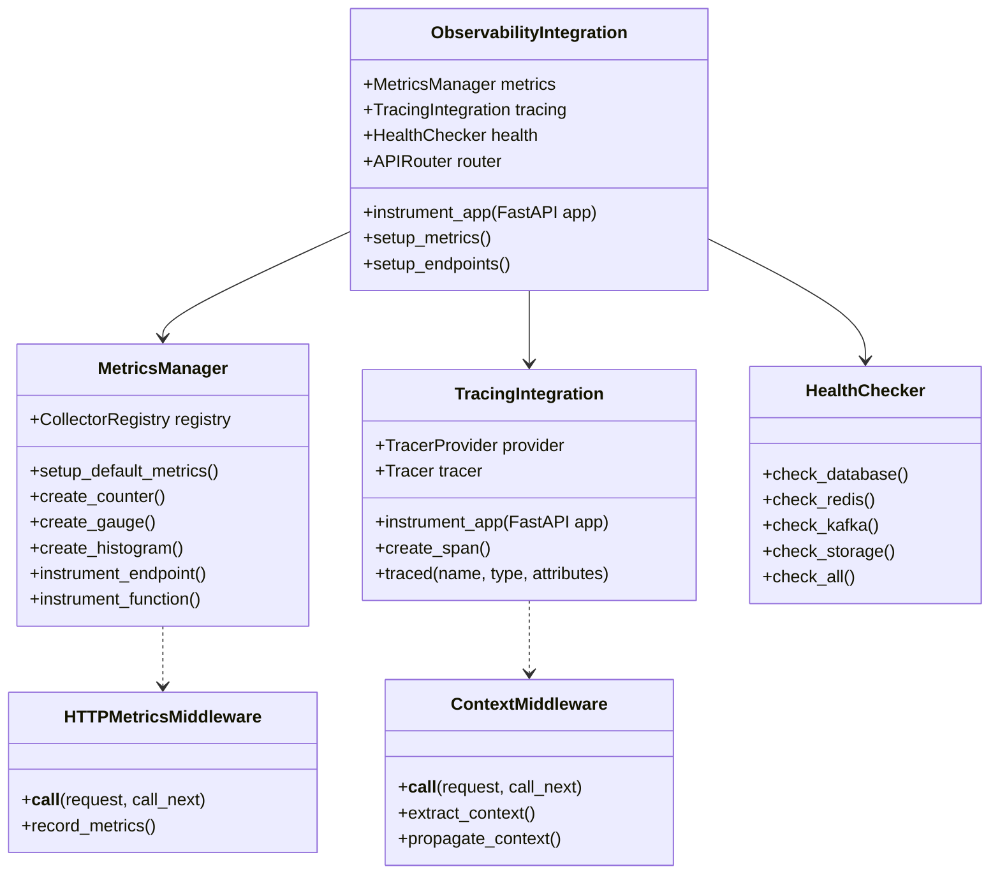

# Plano de Implementação - Observabilidade IAM Audit Service

## Visão Geral

Este documento apresenta o plano detalhado para implementação da arquitetura de observabilidade do IAM Audit Service, integrando todos os componentes definidos nos ADRs e garantindo conformidade com os padrões INNOVABIZ e requisitos regulatórios.

## Objetivos

- Implementar observabilidade completa para o IAM Audit Service
- Garantir suporte a contextos multi-tenant e multi-regional
- Integrar métricas, health checks, alertas e rastreamento distribuído
- Estabelecer dashboards operacionais e de compliance
- Automatizar detecção e notificação de anomalias
- Atender requisitos de conformidade regulatória

## Componentes da Arquitetura

A arquitetura de observabilidade consiste nos seguintes componentes principais:

1. **Base de Dados TimescaleDB** (ADR-001)
   - Armazenamento eficiente para eventos de auditoria com suporte a time-series
   - Isolamento multi-tenant com row-level security
   - Políticas de retenção automatizadas

2. **Framework de Métricas Prometheus** (ADR-002, ADR-004)
   - Coleta e exposição padronizada de métricas
   - Categorização e nomeação consistente
   - Suporte a múltiplos contextos via labels

3. **Decoradores e Middleware** (ADR-005)
   - Instrumentação automática de endpoints e funções
   - Propagação de contexto
   - Medição de latência e contagem de operações

4. **Health Checks e Diagnósticos** (ADR-006)
   - Endpoints para verificação de saúde e prontidão
   - Diagnósticos detalhados com segurança
   - Instrumentação automática para métricas de saúde

5. **Alertas e Dashboards** (ADR-007)
   - Regras de alerta por categoria e severidade
   - Dashboards Grafana para diferentes stakeholders
   - Notificações multi-canal e inteligentes

6. **Rastreamento Distribuído** (ADR-008)
   - Integração com OpenTelemetry
   - Visualização de fluxos end-to-end
   - Correlação entre serviços e operações

7. **Arquitetura Multi-Contexto** (ADR-003)
   - Suporte a multi-tenant e multi-região
   - Propagação de contexto entre serviços
   - Isolamento de métricas e traces por tenant

## Fases de Implementação

### Fase 1: Fundação (Sprint 1-2)

**Objetivo**: Estabelecer a infraestrutura base e implementar instrumentação fundamental.

#### Atividades:

1. **Configuração da Infraestrutura**
   - Implantar PostgreSQL com TimescaleDB
   - Configurar Prometheus, Alertmanager e Grafana
   - Configurar OpenTelemetry Collector e Jaeger
   - Estabelecer ambientes de desenvolvimento e testes

2. **Implementação de Classes Core**
   - Desenvolver `ObservabilityIntegration` como ponto central
   - Implementar `MetricsManager` para gerenciamento de métricas
   - Criar `HealthChecker` para verificações de dependências
   - Desenvolver `TracingIntegration` para OpenTelemetry

3. **Integração com FastAPI**
   - Implementar middleware para métricas HTTP
   - Configurar middleware para propagação de contexto
   - Adicionar endpoints básicos (/metrics, /health)
   - Implementar decoradores básicos para instrumentação

#### Entregáveis:

- Infraestrutura de observabilidade operacional
- Framework de observabilidade básico integrado ao FastAPI
- Endpoints de métricas e health expostos
- Primeiros dashboards básicos no Grafana

### Fase 2: Instrumentação Completa (Sprint 3-4)

**Objetivo**: Expandir a instrumentação para cobrir todos os fluxos principais do serviço.

#### Atividades:

1. **Instrumentação do Processamento de Eventos**
   - Adicionar métricas para contagem e latência de processamento
   - Implementar spans de rastreamento para cada etapa
   - Criar decorador específico para eventos de auditoria
   - Instrumentar validações e transformações

2. **Instrumentação de Verificações de Compliance**
   - Métricas para execução de verificações
   - Contadores para violações por tipo e severidade
   - Spans de rastreamento para cada regra aplicada
   - Decoradores específicos para verificações de compliance

3. **Instrumentação de Políticas de Retenção**
   - Métricas para execuções de políticas de retenção
   - Medição de registros expurgados e tempo de execução
   - Rastreamento detalhado do processo de retenção
   - Alertas para falhas em políticas críticas

4. **Instrumentação de Dependências Externas**
   - Métricas para chamadas a serviços dependentes
   - Health checks para todas as dependências críticas
   - Propagação de contexto de rastreamento para serviços externos
   - Circuit breakers e timeouts monitorados

#### Entregáveis:

- Instrumentação completa de todos os fluxos principais
- Métricas detalhadas para cada componente funcional
- Traces para todos os fluxos críticos
- Relatório de cobertura de instrumentação

### Fase 3: Dashboards e Alertas (Sprint 5-6)

**Objetivo**: Implementar visualizações e alertas avançados.

#### Atividades:

1. **Dashboards Operacionais**
   - Dashboard principal com visão geral do serviço
   - Painéis específicos para performance e disponibilidade
   - Visualizações para métricas de negócio
   - Filtros por tenant, região e ambiente

2. **Dashboards de Compliance**
   - Visão específica para compliance e auditoria
   - Painéis para políticas de retenção
   - Visualizações de violações e anomalias
   - Relatórios automatizados para auditoria

3. **Configuração de Alertas**
   - Implementar regras de alerta por categoria
   - Configurar diferentes canais de notificação
   - Estabelecer thresholds baseados em baseline
   - Configurar alertas específicos por tenant crítico

4. **Integração com Sistema de Gestão de Incidentes**
   - Conectar alertas ao PagerDuty/OpsGenie
   - Configurar escalation policies
   - Implementar runbooks para cada tipo de alerta
   - Testar fluxo completo de incidentes

#### Entregáveis:

- Conjunto completo de dashboards Grafana
- Sistema de alertas configurado e testado
- Integração com sistema de gestão de incidentes
- Documentação de runbooks para resposta a incidentes

### Fase 4: Multi-Contexto e Otimização (Sprint 7-8)

**Objetivo**: Garantir suporte completo para multi-tenant e otimizar a solução.

#### Atividades:

1. **Refinamento Multi-Tenant**
   - Testar isolamento completo de métricas por tenant
   - Implementar filtros contextuais em dashboards
   - Otimizar políticas de row-level security
   - Validar propagação de contexto em todo o sistema

2. **Refinamento Multi-Regional**
   - Configurar agregação de métricas cross-region
   - Estabelecer dashboards com visão global e regional
   - Implementar alertas específicos por região
   - Validar latência e impacto cross-region

3. **Otimização de Performance**
   - Ajustar sampling de traces para equilibrar detalhe e overhead
   - Otimizar retenção e compressão de métricas
   - Ajustar intervalos de scrape do Prometheus
   - Implementar agregação eficiente de métricas

4. **Refinamento de Alertas**
   - Reduzir falsos positivos com alertas inteligentes
   - Implementar correlação de alertas
   - Ajustar thresholds baseados em padrões de uso
   - Configurar silenciamento para manutenções planejadas

#### Entregáveis:

- Sistema de observabilidade otimizado para multi-tenant/região
- Relatório de performance e overhead
- Configurações refinadas de alertas
- Documentação de operação multi-contexto

### Fase 5: Conformidade e Documentação (Sprint 9-10)

**Objetivo**: Garantir conformidade regulatória e completar documentação.

#### Atividades:

1. **Validação de Conformidade**
   - Verificar cobertura de requisitos PCI DSS 4.0
   - Validar atendimento a GDPR/LGPD
   - Testar fluxos de auditoria completos
   - Verificar logs para investigações forenses

2. **Documentação Técnica**
   - Documentação completa da arquitetura implementada
   - Guias de operação e troubleshooting
   - Documentação de deployment e configuração
   - Exemplos e tutoriais para desenvolvedores

3. **Documentação para Stakeholders**
   - Guias para equipes de segurança e compliance
   - Documentação para auditores externos
   - Materiais de treinamento para operações
   - Visão executiva para gestores

4. **Testes de Validação Final**
   - Simulação de incidentes e validação de alertas
   - Verificação de retenção e performance sob carga
   - Validação de isolamento multi-tenant
   - Testes de recuperação e resiliência

#### Entregáveis:

- Relatório de conformidade com requisitos regulatórios
- Documentação técnica completa
- Documentação para stakeholders
- Relatório final de testes de validação

## Infraestrutura e Componentes Técnicos

### Infraestrutura

### Componentes de Software

## Integrações e Dependências

### Dependências Internas

- **IAM Core Service**: Integração para validação de identidade e autorizações
- **Compliance Service**: Fonte de regras de compliance e verificações
- **Notification Service**: Recebe notificações de eventos críticos
- **Storage Service**: Armazenamento de backups antes de expurgos

### Dependências Externas

- **PostgreSQL com TimescaleDB**: Armazenamento principal de eventos
- **Redis**: Cache para regras e configurações
- **Kafka**: Stream de eventos de auditoria
- **Prometheus**: Coleta e armazenamento de métricas
- **Grafana**: Visualização e dashboards
- **Jaeger**: Visualização de traces distribuídos
- **PagerDuty/OpsGenie**: Gestão de incidentes e alertas

## Padrões Técnicos

### Padrões de Código

- **Padrão de Decorador**: Para instrumentação automática de funções
- **Padrão de Middleware**: Para processamento de requisições HTTP
- **Factory Pattern**: Para criação de métricas e spans
- **Strategy Pattern**: Para verificações de health adaptáveis
- **Adapter Pattern**: Para integrações com diferentes backends

### Padrões de Observabilidade

- **Padrão RED**: Rate, Errors, Duration para endpoints HTTP
- **Padrão USE**: Utilization, Saturation, Errors para recursos
- **Padrão de Multi-dimensionalidade**: Labels para contexto
- **Padrão de Health Check**: Liveness, Readiness, Deep Health
- **Padrão de Circuit Breaker**: Para resiliência de dependências

## Considerações de Multi-Contexto

### Multi-Tenant

- **Isolamento de Dados**: Row-level security no PostgreSQL
- **Isolamento de Métricas**: Labels de tenant em todas as métricas
- **Isolamento de Traces**: Atributo de tenant em todos os spans
- **Dashboards**: Filtros por tenant
- **Alertas**: Configurações específicas por tenant crítico

### Multi-Regional

- **Isolamento Regional**: Dados segregados por região
- **Métricas por Região**: Label de região em todas as métricas
- **Traces Regionais**: Atributo de região em todos os spans
- **Dashboards Regionais**: Visões específicas por região
- **Alertas Regionais**: Configurações adaptadas por região

## Testes

### Testes Unitários

- Testes para cada componente do framework de observabilidade
- Mocks para dependências externas
- Validação de instrumentação automática
- Testes de configuração e inicialização

### Testes de Integração

- Testes com aplicação FastAPI completa
- Verificação de endpoints de métricas e health
- Validação de coleta de métricas pelo Prometheus
- Testes de propagação de contexto entre serviços

### Testes de Performance

- Benchmark de overhead de instrumentação
- Testes de carga com instrumentação ativa
- Validação de impacto de sampling de traces
- Medição de latência adicional

### Testes de Conformidade

- Verificação de requisitos PCI DSS para logging
- Validação de GDPR para controle de acesso a dados
- Testes de isolamento multi-tenant
- Verificação de políticas de retenção

## Riscos e Mitigações

| Risco | Probabilidade | Impacto | Mitigação |
|-------|--------------|---------|-----------|
| Overhead excessivo de instrumentação | Média | Alto | Implementar sampling estratégico e benchmark contínuo |
| Falha na propagação de contexto | Média | Alto | Testes extensivos e monitoramento específico |
| Volume excessivo de dados de telemetria | Alta | Médio | Configurar retenção adequada e sampling inteligente |
| Falsos positivos em alertas | Alta | Médio | Calibrar cuidadosamente thresholds e implementar silenciamento |
| Falta de isolamento multi-tenant | Baixa | Crítico | Testes rigorosos de isolamento e auditorias periódicas |

## Governança e Evolução

### Métricas de Sucesso

- **Cobertura de Instrumentação**: >95% dos endpoints e operações críticas
- **Tempo de Detecção de Incidentes**: <5 minutos para problemas críticos
- **Taxa de Falsos Positivos**: <10% dos alertas disparados
- **Overhead de Instrumentação**: <5% de impacto em latência
- **Satisfação de Stakeholders**: Avaliação positiva de equipes de operação e compliance

### Revisão e Melhoria Contínua

- Revisão semanal de alertas e incidentes
- Análise mensal de overhead e performance
- Feedback trimestral de stakeholders
- Atualizações de requisitos regulatórios
- Incorporação de novos padrões da plataforma

## Roadmap Futuro

### Curto Prazo (3-6 meses)

- Integração com ML para detecção de anomalias
- Expansão de dashboards para casos de uso específicos
- Refinamento de políticas de sampling baseadas em dados reais
- Automação de testes de observabilidade

### Médio Prazo (6-12 meses)

- Implementação de correlação avançada de eventos
- Expansão para observabilidade de business metrics
- Integração com sistema central de observabilidade da plataforma
- Automação de troubleshooting para problemas comuns

### Longo Prazo (1+ ano)

- Observabilidade preditiva com machine learning
- Self-healing baseado em métricas e anomalias
- Extensão do framework para outros serviços
- Integração com FinOps para otimização de custos

## Conclusão

Este plano estabelece uma abordagem estruturada para implementação da arquitetura de observabilidade do IAM Audit Service, com foco em fases incrementais que entregam valor contínuo. A arquitetura proposta atende aos requisitos de operação, compliance e multi-contexto, fornecendo uma base sólida para monitoramento, diagnóstico e resolução de problemas.

A implementação seguirá os princípios e decisões estabelecidos nos ADRs, garantindo consistência e alinhamento com os padrões da plataforma INNOVABIZ.

---

## Aprovações

| Nome | Cargo | Data | Assinatura |
|------|-------|------|------------|
| | Arquiteto Chefe | | |
| | Gerente de Produto | | |
| | Líder de Compliance | | |
| | Líder de Operações | | |
| | Líder de Segurança | | |