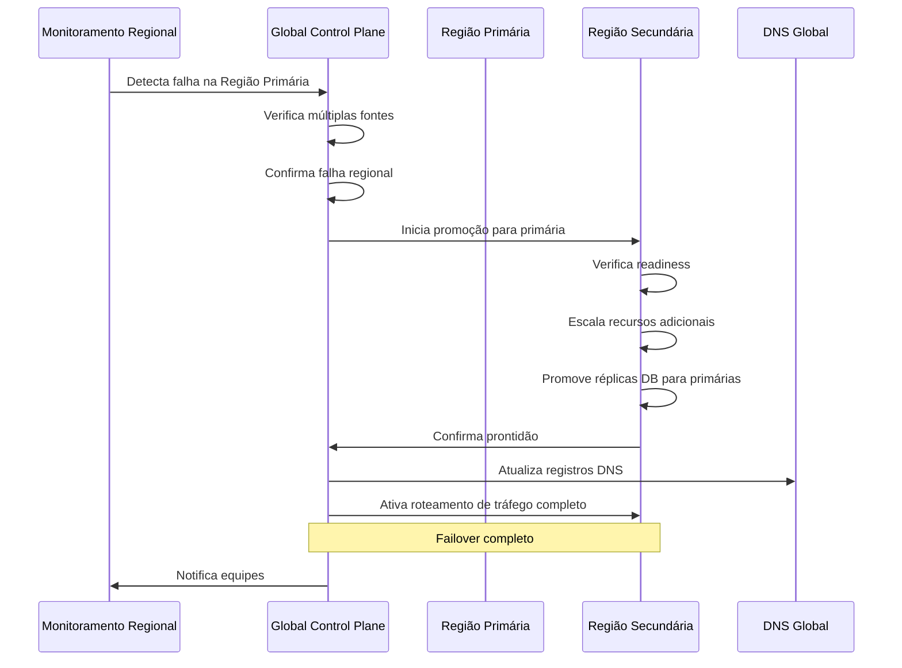

# Arquitetura de Alta Disponibilidade e Disaster Recovery - IAM INNOVABIZ

## Visão Geral

Este documento define a arquitetura de alta disponibilidade (HA) e disaster recovery (DR) para o módulo IAM (Identity and Access Management) da plataforma INNOVABIZ. Considerando a criticidade do IAM como componente central para autenticação, autorização e gestão de identidades em toda a plataforma, a arquitetura foi projetada para garantir resiliência extrema, continuidade de negócios e recuperação rápida em cenários de falha, seguindo padrões internacionais como ISO 22301, NIST SP 800-34, ISO 27031 e TOGAF 10.0.

## Objetivos

1. **Disponibilidade Contínua**: Garantir SLA de 99.99% para serviços críticos de autenticação
2. **Resiliência Distribuída**: Implementar arquitetura geo-redundante e tolerante a falhas
3. **RTO Mínimo**: Tempo de recuperação objetivo inferior a 5 minutos para componentes críticos
4. **RPO Mínimo**: Perda de dados objetivo inferior a 30 segundos em cenários de desastre
5. **Degradação Graciosa**: Manter funcionalidades críticas mesmo em modo degradado
6. **Recuperação Automatizada**: Minimizar intervenção humana em processos de recuperação
7. **Isolamento de Falhas**: Prevenir propagação de falhas entre componentes e regiões

## Princípios Arquiteturais

1. **Design para Falha**: Assumir que falhas ocorrerão e projetar para minimizar impacto
2. **Redundância Ativa-Ativa**: Múltiplas instâncias ativas em diferentes zonas e regiões
3. **Consistência Eventual Aceitável**: Priorizar disponibilidade sobre consistência imediata
4. **Isolamento por Tenant**: Falhas em um tenant não devem impactar outros
5. **Automação Completa**: Processos de failover e recuperação totalmente automatizados
6. **Testabilidade Contínua**: Testes regulares de falha e recuperação em produção
7. **Observabilidade Abrangente**: Visibilidade total sobre estado e saúde do sistema

## Arquitetura Multi-Região

### Topologia Global

O IAM INNOVABIZ utiliza uma arquitetura multi-região com três camadas de redundância:

1. **Zona de Disponibilidade**: Redundância intra-região para falhas de datacenter
2. **Região**: Redundância geográfica para falhas regionais ou desastres naturais
3. **Modo Operacional**: Redundância de estratégia de operação (normal, degradado, emergência)

```
+--------------------+       +--------------------+       +--------------------+
|   Região Primária  |       | Região Secundária  |       |  Região Terciária  |
| (América do Sul)   |       |    (Europa)        |       |    (África)        |
|                    |       |                    |       |                    |
|  +------+ +------+ |       |  +------+ +------+ |       |  +------+ +------+ |
|  | AZ-A | | AZ-B | |<----->|  | AZ-A | | AZ-B | |<----->|  | AZ-A | | AZ-B | |
|  +------+ +------+ |       |  +------+ +------+ |       |  +------+ +------+ |
|                    |       |                    |       |                    |
+--------------------+       +--------------------+       +--------------------+
```

### Distribuição de Componentes

| Componente | Estratégia de Distribuição | Modelo de Consistência |
|------------|----------------------------|------------------------|
| API Gateway | Global + Roteamento Regional | Consistência Imediata |
| Identity Service | Instâncias por Região | Consistência Eventual |
| Authorization Service | Instâncias por Região | Consistência Eventual |
| Token Service | Global + Cache Regional | Consistência Imediata |
| User Service | Instâncias por Região | Consistência Eventual |
| Audit Service | Coleta Regional + Consolidação Global | Consistência Eventual |
| Admin Portal | Instâncias por Região | Consistência Eventual |
| Config Service | Primário-Secundário com Promoção | Consistência Forte |

## Estratégias de Alta Disponibilidade

### 1. Serviços de Autenticação

| Aspecto | Implementação | SLA |
|---------|---------------|-----|
| Redundância | Min. 3 instâncias por zona | 99.99% |
| Escalabilidade | Auto-scaling baseado em CPU (60%) e requisições | N/A |
| Balanceamento | Round-robin com health check | N/A |
| Failover | Automático entre instâncias | <10s |
| Cache | Redis distribuído com expiração hierárquica | N/A |
| Circuit Breaking | Threshold: 50% de erros em 30s | N/A |

#### Implementação de Health Check

```go
// Exemplo de implementação de health check para serviço de autenticação
func (s *AuthService) HealthCheck(ctx context.Context) *health.Status {
    status := &health.Status{
        Service: "auth-service",
        Status:  health.StatusOK,
        Version: version.Current,
        Checks:  map[string]health.CheckResult{},
    }
    
    // Verificar conexão com banco de dados
    if err := s.db.PingContext(ctx); err != nil {
        status.Status = health.StatusDegraded
        status.Checks["database"] = health.CheckResult{
            Status:  health.StatusFailed,
            Message: "Database connectivity issue: " + err.Error(),
        }
    } else {
        status.Checks["database"] = health.CheckResult{
            Status: health.StatusOK,
        }
    }
    
    // Verificar cache
    if _, err := s.cache.Ping(ctx).Result(); err != nil {
        status.Status = health.StatusDegraded
        status.Checks["cache"] = health.CheckResult{
            Status:  health.StatusFailed,
            Message: "Cache connectivity issue: " + err.Error(),
        }
    } else {
        status.Checks["cache"] = health.CheckResult{
            Status: health.StatusOK,
        }
    }
    
    // Verificar dependências externas
    for name, client := range s.externalClients {
        if err := client.HealthCheck(ctx); err != nil {
            status.Status = health.StatusDegraded
            status.Checks[name] = health.CheckResult{
                Status:  health.StatusFailed,
                Message: "External dependency issue: " + err.Error(),
            }
        } else {
            status.Checks[name] = health.CheckResult{
                Status: health.StatusOK,
            }
        }
    }
    
    return status
}
```

### 2. Base de Dados

| Aspecto | Implementação | SLA |
|---------|---------------|-----|
| Modelo Principal | PostgreSQL com TimescaleDB | 99.99% |
| Replicação | Streaming multi-região síncrona + assíncrona | N/A |
| Particionamento | Por tenant e data | N/A |
| Backup | Contínuo (WAL) + Snapshots a cada 6h | N/A |
| Failover | Promoção automática com Patroni | <30s |
| Monitoramento | Métricas + alertas por região e réplica | N/A |

#### Configuração de Replicação Multi-região

```yaml
# Exemplo de configuração Patroni para replicação multi-região
scope: iam-global
namespace: /innovabiz/iam
name: iam-db-node-1

restapi:
  listen: 0.0.0.0:8008
  connect_address: 10.0.0.1:8008

postgresql:
  listen: 0.0.0.0:5432
  connect_address: 10.0.0.1:5432
  data_dir: /var/lib/postgresql/data
  bin_dir: /usr/lib/postgresql/14/bin
  pgpass: /tmp/pgpass
  
  parameters:
    max_connections: 1000
    shared_buffers: 8GB
    work_mem: 16MB
    maintenance_work_mem: 2GB
    wal_level: logical
    max_wal_senders: 10
    max_replication_slots: 10
    synchronous_commit: on
    synchronous_standby_names: 'FIRST 1 (iam-db-node-2, iam-db-node-3)'
    hot_standby: on
    wal_log_hints: on
    archive_mode: on
    archive_command: 'gcloud storage cp %p gs://innovabiz-iam-wal-archive/%f'
    
  recovery_conf:
    restore_command: 'gcloud storage cp gs://innovabiz-iam-wal-archive/%f %p'

bootstrap:
  dcs:
    ttl: 30
    loop_wait: 10
    retry_timeout: 10
    maximum_lag_on_failover: 1048576
    postgresql:
      use_pg_rewind: true
      use_slots: true
    synchronous_mode: true
    synchronous_mode_strict: false
    
  initdb:
    - encoding: UTF8
    - data-checksums
    - locale: en_US.UTF-8

  pg_hba:
    - host replication replicator 10.0.0.0/16 md5
    - host replication replicator 10.1.0.0/16 md5
    - host replication replicator 10.2.0.0/16 md5
    - host all all 10.0.0.0/16 md5
    - host all all 10.1.0.0/16 md5
    - host all all 10.2.0.0/16 md5
```

### 3. Cache Distribuído

| Aspecto | Implementação | SLA |
|---------|---------------|-----|
| Tecnologia | Redis Cluster + Sentinel | 99.95% |
| Topologia | Min. 3 masters, cada um com 1 replica | N/A |
| Persistência | RDB a cada 15min + AOF (fsync cada 1s) | N/A |
| Expiração | Hierárquica por tipo de dado | N/A |
| Failover | Automático via Sentinel | <15s |
| Consistência | Eventual com invalidação baseada em eventos | N/A |

### 4. Serviço de Tokens

Componente mais crítico que requer disponibilidade máxima:

| Aspecto | Implementação | SLA |
|---------|---------------|-----|
| Armazenamento | Redis + Backup local em memory-mapped files | 99.999% |
| Validação | Descentralizada com chaves públicas replicadas | N/A |
| Revogação | Baseada em eventos com propagação eventual | <10s |
| Contingência | Capacidade offline com JWT assinados | N/A |
| Rotação de Chaves | Automática a cada 24h sem downtime | N/A |

#### Implementação de Contingência de Tokens

```go
// TokenValidator com fallback para validação offline
type TokenValidator struct {
    remoteValidator *RemoteValidator
    localValidator  *LocalValidator
    healthcheck     *HealthCheck
    metrics         *Metrics
}

func (v *TokenValidator) Validate(ctx context.Context, token string) (*TokenClaims, error) {
    // Tentar validação primária (online)
    if v.healthcheck.IsRemoteHealthy() {
        claims, err := v.remoteValidator.Validate(ctx, token)
        if err == nil {
            return claims, nil
        }
        
        // Registrar falha na validação remota
        v.metrics.RemoteValidationFailure()
        log.Warn("Remote validation failed, falling back to local", 
            map[string]interface{}{"error": err.Error()})
    }
    
    // Fallback para validação local
    claims, err := v.localValidator.Validate(token)
    if err != nil {
        return nil, err
    }
    
    // Marcar que foi validado localmente para auditoria
    claims.ValidationMode = "local"
    v.metrics.LocalValidationSuccess()
    
    return claims, nil
}
```

## Disaster Recovery

### 1. Classificação de Cenários

| Nível | Cenário | Impacto | Estratégia |
|-------|---------|---------|------------|
| 1 | Falha de Instância | Mínimo - Sem perda de serviço | Failover automático |
| 2 | Falha de Zona | Baixo - Potencial degradação | Redirecionamento automático |
| 3 | Falha de Região | Médio - Serviços regionais indisponíveis | Promoção de região secundária |
| 4 | Falha Multi-região | Alto - Potencial indisponibilidade | Operação em modo emergência |
| 5 | Catástrofe Global | Crítico - Recuperação de backups | Reconstrução a partir de cold storage |

### 2. Objetivos de Recuperação

| Componente | RTO (Tempo) | RPO (Dados) | Criticidade |
|------------|-------------|-------------|-------------|
| Autenticação | 5 minutos | 0 (zero) | Crítica |
| Autorização | 5 minutos | 30 segundos | Crítica |
| Gestão de Usuários | 30 minutos | 5 minutos | Alta |
| Admin Portal | 60 minutos | 15 minutos | Média |
| Auditoria | 30 minutos | 0 (via buffer local) | Alta |
| Relatórios | 4 horas | 1 hora | Baixa |

### 3. Estratégias de Backup

| Tipo de Dados | Método | Frequência | Retenção | Criptografia |
|---------------|--------|------------|----------|--------------|
| Banco Transacional | WAL Shipping | Contínuo | 7 dias | AES-256 por tenant |
| Banco Transacional | Snapshot | 6 horas | 30 dias | AES-256 por tenant |
| Banco Transacional | Dump Completo | 24 horas | 90 dias | AES-256 por tenant |
| Configurações | Git + Backup | A cada mudança | Indefinido | AES-256 |
| Logs de Auditoria | Append-only | Tempo real | 7 anos | AES-256 com chave segregada |
| Chaves Criptográficas | HSM Backup | 24 horas | 1 ano | Hardware protegido |

### 4. Processo de Failover Regional



### 5. Modo de Emergência

Em caso de falha catastrófica, o sistema pode operar em modo de emergência com funcionalidades reduzidas:

| Funcionalidade | Estado em Emergência | Impacto |
|----------------|----------------------|---------|
| Autenticação Básica | Ativo | JWT com TTL estendido |
| MFA | Desativado | Segurança reduzida |
| Autorização | Simplificada | Cache local de permissões |
| Auditoria | Buffer Local | Sincronização posterior |
| Admin Portal | Somente leitura | Sem alterações |
| API Rate Limits | Reduzidos | Proteção contra sobrecarga |

#### Implementação do Modo de Emergência

```go
// Detector de modo de emergência
func (d *DisasterDetector) ShouldActivateEmergencyMode(ctx context.Context) bool {
    // Verificar conectividade com serviços críticos
    healthStatus := d.globalHealthCheck.GetStatus(ctx)
    
    // Se múltiplas regiões reportarem falhas críticas
    if healthStatus.FailedRegionsCount >= d.config.EmergencyThreshold.Regions {
        log.Critical("Multiple region failure detected, activating emergency mode",
            map[string]interface{}{
                "failed_regions": healthStatus.FailedRegions,
                "threshold": d.config.EmergencyThreshold.Regions,
            })
        return true
    }
    
    // Se serviços críticos estiverem indisponíveis por tempo prolongado
    criticalServices := []string{"auth", "authz", "token"}
    failedCritical := 0
    
    for _, svc := range criticalServices {
        if healthStatus.ServiceStatus[svc].FailedDuration > 
           d.config.EmergencyThreshold.Duration {
            failedCritical++
        }
    }
    
    if failedCritical >= len(criticalServices)/2 {
        log.Critical("Critical services unavailable, activating emergency mode",
            map[string]interface{}{
                "failed_services": failedCritical,
                "total_critical": len(criticalServices),
            })
        return true
    }
    
    return false
}

// Configuração de serviço em modo de emergência
func (s *AuthService) SetEmergencyMode(active bool) {
    s.emergencyMode.Store(active)
    
    if active {
        // Estender TTL de tokens
        s.tokenConfig.DefaultTTL = s.config.Emergency.ExtendedTokenTTL
        
        // Desativar verificações rigorosas
        s.authConfig.RequireMFA = false
        s.authConfig.StrictIPValidation = false
        
        // Carregar cache de permissões críticas
        s.loadEmergencyPermissionsCache()
        
        // Ativar buffer local para auditoria
        s.auditService.EnableLocalBuffering(true)
        
        // Notificar sobre modo de emergência
        s.notifier.NotifyEmergencyModeActivated()
        
        log.Warning("Emergency mode activated", nil)
    } else {
        // Restaurar configurações normais
        s.restoreNormalOperations()
        log.Info("Emergency mode deactivated", nil)
    }
}
```

## Testes de Resiliência

### 1. Metodologias de Teste

| Tipo de Teste | Frequência | Escopo | Metodologia |
|---------------|------------|--------|------------|
| Failover de Instância | Contínuo | Produção | Chaos Monkey |
| Failover de Zona | Semanal | Produção | Programado |
| Simulação Regional | Mensal | Ambiente de Pré-prod | Game Day |
| DR Completo | Trimestral | Reconstrução em ambiente isolado | Exercício |

### 2. Chaos Engineering

Implementação de experimentos controlados de caos para validar resiliência:

1. **Chaos Monkey**: Terminação aleatória de instâncias em produção
2. **Latency Monkey**: Injeção de latência em comunicações de rede
3. **Partition Monkey**: Simulação de partições de rede entre zonas
4. **Failure Injection**: Testes controlados de falha em componentes específicos

### 3. Game Days

Exercícios simulados com equipes técnicas e de negócios:

1. **Cenário**: Falha total de região primária durante pico de utilização
2. **Participantes**: DevOps, SRE, Desenvolvedores, Produto, Suporte
3. **Métricas**: Tempo de detecção, tempo de recuperação, impacto ao negócio
4. **Documentação**: Lições aprendidas, melhorias identificadas

## Arquitetura de Monitoramento para HA/DR

### 1. Observabilidade Global

| Componente | Implementação | Finalidade |
|------------|---------------|------------|
| Saúde de Serviço | Healthchecks multi-nível | Detecção de problemas |
| Métricas | Prometheus + Thanos | Visibilidade global |
| Logs | OpenTelemetry + Elasticsearch | Auditoria e troubleshooting |
| Traces | Jaeger + OpenTelemetry | Diagnóstico distribuído |
| Alertas | AlertManager + PagerDuty | Notificação de incidentes |

### 2. Métricas Críticas de HA

| Métrica | Tipo | Tags | Limiar de Alerta |
|---------|------|------|------------------|
| `iam.ha.region.status` | Gauge | region, status | Qualquer != 1 (healthy) |
| `iam.ha.zone.status` | Gauge | region, zone, status | Qualquer != 1 (healthy) |
| `iam.ha.service.status` | Gauge | service, region, status | Qualquer != 1 (healthy) |
| `iam.ha.replication.lag` | Gauge | region, database | >30 segundos |
| `iam.ha.failover.count` | Counter | region, component, reason | >0 em 1 hora |
| `iam.ha.degraded_mode.duration` | Gauge | region, component | >15 minutos |

### 3. Dashboard de Saúde Global

Dashboard centralizado exibindo:

1. Mapa global de status de regiões e zonas
2. Métricas de latência entre regiões
3. Status de replicação de dados
4. Histórico de failovers e incidentes
5. Tempos de resposta de serviços críticos
6. Estado de mecanismos de DR (backups, replicação)

## Responsabilidades e Procedimentos

### 1. Equipes e Papéis

| Equipe | Responsabilidades | Tempo de Resposta |
|--------|-------------------|-------------------|
| SRE IAM | Monitoramento, resposta inicial, escalação | 15 minutos |
| DevOps IAM | Operação de infraestrutura, failover manual | 30 minutos |
| Desenvolvedores IAM | Suporte nível 3, diagnóstico avançado | 60 minutos |
| Crisis Management | Coordenação de incidentes de grande escala | 30 minutos |

### 2. Runbooks de Recuperação

Documentação detalhada para cada cenário de falha:

1. **Failover de Instância**: Procedimentos automatizados
2. **Failover de Zona**: Checklist de verificação pós-failover automático
3. **Failover de Região**: Passos para validação e comunicação
4. **Restauração de Backups**: Procedimentos passo-a-passo
5. **Recuperação de Desastres**: Plano completo de reconstrução

### 3. Comunicação e Escalação

| Nível de Incidente | Canais | Stakeholders | Frequência de Updates |
|-------------------|--------|--------------|----------------------|
| P1 (Crítico) | PagerDuty, Slack, SMS | Exec, Clientes, Todos os times | 30 minutos |
| P2 (Alto) | Slack, Email | Líderes Técnicos, Clientes afetados | 1 hora |
| P3 (Médio) | Slack, Email | Times internos relevantes | 4 horas |
| P4 (Baixo) | Ticket, Slack | Apenas equipe responsável | Diário |

## Conformidade e Governança

### 1. Requisitos Regulatórios

| Regulamento | Requisito | Implementação |
|-------------|-----------|---------------|
| ISO 27001 | A.17.1 - Continuidade de SI | Plano de DR documentado |
| ISO 22301 | Gestão de Continuidade | Testes regulares, melhorias |
| PCI-DSS | 2.2, 6.4, 12.10 | Redundância e planos de resposta |
| GDPR | Art. 32 - Segurança de Processamento | Medidas técnicas para disponibilidade |
| LGPD | Art. 46 - Medidas de Segurança | Proteção contra perda de disponibilidade |
| PNDSB (Angola) | Proteção de Sistemas | Continuidade de serviços essenciais |

### 2. Indicadores Chave

| Indicador | Meta | Monitoramento | Revisão |
|-----------|------|---------------|---------|
| Uptime anual | 99.99% | Contínuo | Mensal |
| MTTR - Tempo médio de recuperação | <15 min | Por incidente | Mensal |
| MTBF - Tempo médio entre falhas | >90 dias | Contínuo | Trimestral |
| Sucesso em DR Tests | 100% | Por teste | Trimestral |

## Roadmap de Evolução

### Fase 1: Fundação Robusta (M1-M3)

1. Implementação de redundância básica em todas zonas
2. Automação de failover de instâncias e zonas
3. Configuração de replicação de dados cross-regional
4. Implementação de healthchecks abrangentes

### Fase 2: Resiliência Avançada (M4-M6)

1. Implementação de modo de emergência
2. Arquitetura de cache distribuído multi-região
3. Automação completa de failover regional
4. Testes iniciais de Chaos Engineering

### Fase 3: HA Global (M7-M9)

1. Otimização de latência entre regiões
2. Distribuição geográfica inteligente de tráfego
3. Implementação de Game Days trimestrais
4. Dashboards avançados de saúde global

### Fase 4: Maturidade (M10-M12)

1. Failover transparente para usuário final
2. Ajuste dinâmico de recursos baseado em padrões de uso
3. Auto-healing avançado de componentes
4. Simulações automatizadas de falha

## Referências

1. ISO 22301 - Continuidade de Negócios
2. ISO 27031 - ICT Readiness for Business Continuity
3. NIST SP 800-34 - Contingency Planning Guide
4. Chaos Engineering: System Resiliency in Practice (O'Reilly)
5. Site Reliability Engineering (Google)
6. The Art of Scalability (Addison-Wesley)
7. COBIT 2019 - Framework de Governança de TI
8. Architecting for Scale (O'Reilly)
9. PostgreSQL High Availability Cookbook

---

*Este documento está em conformidade com os padrões de documentação técnica da INNOVABIZ e deve ser revisado e atualizado regularmente conforme a evolução do sistema.*

*Última atualização: 06/08/2025*