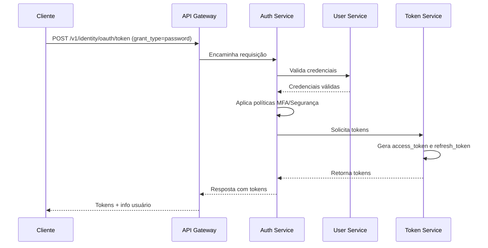
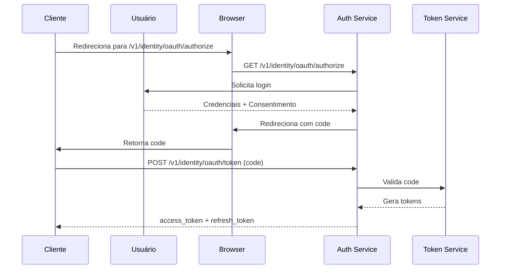

# Arquitetura de APIs e Endpoints - IAM INNOVABIZ

## Visão Geral

Este documento define a arquitetura de APIs e endpoints para o módulo IAM (Identity and Access Management) da plataforma INNOVABIZ. A arquitetura foi projetada seguindo princípios de design API-first, garantindo segurança, escalabilidade, desempenho e interoperabilidade em um ambiente multi-tenant, multi-camada, multi-contexto e multidimensional. As APIs estão alinhadas com padrões internacionais como OpenAPI 3.1, GraphQL, OAuth 2.1, OIDC, SCIM 2.0 e melhores práticas TOGAF 10.0 e COBIT 2019.

## Objetivos

1. **Design Consistente**: Estabelecer padrões uniformes para todas as APIs do IAM
2. **Segurança por Design**: Implementar controles de segurança em todos os níveis
3. **Experiência do Desenvolvedor**: Facilitar a integração e adoção por desenvolvedores
4. **Performance**: Otimizar para baixa latência e alta capacidade de processamento
5. **Flexibilidade**: Suportar múltiplos protocolos e padrões para diferentes casos de uso
6. **Versionamento**: Garantir evolução contínua sem quebrar compatibilidade
7. **Observabilidade**: Monitoramento e diagnóstico abrangentes
8. **Compliance**: Aderência a regulamentações e frameworks de segurança

## Princípios Arquiteturais

### 1. Princípios Gerais

1. **API First**: Design de APIs antes da implementação
2. **Segurança em Camadas**: Múltiplos níveis de controle de segurança
3. **Padronização**: Convenções consistentes para todos endpoints
4. **Separação REST/GraphQL**: REST para operações CRUD, GraphQL para queries complexas
5. **Idempotência**: Operações seguras para reexecução quando apropriado
6. **Tolerância**: Design defensivo e tratamento gracioso de erros
7. **Contextual**: Consciência de tenant em todas as operações

### 2. Padrões de Design

| Aspecto | Padrão | Benefício |
|---------|--------|-----------|
| URLs REST | Resource-based `/v1/tenants/{id}/users` | Clareza e navegabilidade |
| Métodos HTTP | Semântica padrão (GET, POST, PUT, DELETE) | Consistência com padrões web |
| GraphQL | Schema-first com resolvers modulares | Flexibilidade para consultas complexas |
| Paginação | Cursor-based + offset opcional | Performance e consistência |
| Filtros | Query params para REST, argumentos para GraphQL | Pesquisas flexíveis |
| Autenticação | JWT + OAuth 2.1 | Segurança e interoperabilidade |
| Respostas | Envelope consistente com metadados | Contextualização de respostas |
| Erros | Estrutura padronizada com códigos e detalhes | Diagnóstico facilitado |

## Arquitetura de Gateway e APIs

### 1. Camadas de API

```
  ┌──────────────────────────────────────────────┐
  │         Client Applications & SDKs           │
  └──────────────────────────────────────────────┘
                        │
  ┌──────────────────────────────────────────────┐
  │          KrakenD API Gateway Layer           │
  └──────────────────────────────────────────────┘
           ┌─────────────┬──────────────┐
           │             │              │
  ┌─────────────┐ ┌─────────────┐ ┌─────────────┐
  │  REST APIs  │ │ GraphQL API │ │ OIDC/OAuth  │
  └─────────────┘ └─────────────┘ └─────────────┘
           │             │              │
  ┌──────────────────────────────────────────────┐
  │         IAM Microservices & Domain Layer     │
  └──────────────────────────────────────────────┘
```

### 2. API Gateway (KrakenD)

O KrakenD atua como API Gateway principal com as seguintes responsabilidades:

1. **Roteamento**: Direcionamento para serviços backend apropriados
2. **Rate Limiting**: Proteção contra abuso por tenant e usuário
3. **Autenticação**: Validação inicial de tokens JWT
4. **Caching**: Armazenamento em cache de respostas quando apropriado
5. **Transformações**: Adaptação de payloads entre cliente e serviços
6. **Observabilidade**: Logging, métricas e tracing
7. **Segurança**: Headers, TLS, validações básicas

#### Exemplo de Configuração KrakenD

```json
{
  "version": 3,
  "endpoints": [
    {
      "endpoint": "/v1/users",
      "method": "GET",
      "output_encoding": "json",
      "extra_config": {
        "security/cors": {
          "allow_origins": ["*"],
          "allow_methods": ["GET", "POST", "PUT", "DELETE"],
          "allow_headers": ["Origin", "Authorization", "Content-Type"],
          "expose_headers": ["Content-Length"],
          "max_age": 3600
        },
        "qos/ratelimit/router": {
          "max_rate": 100,
          "client_max_rate": 10,
          "strategy": "ip"
        },
        "auth/validator": {
          "alg": "RS256",
          "jwk_url": "http://identity-service:8080/.well-known/jwks.json",
          "disable_jwk_security": false,
          "cache": true,
          "audience": ["https://api.innovabiz.com"],
          "roles_key": "https://innovabiz.com/roles",
          "roles": ["user-admin", "user-viewer"],
          "propagate_claims": [
            ["sub", "user_id"],
            ["https://innovabiz.com/tenant", "tenant_id"]
          ]
        }
      },
      "backend": [
        {
          "url_pattern": "/users",
          "host": ["http://user-service:8080"],
          "extra_config": {
            "plugin/req-resp-modifier": {
              "backend": [
                {
                  "header_manipulation": {
                    "input": {
                      "X-Tenant-Id": "{{.request.headers.X-Tenant-Id}}",
                      "X-User-Id": "{{.request.headers.X-User-Id}}",
                      "X-Correlation-Id": "{{.request.headers.X-Correlation-Id}}"
                    }
                  }
                }
              ]
            },
            "telemetry/opentelemetry": {
              "enabled": true,
              "attributes": [
                {
                  "key": "service.name",
                  "value": "user-service"
                }
              ]
            }
          }
        }
      ]
    }
  ],
  "extra_config": {
    "telemetry/logging": {
      "level": "INFO",
      "syslog": false,
      "stdout": true
    },
    "telemetry/metrics": {
      "collection_time": "60s",
      "listen_address": "0.0.0.0:8090"
    },
    "telemetry/opentelemetry": {
      "enabled": true,
      "exporters": {
        "jaeger": {
          "endpoint": "http://jaeger-collector:14268/api/traces"
        }
      }
    }
  }
}
```

### 3. Padrões de Versionamento

| Aspecto | Estratégia | Exemplo |
|---------|------------|---------|
| URLs REST | Major version em path | `/v1/users`, `/v2/users` |
| GraphQL | Versionamento por tipo | `User` → `UserV2` com aliases |
| Headers | Versionamento fino via headers | `Accept: application/vnd.innovabiz.user+json;version=1.2` |
| Deprecação | Headers + Documentação | `Deprecation: true`, `Sunset: Thu, 31 Dec 2025 23:59:59 GMT` |

## APIs REST

### 1. Estrutura de Endpoints

| Domínio | Base URL | Recursos Primários |
|---------|----------|-------------------|
| Identidade | `/v1/identity` | `/users`, `/groups`, `/sessions` |
| Autorização | `/v1/authorization` | `/roles`, `/permissions`, `/policies` |
| Tenants | `/v1/tenants` | `/settings`, `/subscriptions`, `/members` |
| Eventos de Segurança | `/v1/security-events` | `/alerts`, `/audit-logs`, `/reports` |
| Admin | `/v1/admin` | `/settings`, `/metrics`, `/operations` |

### 2. Padrões de URL

```
# Coleções
GET /v1/{domain}/{resource}                # Listar recursos
POST /v1/{domain}/{resource}               # Criar recurso

# Recursos individuais
GET /v1/{domain}/{resource}/{id}           # Obter recurso
PUT /v1/{domain}/{resource}/{id}           # Atualizar recurso (completo)
PATCH /v1/{domain}/{resource}/{id}         # Atualizar recurso (parcial)
DELETE /v1/{domain}/{resource}/{id}        # Excluir recurso

# Sub-recursos
GET /v1/{domain}/{resource}/{id}/{subresource}      # Listar sub-recursos
POST /v1/{domain}/{resource}/{id}/{subresource}     # Criar sub-recurso

# Ações
POST /v1/{domain}/{resource}/{id}/{action}          # Executar ação em recurso
```

### 3. Exemplos de Endpoints REST

#### 3.1 Endpoints de Identidade

| Método | Endpoint | Descrição | Permissões |
|--------|----------|-----------|------------|
| GET | `/v1/identity/users` | Listar usuários | `users:list` |
| POST | `/v1/identity/users` | Criar usuário | `users:create` |
| GET | `/v1/identity/users/{id}` | Obter detalhes do usuário | `users:read` |
| PUT | `/v1/identity/users/{id}` | Atualizar usuário (completo) | `users:update` |
| PATCH | `/v1/identity/users/{id}` | Atualizar usuário (parcial) | `users:update` |
| DELETE | `/v1/identity/users/{id}` | Excluir usuário | `users:delete` |
| POST | `/v1/identity/users/{id}/activate` | Ativar usuário | `users:activate` |
| POST | `/v1/identity/users/{id}/deactivate` | Desativar usuário | `users:deactivate` |
| GET | `/v1/identity/users/{id}/groups` | Listar grupos do usuário | `users:read:groups` |
| POST | `/v1/identity/users/{id}/groups` | Adicionar usuário a grupos | `users:update:groups` |

#### 3.2 Endpoints de Autorização

| Método | Endpoint | Descrição | Permissões |
|--------|----------|-----------|------------|
| GET | `/v1/authorization/roles` | Listar papéis | `roles:list` |
| POST | `/v1/authorization/roles` | Criar papel | `roles:create` |
| GET | `/v1/authorization/roles/{id}` | Obter detalhes do papel | `roles:read` |
| PUT | `/v1/authorization/roles/{id}` | Atualizar papel | `roles:update` |
| DELETE | `/v1/authorization/roles/{id}` | Excluir papel | `roles:delete` |
| GET | `/v1/authorization/roles/{id}/permissions` | Listar permissões do papel | `roles:read:permissions` |
| POST | `/v1/authorization/roles/{id}/permissions` | Adicionar permissões ao papel | `roles:update:permissions` |
| GET | `/v1/authorization/permissions` | Listar permissões | `permissions:list` |
| POST | `/v1/authorization/check` | Verificar permissões para ação | `authorization:check` |

### 4. Formato de Requisição/Resposta

#### 4.1 Padrão de Requisição (POST/PUT)

```json
{
  "data": {
    "attribute1": "value1",
    "attribute2": "value2",
    "nested_object": {
      "nested_attr": "value"
    }
  },
  "meta": {
    "client_request_id": "client-req-123",
    "locale": "pt-BR"
  }
}
```

#### 4.2 Padrão de Resposta

```json
{
  "data": {
    "id": "resource-123",
    "type": "user",
    "attribute1": "value1",
    "attribute2": "value2",
    "nested_object": {
      "nested_attr": "value"
    },
    "created_at": "2025-08-06T15:04:05Z",
    "updated_at": "2025-08-06T15:04:05Z"
  },
  "meta": {
    "request_id": "req-abc-123",
    "trace_id": "trace-xyz-789",
    "tenant_id": "tenant-456",
    "pagination": {
      "total_items": 243,
      "total_pages": 25,
      "page_size": 10,
      "current_page": 1
    }
  },
  "links": {
    "self": "/v1/identity/users/resource-123",
    "related": {
      "groups": "/v1/identity/users/resource-123/groups",
      "roles": "/v1/identity/users/resource-123/roles"
    }
  }
}
```

#### 4.3 Padrão de Resposta para Erros

```json
{
  "error": {
    "code": "RESOURCE_NOT_FOUND",
    "message": "O recurso solicitado não foi encontrado",
    "details": "Não foi possível localizar um usuário com o ID 'invalid-id'",
    "trace_id": "trace-xyz-789",
    "request_id": "req-abc-123",
    "status": 404,
    "timestamp": "2025-08-06T15:04:05Z",
    "validation_errors": [
      {
        "field": "email",
        "error": "formato_invalido",
        "message": "O formato do email é inválido"
      }
    ],
    "links": {
      "about": "https://docs.innovabiz.com/errors/RESOURCE_NOT_FOUND"
    }
  }
}
```## API GraphQL

### 1. Visão Geral

A API GraphQL do IAM INNOVABIZ fornece uma interface flexível para consultas complexas e operações relacionadas a identidade e acesso. Disponível no endpoint `/v1/graphql`, a API segue os princípios Schema-first e implementa recursos avançados como diretivas de autorização, fragmentos para reutilização, e federação para integração com outros módulos da plataforma.

### 2. Schema Principal

```graphql
"""
Esquema principal para IAM GraphQL API
"""
schema {
  query: Query
  mutation: Mutation
  subscription: Subscription
}

"""
Tipos de consulta principal
"""
type Query {
  # Usuários
  users(filter: UserFilterInput, pagination: PaginationInput): UserConnection! @authz(requires: "users:list")
  user(id: ID!): User @authz(requires: "users:read")
  userByEmail(email: String!): User @authz(requires: "users:read")
  currentUser: User @authz(requires: "users:read:self")
  
  # Grupos
  groups(filter: GroupFilterInput, pagination: PaginationInput): GroupConnection! @authz(requires: "groups:list")
  group(id: ID!): Group @authz(requires: "groups:read")
  
  # Papéis e permissões
  roles(filter: RoleFilterInput, pagination: PaginationInput): RoleConnection! @authz(requires: "roles:list")
  role(id: ID!): Role @authz(requires: "roles:read")
  permissions(filter: PermissionFilterInput, pagination: PaginationInput): PermissionConnection! @authz(requires: "permissions:list")
  
  # Tenants
  tenants(filter: TenantFilterInput, pagination: PaginationInput): TenantConnection! @authz(requires: "tenants:list")
  tenant(id: ID!): Tenant @authz(requires: "tenants:read")
  currentTenant: Tenant @authz(requires: "tenants:read:self")
  
  # Autorização
  checkPermission(resource: String!, action: String!): AuthorizationResult! @authz(requires: "authorization:check")
  
  # Auditoria
  auditLogs(filter: AuditLogFilterInput, pagination: PaginationInput): AuditLogConnection! @authz(requires: "audit:list")
  
  # Sistema e Saúde
  healthCheck: HealthStatus!
  statistics: SystemStatistics! @authz(requires: "system:stats:read")
}

"""
Tipos de mutação principal
"""
type Mutation {
  # Usuários
  createUser(input: CreateUserInput!): UserResult! @authz(requires: "users:create")
  updateUser(id: ID!, input: UpdateUserInput!): UserResult! @authz(requires: "users:update")
  deleteUser(id: ID!): DeleteResult! @authz(requires: "users:delete")
  activateUser(id: ID!): UserResult! @authz(requires: "users:activate")
  deactivateUser(id: ID!): UserResult! @authz(requires: "users:deactivate")
  
  # Autenticação
  login(input: LoginInput!): AuthResult!
  logout: LogoutResult!
  refreshToken(refreshToken: String!): AuthResult!
  changePassword(input: ChangePasswordInput!): ChangePasswordResult! @authz(requires: "users:update:password")
  
  # Grupos
  createGroup(input: CreateGroupInput!): GroupResult! @authz(requires: "groups:create")
  updateGroup(id: ID!, input: UpdateGroupInput!): GroupResult! @authz(requires: "groups:update")
  deleteGroup(id: ID!): DeleteResult! @authz(requires: "groups:delete")
  addUsersToGroup(groupId: ID!, userIds: [ID!]!): GroupUsersResult! @authz(requires: "groups:update:members")
  
  # Papéis e permissões
  createRole(input: CreateRoleInput!): RoleResult! @authz(requires: "roles:create")
  updateRole(id: ID!, input: UpdateRoleInput!): RoleResult! @authz(requires: "roles:update")
  deleteRole(id: ID!): DeleteResult! @authz(requires: "roles:delete")
  assignRolesToUser(userId: ID!, roleIds: [ID!]!): UserRolesResult! @authz(requires: "users:update:roles")
  
  # Tenants
  createTenant(input: CreateTenantInput!): TenantResult! @authz(requires: "tenants:create")
  updateTenant(id: ID!, input: UpdateTenantInput!): TenantResult! @authz(requires: "tenants:update")
  setTenantStatus(id: ID!, status: TenantStatus!): TenantResult! @authz(requires: "tenants:update:status")
}

"""
Tipos de assinaturas em tempo real
"""
type Subscription {
  userUpdated(id: ID): User @authz(requires: "users:read")
  auditLogCreated(filter: AuditLogSubscriptionFilter): AuditLog @authz(requires: "audit:read")
  securityEvent(severity: [SecurityEventSeverity!]): SecurityEvent @authz(requires: "security:events:read")
}

"""
Tipo de usuário principal
"""
type User {
  id: ID!
  tenantId: ID!
  username: String!
  email: String!
  firstName: String
  lastName: String
  fullName: String
  status: UserStatus!
  mfaEnabled: Boolean!
  lastLoginAt: DateTime
  createdAt: DateTime!
  updatedAt: DateTime!
  groups: [Group!]! @authz(requires: "users:read:groups")
  roles: [Role!]! @authz(requires: "users:read:roles")
  permissions: [Permission!]! @authz(requires: "users:read:permissions")
  metadata: JSONObject
  profilePicture: String
}

"""
Tipo de grupo
"""
type Group {
  id: ID!
  tenantId: ID!
  name: String!
  description: String
  members: [User!]! @authz(requires: "groups:read:members")
  roles: [Role!]! @authz(requires: "groups:read:roles")
  createdAt: DateTime!
  updatedAt: DateTime!
  metadata: JSONObject
}

"""
Tipo de papel (role)
"""
type Role {
  id: ID!
  tenantId: ID!
  name: String!
  description: String
  permissions: [Permission!]! @authz(requires: "roles:read:permissions")
  createdAt: DateTime!
  updatedAt: DateTime!
  metadata: JSONObject
}

"""
Tipo de permissão
"""
type Permission {
  id: ID!
  tenantId: ID!
  resource: String!
  action: String!
  description: String
  createdAt: DateTime!
  updatedAt: DateTime!
  conditions: JSONObject
}

"""
Tipo de tenant
"""
type Tenant {
  id: ID!
  name: String!
  displayName: String!
  domain: String
  status: TenantStatus!
  plan: String!
  settings: TenantSettings!
  createdAt: DateTime!
  updatedAt: DateTime!
  metadata: JSONObject
}

"""
Configurações de tenant
"""
type TenantSettings {
  securitySettings: SecuritySettings!
  customization: CustomizationSettings!
  integrations: [Integration!]!
  features: JSONObject!
}

"""
Status do sistema e saúde
"""
type HealthStatus {
  status: SystemStatus!
  version: String!
  uptime: Float!
  region: String!
  components: [ComponentHealth!]!
}

"""
Enums principais
"""
enum UserStatus {
  ACTIVE
  INACTIVE
  LOCKED
  PENDING
  DELETED
}

enum TenantStatus {
  ACTIVE
  INACTIVE
  SUSPENDED
  PROVISIONING
}

enum SystemStatus {
  HEALTHY
  DEGRADED
  MAINTENANCE
  DOWN
}

enum SecurityEventSeverity {
  CRITICAL
  HIGH
  MEDIUM
  LOW
  INFO
}

"""
Inputs para filtros
"""
input UserFilterInput {
  tenantId: ID
  status: [UserStatus!]
  search: String
  groupId: ID
  roleId: ID
  mfaEnabled: Boolean
  createdAfter: DateTime
  createdBefore: DateTime
  lastLoginAfter: DateTime
  lastLoginBefore: DateTime
}

input PaginationInput {
  first: Int
  after: String
  last: Int
  before: String
}

"""
Conexões para paginação
"""
type UserConnection {
  edges: [UserEdge!]!
  pageInfo: PageInfo!
  totalCount: Int!
}

type UserEdge {
  node: User!
  cursor: String!
}

type PageInfo {
  hasNextPage: Boolean!
  hasPreviousPage: Boolean!
  startCursor: String
  endCursor: String
}

"""
Tipos de resultado para mutações
"""
type UserResult {
  success: Boolean!
  message: String
  user: User
  errors: [Error!]
}

type AuthResult {
  success: Boolean!
  message: String
  accessToken: String
  refreshToken: String
  expiresIn: Int
  user: User
  errors: [Error!]
}

type DeleteResult {
  success: Boolean!
  message: String
  id: ID
  errors: [Error!]
}

type Error {
  code: String!
  message: String!
  field: String
  details: String
}

"""
Inputs para mutações
"""
input CreateUserInput {
  tenantId: ID
  username: String!
  email: String!
  password: String
  firstName: String
  lastName: String
  status: UserStatus
  groupIds: [ID!]
  roleIds: [ID!]
  metadata: JSONObject
  sendInvitation: Boolean
}

input UpdateUserInput {
  email: String
  firstName: String
  lastName: String
  status: UserStatus
  metadata: JSONObject
}

input LoginInput {
  username: String
  email: String
  password: String!
  tenantId: ID
  mfaCode: String
  deviceInfo: DeviceInput
}

input DeviceInput {
  type: String
  name: String
  os: String
  browser: String
  ip: String
  location: String
}

"""
Scalares personalizados
"""
scalar DateTime
scalar JSONObject
```

### 3. Diretivas de Autorização

```graphql
"""
Diretivas personalizadas para controle de autorização
"""
directive @authz(
  requires: String
  scope: String
  policy: String
) on FIELD_DEFINITION | OBJECT

directive @tenant(
  isolation: TenantIsolation = STRICT
) on FIELD_DEFINITION | OBJECT

enum TenantIsolation {
  STRICT      # Acesso apenas dados do próprio tenant
  HIERARCHICAL # Acesso a dados de tenants filhos
  CROSS       # Acesso entre tenants específicos permitidos
  GLOBAL      # Acesso a todos tenants (admin)
}
```

### 4. Exemplo de Implementação de Resolver (Go + gqlgen)

```go
// Resolver para usuários
func (r *queryResolver) Users(ctx context.Context, filter *model.UserFilterInput, pagination *model.PaginationInput) (*model.UserConnection, error) {
    // Extrair tenant do contexto
    tenantID, err := auth.TenantFromContext(ctx)
    if err != nil {
        return nil, errors.Wrap(err, "failed to get tenant from context")
    }

    // Criar filtro de banco de dados
    dbFilter := &db.UserFilter{
        TenantID: tenantID,
    }
    
    // Aplicar filtros específicos
    if filter != nil {
        if filter.Status != nil {
            statusStrings := make([]string, len(filter.Status))
            for i, s := range filter.Status {
                statusStrings[i] = s.String()
            }
            dbFilter.Status = statusStrings
        }
        
        if filter.Search != nil {
            dbFilter.SearchQuery = *filter.Search
        }
        
        if filter.GroupID != nil {
            dbFilter.GroupID = *filter.GroupID
        }
    }
    
    // Aplicar paginação
    var paginationOpts db.PaginationOptions
    if pagination != nil {
        if pagination.First != nil {
            paginationOpts.Limit = *pagination.First
        } else {
            paginationOpts.Limit = 25 // Default
        }
        
        if pagination.After != nil {
            paginationOpts.After = *pagination.After
        }
    }
    
    // Iniciar tracing para a operação
    ctx, span := r.tracer.Start(ctx, "resolver.Users")
    defer span.End()
    
    // Adicionar atributos ao span
    span.SetAttributes(attribute.String("tenant.id", tenantID))
    if filter != nil && filter.Status != nil {
        span.SetAttributes(attribute.Int("filter.status.count", len(filter.Status)))
    }
    
    // Buscar usuários no serviço
    users, totalCount, err := r.userService.ListUsers(ctx, dbFilter, &paginationOpts)
    if err != nil {
        span.RecordError(err)
        span.SetStatus(codes.Error, "failed to list users")
        return nil, errors.Wrap(err, "failed to list users")
    }
    
    // Converter para modelo GraphQL
    edges := make([]*model.UserEdge, len(users))
    for i, user := range users {
        edges[i] = &model.UserEdge{
            Node:   mapUserToGraphQL(user),
            Cursor: encodeCursor(user.ID),
        }
    }
    
    // Construir conexão
    connection := &model.UserConnection{
        Edges:      edges,
        TotalCount: totalCount,
        PageInfo: &model.PageInfo{
            HasNextPage:     len(users) == paginationOpts.Limit,
            HasPreviousPage: paginationOpts.After != "",
        },
    }
    
    // Definir cursores
    if len(edges) > 0 {
        connection.PageInfo.StartCursor = &edges[0].Cursor
        connection.PageInfo.EndCursor = &edges[len(edges)-1].Cursor
    }
    
    // Registrar sucesso
    span.SetStatus(codes.Ok, "")
    return connection, nil
}
```

### 5. Principais Casos de Uso GraphQL

#### 5.1 Busca de Usuário com Grupos e Permissões

```graphql
query GetUserDetails($userId: ID!) {
  user(id: $userId) {
    id
    username
    email
    fullName
    status
    mfaEnabled
    groups {
      id
      name
    }
    roles {
      id
      name
      permissions {
        resource
        action
      }
    }
    permissions {
      resource
      action
    }
    lastLoginAt
    createdAt
  }
}
```

#### 5.2 Autenticação e Recuperação de Perfil

```graphql
mutation Login($input: LoginInput!) {
  login(input: $input) {
    success
    message
    accessToken
    refreshToken
    expiresIn
    user {
      id
      username
      email
      fullName
      tenantId
    }
    errors {
      code
      message
    }
  }
}

query CurrentUserProfile {
  currentUser {
    id
    username
    email
    firstName
    lastName
    roles {
      name
    }
    permissions {
      resource
      action
    }
  }
  currentTenant {
    id
    name
    displayName
    plan
    settings {
      securitySettings {
        mfaRequired
        sessionTimeout
        passwordPolicy
      }
      customization {
        logo
        colors
        theme
      }
    }
  }
}
```

#### 5.3 Verificação de Autorização para Múltiplas Ações

```graphql
query CheckMultiplePermissions {
  viewUsers: checkPermission(resource: "users", action: "list") {
    allowed
    reason
  }
  createUser: checkPermission(resource: "users", action: "create") {
    allowed
    reason
  }
  manageRoles: checkPermission(resource: "roles", action: "manage") {
    allowed
    reason
  }
  configureTenant: checkPermission(resource: "tenants", action: "configure") {
    allowed
    reason
  }
}
```

## Autenticação e Autorização

### 1. Fluxo de Autenticação

O IAM INNOVABIZ suporta múltiplos fluxos de autenticação, seguindo os padrões OAuth 2.1 e OpenID Connect:

#### 1.1 Fluxo de Credenciais (Password Grant)



#### 1.2 Fluxo de Autorização (Authorization Code)



#### 1.3 Endpoints de Autenticação OAuth/OIDC

| Endpoint | Método | Descrição |
|----------|--------|-----------|
| `/v1/identity/oauth/authorize` | GET | Iniciar fluxo de autorização |
| `/v1/identity/oauth/token` | POST | Obter/renovar tokens |
| `/v1/identity/oauth/revoke` | POST | Revogar tokens |
| `/v1/identity/oauth/userinfo` | GET | Obter informações do usuário (OIDC) |
| `/.well-known/openid-configuration` | GET | Metadados OIDC |
| `/.well-known/jwks.json` | GET | Chaves de assinatura JWT |

### 2. Estratégias de Autorização

O IAM INNOVABIZ implementa um sistema de autorização em camadas:

#### 2.1 Modelos de Autorização Suportados

| Modelo | Implementação | Caso de Uso |
|--------|---------------|-------------|
| RBAC | Papéis pré-definidos com permissões | Cenários gerais |
| ABAC | Políticas baseadas em atributos | Decisões contextuais |
| ReBAC | Controle baseado em relacionamentos | Autorização em redes sociais |
| PBAC | Controle baseado em políticas | Regras complexas |

#### 2.2 Exemplo de Política OPA (Open Policy Agent)

```rego
package innovabiz.authz

import data.innovabiz.roles
import data.innovabiz.tenant_hierarchies

default allow = false

# Regra básica de RBAC
allow {
    # Verificar se o usuário tem permissão direta
    some permission
    user_permissions[permission]
    permission == concat(":", [input.resource, input.action])
}

# Regra para acesso hierárquico de tenant
allow {
    # Verificar se o usuário tem a permissão correta
    some permission
    user_permissions[permission]
    permission == concat(":", [input.resource, input.action])
    
    # Verificar hierarquia de tenant
    tenant_hierarchies[input.user.tenant_id][input.resource_tenant_id]
}

# Regra ABAC para horário de acesso
allow {
    # Verificar permissão base
    some permission
    user_permissions[permission]
    permission == concat(":", [input.resource, input.action])
    
    # Verificar horário de acesso
    time.weekday(time.now_ns()) != "Saturday"
    time.weekday(time.now_ns()) != "Sunday"
    time.hour(time.now_ns()) >= 8
    time.hour(time.now_ns()) < 20
}

# Obter todas as permissões de um usuário (diretas + de papéis)
user_permissions[permission] {
    # Permissões diretas
    permission = input.user.permissions[_]
}

user_permissions[permission] {
    # Permissões via papéis
    role_name = input.user.roles[_]
    permission = roles[role_name].permissions[_]
}
```

### 3. Gestão de Tokens

#### 3.1 Tipos de Tokens

| Tipo | Formato | Duração | Armazenamento | Uso |
|------|---------|---------|--------------|-----|
| Access Token | JWT assinado | 15-60 min | Stateless | Acesso a recursos |
| Refresh Token | Opaco | 7-30 dias | Redis + DB | Renovação de access tokens |
| ID Token | JWT assinado | 15-60 min | Stateless | Informações de usuário (OIDC) |
| Session Token | Cookie seguro | Variável | Redis | Sessão web |

#### 3.2 Estrutura do JWT

```json
{
  "header": {
    "typ": "JWT",
    "alg": "RS256",
    "kid": "key-id-2025-08"
  },
  "payload": {
    "sub": "user-123",
    "iss": "https://iam.innovabiz.com",
    "aud": ["https://api.innovabiz.com"],
    "exp": 1754236189,
    "iat": 1754232589,
    "jti": "unique-token-id",
    "tenant_id": "tenant-456",
    "scope": "openid profile email",
    "roles": ["user", "admin"],
    "permissions": ["users:read", "users:create"],
    "context": {
      "locale": "pt-BR",
      "channel": "web",
      "ip": "192.168.1.1"
    }
  }
}
```## Segurança e Proteções

### 1. Proteções de API Implementadas

| Proteção | Implementação | Configuração |
|----------|---------------|--------------|
| Rate Limiting | Token bucket por IP/usuário/tenant | • Básico: 100 req/min por IP<br>• Autenticado: 300 req/min por usuário<br>• Crítico: 30 req/min (auth, password) |
| Validação de Entrada | JSON Schema + validação contextual | • Validação estática (OpenAPI)<br>• Validação dinâmica (runtime)<br>• Sanitização segura |
| CORS | Headers específicos por endpoint | • Origins: Configuráveis por tenant<br>• Methods: GET, POST, PUT, DELETE, OPTIONS<br>• Headers: Autenticação e conteúdo |
| Proteção de Injeção | Parametrização + sanitização | • SQL: Prepared statements<br>• NoSQL: Validação de tipos<br>• GraphQL: Depth/complexity limits |
| Limite de Payload | Configuração por endpoint | • REST: 1MB max<br>• GraphQL: 500KB max<br>• Upload: 10MB max (com streaming) |
| Proteção DoS | Gateway + CDN | • Limites de conexão<br>• Análise de comportamento<br>• Circuit breakers |

### 2. Headers de Segurança

| Header | Valor | Propósito |
|--------|-------|-----------|
| `Content-Security-Policy` | Restritivo por padrão | Mitigar XSS e injeções |
| `X-Content-Type-Options` | `nosniff` | Prevenir MIME sniffing |
| `X-Frame-Options` | `DENY` | Prevenir clickjacking |
| `X-XSS-Protection` | `1; mode=block` | Proteção XSS adicional |
| `Strict-Transport-Security` | `max-age=31536000; includeSubDomains` | Forçar HTTPS |
| `Referrer-Policy` | `strict-origin-when-cross-origin` | Limitar informação de referrer |
| `Cache-Control` | `no-store, max-age=0` | Prevenir cache de dados sensíveis |
| `X-Request-ID` | UUID v4 | Rastreabilidade de requisições |
| `X-Tenant-ID` | ID do tenant | Contexto de tenant |

### 3. Proteção de GraphQL

| Proteção | Implementação | Propósito |
|----------|---------------|-----------|
| Query Depth | Limite de 10 níveis | Prevenir queries recursivas profundas |
| Query Complexity | Pontuação por campo e relação | Limitar recursos consumidos |
| Query Whitelisting | Persistência de queries aprovadas | Restringir a queries conhecidas |
| Field Suggestions | Limitado a campos comuns | Reduzir exposição de schema |
| Aliases Limitation | Máximo de 10 aliases | Prevenir DDoS por aliases |
| Batch Query Limit | Máximo de 5 operações | Prevenir abuso de batching |

#### Exemplo de Configuração de Proteção GraphQL (Go)

```go
// Configuração do middleware de proteção GraphQL
func configureGraphQLProtection(schema graphql.ExecutableSchema) http.Handler {
    return handler.NewDefaultServer(schema,
        handler.RequestMiddleware(func(ctx context.Context, next func(ctx context.Context) []byte) []byte {
            // Extrair dados da requisição
            rc := graphql.GetOperationContext(ctx)
            
            // Validar complexidade
            complexity := complexity.Calculate(rc.Doc, rc.OperationName, complexity.ComplexityParams{
                MaxDepth:        10,
                MaxComplexity:   100,
                MaxFieldCount:   50,
                FieldMultiplier: map[string]int{
                    "User.permissions": 5,  // Campo mais caro
                    "User.roles": 3,
                },
            })
            
            // Verificar limites
            if complexity.Depth > 10 {
                return graphql.ErrorResponse(ctx, "Query excedeu o limite de profundidade")
            }
            if complexity.Score > 100 {
                return graphql.ErrorResponse(ctx, "Query excedeu o limite de complexidade")
            }
            
            // Verificar se a query está na whitelist (para ambientes de produção)
            if env.IsProd() && !queryWhitelist.Contains(rc.RawQuery) {
                if !allowDynamicQueries {
                    return graphql.ErrorResponse(ctx, "Query não autorizada")
                }
                // Log de nova query para revisão
                logger.Info("Nova query GraphQL detectada",
                    zap.String("query", rc.RawQuery),
                    zap.String("operation", rc.OperationName),
                )
            }
            
            // Limite de timeout contextual para a query
            timeoutCtx, cancel := context.WithTimeout(ctx, 5*time.Second)
            defer cancel()
            
            return next(timeoutCtx)
        }),
    )
}
```

## APIs Específicas para Integração

### 1. API SCIM 2.0 para Provisioning

O IAM INNOVABIZ suporta o padrão SCIM 2.0 (System for Cross-domain Identity Management) para provisioning automático de usuários e grupos, facilitando a integração com IdPs corporativos e soluções de IAM externas.

#### 1.1 Endpoints SCIM

| Endpoint | Método | Descrição |
|----------|--------|-----------|
| `/v1/scim/v2/Users` | GET | Listar usuários |
| `/v1/scim/v2/Users` | POST | Criar usuário |
| `/v1/scim/v2/Users/{id}` | GET | Obter usuário |
| `/v1/scim/v2/Users/{id}` | PUT | Atualizar usuário |
| `/v1/scim/v2/Users/{id}` | PATCH | Atualizar usuário parcial |
| `/v1/scim/v2/Users/{id}` | DELETE | Excluir usuário |
| `/v1/scim/v2/Groups` | GET | Listar grupos |
| `/v1/scim/v2/Groups` | POST | Criar grupo |
| `/v1/scim/v2/Groups/{id}` | GET | Obter grupo |
| `/v1/scim/v2/Groups/{id}` | PUT | Atualizar grupo |
| `/v1/scim/v2/Groups/{id}` | PATCH | Atualizar grupo parcial |
| `/v1/scim/v2/Groups/{id}` | DELETE | Excluir grupo |
| `/v1/scim/v2/ServiceProviderConfig` | GET | Configuração do provedor |
| `/v1/scim/v2/ResourceTypes` | GET | Tipos de recursos suportados |
| `/v1/scim/v2/Schemas` | GET | Schemas SCIM disponíveis |

#### 1.2 Exemplo de Resposta SCIM User

```json
{
  "schemas": ["urn:ietf:params:scim:schemas:core:2.0:User"],
  "id": "user-123",
  "externalId": "external-id-789",
  "userName": "johndoe",
  "name": {
    "formatted": "John Doe",
    "familyName": "Doe",
    "givenName": "John"
  },
  "emails": [
    {
      "value": "john.doe@example.com",
      "type": "work",
      "primary": true
    }
  ],
  "active": true,
  "meta": {
    "resourceType": "User",
    "created": "2025-08-06T14:30:00Z",
    "lastModified": "2025-08-06T14:30:00Z"
  },
  "urn:innovabiz:iam:schemas:extension:1.0": {
    "tenantId": "tenant-456",
    "roles": ["user", "admin"],
    "mfaEnabled": true,
    "lastLoginAt": "2025-08-05T10:15:30Z"
  }
}
```

### 2. Webhooks de Eventos

O IAM INNOVABIZ fornece webhooks para integração baseada em eventos com sistemas externos.

#### 2.1 Configuração de Webhooks

| Endpoint | Método | Descrição |
|----------|--------|-----------|
| `/v1/admin/webhooks` | GET | Listar webhooks |
| `/v1/admin/webhooks` | POST | Criar webhook |
| `/v1/admin/webhooks/{id}` | GET | Obter webhook |
| `/v1/admin/webhooks/{id}` | PUT | Atualizar webhook |
| `/v1/admin/webhooks/{id}` | DELETE | Excluir webhook |
| `/v1/admin/webhooks/{id}/test` | POST | Testar webhook |

#### 2.2 Eventos Disponíveis

| Categoria | Eventos | Payload |
|-----------|---------|---------|
| Usuários | `user.created`, `user.updated`, `user.deleted`, `user.activated`, `user.deactivated` | Dados de usuário |
| Autenticação | `auth.login`, `auth.logout`, `auth.failed`, `auth.password_reset` | Detalhes da ação |
| Grupos | `group.created`, `group.updated`, `group.deleted`, `group.members_changed` | Dados de grupo |
| Permissões | `role.created`, `role.updated`, `role.deleted`, `permission.assigned` | Detalhes do papel |
| Tenants | `tenant.created`, `tenant.updated`, `tenant.status_changed` | Dados de tenant |
| Segurança | `security.suspicious_activity`, `security.breach_detected` | Detalhes do alerta |

#### 2.3 Exemplo de Payload de Webhook

```json
{
  "event": "user.created",
  "timestamp": "2025-08-06T14:30:00Z",
  "version": "1.0",
  "id": "event-abc-123",
  "tenant_id": "tenant-456",
  "data": {
    "user": {
      "id": "user-123",
      "username": "johndoe",
      "email": "john.doe@example.com",
      "status": "ACTIVE",
      "created_at": "2025-08-06T14:30:00Z"
    }
  },
  "metadata": {
    "origin": "api",
    "ip": "192.168.1.1",
    "user_agent": "Mozilla/5.0...",
    "actor": {
      "id": "admin-user-456",
      "type": "user"
    }
  },
  "signature": "sha256=..."
}
```

### 3. API de Admin Privilegiado

API exclusiva para administradores de plataforma, com recursos avançados de gestão e monitoramento.

#### 3.1 Endpoints de Admin

| Endpoint | Método | Descrição | Permissões |
|----------|--------|-----------|------------|
| `/v1/admin/metrics` | GET | Métricas de uso e desempenho | `admin:metrics:read` |
| `/v1/admin/audit` | GET | Logs de auditoria detalhados | `admin:audit:read` |
| `/v1/admin/tenants/{id}/impersonate` | POST | Impersonar tenant | `admin:tenants:impersonate` |
| `/v1/admin/users/{id}/reset` | POST | Reset forçado de usuário | `admin:users:reset` |
| `/v1/admin/system/config` | GET | Configurações de sistema | `admin:config:read` |
| `/v1/admin/system/config` | PUT | Atualizar configurações | `admin:config:write` |
| `/v1/admin/security/alerts` | GET | Alertas de segurança | `admin:security:read` |
| `/v1/admin/reports` | GET | Relatórios personalizados | `admin:reports:read` |
| `/v1/admin/cache/flush` | POST | Limpar cache | `admin:cache:manage` |

## Observabilidade e Monitoramento das APIs

### 1. Instrumentação de APIs

| Aspecto | Implementação | Mecanismo |
|---------|---------------|-----------|
| Métricas | Prometheus + OpenTelemetry | • Latência por endpoint<br>• Taxa de erros<br>• Contadores de uso |
| Logs | JSON estruturado | • OpenTelemetry + Loki<br>• Contextualização por tenant<br>• Mascaramento de dados sensíveis |
| Traces | OpenTelemetry + Jaeger | • Propagação W3C TraceContext<br>• Spans nomeados semanticamente<br>• Atributos de negócio |
| Healthchecks | Multi-nível | • Liveness<br>• Readiness<br>• Funcional |
| Alertas | Prometheus AlertManager | • Baseados em SLIs/SLOs<br>• Escalonamento por severidade |

### 2. Headers de Observabilidade

| Header | Descrição | Uso |
|--------|-----------|-----|
| `X-Request-ID` | Identificador único da requisição | Correlação de logs e troubleshooting |
| `X-Trace-ID` | Identificador do trace distribuído | Rastreamento entre serviços |
| `X-B3-TraceId` | TraceID formato B3 (alternativo) | Compatibilidade legada |
| `X-B3-SpanId` | SpanID formato B3 (alternativo) | Compatibilidade legada |
| `traceparent` | W3C Trace Context | Propagação padronizada de trace |
| `tracestate` | Estado adicional de trace | Metadados específicos de fornecedor |
| `X-Debug` | Flag para habilitar logs detalhados | Diagnóstico avançado |
| `X-Processing-Time-Ms` | Tempo de processamento | Performance visível ao cliente |

### 3. Métricas Específicas para APIs

| Métrica | Tipo | Labels | Descrição |
|---------|------|--------|-----------|
| `api_request_total` | Counter | method, path, status, tenant | Total de requisições por endpoint |
| `api_request_duration_seconds` | Histogram | method, path, tenant | Latência das requisições |
| `api_request_size_bytes` | Histogram | method, path | Tamanho das requisições |
| `api_response_size_bytes` | Histogram | method, path, status | Tamanho das respostas |
| `api_errors_total` | Counter | method, path, error_type, tenant | Total de erros |
| `api_rate_limit_exceeded_total` | Counter | method, path, tenant | Limite de taxa excedido |
| `api_authorization_denied_total` | Counter | method, path, tenant, reason | Acessos negados |
| `api_token_validation_total` | Counter | token_type, result | Validações de token |
| `api_active_requests` | Gauge | method, path | Requisições ativas |

## Clientes e SDKs

### 1. SDKs Disponíveis

| Linguagem | Características | Recursos |
|-----------|-----------------|----------|
| Go | Go modules + contexto nativo | • Client gerado<br>• Middleware<br>• Propagação de contexto |
| TypeScript/JavaScript | NPM + TypeScript | • REST + GraphQL<br>• Validação de schema<br>• React hooks |
| Python | PyPI + Typing | • Async/Sync clients<br>• Interceptors<br>• Context managers |
| Java | Maven + Spring | • Reactive client<br>• Spring integration<br>• Circuit breaker |
| .NET | NuGet + C# | • HttpClient extensions<br>• Authentication handlers<br>• GraphQL client |
| PHP | Composer + PSR | • PSR-18 client<br>• Middleware<br>• Laravel/Symfony integration |

### 2. Exemplo de Cliente Go

```go
package main

import (
    "context"
    "log"
    "time"
    
    "github.com/innovabiz/iam-go-sdk"
    "github.com/innovabiz/iam-go-sdk/auth"
    "github.com/innovabiz/iam-go-sdk/users"
)

func main() {
    // Configurar cliente
    client, err := iam.NewClient(iam.ClientConfig{
        BaseURL:      "https://api.innovabiz.com",
        TenantID:     "tenant-456",
        ClientID:     "client-789",
        ClientSecret: "secret-xyz",
        Timeout:      10 * time.Second,
        RetryConfig: &iam.RetryConfig{
            MaxRetries: 3,
            RetryDelay: 500 * time.Millisecond,
        },
    })
    if err != nil {
        log.Fatalf("Falha ao inicializar cliente: %v", err)
    }
    
    // Autenticar
    ctx := context.Background()
    authResp, err := client.Auth().Login(ctx, auth.LoginRequest{
        Username: "admin",
        Password: "password123",
    })
    if err != nil {
        log.Fatalf("Falha ao autenticar: %v", err)
    }
    
    // O token é automaticamente gerenciado pelo SDK
    log.Printf("Autenticado como: %s", authResp.User.Username)
    
    // Buscar usuários
    usersResp, err := client.Users().List(ctx, users.ListUsersRequest{
        Filter: &users.UserFilter{
            Status: []string{"ACTIVE"},
            Search: "john",
        },
        Pagination: &iam.PaginationOptions{
            Page:  1,
            Limit: 10,
        },
    })
    if err != nil {
        log.Fatalf("Falha ao buscar usuários: %v", err)
    }
    
    // Processar resultado
    log.Printf("Encontrados %d usuários", usersResp.Pagination.TotalItems)
    for _, user := range usersResp.Data {
        log.Printf("- %s (%s)", user.Username, user.Email)
    }
    
    // Criar usuário
    newUser, err := client.Users().Create(ctx, users.CreateUserRequest{
        Username:  "newuser",
        Email:     "new@example.com",
        FirstName: "New",
        LastName:  "User",
        Password:  "SecurePass123!",
        Status:    "ACTIVE",
    })
    if err != nil {
        log.Fatalf("Falha ao criar usuário: %v", err)
    }
    
    log.Printf("Usuário criado com ID: %s", newUser.ID)
}
```

### 3. Exemplo de Cliente TypeScript

```typescript
import { IAMClient, UserStatus, PaginationOptions } from '@innovabiz/iam-sdk';

async function manageUsers() {
  try {
    // Inicializar cliente
    const client = new IAMClient({
      baseUrl: 'https://api.innovabiz.com',
      tenantId: 'tenant-456',
      // Token pode ser fornecido manualmente ou obtido via login
      // token: 'jwt-token'
    });
    
    // Login (alternativa a fornecer token diretamente)
    const authResult = await client.auth.login({
      username: 'admin',
      password: 'password123',
    });
    
    console.log(`Logado como: ${authResult.user.username}`);
    
    // Listar usuários com filtro
    const users = await client.users.list({
      filter: {
        status: [UserStatus.ACTIVE],
        search: 'john',
      },
      pagination: {
        page: 1,
        limit: 10,
      },
    });
    
    console.log(`Encontrados ${users.pagination.totalItems} usuários`);
    
    // Criar novo usuário
    const newUser = await client.users.create({
      username: 'newuser',
      email: 'new@example.com',
      firstName: 'New',
      lastName: 'User',
      password: 'SecurePass123!',
      status: UserStatus.ACTIVE,
    });
    
    console.log(`Usuário criado com ID: ${newUser.id}`);
    
    // Verificar permissão
    const authzCheck = await client.authorization.check({
      resource: 'users',
      action: 'create',
    });
    
    if (authzCheck.allowed) {
      console.log('Permissão concedida para criar usuários');
    } else {
      console.log(`Permissão negada: ${authzCheck.reason}`);
    }
    
    // Usando o cliente GraphQL
    const { currentUser } = await client.graphql.query(`
      query {
        currentUser {
          id
          username
          email
          roles {
            name
          }
        }
      }
    `);
    
    console.log(`Perfil do usuário: ${JSON.stringify(currentUser, null, 2)}`);
    
  } catch (error) {
    console.error('Erro:', error);
  }
}

manageUsers();
```

## Governança e Compliance de APIs

### 1. Versionamento e Ciclo de Vida

| Aspecto | Política | Detalhes |
|---------|----------|----------|
| Versionamento Semântico | MAJOR.MINOR.PATCH | Major: Quebra de compatibilidade<br>Minor: Novos recursos<br>Patch: Correções |
| Suporte de Versões | N-2 | Duas versões anteriores mantidas |
| Período de Deprecação | 6 meses | Aviso prévio antes de remoção |
| Documentação de Alterações | Changelog detalhado | Por versão e endpoint |
| Comunicação | Múltiplos canais | Email, docs, headers, developer portal |

### 2. Indicadores de Qualidade de API

| Indicador | Meta | Monitoramento |
|-----------|------|---------------|
| Uptime | 99.99% | Monitoramento contínuo |
| Latência p95 | <200ms | Histogramas de latência |
| Taxa de erro | <0.1% | Métricas de status code |
| Adoção | +5% MoM | Analytics de uso |
| Estabilidade | Zero quebras | Testes de compatibilidade |
| Satisfação | CSAT >4.5/5 | Pesquisas e feedback |

### 3. Conformidade e Padrões

| Regulamento/Padrão | Implementação | Verificação |
|--------------------|---------------|------------|
| GDPR | Minimização de dados, consentimento | Revisão periódica |
| LGPD | Bases legais, direitos do titular | Checklist de conformidade |
| ISO 27001 | Controles de segurança | Auditorias |
| OWASP API Security | Top 10 mitigações | Pentests |
| PCI-DSS | Tokenização, auditoria | Certificação |
| PNDSB (Angola) | Proteção de dados | Revisão de conformidade |
| OpenAPI | Especificação completa | Validação automática |

## Referências

1. Especificação OpenAPI 3.1
2. Especificação GraphQL (Junho 2018)
3. OAuth 2.1 Working Draft
4. OpenID Connect Core 1.0
5. SCIM 2.0 (RFC 7643, 7644)
6. JWT (RFC 7519)
7. REST Architectural Constraints (Fielding)
8. OWASP API Security Top 10
9. W3C Trace Context
10. ISO/IEC 27001:2022
11. LGPD (Lei Geral de Proteção de Dados)
12. GDPR (General Data Protection Regulation)
13. PNDSB (Política Nacional de Dados e Segurança da Informação - Angola)
14. IAM Design Patterns (Cunningham)

---

*Este documento está em conformidade com os padrões de documentação técnica da INNOVABIZ e deve ser revisado e atualizado regularmente conforme a evolução do sistema.*

*Última atualização: 06/08/2025*