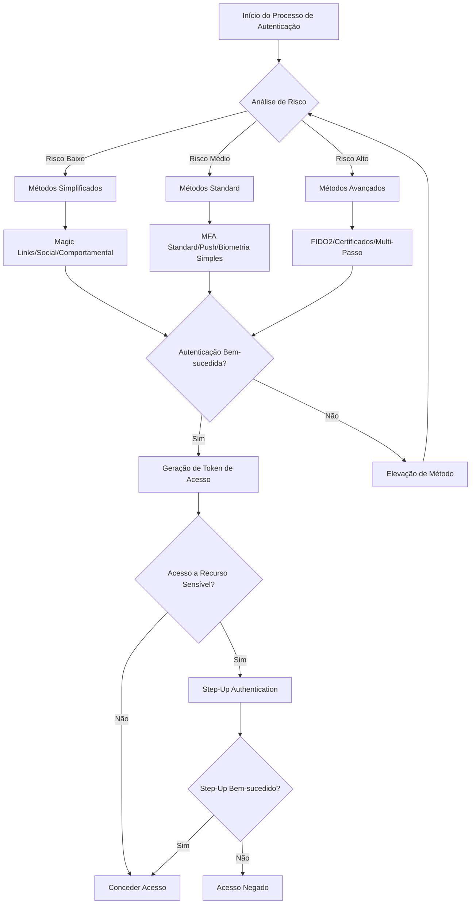

# 🔐 Catálogo de Métodos de Autenticação - INNOVABIZ IAM

## 📖 Visão Geral

Este catálogo abrangente documenta todos os métodos de autenticação disponíveis no módulo IAM da plataforma INNOVABIZ. A documentação foi estruturada em módulos específicos para maximizar a segurança, governança e conformidade, conforme os mais rígidos padrões internacionais, frameworks e boas práticas.

## 🌟 Princípios de Autenticação

```yaml
Authentication Principles:
  security_by_design:
    description: "Segurança incorporada desde o design inicial"
    implementation:
      - threat_modeling_proativo
      - princípio_do_menor_privilégio
      - defesa_em_profundidade
      - zero_trust_architecture
      
  privacy_by_design:
    description: "Privacidade como componente fundamental"
    implementation:
      - minimização_de_dados
      - proteção_de_templates_biométricos
      - controle_de_usuário
      - transparência_nos_processos
      
  adaptive_security:
    description: "Segurança que se adapta ao contexto e risco"
    implementation:
      - avaliação_dinâmica_de_risco
      - requisitos_baseados_em_contexto
      - autenticação_contínua
      - orquestração_inteligente
      
  user_experience:
    description: "Equilíbrio entre segurança e usabilidade"
    implementation:
      - fricção_apropriada
      - design_para_diversidade_cognitiva
      - inclusão_e_acessibilidade
      - educação_e_orientação
```

## 📚 Documentação de Métodos de Autenticação

### Módulos de Documentação

| Categoria | Descrição | Documento | Métodos | Principais Standards |
|-----------|-----------|-----------|---------|---------------------|
| **Biometria Física** | Autenticação por características físicas únicas | [BiometricPhysicalAuth.md](./BiometricPhysicalAuth.md) | 45+ | ISO/IEC 19794, 30107, FIDO, NIST 800-76 |
| **Biometria Comportamental** | Autenticação por padrões de comportamento | [BiometricBehavioralAuth.md](./BiometricBehavioralAuth.md) | 35+ | ISO/IEC 19795, NIST 800-63B |
| **Dispositivos** | Autenticação baseada em dispositivos físicos | [DeviceBasedAuth.md](./DeviceBasedAuth.md) | 35+ | FIDO2, NIST 800-63B, ISO/IEC 24761 |
| **Contextual** | Autenticação baseada em contexto e ambiente | [ContextualAuth.md](./ContextualAuth.md) | 30+ | NIST 800-63B, ISO/IEC 27001 |
| **Multi-Fator** | Combinações de múltiplos fatores de autenticação | [MultiFactorAuth.md](./MultiFactorAuth.md) | 35+ | NIST 800-63B, PSD2 SCA, ISO/IEC 27001 |
| **Sem Senha** | Métodos de autenticação que eliminam senhas | [PasswordlessAuth.md](./PasswordlessAuth.md) | 35+ | FIDO2/WebAuthn, NIST 800-63B |

## 🔍 Mapa de Navegação

### Por Nível de Segurança

```yaml
Security Levels:
  maximum_security:
    description: "Nível mais alto de proteção para recursos críticos"
    methods:
      - FIDO2 Roaming Authenticator
      - Quantum-Resistant MFA
      - Privileged Access MFA
      - Multi-Step Push Approval
      - Certificate + Biometric
      
  very_high_security:
    description: "Proteção muito robusta para dados e acessos sensíveis"
    methods:
      - Passkeys
      - Device + Biometric
      - Zero-Knowledge Proof
      - Continuous MFA
      - FIDO Platform Authenticator
      - Multimodal Biometrics
      - Certificate-Based Authentication
      
  high_security:
    description: "Forte proteção para dados corporativos e transações"
    methods:
      - Push with Biometric
      - Risk-Based MFA
      - Fingerprint Authentication
      - Transaction-Based MFA
      - Facial Authentication
      - Device Fingerprinting
      
  medium_security:
    description: "Segurança adequada para acessos gerais"
    methods:
      - Magic Links
      - Push Notifications
      - Social Login
      - Behavioral Biometrics
      - App Usage Patterns
```

### Por Experiência do Usuário

```yaml
User Experience:
  excellent:
    description: "Autenticação praticamente invisível ao usuário"
    methods:
      - Passkeys
      - Ambient Authentication
      - FIDO Platform Authenticators
      - Push Notifications
      - Device + Biometric
      - Behavioral Biometrics
      
  very_good:
    description: "Mínima fricção com alta segurança"
    methods:
      - FIDO2 Roaming Keys
      - Magic Links
      - Fingerprint Direct
      - Multimodal Biometrics
      - Push with Biometric
      
  good:
    description: "Equilíbrio entre segurança e conveniência"
    methods:
      - Zero-Knowledge Proof
      - Progressive MFA
      - Multi-Step Push Approval
      - Certificate-Based Authentication
      - Secure Email Link
```

### Por Caso de Uso

```yaml
Use Cases:
  corporate_access:
    recommended:
      - Enterprise SSO (Passwordless)
      - FIDO2 Authenticators
      - Privileged Access MFA
      - Risk-Based MFA
      - Device Posture Authentication
      
  consumer_applications:
    recommended:
      - Passkeys
      - Push Notifications
      - Magic Links
      - Social Login (Passwordless)
      - Behavioral Biometrics
      
  high_risk_transactions:
    recommended:
      - Transaction-Based MFA
      - FIDO2 Roaming Keys
      - Multi-Step Push Approval
      - Out-of-Band MFA
      - Certificate + Biometric
      
  iot_and_embedded:
    recommended:
      - IoT MFA
      - Device Fingerprinting
      - Certificate-Based Authentication
      - TEE-Based Authentication
      - Lightweight Authentication
      
  mobile_centric:
    recommended:
      - Push with Biometric
      - Device + Biometric
      - App Deep Links
      - Passkeys
      - Mobile Possession Proof
```

## 🛠️ Implementação e Integração

### Framework de Decisão

```yaml
Decision Framework:
  step1_risk_assessment:
    inputs:
      - resource_sensitivity
      - threat_landscape
      - user_population
      - regulatory_requirements
    outputs:
      - required_security_level
      
  step2_user_context:
    inputs:
      - user_demographics
      - device_capabilities
      - usage_patterns
      - accessibility_needs
    outputs:
      - suitable_method_categories
      
  step3_technical_feasibility:
    inputs:
      - existing_infrastructure
      - integration_requirements
      - operational_capacity
      - deployment_timeline
    outputs:
      - implementation_constraints
      
  step4_method_selection:
    inputs:
      - required_security_level
      - suitable_method_categories
      - implementation_constraints
      - user_experience_targets
    outputs:
      - primary_methods
      - fallback_methods
```

### Fluxograma de Autenticação



## 📋 Matriz de Conformidade

### Requisitos Regulatórios

| Framework | Nível Requerido | Métodos Qualificados | Documentos de Referência |
|-----------|-----------------|----------------------|-------------------------|
| **NIST 800-63B** | AAL3 | FIDO2, Certificados, MFA Hardware | [MultiFactorAuth.md](./MultiFactorAuth.md), [DeviceBasedAuth.md](./DeviceBasedAuth.md) |
| **PSD2 SCA** | Dois Fatores | Quaisquer combinações de categorias distintas | [MultiFactorAuth.md](./MultiFactorAuth.md) |
| **GDPR** | Medidas Técnicas Apropriadas | Varia conforme sensibilidade | Todos os módulos |
| **LGPD** | Medidas Apropriadas | Varia conforme sensibilidade | Todos os módulos |
| **eIDAS** | Substancial/Alto | Certificados, Tokens Físicos | [DeviceBasedAuth.md](./DeviceBasedAuth.md) |
| **PCI-DSS** | MFA para Admin | MFA com Hardware recomendado | [MultiFactorAuth.md](./MultiFactorAuth.md) |

### Standards Técnicos

| Standard | Elementos Suportados | Métodos Compatíveis | Documentos de Referência |
|----------|----------------------|---------------------|-------------------------|
| **FIDO2/WebAuthn** | Plataforma e Roaming | Chaves de Segurança, Passkeys | [PasswordlessAuth.md](./PasswordlessAuth.md) |
| **ISO/IEC 19794** | Biometria Física | Impressão Digital, Face, Íris | [BiometricPhysicalAuth.md](./BiometricPhysicalAuth.md) |
| **ISO/IEC 27001** | Controles de Acesso | Todos os métodos | Todos os módulos |
| **OAuth 2.0/OIDC** | Fluxos de Autenticação | Social, Enterprise SSO | [PasswordlessAuth.md](./PasswordlessAuth.md) |
| **SAML 2.0** | Federação de Identidades | Enterprise SSO | [PasswordlessAuth.md](./PasswordlessAuth.md) |

## 🔄 Integração com Outros Componentes IAM

```yaml
IAM Component Integration:
  identity_lifecycle:
    touch_points:
      - enrollment
      - credentials_issuance
      - credentials_rotation
      - account_recovery
      - deprovisioning
      
  access_management:
    touch_points:
      - authentication_context
      - authorization_decisions
      - session_management
      - adaptive_policies
      
  governance_and_compliance:
    touch_points:
      - authentication_strength_evidence
      - audit_trail_generation
      - regulatory_reporting
      - certification_documentation
      
  user_management:
    touch_points:
      - self_service_enrollment
      - preference_management
      - device_management
      - help_desk_operations
```

## 📈 Roadmap de Evolução

```yaml
Authentication Roadmap:
  current_quarter:
    - FIDO2 WebAuthn implementation
    - Risk-based authentication engine
    - Push notification enhancements
    
  next_quarter:
    - Passkeys support expansion
    - Behavioral biometrics integration
    - Quantum-resistant cryptography research
    
  six_month_horizon:
    - Decentralized identity exploration
    - Zero-knowledge authentication pilot
    - Continuous authentication enhancements
    
  one_year_horizon:
    - AI-enhanced authentication patterns
    - Cross-platform biometric standards
    - Next-generation token integration
```

## 📚 Recursos Adicionais

### Documentação Interna Relacionada

- **Políticas de Autenticação**: `/CoreModules/IAM/policies/authentication/`
- **Arquitetura de Autenticação**: `/CoreModules/IAM/architecture/authentication/`
- **Guias de Implementação**: `/CoreModules/IAM/implementation/authentication/`
- **Material de Treinamento**: `/CoreModules/IAM/training/authentication/`

### Referências Externas

- NIST Special Publication 800-63B: Digital Identity Guidelines
- FIDO Alliance: WebAuthn & CTAP Specifications
- Gartner: Market Guide for User Authentication
- ISO/IEC Standards: 29115, 27001, 19794, 24761
- OWASP: Authentication Cheat Sheet

---

*Documento Preparado pelo Time de Segurança INNOVABIZ | Última Atualização: 31/07/2025*