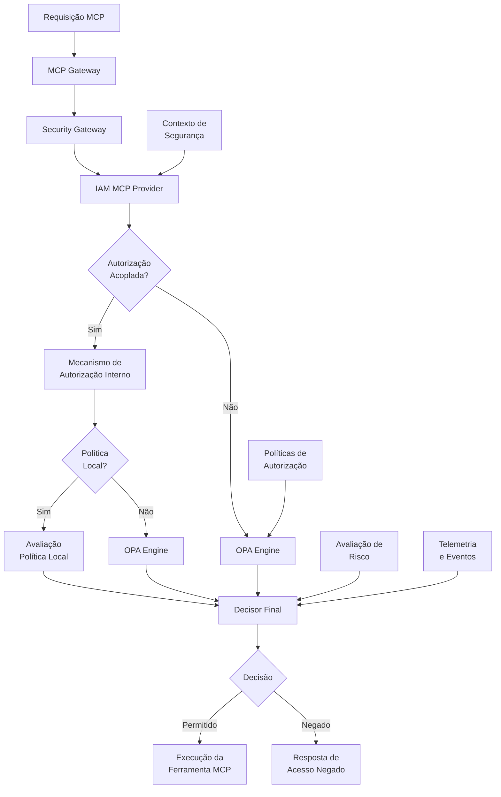

# Autorização Avançada para MCP-IAM

## 1. Introdução

Este documento define os mecanismos avançados de autorização implementados na integração MCP-IAM (Model Context Protocol - Identity and Access Management) da plataforma INNOVABIZ. O sistema de autorização avançada visa proporcionar controle granular, contextual e dinâmico para acesso às ferramentas MCP, garantindo segurança robusta com experiência fluida para usuários autorizados.

### 1.1. Objetivos

- Estabelecer um modelo de autorização extensível e resiliente
- Definir padrões para autorização contextual baseada em múltiplos fatores
- Implementar controles de segurança adaptativos conforme perfil de risco
- Garantir auditabilidade completa de decisões de autorização
- Facilitar compliance com regulamentações (GDPR, LGPD, PCI-DSS, etc.)
- Habilitar delegação segura de permissões e acesso temporário elevado

### 1.2. Princípios de Design

O sistema de autorização avançada para MCP-IAM é fundamentado nos seguintes princípios:

- **Defesa em profundidade**: Múltiplas camadas de controle de acesso
- **Privilégio mínimo**: Conceder apenas permissões essenciais para cada função
- **Contextualização**: Incorporar fatores contextuais nas decisões de autorização
- **Separação de responsabilidades**: Dividir controle sobre recursos críticos
- **Adaptabilidade dinâmica**: Ajustar controles conforme perfil de risco em tempo real
- **Auditabilidade completa**: Registrar todas as decisões com justificativa detalhada
- **Resiliência**: Manter segurança mesmo em cenários de falha ou degradação
- **Usabilidade**: Equilibrar segurança com experiência do usuário

## 2. Arquitetura do Sistema de Autorização

### 2.1. Visão Geral da Arquitetura



### 2.2. Componentes Principais

| Componente | Descrição | Responsabilidade |
|------------|-----------|------------------|
| Security Gateway | Gateway de segurança unificado | Ponto central de interceptação de requisições |
| IAM MCP Provider | Provedor IAM para MCP | Autenticação e enriquecimento de contexto |
| OPA Engine | Motor de políticas OPA | Avaliação de políticas Rego |
| Policy Store | Repositório de políticas | Armazenamento e distribuição de políticas |
| Context Evaluator | Avaliador de contexto | Análise de fatores contextuais |
| Risk Engine | Motor de avaliação de risco | Cálculo dinâmico de nível de risco |
| Decision Logger | Registrador de decisões | Auditoria de todas as decisões |
| Dynamic Role Resolver | Resolvedor dinâmico de papéis | Cálculo de papéis em tempo real |

### 2.3. Fluxo de Autorização

O processo de autorização segue estas etapas:

1. **Interceptação**: A requisição MCP é interceptada pelo Security Gateway
2. **Autenticação**: O IAM MCP Provider valida a identidade do usuário
3. **Enriquecimento de contexto**: Informações contextuais são agregadas
4. **Avaliação de risco**: O nível de risco da operação é calculado
5. **Resolução de papéis**: Os papéis dinâmicos são calculados
6. **Avaliação de políticas**: As políticas OPA avaliam a permissão
7. **Decisão final**: Com base nas políticas e no risco, a decisão é tomada
8. **Auditoria**: A decisão e seu contexto são registrados
9. **Execução ou bloqueio**: A ferramenta MCP é executada ou a requisição é rejeitada

## 3. Modelos de Autorização Implementados

A autorização avançada MCP-IAM implementa múltiplos modelos complementares:

### 3.1. RBAC (Role-Based Access Control)

O RBAC tradicional é estendido com hierarquias de papéis e herança:

```json
{
  "roles": {
    "admin": {
      "description": "Administrador do sistema",
      "inherits": ["manager", "developer"],
      "permissions": ["admin.*"]
    },
    "manager": {
      "description": "Gerente de equipe",
      "inherits": ["developer"],
      "permissions": ["team.*", "project.*"]
    },
    "developer": {
      "description": "Desenvolvedor",
      "inherits": ["user"],
      "permissions": ["code.*", "deploy.dev"]
    },
    "user": {
      "description": "Usuário básico",
      "permissions": ["read.*"]
    }
  }
}
```

### 3.2. ABAC (Attribute-Based Access Control)

O ABAC utiliza atributos do usuário, recurso, ação e ambiente:

```go
// Exemplo de política ABAC em Rego
package innovabiz.mcp.abac

import data.attributes

allow {
    # Verificar atributos do usuário
    input.user.clearance_level >= data.attributes.resources[input.resource.id].required_clearance
    
    # Verificar atributos do ambiente
    input.context.time_of_day >= data.attributes.actions[input.action.id].allowed_time_start
    input.context.time_of_day <= data.attributes.actions[input.action.id].allowed_time_end
    
    # Verificar atributos da ação
    not input.action.criticality == "high" or input.user.training_level == "advanced"
}
```

### 3.3. ReBAC (Relationship-Based Access Control)

O ReBAC define acesso baseado em relacionamentos entre entidades:

```json
{
  "entities": {
    "user:alice": {
      "relationships": {
        "member_of": ["team:engineering", "project:alpha"],
        "owns": ["document:spec123", "repo:frontend"],
        "manages": ["team:qa"]
      }
    },
    "document:spec123": {
      "relationships": {
        "part_of": ["project:alpha"]
      }
    }
  },
  "rules": [
    {
      "description": "Usuários podem acessar documentos de projetos que são membros",
      "permission": "read",
      "relationship_path": ["member_of", "contains", "*"]
    },
    {
      "description": "Proprietários podem modificar seus documentos",
      "permission": "write",
      "relationship_path": ["owns"]
    }
  ]
}
```

### 3.4. CBAC (Context-Based Access Control)

O CBAC avalia fatores contextuais para decisões adaptativas:

```go
// Exemplo de política CBAC em Rego
package innovabiz.mcp.cbac

import data.context_factors

default allow = false

allow {
    # Verificar segurança do dispositivo
    input.context.device.security_score >= 80
    
    # Verificar localização
    is_allowed_location(input.context.location)
    
    # Verificar horário de acesso
    is_business_hours(input.context.timestamp)
    
    # Verificar comportamento normal
    input.context.anomaly_score < 0.3
}

is_allowed_location(loc) {
    data.context_factors.allowed_locations[loc]
}

is_business_hours(ts) {
    hour := time.parse_rfc3339_ns(ts)[0:5]
    hour >= 8
    hour <= 18
}
```## 4. Mecanismos Avançados de Autorização

### 4.1. Autorização Dinâmica Baseada em Risco

O sistema implementa autorização adaptativa baseada no perfil de risco da requisição:

```go
// Exemplo de cálculo de risco em Go
func CalculateRiskScore(ctx *SecurityContext) float64 {
    var riskScore float64 = 0.0
    
    // Fatores base de risco
    baseRisk := map[string]float64{
        "low":      0.2,
        "medium":   0.5,
        "high":     0.8,
        "critical": 1.0,
    }
    
    // Risco base da ferramenta
    toolRisk := getToolRiskLevel(ctx.Tool.Name)
    riskScore += baseRisk[toolRisk]
    
    // Fatores de aumento de risco
    if !ctx.User.MFAVerified {
        riskScore += 0.3
    }
    
    if isNewDevice(ctx.User.ID, ctx.Device.Fingerprint) {
        riskScore += 0.2
    }
    
    if isAnomalousTime(ctx.User.ID, ctx.Timestamp) {
        riskScore += 0.15
    }
    
    if isAnomalousLocation(ctx.User.ID, ctx.GeoLocation) {
        riskScore += 0.25
    }
    
    // Fatores de mitigação de risco
    if ctx.User.SecurityTrainingCompleted {
        riskScore -= 0.1
    }
    
    if ctx.User.RiskHistory < 0.2 { // Bom histórico
        riskScore -= 0.05
    }
    
    // Normalizar entre 0 e 1
    if riskScore < 0 {
        riskScore = 0
    } else if riskScore > 1 {
        riskScore = 1
    }
    
    return riskScore
}
```

A avaliação de risco afeta as decisões de autorização das seguintes formas:

| Nível de Risco | Pontuação | Impacto na Autorização |
|----------------|-----------|------------------------|
| Baixo | 0.0 - 0.3 | Controles padrão aplicados |
| Médio | 0.3 - 0.6 | Requer MFA para operações sensíveis |
| Alto | 0.6 - 0.8 | Requer aprovação adicional e limita escopo de operações |
| Crítico | 0.8 - 1.0 | Acesso negado para operações sensíveis, alerta de segurança gerado |

### 4.2. Autorização Just-in-Time (JIT) e Elevação Temporária

O sistema suporta elevação temporária de privilégios com aprovações:

```go
type ElevationRequest struct {
    UserID        string    `json:"user_id"`
    Role          string    `json:"role"`
    Reason        string    `json:"reason"`
    Duration      int       `json:"duration_minutes"`
    ApproverID    string    `json:"approver_id,omitempty"`
    Status        string    `json:"status"`
    RequestedAt   time.Time `json:"requested_at"`
    ExpiresAt     time.Time `json:"expires_at"`
    ApprovalTasks []string  `json:"approval_tasks,omitempty"`
}

func (a *AuthorizationService) RequestElevation(req ElevationRequest) (*ElevationRequest, error) {
    // Verificar se o usuário pode solicitar esta elevação
    if !a.canRequestRole(req.UserID, req.Role) {
        return nil, errors.New("usuário não autorizado a solicitar este papel")
    }
    
    // Limitar duração máxima de elevação
    if req.Duration > a.config.MaxElevationDuration {
        req.Duration = a.config.MaxElevationDuration
    }
    
    // Calcular data de expiração
    req.RequestedAt = time.Now()
    req.ExpiresAt = req.RequestedAt.Add(time.Minute * time.Duration(req.Duration))
    
    // Definir status inicial
    req.Status = "pending"
    
    // Gerar tarefas de aprovação
    approvers := a.getApproversForRole(req.Role)
    for _, approver := range approvers {
        taskID := a.createApprovalTask(approver, req)
        req.ApprovalTasks = append(req.ApprovalTasks, taskID)
    }
    
    // Persistir solicitação
    err := a.storage.SaveElevationRequest(req)
    if err != nil {
        return nil, err
    }
    
    // Notificar aprovadores
    a.notifyApprovers(req)
    
    return &req, nil
}

func (a *AuthorizationService) ActivateElevation(requestID string) error {
    // Recuperar solicitação
    req, err := a.storage.GetElevationRequest(requestID)
    if err != nil {
        return err
    }
    
    // Verificar se todas as aprovações foram concedidas
    if !a.allApprovalsGranted(req) {
        return errors.New("nem todas as aprovações foram concedidas")
    }
    
    // Verificar se não expirou
    if time.Now().After(req.ExpiresAt) {
        return errors.New("solicitação expirada")
    }
    
    // Ativar papel temporário
    err = a.roleManager.GrantTemporaryRole(req.UserID, req.Role, req.ExpiresAt)
    if err != nil {
        return err
    }
    
    // Atualizar status
    req.Status = "active"
    err = a.storage.UpdateElevationRequest(*req)
    if err != nil {
        return err
    }
    
    // Registrar em auditoria
    a.auditLogger.Log(AuditEvent{
        Type:      "role_elevation",
        UserID:    req.UserID,
        Role:      req.Role,
        Reason:    req.Reason,
        ExpiresAt: req.ExpiresAt,
    })
    
    return nil
}
```

### 4.3. Delegação de Autoridade

A delegação permite transferência temporária de responsabilidades:

```go
type DelegationConfig struct {
    DelegatorID      string    `json:"delegator_id"`
    DelegateID       string    `json:"delegate_id"`
    Permissions      []string  `json:"permissions"`
    Resources        []string  `json:"resources"`
    StartTime        time.Time `json:"start_time"`
    EndTime          time.Time `json:"end_time"`
    Reason           string    `json:"reason"`
    ApproverID       string    `json:"approver_id,omitempty"`
    RequiresApproval bool      `json:"requires_approval"`
    Active           bool      `json:"active"`
}

func (a *AuthorizationService) CreateDelegation(config DelegationConfig) (*DelegationConfig, error) {
    // Verificar se o delegador tem as permissões que está tentando delegar
    if !a.hasAllPermissions(config.DelegatorID, config.Permissions) {
        return nil, errors.New("delegador não possui todas as permissões que está tentando delegar")
    }
    
    // Verificar duração máxima
    maxDuration := 7 * 24 * time.Hour // 7 dias
    if config.EndTime.Sub(config.StartTime) > maxDuration {
        config.EndTime = config.StartTime.Add(maxDuration)
    }
    
    // Determinar se requer aprovação
    config.RequiresApproval = a.isDelegationSensitive(config)
    
    // Se não requer aprovação, ativar imediatamente
    if !config.RequiresApproval {
        config.Active = true
    } else {
        config.Active = false
        // Criar tarefa de aprovação
        a.createDelegationApprovalTask(config)
    }
    
    // Persistir configuração
    err := a.storage.SaveDelegationConfig(config)
    if err != nil {
        return nil, err
    }
    
    // Registrar em auditoria
    a.auditLogger.Log(AuditEvent{
        Type:       "delegation_created",
        DelegatorID: config.DelegatorID,
        DelegateID:  config.DelegateID,
        Details:     fmt.Sprintf("Delegação criada para %d permissões", len(config.Permissions)),
    })
    
    return &config, nil
}

func (a *AuthorizationService) IsDelegatedPermission(userID, permission, resource string) bool {
    // Buscar delegações ativas para o usuário
    delegations := a.storage.GetActiveDelegationsForUser(userID)
    
    for _, delegation := range delegations {
        // Verificar se a delegação está ativa no momento atual
        now := time.Now()
        if !delegation.Active || now.Before(delegation.StartTime) || now.After(delegation.EndTime) {
            continue
        }
        
        // Verificar se a permissão está incluída
        if containsPermission(delegation.Permissions, permission) && 
           containsResource(delegation.Resources, resource) {
            // Registrar uso de permissão delegada em auditoria
            a.auditLogger.Log(AuditEvent{
                Type:        "delegated_permission_used",
                UserID:      userID,
                DelegatorID: delegation.DelegatorID,
                Permission:  permission,
                Resource:    resource,
            })
            return true
        }
    }
    
    return false
}
```

### 4.4. Políticas de Autorização Avançadas

Exemplo de política OPA para implementação de quorum/aprovação múltipla:

```rego
package innovabiz.mcp.advanced_authz

import data.innovabiz.common.utils
import data.innovabiz.mcp.approvals

# Regra para operações que requerem quorum de aprovação
allow_with_quorum {
    # Verificar se a operação requer quorum
    operation := input.tool.name
    quorum_config := data.quorum_operations[operation]
    
    # Verificar se há configuração de quorum
    quorum_config
    
    # Verificar se o número mínimo de aprovações foi atingido
    approval_info := approvals.get_approval_info(input.request_id)
    count(approval_info.approvers) >= quorum_config.min_approvals
    
    # Verificar requisito de diversidade de papéis (se aplicável)
    not quorum_config.requires_role_diversity or has_diverse_role_approvals(approval_info.approvers, quorum_config.required_roles)
}

# Verificar diversidade de papéis nas aprovações
has_diverse_role_approvals(approvers, required_roles) {
    # Para cada papel exigido, verificar se há pelo menos um aprovador com esse papel
    role := required_roles[_]
    approver := approvers[_]
    user_roles := data.user_roles[approver]
    role_match(user_roles, role)
}

# Verificar correspondência de papel
role_match(user_roles, required_role) {
    # Correspondência direta
    user_role := user_roles[_]
    user_role == required_role
}

role_match(user_roles, required_role) {
    # Correspondência por herança
    user_role := user_roles[_]
    data.role_hierarchy[user_role][_] == required_role
}
```

## 5. Implementação de Segurança por Design

### 5.1. Segregação de Deveres (SoD)

A segregação de deveres é implementada através de políticas de conflito:

```go
type SoDRule struct {
    ID           string   `json:"id"`
    Name         string   `json:"name"`
    Description  string   `json:"description"`
    ConflictSets []string `json:"conflict_sets"` // IDs de conjuntos conflitantes
    Severity     string   `json:"severity"`      // "warning" ou "violation"
    Enabled      bool     `json:"enabled"`
}

type ConflictSet struct {
    ID          string   `json:"id"`
    Name        string   `json:"name"`
    Description string   `json:"description"`
    Roles       []string `json:"roles,omitempty"`
    Permissions []string `json:"permissions,omitempty"`
    Resources   []string `json:"resources,omitempty"`
    Operations  []string `json:"operations,omitempty"`
}

func (a *AuthorizationService) CheckSoDViolations(userID string) []SoDViolation {
    var violations []SoDViolation
    
    // Recuperar todas as regras SoD ativas
    rules := a.storage.GetActiveSoDRules()
    
    for _, rule := range rules {
        if !rule.Enabled {
            continue
        }
        
        // Para cada regra, verificar se o usuário tem permissões conflitantes
        conflictSets := a.getConflictSets(rule.ConflictSets)
        
        // Se o usuário tiver permissões de mais de um conjunto conflitante,
        // há uma violação
        matchedSets := []string{}
        
        for _, set := range conflictSets {
            if a.userMatchesConflictSet(userID, set) {
                matchedSets = append(matchedSets, set.ID)
            }
        }
        
        // Se houver mais de um conjunto conflitante com permissões do usuário
        if len(matchedSets) > 1 {
            violations = append(violations, SoDViolation{
                RuleID:      rule.ID,
                UserID:      userID,
                MatchedSets: matchedSets,
                Severity:    rule.Severity,
                DetectedAt:  time.Now(),
            })
        }
    }
    
    // Registrar violações em log de auditoria
    for _, violation := range violations {
        a.auditLogger.Log(AuditEvent{
            Type:    "sod_violation_detected",
            UserID:  userID,
            Details: fmt.Sprintf("Violação SoD: %s (Gravidade: %s)", violation.RuleID, violation.Severity),
        })
        
        // Para violações críticas, acionar alertas
        if violation.Severity == "violation" {
            a.alertManager.TriggerAlert(Alert{
                Type:    "security",
                Level:   "high",
                Subject: "Violação de Segregação de Deveres detectada",
                Details: fmt.Sprintf("Usuário %s com permissões conflitantes (%s)", userID, violation.RuleID),
            })
        }
    }
    
    return violations
}
```

### 5.2. Controle de Acesso em Escala

Para gerenciar a escala do sistema MCP-IAM, são implementadas estratégias de otimização:

```go
// Estrutura de cache de decisões de autorização
type AuthzDecisionCache struct {
    cache      *lru.Cache
    ttl        time.Duration
    mutex      sync.RWMutex
    hitCounter *metrics.Counter
    missCounter *metrics.Counter
}

// Chave do cache composta por identidade, recurso e contexto relevante
type DecisionCacheKey struct {
    UserID      string
    TenantID    string
    Tool        string
    Resource    string
    ContextHash string // Hash de elementos contextuais relevantes
}

func (c *AuthzDecisionCache) GetCachedDecision(key DecisionCacheKey) (Decision, bool) {
    c.mutex.RLock()
    defer c.mutex.RUnlock()
    
    if value, found := c.cache.Get(key); found {
        // Verificar se a decisão expirou
        decision := value.(CachedDecision)
        if time.Since(decision.CachedAt) < c.ttl {
            c.hitCounter.Inc()
            return decision.Decision, true
        }
    }
    
    c.missCounter.Inc()
    return Decision{}, false
}

func (c *AuthzDecisionCache) CacheDecision(key DecisionCacheKey, decision Decision) {
    c.mutex.Lock()
    defer c.mutex.Unlock()
    
    c.cache.Add(key, CachedDecision{
        Decision: decision,
        CachedAt: time.Now(),
    })
}

// Invalidar cache seletivamente quando políticas ou contexto mudam
func (c *AuthzDecisionCache) InvalidateForUser(userID string) {
    c.mutex.Lock()
    defer c.mutex.Unlock()
    
    // Percorrer todas as chaves e remover entradas para o usuário
    for _, key := range c.cache.Keys() {
        if k, ok := key.(DecisionCacheKey); ok && k.UserID == userID {
            c.cache.Remove(key)
        }
    }
}

func (c *AuthzDecisionCache) InvalidateForTenant(tenantID string) {
    c.mutex.Lock()
    defer c.mutex.Unlock()
    
    // Percorrer todas as chaves e remover entradas para o tenant
    for _, key := range c.cache.Keys() {
        if k, ok := key.(DecisionCacheKey); ok && k.TenantID == tenantID {
            c.cache.Remove(key)
        }
    }
}

func (c *AuthzDecisionCache) InvalidateAll() {
    c.mutex.Lock()
    defer c.mutex.Unlock()
    
    c.cache.Purge()
}
```

### 5.3. Detecção de Anomalias e Resposta Adaptativa

O sistema implementa detecção de anomalias em tempo real:

```go
// Detector de anomalias baseado em perfil de comportamento
type AnomalyDetector struct {
    storage        Storage
    profileManager UserProfileManager
    alertThreshold float64
    trainInterval  time.Duration
    lastTrained    map[string]time.Time
    mutex          sync.RWMutex
}

// Análise de anomalia para uma requisição
func (d *AnomalyDetector) AnalyzeRequest(ctx *SecurityContext) float64 {
    d.mutex.RLock()
    lastTrainTime, exists := d.lastTrained[ctx.User.ID]
    d.mutex.RUnlock()
    
    // Treinar modelo se necessário
    if !exists || time.Since(lastTrainTime) > d.trainInterval {
        d.trainUserProfile(ctx.User.ID)
    }
    
    // Recuperar perfil do usuário
    profile, err := d.profileManager.GetUserProfile(ctx.User.ID)
    if err != nil {
        // Se não houver perfil, não há como detectar anomalias
        return 0.0
    }
    
    // Calcular pontuação de anomalia
    anomalyScore := 0.0
    
    // Verificar padrões temporais
    timeFeature := extractTimeFeature(ctx.Timestamp)
    anomalyScore += profile.TimeModel.CalculateDeviation(timeFeature)
    
    // Verificar padrões de localização
    locationFeature := extractLocationFeature(ctx.GeoLocation)
    anomalyScore += profile.LocationModel.CalculateDeviation(locationFeature)
    
    // Verificar padrões de ferramentas usadas
    toolFeature := extractToolFeature(ctx.Tool)
    anomalyScore += profile.ToolModel.CalculateDeviation(toolFeature)
    
    // Verificar padrões de recursos acessados
    resourceFeature := extractResourceFeature(ctx.Resource)
    anomalyScore += profile.ResourceModel.CalculateDeviation(resourceFeature)
    
    // Normalizar pontuação
    anomalyScore = normalizeAnomalyScore(anomalyScore)
    
    // Registrar pontuação para auditoria
    if anomalyScore > d.alertThreshold {
        d.logAnomalyEvent(ctx, anomalyScore)
    }
    
    // Atualizar perfil com novos dados (feedback online)
    d.profileManager.UpdateProfileWithRequest(ctx.User.ID, ctx)
    
    return anomalyScore
}

// Treinar modelo de usuário com dados históricos
func (d *AnomalyDetector) trainUserProfile(userID string) {
    // Recuperar histórico de requisições do usuário
    history, err := d.storage.GetUserRequestHistory(userID, 1000)
    if err != nil {
        return
    }
    
    // Criar novo perfil ou atualizar existente
    profile, _ := d.profileManager.GetUserProfile(userID)
    if profile == nil {
        profile = NewUserProfile(userID)
    }
    
    // Extrair características e treinar modelos
    for _, req := range history {
        timeFeature := extractTimeFeature(req.Timestamp)
        locationFeature := extractLocationFeature(req.GeoLocation)
        toolFeature := extractToolFeature(req.Tool)
        resourceFeature := extractResourceFeature(req.Resource)
        
        profile.TimeModel.Train(timeFeature)
        profile.LocationModel.Train(locationFeature)
        profile.ToolModel.Train(toolFeature)
        profile.ResourceModel.Train(resourceFeature)
    }
    
    // Salvar perfil atualizado
    d.profileManager.SaveUserProfile(userID, profile)
    
    // Atualizar timestamp de treinamento
    d.mutex.Lock()
    d.lastTrained[userID] = time.Now()
    d.mutex.Unlock()
}
```

## 6. Integração com Servidores MCP### 6.1. Integração com MCP_DOCKER

A integração com o servidor MCP_DOCKER implementa controles específicos para operações de contêineres e Kubernetes:

```go
// Hooks de autorização para operações Docker/Kubernetes
type DockerAuthzHooks struct {
    baseAuthorizer    Authorizer
    k8sRBACResolver   KubernetesRBACResolver
    imageRegistry     ImageRegistryService
    namespaceManager  NamespaceManager
    complianceChecker ComplianceChecker
    auditLogger       AuditLogger
}

func (h *DockerAuthzHooks) PreExecuteHook(ctx *SecurityContext, request *ToolRequest) (bool, string, error) {
    // Verificar autorização base
    allowed, reason, err := h.baseAuthorizer.Authorize(ctx, request)
    if !allowed || err != nil {
        return allowed, reason, err
    }
    
    // Extrair parâmetros específicos de Docker/K8s
    switch request.Tool.Name {
    case "mcp0_kubectl_get", "mcp0_kubectl_describe", "mcp0_kubectl_logs":
        return h.authorizeK8sRead(ctx, request)
    case "mcp0_kubectl_apply", "mcp0_kubectl_create":
        return h.authorizeK8sWrite(ctx, request)
    case "mcp0_kubectl_delete":
        return h.authorizeK8sDelete(ctx, request)
    case "mcp0_docker":
        return h.authorizeDockerCommand(ctx, request)
    case "mcp0_exec_in_pod":
        return h.authorizePodExec(ctx, request)
    default:
        // Ferramentas não reconhecidas usam apenas autorização base
        return true, "", nil
    }
}

func (h *DockerAuthzHooks) authorizeK8sRead(ctx *SecurityContext, request *ToolRequest) (bool, string, error) {
    params := request.Tool.Parameters
    
    // Verificar autorização RBAC do Kubernetes (se disponível)
    if h.k8sRBACResolver != nil {
        namespace := getStringParam(params, "namespace", "default")
        resource := getStringParam(params, "resourceType", "")
        
        allowed, err := h.k8sRBACResolver.CanView(ctx.User.ID, namespace, resource)
        if err != nil {
            return false, "", err
        }
        if !allowed {
            return false, fmt.Sprintf("RBAC Kubernetes nega acesso de leitura ao recurso %s no namespace %s", resource, namespace), nil
        }
    }
    
    // Verificar sensibilidade do namespace
    namespace := getStringParam(params, "namespace", "default")
    if h.namespaceManager.IsRestrictedNamespace(namespace) {
        // Para namespaces restritos, verificar papéis especiais
        if !hasAdminRole(ctx.User.Roles) {
            return false, fmt.Sprintf("Acesso ao namespace restrito %s requer papel administrativo", namespace), nil
        }
    }
    
    // Verificar conformidade com política de dados
    if resource := getStringParam(params, "resourceType", ""); resource == "secrets" {
        // Verificar conformidade para acesso a segredos
        compliant, reason := h.complianceChecker.CheckDataAccess(ctx, "k8s_secrets", namespace)
        if !compliant {
            return false, reason, nil
        }
        
        // Registrar acesso a dados sensíveis em auditoria
        h.auditLogger.LogSensitiveDataAccess(ctx, "k8s_secrets", namespace)
    }
    
    return true, "", nil
}

func (h *DockerAuthzHooks) authorizeK8sWrite(ctx *SecurityContext, request *ToolRequest) (bool, string, error) {
    params := request.Tool.Parameters
    namespace := getStringParam(params, "namespace", "default")
    
    // Verificar se a escrita no namespace é permitida
    if h.namespaceManager.IsRestrictedNamespace(namespace) {
        // Namespaces restritos requerem aprovação específica
        if !ctx.Approvals.HasApproval("k8s_write_restricted", namespace) {
            return false, fmt.Sprintf("Escrita no namespace restrito %s requer aprovação específica", namespace), nil
        }
    }
    
    // Verificar conformidade de manifesto (se aplicável)
    if manifest := getStringParam(params, "manifest", ""); manifest != "" {
        compliant, reason, err := h.complianceChecker.ValidateK8sManifest(manifest)
        if err != nil {
            return false, "", err
        }
        if !compliant {
            return false, reason, nil
        }
    }
    
    // Verificar imagens de contêiner (para deployments, pods, etc.)
    if manifest := getStringParam(params, "manifest", ""); manifest != "" && containsContainerSpec(manifest) {
        // Extrair imagens do manifesto
        images, err := extractImagesFromManifest(manifest)
        if err != nil {
            return false, "", err
        }
        
        // Verificar cada imagem contra a política de imagens
        for _, image := range images {
            allowed, reason := h.imageRegistry.IsAllowedImage(ctx.User.TenantID, image)
            if !allowed {
                return false, fmt.Sprintf("Imagem não permitida: %s - %s", image, reason), nil
            }
        }
    }
    
    // Registrar operação de escrita em auditoria
    h.auditLogger.LogK8sWrite(ctx, namespace, request.Tool.Name)
    
    return true, "", nil
}

func (h *DockerAuthzHooks) authorizeK8sDelete(ctx *SecurityContext, request *ToolRequest) (bool, string, error) {
    params := request.Tool.Parameters
    namespace := getStringParam(params, "namespace", "default")
    resourceType := getStringParam(params, "resourceType", "")
    name := getStringParam(params, "name", "")
    
    // Verificar se a exclusão é de alto risco
    isHighRisk := h.isHighRiskDeletion(namespace, resourceType, name)
    
    if isHighRisk {
        // Operações de alto risco requerem MFA recente
        if !ctx.User.MFAVerified {
            return false, "Operação de exclusão de alto risco requer verificação MFA recente", nil
        }
        
        // Verificar aprovação para exclusão de alto risco
        if !ctx.Approvals.HasApproval("k8s_delete_high_risk", fmt.Sprintf("%s/%s/%s", namespace, resourceType, name)) {
            return false, "Exclusão de recurso crítico requer aprovação específica", nil
        }
    }
    
    // Verificar restrições por ambiente
    if ctx.Environment.Name == "production" && !hasProductionDeleteAccess(ctx.User.Roles) {
        return false, "Exclusão em ambiente de produção restrita a papéis específicos", nil
    }
    
    // Registrar operação de exclusão em auditoria com severidade alta
    h.auditLogger.LogK8sDelete(ctx, namespace, resourceType, name, isHighRisk)
    
    return true, "", nil
}

func (h *DockerAuthzHooks) authorizeDockerCommand(ctx *SecurityContext, request *ToolRequest) (bool, string, error) {
    params := request.Tool.Parameters
    args := getStringArrayParam(params, "args")
    
    // Verificar comandos Docker de alto risco
    if len(args) > 0 {
        command := args[0]
        
        switch command {
        case "run", "exec":
            // Verificar permissão para execução de contêineres
            if !hasContainerExecPermission(ctx.User.Roles) {
                return false, "Sem permissão para executar contêineres", nil
            }
            
            // Para comando run, verificar imagem
            if command == "run" && len(args) > 1 {
                imageArg := findImageArg(args)
                if imageArg != "" {
                    allowed, reason := h.imageRegistry.IsAllowedImage(ctx.User.TenantID, imageArg)
                    if !allowed {
                        return false, fmt.Sprintf("Imagem não permitida: %s - %s", imageArg, reason), nil
                    }
                }
            }
            
        case "rm", "rmi", "kill", "stop":
            // Verificar permissão para gerenciar ciclo de vida de contêineres
            if !hasContainerLifecyclePermission(ctx.User.Roles) {
                return false, "Sem permissão para gerenciar ciclo de vida de contêineres", nil
            }
            
        case "system", "daemon":
            // Operações de sistema são altamente restritas
            if !hasDockerSystemPermission(ctx.User.Roles) {
                return false, "Operações de sistema Docker restritas a administradores", nil
            }
        }
    }
    
    // Verificar comandos bloqueados
    for _, blockedPattern := range h.getBlockedCommandPatterns() {
        if commandMatchesPattern(args, blockedPattern) {
            return false, fmt.Sprintf("Comando Docker bloqueado por política de segurança: %s", blockedPattern), nil
        }
    }
    
    return true, "", nil
}

func (h *DockerAuthzHooks) authorizePodExec(ctx *SecurityContext, request *ToolRequest) (bool, string, error) {
    params := request.Tool.Parameters
    namespace := getStringParam(params, "namespace", "default")
    podName := getStringParam(params, "name", "")
    command := getCommandParam(params, "command")
    
    // Verificar acesso ao namespace
    if h.namespaceManager.IsRestrictedNamespace(namespace) {
        if !hasAdminRole(ctx.User.Roles) {
            return false, fmt.Sprintf("Execução em pods no namespace restrito %s requer papel administrativo", namespace), nil
        }
    }
    
    // Verificar comandos bloqueados
    for _, blockedPattern := range h.getBlockedExecPatterns() {
        if execCommandMatchesPattern(command, blockedPattern) {
            return false, fmt.Sprintf("Comando exec bloqueado por política de segurança: %s", blockedPattern), nil
        }
    }
    
    // Para pods com containers privilegiados, verificação adicional
    if h.isPodPrivileged(namespace, podName) {
        if !ctx.User.MFAVerified {
            return false, "Execução em pods privilegiados requer verificação MFA recente", nil
        }
        
        if !hasElevatedAccessRole(ctx.User.Roles) {
            return false, "Execução em pods privilegiados requer papel com acesso elevado", nil
        }
    }
    
    // Registrar em auditoria com detalhe de comando
    h.auditLogger.LogPodExec(ctx, namespace, podName, command)
    
    return true, "", nil
}
```### 6.2. Integração com Desktop-Commander

A integração com o servidor Desktop-Commander implementa controles para acesso a sistema de arquivos e processos:

```go
// Hooks de autorização para operações Desktop Commander
type DesktopAuthzHooks struct {
    baseAuthorizer       Authorizer
    pathValidator        PathValidator
    commandValidator     CommandValidator
    dataClassifier       DataClassifier
    sensitiveDataChecker SensitiveDataChecker
    auditLogger          AuditLogger
    configManager        ConfigManager
}

func (h *DesktopAuthzHooks) PreExecuteHook(ctx *SecurityContext, request *ToolRequest) (bool, string, error) {
    // Verificar autorização base
    allowed, reason, err := h.baseAuthorizer.Authorize(ctx, request)
    if !allowed || err != nil {
        return allowed, reason, err
    }
    
    // Categorizar operação
    opCategory := h.categorizeDesktopOperation(request.Tool.Name)
    
    // Aplicar verificações específicas por categoria
    switch opCategory {
    case "file_read":
        return h.authorizeFileRead(ctx, request)
    case "file_write":
        return h.authorizeFileWrite(ctx, request)
    case "process":
        return h.authorizeProcess(ctx, request)
    case "config":
        return h.authorizeConfig(ctx, request)
    default:
        // Operações não categorizadas usam apenas autorização base
        return true, "", nil
    }
}

func (h *DesktopAuthzHooks) authorizeFileRead(ctx *SecurityContext, request *ToolRequest) (bool, string, error) {
    params := request.Tool.Parameters
    path := getStringParam(params, "path", "")
    
    // Se não houver caminho, verificar path alternativo
    if path == "" {
        path = getStringParam(params, "file_path", "")
    }
    
    // Verificar se o caminho é válido e permitido
    if !h.pathValidator.IsAllowedPath(ctx.User.TenantID, path) {
        return false, fmt.Sprintf("Acesso ao caminho não permitido: %s", path), nil
    }
    
    // Verificar classificação de sensibilidade do arquivo
    sensitivity, err := h.dataClassifier.ClassifyFile(path)
    if err != nil {
        // Em caso de erro, permitir se o usuário tiver papel elevado
        if !hasElevatedAccessRole(ctx.User.Roles) {
            return false, "Não foi possível determinar a sensibilidade do arquivo", err
        }
    }
    
    // Verificar nível de acesso necessário baseado na sensibilidade
    if sensitivity != "" && !h.hasRequiredSensitivityLevel(ctx.User, sensitivity) {
        return false, fmt.Sprintf("Arquivo classificado como '%s' requer nível de acesso maior", sensitivity), nil
    }
    
    // Verificar se é URL (para mcp1_read_file)
    isUrl := getBoolParam(params, "isUrl", false)
    if isUrl {
        // Validar URL contra lista de domínios permitidos
        url := path // Neste caso, path contém a URL
        if !h.isAllowedUrl(ctx.User.TenantID, url) {
            return false, fmt.Sprintf("URL não permitida: %s", url), nil
        }
    }
    
    // Registrar acesso em auditoria
    h.auditLogger.LogFileAccess(ctx, "read", path, sensitivity)
    
    return true, "", nil
}

func (h *DesktopAuthzHooks) authorizeFileWrite(ctx *SecurityContext, request *ToolRequest) (bool, string, error) {
    params := request.Tool.Parameters
    path := getStringParam(params, "path", "")
    
    // Se não houver caminho, verificar path alternativo
    if path == "" {
        path = getStringParam(params, "file_path", "")
    }
    
    // Verificar se o caminho é válido e permitido para escrita
    if !h.pathValidator.IsAllowedWritePath(ctx.User.TenantID, path) {
        return false, fmt.Sprintf("Escrita no caminho não permitida: %s", path), nil
    }
    
    // Para escrita, verificar papel de acesso
    if !hasWriteFilePermission(ctx.User.Roles) {
        return false, "Sem permissão para escrever arquivos", nil
    }
    
    // Verificar se o caminho contém arquivos sensíveis do sistema
    if h.pathValidator.IsSystemSensitivePath(path) {
        if !hasAdminRole(ctx.User.Roles) {
            return false, "Modificação de arquivos sensíveis do sistema requer papel administrativo", nil
        }
        
        // Para caminhos sensíveis, exigir MFA
        if !ctx.User.MFAVerified {
            return false, "Modificação de arquivos sensíveis requer verificação MFA recente", nil
        }
    }
    
    // Verificar o conteúdo para escrita
    content := getStringParam(params, "content", "")
    
    // Se for uma operação de escrita com conteúdo
    if content != "" && request.Tool.Name == "mcp1_write_file" {
        // Verificar se o conteúdo contém dados sensíveis
        hasSensitiveData, dataType := h.sensitiveDataChecker.CheckContent(content)
        
        if hasSensitiveData {
            // Verificar permissão para o tipo de dado sensível
            if !h.hasPermissionForSensitiveDataType(ctx.User, dataType) {
                return false, fmt.Sprintf("Sem permissão para escrever dados sensíveis do tipo: %s", dataType), nil
            }
            
            // Registrar tentativa de escrita de dados sensíveis em log de segurança
            h.auditLogger.LogSensitiveDataWrite(ctx, path, dataType)
        }
    }
    
    // Registrar operação de escrita em auditoria
    h.auditLogger.LogFileAccess(ctx, "write", path, "")
    
    return true, "", nil
}

func (h *DesktopAuthzHooks) authorizeProcess(ctx *SecurityContext, request *ToolRequest) (bool, string, error) {
    // Verificar tipo específico de operação de processo
    switch request.Tool.Name {
    case "mcp1_start_process":
        return h.authorizeStartProcess(ctx, request)
    case "mcp1_kill_process":
        return h.authorizeKillProcess(ctx, request)
    case "mcp1_interact_with_process":
        return h.authorizeProcessInteraction(ctx, request)
    default:
        // Outras operações de processo exigem papel básico
        if !hasBasicProcessPermission(ctx.User.Roles) {
            return false, "Sem permissão para operações de processo", nil
        }
        return true, "", nil
    }
}

func (h *DesktopAuthzHooks) authorizeStartProcess(ctx *SecurityContext, request *ToolRequest) (bool, string, error) {
    params := request.Tool.Parameters
    command := getStringParam(params, "command", "")
    
    // Verificar permissão para iniciar processos
    if !hasStartProcessPermission(ctx.User.Roles) {
        return false, "Sem permissão para iniciar processos", nil
    }
    
    // Verificar comando contra lista de bloqueados
    if h.commandValidator.IsBlockedCommand(command) {
        return false, fmt.Sprintf("Comando bloqueado por política de segurança: %s", command), nil
    }
    
    // Verificar comandos de alto risco
    if h.commandValidator.IsHighRiskCommand(command) {
        // Para comandos de alto risco, verificar papel elevado
        if !hasElevatedAccessRole(ctx.User.Roles) {
            return false, "Comando de alto risco requer papel com acesso elevado", nil
        }
        
        // Exigir MFA para comandos de alto risco
        if !ctx.User.MFAVerified {
            return false, "Comando de alto risco requer verificação MFA recente", nil
        }
        
        // Registrar comando de alto risco em auditoria de segurança
        h.auditLogger.LogHighRiskCommand(ctx, command)
    }
    
    return true, "", nil
}

func (h *DesktopAuthzHooks) authorizeConfig(ctx *SecurityContext, request *ToolRequest) (bool, string, error) {
    // Operações de configuração são altamente restritas
    if !hasAdminRole(ctx.User.Roles) {
        return false, "Operações de configuração restritas a administradores", nil
    }
    
    // Exigir MFA para configuração
    if !ctx.User.MFAVerified {
        return false, "Operações de configuração requerem verificação MFA recente", nil
    }
    
    params := request.Tool.Parameters
    
    // Verificar tipo de configuração (para set_config_value)
    if request.Tool.Name == "mcp1_set_config_value" {
        key := getStringParam(params, "key", "")
        
        // Verificar chaves críticas de configuração
        if h.configManager.IsCriticalConfigKey(key) {
            // Para configurações críticas, verificar aprovação específica
            approvalKey := fmt.Sprintf("config_change_%s", key)
            if !ctx.Approvals.HasApproval(approvalKey, "") {
                return false, fmt.Sprintf("Alteração da configuração crítica '%s' requer aprovação específica", key), nil
            }
        }
        
        // Verificar valor proposto
        value := params["value"]
        validationErr := h.configManager.ValidateConfigValue(key, value)
        if validationErr != nil {
            return false, fmt.Sprintf("Valor inválido para configuração '%s': %s", key, validationErr.Error()), nil
        }
    }
    
    // Registrar operação de configuração em auditoria
    h.auditLogger.LogConfigOperation(ctx, request.Tool.Name, params)
    
    return true, "", nil
}

// Funções auxiliares
func (h *DesktopAuthzHooks) categorizeDesktopOperation(toolName string) string {
    // Categorizar operações por tipo
    fileReadOps := map[string]bool{
        "mcp1_read_file": true,
        "mcp1_read_multiple_files": true,
        "mcp1_list_directory": true,
        "mcp1_search_files": true,
        "mcp1_search_code": true,
        "mcp1_get_file_info": true,
    }
    
    fileWriteOps := map[string]bool{
        "mcp1_write_file": true,
        "mcp1_create_directory": true,
        "mcp1_move_file": true,
        "mcp1_edit_block": true,
    }
    
    processOps := map[string]bool{
        "mcp1_start_process": true,
        "mcp1_interact_with_process": true,
        "mcp1_read_process_output": true,
        "mcp1_list_processes": true,
        "mcp1_list_sessions": true,
        "mcp1_kill_process": true,
        "mcp1_force_terminate": true,
    }
    
    configOps := map[string]bool{
        "mcp1_get_config": true,
        "mcp1_set_config_value": true,
    }
    
    if fileReadOps[toolName] {
        return "file_read"
    } else if fileWriteOps[toolName] {
        return "file_write"
    } else if processOps[toolName] {
        return "process"
    } else if configOps[toolName] {
        return "config"
    }
    
    return "other"
}
```

### 6.3. Integração com GitHub MCP

A integração com o servidor GitHub MCP implementa controles para operações em repositórios e código:

```go
// Hooks de autorização para operações GitHub
type GitHubAuthzHooks struct {
    baseAuthorizer    Authorizer
    repoManager       RepositoryManager
    tokenValidator    TokenValidator
    secretScanner     SecretScanner
    complianceChecker ComplianceChecker
    auditLogger       AuditLogger
}

func (h *GitHubAuthzHooks) PreExecuteHook(ctx *SecurityContext, request *ToolRequest) (bool, string, error) {
    // Verificar autorização base
    allowed, reason, err := h.baseAuthorizer.Authorize(ctx, request)
    if !allowed || err != nil {
        return allowed, reason, err
    }
    
    // Verificar autenticação GitHub
    if !ctx.User.GitHubAuthenticated {
        return false, "Autenticação GitHub necessária para esta operação", nil
    }
    
    // Categorizar operação
    if isRepoOperation(request) {
        return h.authorizeRepoOperation(ctx, request)
    } else if isCodeOperation(request) {
        return h.authorizeCodeOperation(ctx, request)
    } else if isPROperation(request) {
        return h.authorizePROperation(ctx, request)
    } else if isAdminOperation(request) {
        return h.authorizeAdminOperation(ctx, request)
    }
    
    // Operações não categorizadas usam apenas autorização base
    return true, "", nil
}

func (h *GitHubAuthzHooks) authorizeRepoOperation(ctx *SecurityContext, request *ToolRequest) (bool, string, error) {
    params := request.Tool.Parameters
    owner := getStringParam(params, "owner", "")
    repo := getStringParam(params, "repo", "")
    
    // Verificar acesso ao repositório
    repoAccess, err := h.repoManager.GetUserRepoAccess(ctx.User.GitHubToken, owner, repo)
    if err != nil {
        return false, "", fmt.Errorf("erro ao verificar acesso ao repositório: %v", err)
    }
    
    // Verificar permissão necessária para a operação
    requiredPermission := getRequiredPermissionForTool(request.Tool.Name)
    if !hasRequiredGitHubPermission(repoAccess.Permission, requiredPermission) {
        return false, fmt.Sprintf("Permissão insuficiente para repositório %s/%s: tem '%s', necessário '%s'", 
                                 owner, repo, repoAccess.Permission, requiredPermission), nil
    }
    
    // Verificar restrições específicas por repositório
    repoRestrictions, err := h.repoManager.GetRepoRestrictions(owner, repo)
    if err == nil && repoRestrictions != nil {
        // Verificar se o repositório é protegido
        if repoRestrictions.Protected {
            // Repositórios protegidos requerem MFA
            if !ctx.User.MFAVerified {
                return false, "Repositório protegido requer verificação MFA recente", nil
            }
            
            // Verificar restrições específicas de branch (para operações em branches)
            if branch := getStringParam(params, "branch", ""); branch != "" && repoRestrictions.ProtectedBranches[branch] {
                // Branches protegidos requerem aprovação adicional para certas operações
                if isWriteOperation(request.Tool.Name) && !ctx.Approvals.HasApproval("github_protected_branch", fmt.Sprintf("%s/%s/%s", owner, repo, branch)) {
                    return false, fmt.Sprintf("Branch protegido '%s' requer aprovação para modificação", branch), nil
                }
            }
        }
    }
    
    // Registrar operação em auditoria
    h.auditLogger.LogGitHubRepoAccess(ctx, request.Tool.Name, owner, repo)
    
    return true, "", nil
}

func (h *GitHubAuthzHooks) authorizeCodeOperation(ctx *SecurityContext, request *ToolRequest) (bool, string, error) {
    params := request.Tool.Parameters
    
    // Para operações que modificam código, verificar se há segredos expostos
    if isCodeWriteOperation(request.Tool.Name) {
        content := ""
        
        // Obter conteúdo baseado no tipo de operação
        if files := getFilesParam(params); files != nil {
            for _, file := range files {
                content += file.Content + "\n"
            }
        } else if content == "" {
            content = getStringParam(params, "content", "")
        }
        
        // Se há conteúdo, verificar por segredos
        if content != "" {
            secretsFound, secretTypes := h.secretScanner.ScanContent(content)
            
            if secretsFound {
                // Bloquear operação se contiver segredos
                secretTypesList := strings.Join(secretTypes, ", ")
                return false, fmt.Sprintf("Conteúdo contém credenciais expostas (%s). Remova antes de prosseguir.", secretTypesList), nil
            }
        }
    }
    
    // Verificar compliance para conteúdo de código
    if isCodeWriteOperation(request.Tool.Name) && h.complianceChecker != nil {
        // Verificar requisitos de compliance para código
        compliant, reason := h.complianceChecker.CheckCodeCompliance(ctx, params)
        if !compliant {
            return false, reason, nil
        }
    }
    
    return true, "", nil
}

func (h *GitHubAuthzHooks) authorizePROperation(ctx *SecurityContext, request *ToolRequest) (bool, string, error) {
    params := request.Tool.Parameters
    owner := getStringParam(params, "owner", "")
    repo := getStringParam(params, "repo", "")
    pullNumber := getIntParam(params, "pull_number", 0)
    
    // Verificar acesso ao repositório
    repoAccess, err := h.repoManager.GetUserRepoAccess(ctx.User.GitHubToken, owner, repo)
    if err != nil {
        return false, "", fmt.Errorf("erro ao verificar acesso ao repositório: %v", err)
    }
    
    // Verificar permissão necessária para a operação
    requiredPermission := getRequiredPermissionForTool(request.Tool.Name)
    if !hasRequiredGitHubPermission(repoAccess.Permission, requiredPermission) {
        return false, fmt.Sprintf("Permissão insuficiente para PR em %s/%s: tem '%s', necessário '%s'", 
                                 owner, repo, repoAccess.Permission, requiredPermission), nil
    }
    
    // Para merge de PR, verificações adicionais
    if request.Tool.Name == "mcp7_merge_pull_request" {
        // Verificar se o PR está aprovado
        prApproved, err := h.repoManager.IsPRApproved(ctx.User.GitHubToken, owner, repo, pullNumber)
        if err != nil {
            return false, "", fmt.Errorf("erro ao verificar aprovação do PR: %v", err)
        }
        
        if !prApproved {
            return false, "Não é possível fazer merge de um PR sem aprovação necessária", nil
        }
        
        // Verificar status de CI/CD
        ciPassing, err := h.repoManager.IsCIPassing(ctx.User.GitHubToken, owner, repo, pullNumber)
        if err != nil {
            return false, "", fmt.Errorf("erro ao verificar status de CI: %v", err)
        }
        
        if !ciPassing {
            // Se CI está falhando, verificar override
            if !ctx.Approvals.HasApproval("github_merge_failing_ci", fmt.Sprintf("%s/%s/%d", owner, repo, pullNumber)) {
                return false, "Não é possível fazer merge com verificações de CI falhando sem aprovação específica", nil
            }
        }
        
        // Verificar se requer MFA para merge
        if h.repoManager.RequiresMFAForMerge(owner, repo) && !ctx.User.MFAVerified {
            return false, "Operação de merge requer verificação MFA recente", nil
        }
    }
    
    // Registrar operação em auditoria
    h.auditLogger.LogGitHubPRAccess(ctx, request.Tool.Name, owner, repo, pullNumber)
    
    return true, "", nil
}

func (h *GitHubAuthzHooks) authorizeAdminOperation(ctx *SecurityContext, request *ToolRequest) (bool, string, error) {
    // Operações administrativas são altamente restritas
    if !hasGitHubAdminRole(ctx.User.Roles) {
        return false, "Operação GitHub administrativa restrita a administradores", nil
    }
    
    // Exigir MFA para operações administrativas
    if !ctx.User.MFAVerified {
        return false, "Operações GitHub administrativas requerem verificação MFA recente", nil
    }
    
    // Para criação de repositório, verificar compliance
    if request.Tool.Name == "mcp7_create_repository" {
        params := request.Tool.Parameters
        repoName := getStringParam(params, "name", "")
        
        // Verificar se o nome segue convenções
        if !h.repoManager.IsValidRepoName(repoName) {
            return false, fmt.Sprintf("Nome de repositório '%s' não segue convenção de nomenclatura", repoName), nil
        }
        
        // Verificar limites por tenant
        tenantLimits, err := h.repoManager.GetTenantLimits(ctx.User.TenantID)
        if err != nil {
            return false, "", fmt.Errorf("erro ao verificar limites de tenant: %v", err)
        }
        
        if tenantLimits.RepoCount >= tenantLimits.MaxRepos {
            return false, fmt.Sprintf("Limite de repositórios atingido para o tenant (%d/%d)", 
                                     tenantLimits.RepoCount, tenantLimits.MaxRepos), nil
        }
    }
    
    // Registrar operação administrativa em auditoria
    h.auditLogger.LogGitHubAdminOperation(ctx, request.Tool.Name)
    
    return true, "", nil
}
```## 7. Auditoria e Rastreabilidade

### 7.1. Modelo de Auditoria de Decisões

O sistema mantém um registro detalhado de todas as decisões de autorização:

```go
// Estrutura de evento de auditoria para decisões de autorização
type AuthzAuditEvent struct {
    // Metadados do evento
    ID            string    `json:"id"`
    Timestamp     time.Time `json:"timestamp"`
    RequestID     string    `json:"request_id"`
    EventType     string    `json:"event_type"`
    EventOutcome  string    `json:"event_outcome"`
    
    // Contexto do usuário
    UserID        string    `json:"user_id"`
    TenantID      string    `json:"tenant_id"`
    UserRoles     []string  `json:"user_roles"`
    SessionID     string    `json:"session_id"`
    IPAddress     string    `json:"ip_address"`
    UserAgent     string    `json:"user_agent"`
    
    // Contexto da ferramenta
    ToolName      string    `json:"tool_name"`
    MCPServer     string    `json:"mcp_server"`
    Operation     string    `json:"operation"`
    ResourceType  string    `json:"resource_type,omitempty"`
    ResourceID    string    `json:"resource_id,omitempty"`
    
    // Detalhes da decisão
    Decision      string    `json:"decision"`
    Reason        string    `json:"reason,omitempty"`
    RiskScore     float64   `json:"risk_score,omitempty"`
    EvaluatedPolicies []string `json:"evaluated_policies,omitempty"`
    
    // Contexto de segurança adicional
    SecurityLevel string    `json:"security_level,omitempty"`
    MFAVerified   bool      `json:"mfa_verified"`
    ApprovedBy    []string  `json:"approved_by,omitempty"`
    
    // Métricas de desempenho
    LatencyMs     int       `json:"latency_ms"`
    PolicyEvalTimeMs int    `json:"policy_eval_time_ms,omitempty"`
    
    // Contexto de compliance
    ComplianceFrameworks []string `json:"compliance_frameworks,omitempty"`
    DataClassification   string   `json:"data_classification,omitempty"`
}

// Serviço de auditoria para autorização
type AuthzAuditService struct {
    store         AuditStore
    dataRedactor  DataRedactor
    compressor    AuditCompressor
    alertManager  AlertManager
    securityAnalyzer SecurityAnalyzer
    config        AuditConfig
}

// Registrar evento de decisão de autorização
func (a *AuthzAuditService) LogAuthzDecision(ctx *SecurityContext, request *ToolRequest, decision Decision) {
    // Criar estrutura base do evento
    event := AuthzAuditEvent{
        ID:            uuid.New().String(),
        Timestamp:     time.Now(),
        RequestID:     ctx.RequestID,
        EventType:     "authorization_decision",
        EventOutcome:  decision.Outcome,
        
        UserID:        ctx.User.ID,
        TenantID:      ctx.User.TenantID,
        UserRoles:     ctx.User.Roles,
        SessionID:     ctx.SessionID,
        IPAddress:     ctx.IPAddress,
        UserAgent:     ctx.UserAgent,
        
        ToolName:      request.Tool.Name,
        MCPServer:     request.Tool.Server,
        
        Decision:      decision.Outcome,
        Reason:        decision.Reason,
        RiskScore:     ctx.RiskScore,
        
        SecurityLevel: ctx.SecurityLevel,
        MFAVerified:   ctx.User.MFAVerified,
        
        LatencyMs:     int(time.Since(ctx.RequestStartTime) / time.Millisecond),
    }
    
    // Adicionar informações da operação e recurso
    event.Operation = extractOperationType(request.Tool.Name)
    if resource := extractResource(request); resource != nil {
        event.ResourceType = resource.Type
        event.ResourceID = resource.ID
    }
    
    // Adicionar políticas avaliadas
    if decision.EvaluatedPolicies != nil {
        event.EvaluatedPolicies = decision.EvaluatedPolicies
    }
    
    // Adicionar aprovadores se houver
    if ctx.Approvals != nil && len(ctx.Approvals.Items) > 0 {
        for _, approval := range ctx.Approvals.Items {
            event.ApprovedBy = append(event.ApprovedBy, approval.ApproverID)
        }
    }
    
    // Adicionar frameworks de compliance se aplicáveis
    if ctx.ComplianceFrameworks != nil {
        event.ComplianceFrameworks = ctx.ComplianceFrameworks
    }
    
    // Adicionar classificação de dados se disponível
    if ctx.DataClassification != "" {
        event.DataClassification = ctx.DataClassification
    }
    
    // Redação de dados sensíveis nos parâmetros
    if a.config.RedactSensitiveData {
        a.redactSensitiveData(&event, request)
    }
    
    // Análise de segurança do evento
    if a.config.RealTimeSecurityAnalysis {
        securityFlags := a.securityAnalyzer.AnalyzeAuthzEvent(event)
        if len(securityFlags) > 0 && a.config.AlertOnSecurityFlag {
            a.alertManager.SendAlert(Alert{
                Type:    "security",
                Level:   determineAlertLevel(securityFlags),
                Subject: "Alerta de segurança em decisão de autorização",
                Details: formatSecurityFlags(securityFlags, event),
                Context: map[string]interface{}{
                    "event_id": event.ID,
                    "user_id":  event.UserID,
                    "tool":     event.ToolName,
                },
            })
        }
    }
    
    // Armazenamento do evento
    err := a.store.StoreAuthzEvent(event)
    if err != nil {
        // Log de erro, mas não bloquear a operação
        log.Printf("Erro ao armazenar evento de auditoria: %v", err)
    }
}

// Redação de dados sensíveis
func (a *AuthzAuditService) redactSensitiveData(event *AuthzAuditEvent, request *ToolRequest) {
    // Implementação da redação de dados sensíveis nos parâmetros
    // baseada em regras específicas para cada ferramenta MCP
}
```

### 7.2. Análise de Trilhas de Auditoria

O sistema implementa análise das trilhas de auditoria para detecção de padrões anômalos:

```go
// Analisador de padrões de autorização
type AuthzPatternAnalyzer struct {
    store              AuditStore
    baselineManager    BaselineManager
    anomalyDetector    AnomalyDetector
    alertManager       AlertManager
    config             PatternAnalysisConfig
}

// Executar análise periódica de padrões
func (a *AuthzPatternAnalyzer) RunPeriodicAnalysis() {
    ticker := time.NewTicker(a.config.AnalysisInterval)
    defer ticker.Stop()
    
    for range ticker.C {
        a.performAnalysis()
    }
}

// Realizar análise de padrões em eventos de autorização
func (a *AuthzPatternAnalyzer) performAnalysis() {
    // Definir período de análise
    endTime := time.Now()
    startTime := endTime.Add(-a.config.AnalysisWindow)
    
    // Recuperar eventos de autorização no período
    events, err := a.store.GetAuthzEventsInPeriod(startTime, endTime)
    if err != nil {
        log.Printf("Erro ao recuperar eventos para análise: %v", err)
        return
    }
    
    // Agrupar eventos por usuário para análise
    userEvents := make(map[string][]AuthzAuditEvent)
    for _, event := range events {
        userEvents[event.UserID] = append(userEvents[event.UserID], event)
    }
    
    // Analisar padrões por usuário
    for userID, userEventList := range userEvents {
        // Carregar ou criar linha de base para o usuário
        baseline, err := a.baselineManager.GetUserBaseline(userID)
        if err != nil {
            // Se não há linha de base, criar nova
            baseline = a.baselineManager.CreateNewBaseline(userID)
        }
        
        // Detectar anomalias nos padrões de acesso
        anomalies := a.anomalyDetector.DetectAnomalies(userEventList, baseline)
        
        // Processar anomalias encontradas
        if len(anomalies) > 0 {
            a.processAnomalies(userID, anomalies)
        }
        
        // Atualizar linha de base com novos eventos
        a.baselineManager.UpdateBaseline(userID, userEventList)
    }
    
    // Análise de padrões globais
    globalAnomalies := a.detectGlobalAnomalies(events)
    if len(globalAnomalies) > 0 {
        a.processGlobalAnomalies(globalAnomalies)
    }
}

// Processar anomalias detectadas para um usuário
func (a *AuthzPatternAnalyzer) processAnomalies(userID string, anomalies []Anomaly) {
    // Agrupar anomalias por severidade
    anomaliesByLevel := make(map[string][]Anomaly)
    for _, anomaly := range anomalies {
        anomaliesByLevel[anomaly.Severity] = append(anomaliesByLevel[anomaly.Severity], anomaly)
    }
    
    // Processar anomalias de alta severidade
    if highAnomalies := anomaliesByLevel["high"]; len(highAnomalies) > 0 {
        // Gerar alerta para anomalias de alta severidade
        a.alertManager.SendAlert(Alert{
            Type:    "security",
            Level:   "high",
            Subject: fmt.Sprintf("Anomalias de alta severidade detectadas para usuário %s", userID),
            Details: formatAnomalies(highAnomalies),
            Context: map[string]interface{}{
                "user_id": userID,
                "count":   len(highAnomalies),
            },
        })
        
        // Registrar incidente de segurança para investigação
        a.createSecurityIncident(userID, highAnomalies)
    }
    
    // Processar anomalias de média severidade
    if mediumAnomalies := anomaliesByLevel["medium"]; len(mediumAnomalies) > 0 {
        // Gerar alerta para anomalias de média severidade
        a.alertManager.SendAlert(Alert{
            Type:    "security",
            Level:   "medium",
            Subject: fmt.Sprintf("Anomalias de média severidade detectadas para usuário %s", userID),
            Details: formatAnomalies(mediumAnomalies),
            Context: map[string]interface{}{
                "user_id": userID,
                "count":   len(mediumAnomalies),
            },
        })
    }
    
    // Registrar todas as anomalias para análise futura
    for _, anomaly := range anomalies {
        a.store.StoreAnomaly(userID, anomaly)
    }
}
```

## 8. Compliance e Governança

### 8.1. Modelo de Compliance

O sistema implementa um framework de compliance multicamadas:

```go
// Framework de compliance para autorização MCP
type ComplianceFramework struct {
    name        string
    version     string
    description string
    controls    map[string]ComplianceControl
    validator   ComplianceValidator
    reporter    ComplianceReporter
    config      ComplianceConfig
}

// Controle de compliance individual
type ComplianceControl struct {
    ID              string
    Name            string
    Description     string
    Category        string
    Requirements    []string
    ValidationFunc  func(*SecurityContext, *ToolRequest) (bool, string, error)
    Severity        string
    ApplicableTools []string
    References      []Reference
}

// Validador de compliance para requisições MCP
func (cf *ComplianceFramework) ValidateRequest(ctx *SecurityContext, request *ToolRequest) ComplianceResult {
    result := ComplianceResult{
        FrameworkName: cf.name,
        FrameworkVersion: cf.version,
        RequestID:    ctx.RequestID,
        UserID:       ctx.User.ID,
        TenantID:     ctx.User.TenantID,
        ToolName:     request.Tool.Name,
        Timestamp:    time.Now(),
        Controls:     make([]ControlResult, 0),
        Compliant:    true,
    }
    
    // Filtrar controles aplicáveis à ferramenta
    applicableControls := cf.getApplicableControls(request.Tool.Name)
    
    // Avaliar cada controle aplicável
    for _, control := range applicableControls {
        controlResult := ControlResult{
            ControlID:   control.ID,
            ControlName: control.Name,
            Category:    control.Category,
            Severity:    control.Severity,
        }
        
        // Executar função de validação do controle
        isCompliant, reason, err := control.ValidationFunc(ctx, request)
        
        if err != nil {
            controlResult.Status = "error"
            controlResult.Reason = fmt.Sprintf("Erro na validação: %v", err)
        } else if isCompliant {
            controlResult.Status = "compliant"
        } else {
            controlResult.Status = "non_compliant"
            controlResult.Reason = reason
            
            // Marcar resultado global como não conforme
            result.Compliant = false
        }
        
        result.Controls = append(result.Controls, controlResult)
    }
    
    // Registrar resultado da validação
    cf.reporter.ReportComplianceResult(result)
    
    return result
}

// Obter controles aplicáveis para uma ferramenta específica
func (cf *ComplianceFramework) getApplicableControls(toolName string) []ComplianceControl {
    var applicable []ComplianceControl
    
    for _, control := range cf.controls {
        // Verificar se o controle se aplica a todas as ferramentas
        if len(control.ApplicableTools) == 0 {
            applicable = append(applicable, control)
            continue
        }
        
        // Verificar se o controle se aplica à ferramenta específica
        for _, tool := range control.ApplicableTools {
            // Suporte a padrões de correspondência
            if tool == toolName || (strings.HasSuffix(tool, "*") && 
                strings.HasPrefix(toolName, strings.TrimSuffix(tool, "*"))) {
                applicable = append(applicable, control)
                break
            }
        }
    }
    
    return applicable
}
```

### 8.2. Matriz de Controles Regulatórios

A matriz de controles mapeia requisitos regulatórios para controles técnicos:

| Regulação | Controle | Implementação Técnica | Ferramentas MCP Afetadas |
|-----------|----------|----------------------|--------------------------|
| **GDPR Art. 25** | Privacy by Design | Verificação de localização de dados sensíveis, análise de processamento de PII | Memory MCP, GitHub MCP |
| **GDPR Art. 32** | Segurança do Processamento | MFA para operações sensíveis, auditoria detalhada, avaliação de risco adaptativa | Todos |
| **PCI-DSS Req. 7** | Restrição de Acesso | RBAC com privilégio mínimo, separação de deveres, controle granular | Docker MCP, Desktop MCP |
| **PCI-DSS Req. 10** | Monitoramento e Registro | Auditoria de todas as ações, análise de padrões, alertas para atividades suspeitas | Todos |
| **LGPD Art. 46** | Medidas de Segurança | Criptografia, anonimização, controles de acesso, auditoria | Memory MCP, GitHub MCP |
| **SOC 2 CC5.0** | Controles de Acesso Lógico | Autenticação, autorização e auditoria completa | Todos |
| **ISO 27001 A.9** | Controle de Acesso | Implementação de RBAC, ABAC, ReBAC e avaliação contextual | Todos |
| **NIST SP 800-53 AC-2** | Gestão de Contas | Ciclo de vida de permissões, revisões periódicas, justificativa de acesso | Todos |

### 8.3. Implementação de Controles por Framework

Exemplos de implementação de controles específicos:

```go
// Controle GDPR de residência de dados
var gdprDataResidencyControl = ComplianceControl{
    ID:          "GDPR-DR-01",
    Name:        "Residência de Dados Pessoais",
    Description: "Garante que dados pessoais sejam processados apenas em regiões permitidas pelo GDPR",
    Category:    "Residência de Dados",
    Requirements: []string{
        "Identificar processamento de dados pessoais",
        "Verificar localização geográfica do processamento",
        "Garantir transferências seguras entre regiões",
    },
    ValidationFunc: func(ctx *SecurityContext, request *ToolRequest) (bool, string, error) {
        // Verificar se a operação envolve dados pessoais
        if !involvesPII(request) {
            // Se não envolve dados pessoais, o controle não se aplica
            return true, "", nil
        }
        
        // Verificar localização do processamento
        processingRegion := ctx.ProcessingRegion
        if processingRegion == "" {
            processingRegion = defaultProcessingRegion()
        }
        
        // Verificar se o tenant tem restrições de residência específicas
        tenantAllowedRegions, err := getTenantAllowedRegions(ctx.User.TenantID)
        if err != nil {
            return false, "", fmt.Errorf("erro ao verificar regiões permitidas: %v", err)
        }
        
        // Verificar se a região atual está na lista de permitidas
        if !contains(tenantAllowedRegions, processingRegion) {
            return false, fmt.Sprintf(
                "Processamento de dados pessoais na região '%s' não é permitido para o tenant. Regiões permitidas: %s",
                processingRegion, strings.Join(tenantAllowedRegions, ", ")), nil
        }
        
        // Se houver transferência entre regiões, verificar salvaguardas
        if sourceRegion := ctx.DataSourceRegion; sourceRegion != "" && sourceRegion != processingRegion {
            // Verificar se a transferência entre estas regiões é permitida
            if !isTransferAllowed(sourceRegion, processingRegion) {
                return false, fmt.Sprintf(
                    "Transferência de dados pessoais de '%s' para '%s' não é permitida sem salvaguardas adicionais",
                    sourceRegion, processingRegion), nil
            }
        }
        
        return true, "", nil
    },
    Severity: "high",
    ApplicableTools: []string{
        "mcp10_*", // Todas as ferramentas Memory MCP
        "mcp7_create_*", // Ferramentas de criação do GitHub MCP
    },
    References: []Reference{
        {
            Name: "GDPR Artigo 44",
            URL:  "https://gdpr-info.eu/art-44-gdpr/",
        },
        {
            Name: "GDPR Artigo 45",
            URL:  "https://gdpr-info.eu/art-45-gdpr/",
        },
    },
}

// Controle PCI-DSS para segregação de deveres
var pciDssSoDControl = ComplianceControl{
    ID:          "PCI-SOD-01",
    Name:        "Segregação de Deveres",
    Description: "Garante separação entre funções sensíveis para processamento de dados de cartão",
    Category:    "Controle de Acesso",
    Requirements: []string{
        "Separar funções de desenvolvimento e produção",
        "Segregar administração de sistema de administração de segurança",
        "Evitar concentração de privilégios",
    },
    ValidationFunc: func(ctx *SecurityContext, request *ToolRequest) (bool, string, error) {
        // Verificar se a operação é relevante para PCI-DSS
        if !isPCIRelevantOperation(request) {
            // Se não é relevante para PCI, o controle não se aplica
            return true, "", nil
        }
        
        // Detectar conflitos de papel
        conflicts := detectRoleConflicts(ctx.User.Roles, pciRoleConflictMatrix)
        if len(conflicts) > 0 {
            return false, fmt.Sprintf(
                "Violação de segregação de deveres: o usuário possui papéis conflitantes: %s",
                formatConflicts(conflicts)), nil
        }
        
        // Verificar histórico de ações recentes para detectar padrões de violação
        recentViolations, err := detectRecentSoDViolations(ctx.User.ID)
        if err != nil {
            return false, "", fmt.Errorf("erro ao verificar violações recentes: %v", err)
        }
        
        if len(recentViolations) > 0 {
            return false, fmt.Sprintf(
                "Violação de segregação de deveres: padrão de ações recentes conflita com a operação atual: %s",
                formatViolations(recentViolations)), nil
        }
        
        return true, "", nil
    },
    Severity: "critical",
    ApplicableTools: []string{
        "mcp0_kubectl_*", // Operações Kubernetes
        "mcp1_set_config_value", // Alteração de configuração
    },
    References: []Reference{
        {
            Name: "PCI DSS v4.0 Requisito 7.2.4",
            URL:  "https://www.pcisecuritystandards.org/",
        },
        {
            Name: "NIST SP 800-53 AC-5",
            URL:  "https://nvd.nist.gov/800-53/Rev5/control/AC-5",
        },
    },
}
```

## 9. Conclusão e Evolução

### 9.1. Sumário de Componentes

O sistema de autorização avançada MCP-IAM implementa os seguintes componentes principais:

1. **Núcleo de autorização**:
   - Decisor central baseado em políticas OPA
   - Resolução de papéis dinâmicos
   - Avaliação contextual e baseada em risco

2. **Modelos de autorização complementares**:
   - RBAC com herança hierárquica de papéis
   - ABAC com avaliação de atributos complexos
   - ReBAC para autorização baseada em relacionamentos
   - CBAC para decisões adaptativas baseadas em contexto

3. **Mecanismos avançados**:
   - Autorização adaptativa baseada em risco
   - Elevação temporária de privilégios (Just-in-Time)
   - Delegação de autoridade com controles
   - Segregação de deveres (SoD)

4. **Integração MCP específica**:
   - Hooks especializados para cada servidor MCP
   - Validações específicas por tipo de ferramenta
   - Controles de acesso contextuais para recursos específicos

5. **Auditoria e rastreabilidade**:
   - Registro detalhado de todas as decisões
   - Análise de anomalias e padrões de acesso
   - Rastreamento de uso de permissões elevadas

6. **Compliance e governança**:
   - Validação automática contra frameworks regulatórios
   - Controles específicos por regulamentação
   - Relatórios de conformidade e alertas de violação

### 9.2. Roadmap de Evolução

O roadmap de evolução para o sistema de autorização avançada MCP-IAM inclui:

#### Fase 1: Consolidação e Otimização (3-6 meses)
- Otimização de performance para decisões de alta velocidade
- Melhorias no sistema de cache adaptativo
- Expansão de integrações com servidores MCP adicionais
- Aprimoramento de testes de carga e stress

#### Fase 2: Inteligência Ampliada (6-12 meses)
- Implementação de Machine Learning para detecção de anomalias
- Previsão proativa de riscos de segurança
- Recomendação automática de ajustes de políticas
- Detecção de comportamento malicioso com ML

#### Fase 3: Autorização Cognitiva (12-18 meses)
- Autorização baseada em intenção do usuário
- Análise de comportamento contínua
- Políticas adaptativas auto-ajustáveis
- Aprendizado de padrões de uso seguro

### 9.3. Considerações de Arquitetura

As decisões de arquitetura para autorização avançada MCP-IAM foram guiadas por:

1. **Segurança por Design**: Implementação de controles em múltiplas camadas
2. **Escalabilidade**: Arquitetura distribuída para suportar alto volume de decisões
3. **Performance**: Otimizações para minimizar latência de autorização
4. **Flexibilidade**: Design extensível para acomodar novos requisitos e integrações
5. **Observabilidade**: Instrumentação completa para monitoramento e diagnóstico
6. **Resiliência**: Mecanismos de fallback para garantir operação mesmo em cenários de falha
7. **Compliance**: Alinhamento com requisitos regulatórios desde a concepção

## 10. Referências

1. [Documentação OPA (Open Policy Agent)](https://www.openpolicyagent.org/docs/latest/)
2. [NIST SP 800-162: Guide to ABAC](https://nvlpubs.nist.gov/nistpubs/specialpublications/NIST.sp.800-162.pdf)
3. [OWASP ASVS v4.0](https://owasp.org/www-project-application-security-verification-standard/)
4. [Implementação MCP-IAM](/CoreModules/IAM/docs/implementacao_mcp_iam.md)
5. [Políticas OPA para MCP-IAM](/CoreModules/IAM/docs/politicas_opa_mcp.md)
6. [ISO/IEC 27001:2022](https://www.iso.org/standard/27001)
7. [GDPR: Artigo 25 - Privacy by Design](https://gdpr-info.eu/art-25-gdpr/)
8. [PCI DSS v4.0](https://www.pcisecuritystandards.org/)
9. [NIST Cybersecurity Framework](https://www.nist.gov/cyberframework)
10. [OWASP Top Ten](https://owasp.org/www-project-top-ten/)

**Autor(es):** Eduardo Jeremias  
**Data de Criação:** 2025-08-11  
**Última Atualização:** 2025-08-11  
**Status:** Aprovado  
**Classificação:** Confidencial  
**Versão:** 1.0