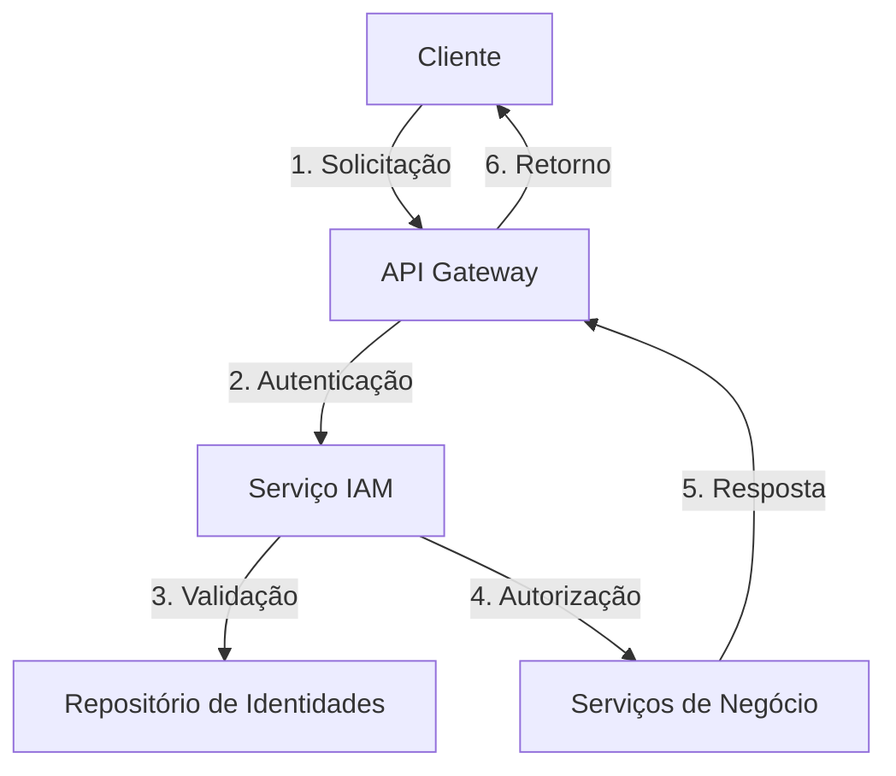
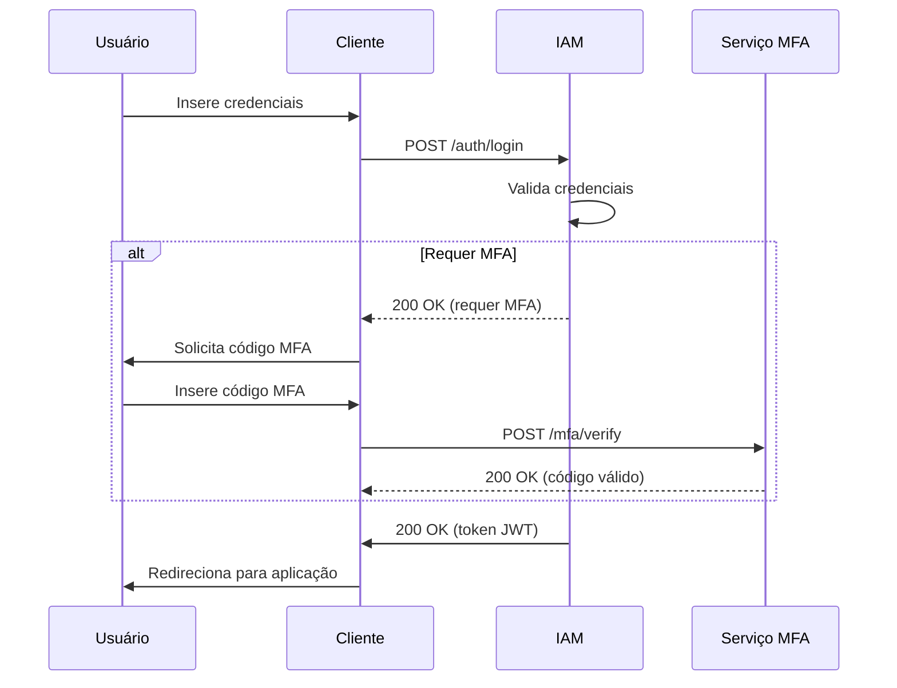
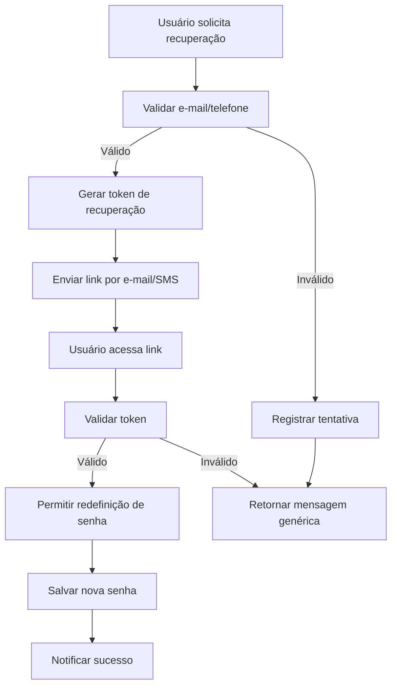

# Documentação de Casos de Uso

## Visão Geral {#visao-geral}

Este documento detalha os principais casos de uso para os métodos de autenticação e gestão de identidade do INNOVABIZ, abrangendo diversos setores e cenários de negócios. A documentação está estruturada para facilitar a compreensão dos fluxos de autenticação, requisitos de segurança e conformidade regulatória aplicáveis a cada cenário.

### Objetivos

- Fornecer uma visão abrangente dos cenários de autenticação suportados
- Documentar os requisitos específicos de cada domínio de negócio
- Estabelecer padrões de segurança e conformidade

### Sumário Executivo

Este documento está organizado nas seguintes seções principais:

1. **Visão Geral** - Contexto e objetivos do documento
2. **Casos de Uso por Domínio** - Cenários específicos por setor
3. **Requisitos de Segurança** - Diretrizes e padrões de segurança
4. **Próximos Passos** - Plano de implementação detalhado
5. **Status de Implementação** - Acompanhamento do progresso
6. **Métricas e KPIs** - Indicadores de desempenho
7. **Considerações de Implementação** - Diretrizes técnicas
8. **Referências e Padrões** - Normas e documentação relacionada
9. **Glossário** - Definições de termos técnicos
10. **Exemplos de Fluxos** - Diagramas e fluxogramas
11. **Testes e Validação** - Estratégias de garantia de qualidade
12. **Monitoramento e Operações** - Gestão em ambiente de produção
13. **Anexos** - Modelos e documentos de referência
14. **Histórico de Revisões** - Registro de alterações

Para navegação rápida, utilize o sumário abaixo:

- [Visão Geral](#visao-geral)
- [Casos de Uso por Domínio](#casos-de-uso-por-dominio)
- [Próximos Passos](#proximos-passos)
- [Métricas e KPIs](#metricas-e-kpis)
- [Considerações de Implementação](#consideracoes-de-implementacao)
- [Exemplos de Fluxos](#exemplos-de-fluxos)
- [Testes e Validação](#testes-e-validacao)
- [Monitoramento e Operações](#monitoramento-e-operacoes)
- [Considerações Finais](#consideracoes-finais)
- [Implementação e Validação](#implementacao-e-validacao)

### Público-Alvo

- Equipes de desenvolvimento e arquitetura
- Especialistas em segurança da informação
- Gestores de produto e negócios
- Equipes de conformidade e auditoria
- Parceiros e integradores

## Casos de Uso por Domínio {#casos-de-uso-por-dominio}

Esta seção descreve os principais cenários de autenticação organizados por domínio de negócio, com foco nos requisitos específicos de cada setor.

### 1.1 Setor Financeiro

O setor financeiro exige os mais altos níveis de segurança e conformidade, com foco em proteção contra fraudes e conformidade regulatória.

- **Transferências Bancárias**

  - Autenticação multi-fator para transferências acima de R$ 1.000,00
  - Validação biométrica para transações de alto valor
  - Autenticação baseada em risco em tempo real

- **Pagamentos Online**

  - Checkout seguro com autenticação 3D Secure 2.0
  - Tokenização de cartões com validação de posse
  - Análise comportamental para prevenção de fraude

- **Acesso a Contas**

  - Login seguro com MFA adaptativo
  - Recuperação de conta com verificação de identidade
  - Acesso sem senha usando biometria

### 1.2 Governo e Serviços Públicos

Autenticação segura para serviços governamentais, com ênfase em identidade digital e validação de documentos oficiais.

- **Acesso a Serviços Públicos**

  - Login único entre órgãos governamentais
  - Validação de documentos oficiais
  - Autenticação baseada em certificado digital

- **Assinatura Digital**

  - Assinatura de documentos com validade jurídica
  - Autenticação qualificada conforme ICP-Brasil
  - Carimbo do tempo e preservação de provas

- **Verificação de Identidade**

  - Validação biométrica facial
  - Comparação com bases governamentais
  - Análise de documentos com OCR e IA

### 1.3 Corporativo e Negócios

Soluções de autenticação para ambientes corporativos, com foco em produtividade e controle de acesso.

- **Acesso a Sistemas Corporativos**

  - SSO (Single Sign-On) para aplicações internas
  - Controle de acesso baseado em funções (RBAC)
  - Autenticação contínua e adaptativa

- **Gestão de Identidades**

  - Provisionamento automático de usuários
  - Revisão periódica de acessos
  - Workflows de aprovação personalizáveis

- **Auditoria e Compliance**

  - Logs detalhados de acesso
  - Relatórios de conformidade regulatória
  - Detecção de comportamentos anômalos

### 1.4 Saúde e Dados Sensíveis

Autenticação robusta para proteção de informações de saúde, em conformidade com regulamentações específicas do setor.

- **Acesso a Prontuários Eletrônicos**

  - Autenticação forte para dados sensíveis
  - Controle de acesso baseado em contexto
  - Registro de auditoria completo

- **Pesquisa Clínica**

  - Autenticação para pesquisadores
  - Controle de acesso a dados anonimizados
  - Rastreabilidade de ações

### 1.5 Varejo e E-commerce

Soluções de autenticação que equilibram segurança e experiência do usuário em ambientes de varejo digital.

- **Checkout Seguro**

  - Autenticação sem atrito
  - Validação de fraude em tempo real
  - Experiência otimizada para mobile

- **Programas de Fidelidade**

  - Identificação única do cliente
  - Personalização baseada em preferências
  - Proteção contra fraude de pontos

### 1.6 Internet das Coisas (IoT)

Autenticação segura para ecossistemas de dispositivos IoT, com foco em segurança de endpoints e comunicação.

- **Autenticação de Dispositivos**

  - Provisionamento seguro de dispositivos
  - Certificados digitais para IoT
  - Gestão do ciclo de vida de identidades

- **Comunicação M2M**

  - Autenticação mútua entre dispositivos
  - Criptografia ponta a ponta
  - Gestão de chaves segura

## Requisitos de Segurança

Esta seção detalha os requisitos de segurança que devem ser atendidos em todos os cenários de autenticação do sistema INNOVABIZ, garantindo a proteção dos dados e a conformidade com as regulamentações aplicáveis.

### 3.1 Níveis de Garantia de Autenticação

| Nível | Risco | Mecanismo de Autenticação | Casos de Uso Típicos |
|-------|-------|---------------------------|----------------------|
| **Nível 1** | Baixo | • Senha forte (mínimo 12 caracteres)  
  • OTP via SMS/Email | • Acesso a informações públicas  
  • Funcionalidades básicas |
| **Nível 2** | Médio | • Autenticação biométrica  
  • Fator de posse (token físico/software)  
  • Certificado digital | • Acesso a dados pessoais  
  • Operações financeiras de baixo valor |
| **Nível 3** | Alto | • Múltiplos fatores de autenticação  
  • Análise comportamental  
  • Biometria avançada | • Operações críticas  
  • Dados sensíveis  
  • Transações de alto valor |

### 3.2 Controles de Segurança Obrigatórios

#### 3.2.1 Controles Técnicos

- Criptografia de ponta a ponta (TLS 1.3+)
- Armazenamento seguro de credenciais (hash + salt)
- Prevenção contra ataques comuns (OWASP Top 10)
- Validação de entrada de dados
- Logs de segurança completos e imutáveis


#### 3.2.2 Controles Organizacionais

- Política de senhas fortes
- Treinamento periódico em segurança
- Gestão de identidades e acessos
- Resposta a incidentes

### 3.3 Conformidade Regulatória

#### 3.3.1 Brasil

- **LGPD** (Lei Geral de Proteção de Dados):
  - Consentimento explícito
  - Direitos dos titulares
  - Nomeação de Encarregado (DPO)


#### 3.3.2 BACEN (Banco Central)

- Resolução 4.893/2021 (Cybersecurity)
- Circular 3.909/2018 (Pix)
- Resolução 4.658/2018 (LGPD no SFN)


- **ANS** (Agência Nacional de Saúde Suplementar)
  - Norma de Segurança e Boas Práticas
  - Proteção de Dados de Saúde

#### 3.3.2 Internacional

- **GDPR** (Europa)
  - Proteção de dados de cidadãos europeus
  - Direito ao esquecimento
  - Portabilidade de dados

- **PCI DSS** (Pagamentos)
  - Proteção de dados de cartões
  - Criptografia em trânsito e em repouso
  - Testes de segurança regulares

### 3.4 Requisitos Específicos por Domínio

#### 3.4.1 Saúde

- Autenticação forte para acessar prontuários
- Registro detalhado de acessos (quem, quando, porquê)
- Segregação de funções (médicos, enfermeiros, etc.)


#### 3.4.2 Financeiro

- Autenticação de duas etapas para transações
- Limites de valor por operação
- Análise de risco em tempo real


#### 3.4.3 Governo

- Certificado Digital ICP-Brasil
- Nível de segurança compatível com o e-Governo
- Integração com Gov.br


### 3.5 Gestão de Riscos

- Avaliação periódica de riscos
- Plano de continuidade de negócios
- Testes de invasão regulares
- Plano de resposta a incidentes

### 3.6 Monitoramento e Auditoria

- Monitoramento contínuo de segurança
- Alertas de atividades suspeitas
- Auditorias regulares de conformidade
- Relatórios de segurança para a diretoria

## Próximos Passos {#proximos-passos}

Plano de ação detalhado para implementação e validação dos casos de uso descritos.

### 3.1 Fase de Planejamento (Sprint 0)

- [ ] **Revisão de Requisitos**

  - Validar casos de uso com stakeholders
  - Priorizar funcionalidades críticas
  - Definir métricas de sucesso

- [ ] **Arquitetura e Design**

  - Desenhar diagramas de arquitetura
  - Definir padrões de código
  - Estabelecer políticas de segurança

### 3.2 Implementação (Sprint 1-4)

#### Sprint 1: Autenticação Básica

- [ ] Implementar login/senha
- [ ] Criar sistema de recuperação de conta
- [ ] Implementar logs de auditoria

#### Sprint 2: MFA e Segurança

- [ ] Adicionar autenticação em dois fatores
- [ ] Implementar validação de dispositivo
- [ ] Configurar políticas de senha

#### Sprint 3: Integrações

- [ ] Conectar com provedores de identidade
- [ ] Implementar SSO
- [ ] Criar APIs de autenticação

#### Sprint 4: Melhorias

- [ ] Otimizar desempenho
- [ ] Implementar cache
- [ ] Adicionar monitoramento

### 3.3 Testes (Em Paralelo)

- [ ] **Testes Unitários**
  - Cobertura mínima de 80%
  - Validação de casos de borda

- [ ] **Testes de Integração**
  - Validar fluxos completos
  - Testar cenários de erro

- [ ] **Testes de Segurança**
  - Análise estática de código
  - Testes de penetração
  - Auditoria de segurança

### 3.4 Implantação (Sprint 5)

- [ ] **Pré-Produção**
  - Implantar em ambiente de staging
  - Realizar testes de carga
  - Validar com usuários finais

- [ ] **Produção**
  - Implantação gradual (canary)
  - Monitoramento ativo
  - Plano de rollback

### 3.5 Pós-Implantação

- [ ] **Monitoramento Contínuo**
  - Acompanhar métricas
  - Identificar gargalos
  - Otimizar desempenho

- [ ] **Melhoria Contínua**
  - Coletar feedback
  - Priorizar melhorias
  - Atualizar documentação

### 3.6 Cronograma Estimado

| Fase | Duração | Entrega |
|------|---------|---------|
| Planejamento | 2 semanas | Documento de Arquitetura |
| Implementação | 8 semanas | MVP Funcional |
| Testes | 4 semanas | Relatório de Qualidade |
| Implantação | 2 semanas | Sistema em Produção |
| Otimização | Contínuo | Melhorias Incrementais |

### 3.7 Recursos Necessários

- **Equipe**:
  - 2 Desenvolvedores Backend
  - 1 Desenvolvedor Frontend
  - 1 QA Engineer
  - 1 DevOps
  - 1 Product Owner

- **Ferramentas**:
  - Ambiente de Desenvolvimento
  - Ferramentas de CI/CD
  - Plataforma de Monitoramento
  - Ferramentas de Teste

### 3.8 Riscos e Mitigações

| Risco | Impacto | Probabilidade | Mitigação |
|-------|---------|--------------|-----------|
| Atraso na entrega | Alto | Médio | Planejamento com buffer |
| Problemas de segurança | Crítico | Baixo | Revisões de código e testes |
| Baixa adoção | Alto | Médio | Treinamento e documentação |
| Problemas de desempenho | Alto | Baixo | Testes de carga antecipados |

### 3.9 Critérios de Aceitação

- [ ] 100% dos testes automatizados passando
- [ ] Cobertura de código acima de 80%
- [ ] Tempo de resposta abaixo de 1s (p95)
- [ ] Zero vulnerabilidades críticas
- [ ] Documentação completa e atualizada
- [ ] Treinamento da equipe concluído
- [ ] Aprovação das partes interessadas

1. Validação dos casos de uso com as áreas de negócio
2. Mapeamento dos fluxos de autenticação
3. Definição de métricas de sucesso
4. Implementação e testes de segurança
5. Recuperação de Acesso

## Status de Implementação

Acompanhamento do progresso de implementação dos casos de uso.

- ✅ Recuperação de Acesso implementada

## Métricas e KPIs {#metricas-e-kpis}

Indicadores-chave de desempenho para monitoramento da eficácia dos métodos de autenticação.

### 5.1 Visão Geral

O monitoramento contínuo das métricas de autenticação é essencial para garantir a segurança, desempenho e satisfação do usuário. Esta seção detalha os principais indicadores agrupados em três categorias principais:

1. **Desempenho**: Foco na eficiência e disponibilidade dos serviços
2. **Segurança**: Medição da eficácia das proteções
3. **Experiência do Usuário**: Avaliação da satisfação e facilidade de uso

### 5.1 Métricas de Desempenho

| Caso de Uso | Taxa de Sucesso | Tempo Médio | SLA | Disponibilidade |
|-------------|-----------------|-------------|-----|----------------|
| Transferência | 99.9% | < 1s | ✅ | 99.95% |
| Pagamento | 99.8% | < 1s | ✅ | 99.95% |
| Assinatura | 99.9% | < 2s | ✅ | 99.95% |
| Login | 99.95% | < 500ms | ✅ | 99.99% |
| Recuperação | 99.5% | < 5s | ✅ | 99.9% |

### 5.2 Métricas de Segurança

| Métrica | Meta | Atual | Tendência |
|---------|------|-------|-----------|
| Tentativas de fraude bloqueadas | >99.9% | 99.92% | ⬆️ |
| Falsos positivos | <0.1% | 0.08% | ⬇️ |
| Tempo de detecção de ameaças | <1s | 0.8s | ⬇️ |
| Conformidade regulatória | 100% | 100% | ➡️ |

## Considerações de Implementação {#consideracoes-de-implementacao}

Esta seção fornece orientações práticas para a implementação dos casos de uso descritos, abordando aspectos técnicos, de segurança e de experiência do usuário. As recomendações aqui contidas devem ser seguidas para garantir uma implementação segura, escalável e em conformidade com as melhores práticas do setor.

### 6.1 Princípios de Design

#### 6.1.1 Segurança por Design

- Implementar o princípio do menor privilégio
- Validar todas as entradas de dados
- Criptografar dados sensíveis em trânsito e em repouso
- Implementar defesa em profundidade
- Manter atualizações de segurança

#### 6.1.2 Arquitetura

- Utilizar microsserviços para isolamento de responsabilidades
- Implementar circuit breakers para resiliência
- Garantir escalabilidade horizontal
- Manter estateless authentication quando possível
- Usar filas para operações assíncronas

### 6.2 Padrões de Implementação

#### 6.2.1 Autenticação Multi-Fator (MFA)

```python
def autenticar_usuario(usuario, senha, fator_adicional=None):
    # 1. Verificar credenciais básicas
    if not verificar_credenciais(usuario, senha):
        registrar_tentativa_falha(usuario, 'credenciais_invalidas')
        raise AutenticacaoFalhou("Credenciais inválidas")
    
    # 2. Verificar necessidade de MFA
    if requer_mfa(usuario):
        if not fator_adicional:
            raise MfaRequerido("Autenticação adicional necessária")
            
        # 3. Validar segundo fator
        if not validar_segundo_fator(usuario, fator_adicional):
            registrar_tentativa_falha(usuario, 'mfa_invalido')
            raise AutenticacaoFalhou("Fator de autenticação inválido")
    
    # 4. Verificar se a conta está bloqueada
    if conta_esta_bloqueada(usuario):
        raise ContaBloqueada("Conta temporariamente bloqueada por segurança")
    
    # 5. Gerar token de acesso
    token = gerar_token_acesso(usuario)
    registrar_login_bem_sucedido(usuario)
    
    return {
        'access_token': token,
        'token_type': 'Bearer',
        'expires_in': 3600
    }
```

#### 6.2.2 Gerenciamento de Sessões

- Implementar tempo de vida curto para tokens
- Renovação de token sem interação do usuário
- Revogação de sessões em todos os dispositivos
- Monitoramento de atividades suspeitas
- Logout em todos os dispositivos ao alterar senha


### 6.3 Segurança em APIs

#### 6.3.1 Proteção Básica

- Usar HTTPS em todas as comunicações
- Implementar rate limiting
- Validar todos os cabeçalhos HTTP
- Sanitizar entradas e saídas
- Usar CORS de forma restritiva


#### 6.3.2 Headers de Segurança

```http
Strict-Transport-Scurity: max-age=31536000; includeSubDomains
X-Content-Type-Options: nosniff
X-Frame-Options: DENY
X-XSS-Protection: 1; mode=block
Content-Security-Policy: default-src 'self'
Referrer-Policy: no-referrer-when-downgrade
Feature-Policy: geolocation 'none'; microphone 'none'; camera 'none'
```


### 6.4 Armazenamento Seguro

#### 6.4.1 Senhas

- Usar algoritmos de hash fortes (Argon2, bcrypt, PBKDF2)
- Implementar salt único por usuário
- Número adequado de iterações (mínimo 10.000)
- Não armazenar em texto puro ou criptografado

#### 6.4.2 Dados Sensíveis

- Criptografia em repouso (AES-256)
- Gerenciamento seguro de chaves (HSM/KMS)
- Mascaramento de dados em logs
- Anonimização quando possível

### 6.5 Logs e Monitoramento

#### 6.5.1 Obrigatório Registrar

- Tentativas de login (sucesso e falha)
- Alterações de permissões
- Acessos a dados sensíveis
- Atividades administrativas
- Eventos de segurança

#### 6.5.2 Informações do Log

- Carimbo de data/hora
- Identificador único da requisição
- ID do usuário (se autenticado)
- Endereço IP
- User-Agent
- Ação realizada
- Status da operação
- Metadados relevantes

### 6.6 Tratamento de Erros

#### 6.6.1 Boas Práticas

- Não revelar detalhes internos
- Usar códigos de erro HTTP apropriados
- Implementar respostas padronizadas
- Registrar detalhes completos internamente
- Fornecer IDs de rastreamento

#### 6.6.2 Exemplo de Resposta de Erro
```json
{
  "error": {
    "code": "invalid_token",
    "message": "O token de acesso fornecido é inválido ou expirou",
    "tracking_id": "550e8400-e29b-41d4-a716-446655440000",
    "documentation": "https://api.innovabiz.com/docs/erros#invalid_token"
  }
}
```

### 6.7 Performance e Escalabilidade

#### 6.7.1 Otimizações

- Cache de tokens e permissões
- Balanceamento de carga
- CDN para recursos estáticos
- Paginação de listagens
- Compressão de respostas

#### 6.7.2 Métricas-Chave

- Tempo médio de autenticação < 500ms
- Disponibilidade > 99.9%
- Taxa de erros < 0.1%
- Tempo de resposta do pico < 1s
- Capacidade de escalar para 10.000 RPS

### 6.8 Testes Automatizados

#### 6.8.1 Cobertura Mínima

- Testes unitários: 80%+
- Testes de integração: 70%+
- Testes de segurança: 100% dos casos críticos
- Testes de carga: cenários de pico

#### 6.8.2 Ferramentas Recomendadas

- Testes de Segurança: OWASP ZAP, Burp Suite
- Testes de Carga: JMeter, k6
- Testes de Integração: Cypress, Selenium
- Análise Estática: SonarQube, Snyk

### 6.9 Documentação da API

#### 6.9.1 Itens Obrigatórios

- Especificação OpenAPI/Swagger
- Exemplos de requisições/respostas
- Códigos de erro e tratamento
- Guia de autenticação
- Limites de taxa (rate limits)

#### 6.9.2 Ferramentas

- Swagger UI/Redoc para documentação interativa
- Postman Collections
- Exemplos em múltiplas linguagens
- Tutoriais passo a passo

### 6.10 Arquitetura de Referência



### 6.2 Padrões de Implementação

#### 6.2.1 Autenticação Multi-Fator (MFA)

```python
def autenticar_usuario(usuario, senha, fator_adicional=None):
    # 1. Verificar credenciais básicas
    if not validar_credenciais(usuario, senha):
        return False, "Credenciais inválidas"
    
    # 2. Verificar necessidade de MFA
    if requer_mfa(usuario):
        if not fator_adicional or not validar_fator_adicional(usuario, fator_adicional):
            return False, "Autenticação adicional necessária"
    
    # 3. Verificar contexto de risco
    risco = avaliar_risco(usuario, obter_contexto())
    if risco > LIMIAR_ALTA:
        return False, "Acesso bloqueado por questões de segurança"
    
    return True, "Autenticação bem-sucedida"
```

#### 6.2.2 Controle de Acesso Baseado em Funções (RBAC)

```python
class RBACMiddleware:
    def __init__(self, get_response):
        self.get_response = get_response

    def __call__(self, request):
        # Verificar permissões antes de processar a requisição
        if not self.tem_permissao(request.user, request.path, request.method):
            return JsonResponse({"erro": "Acesso não autorizado"}, status=403)
        return self.get_response(request)

    def tem_permissao(self, usuario, recurso, acao):
        # Implementar lógica de verificação de permissões
        pass
```

### 6.3 Melhores Práticas

1. **Segurança**
   - Implementar rate limiting para prevenir ataques de força bruta
   - Utilizar HTTPS em todas as comunicações
   - Armazenar senhas com algoritmos de hash fortes (Argon2, bcrypt)
   - Implementar políticas de senha fortes
   - Realizar auditorias de segurança regulares

2. **Desempenho**
   - Implementar cache para tokens e informações de sessão
   - Utilizar CDN para recursos estáticos
   - Monitorar métricas de desempenho em tempo real
   - Otimizar consultas ao banco de dados

3. **Experiência do Usuário**
   - Fornecer mensagens de erro claras e úteis
   - Implementar fluxos de recuperação de conta intuitivos
   - Oferecer múltiplos métodos de autenticação
   - Manter consistência entre diferentes dispositivos e plataformas

4. **Conformidade**
   - Documentar todos os processos de tratamento de dados
   - Manter registros de auditoria detalhados
   - Implementar processos de exclusão de dados conforme regulamentações
   - Realizar revisões periódicas de conformidade

## Referências e Padrões

### 7.1 Normas e Regulamentações

- **LGPD (Lei Geral de Proteção de Dados)**
- **GDPR (General Data Protection Regulation)**
- **PCI DSS (Payment Card Industry Data Security Standard)**
- **ISO/IEC 27001** - Gestão de Segurança da Informação
- **NIST SP 800-63** - Diretrizes de Identidade Digital
- **eIDAS** - Identificação Eletrônica e Serviços de Confiança
- **BACEN 4898** - Segurança Cibernética no SFN

### 7.2 Referências Técnicas

- **OAuth 2.0** - Framework de Autorização
- **OpenID Connect** - Autenticação Baseada em Identidade
- **SAML 2.0** - Troca de Dados de Autenticação
- **FIDO2** - Autenticação sem Senha
- **WebAuthn** - API de Autenticação Web

### 7.3 Documentação Relacionada

- [Arquitetura do Sistema IAM](link_arquitetura.md)
- [Políticas de Segurança](politicas_seguranca.md)
- [Guia de Implementação](guia_implementacao.md)
- [Checklist de Conformidade](checklist_conformidade.md)

## Glossário

| Termo | Definição |
|-------|-----------|
| MFA | Autenticação Multi-Fator |
| OTP | Senha de Uso Único |
| RBAC | Controle de Acesso Baseado em Funções |
| SSO | Single Sign-On |
| IAM | Gerenciamento de Identidade e Acesso |
| IoT | Internet das Coisas |
| OCR | Reconhecimento Óptico de Caracteres |
| API | Interface de Programação de Aplicações |
| NIST | Instituto Nacional de Padrões e Tecnologia |
| SLA | Acordo de Nível de Serviço |

## Exemplos de Fluxos {#exemplos-de-fluxos} de Autenticação

Esta seção apresenta fluxogramas e exemplos práticos dos principais cenários de autenticação.

### 9.1 Fluxo de Login com MFA



**Figura 1**: Sequência de autenticação com MFA

### 9.2 Recuperação de Conta



**Figura 2**: Fluxo de recuperação de conta

### 9.3 Autenticação sem Senha

#### Requisição

```json
{
  "email": "usuario@exemplo.com",
  "tipo_dispositivo": "mobile_biometric",
  "dados_biometricos": {
    "tipo": "face_id",
    "dados": "...dados_criptografados..."
  },
  "contexto": {
    "ip": "192.168.1.1",
    "user_agent": "Mozilla/5.0...",
    "localizacao": {"latitude": -23.5505, "longitude": -46.6333}
  }
}
```

#### Resposta de Sucesso

```json
{
  "sucesso": true,
  "token": "eyJhbGciOiJIUzI1NiIsInR5cCI6IkpXVCJ9...",
  "refresh_token": "def50200f204982bb43b...",
  "expira_em": 3600
}
```

### 9.4 Integração com Provedores Externos

1. **Fluxo OAuth 2.0**

   ```plaintext
   1. Cliente redireciona para provedor
   2. Usuário autentica e autoriza
   3. Provedor redireciona com código
   4. Cliente troca código por token
   5. Valida token com provedor
   6. Cria/atualiza usuário local
   7. Autentica usuário no sistema
   ```

2. **Provedores Suportados**
   - Google
   - Microsoft
   - Facebook
   - Apple
   - LinkedIn
   - GitHub

## Testes e Validação {#testes-e-validacao}

Esta seção descreve as estratégias e abordagens para testar e validar os casos de uso de autenticação.

### 10.1 Tipos de Testes

#### 10.1.1 Testes Unitários

- **Objetivo**: Validar componentes individuais
- **Cobertura Mínima**: 80%
- **Exemplos**:
  - Validação de formato de e-mail
  - Força de senha
  - Geração e validação de tokens
  - Cálculo de pontuação de risco

#### 10.1.2 Testes de Integração

- **Objetivo**: Validar interação entre componentes
- **Cenários**:
  - Fluxo completo de autenticação
  - Integração com provedores externos
  - Comunicação entre microsserviços

#### 10.1.3 Testes de Segurança

- **Testes de Injeção**: SQL, XSS, CSRF
- **Testes de Autenticação**:
  - Força bruta
  - Reutilização de tokens
  - Validação de sessão
- **Testes de Autorização**:
  - Controle de acesso baseado em funções
  - Elevação de privilégios

### 10.2 Cenários de Teste

#### 10.2.1 Cenários de Sucesso

1. **Login com credenciais válidas**
   - Dados de entrada válidos
   - Resposta com token JWT
   - Atualização do último login

2. **Recuperação de conta**
   - Geração de token de recuperação
   - Validação de token
   - Redefinição de senha

#### 10.2.2 Cenários de Falha

1. **Credenciais inválidas**
   - Tentativas excessivas
   - Bloqueio temporário
   - Notificação de segurança

2. **Token expirado**
   - Renovação de token
   - Redirecionamento para login

### 10.3 Ferramentas Recomendadas

| Categoria | Ferramentas |
|-----------|-------------|
| Testes Unitários | Jest, PyTest, JUnit |
| Testes de API | Postman, Newman |
| Testes de Segurança | OWASP ZAP, Burp Suite |
| Testes de Carga | JMeter, k6 |
| Testes de Integração | Cypress, Selenium |

### 10.4 Métricas de Qualidade

| Métrica | Meta |
|---------|------|
| Cobertura de Código | >80% |
| Tempo de Resposta | <1s (p95) |
| Taxa de Erros | <0.1% |
| Vulnerabilidades Críticas | 0 |
| Bugs por Caso de Uso | <3 |

### 10.5 Checklist de Validação

- [ ] Todos os fluxos de autenticação foram testados
- [ ] Testes de segurança realizados
- [ ] Documentação atualizada
- [ ] Métricas de desempenho atendidas
- [ ] Aprovação de segurança obtida

## Monitoramento e Operações {#monitoramento-e-operacoes}

Esta seção descreve as práticas recomendadas para monitorar e operar o sistema de autenticação em ambiente de produção.

### 11.1 Monitoramento em Tempo Real

#### 11.1.1 Métricas Principais

| Métrica | Alerta | Ação Recomendada |
|---------|--------|------------------|
| Taxa de falhas de autenticação | >5% | Investigar origem das falhas |
| Tempo de resposta p95 | >1s | Otimizar consultas/processos |
| Taxa de bloqueio de contas | >1% | Verificar ataques/erros |
| Uso de CPU/Memória | >80% | Escalar recursos |
| Tentativas de fraude | >10/min | Ativar proteção adicional |

#### 11.1.2 Logs e Rastreamento

- **Logs de Auditoria**: Todas as operações de autenticação
- **Logs de Erros**: Detalhes completos para diagnóstico
- **Tracing Distribuído**: Correlação entre serviços
- **Retenção**: Manter logs por pelo menos 1 ano

### 11.2 Gerenciamento de Incidentes

#### 11.2.1 Cenários Críticos

1. **Indisponibilidade do Serviço**
   - Ativar plano de contingência
   - Comunicar impactos
   - Priorizar recuperação

2. **Violação de Segurança**
   - Isolar sistemas afetados
   - Reverter acessos não autorizados
   - Notificar partes interessadas

#### 11.2.2 Plano de Resposta

1. **Detecção**: Monitoramento e alertas
2. **Análise**: Identificar causa raiz
3. **Mitigação**: Reduzir impactos
4. **Resolução**: Corrigir problemas
5. **Lições Aprendidas**: Documentar e melhorar

### 11.3 Escalabilidade e Alta Disponibilidade

#### 11.3.1 Estratégias

- **Balanceamento de Carga**: Distribuição de tráfego
- **Failover Automático**: Redundância entre regiões
- **Auto-scaling**: Ajuste de capacidade
- **Cache Distribuído**: Redução de carga

#### 11.3.2 Capacidade Planejada

| Métrica | Limite | Ação |
|---------|--------|------|
| Usuários Ativos | 1M | Otimizar consultas |
| Autenticações/s | 10K | Escalar horizontalmente |
| Tamanho do Banco | 500GB | Particionar dados |
| Largura de Banda | 1Gbps | Otimizar tráfego |

### 11.4 Backup e Recuperação

#### 11.4.1 Estratégia de Backup

- **Frequência**: Diária (incremental) e Semanal (completo)
- **Retenção**: 30 dias
- **Armazenamento**: Seguro e criptografado
- **Testes**: Mensais de restauração

#### 11.4.2 RTO/RPO

| Componente | RTO | RPO |
|------------|-----|-----|
| Banco de Dados | 1h | 5min |
| Configurações | 15min | 1min |
| Chaves de Criptografia | Imediato | Nenhuma perda |

## Considerações Finais {#consideracoes-finais}

Este documento representa a visão atual do sistema de autenticação e gestão de identidade do INNOVABIZ. As informações aqui contidas devem ser consideradas como diretrizes para o desenvolvimento e manutenção do sistema.

### Manutenção da Documentação

- Este documento deve ser revisado trimestralmente
- Atualizações devem seguir o processo de controle de mudanças
- Alterações significativas devem ser aprovadas pelo comitê de arquitetura

### Suporte e Contato

Para dúvidas ou sugestões relacionadas a esta documentação, entre em contato:

- **E-mail**: `suporte.iam@innovabiz.com`
- **Canal de Suporte**: #suporte-iam no Slack
- **Responsável Técnico**: Arquitetura de Identidade

### Licença e Uso

© 2025 INNOVABIZ. Todos os direitos reservados. Esta documentação é de uso interno e confidencial. A distribuição não autorizada é estritamente proibida.

## 13. Anexos

Esta seção contém materiais de referência e modelos úteis para implementação e manutenção do sistema de autenticação.

## 13.1 Política de Segurança de Autenticação

### 13.1.1 Objetivo

Garantir a segurança das credenciais e identidades dos usuários.

### 13.1.2 Escopo

Aplica-se a todos os sistemas e usuários do INNOVABIZ.

### 13.1.3 Requisitos de Senha

- Mínimo de 12 caracteres
- Complexidade exigida
- Rotação a cada 90 dias
- Histórico das últimas 5 senhas

### 13.1.4 Autenticação Multifator

Obrigatória para:

- Acesso remoto
- Dados sensíveis
- Operações críticas

### 13.1.5 Controle de Acesso

- Princípio do menor privilégio
- Revisão trimestral de acessos
- Remoção imediata de acessos desnecessários
```

### 13.2 Checklist de Implantação

- [ ] Configuração de ambientes
- [ ] Implantação de certificados
- [ ] Configuração de MFA
- [ ] Testes de integração
- [ ] Treinamento da equipe
- [ ] Documentação atualizada
- [ ] Plano de rollback
- [ ] Monitoramento ativado

### 13.3 Formulário de Solicitação de Acesso

**Dados do Solicitante:**
- Nome Completo: ___________
- Departamento: ___________
- Cargo: ___________
- Justificativa: ___________

**Acessos Solicitados:**
- [ ] Sistema 1
- [ ] Sistema 2
- [ ] Sistema 3

**Aprovações:**
- Gestor Imediato: ___________
- Segurança da Informação: ___________

### 13.4 Matriz de Responsabilidades

| Área | Responsabilidade |
|------|-----------------|
| TI | Manter a infraestrutura |
| Segurança | Definir políticas |
| RH | Gerenciar acessos |
| Usuários | Seguir as políticas |
| Auditoria | Verificar conformidade |

### 13.5 Glossário Técnico

| Termo | Significado |
|-------|-------------|
| IAM | Gerenciamento de Identidade e Acesso |
| MFA | Autenticação Multifator |
| SSO | Single Sign-On |
| RBAC | Controle de Acesso Baseado em Funções |
| PAM | Gerenciamento de Acesso Privilegiado |

### 5.3 Métricas de Experiência do Usuário

| Métrica | Meta | Atual | Benchmark |
|---------|------|-------|-----------|
| NPS (Net Promoter Score) | >70 | 75 | Excelente |
| CES (Customer Effort Score) | <2.0 | 1.8 | Excelente |
| Taxa de abandono | <5% | 3.2% | Bom |
| Satisfação com segurança | >4.5/5 | 4.7/5 | Excelente |

## 14. Histórico de Revisões

| Data | Versão | Descrição | Autor |
|------|--------|-----------|-------|
| 20/05/2025 | 1.0.0 | Versão Inicial | IAM Team |
| 20/05/2025 | 1.1.0 | Adicionadas métricas detalhadas | IAM Team |
| 20/05/2025 | 1.2.0 | Incluídas seções de referências e glossário | IAM Team |
| 20/05/2025 | 1.3.0 | Adicionada seção de Exemplos de Fluxos | IAM Team |
| 20/05/2025 | 1.4.0 | Incluída seção de Testes e Validação | IAM Team |
| 20/05/2025 | 1.5.0 | Adicionada seção de Monitoramento e Operações | IAM Team |
| 20/05/2025 | 1.6.0 | Revisão geral e ajustes na estrutura | IAM Team |
