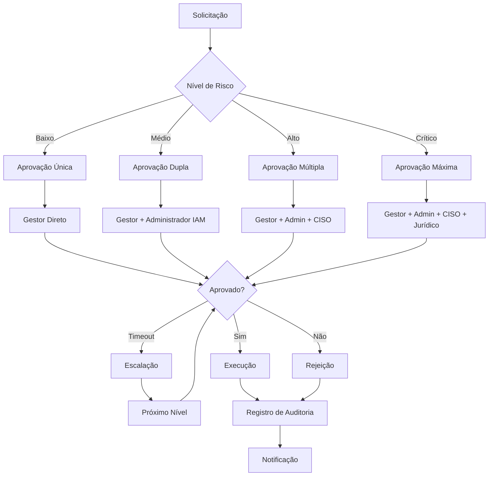
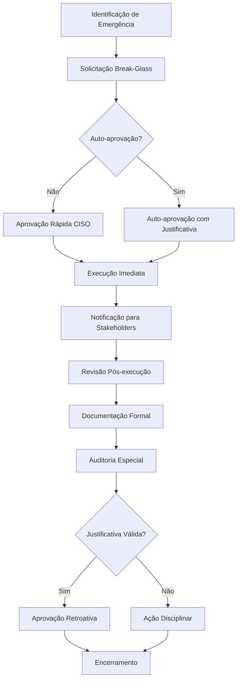
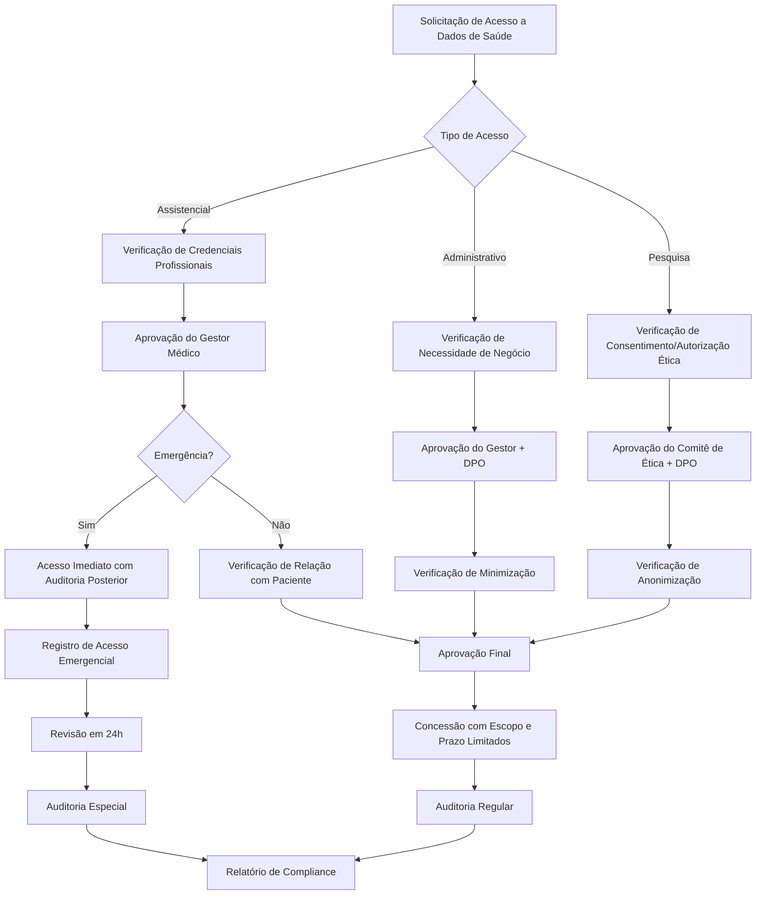

# Aprovações do Módulo IAM - INNOVABIZ

## Visão Geral

Este documento define os processos de aprovação, fluxos de trabalho, níveis de autorização e requisitos para o módulo de Identity and Access Management (IAM) da plataforma INNOVABIZ. As aprovações são essenciais para garantir a governança adequada, compliance regulatório e proteção de dados no contexto do gerenciamento de identidades e acessos.

## Matrizes de Aprovação

### Aprovações para Gestão de Identidades

| ID | Operação | Nível de Risco | Aprovadores Requeridos | Tempo Limite de Aprovação | Escalação Automática |
|----|----------|----------------|------------------------|---------------------------|----------------------|
| APR-ID-001 | Criação de conta privilegiada | Alto | Administrador IAM + CISO | 24 horas | Sim, após 48 horas |
| APR-ID-002 | Revogação de conta | Médio | Gestor do Usuário + Administrador IAM | 24 horas | Sim, após 72 horas |
| APR-ID-003 | Criação de grupo de alto privilégio | Alto | Administrador IAM + Gestor de Segurança | 48 horas | Não |
| APR-ID-004 | Modificação de atributos sensíveis | Alto | Administrador IAM + Gestor do Usuário | 24 horas | Sim, após 48 horas |
| APR-ID-005 | Importação em massa de usuários | Médio | Administrador IAM + Gestor de RH | 48 horas | Não |
| APR-ID-006 | Término de contrato/Offboarding | Baixo | Gestor do Usuário | 24 horas | Sim, após 72 horas |
| APR-ID-007 | Reativação de conta suspensa | Alto | Administrador IAM + Gestor do Usuário + CISO | 48 horas | Não |
| APR-ID-008 | Criação de perfil de acesso AR/VR | Alto | Administrador IAM + Gestor de Segurança + Gestor AR/VR | 48 horas | Não |

### Aprovações para Gestão de Acessos

| ID | Operação | Nível de Risco | Aprovadores Requeridos | Tempo Limite de Aprovação | Escalação Automática |
|----|----------|----------------|------------------------|---------------------------|----------------------|
| APR-AC-001 | Concessão de acesso privilegiado | Alto | Gestor do Usuário + Proprietário do Recurso + CISO | 24 horas | Sim, após 48 horas |
| APR-AC-002 | Acesso a dados sensíveis | Alto | Gestor do Usuário + Proprietário dos Dados + DPO | 24 horas | Sim, após 48 horas |
| APR-AC-003 | Acesso a dados de saúde | Crítico | Gestor do Usuário + Oficial de Privacidade + DPO | 24 horas | Sim, após 36 horas |
| APR-AC-004 | Acesso administrativo a sistemas | Alto | Gestor do Usuário + Administrador de Sistema | 48 horas | Não |
| APR-AC-005 | Acesso para terceiros/parceiros | Alto | Gestor de Relacionamento + CISO + Jurídico | 72 horas | Não |
| APR-AC-006 | Elevação temporária de privilégios | Médio | Gestor do Usuário + Administrador IAM | 12 horas | Sim, após 24 horas |
| APR-AC-007 | Acesso em bloco para equipes | Médio | Gestor da Equipe + Proprietário do Recurso | 48 horas | Não |
| APR-AC-008 | Acesso a zonas restritas em AR/VR | Alto | Gestor do Usuário + Gestor AR/VR + Proprietário do Conteúdo | 48 horas | Não |

### Aprovações para Administração do Sistema IAM

| ID | Operação | Nível de Risco | Aprovadores Requeridos | Tempo Limite de Aprovação | Escalação Automática |
|----|----------|----------------|------------------------|---------------------------|----------------------|
| APR-SYS-001 | Alteração de política de senhas | Alto | CISO + Administrador IAM + Comitê de Segurança | 72 horas | Não |
| APR-SYS-002 | Configuração de federação | Alto | Administrador IAM + Arquiteto de Segurança | 72 horas | Não |
| APR-SYS-003 | Modificação de políticas RLS | Crítico | CISO + DBA + Administrador IAM | 48 horas | Não |
| APR-SYS-004 | Alteração de configuração MFA | Alto | CISO + Administrador IAM | 48 horas | Não |
| APR-SYS-005 | Configuração de tenant | Alto | Administrador IAM + Gestor de Operações | 72 horas | Não |
| APR-SYS-006 | Integração com sistema externo | Alto | Administrador IAM + Arquiteto de Integração + CISO | 72 horas | Não |
| APR-SYS-007 | Atualização de sistema IAM | Alto | CAB (Change Advisory Board) | 96 horas | Não |
| APR-SYS-008 | Desativação de auditoria/logging | Crítico | CISO + CEO + DPO | 48 horas | Não |

### Aprovações para Compliance e Governança

| ID | Operação | Nível de Risco | Aprovadores Requeridos | Tempo Limite de Aprovação | Escalação Automática |
|----|----------|----------------|------------------------|---------------------------|----------------------|
| APR-CMP-001 | Isenção de compliance | Crítico | CISO + DPO + Compliance Officer + Jurídico | 72 horas | Não |
| APR-CMP-002 | Alteração de política de retenção | Alto | DPO + Compliance Officer + Jurídico | 72 horas | Não |
| APR-CMP-003 | Alteração de processo de consentimento | Alto | DPO + Compliance Officer + Marketing | 72 horas | Não |
| APR-CMP-004 | Configuração de validador de compliance | Médio | Administrador IAM + Compliance Officer | 48 horas | Não |
| APR-CMP-005 | Modificação dos termos de uso | Alto | DPO + Jurídico + Marketing | 96 horas | Não |
| APR-CMP-006 | Atualização de política de privacidade | Crítico | DPO + Jurídico + CEO | 96 horas | Não |
| APR-CMP-007 | Tratamento especial para dados sensíveis | Alto | DPO + Gestor de Dados + Compliance Officer | 72 horas | Não |
| APR-CMP-008 | Configuração de relatório regulatório | Médio | Compliance Officer + Administrador IAM | 48 horas | Não |

## Fluxos de Aprovação

### Fluxo Padrão de Aprovação

### Fluxo de Aprovação de Emergência (Break-Glass)

### Fluxo de Aprovação para Saúde

## Papéis e Responsabilidades para Aprovações

### Papéis de Aprovação

| Papel | Descrição | Responsabilidades de Aprovação | Delegação Permitida |
|-------|-----------|--------------------------------|---------------------|
| CISO | Chief Information Security Officer | Aprovação de acessos de alto risco, políticas de segurança, exceções | Sim, para Gestor de Segurança |
| DPO | Data Protection Officer | Aprovação de acessos a dados pessoais, políticas de privacidade | Sim, para Oficial de Privacidade |
| Administrador IAM | Administrador do sistema IAM | Aprovação de configurações técnicas, acessos de sistema | Sim, para Administrador IAM Backup |
| Gestor do Usuário | Superior hierárquico do solicitante | Aprovação de solicitações de acesso de sua equipe | Sim, para Gestor Substituto |
| Proprietário do Recurso | Responsável pelo recurso solicitado | Aprovação de acesso ao seu recurso | Sim, para Delegado Designado |
| Compliance Officer | Responsável pelo compliance corporativo | Aprovação de exceções regulatórias, configurações de validadores | Sim, para Analista de Compliance Sênior |
| Comitê de Segurança | Órgão colegiado para decisões de segurança | Aprovação de políticas e controles críticos | Não |
| CAB | Change Advisory Board | Aprovação de mudanças significativas no sistema | Não |
| Gestor de Dados | Responsável pela governança de dados | Aprovação de acessos a conjuntos de dados críticos | Sim, para Administrador de Dados |
| Gestor AR/VR | Responsável por sistemas de AR/VR | Aprovação de configurações e acessos específicos para AR/VR | Sim, para Especialista AR/VR Sênior |

### Matriz de Delegação

| Papel Principal | Delegados Permitidos | Restrições de Delegação | Duração Máxima |
|-----------------|----------------------|--------------------------|----------------|
| CISO | Gestor de Segurança, Arquiteto de Segurança | Não pode delegar aprovações críticas | 2 semanas |
| DPO | Oficial de Privacidade, Advogado de Privacidade | Não pode delegar aprovações de políticas | 2 semanas |
| Administrador IAM | Administrador IAM Backup, Arquiteto IAM | Não pode delegar configurações críticas | 4 semanas |
| Gestor do Usuário | Gestor Substituto, Superior Hierárquico | Delegação registrada formalmente | 4 semanas |
| Proprietário do Recurso | Delegado Designado, Administrador do Recurso | Escopo limitado de delegação | 4 semanas |
| Compliance Officer | Analista de Compliance Sênior | Não pode delegar aprovações regulatórias críticas | 2 semanas |
| Gestor de Dados | Administrador de Dados, Arquiteto de Dados | Não pode delegar aprovações de dados críticos | 2 semanas |
| Gestor AR/VR | Especialista AR/VR Sênior, Arquiteto AR/VR | Delegação apenas para operações específicas | 2 semanas |

## Critérios de Aprovação

### Critérios Gerais

| Categoria | Critérios | Documentação Necessária | Verificações Adicionais |
|-----------|-----------|--------------------------|-------------------------|
| Identidade | Verificação de identidade do solicitante, legitimidade do pedido | Credenciais verificadas, histórico de solicitações | Validação via segundo fator |
| Necessidade | Necessidade clara de negócio, justificativa válida | Caso de negócio documentado | Verificação com gestor funcional |
| Proporcionalidade | Acesso mínimo necessário para cumprir a função | Descrição detalhada do escopo necessário | Análise de acessos existentes |
| Temporalidade | Duração apropriada do acesso | Datas de início e término justificadas | Verificação de projetos/atribuições |
| Risco | Avaliação de riscos aceitável | Análise de risco documentada | Verificação de controles compensatórios |

### Critérios Específicos por Contexto

#### Acesso a Dados Sensíveis

| Critério | Descrição | Verificação |
|----------|-----------|-------------|
| Base Legal | Base legal válida para processamento | Verificação por DPO ou Jurídico |
| Consentimento | Consentimento válido quando necessário | Validação de registros de consentimento |
| Minimização | Acesso ao mínimo necessário de dados | Revisão de escopo de dados |
| Finalidade | Compatibilidade com finalidade declarada | Validação de caso de uso |
| Segurança | Controles de segurança adequados | Verificação técnica de controles |

#### Acesso a Sistemas Críticos

| Critério | Descrição | Verificação |
|----------|-----------|-------------|
| Competência | Qualificação técnica adequada | Validação de certificações/treinamentos |
| Segregação | Respeito à segregação de funções | Verificação de conflitos SoD |
| Monitoramento | Capacidade de auditoria e monitoramento | Confirmação de logging ativo |
| Reversibilidade | Capacidade de reverter alterações | Validação de backups/rollbacks |
| Procedimento | Aderência a procedimentos documentados | Verificação de documentação |

#### Acesso para Dados de Saúde

| Critério | Descrição | Verificação |
|----------|-----------|-------------|
| Qualificação | Credenciais profissionais de saúde | Verificação de registro profissional |
| Relação | Relação terapêutica ou administrativa válida | Confirmação de relação paciente-profissional |
| Propósito | Finalidade assistencial, administrativa ou de pesquisa | Validação de propósito declarado |
| Autorização | Consentimento do paciente ou base legal específica | Verificação de autorização |
| Escopo | Limitação a dados estritamente necessários | Análise de necessidade de acesso |

#### Acesso a Ambientes AR/VR

| Critério | Descrição | Verificação |
|----------|-----------|-------------|
| Treinamento | Treinamento específico para AR/VR | Verificação de conclusão de treinamento |
| Compatibilidade | Compatibilidade com dispositivos/plataformas | Validação técnica de compatibilidade |
| Privacidade Espacial | Respeito a zonas de privacidade | Confirmação de entendimento de limites |
| Segurança Perceptual | Controles para dados perceptuais | Verificação de configurações de segurança |
| Limitação de Coleta | Minimização de dados biométricos e perceptuais | Revisão de configurações de coleta |

## Processos de Exceção

### Processo de Exceção Padrão

1. **Solicitação**: Preenchimento de formulário de exceção detalhando justificativa, duração, escopo e controles compensatórios
2. **Análise de Risco**: Avaliação formal de risco pela equipe de segurança
3. **Aprovação Multidisciplinar**: Encaminhamento para todas partes interessadas relevantes
4. **Documentação**: Registro detalhado da exceção no sistema
5. **Implementação de Controles Compensatórios**: Ativação de controles adicionais
6. **Monitoramento Especial**: Auditoria intensificada durante o período
7. **Revisão Regular**: Verificação periódica da necessidade de continuidade
8. **Expiração Automática**: Encerramento automático após o prazo aprovado

### Processo de Break-Glass (Emergência)

1. **Declaração de Emergência**: Registro formal da situação emergencial
2. **Auto-Aprovação Condicional**: Permissão temporária sob responsabilidade do solicitante
3. **Notificação Imediata**: Alerta para CISO, DPO e gestores relevantes
4. **Auditoria em Tempo Real**: Monitoramento intensivo das ações realizadas
5. **Limitação Temporal Estrita**: Acesso por período mínimo necessário
6. **Revisão Pós-Incidente**: Análise formal em até 24 horas
7. **Documentação Retroativa**: Complementação de documentação após o fato
8. **Ratificação ou Revogação**: Aprovação formal retrospectiva ou revogação

## Métricas e Monitoramento

### Métricas de Processo

| Métrica | Descrição | Meta | Frequência de Medição |
|---------|-----------|------|------------------------|
| Tempo Médio de Aprovação | Tempo desde a solicitação até a decisão final | < 24 horas | Semanal |
| Taxa de Aprovação | Percentual de solicitações aprovadas | 85-95% | Mensal |
| Taxa de Rejeição | Percentual de solicitações rejeitadas | 5-15% | Mensal |
| Taxa de Escalação | Percentual de solicitações escaladas por timeout | < 5% | Semanal |
| Eficácia de Delegação | Taxa de sucesso em aprovações delegadas | > 95% | Mensal |
| Tempo Médio de Emergência | Tempo de resposta para aprovações emergenciais | < 30 minutos | Mensal |
| Qualidade de Solicitações | Taxa de solicitações com informações completas | > 90% | Mensal |
| Conformidade Processual | Taxa de adesão ao processo de aprovação | 100% | Mensal |

### Dashboard de Aprovações

O módulo IAM inclui um dashboard de aprovações que exibe:

1. **Pendências**: Solicitações aguardando aprovação com tempo decorrido
2. **Performance**: Métricas de tempo e taxas de aprovação por aprovador
3. **Gargalos**: Identificação de pontos de acúmulo de solicitações
4. **Riscos**: Solicitações de alto risco pendentes há mais tempo
5. **Tendências**: Gráficos de volume e tipos de solicitações ao longo do tempo
6. **Compliance**: Taxa de conformidade com SLAs de aprovação
7. **Emergências**: Registro de aprovações emergenciais recentes
8. **Exceções**: Catálogo de exceções ativas com prazos de validade

## Integração com Outros Processos

### Relacionamento com Processos de Gestão de Mudanças

| Tipo de Mudança | Processo de Aprovação IAM | Relação com CAB | Documentação Requerida |
|-----------------|---------------------------|----------------|------------------------|
| Mudança em Políticas | Aprovação pelo Comitê de Segurança | Informativo para CAB | RFC, Análise de Impacto |
| Mudança em Configurações Técnicas | Aprovação pelo Administrador IAM | Aprovação pelo CAB | RFC, Plano de Rollback |
| Atualizações de Sistema | Aprovação pelo CISO e CAB | Aprovação obrigatória | RFC, Plano de Testes, Plano de Rollback |
| Novas Integrações | Aprovação por Arquiteto e CISO | Aprovação pelo CAB | RFC, Análise de Segurança |
| Mudanças Regulatórias | Aprovação por DPO e Jurídico | Informativo para CAB | Análise de Compliance |

### Relacionamento com Processos de Gestão de Incidentes

| Tipo de Incidente | Processo de Aprovação Relacionado | Responsabilidades | Documentação |
|-------------------|----------------------------------|-------------------|--------------|
| Violação de Acesso | Revogação automática + Revisão por CISO | CSIRT lidera, IAM executa | Relatório de Violação |
| Comprometimento de Conta | Suspensão automática + Aprovação para reativação | CSIRT investiga, CISO aprova | Relatório de Investigação |
| Uso Indevido | Suspensão temporária + Revisão por Gestor e CISO | RH envolvido na decisão | Documentação Disciplinar |
| Erro Técnico | Correção técnica com aprovação expedita | Equipe Técnica executa, CAB aprova | Registro de Problema |
| Incidente Regulatório | Revisão especial por DPO e Jurídico | DPO lidera resposta | Relatório de Violação de Dados |

### Relacionamento com Processos de Auditoria

| Tipo de Auditoria | Interação com Aprovações | Evidências Requeridas | Responsabilidades |
|-------------------|--------------------------|------------------------|-------------------|
| Auditoria Interna | Revisão de logs de aprovação | Histórico completo de decisões | IAM fornece logs e explicações |
| Auditoria Externa | Amostragem de aprovações críticas | Documentação de decisões e justificativas | IAM e Compliance coordenam resposta |
| Auditoria Regulatória | Verificação de conformidade processual | Evidência de controles de aprovação | DPO e Compliance lideram resposta |
| Auditoria de Segurança | Teste de processo de aprovação | Resultados de testes de controles | CISO coordena resposta |
| Autoavaliação | Revisão periódica de processos | Métricas e relatórios de eficácia | IAM conduz autoavaliação |

## Revisão e Melhoria Contínua

### Ciclo de Revisão

| Componente | Frequência de Revisão | Responsáveis | Critérios de Revisão |
|------------|----------------------|--------------|---------------------|
| Política de Aprovações | Anual | CISO, DPO, Administrador IAM | Adequação regulatória, eficiência de processo |
| Matrizes de Aprovação | Semestral | CISO, Administrador IAM | Adequação aos riscos atuais, gargalos identificados |
| Critérios de Aprovação | Anual | CISO, DPO, Compliance | Eficácia dos critérios, novos requisitos |
| Processos de Exceção | Trimestral | CISO, Comitê de Segurança | Adequação às necessidades emergentes |
| Papéis e Responsabilidades | Anual | CISO, RH, Administrador IAM | Clareza de responsabilidades, eficácia da estrutura |
| Métricas e KPIs | Trimestral | CISO, Administrador IAM | Utilidade das métricas, novos indicadores necessários |

### Processo de Melhoria

1. **Coleta de Feedback**: Captura estruturada de feedback de aprovadores e solicitantes
2. **Análise de Métricas**: Revisão periódica das métricas de aprovação para identificar padrões
3. **Identificação de Problemas**: Registro formal de gargalos e ineficiências
4. **Ideação de Melhorias**: Workshops para identificação de oportunidades de melhoria
5. **Priorização**: Classificação de melhorias por impacto e esforço
6. **Implementação Controlada**: Mudanças em processo com validação prévia
7. **Mensuração de Resultados**: Avaliação de eficácia pós-implementação
8. **Padronização**: Incorporação de melhorias bem-sucedidas ao processo padrão

---

**Aprovação**: Comitê de Segurança da Informação  
**Versão**: 1.0  
**Data**: Janeiro 2025  
**Próxima Revisão Programada**: Janeiro 2026
