# Dependências do Módulo IAM - INNOVABIZ

## Visão Geral

Este documento cataloga todas as dependências internas e externas do módulo IAM (Identity and Access Management), definindo os requisitos, integrações e pontos de interação necessários para seu funcionamento adequado.

## Dependências Internas

### Dependências de Outros Módulos INNOVABIZ

| ID | Módulo Dependência | Tipo | Criticidade | Descrição | Impacto em Caso de Falha |
|----|-------------------|------|-------------|-----------|--------------------------|
| `DEP-INT-001` | Core | Funcional | Alta | Esquemas de tabelas fundamentais de usuários e permissões | Falha total no funcionamento do IAM |
| `DEP-INT-002` | Database | Funcional | Alta | Conexões, pools e procedimentos de banco de dados | Indisponibilidade do serviço |
| `DEP-INT-003` | Notification | Funcional | Média | Serviços de envio de notificações e alertas | Ausência de comunicações de segurança |
| `DEP-INT-004` | Audit | Funcional | Alta | Serviços de registro de auditoria | Não conformidade regulatória e falha em rastreabilidade |
| `DEP-INT-005` | Compliance | Funcional | Média | Serviços de validação de conformidade | Falha em verificações regulatórias |
| `DEP-INT-006` | API Gateway | Técnica | Alta | Roteamento de solicitações de autenticação | Falha no acesso às APIs protegidas |
| `DEP-INT-007` | Configuration | Técnica | Alta | Serviço de gerenciamento de configurações | Uso de configurações obsoletas |

### Dependências de Componentes Internos

| ID | Componente | Tipo | Criticidade | Descrição | Impacto em Caso de Falha |
|----|-----------|------|-------------|-----------|--------------------------|
| `DEP-COMP-001` | RLS Enforcement | Técnica | Alta | Mecanismo de aplicação de Row-Level Security | Violação de isolamento multi-tenant |
| `DEP-COMP-002` | Token Service | Funcional | Alta | Serviço de geração e validação de tokens | Falha na autenticação baseada em token |
| `DEP-COMP-003` | Credential Vault | Funcional | Alta | Armazenamento seguro de credenciais e segredos | Exposição de informações sensíveis |
| `DEP-COMP-004` | Policy Engine | Funcional | Alta | Motor de avaliação de políticas de acesso | Falha na aplicação de controles de acesso |
| `DEP-COMP-005` | Session Manager | Funcional | Alta | Gerenciamento de sessões ativas | Expiração incorreta de sessões ou sessões órfãs |
| `DEP-COMP-006` | Schema Registry | Técnica | Média | Registro de esquemas para multi-tenant | Falha na criação de novos esquemas isolados |
| `DEP-COMP-007` | User Import Service | Funcional | Baixa | Serviço de importação em lote de usuários | Falha em provisionamento em massa |

## Dependências Externas

### Provedores de Identidade

| ID | Sistema Externo | Tipo | Criticidade | Descrição | Impacto em Caso de Falha | Acordo SLA |
|----|----------------|------|-------------|-----------|--------------------------|------------|
| `DEP-EXT-001` | SAML IdPs (Okta, Auth0, etc.) | Integração | Média | Autenticação via SAML 2.0 | Falha em login federado via SAML | Varia por provedor |
| `DEP-EXT-002` | OAuth/OIDC IdPs (Google, Microsoft) | Integração | Média | Autenticação via OAuth/OIDC | Falha em login via redes sociais e IdPs corporativos | 99.9% disponibilidade |
| `DEP-EXT-003` | LDAP/Active Directory | Integração | Alta | Autenticação corporativa via LDAP | Falha em autenticação corporativa | Interno: 99.99% |
| `DEP-EXT-004` | RADIUS | Integração | Baixa | Autenticação para redes e VPNs | Falha em autenticação de rede | N/A |
| `DEP-EXT-005` | Serviços de SMS/Email | Comunicação | Alta | Entrega de códigos OTP e notificações | Falha em autenticação MFA baseada em códigos | 99.9% disponibilidade |
| `DEP-EXT-006` | Provedores FIDO2/WebAuthn | Técnica | Média | Autenticação sem senha via biometria/tokens | Falha em autenticação sem senha | N/A |
| `DEP-EXT-007` | Autoridades Certificadoras (CAs) | Infraestrutura | Alta | Emissão/validação de certificados TLS/SSL | Falha em validação de certificados SAML | 99.99% disponibilidade |

### Serviços de Terceiros

| ID | Serviço | Tipo | Criticidade | Descrição | Impacto em Caso de Falha | Acordo SLA |
|----|--------|------|-------------|-----------|--------------------------|------------|
| `DEP-SRV-001` | Database PostgreSQL | Infraestrutura | Alta | Armazenamento persistente de dados | Indisponibilidade total | 99.99% uptime |
| `DEP-SRV-002` | Redis | Infraestrutura | Alta | Armazenamento de sessões e cache | Degradação de performance e timeout de sessões | 99.95% uptime |
| `DEP-SRV-003` | Serviço de Geolocalização | Funcional | Baixa | Identificação de origem de login | Falha em detecção de anomalias geográficas | 99.9% uptime |
| `DEP-SRV-004` | Serviço de Reputação IP | Segurança | Média | Verificação de endereços IP suspeitos | Falha em bloqueio preventivo | 99.9% disponibilidade |
| `DEP-SRV-005` | Vault | Segurança | Alta | Gerenciamento de segredos | Exposição de chaves criptográficas | 99.99% uptime |
| `DEP-SRV-006` | AWS KMS | Segurança | Alta | Serviço de gerenciamento de chaves | Falha em operações criptográficas | 99.999% uptime |
| `DEP-SRV-007` | Elastic Search | Operacional | Média | Busca e análise de logs | Falha em análise de segurança | 99.95% uptime |

## Dependências de Infraestrutura

| ID | Componente | Tipo | Criticidade | Descrição | Impacto em Caso de Falha | Acordo SLA |
|----|-----------|------|-------------|-----------|--------------------------|------------|
| `DEP-INF-001` | LoadBalancer | Infraestrutura | Alta | Balanceamento de carga e distribuição de tráfego | Falha em direcionamento de requisições | 99.99% uptime |
| `DEP-INF-002` | Network Security Groups | Segurança | Alta | Filtragem de tráfego de rede | Exposição a acessos não autorizados | N/A |
| `DEP-INF-003` | WAF | Segurança | Alta | Proteção contra ataques web | Exposição a vulnerabilidades web | 99.95% uptime |
| `DEP-INF-004` | DNS | Infraestrutura | Alta | Resolução de nomes | Inacessibilidade aos serviços | 100% uptime |
| `DEP-INF-005` | NTP | Infraestrutura | Média | Sincronização de tempo | Erros em validação de tokens e logs | 99.9% uptime |
| `DEP-INF-006` | Kubernetes | Infraestrutura | Alta | Orquestração de containers | Falha em escalonamento e resiliência | 99.99% uptime |
| `DEP-INF-007` | TLS Certificates | Segurança | Alta | Criptografia em trânsito | Comunicação insegura ou interrompida | N/A |

## Dependências Regulatórias

| ID | Regulamento | Tipo | Criticidade | Descrição | Impacto em Caso de Não Conformidade |
|----|------------|------|-------------|-----------|----------------------------------|
| `DEP-REG-001` | GDPR | Compliance | Alta | Proteção de dados na UE | Multas de até 4% do faturamento global |
| `DEP-REG-002` | LGPD | Compliance | Alta | Proteção de dados no Brasil | Multas de até 2% do faturamento no Brasil |
| `DEP-REG-003` | HIPAA | Compliance | Média | Proteção de dados de saúde nos EUA | Multas e penalidades criminais |
| `DEP-REG-004` | PCI DSS | Compliance | Alta | Proteção de dados de pagamento | Perda da capacidade de processamento de pagamentos |
| `DEP-REG-005` | SOX | Compliance | Média | Controles financeiros | Penalidades criminais para executivos |
| `DEP-REG-006` | ISO/IEC 27001 | Compliance | Média | Segurança da informação | Perda de certificação e confiança do mercado |
| `DEP-REG-007` | SOC 2 | Compliance | Média | Controles de serviços | Perda de confiança do cliente e do mercado |

## Matriz de Dependências

```mermaid
graph TD
    IAM[Módulo IAM] --> CORE[Core]
    IAM --> DB[Database]
    IAM --> NOTIFY[Notification]
    IAM --> AUDIT[Audit]
    IAM --> COMP[Compliance]
    IAM --> APIGW[API Gateway]
    IAM --> CONFIG[Configuration]
    
    CORE --> POSTGRES[(PostgreSQL)]
    
    IAM --> RLS[RLS Enforcement]
    IAM --> TOKEN[Token Service]
    IAM --> VAULT[Credential Vault]
    IAM --> POLICY[Policy Engine]
    IAM --> SESSION[Session Manager]
    IAM --> SCHEMA[Schema Registry]
    IAM --> IMPORT[User Import Service]
    
    TOKEN --> REDIS[(Redis)]
    SESSION --> REDIS
    
    IAM --> SAML[SAML IdPs]
    IAM --> OAUTH[OAuth/OIDC IdPs]
    IAM --> LDAP[LDAP/Active Directory]
    IAM --> RADIUS[RADIUS]
    IAM --> SMS[SMS/Email Services]
    IAM --> FIDO[FIDO2/WebAuthn]
    IAM --> CA[Certificate Authorities]
    
    IAM --> K8S[Kubernetes]
    K8S --> LB[LoadBalancer]
    K8S --> NSG[Network Security Groups]
    K8S --> WAF[Web Application Firewall]
    
    VAULT --> AWSKMS[AWS KMS]
    
    AUDIT --> ELK[Elastic Search]
    
    subgraph "Infraestrutura"
        POSTGRES
        REDIS
        K8S
        LB
        NSG
        WAF
        DNS[DNS]
        NTP[NTP]
        TLS[TLS Certificates]
    end
    
    subgraph "Serviços Externos"
        AWSKMS
        ELK
        GEO[Geolocation Service]
        IPREP[IP Reputation]
    end
    
    IAM -.-> GEO
    IAM -.-> IPREP
    
    IAM -.-> REG_GDPR[GDPR]
    IAM -.-> REG_LGPD[LGPD]
    IAM -.-> REG_HIPAA[HIPAA]
    IAM -.-> REG_PCI[PCI DSS]
    IAM -.-> REG_SOX[SOX]
    IAM -.-> REG_ISO[ISO 27001]
    IAM -.-> REG_SOC[SOC 2]
    
    subgraph "Regulatório"
        REG_GDPR
        REG_LGPD
        REG_HIPAA
        REG_PCI
        REG_SOX
        REG_ISO
        REG_SOC
    end
```

## Estratégias de Mitigação

### Alta Disponibilidade

Para dependências críticas, as seguintes estratégias são implementadas:

1. **Redundância Geográfica**: Componentes críticos implantados em múltiplas regiões/zonas.
2. **Fallback Automático**: Mecanismos de detecção de falha e roteamento automático para alternativas.
3. **Degradação Graciosa**: Modos de operação limitada quando dependências não críticas falham.
4. **Monitoramento Proativo**: Alertas precoces para degradação de serviço.

### Casos de Falha

| Dependência | Estratégia de Mitigação | Tempo Máximo de Recuperação |
|-------------|-------------------------|-----------------------------|
| Banco de Dados Principal | Replica hot-standby com failover automático | 30 segundos |
| Provedores de Identidade | Autenticação alternativa via credenciais locais | N/A (permanente) |
| Redis | Cluster redundante com persistência | 15 segundos |
| API Gateway | Múltiplas instâncias com health checks | 10 segundos |
| Serviços de Comunicação | Fila de mensagens com retry automático | 4 horas |

## Verificação de Dependências

### Processo de Health Check

1. **Verificação de Inicialização**: Todas as dependências críticas são verificadas na inicialização do serviço.
2. **Verificação Periódica**: Health checks automatizados a cada 30 segundos para dependências críticas.
3. **Verificação Profunda**: Testes funcionais completos a cada 5 minutos.
4. **Dashboards de Status**: Visualização em tempo real do estado de todas as dependências.
5. **Alertas**: Notificações automáticas em caso de degradação ou falha.

### Código de Status

| Código | Estado | Descrição |
|--------|--------|-----------|
| `GREEN` | Operacional | Todos os sistemas funcionando normalmente |
| `YELLOW` | Degradado | Alguns sistemas com problemas, mas funcionalidade principal operacional |
| `RED` | Crítico | Dependências críticas com falha, funcionalidade comprometida |
| `BLUE` | Manutenção | Em manutenção programada |
| `GRAY` | Desconhecido | Status não disponível ou não monitorado |
