# IAM Module Dependencies - INNOVABIZ

## Overview

This document catalogs all internal and external dependencies of the IAM (Identity and Access Management) module, defining the requirements, integrations, and interaction points necessary for its proper functioning.

## Internal Dependencies

### Dependencies on Other INNOVABIZ Modules

| ID | Dependent Module | Type | Criticality | Description | Impact in Case of Failure |
|----|-------------------|------|-------------|-----------|--------------------------|
| `DEP-INT-001` | Core | Functional | High | Fundamental schemas for users and permissions tables | Total failure of IAM functionality |
| `DEP-INT-002` | Database | Functional | High | Connections, pools, and database procedures | Service unavailability |
| `DEP-INT-003` | Notification | Functional | Medium | Notification and alert sending services | Absence of security communications |
| `DEP-INT-004` | Audit | Functional | High | Audit logging services | Regulatory non-compliance and traceability failure |
| `DEP-INT-005` | Compliance | Functional | Medium | Compliance validation services | Failure in regulatory verifications |
| `DEP-INT-006` | API Gateway | Technical | High | Authentication request routing | Failure in accessing protected APIs |
| `DEP-INT-007` | Configuration | Technical | High | Configuration management service | Use of obsolete configurations |

### Dependencies on Internal Components

| ID | Component | Type | Criticality | Description | Impact in Case of Failure |
|----|-----------|------|-------------|-----------|--------------------------|
| `DEP-COMP-001` | RLS Enforcement | Technical | High | Row-Level Security enforcement mechanism | Multi-tenant isolation violation |
| `DEP-COMP-002` | Token Service | Functional | High | Token generation and validation service | Failure in token-based authentication |
| `DEP-COMP-003` | Credential Vault | Functional | High | Secure storage of credentials and secrets | Exposure of sensitive information |
| `DEP-COMP-004` | Policy Engine | Functional | High | Access policy evaluation engine | Failure in applying access controls |
| `DEP-COMP-005` | Session Manager | Functional | High | Active session management | Incorrect session expiration or orphaned sessions |
| `DEP-COMP-006` | Schema Registry | Technical | Medium | Schema registry for multi-tenant | Failure in creating new isolated schemas |
| `DEP-COMP-007` | User Import Service | Functional | Low | Batch user import service | Failure in mass provisioning |

## External Dependencies

### Identity Providers

| ID | External System | Type | Criticality | Description | Impact in Case of Failure | SLA Agreement |
|----|----------------|------|-------------|-----------|--------------------------|------------|
| `DEP-EXT-001` | SAML IdPs (Okta, Auth0, etc.) | Integration | Medium | Authentication via SAML 2.0 | Failure in federated login via SAML | Varies by provider |
| `DEP-EXT-002` | OAuth/OIDC IdPs (Google, Microsoft) | Integration | Medium | Authentication via OAuth/OIDC | Failure in login via social networks and corporate IdPs | 99.9% availability |
| `DEP-EXT-003` | LDAP/Active Directory | Integration | High | Corporate authentication via LDAP | Failure in corporate authentication | Internal: 99.99% |
| `DEP-EXT-004` | RADIUS | Integration | Low | Authentication for networks and VPNs | Failure in network authentication | N/A |
| `DEP-EXT-005` | SMS/Email Services | Communication | High | Delivery of OTP codes and notifications | Failure in code-based MFA authentication | 99.9% availability |
| `DEP-EXT-006` | FIDO2/WebAuthn Providers | Technical | Medium | Passwordless authentication via biometrics/tokens | Failure in passwordless authentication | N/A |
| `DEP-EXT-007` | Certificate Authorities (CAs) | Infrastructure | High | Issuance/validation of TLS/SSL certificates | Failure in SAML certificate validation | 99.99% availability |

### Third-Party Services

| ID | Service | Type | Criticality | Description | Impact in Case of Failure | SLA Agreement |
|----|--------|------|-------------|-----------|--------------------------|------------|
| `DEP-SRV-001` | PostgreSQL Database | Infrastructure | High | Persistent data storage | Total unavailability | 99.99% uptime |
| `DEP-SRV-002` | Redis | Infrastructure | High | Session storage and cache | Performance degradation and session timeouts | 99.95% uptime |
| `DEP-SRV-003` | Geolocation Service | Functional | Low | Login origin identification | Failure in geographic anomaly detection | 99.9% uptime |
| `DEP-SRV-004` | IP Reputation Service | Security | Medium | Verification of suspicious IP addresses | Failure in preventive blocking | 99.9% availability |
| `DEP-SRV-005` | Vault | Security | High | Secrets management | Exposure of cryptographic keys | 99.99% uptime |
| `DEP-SRV-006` | AWS KMS | Security | High | Key management service | Failure in cryptographic operations | 99.999% uptime |
| `DEP-SRV-007` | Elastic Search | Operational | Medium | Log search and analysis | Failure in security analysis | 99.95% uptime |

## Infrastructure Dependencies

| ID | Component | Type | Criticality | Description | Impact in Case of Failure | SLA Agreement |
|----|-----------|------|-------------|-----------|--------------------------|------------|
| `DEP-INF-001` | LoadBalancer | Infrastructure | High | Load balancing and traffic distribution | Failure in request routing | 99.99% uptime |
| `DEP-INF-002` | Network Security Groups | Security | High | Network traffic filtering | Exposure to unauthorized access | N/A |
| `DEP-INF-003` | WAF | Security | High | Protection against web attacks | Exposure to web vulnerabilities | 99.95% uptime |
| `DEP-INF-004` | DNS | Infrastructure | High | Name resolution | Service inaccessibility | 100% uptime |
| `DEP-INF-005` | NTP | Infrastructure | Medium | Time synchronization | Errors in token validation and logs | 99.9% uptime |
| `DEP-INF-006` | Kubernetes | Infrastructure | High | Container orchestration | Failure in scaling and resilience | 99.99% uptime |
| `DEP-INF-007` | TLS Certificates | Security | High | In-transit encryption | Insecure or interrupted communication | N/A |

## Regulatory Dependencies

| ID | Regulation | Type | Criticality | Description | Impact in Case of Non-Compliance |
|----|------------|------|-------------|-----------|----------------------------------|
| `DEP-REG-001` | GDPR | Compliance | High | Data protection in the EU | Fines of up to 4% of global revenue |
| `DEP-REG-002` | LGPD | Compliance | High | Data protection in Brazil | Fines of up to 2% of revenue in Brazil |
| `DEP-REG-003` | HIPAA | Compliance | Medium | Health data protection in the US | Fines and criminal penalties |
| `DEP-REG-004` | PCI DSS | Compliance | High | Payment data protection | Loss of payment processing capability |
| `DEP-REG-005` | SOX | Compliance | Medium | Financial controls | Criminal penalties for executives |
| `DEP-REG-006` | ISO/IEC 27001 | Compliance | Medium | Information security | Loss of certification and market trust |
| `DEP-REG-007` | SOC 2 | Compliance | Medium | Service controls | Loss of customer and market trust |

## Dependency Matrix

```mermaid
graph TD
    IAM[IAM Module] --> CORE[Core]
    IAM --> DB[Database]
    IAM --> NOTIFY[Notification]
    IAM --> AUDIT[Audit]
    IAM --> COMP[Compliance]
    IAM --> APIGW[API Gateway]
    IAM --> CONFIG[Configuration]
    
    CORE --> POSTGRES[(PostgreSQL)]
    
    IAM --> RLS[RLS Enforcement]
    IAM --> TOKEN[Token Service]
    IAM --> VAULT[Credential Vault]
    IAM --> POLICY[Policy Engine]
    IAM --> SESSION[Session Manager]
    IAM --> SCHEMA[Schema Registry]
    IAM --> IMPORT[User Import Service]
    
    TOKEN --> REDIS[(Redis)]
    SESSION --> REDIS
    
    IAM --> SAML[SAML IdPs]
    IAM --> OAUTH[OAuth/OIDC IdPs]
    IAM --> LDAP[LDAP/Active Directory]
    IAM --> RADIUS[RADIUS]
    IAM --> SMS[SMS/Email Services]
    IAM --> FIDO[FIDO2/WebAuthn]
    IAM --> CA[Certificate Authorities]
    
    IAM --> K8S[Kubernetes]
    K8S --> LB[LoadBalancer]
    K8S --> NSG[Network Security Groups]
    K8S --> WAF[Web Application Firewall]
    
    VAULT --> AWSKMS[AWS KMS]
    
    AUDIT --> ELK[Elastic Search]
    
    subgraph "Infrastructure"
        POSTGRES
        REDIS
        K8S
        LB
        NSG
        WAF
        DNS[DNS]
        NTP[NTP]
        TLS[TLS Certificates]
    end
    
    subgraph "External Services"
        AWSKMS
        ELK
        GEO[Geolocation Service]
        IPREP[IP Reputation]
    end
    
    IAM -.-> GEO
    IAM -.-> IPREP
    
    IAM -.-> REG_GDPR[GDPR]
    IAM -.-> REG_LGPD[LGPD]
    IAM -.-> REG_HIPAA[HIPAA]
    IAM -.-> REG_PCI[PCI DSS]
    IAM -.-> REG_SOX[SOX]
    IAM -.-> REG_ISO[ISO 27001]
    IAM -.-> REG_SOC[SOC 2]
    
    subgraph "Regulatory"
        REG_GDPR
        REG_LGPD
        REG_HIPAA
        REG_PCI
        REG_SOX
        REG_ISO
        REG_SOC
    end
```

## Mitigation Strategies

### High Availability

For critical dependencies, the following strategies are implemented:

1. **Geographic Redundancy**: Critical components deployed in multiple regions/zones.
2. **Automatic Fallback**: Failure detection mechanisms and automatic routing to alternatives.
3. **Graceful Degradation**: Limited operation modes when non-critical dependencies fail.
4. **Proactive Monitoring**: Early alerts for service degradation.

### Failure Cases

| Dependency | Mitigation Strategy | Maximum Recovery Time |
|-------------|-------------------------|-----------------------------|
| Main Database | Hot-standby replica with automatic failover | 30 seconds |
| Identity Providers | Alternative authentication via local credentials | N/A (permanent) |
| Redis | Redundant cluster with persistence | 15 seconds |
| API Gateway | Multiple instances with health checks | 10 seconds |
| Communication Services | Message queue with automatic retry | 4 hours |

## Dependency Verification

### Health Check Process

1. **Startup Verification**: All critical dependencies are checked at service startup.
2. **Periodic Verification**: Automated health checks every 30 seconds for critical dependencies.
3. **Deep Verification**: Complete functional tests every 5 minutes.
4. **Status Dashboards**: Real-time visualization of the state of all dependencies.
5. **Alerts**: Automatic notifications in case of degradation or failure.

### Status Code

| Code | State | Description |
|--------|--------|-----------|
| `GREEN` | Operational | All systems functioning normally |
| `YELLOW` | Degraded | Some systems with issues, but main functionality operational |
| `RED` | Critical | Critical dependencies failing, functionality compromised |
| `BLUE` | Maintenance | Under scheduled maintenance |
| `GRAY` | Unknown | Status not available or not monitored |
