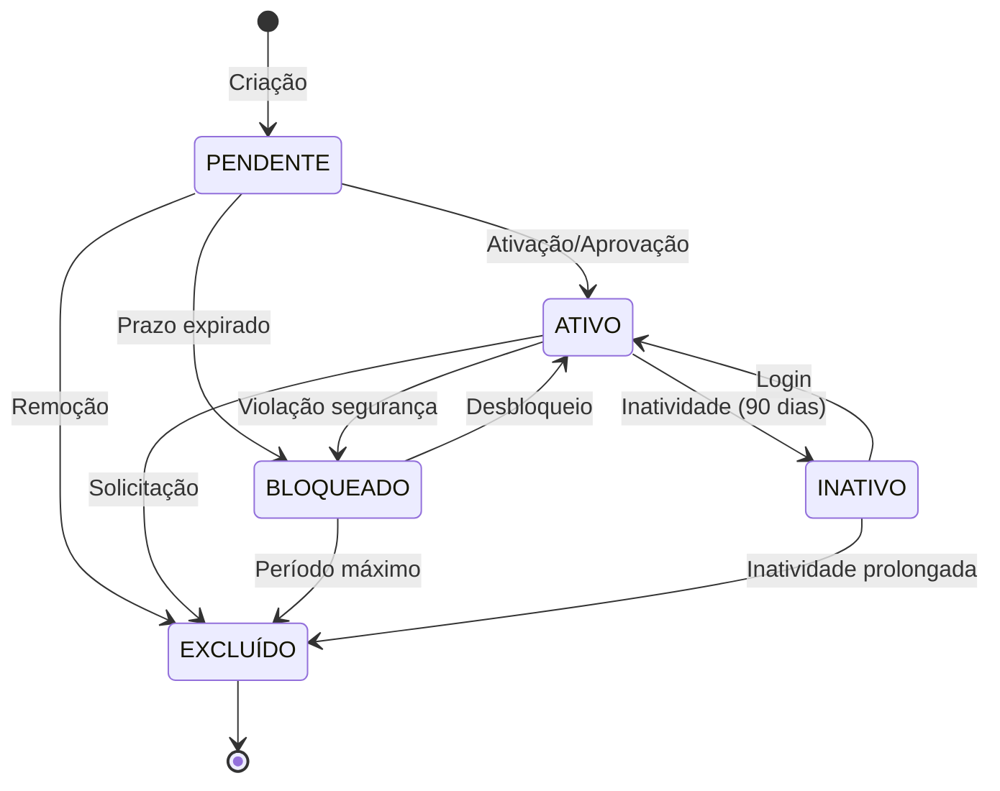

# Estados do Módulo IAM - INNOVABIZ

## Visão Geral

Este documento descreve os estados possíveis para as entidades e processos do módulo IAM (Identity and Access Management). Estes estados são usados para controlar o fluxo de operações e manter a integridade dos dados.

## Estados dos Usuários

| Estado | Descrição | Transições Permitidas | Regras de Negócio |
|--------|-----------|------------------------|-------------------|
| `PENDENTE` | Usuário criado mas não ativado | ATIVO, BLOQUEADO, EXCLUÍDO | Requer validação de email ou aprovação de administrador |
| `ATIVO` | Usuário ativo e operacional | BLOQUEADO, INATIVO, EXCLUÍDO | Pode acessar o sistema conforme suas permissões |
| `BLOQUEADO` | Usuário temporariamente impedido de acessar | ATIVO, EXCLUÍDO | Pode ocorrer por múltiplas tentativas de login ou violação de segurança |
| `INATIVO` | Usuário não utilizado por período prolongado | ATIVO, EXCLUÍDO | Automaticamente após 90 dias sem login |
| `EXCLUÍDO` | Usuário removido | Nenhuma | Dados pessoais anonimizados conforme GDPR/LGPD |

## Estados das Credenciais

| Estado | Descrição | Transições Permitidas | Regras de Negócio |
|--------|-----------|------------------------|-------------------|
| `VÁLIDA` | Credencial ativa e utilizável | EXPIRADA, REVOGADA | Dentro do prazo de validade definido |
| `EXPIRADA` | Credencial com prazo vencido | VÁLIDA, REVOGADA | Requer renovação para voltar a ser válida |
| `REVOGADA` | Credencial invalidada permanentemente | Nenhuma | Não pode ser reativada, necessita nova emissão |
| `PENDENTE_TROCA` | Senha temporária ou que requer alteração | VÁLIDA, REVOGADA | Usuário deve alterar na próxima autenticação |

## Estados dos Tenants

| Estado | Descrição | Transições Permitidas | Regras de Negócio |
|--------|-----------|------------------------|-------------------|
| `ATIVO` | Tenant operacional | SUSPENSO, ENCERRADO | Serviços totalmente disponíveis |
| `SUSPENSO` | Tenant temporariamente desativado | ATIVO, ENCERRADO | Acesso administrativo limitado mantido |
| `ENCERRADO` | Tenant permanentemente encerrado | Nenhuma | Dados arquivados conforme política de retenção |
| `TRIAL` | Tenant em período de avaliação | ATIVO, SUSPENSO, ENCERRADO | Funcionalidades limitadas por tempo determinado |

## Estados dos Provedores de Identidade

| Estado | Descrição | Transições Permitidas | Regras de Negócio |
|--------|-----------|------------------------|-------------------|
| `ATIVO` | Provedor operacional e integrado | INATIVO, ERRO | Autenticação e provisioning funcionais |
| `INATIVO` | Provedor desabilitado | ATIVO, ERRO | Não processa autenticações |
| `ERRO` | Provedor com falha de integração | ATIVO, INATIVO | Requer intervenção técnica |
| `TESTE` | Provedor em fase de testes | ATIVO, INATIVO | Não disponível em produção |

## Estados das Sessões

| Estado | Descrição | Transições Permitidas | Regras de Negócio |
|--------|-----------|------------------------|-------------------|
| `ATIVA` | Sessão em uso | EXPIRADA, ENCERRADA, INVÁLIDA | Acesso normal ao sistema |
| `EXPIRADA` | Sessão com timeout | ATIVA (re-autenticação) | Inatividade excedeu limite configurado |
| `ENCERRADA` | Sessão finalizada normalmente | Nenhuma | Logout realizado pelo usuário |
| `INVÁLIDA` | Sessão invalidada por segurança | Nenhuma | Detecção de alteração de IP, dispositivo ou outro risco |

## Estados das Políticas

| Estado | Descrição | Transições Permitidas | Regras de Negócio |
|--------|-----------|------------------------|-------------------|
| `RASCUNHO` | Política em desenvolvimento | ATIVA, ARQUIVADA | Não aplicada aos objetos do sistema |
| `ATIVA` | Política aplicada e vigente | OBSOLETA, ARQUIVADA | Regras sendo aplicadas no ambiente |
| `OBSOLETA` | Política substituída por versão mais recente | ARQUIVADA | Mantida para referência histórica |
| `ARQUIVADA` | Política não mais relevante | Nenhuma | Mantida apenas para auditoria |

## Estados dos Certificados

| Estado | Descrição | Transições Permitidas | Regras de Negócio |
|--------|-----------|------------------------|-------------------|
| `VÁLIDO` | Certificado ativo e utilizável | EXPIRANDO, EXPIRADO, REVOGADO | Dentro do prazo de validade |
| `EXPIRANDO` | Certificado próximo da expiração | EXPIRADO, RENOVADO, REVOGADO | Alerta de renovação enviado |
| `EXPIRADO` | Certificado com prazo vencido | RENOVADO, REVOGADO | Não pode ser usado para autenticação |
| `REVOGADO` | Certificado invalidado antes do prazo | Nenhuma | Comprometimento de segurança |
| `RENOVADO` | Certificado substituído por nova versão | VÁLIDO | Mantém referência ao certificado anterior |

## Estados dos Jobs de Sincronização

| Estado | Descrição | Transições Permitidas | Regras de Negócio |
|--------|-----------|------------------------|-------------------|
| `AGENDADO` | Job programado para execução futura | EM_EXECUÇÃO, CANCELADO | Aguardando horário programado |
| `EM_EXECUÇÃO` | Job em processamento | CONCLUÍDO, FALHA, CANCELADO | Recursos sendo alocados para o processo |
| `CONCLUÍDO` | Job finalizado com sucesso | Nenhuma | Todos os dados processados corretamente |
| `FALHA` | Job finalizado com erro | AGENDADO (retry) | Requer análise técnica |
| `CANCELADO` | Job interrompido manualmente | AGENDADO | Não conclui o processamento |

## Diagrama de Transição de Estados de Usuário

