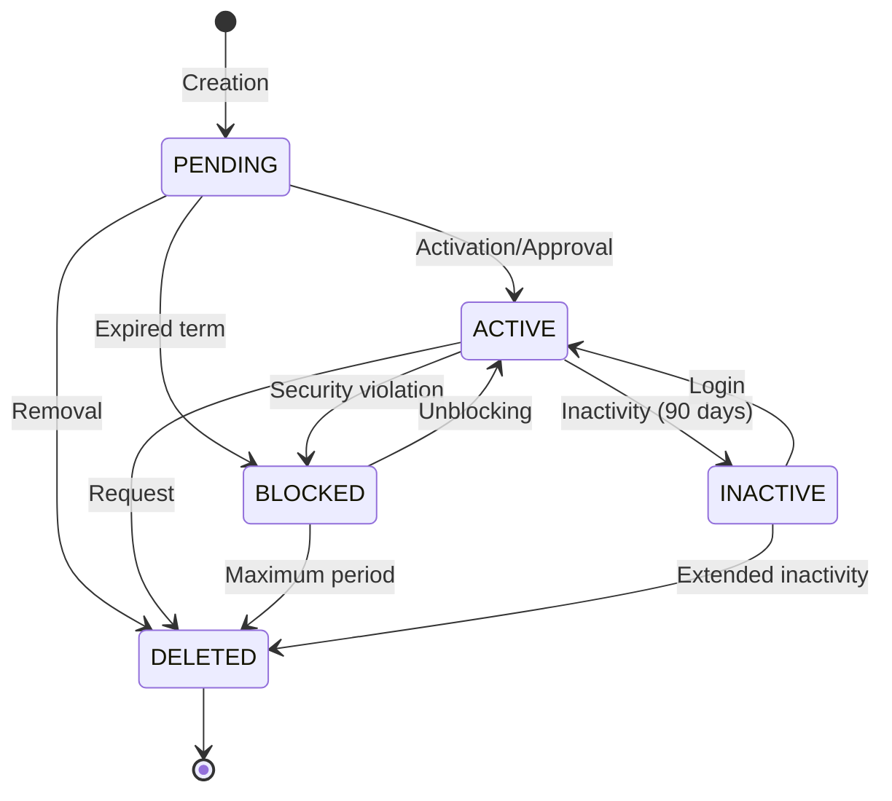

# IAM Module States - INNOVABIZ

## Overview

This document describes the possible states for entities and processes in the IAM (Identity and Access Management) module. These states are used to control the flow of operations and maintain data integrity.

## User States

| State | Description | Allowed Transitions | Business Rules |
|--------|-----------|------------------------|-------------------|
| `PENDING` | User created but not activated | ACTIVE, BLOCKED, DELETED | Requires email validation or administrator approval |
| `ACTIVE` | User active and operational | BLOCKED, INACTIVE, DELETED | Can access the system according to permissions |
| `BLOCKED` | User temporarily prevented from accessing | ACTIVE, DELETED | Can occur due to multiple login attempts or security violation |
| `INACTIVE` | User not used for an extended period | ACTIVE, DELETED | Automatically after 90 days without login |
| `DELETED` | User removed | None | Personal data anonymized according to GDPR/LGPD |

## Credential States

| State | Description | Allowed Transitions | Business Rules |
|--------|-----------|------------------------|-------------------|
| `VALID` | Active and usable credential | EXPIRED, REVOKED | Within the defined validity period |
| `EXPIRED` | Credential with expired term | VALID, REVOKED | Requires renewal to become valid again |
| `REVOKED` | Permanently invalidated credential | None | Cannot be reactivated, requires new issuance |
| `PENDING_CHANGE` | Temporary password or requiring change | VALID, REVOKED | User must change at next authentication |

## Tenant States

| State | Description | Allowed Transitions | Business Rules |
|--------|-----------|------------------------|-------------------|
| `ACTIVE` | Operational tenant | SUSPENDED, TERMINATED | Services fully available |
| `SUSPENDED` | Temporarily deactivated tenant | ACTIVE, TERMINATED | Limited administrative access maintained |
| `TERMINATED` | Permanently terminated tenant | None | Data archived according to retention policy |
| `TRIAL` | Tenant in evaluation period | ACTIVE, SUSPENDED, TERMINATED | Limited functionality for a set time |

## Identity Provider States

| State | Description | Allowed Transitions | Business Rules |
|--------|-----------|------------------------|-------------------|
| `ACTIVE` | Operational and integrated provider | INACTIVE, ERROR | Authentication and provisioning functional |
| `INACTIVE` | Disabled provider | ACTIVE, ERROR | Does not process authentications |
| `ERROR` | Provider with integration failure | ACTIVE, INACTIVE | Requires technical intervention |
| `TESTING` | Provider in testing phase | ACTIVE, INACTIVE | Not available in production |

## Session States

| State | Description | Allowed Transitions | Business Rules |
|--------|-----------|------------------------|-------------------|
| `ACTIVE` | Session in use | EXPIRED, TERMINATED, INVALID | Normal system access |
| `EXPIRED` | Session with timeout | ACTIVE (re-authentication) | Inactivity exceeded configured limit |
| `TERMINATED` | Session normally ended | None | Logout performed by the user |
| `INVALID` | Session invalidated for security | None | Detection of IP change, device or other risk |

## Policy States

| State | Description | Allowed Transitions | Business Rules |
|--------|-----------|------------------------|-------------------|
| `DRAFT` | Policy in development | ACTIVE, ARCHIVED | Not applied to system objects |
| `ACTIVE` | Applied and current policy | OBSOLETE, ARCHIVED | Rules being applied in the environment |
| `OBSOLETE` | Policy replaced by newer version | ARCHIVED | Maintained for historical reference |
| `ARCHIVED` | Policy no longer relevant | None | Maintained only for audit |

## Certificate States

| State | Description | Allowed Transitions | Business Rules |
|--------|-----------|------------------------|-------------------|
| `VALID` | Active and usable certificate | EXPIRING, EXPIRED, REVOKED | Within validity period |
| `EXPIRING` | Certificate nearing expiration | EXPIRED, RENEWED, REVOKED | Renewal alert sent |
| `EXPIRED` | Certificate with expired term | RENEWED, REVOKED | Cannot be used for authentication |
| `REVOKED` | Certificate invalidated before term | None | Security compromise |
| `RENEWED` | Certificate replaced by new version | VALID | Maintains reference to previous certificate |

## Synchronization Job States

| State | Description | Allowed Transitions | Business Rules |
|--------|-----------|------------------------|-------------------|
| `SCHEDULED` | Job programmed for future execution | IN_PROGRESS, CANCELED | Awaiting scheduled time |
| `IN_PROGRESS` | Job in processing | COMPLETED, FAILED, CANCELED | Resources being allocated for the process |
| `COMPLETED` | Job successfully completed | None | All data processed correctly |
| `FAILED` | Job ended with error | SCHEDULED (retry) | Requires technical analysis |
| `CANCELED` | Job manually interrupted | SCHEDULED | Does not complete processing |

## User State Transition Diagram

