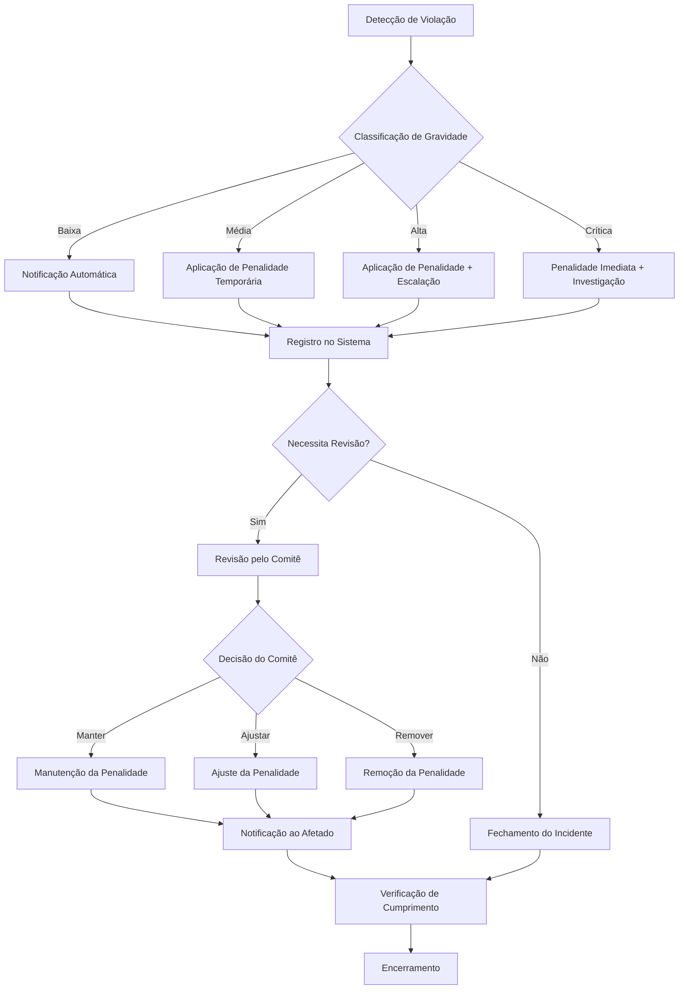

# Penalidades do Módulo IAM - INNOVABIZ

## Visão Geral

Este documento define o sistema de penalidades aplicáveis em caso de violação das políticas, controles e configurações do módulo IAM, bem como as consequências do não-cumprimento dos requisitos regulatórios associados. As penalidades são categorizadas por tipo de violação, gravidade e impacto, fornecendo orientação clara para a gestão de riscos e resposta a incidentes.

## Categorias de Penalidades

### 1. Penalidades de Acesso

| ID | Violação | Nível | Penalidade Automática | Penalidade Manual | Período | Justificativa |
|----|-----------|-------|------------------------|-------------------|----------|---------------|
| PA-001 | Tentativas excessivas de login | Baixo | Bloqueio temporário da conta (15 min) | Análise de segurança | 15 minutos | Prevenção de ataques de força bruta |
| PA-002 | Acesso a partir de localização incomum | Médio | Requisição de MFA adicional | Verificação manual | Até verificação | Prevenção de comprometimento de conta |
| PA-003 | Tentativa de acesso fora do horário permitido | Médio | Bloqueio de acesso | Revisão de acesso | Até aprovação | Conformidade com política de acesso |
| PA-004 | Múltiplas tentativas de acesso a recursos não autorizados | Alto | Bloqueio temporário de sessão | Revisão de privilégios | 24 horas | Prevenção de escalação de privilégios |
| PA-005 | Padrão de comportamento indicando comprometimento | Alto | Encerramento da sessão | Investigação de segurança | Até resolução | Mitigação de risco de segurança |
| PA-006 | Compartilhamento comprovado de credenciais | Crítico | Suspensão da conta | Revisão disciplinar | Indeterminado | Violação de política de segurança |
| PA-007 | Acesso a dados em zonas AR/VR restritas | Alto | Revogação de acesso AR/VR | Treinamento obrigatório | 7 dias | Proteção de dados sensíveis espaciais |

### 2. Penalidades Administrativas

| ID | Violação | Nível | Penalidade Automática | Penalidade Manual | Período | Justificativa |
|----|-----------|-------|------------------------|-------------------|----------|---------------|
| PAD-001 | Não renovação de certificações obrigatórias | Médio | Notificação ao superior | Redução de privilégios | Até renovação | Conformidade com requisitos de competência |
| PAD-002 | Não realização de revisão de acessos | Alto | Alerta de compliance | Auditoria obrigatória | 30 dias | Conformidade com política de gestão de acesso |
| PAD-003 | Não implementação de controles obrigatórios | Alto | Bloqueio de novas concessões | Revisão de conformidade | Até implementação | Redução de riscos de segurança |
| PAD-004 | Criação não autorizada de contas privilegiadas | Crítico | Suspensão da conta administradora | Investigação de segurança | Indeterminado | Prevenção de abuso de privilégios |
| PAD-005 | Não revogação de acessos de ex-colaboradores | Alto | Alerta de compliance | Auditoria completa do tenant | Imediato | Prevenção de acesso não autorizado |
| PAD-006 | Configuração incorreta de isolamento multi-tenant | Crítico | Isolamento automático do tenant | Auditoria forense | Até correção | Prevenção de vazamento de dados |
| PAD-007 | Desabilitação de auditoria ou logging | Crítico | Restauração automática | Investigação de segurança | Imediato | Manutenção de rastreabilidade |

### 3. Penalidades Técnicas

| ID | Violação | Nível | Penalidade Automática | Penalidade Manual | Período | Justificativa |
|----|-----------|-------|------------------------|-------------------|----------|---------------|
| PT-001 | Não aplicação de patches críticos | Alto | Limitação de funcionalidades | Auditoria de segurança | Até aplicação | Redução de vulnerabilidades |
| PT-002 | Configuração de senha abaixo do padrão | Médio | Alerta ao administrador | Revisão de configuração | 7 dias | Conformidade com política de senhas |
| PT-003 | Desabilitação de MFA para contas privilegiadas | Alto | Reativação automática | Revisão de privilégios | Imediato | Manutenção da segurança de contas críticas |
| PT-004 | Configuração inadequada de federação | Alto | Suspensão da federação | Auditoria de configuração | Até correção | Prevenção de falhas de autenticação |
| PT-005 | Exposição de tokens ou segredos | Crítico | Revogação de todos os tokens | Investigação de segurança | Imediato | Prevenção de comprometimento |
| PT-006 | Alteração não autorizada de políticas RLS | Crítico | Restauração de backup | Auditoria forense | Imediato | Prevenção de quebra de isolamento |
| PT-007 | Implementação inadequada de segurança AR/VR | Alto | Limitação de funcionalidades AR/VR | Revisão técnica | Até correção | Proteção de dados perceptuais |

## Penalidades Regulatórias por Região

### União Europeia (GDPR)

| ID | Tipo de Violação | Nível de Gravidade | Penalidade Potencial | Ação Corretiva Recomendada |
|----|-------------------|-------------------|----------------------|----------------------------|
| GDPR-01 | Falha no controle de acesso a dados pessoais | Alto | Até 10 milhões de euros ou 2% do faturamento global | Implementação imediata de controles de acesso adequados |
| GDPR-02 | Falha na implementação da pseudonimização | Médio | Sanções administrativas | Implementação de pseudonimização de dados |
| GDPR-03 | Falha no registro de atividades de processamento | Alto | Sanções administrativas | Ativação e configuração adequada de auditoria |
| GDPR-04 | Falha na implementação de direitos do titular | Crítico | Até 20 milhões de euros ou 4% do faturamento global | Implementação de processos para atender direitos dos titulares |
| GDPR-05 | Violação de dados sem notificação adequada | Crítico | Até 20 milhões de euros ou 4% do faturamento global | Implementação de processos de notificação de violação |
| GDPR-06 | Falha na implementação de privacy by design | Alto | Até 10 milhões de euros ou 2% do faturamento global | Revisão e reconfiguração das políticas de acesso |
| GDPR-07 | Ausência de DPO quando obrigatório | Médio | Sanções administrativas | Designação de DPO qualificado |

### Brasil (LGPD)

| ID | Tipo de Violação | Nível de Gravidade | Penalidade Potencial | Ação Corretiva Recomendada |
|----|-------------------|-------------------|----------------------|----------------------------|
| LGPD-01 | Tratamento inadequado de dados pessoais | Alto | Até 2% do faturamento, limitado a R$ 50 milhões | Revisão de processos de tratamento de dados |
| LGPD-02 | Falha na implementação de medidas de segurança | Alto | Bloqueio dos dados pessoais | Implementação imediata de controles de segurança |
| LGPD-03 | Falha na resposta a solicitações de titulares | Médio | Advertência com prazo para correção | Configuração de processos para direitos dos titulares |
| LGPD-04 | Transferência internacional inadequada | Alto | Suspensão do tratamento | Revisão de políticas de transferência internacional |
| LGPD-05 | Violação de dados sem notificação | Crítico | Multa diária | Implementação de processos de notificação de violação |
| LGPD-06 | Ausência de base legal para tratamento | Crítico | Eliminação dos dados pessoais | Revisão das bases legais para tratamento |
| LGPD-07 | Não indicação de encarregado (DPO) | Médio | Advertência | Designação de encarregado qualificado |

### Estados Unidos (HIPAA - Saúde)

| ID | Tipo de Violação | Nível de Gravidade | Penalidade Potencial | Ação Corretiva Recomendada |
|----|-------------------|-------------------|----------------------|----------------------------|
| HIPAA-01 | Falha no controle de acesso a PHI | Alto | US$ 50.000 por violação, máximo de US$ 1,5 milhão/ano | Implementação de controles de acesso granulares |
| HIPAA-02 | Ausência de criptografia para PHI | Alto | US$ 50.000 por violação | Implementação de criptografia para dados em repouso e trânsito |
| HIPAA-03 | Falha na auditoria de acesso a PHI | Alto | US$ 25.000 por violação | Configuração adequada de trilhas de auditoria |
| HIPAA-04 | Violação de PHI sem notificação | Crítico | US$ 50.000 por violação + ações criminais | Implementação de processos de notificação de violações |
| HIPAA-05 | Compartilhamento inadequado de PHI | Crítico | US$ 50.000 por violação + ações criminais | Revisão de políticas de compartilhamento |
| HIPAA-06 | Falta de avaliação de risco | Médio | US$ 25.000 por violação | Realização de avaliação de risco |
| HIPAA-07 | Acesso inadequado a dados de saúde via AR/VR | Alto | US$ 50.000 por violação | Implementação de controles específicos para AR/VR em saúde |

### Angola (PNDSB - Saúde)

| ID | Tipo de Violação | Nível de Gravidade | Penalidade Potencial | Ação Corretiva Recomendada |
|----|-------------------|-------------------|----------------------|----------------------------|
| PNDSB-01 | Falha no controle de acesso a dados de saúde | Alto | Sanções administrativas | Implementação de controles de acesso específicos |
| PNDSB-02 | Divulgação não autorizada de dados de saúde | Crítico | Sanções administrativas e criminais | Revisão de políticas de compartilhamento |
| PNDSB-03 | Não cumprimento de diretrizes de segurança | Médio | Advertência oficial | Conformidade com diretrizes de segurança |
| PNDSB-04 | Transferência inadequada de dados de saúde | Alto | Suspensão de atividades | Implementação de controles de transferência |
| PNDSB-05 | Falha na preservação da confidencialidade | Alto | Sanções administrativas | Reforço de controles de confidencialidade |
| PNDSB-06 | Não obtenção de consentimento adequado | Médio | Advertência oficial | Implementação de processos de consentimento |
| PNDSB-07 | Integração inadequada com sistema nacional | Alto | Suspensão parcial de acesso | Conformidade com requisitos de integração |

## Penalidades Setoriais

### Setor de Saúde

| ID | Tipo de Violação | Nível de Gravidade | Penalidade Potencial | Ação Corretiva Recomendada |
|----|-------------------|-------------------|----------------------|----------------------------|
| HSC-01 | Acesso não autorizado a prontuários | Crítico | Suspensão de acesso + auditoria | Revisão de política de acesso a prontuários |
| HSC-02 | Falha na integração com padrões HL7 FHIR | Alto | Limitação de funcionalidades | Correção da implementação FHIR |
| HSC-03 | Compartilhamento inadequado via telemedicina | Crítico | Suspensão de acesso a telemedicina | Revisão de políticas de telemedicina |
| HSC-04 | Falha na implementação de break-glass | Alto | Alerta ao regulador | Implementação adequada de acesso emergencial |
| HSC-05 | Sem validação de profissional de saúde | Alto | Suspensão de novos cadastros | Implementação de verificação de credenciais |
| HSC-06 | Visualização inadequada de dados de saúde em AR | Alto | Desativação de componentes AR | Implementação de proteções de privacidade em AR |
| HSC-07 | Controles inadequados para dispositivos médicos | Médio | Limitação de integrações | Implementação de controles IoMT |

### Setor Financeiro

| ID | Tipo de Violação | Nível de Gravidade | Penalidade Potencial | Ação Corretiva Recomendada |
|----|-------------------|-------------------|----------------------|----------------------------|
| FSC-01 | Falha na implementação de PCI DSS | Crítico | Suspensão de processamento de pagamentos | Implementação completa de controles PCI DSS |
| FSC-02 | Violação de segregação de funções | Alto | Revisão completa de permissões | Implementação de políticas SoD |
| FSC-03 | Falha na implementação de 2FA/MFA | Alto | Suspensão de transações | Ativação de MFA para todas as contas |
| FSC-04 | Acesso não aprovado a dados financeiros | Crítico | Suspensão de acesso | Implementação de aprovação multi-nível |
| FSC-05 | Violação de requisitos de auditoria | Alto | Multa regulatória | Ativação de auditoria completa |
| FSC-06 | Não cumprimento de requisitos de KYC | Alto | Limitação de transações | Implementação de processos KYC |
| FSC-07 | Falha na proteção de dados em Open Finance | Alto | Suspensão de APIs | Revisão de controles de acesso a APIs |

## Processo de Aplicação de Penalidades

### Fluxo de Aplicação

### Níveis de Aprovação

| Nível de Gravidade | Aplicação Automática | Revisão Requerida | Aprovador de Reversão | Tempo Máximo de Resposta |
|--------------------|----------------------|-------------------|------------------------|--------------------------|
| Baixo | Sim | Não | Administrador do Sistema | 24 horas |
| Médio | Sim | Opcional | Administrador de Segurança | 12 horas |
| Alto | Parcial | Sim | Comitê de Segurança | 4 horas |
| Crítico | Limitada | Sim | CISO + Comitê de Segurança | 1 hora |

### Exceções e Recursos

1. **Processo de Exceção**: Em situações excepcionais, uma exceção temporária pode ser solicitada através do sistema de tickets de segurança, com justificativa detalhada e período específico.

2. **Processo de Recurso**: Usuários ou administradores que discordem da penalidade aplicada podem solicitar revisão dentro de 5 dias úteis através do sistema de tickets, fornecendo evidências e justificativas.

3. **Resolução Acelerada**: Para penalidades que impactem operações críticas de negócio, existe um processo de resolução acelerada que exige a aprovação do CISO ou seu representante designado.

## Mitigação e Prevenção

### Medidas Preventivas

| Categoria | Medida | Responsável | Frequência | Benefício |
|-----------|--------|-------------|------------|-----------|
| Educação | Treinamento em IAM | Time de Segurança | Trimestral | Redução de violações por desconhecimento |
| Tecnologia | Análise automática de configurações | Sistema IAM | Diária | Detecção precoce de configurações de risco |
| Processos | Revisão de acessos | Gestores | Trimestral | Eliminação de acessos desnecessários |
| Monitoramento | Detecção de anomalias | Sistema IAM | Contínuo | Identificação de comportamentos suspeitos |
| Governança | Auditoria de políticas | Compliance | Semestral | Garantia de alinhamento com regulamentações |
| Comunicação | Alertas de segurança | Sistema IAM | Conforme necessário | Conscientização sobre ameaças emergentes |
| Automação | Remediation-as-code | DevSecOps | Contínuo | Correção automática de configurações de risco |

### Plano de Remediação

Após a aplicação de uma penalidade, o seguinte plano de remediação deve ser seguido:

1. **Análise de Causa Raiz**: Identificação dos fatores técnicos, processuais ou humanos que levaram à violação.
2. **Correção Imediata**: Implementação de correções técnicas ou processuais para resolver a vulnerabilidade.
3. **Prevenção de Recorrência**: Estabelecimento de controles preventivos para evitar incidentes similares.
4. **Verificação de Eficácia**: Validação de que as medidas implementadas resolveram efetivamente o problema.
5. **Relatório de Lições Aprendidas**: Documentação do incidente e distribuição de aprendizados relevantes.
6. **Atualização de Políticas**: Revisão e atualização de políticas e procedimentos conforme necessário.
7. **Treinamento Específico**: Realização de treinamento direcionado para as áreas afetadas ou vulneráveis.

## Monitoramento e Métricas

### Indicadores-Chave de Desempenho (KPIs)

| KPI | Descrição | Meta | Tendência Desejada | Frequência de Medição |
|-----|-----------|------|---------------------|------------------------|
| Taxa de Violações | % de usuários com violações | < 1% | ↓ Descendente | Mensal |
| Tempo Médio de Detecção | Tempo para detectar violação | < 1 hora | ↓ Descendente | Mensal |
| Tempo Médio de Resolução | Tempo para resolver violação | < 24 horas | ↓ Descendente | Mensal |
| Taxa de Recorrência | % de violações recorrentes | < 5% | ↓ Descendente | Trimestral |
| Eficácia de Remediação | % de violações sem recorrência | > 95% | ↑ Ascendente | Trimestral |
| Cobertura de Treinamento | % de usuários treinados | > 98% | ↑ Ascendente | Trimestral |
| Maturidade de Controles | Índice composto de maturidade | > 4.0/5.0 | ↑ Ascendente | Semestral |

### Dashboard de Compliance

O módulo IAM inclui um dashboard de compliance que exibe:

1. **Visão Geral**: Status geral de compliance com códigos de cores (Verde, Amarelo, Vermelho).
2. **Violações Ativas**: Contagem e detalhes de violações ativas por categoria e gravidade.
3. **Tendências**: Gráficos de tendências de violações ao longo do tempo.
4. **Top Violações**: Ranking das violações mais frequentes.
5. **Mapa de Calor**: Visualização de áreas com maior concentração de violações.
6. **Alertas de Regulação**: Notificações sobre mudanças regulatórias relevantes.
7. **Ações Pendentes**: Lista de ações corretivas pendentes com prazos.

## Revisão e Atualização

Este documento de penalidades deve ser revisado e atualizado:

1. Anualmente, como parte do ciclo de revisão de políticas de segurança.
2. Após mudanças significativas em regulamentações aplicáveis.
3. Após incidentes de segurança relevantes que indiquem necessidade de ajustes.
4. Quando novas tecnologias ou funcionalidades forem implementadas no módulo IAM.

A revisão deve ser conduzida pelo comitê de segurança da informação com participação das áreas de compliance, jurídico e representantes técnicos do IAM.

---

**Aprovação**: Comitê de Segurança da Informação  
**Versão**: 1.0  
**Data**: Janeiro 2025  
**Próxima Revisão Programada**: Janeiro 2026
