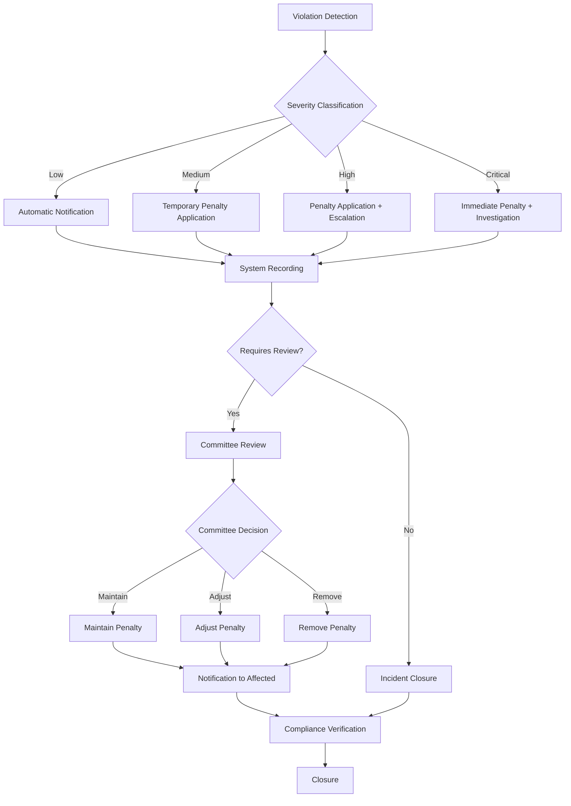

# IAM Module Penalties - INNOVABIZ

## Overview

This document defines the penalty system applicable in case of violation of the IAM module policies, controls, and configurations, as well as the consequences of non-compliance with associated regulatory requirements. Penalties are categorized by type of violation, severity, and impact, providing clear guidance for risk management and incident response.

## Penalty Categories

### 1. Access Penalties

| ID | Violation | Level | Automatic Penalty | Manual Penalty | Period | Rationale |
|----|-----------|-------|-------------------|----------------|--------|-----------|
| PA-001 | Excessive login attempts | Low | Temporary account lockout (15 min) | Security analysis | 15 minutes | Prevention of brute force attacks |
| PA-002 | Access from unusual location | Medium | Additional MFA request | Manual verification | Until verification | Prevention of account compromise |
| PA-003 | Access attempt outside allowed hours | Medium | Access blocking | Access review | Until approval | Compliance with access policy |
| PA-004 | Multiple unauthorized resource access attempts | High | Temporary session block | Privilege review | 24 hours | Prevention of privilege escalation |
| PA-005 | Behavior pattern indicating compromise | High | Session termination | Security investigation | Until resolution | Security risk mitigation |
| PA-006 | Proven credential sharing | Critical | Account suspension | Disciplinary review | Indefinite | Security policy violation |
| PA-007 | Access to data in restricted AR/VR zones | High | AR/VR access revocation | Mandatory training | 7 days | Protection of sensitive spatial data |

### 2. Administrative Penalties

| ID | Violation | Level | Automatic Penalty | Manual Penalty | Period | Rationale |
|----|-----------|-------|-------------------|----------------|--------|-----------|
| PAD-001 | Non-renewal of mandatory certifications | Medium | Notification to supervisor | Privilege reduction | Until renewal | Compliance with competence requirements |
| PAD-002 | Failure to conduct access review | High | Compliance alert | Mandatory audit | 30 days | Compliance with access management policy |
| PAD-003 | Non-implementation of mandatory controls | High | Block of new grants | Compliance review | Until implementation | Security risk reduction |
| PAD-004 | Unauthorized creation of privileged accounts | Critical | Administrator account suspension | Security investigation | Indefinite | Prevention of privilege abuse |
| PAD-005 | Failure to revoke ex-employee access | High | Compliance alert | Complete tenant audit | Immediate | Prevention of unauthorized access |
| PAD-006 | Incorrect multi-tenant isolation configuration | Critical | Automatic tenant isolation | Forensic audit | Until correction | Prevention of data leakage |
| PAD-007 | Disabling of auditing or logging | Critical | Automatic restoration | Security investigation | Immediate | Maintenance of traceability |

### 3. Technical Penalties

| ID | Violation | Level | Automatic Penalty | Manual Penalty | Period | Rationale |
|----|-----------|-------|-------------------|----------------|--------|-----------|
| PT-001 | Non-application of critical patches | High | Functionality limitation | Security audit | Until application | Vulnerability reduction |
| PT-002 | Password configuration below standard | Medium | Administrator alert | Configuration review | 7 days | Compliance with password policy |
| PT-003 | MFA disabling for privileged accounts | High | Automatic reactivation | Privilege review | Immediate | Maintenance of critical account security |
| PT-004 | Inadequate federation configuration | High | Federation suspension | Configuration audit | Until correction | Prevention of authentication failures |
| PT-005 | Exposure of tokens or secrets | Critical | Revocation of all tokens | Security investigation | Immediate | Prevention of compromise |
| PT-006 | Unauthorized modification of RLS policies | Critical | Backup restoration | Forensic audit | Immediate | Prevention of isolation breach |
| PT-007 | Inadequate implementation of AR/VR security | High | AR/VR functionality limitation | Technical review | Until correction | Protection of perceptual data |

## Regulatory Penalties by Region

### European Union (GDPR)

| ID | Violation Type | Severity Level | Potential Penalty | Recommended Corrective Action |
|----|----------------|----------------|-------------------|-------------------------------|
| GDPR-01 | Failure in access control to personal data | High | Up to €10 million or 2% of global turnover | Immediate implementation of adequate access controls |
| GDPR-02 | Failure to implement pseudonymization | Medium | Administrative sanctions | Implementation of data pseudonymization |
| GDPR-03 | Failure to maintain records of processing activities | High | Administrative sanctions | Proper activation and configuration of auditing |
| GDPR-04 | Failure to implement data subject rights | Critical | Up to €20 million or 4% of global turnover | Implementation of processes to fulfill data subject rights |
| GDPR-05 | Data breach without proper notification | Critical | Up to €20 million or 4% of global turnover | Implementation of breach notification processes |
| GDPR-06 | Failure to implement privacy by design | High | Up to €10 million or 2% of global turnover | Review and reconfiguration of access policies |
| GDPR-07 | Absence of DPO when mandatory | Medium | Administrative sanctions | Designation of qualified DPO |

### Brazil (LGPD)

| ID | Violation Type | Severity Level | Potential Penalty | Recommended Corrective Action |
|----|----------------|----------------|-------------------|-------------------------------|
| LGPD-01 | Inadequate processing of personal data | High | Up to 2% of turnover, limited to R$50 million | Review of data processing procedures |
| LGPD-02 | Failure to implement security measures | High | Blocking of personal data | Immediate implementation of security controls |
| LGPD-03 | Failure to respond to data subject requests | Medium | Warning with correction deadline | Configuration of processes for data subject rights |
| LGPD-04 | Inadequate international transfer | High | Processing suspension | Review of international transfer policies |
| LGPD-05 | Data breach without notification | Critical | Daily fine | Implementation of breach notification processes |
| LGPD-06 | Absence of legal basis for processing | Critical | Elimination of personal data | Review of legal bases for processing |
| LGPD-07 | Failure to appoint DPO | Medium | Warning | Designation of qualified DPO |

### United States (HIPAA - Healthcare)

| ID | Violation Type | Severity Level | Potential Penalty | Recommended Corrective Action |
|----|----------------|----------------|-------------------|-------------------------------|
| HIPAA-01 | Failure in PHI access control | High | US$50,000 per violation, max US$1.5 million/year | Implementation of granular access controls |
| HIPAA-02 | Absence of encryption for PHI | High | US$50,000 per violation | Implementation of encryption for data at rest and in transit |
| HIPAA-03 | Failure in PHI access auditing | High | US$25,000 per violation | Proper configuration of audit trails |
| HIPAA-04 | PHI breach without notification | Critical | US$50,000 per violation + criminal actions | Implementation of breach notification processes |
| HIPAA-05 | Inappropriate PHI sharing | Critical | US$50,000 per violation + criminal actions | Review of sharing policies |
| HIPAA-06 | Lack of risk assessment | Medium | US$25,000 per violation | Performance of risk assessment |
| HIPAA-07 | Inadequate access to health data via AR/VR | High | US$50,000 per violation | Implementation of specific controls for AR/VR in healthcare |

### Angola (PNDSB - Healthcare)

| ID | Violation Type | Severity Level | Potential Penalty | Recommended Corrective Action |
|----|----------------|----------------|-------------------|-------------------------------|
| PNDSB-01 | Failure in health data access control | High | Administrative sanctions | Implementation of specific access controls |
| PNDSB-02 | Unauthorized disclosure of health data | Critical | Administrative and criminal sanctions | Review of sharing policies |
| PNDSB-03 | Non-compliance with security guidelines | Medium | Official warning | Compliance with security guidelines |
| PNDSB-04 | Inadequate health data transfer | High | Activity suspension | Implementation of transfer controls |
| PNDSB-05 | Failure to preserve confidentiality | High | Administrative sanctions | Reinforcement of confidentiality controls |
| PNDSB-06 | Failure to obtain adequate consent | Medium | Official warning | Implementation of consent processes |
| PNDSB-07 | Inadequate integration with national system | High | Partial access suspension | Compliance with integration requirements |

## Sectoral Penalties

### Healthcare Sector

| ID | Violation Type | Severity Level | Potential Penalty | Recommended Corrective Action |
|----|----------------|----------------|-------------------|-------------------------------|
| HSC-01 | Unauthorized access to medical records | Critical | Access suspension + audit | Review of medical record access policy |
| HSC-02 | Failure in HL7 FHIR standards integration | High | Functionality limitation | Correction of FHIR implementation |
| HSC-03 | Inappropriate sharing via telemedicine | Critical | Telemedicine access suspension | Review of telemedicine policies |
| HSC-04 | Failure to implement break-glass | High | Regulator alert | Proper implementation of emergency access |
| HSC-05 | No validation of healthcare professional | High | Suspension of new registrations | Implementation of credential verification |
| HSC-06 | Inadequate viewing of health data in AR | High | Deactivation of AR components | Implementation of privacy protections in AR |
| HSC-07 | Inadequate controls for medical devices | Medium | Integration limitation | Implementation of IoMT controls |

### Financial Sector

| ID | Violation Type | Severity Level | Potential Penalty | Recommended Corrective Action |
|----|----------------|----------------|-------------------|-------------------------------|
| FSC-01 | Failure to implement PCI DSS | Critical | Payment processing suspension | Complete implementation of PCI DSS controls |
| FSC-02 | Violation of segregation of duties | High | Complete permission review | Implementation of SoD policies |
| FSC-03 | Failure to implement 2FA/MFA | High | Transaction suspension | MFA activation for all accounts |
| FSC-04 | Unapproved access to financial data | Critical | Access suspension | Implementation of multi-level approval |
| FSC-05 | Violation of audit requirements | High | Regulatory fine | Activation of full audit |
| FSC-06 | Non-compliance with KYC requirements | High | Transaction limitation | Implementation of KYC processes |
| FSC-07 | Failure to protect data in Open Finance | High | API suspension | Review of API access controls |

## Penalty Application Process

### Application Flow

### Approval Levels

| Severity Level | Automatic Application | Review Required | Reversal Approver | Maximum Response Time |
|----------------|----------------------|-----------------|-------------------|------------------------|
| Low | Yes | No | System Administrator | 24 hours |
| Medium | Yes | Optional | Security Administrator | 12 hours |
| High | Partial | Yes | Security Committee | 4 hours |
| Critical | Limited | Yes | CISO + Security Committee | 1 hour |

### Exceptions and Appeals

1. **Exception Process**: In exceptional situations, a temporary exception can be requested through the security ticket system, with detailed justification and specific period.

2. **Appeal Process**: Users or administrators who disagree with the applied penalty can request a review within 5 business days through the ticket system, providing evidence and justifications.

3. **Accelerated Resolution**: For penalties that impact critical business operations, there is an accelerated resolution process that requires approval from the CISO or their designated representative.

## Mitigation and Prevention

### Preventive Measures

| Category | Measure | Responsible | Frequency | Benefit |
|----------|---------|-------------|-----------|---------|
| Education | IAM Training | Security Team | Quarterly | Reduction of violations due to lack of knowledge |
| Technology | Automatic Configuration Analysis | IAM System | Daily | Early detection of risk configurations |
| Processes | Access Review | Managers | Quarterly | Elimination of unnecessary access |
| Monitoring | Anomaly Detection | IAM System | Continuous | Identification of suspicious behaviors |
| Governance | Policy Audit | Compliance | Semi-annual | Assurance of alignment with regulations |
| Communication | Security Alerts | IAM System | As needed | Awareness of emerging threats |
| Automation | Remediation-as-code | DevSecOps | Continuous | Automatic correction of risk configurations |

### Remediation Plan

After applying a penalty, the following remediation plan should be followed:

1. **Root Cause Analysis**: Identification of technical, procedural, or human factors that led to the violation.
2. **Immediate Correction**: Implementation of technical or procedural corrections to address the vulnerability.
3. **Recurrence Prevention**: Establishment of preventive controls to avoid similar incidents.
4. **Effectiveness Verification**: Validation that the implemented measures effectively resolved the problem.
5. **Lessons Learned Report**: Documentation of the incident and distribution of relevant learnings.
6. **Policy Update**: Review and update of policies and procedures as necessary.
7. **Specific Training**: Conduct of targeted training for affected or vulnerable areas.

## Monitoring and Metrics

### Key Performance Indicators (KPIs)

| KPI | Description | Target | Desired Trend | Measurement Frequency |
|-----|-------------|--------|---------------|------------------------|
| Violation Rate | % of users with violations | < 1% | ↓ Downward | Monthly |
| Mean Time to Detect | Time to detect violation | < 1 hour | ↓ Downward | Monthly |
| Mean Time to Resolve | Time to resolve violation | < 24 hours | ↓ Downward | Monthly |
| Recurrence Rate | % of recurring violations | < 5% | ↓ Downward | Quarterly |
| Remediation Effectiveness | % of violations without recurrence | > 95% | ↑ Upward | Quarterly |
| Training Coverage | % of trained users | > 98% | ↑ Upward | Quarterly |
| Control Maturity | Composite maturity index | > 4.0/5.0 | ↑ Upward | Semi-annual |

### Compliance Dashboard

The IAM module includes a compliance dashboard that displays:

1. **Overview**: General compliance status with color codes (Green, Yellow, Red).
2. **Active Violations**: Count and details of active violations by category and severity.
3. **Trends**: Charts of violation trends over time.
4. **Top Violations**: Ranking of the most frequent violations.
5. **Heat Map**: Visualization of areas with higher concentration of violations.
6. **Regulation Alerts**: Notifications about relevant regulatory changes.
7. **Pending Actions**: List of pending corrective actions with deadlines.

## Review and Update

This penalties document should be reviewed and updated:

1. Annually, as part of the security policy review cycle.
2. After significant changes in applicable regulations.
3. After relevant security incidents that indicate the need for adjustments.
4. When new technologies or functionalities are implemented in the IAM module.

The review should be conducted by the information security committee with participation from compliance, legal, and IAM technical representatives.

---

**Approval**: Information Security Committee  
**Version**: 1.0  
**Date**: January 2025  
**Next Scheduled Review**: January 2026
