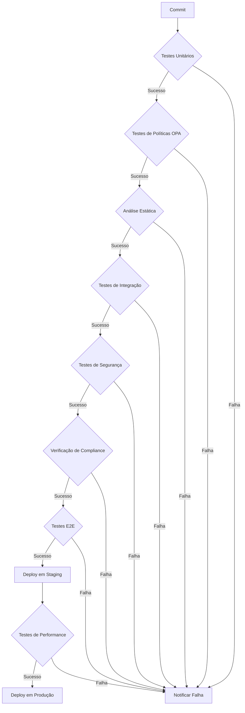

# Diretrizes de Implementação de Testes Automatizados - MCP-IAM

## Sumário Executivo

Este documento estabelece as diretrizes técnicas e metodológicas para a implementação dos testes automatizados do sistema de Autorização Avançada MCP-IAM da plataforma INNOVABIZ, complementando o Plano de Testes Automatizados. Estas diretrizes visam garantir que a implementação dos testes esteja alinhada com os padrões internacionais, requisitos regulatórios e as melhores práticas de engenharia de software e segurança da informação.

## 1. Princípios Fundamentais

### 1.1. Alinhamento com Governança Corporativa

A implementação dos testes deve estar alinhada com os seguintes princípios corporativos da INNOVABIZ:

| Princípio | Aplicação em Testes | Medição |
|-----------|---------------------|---------|
| Segurança por Design | Testes integrados desde o início do SDLC | % de requisitos de segurança cobertos |
| Privacidade por Padrão | Minimização de dados em ambientes de teste | Conformidade com LGPD/GDPR em testes |
| Auditabilidade Total | Rastreabilidade de falhas e execuções | Cobertura de logs de execução |
| Conformidade Contínua | Validação constante contra requisitos | % de controles regulatórios automatizados |
| Escalabilidade | Testes que validam comportamento sob carga | Cobertura de cenários de carga |
| Interoperabilidade | Testes de integração entre módulos | % de interfaces testadas |

### 1.2. Padrões Técnicos

A implementação dos testes deve seguir estes padrões técnicos:

| Padrão | Framework/Ferramenta | Aplicação |
|--------|---------------------|-----------|
| BDD (Gherkin) | Cucumber/Godog | Especificações de testes E2E |
| TDD | Go testing | Desenvolvimento guiado por testes |
| Mocks | Gomock/Testify | Isolamento de componentes |
| API Testing | Postman/Newman | Testes de contrato de API |
| Load Testing | K6/Gatling | Testes de performance |
| Security Testing | OWASP ZAP/SonarQube | Análise de vulnerabilidades |
| OPA Testing | Conftest/Rego Playground | Validação de políticas |

## 2. Arquitetura de Testes

### 2.1. Camadas de Teste

A arquitetura dos testes seguirá um modelo em camadas para garantir cobertura abrangente:


#### 2.1.1. Camada de Testes Unitários

**Responsabilidade**: Validar o comportamento isolado dos componentes core.

**Estrutura Organizacional**:

```
└── tests/
    └── unit/
        ├── authorization/
        │   ├── rbac_test.go
        │   ├── abac_test.go
        │   ├── rebac_test.go
        │   └── cbac_test.go
        ├── risk/
        │   ├── evaluator_test.go
        │   └── factors_test.go
        ├── elevation/
        │   ├── request_test.go
        │   └── approval_test.go
        └── hooks/
            ├── docker_hooks_test.go
            ├── desktop_hooks_test.go
            └── github_hooks_test.go
```

**Padrões de Implementação**:

```go
// Exemplo de estrutura de testes unitários
func TestSuiteXYZ(t *testing.T) {
    suite.Run(t, new(XYZTestSuite))
}

type XYZTestSuite struct {
    suite.Suite
    
    // Dependências mockadas
    mockRepo      *mocks.Repository
    mockValidator *mocks.Validator
    mockLogger    *mocks.Logger
    
    // Sistema em teste (SUT)
    service *authorization.Service
}

func (s *XYZTestSuite) SetupTest() {
    // Configuração executada antes de cada teste
    s.mockRepo = mocks.NewRepository(s.T())
    s.mockValidator = mocks.NewValidator(s.T())
    s.mockLogger = mocks.NewLogger(s.T())
    
    s.service = authorization.NewService(
        authorization.WithRepository(s.mockRepo),
        authorization.WithValidator(s.mockValidator),
        authorization.WithLogger(s.mockLogger),
    )
}

func (s *XYZTestSuite) TestAuthorizeValidRequest() {
    // Arrange
    ctx := context.Background()
    req := &types.AuthRequest{
        Subject: "user:123",
        Resource: "api:endpoint:123",
        Action: "read",
    }
    
    s.mockRepo.EXPECT().
        GetPermissions(ctx, "user:123").
        Return([]string{"read:api:endpoint:*"}, nil)
    
    s.mockValidator.EXPECT().
        ValidatePermission("read:api:endpoint:*", "api:endpoint:123", "read").
        Return(true)
    
    s.mockLogger.EXPECT().
        LogDecision(ctx, gomock.Any()).
        Return(nil)
    
    // Act
    result, err := s.service.Authorize(ctx, req)
    
    // Assert
    s.NoError(err)
    s.True(result.Allowed)
    s.Equal("permission_matched", result.Reason)
}
```

#### 2.1.2. Camada de Testes de Integração

**Responsabilidade**: Validar a interação entre componentes e sistemas externos.

**Abordagem TestContainers**:

```go
// Exemplo de teste com TestContainers
func TestOPAIntegration(t *testing.T) {
    ctx := context.Background()
    
    // Inicializar container OPA
    opaReq := testcontainers.ContainerRequest{
        Image:        "openpolicyagent/opa:latest",
        ExposedPorts: []string{"8181/tcp"},
        Cmd:          []string{"run", "--server", "--addr", ":8181"},
        WaitingFor:   wait.ForHTTP("/health").WithPort("8181/tcp"),
    }
    
    opaContainer, err := testcontainers.GenericContainer(ctx, testcontainers.GenericContainerRequest{
        ContainerRequest: opaReq,
        Started:          true,
    })
    require.NoError(t, err)
    defer opaContainer.Terminate(ctx)
    
    // Obter porta mapeada
    mappedPort, err := opaContainer.MappedPort(ctx, "8181/tcp")
    require.NoError(t, err)
    
    // Configurar cliente OPA
    opaURL := fmt.Sprintf("http://localhost:%s", mappedPort.Port())
    client := opa.NewClient(opaURL)
    
    // Carregar política de teste
    policyData := `package test
    allow { input.user == "admin" }`
    
    err = client.SetPolicy(ctx, "test", policyData)
    require.NoError(t, err)
    
    // Executar consulta
    result, err := client.Query(ctx, "data.test.allow", map[string]interface{}{
        "user": "admin",
    })
    require.NoError(t, err)
    assert.True(t, result.(bool))
}
```

### 2.2. Design de Dados de Teste#### 2.2.1. Estratégia de Dados

Os dados para testes devem seguir uma estrutura bem definida para garantir consistência e cobertura:

| Tipo de Dados | Propósito | Implementação | Armazenamento |
|---------------|-----------|---------------|--------------|
| Dados Fixos | Casos de teste básicos | Embutidos em código | Arquivos JSON/YAML |
| Dados Gerados | Testes parametrizados | Geradores automatizados | Gerados em tempo real |
| Dados de Carga | Testes de volume | Geradores de grande escala | Arquivos/Banco de dados |
| Dados Reais Anonimizados | Testes realistas | Dados de produção anonimizados | Ambiente seguro |

**Exemplo de Implementação de Gerador de Dados**:

```go
// authz_test_data_generator.go
package testdata

import (
	"fmt"
	"math/rand"
	"time"
	
	"innovabiz.com/iam/types"
)

// Gerador de dados de teste para autorização
type AuthorizationTestDataGenerator struct {
	roles            []string
	resources        []string
	actions          []string
	environmentTypes []string
	contexts         []string
}

func NewAuthorizationTestDataGenerator() *AuthorizationTestDataGenerator {
	return &AuthorizationTestDataGenerator{
		roles: []string{
			"admin", "manager", "operator", "auditor", "developer",
			"security_admin", "compliance_officer", "business_analyst",
			"support_level_1", "support_level_2", "support_level_3",
		},
		resources: []string{
			"mcp_docker:kubectl", "mcp_docker:docker", 
			"desktop_commander:filesystem", "desktop_commander:config",
			"github:repository", "github:pullrequest", "github:issue",
			"memory:graph", "memory:entity", "memory:relation",
		},
		actions: []string{
			"read", "write", "delete", "execute", "create", "update", 
			"approve", "reject", "list", "search", "analyze",
		},
		environmentTypes: []string{
			"development", "staging", "production", "sandbox", "dr",
		},
		contexts: []string{
			"normal", "emergency", "maintenance", "audit", "recovery",
		},
	}
}

// Gera dados de teste para requisição de autorização
func (g *AuthorizationTestDataGenerator) GenerateAuthRequest() *types.AuthRequest {
	r := rand.New(rand.NewSource(time.Now().UnixNano()))
	
	// Gerar ID único para este teste
	testID := fmt.Sprintf("test-%d", time.Now().UnixNano())
	
	// Selecionar elementos aleatórios
	role := g.roles[r.Intn(len(g.roles))]
	resource := g.resources[r.Intn(len(g.resources))]
	action := g.actions[r.Intn(len(g.actions))]
	env := g.environmentTypes[r.Intn(len(g.environmentTypes))]
	ctx := g.contexts[r.Intn(len(g.contexts))]
	
	// Gerar IP aleatório
	ip := fmt.Sprintf("%d.%d.%d.%d", 
		r.Intn(256), r.Intn(256), r.Intn(256), r.Intn(256))
	
	// Gerar tempo dentro do horário comercial ou fora
	var accessTime time.Time
	if r.Intn(100) < 75 { // 75% dentro do horário comercial
		hour := 8 + r.Intn(9) // Entre 8:00 e 17:00
		minute := r.Intn(60)
		accessTime = time.Date(2025, 8, 5, hour, minute, 0, 0, time.UTC)
	} else {
		hour := 18 + r.Intn(14) % 24 // Entre 18:00 e 7:00
		minute := r.Intn(60)
		accessTime = time.Date(2025, 8, 5, hour, minute, 0, 0, time.UTC)
	}
	
	// Gerar risco com distribuição normal (mais casos de baixo risco)
	riskScore := float64(r.NormFloat64()*0.2 + 0.3)
	if riskScore < 0 {
		riskScore = 0.01
	} else if riskScore > 1 {
		riskScore = 0.99
	}
	
	// Construir a requisição
	return &types.AuthRequest{
		TestID:    testID,
		Subject:   fmt.Sprintf("user:%s:%s", role, testID),
		Resource:  fmt.Sprintf("%s:%s", resource, testID),
		Action:    action,
		Environment: &types.Environment{
			Type:        env,
			Context:     ctx,
			IPAddress:   ip,
			AccessTime:  accessTime,
			RiskScore:   riskScore,
			IsRecognizedDevice: r.Intn(100) < 80, // 80% dispositivos reconhecidos
		},
		Metadata: map[string]interface{}{
			"test_generated": true,
			"generator":      "AuthorizationTestDataGenerator",
			"version":        "1.0",
		},
	}
}

// Gerar conjunto de dados de teste para vários cenários
func (g *AuthorizationTestDataGenerator) GenerateTestDataset(size int) []*types.AuthRequest {
	dataset := make([]*types.AuthRequest, size)
	for i := 0; i < size; i++ {
		dataset[i] = g.GenerateAuthRequest()
	}
	return dataset
}

// Gerar dados específicos para teste de segregação de deveres
func (g *AuthorizationTestDataGenerator) GenerateSoDTestData() ([]types.UserRole, []types.AccessRequest) {
	// Definir papéis conflitantes
	conflictingRoles := [][]string{
		{"finance_manager", "finance_auditor"},
		{"system_admin", "security_auditor"},
		{"developer", "quality_assurance"},
		{"procurement_officer", "payment_approver"},
	}
	
	// Gerar usuários
	users := []string{"user1", "user2", "user3", "user4", "user5"}
	
	// Atribuir papéis (alguns com conflito)
	userRoles := make([]types.UserRole, 0)
	for i, user := range users {
		roleSet := i % len(conflictingRoles)
		
		// Primeiro papel sempre atribuído
		userRoles = append(userRoles, types.UserRole{
			UserID: user,
			RoleID: conflictingRoles[roleSet][0],
		})
		
		// 50% de chance de ter papel conflitante
		if rand.Intn(100) < 50 {
			userRoles = append(userRoles, types.UserRole{
				UserID: user,
				RoleID: conflictingRoles[roleSet][1],
			})
		}
	}
	
	// Gerar requisições que acionariam verificação de SoD
	requests := make([]types.AccessRequest, 0)
	for _, user := range users {
		requests = append(requests, types.AccessRequest{
			UserID:     user,
			ResourceID: "financial_transaction:approve",
			Context:    "regular_operation",
		})
		
		requests = append(requests, types.AccessRequest{
			UserID:     user,
			ResourceID: "system_config:modify",
			Context:    "maintenance",
		})
	}
	
	return userRoles, requests
}
```

#### 2.2.2. Adaptadores de Teste

Para facilitar o isolamento dos componentes externos durante os testes, serão implementados adaptadores para cada servidor MCP:

```go
// Exemplo de adaptador para testes do servidor MCP Docker
type MCPDockerTestAdapter struct {
	// Comportamento simulado
	simulatedResponses map[string]interface{}
	
	// Controles de falha
	failureRate         float64
	simulateLatency     time.Duration
	simulateRateLimit   bool
	simulatePermissions map[string]bool
	
	// Registro de chamadas
	calls []MCPDockerCall
	mu    sync.Mutex
}

type MCPDockerCall struct {
	Method    string
	Params    map[string]interface{}
	Timestamp time.Time
}

func NewMCPDockerTestAdapter() *MCPDockerTestAdapter {
	return &MCPDockerTestAdapter{
		simulatedResponses: make(map[string]interface{}),
		simulatePermissions: map[string]bool{
			"admin":     true,
			"operator":  true,
			"developer": false,
		},
		calls: make([]MCPDockerCall, 0),
	}
}

func (a *MCPDockerTestAdapter) SetSimulatedResponse(method string, response interface{}) {
	a.simulatedResponses[method] = response
}

func (a *MCPDockerTestAdapter) Call(method string, params map[string]interface{}) (interface{}, error) {
	a.mu.Lock()
	defer a.mu.Unlock()
	
	// Registrar chamada
	a.calls = append(a.calls, MCPDockerCall{
		Method:    method,
		Params:    params,
		Timestamp: time.Now(),
	})
	
	// Simular falha aleatória
	if rand.Float64() < a.failureRate {
		return nil, fmt.Errorf("simulated failure for %s", method)
	}
	
	// Simular latência
	if a.simulateLatency > 0 {
		time.Sleep(a.simulateLatency)
	}
	
	// Simular rate limit
	if a.simulateRateLimit && len(a.calls) % 10 == 0 {
		return nil, fmt.Errorf("rate limit exceeded")
	}
	
	// Verificar permissão para o método
	if user, ok := params["user"].(string); ok {
		if allowed, exists := a.simulatePermissions[user]; exists && !allowed {
			return nil, fmt.Errorf("permission denied for user %s", user)
		}
	}
	
	// Retornar resposta simulada ou padrão
	if response, ok := a.simulatedResponses[method]; ok {
		return response, nil
	}
	
	// Resposta padrão para métodos comuns
	switch method {
	case "mcp0_kubectl_get":
		return map[string]interface{}{
			"items": []interface{}{
				map[string]interface{}{
					"kind": "Pod",
					"metadata": map[string]interface{}{
						"name": "test-pod",
					},
					"status": map[string]interface{}{
						"phase": "Running",
					},
				},
			},
		}, nil
	case "mcp0_kubectl_describe":
		return "Name:         test-pod\nNamespace:    default\nStatus:      Running", nil
	}
	
	return nil, fmt.Errorf("no simulated response for %s", method)
}

func (a *MCPDockerTestAdapter) GetCallCount(method string) int {
	count := 0
	for _, call := range a.calls {
		if call.Method == method {
			count++
		}
	}
	return count
}
```

### 2.3. Observabilidade de Testes

A observabilidade é fundamental para facilitar a análise, diagnóstico e melhoria contínua dos testes:

| Aspecto | Implementação | Ferramentas | Integração |
|---------|--------------|------------|------------|
| Logging | Logs estruturados com contexto | zap, logrus | Centralizado em Elasticsearch |
| Métricas | Coleta de métricas de execução | Prometheus, StatsD | Dashboards em Grafana |
| Traces | Rastreamento entre componentes | Jaeger, OpenTelemetry | Visualização distribuída |
| Alertas | Notificações de falha | AlertManager | Integração com PagerDuty/Slack |

**Exemplo de Configuração de Observabilidade**:

```go
// test_observability.go
package testutils

import (
	"context"
	"time"
	
	"go.uber.org/zap"
	"go.opentelemetry.io/otel"
	"go.opentelemetry.io/otel/attribute"
	"go.opentelemetry.io/otel/exporters/jaeger"
	"go.opentelemetry.io/otel/sdk/resource"
	"go.opentelemetry.io/otel/sdk/trace"
	semconv "go.opentelemetry.io/otel/semconv/v1.7.0"
)

// Configuração de observabilidade para testes
type TestObservability struct {
	logger        *zap.Logger
	tracer        trace.Tracer
	traceProvider *trace.TracerProvider
	metricClient  MetricClient
}

func NewTestObservability(testID string) (*TestObservability, error) {
	// Configurar logger
	logger, err := zap.NewDevelopment()
	if err != nil {
		return nil, err
	}
	
	// Configurar tracing
	exp, err := jaeger.New(jaeger.WithCollectorEndpoint(jaeger.WithEndpoint("http://jaeger:14268/api/traces")))
	if err != nil {
		return nil, err
	}
	
	traceProvider := trace.NewTracerProvider(
		trace.WithBatcher(exp),
		trace.WithResource(resource.NewWithAttributes(
			semconv.SchemaURL,
			semconv.ServiceNameKey.String("innovabiz-iam-tests"),
			attribute.String("test.id", testID),
			attribute.String("environment", "test"),
		)),
	)
	
	otel.SetTracerProvider(traceProvider)
	tracer := traceProvider.Tracer("test-tracer")
	
	// Configurar métricas
	metricClient := NewPrometheusMetricClient()
	
	return &TestObservability{
		logger:        logger,
		tracer:        tracer,
		traceProvider: traceProvider,
		metricClient:  metricClient,
	}, nil
}

// Registrar início do teste
func (o *TestObservability) RecordTestStart(ctx context.Context, testName string) context.Context {
	ctx, span := o.tracer.Start(ctx, "test:"+testName)
	
	o.logger.Info("Test started",
		zap.String("test_name", testName),
		zap.Time("start_time", time.Now()),
	)
	
	o.metricClient.CounterInc("test_executions_total", map[string]string{
		"test_name": testName,
		"status": "started",
	})
	
	return ctx
}

// Registrar fim do teste
func (o *TestObservability) RecordTestEnd(ctx context.Context, testName string, success bool, duration time.Duration) {
	span := trace.SpanFromContext(ctx)
	defer span.End()
	
	span.SetAttributes(
		attribute.Bool("test.success", success),
		attribute.Int64("test.duration_ms", duration.Milliseconds()),
	)
	
	o.logger.Info("Test completed",
		zap.String("test_name", testName),
		zap.Bool("success", success),
		zap.Duration("duration", duration),
		zap.Time("end_time", time.Now()),
	)
	
	o.metricClient.CounterInc("test_executions_total", map[string]string{
		"test_name": testName,
		"status": success ? "succeeded" : "failed",
	})
	
	o.metricClient.GaugeSet("test_duration_ms", float64(duration.Milliseconds()), map[string]string{
		"test_name": testName,
	})
}

// Cleanup de recursos
func (o *TestObservability) Shutdown(ctx context.Context) error {
	if err := o.traceProvider.Shutdown(ctx); err != nil {
		return err
	}
	return nil
}
```

## 3. Práticas de Implementação

### 3.1. Padrões e Convenções

Os testes devem seguir padrões consistentes para facilitar manutenção e legibilidade:

| Aspecto | Convenção | Exemplo |
|---------|-----------|---------|
| Nomenclatura | `Test<Função>_<Cenário>` | `TestAuthorize_ValidRequest` |
| Organização | Arrange-Act-Assert (AAA) | Preparação, execução, verificação |
| Comentários | Descrever o propósito e premissas | `// Verifica autorização quando token está expirado` |
| Qualidade | Mesmo padrão do código de produção | Linting, formatação consistente |
| Fixtures | Arquivos externos com nomenclatura clara | `rbac_policies_valid.json` |

**Exemplo de Implementação Conforme Convenções**:

```go
// authorization_test.go

// TestAuthorize_ValidToken_WithCorrectPermissions verifica que a autorização
// é concedida quando o token é válido e contém as permissões necessárias.
func TestAuthorize_ValidToken_WithCorrectPermissions(t *testing.T) {
	// Arrange
	ctx := context.Background()
	authSvc, tokenMock, policyMock := setupAuthService(t)
	
	userID := "user123"
	resource := "api:endpoint:123"
	action := "read"
	
	// Configurar comportamento esperado dos mocks
	tokenMock.EXPECT().
		Validate(gomock.Any(), "valid-token").
		Return(&types.TokenClaims{
			Subject: userID,
			Roles: []string{"reader"},
			Exp: time.Now().Add(time.Hour).Unix(),
		}, nil)
	
	policyMock.EXPECT().
		Evaluate(gomock.Any(), "reader", resource, action).
		Return(true, nil)
	
	req := &types.AuthRequest{
		Token: "valid-token",
		Resource: resource,
		Action: action,
	}
	
	// Act
	result, err := authSvc.Authorize(ctx, req)
	
	// Assert
	assert.NoError(t, err)
	assert.True(t, result.Allowed)
	assert.Equal(t, "permission_granted", result.Reason)
}

// TestAuthorize_ExpiredToken verifica que a autorização é negada
// quando o token está expirado.
func TestAuthorize_ExpiredToken(t *testing.T) {
	// Arrange
	ctx := context.Background()
	authSvc, tokenMock, _ := setupAuthService(t)
	
	// Configurar comportamento esperado dos mocks
	tokenMock.EXPECT().
		Validate(gomock.Any(), "expired-token").
		Return(nil, errors.New("token expired"))
	
	req := &types.AuthRequest{
		Token: "expired-token",
		Resource: "api:endpoint:123",
		Action: "read",
	}
	
	// Act
	result, err := authSvc.Authorize(ctx, req)
	
	// Assert
	assert.NoError(t, err) // Erro de token não deve causar erro na função
	assert.False(t, result.Allowed)
	assert.Equal(t, "invalid_token", result.Reason)
}
```

### 3.2. Estratégias de Mocking

O mocking adequado é essencial para testes unitários eficazes:| Técnica | Uso | Ferramenta | Exemplo |
|---------|-----|-----------|---------|
| Interface Mocking | Substituir dependências externas | gomock | `mockRepo := mocks.NewRepository(ctrl)` |
| HTTP Mocking | Simular APIs externas | httptest, testify | Servidor HTTP de teste |
| Database Mocking | Substituir persistência | sqlmock, testcontainers | Banco de dados em memória |
| OPA Mocking | Simular decisões OPA | OPA testutil | Engine OPA em memória |
| MCP Server Mocking | Simular servidores MCP | HTTP mock customizado | Adaptadores específicos |

**Implementação de Mocks para Interfaces Core**:

```go
//go:generate mockgen -destination=mocks/authorizer_mock.go -package=mocks innovabiz.com/iam/auth Authorizer

// Authorizer define a interface para componentes de autorização
type Authorizer interface {
    // Authorize verifica se uma solicitação está autorizada
    Authorize(ctx context.Context, request *AuthRequest) (*AuthResult, error)
    
    // GetPermissions recupera as permissões disponíveis para um sujeito
    GetPermissions(ctx context.Context, subject string) ([]Permission, error)
}

// Exemplo de uso em teste com mock
func TestService_ProcessRequest(t *testing.T) {
    ctrl := gomock.NewController(t)
    defer ctrl.Finish()
    
    mockAuthorizer := mocks.NewAuthorizer(ctrl)
    service := NewService(WithAuthorizer(mockAuthorizer))
    
    req := &ServiceRequest{
        UserID: "user123",
        Action: "read",
        Resource: "document:456",
    }
    
    // Configurar comportamento esperado
    mockAuthorizer.EXPECT().
        Authorize(gomock.Any(), gomock.Any()).
        DoAndReturn(func(ctx context.Context, authReq *AuthRequest) (*AuthResult, error) {
            assert.Equal(t, "user123", authReq.Subject)
            assert.Equal(t, "read", authReq.Action)
            assert.Equal(t, "document:456", authReq.Resource)
            
            return &AuthResult{
                Allowed: true,
                Reason: "permission_granted",
                Context: map[string]interface{}{
                    "evaluated_rule": "document_access_policy",
                },
            }, nil
        })
    
    // Executar função testada
    result, err := service.ProcessRequest(context.Background(), req)
    
    // Verificar resultado
    assert.NoError(t, err)
    assert.True(t, result.Success)
    assert.Equal(t, "authorized", result.Status)
}
```

### 3.3. Testes de Políticas OPA

Os testes de políticas OPA requerem abordagem especializada para validar o comportamento das regras de autorização:

#### 3.3.1. Estrutura dos Testes de Política

```
└── policies/
    ├── rbac.rego                  # Política RBAC
    ├── rbac_test.rego             # Testes da política RBAC
    ├── test_data/
    │   ├── rbac_valid.json        # Dados de teste válidos
    │   └── rbac_invalid.json      # Dados de teste inválidos
    ├── mcp_docker.rego            # Políticas para servidor Docker
    ├── mcp_docker_test.rego       # Testes da política Docker
    ├── mcp_desktop.rego           # Políticas para Desktop-Commander
    └── mcp_desktop_test.rego      # Testes da política Desktop-Commander
```

#### 3.3.2. Exemplo de Teste de Política OPA

```rego
# rbac_test.rego
package innovabiz.rbac

import data.innovabiz.rbac.allow

# Teste: Administrador tem acesso total
test_admin_has_full_access {
    # Simular dados para o teste
    user := "admin"
    action := "write"
    resource := "system:config"
    
    # Executar a política com input simulado
    allow with input as {
        "user": user,
        "action": action,
        "resource": resource
    }
}

# Teste: Usuário comum não tem acesso a recursos protegidos
test_regular_user_denied {
    # Simular dados para o teste
    user := "regular_user"
    action := "write"
    resource := "system:config"
    
    # Executar a política com input simulado
    not allow with input as {
        "user": user,
        "action": action,
        "resource": resource
    }
}

# Teste: Usuário com papel específico tem acesso a recurso correspondente
test_specific_role_access {
    # Simular dados para o teste
    input := {
        "user": "operator",
        "roles": ["operator"],
        "action": "read",
        "resource": "metrics:system"
    }
    
    # Executar a política
    allow with input as input
}

# Teste parametrizado com conjunto de casos
test_parametrized {
    # Tabela de casos de teste
    cases := [
        {
            "note": "admin pode ler tudo",
            "user": "admin",
            "action": "read",
            "resource": "any:resource",
            "expected": true
        },
        {
            "note": "guest só pode ler recursos públicos",
            "user": "guest",
            "action": "read",
            "resource": "public:resource",
            "expected": true
        },
        {
            "note": "guest não pode escrever",
            "user": "guest",
            "action": "write",
            "resource": "public:resource",
            "expected": false
        }
    ]
    
    # Verificar cada caso
    case := cases[_]
    result := allow with input as {
        "user": case.user,
        "action": case.action,
        "resource": case.resource
    }
    
    result == case.expected
}
```

#### 3.3.3. Execução de Testes OPA

```bash
#!/bin/bash

# Script para execução de testes de políticas OPA

# Variáveis de configuração
POLICIES_DIR="./policies"
TEST_OUTPUT_DIR="./test-results/opa"
OPA_VERSION="0.42.0"

# Garantir que OPA está instalado
if ! command -v opa &> /dev/null; then
    echo "OPA não encontrado, instalando versão ${OPA_VERSION}..."
    curl -L -o opa "https://openpolicyagent.org/downloads/${OPA_VERSION}/opa_linux_amd64_static"
    chmod +x opa
    sudo mv opa /usr/local/bin/
fi

# Criar diretório de saída
mkdir -p "$TEST_OUTPUT_DIR"

# Executar testes para cada conjunto de políticas
for policy_test in $(find "$POLICIES_DIR" -name "*_test.rego"); do
    echo "Executando testes para $policy_test..."
    
    # Extrair nome do arquivo para gerar relatório
    file_name=$(basename "$policy_test" _test.rego)
    
    # Encontrar todas as políticas relacionadas
    policy_files=$(find "$POLICIES_DIR" -name "${file_name}.rego")
    
    # Executar testes OPA com cobertura
    opa test \
        --coverage \
        --format=json \
        $policy_files $policy_test > "$TEST_OUTPUT_DIR/${file_name}_results.json"
    
    # Verificar resultado
    if [ $? -eq 0 ]; then
        echo "✅ Testes passaram para $file_name"
    else
        echo "❌ Testes falharam para $file_name"
        exit 1
    fi
done

# Gerar relatório consolidado de cobertura
echo "Gerando relatório consolidado de cobertura..."
opa test \
    --coverage \
    --format=json \
    $(find "$POLICIES_DIR" -name "*.rego") > "$TEST_OUTPUT_DIR/coverage.json"

echo "Testes OPA concluídos. Resultados disponíveis em $TEST_OUTPUT_DIR"
```

## 4. Pipeline de Execução de Testes

### 4.1. Integração com CI/CD

A integração dos testes no pipeline de CI/CD deve seguir um fluxo estruturado:



**Exemplo de Configuração de Pipeline GitHub Actions**:

```yaml
# .github/workflows/iam-tests.yml
name: IAM Authorization Tests

on:
  push:
    branches: [ main, develop ]
    paths:
      - 'CoreModules/IAM/**'
  pull_request:
    branches: [ main, develop ]
    paths:
      - 'CoreModules/IAM/**'

jobs:
  unit-tests:
    name: Unit Tests
    runs-on: ubuntu-latest
    steps:
      - uses: actions/checkout@v2
      - name: Set up Go
        uses: actions/setup-go@v2
        with:
          go-version: 1.18
      - name: Install dependencies
        run: go mod download
      - name: Run unit tests
        run: go test -v -race -coverprofile=coverage.txt -covermode=atomic ./CoreModules/IAM/...
      - name: Upload coverage
        uses: codecov/codecov-action@v2
        with:
          file: ./coverage.txt
          fail_ci_if_error: true

  opa-tests:
    name: OPA Policy Tests
    runs-on: ubuntu-latest
    needs: unit-tests
    steps:
      - uses: actions/checkout@v2
      - name: Install OPA
        run: |
          curl -L -o opa https://openpolicyagent.org/downloads/v0.42.0/opa_linux_amd64_static
          chmod +x opa
          sudo mv opa /usr/local/bin/
      - name: Run OPA tests
        run: |
          cd CoreModules/IAM
          ./scripts/run_opa_tests.sh

  integration-tests:
    name: Integration Tests
    runs-on: ubuntu-latest
    needs: [unit-tests, opa-tests]
    services:
      postgres:
        image: postgres:14
        env:
          POSTGRES_PASSWORD: postgres
          POSTGRES_USER: postgres
          POSTGRES_DB: iam_test
        ports:
          - 5432:5432
        options: >-
          --health-cmd pg_isready
          --health-interval 10s
          --health-timeout 5s
          --health-retries 5
      redis:
        image: redis:6
        ports:
          - 6379:6379
        options: >-
          --health-cmd "redis-cli ping"
          --health-interval 10s
          --health-timeout 5s
          --health-retries 5
    steps:
      - uses: actions/checkout@v2
      - name: Set up Go
        uses: actions/setup-go@v2
        with:
          go-version: 1.18
      - name: Install dependencies
        run: go mod download
      - name: Run integration tests
        run: go test -v -tags=integration ./CoreModules/IAM/...
        env:
          DB_HOST: localhost
          DB_PORT: 5432
          DB_USER: postgres
          DB_PASSWORD: postgres
          DB_NAME: iam_test
          REDIS_URL: redis://localhost:6379

  security-tests:
    name: Security Tests
    runs-on: ubuntu-latest
    needs: [unit-tests, integration-tests]
    steps:
      - uses: actions/checkout@v2
      - name: Run GoSec
        uses: securego/gosec@master
        with:
          args: ./CoreModules/IAM/...
      - name: Run Nancy (Vulnerability Scanner)
        uses: sonatype-nexus-community/nancy-github-action@main
      - name: Run SAST with SonarCloud
        uses: SonarSource/sonarcloud-github-action@master
        env:
          GITHUB_TOKEN: ${{ secrets.GITHUB_TOKEN }}
          SONAR_TOKEN: ${{ secrets.SONAR_TOKEN }}

  compliance-tests:
    name: Compliance Tests
    runs-on: ubuntu-latest
    needs: [unit-tests, opa-tests]
    steps:
      - uses: actions/checkout@v2
      - name: Install Conftest
        run: |
          wget https://github.com/open-policy-agent/conftest/releases/download/v0.30.0/conftest_0.30.0_Linux_x86_64.tar.gz
          tar xzf conftest_0.30.0_Linux_x86_64.tar.gz
          sudo mv conftest /usr/local/bin/
      - name: Run Compliance Tests
        run: |
          cd CoreModules/IAM
          ./scripts/run_compliance_tests.sh
        
  e2e-tests:
    name: End-to-End Tests
    runs-on: ubuntu-latest
    needs: [integration-tests, security-tests, compliance-tests]
    steps:
      - uses: actions/checkout@v2
      - name: Setup test environment
        run: docker-compose -f CoreModules/IAM/test/e2e/docker-compose.yml up -d
      - name: Run E2E tests
        run: |
          cd CoreModules/IAM
          npm install
          npm run test:e2e
      - name: Collect logs
        if: always()
        run: docker-compose -f CoreModules/IAM/test/e2e/docker-compose.yml logs > e2e-logs.txt
      - name: Upload logs
        if: always()
        uses: actions/upload-artifact@v2
        with:
          name: e2e-logs
          path: e2e-logs.txt
```

### 4.2. Gerenciamento de Dados de Teste

O gerenciamento adequado de dados de teste é essencial para garantir a consistência e reprodutibilidade dos testes:

| Aspecto | Técnica | Ferramenta | Implementação |
|---------|---------|------------|---------------|
| Reset de Estado | Limpeza entre testes | TestMain, BeforeEach | Scripts de reset |
| Datasets Fixos | Fixtures predefinidas | Arquivos YAML/JSON | Carregados por test helper |
| Isolation | Database per test | Testcontainers | Container efêmero |
| Seeding | Dados iniciais | Migrations | Fixtures SQL |
| Masking | Anonimização | Data Masking Tools | Transformação de PII |

**Exemplo de Implementação**:

```go
// test_db.go
package testutil

import (
	"context"
	"database/sql"
	"fmt"
	"path/filepath"
	"runtime"
	"testing"
	"time"
	
	"github.com/docker/go-connections/nat"
	"github.com/testcontainers/testcontainers-go"
	"github.com/testcontainers/testcontainers-go/wait"
)

// TestDatabase representa uma instância de banco de dados para testes
type TestDatabase struct {
	container testcontainers.Container
	connString string
	db *sql.DB
}

// NewTestDatabase cria uma nova instância de banco de dados para testes
func NewTestDatabase(t *testing.T) (*TestDatabase, error) {
	ctx := context.Background()
	
	// Localizar diretório de migrations
	_, filename, _, _ := runtime.Caller(0)
	migrationsDir := filepath.Join(filepath.Dir(filename), "../migrations")
	
	// Configurar container Postgres
	port := "5432/tcp"
	dbName := fmt.Sprintf("test_%d", time.Now().UnixNano())
	
	req := testcontainers.ContainerRequest{
		Image: "postgres:14",
		Env: map[string]string{
			"POSTGRES_USER":     "testuser",
			"POSTGRES_PASSWORD": "testpass",
			"POSTGRES_DB":       dbName,
		},
		ExposedPorts: []string{port},
		WaitingFor: wait.ForListeningPort(nat.Port(port)),
		Mounts: testcontainers.ContainerMounts{
			testcontainers.ContainerMount{
				Source: testcontainers.GenericBindMountSource{
					HostPath: migrationsDir,
				},
				Target: "/docker-entrypoint-initdb.d",
			},
		},
	}
	
	// Iniciar container
	container, err := testcontainers.GenericContainer(ctx, testcontainers.GenericContainerRequest{
		ContainerRequest: req,
		Started:          true,
	})
	if err != nil {
		return nil, fmt.Errorf("failed to start container: %w", err)
	}
	
	// Obter host e porta mapeada
	ip, err := container.Host(ctx)
	if err != nil {
		return nil, fmt.Errorf("failed to get container host: %w", err)
	}
	
	mappedPort, err := container.MappedPort(ctx, nat.Port(port))
	if err != nil {
		return nil, fmt.Errorf("failed to get mapped port: %w", err)
	}
	
	// Construir connection string
	connString := fmt.Sprintf(
		"postgres://testuser:testpass@%s:%s/%s?sslmode=disable",
		ip, mappedPort.Port(), dbName,
	)
	
	// Conectar ao banco
	db, err := sql.Open("postgres", connString)
	if err != nil {
		return nil, fmt.Errorf("failed to connect to database: %w", err)
	}
	
	// Verificar conexão
	if err := db.Ping(); err != nil {
		return nil, fmt.Errorf("failed to ping database: %w", err)
	}
	
	// Registrar cleanup quando o teste terminar
	t.Cleanup(func() {
		db.Close()
		container.Terminate(ctx)
	})
	
	return &TestDatabase{
		container:  container,
		connString: connString,
		db:         db,
	}, nil
}

// DB retorna a conexão SQL
func (td *TestDatabase) DB() *sql.DB {
	return td.db
}

// ConnString retorna a string de conexão
func (td *TestDatabase) ConnString() string {
	return td.connString
}

// ResetState limpa todas as tabelas e reinicia sequências
func (td *TestDatabase) ResetState() error {
	// Lista de tabelas a serem truncadas em ordem correta (respeitando FKs)
	tables := []string{
		"audit_events",
		"elevation_requests",
		"user_roles",
		"roles",
		"permissions",
		"users",
	}
	
	// Truncar tabelas
	for _, table := range tables {
		_, err := td.db.Exec(fmt.Sprintf("TRUNCATE TABLE %s CASCADE", table))
		if err != nil {
			return fmt.Errorf("failed to truncate table %s: %w", table, err)
		}
	}
	
	// Reiniciar sequências
	_, err := td.db.Exec(`
		DO $$
		DECLARE
			rec RECORD;
		BEGIN
			FOR rec IN SELECT sequencename FROM pg_sequences
			LOOP
				EXECUTE 'ALTER SEQUENCE ' || rec.sequencename || ' RESTART WITH 1';
			END LOOP;
		END $$;
	`)
	
	return err
}

// SeedData carrega dados iniciais de um arquivo SQL
func (td *TestDatabase) SeedData(seedFile string) error {
	// Localizar arquivo
	_, filename, _, _ := runtime.Caller(0)
	fullPath := filepath.Join(filepath.Dir(filename), "../testdata", seedFile)
	
	// Ler conteúdo do arquivo
	content, err := os.ReadFile(fullPath)
	if err != nil {
		return fmt.Errorf("failed to read seed file: %w", err)
	}
	
	// Executar SQL
	_, err = td.db.Exec(string(content))
	if err != nil {
		return fmt.Errorf("failed to execute seed SQL: %w", err)
	}
	
	return nil
}
```

## 5. Conclusão

### 5.1. Requisitos para Aprovação de Testes

Para que o módulo MCP-IAM seja considerado adequadamente testado e pronto para produção, os seguintes critérios devem ser atendidos:

| Categoria | Critério | Limiar | Verificação |
|-----------|----------|--------|------------|
| Cobertura de Código | Cobertura global | ≥ 90% | SonarQube, go test -cover |
| Cobertura de Código | Componentes críticos | ≥ 95% | SonarQube, go test -cover |
| Cobertura Funcional | Requisitos funcionais | 100% | Matriz de rastreabilidade |
| Qualidade | Code Smells | 0 críticos, ≤ 5 maiores | SonarQube |
| Segurança | Vulnerabilidades | 0 críticas/altas | GoSec, OWASP ZAP |
| Performance | Latência média | ≤ 50ms | K6 |
| Performance | Throughput | ≥ 500 req/s | K6 |
| Compliance | Controles regulatórios | 100% | Conftest |
| Estabilidade | Taxa de sucesso | ≥ 99.9% | Jenkins/GitHub Actions |

### 5.2. Evolução Contínua dos Testes

A estratégia de testes deve evoluir continuamente para acompanhar novos requisitos, tecnologias e ameaças:

| Aspecto | Frequência | Responsável | Gatilho |
|---------|------------|------------|---------|
| Revisão de Cobertura | Mensal | Arquiteto de QA | Automático |
| Atualização de Casos | Sprint | Engenheiro de Testes | Novos requisitos |
| Atualização de Ferramentas | Trimestral | DevSecOps | Novas versões |
| Benchmark de Performance | Mensal | Eng. Performance | Automático |
| Auditoria de Segurança | Trimestral | Analista Segurança | Manual |
| Atualização de Compliance | Conforme Regulação | Oficial Compliance | Mudança regulatória |

### 5.3. Documentação Complementar

Os seguintes documentos complementam estas diretrizes de implementação:

1. [Plano de Testes Automatizados](./plano_testes_autorizacao_mcp.md)
2. [Políticas OPA para Autorização MCP](./politicas_opa_mcp.md)
3. [Matriz de Integração de Módulos](./matriz_integracao_modulos.md)
4. [Autorização Avançada MCP](./autorizacao_avancada_mcp.md)
5. [Padrões de Codificação Go](../standards/go_coding_standards.md)
6. [Guia de Governança IAM](../governance/iam_governance.md)

---

**Autor(es):** Eduardo Jeremias  
**Data de Criação:** 2025-08-07  
**Última Atualização:** 2025-08-07  
**Status:** Proposta  
**Classificação:** Confidencial  
**Versão:** 1.0