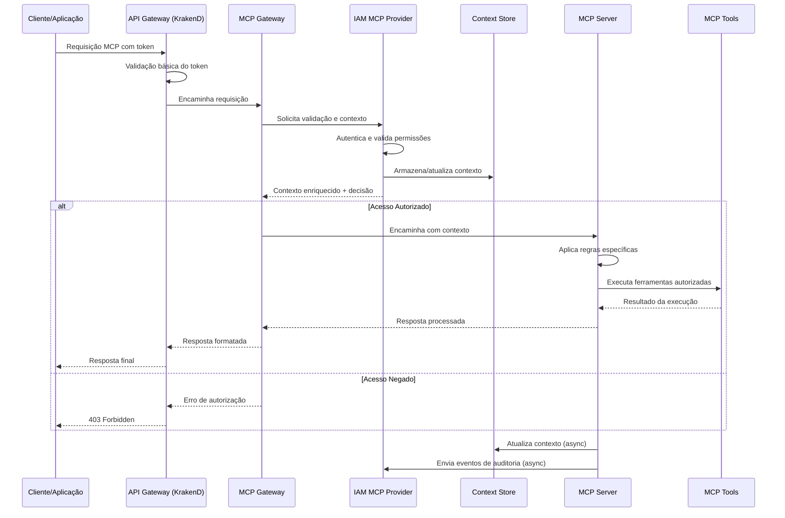

# Implementação da Integração MCP-IAM na Plataforma INNOVABIZ

## 1. Visão Geral

Este documento detalha a implementação técnica da arquitetura de integração entre o módulo IAM (Identity and Access Management) e o MCP (Model Context Protocol) na plataforma INNOVABIZ. Esta integração é fundamental para estabelecer um mecanismo unificado de identidade, autenticação e autorização para todos os servidores MCP e ferramentas associadas, garantindo a conformidade com requisitos de segurança, governança e compliance em um ambiente empresarial multi-tenant.

## 2. Arquitetura de Referência

### 2.1. Componentes Principais

A integração MCP-IAM é composta pelos seguintes componentes principais:

```
┌───────────────────────────────────────────────────────────────────────────────────┐
│                              Arquitetura MCP-IAM                                  │
│                                                                                   │
│  ┌───────────────┐    ┌────────────────┐     ┌───────────────┐   ┌─────────────┐  │
│  │               │    │                │     │               │   │             │  │
│  │  API Gateway  │◄───┤  MCP Gateway   │◄────┤   IAM MCP     │◄──┤  IAM Core   │  │
│  │   (KrakenD)   │    │                │     │   Provider    │   │  Services   │  │
│  │               │    │                │     │               │   │             │  │
│  └───────┬───────┘    └────────┬───────┘     └───────┬───────┘   └─────────────┘  │
│          │                     │                     │                            │
│          │                     ▼                     │                            │
│          │           ┌────────────────┐              │                            │
│          │           │                │              │                            │
│          └──────────►│ Context Store  │◄─────────────┘                            │
│                      │                │                                           │
│                      └────────┬───────┘                                           │
│                               │                                                   │
│                               ▼                                                   │
│  ┌───────────────┐    ┌────────────────┐     ┌───────────────┐                    │
│  │               │    │                │     │               │                    │
│  │  Security     │◄───┤ MCP Servers    │◄────┤  Tool         │                    │
│  │  Gateway      │    │ (Docker, etc)  │     │  Registry     │                    │
│  │               │    │                │     │               │                    │
│  └───────────────┘    └────────────────┘     └───────────────┘                    │
│                               │                                                   │
│                               ▼                                                   │
│                    ┌────────────────────┐                                         │
│                    │                    │                                         │
│                    │ MCP Tools/Services │                                         │
│                    │                    │                                         │
│                    └────────────────────┘                                         │
└───────────────────────────────────────────────────────────────────────────────────┘
```

| Componente | Descrição | Responsabilidade |
|------------|-----------|-----------------|
| API Gateway (KrakenD) | Gateway principal da plataforma | Roteamento, rate limiting, autenticação inicial |
| MCP Gateway | Gateway especializado para MCP | Processamento de requisições MCP, validação protocolar |
| IAM MCP Provider | Provedor de identidade para MCP | Autenticação, autorização, contexto de segurança |
| Context Store | Armazenamento de contexto | Manutenção e propagação de contexto entre serviços |
| Security Gateway | Gateway de segurança | Validação avançada, prevenção de ataques |
| MCP Servers | Servidores MCP implementados | Execução de serviços MCP específicos |
| Tool Registry | Registro de ferramentas | Catálogo de ferramentas disponíveis, metadados |
| IAM Core Services | Serviços core de IAM | Gestão de identidade, acesso e políticas |

### 2.2. Fluxo de Requisições

O fluxo típico de uma requisição MCP integrada com IAM:



## 3. Componentes Detalhados

### 3.1. IAM MCP Provider

O IAM MCP Provider é o componente central responsável por conectar o sistema IAM ao ecossistema MCP. Implementado como um serviço Go, fornece:

#### 3.1.1. Interfaces e Contratos

```go
// Contrato principal do IAM MCP Provider
type IAMMCPProvider interface {
    // Autenticação e autorização
    ValidateContext(ctx context.Context, mcpRequest *MCPRequest) (*MCPContext, error)
    EnrichContext(ctx context.Context, mcpContext *MCPContext) (*MCPContext, error)
    
    // Gestão de ferramentas
    AuthorizeToolAccess(ctx context.Context, userID, tenantID string, tool MCPTool) (bool, string, error)
    GetAuthorizedTools(ctx context.Context, userID, tenantID string) ([]MCPTool, error)
    
    // Auditoria e observabilidade
    AuditToolUsage(ctx context.Context, mcpContext *MCPContext, toolName string, result *ToolResult) error
    
    // Gestão de contexto
    StoreContext(ctx context.Context, mcpContext *MCPContext) error
    RetrieveContext(ctx context.Context, contextID string) (*MCPContext, error)
}

// Definição de requisição MCP
type MCPRequest struct {
    UserToken     string                 `json:"user_token"`
    ToolName      string                 `json:"tool_name"`
    Operation     string                 `json:"operation"`
    Parameters    map[string]interface{} `json:"parameters"`
    RequestID     string                 `json:"request_id"`
    SourceIP      string                 `json:"source_ip"`
    UserAgent     string                 `json:"user_agent"`
    ServerName    string                 `json:"server_name"`
    TenantID      string                 `json:"tenant_id,omitempty"`
    CorrelationID string                 `json:"correlation_id,omitempty"`
}

// Contexto MCP enriquecido com informações de identidade
type MCPContext struct {
    ContextID         string                 `json:"context_id"`
    UserID            string                 `json:"user_id"`
    Username          string                 `json:"username"`
    TenantID          string                 `json:"tenant_id"`
    TenantName        string                 `json:"tenant_name"`
    Roles             []string               `json:"roles"`
    Permissions       []string               `json:"permissions"`
    AuthZPolicies     []string               `json:"authz_policies"`
    ResourceQuotas    map[string]int         `json:"resource_quotas"`
    SecurityLevel     string                 `json:"security_level"`
    EnvironmentType   string                 `json:"environment_type"`
    TraceContext      TraceContext           `json:"trace_context"`
    RequestMetadata   map[string]interface{} `json:"request_metadata"`
    CreatedAt         time.Time              `json:"created_at"`
    ExpiresAt         time.Time              `json:"expires_at"`
    LastAccessed      time.Time              `json:"last_accessed"`
    AuthorizedTools   []string               `json:"authorized_tools"`
    ContextVersion    int                    `json:"context_version"`
    PreviousContextID string                 `json:"previous_context_id,omitempty"`
}

// Informação de tracing para observabilidade
type TraceContext struct {
    TraceID      string            `json:"trace_id"`
    SpanID       string            `json:"span_id"`
    ParentSpanID string            `json:"parent_span_id,omitempty"`
    Baggage      map[string]string `json:"baggage,omitempty"`
}

// Definição de ferramenta MCP
type MCPTool struct {
    Name           string                 `json:"name"`
    Version        string                 `json:"version"`
    Description    string                 `json:"description"`
    Category       string                 `json:"category"`
    ServerName     string                 `json:"server_name"`
    Operations     []string               `json:"operations"`
    ResourceImpact map[string]string      `json:"resource_impact"`
    Metadata       map[string]interface{} `json:"metadata"`
    SecurityLevel  string                 `json:"security_level"`
    RequiredPerms  []string               `json:"required_perms"`
}
```

#### 3.1.2. Implementação do Processamento

```go
// Implementação do provider
type IAMMCPProviderImpl struct {
    authService       auth.Service
    policyService     policy.Service
    userService       user.Service
    tenantService     tenant.Service
    contextStore      store.ContextStore
    toolRegistry      registry.ToolRegistry
    auditService      audit.Service
    observability     telemetry.Service
    config            *ProviderConfig
    policyEngine      *opa.PolicyEngine
    mfaValidator      *mfa.Validator
    securityAnalyzer  *security.RiskAnalyzer
}

// ValidateContext verifica a validade de uma requisição MCP
func (p *IAMMCPProviderImpl) ValidateContext(ctx context.Context, mcpRequest *MCPRequest) (*MCPContext, error) {
    // Iniciar telemetria
    ctx, span := p.observability.StartSpan(ctx, "IAMMCPProvider.ValidateContext")
    defer span.End()
    
    // Validar e decodificar token
    tokenClaims, err := p.authService.ValidateToken(ctx, mcpRequest.UserToken)
    if err != nil {
        p.observability.RecordError(span, err, "token_validation_failed")
        return nil, errors.Wrap(err, "invalid authentication token")
    }
    
    // Extrair informações de identidade
    userID := tokenClaims.Subject
    tenantID := tokenClaims.TenantID
    
    // Verificar se usuário existe e está ativo
    user, err := p.userService.GetUserByID(ctx, userID, tenantID)
    if err != nil {
        p.observability.RecordError(span, err, "user_retrieval_failed")
        return nil, errors.Wrap(err, "failed to retrieve user")
    }
    
    if user.Status != "ACTIVE" {
        err := errors.New("user account is not active")
        p.observability.RecordError(span, err, "user_inactive")
        return nil, err
    }
    
    // Verificar se o tenant está ativo
    tenant, err := p.tenantService.GetTenantByID(ctx, tenantID)
    if err != nil {
        p.observability.RecordError(span, err, "tenant_retrieval_failed")
        return nil, errors.Wrap(err, "failed to retrieve tenant")
    }
    
    if tenant.Status != "ACTIVE" {
        err := errors.New("tenant is not active")
        p.observability.RecordError(span, err, "tenant_inactive")
        return nil, err
    }
    
    // Criar contexto base
    mcpContext := &MCPContext{
        ContextID:       uuid.New().String(),
        UserID:          userID,
        Username:        user.Username,
        TenantID:        tenantID,
        TenantName:      tenant.Name,
        Roles:           tokenClaims.Roles,
        Permissions:     tokenClaims.Permissions,
        SecurityLevel:   p.determineSecurityLevel(user, mcpRequest),
        EnvironmentType: p.config.EnvironmentType,
        RequestMetadata: map[string]interface{}{
            "source_ip":   mcpRequest.SourceIP,
            "user_agent":  mcpRequest.UserAgent,
            "server_name": mcpRequest.ServerName,
        },
        TraceContext: TraceContext{
            TraceID: span.SpanContext().TraceID().String(),
            SpanID:  span.SpanContext().SpanID().String(),
        },
        CreatedAt:      time.Now(),
        ExpiresAt:      time.Now().Add(p.config.ContextTTL),
        ContextVersion: 1,
    }
    
    // Analisar risco e ajustar nível de segurança se necessário
    riskScore := p.securityAnalyzer.AnalyzeRisk(ctx, user, mcpRequest)
    if riskScore > p.config.HighRiskThreshold {
        // Aumentar segurança para requisições de alto risco
        mcpContext.SecurityLevel = "high"
        
        // Verificar se MFA adicional é necessário
        if !p.mfaValidator.HasRecentMFAVerification(ctx, userID, p.config.MFAVerificationWindow) {
            err := errors.New("additional MFA verification required due to risk score")
            p.observability.RecordError(span, err, "mfa_required")
            return nil, err
        }
    }
    
    // Verificar autorização para a ferramenta solicitada
    toolAuthorized, reason, err := p.AuthorizeToolAccess(ctx, userID, tenantID, MCPTool{
        Name:       mcpRequest.ToolName,
        ServerName: mcpRequest.ServerName,
        Operations: []string{mcpRequest.Operation},
    })
    
    if err != nil {
        p.observability.RecordError(span, err, "tool_authorization_error")
        return nil, errors.Wrap(err, "error during tool authorization")
    }
    
    if !toolAuthorized {
        err := errors.Wrap(errors.New("tool access denied"), reason)
        p.observability.RecordError(span, err, "tool_access_denied")
        return nil, err
    }
    
    // Adicionar ferramenta aos tools autorizados no contexto
    mcpContext.AuthorizedTools = []string{mcpRequest.ToolName}
    
    // Armazenar contexto
    if err := p.StoreContext(ctx, mcpContext); err != nil {
        p.observability.RecordError(span, err, "context_storage_failed")
        return nil, errors.Wrap(err, "failed to store MCP context")
    }
    
    p.observability.AddAttributes(span, map[string]string{
        "context.id":        mcpContext.ContextID,
        "user.id":           userID,
        "tenant.id":         tenantID,
        "security.level":    mcpContext.SecurityLevel,
        "tool.name":         mcpRequest.ToolName,
        "tool.operation":    mcpRequest.Operation,
    })
    
    // Registrar evento de auditoria
    p.auditService.LogAsync(ctx, audit.Event{
        Type:        audit.TypeMCPContextCreated,
        UserID:      userID,
        TenantID:    tenantID,
        Resource:    "mcp_context",
        ResourceID:  mcpContext.ContextID,
        Action:      "create",
        Timestamp:   time.Now(),
        IP:          mcpRequest.SourceIP,
        UserAgent:   mcpRequest.UserAgent,
        Details:     map[string]interface{}{
            "tool":         mcpRequest.ToolName,
            "operation":    mcpRequest.Operation,
            "security_level": mcpContext.SecurityLevel,
        },
        TraceID:     mcpContext.TraceContext.TraceID,
        RequestID:   mcpRequest.RequestID,
    })
    
    return mcpContext, nil
}
```

#### 3.1.3. Implementação de Autorização para Ferramentas MCP

```go
// AuthorizeToolAccess verifica se um usuário tem permissão para usar uma ferramenta MCP
func (p *IAMMCPProviderImpl) AuthorizeToolAccess(ctx context.Context, userID, tenantID string, tool MCPTool) (bool, string, error) {
    ctx, span := p.observability.StartSpan(ctx, "IAMMCPProvider.AuthorizeToolAccess")
    defer span.End()
    
    // Obter detalhes completos da ferramenta do registro
    fullTool, err := p.toolRegistry.GetTool(ctx, tool.Name, tool.ServerName)
    if err != nil {
        p.observability.RecordError(span, err, "tool_retrieval_failed")
        return false, "tool not found or unavailable", err
    }
    
    // Verificar se o tenant tem acesso ao servidor MCP
    serverAccess, err := p.tenantService.HasMCPServerAccess(ctx, tenantID, tool.ServerName)
    if err != nil {
        p.observability.RecordError(span, err, "server_access_check_failed")
        return false, "error checking server access", err
    }
    
    if !serverAccess {
        return false, "tenant does not have access to this MCP server", nil
    }
    
    // Verificar quotas e limites
    quotaCheck, err := p.tenantService.CheckResourceQuotas(ctx, tenantID, map[string]int{
        "mcp_requests": 1,
        tool.Name:      1,
    })
    
    if err != nil {
        p.observability.RecordError(span, err, "quota_check_failed")
        return false, "error checking resource quotas", err
    }
    
    if !quotaCheck.Allowed {
        return false, fmt.Sprintf("quota exceeded: %s", quotaCheck.Reason), nil
    }
    
    // Preparar input para o motor de políticas
    input := map[string]interface{}{
        "user": map[string]interface{}{
            "id":          userID,
            "tenant_id":   tenantID,
        },
        "tool": map[string]interface{}{
            "name":           tool.Name,
            "server_name":    tool.ServerName,
            "operations":     tool.Operations,
            "security_level": fullTool.SecurityLevel,
            "category":       fullTool.Category,
        },
        "request": map[string]interface{}{
            "timestamp": time.Now(),
        },
    }
    
    // Consultar o motor de políticas OPA
    allowed, reason, err := p.policyEngine.Evaluate(ctx, "mcp.tool_access", input)
    if err != nil {
        p.observability.RecordError(span, err, "policy_evaluation_failed")
        return false, "error evaluating access policy", err
    }
    
    // Registrar métricas de decisão de autorização
    p.observability.RecordAuthzDecision("mcp_tool", tool.Name, allowed)
    
    if !allowed {
        // Registrar detalhes da negação de acesso para análise
        p.auditService.LogAsync(ctx, audit.Event{
            Type:        audit.TypeMCPToolAccessDenied,
            UserID:      userID,
            TenantID:    tenantID,
            Resource:    "mcp_tool",
            ResourceID:  tool.Name,
            Action:      "access",
            Result:      "denied",
            Reason:      reason,
            Timestamp:   time.Now(),
            Details: map[string]interface{}{
                "server_name": tool.ServerName,
                "operations":  tool.Operations,
            },
        })
    }
    
    return allowed, reason, nil
}
```

### 3.2. Modelo de Contexto MCP-IAM

O modelo de contexto é uma estrutura central na integração MCP-IAM, fornecendo informações sobre a identidade, permissões, ambiente e outros metadados necessários para tomada de decisão de autorização e auditoria.

#### 3.2.1. Esquema JSON Completo

```json
{
  "$schema": "http://json-schema.org/draft-07/schema#",
  "title": "MCP-IAM Context",
  "type": "object",
  "required": ["context_id", "user_id", "tenant_id", "created_at", "expires_at"],
  "properties": {
    "context_id": {
      "type": "string",
      "format": "uuid",
      "description": "Identificador único do contexto"
    },
    "user_id": {
      "type": "string",
      "description": "Identificador do usuário"
    },
    "username": {
      "type": "string",
      "description": "Nome de usuário"
    },
    "tenant_id": {
      "type": "string",
      "description": "Identificador do tenant"
    },
    "tenant_name": {
      "type": "string",
      "description": "Nome do tenant"
    },
    "roles": {
      "type": "array",
      "items": {
        "type": "string"
      },
      "description": "Papéis atribuídos ao usuário"
    },
    "permissions": {
      "type": "array",
      "items": {
        "type": "string",
        "pattern": "^[a-z]+:[a-z]+(:[a-z]+)*$"
      },
      "description": "Permissões efetivas do usuário"
    },
    "authz_policies": {
      "type": "array",
      "items": {
        "type": "string"
      },
      "description": "Políticas de autorização aplicáveis"
    },
    "resource_quotas": {
      "type": "object",
      "additionalProperties": {
        "type": "integer",
        "minimum": 0
      },
      "description": "Limites de recursos disponíveis"
    },
    "security_level": {
      "type": "string",
      "enum": ["low", "medium", "high", "critical"],
      "description": "Nível de segurança do contexto"
    },
    "environment_type": {
      "type": "string",
      "enum": ["development", "test", "staging", "production", "sandbox"],
      "description": "Tipo de ambiente"
    },
    "trace_context": {
      "type": "object",
      "required": ["trace_id", "span_id"],
      "properties": {
        "trace_id": {
          "type": "string",
          "description": "Identificador de trace distribuído"
        },
        "span_id": {
          "type": "string",
          "description": "Identificador de span atual"
        },
        "parent_span_id": {
          "type": "string",
          "description": "Identificador do span pai"
        },
        "baggage": {
          "type": "object",
          "additionalProperties": {
            "type": "string"
          },
          "description": "Dados de contexto propagados com o trace"
        }
      }
    },
    "request_metadata": {
      "type": "object",
      "properties": {
        "source_ip": {
          "type": "string",
          "format": "ipv4"
        },
        "user_agent": {
          "type": "string"
        },
        "server_name": {
          "type": "string"
        }
      },
      "additionalProperties": true
    },
    "created_at": {
      "type": "string",
      "format": "date-time"
    },
    "expires_at": {
      "type": "string",
      "format": "date-time"
    },
    "last_accessed": {
      "type": "string",
      "format": "date-time"
    },
    "authorized_tools": {
      "type": "array",
      "items": {
        "type": "string"
      },
      "description": "Ferramentas autorizadas neste contexto"
    },
    "context_version": {
      "type": "integer",
      "minimum": 1,
      "description": "Versão do contexto, incrementada a cada atualização"
    },
    "previous_context_id": {
      "type": "string",
      "format": "uuid",
      "description": "ID do contexto anterior, se for uma atualização"
    }
  }
}
```### 3.3. Servidores MCP e Integração

Esta seção detalha como os diferentes servidores MCP suportados são integrados ao IAM INNOVABIZ, garantindo autenticação, autorização e governança consistentes.

#### 3.3.1. MCP_DOCKER

O servidor MCP_DOCKER fornece integração com contêineres Docker e orquestração de Kubernetes, sendo essencial para operações DevOps.

```go
// Implementação da integração IAM-MCP_DOCKER
type DockerMCPIntegration struct {
    baseIntegration     *baseMCPIntegration
    k8sPermissionMapper *KubernetesPermMapper
    dockerRegistry      *registry.DockerRegistry
    namespaceValidator  *NamespaceValidator
}

// Hook de pré-execução para validar operações Docker/K8s
func (d *DockerMCPIntegration) PreExecuteHook(ctx context.Context, mcpCtx *MCPContext, 
    toolName string, params map[string]interface{}) error {
    
    // Classificar a operação por sensibilidade
    opSensitivity, err := d.classifyOperationSensitivity(toolName, params)
    if err != nil {
        return errors.Wrap(err, "failed to classify operation sensitivity")
    }
    
    // Verificar autorização baseada em sensibilidade
    if opSensitivity > d.getSensitivityThreshold(mcpCtx) {
        return errors.New("operation exceeds user's allowed sensitivity level")
    }
    
    // Para operações Kubernetes, validar namespace
    if isK8sOperation(toolName) {
        namespace := extractNamespace(params)
        if namespace == "" {
            namespace = "default"
        }
        
        // Verificar se o usuário tem acesso ao namespace
        hasAccess, err := d.namespaceValidator.ValidateAccess(ctx, mcpCtx.UserID, mcpCtx.TenantID, namespace)
        if err != nil {
            return errors.Wrap(err, "namespace access validation failed")
        }
        
        if !hasAccess {
            return fmt.Errorf("access denied to namespace '%s'", namespace)
        }
        
        // Aplicar políticas RBAC do Kubernetes
        rbacAllowed, err := d.k8sPermissionMapper.CheckRBACPermission(
            ctx, mcpCtx.UserID, namespace, toolName, extractK8sVerb(toolName))
        if err != nil {
            return errors.Wrap(err, "RBAC check failed")
        }
        
        if !rbacAllowed {
            return errors.New("operation not allowed by Kubernetes RBAC")
        }
    }
    
    // Para operações Docker, verificar restrições de imagem
    if isDockerOperation(toolName) && containsImageReference(params) {
        imageName := extractImageName(params)
        
        // Verificar se a imagem é permitida
        allowed, reason, err := d.dockerRegistry.IsImageAllowed(ctx, mcpCtx.TenantID, imageName)
        if err != nil {
            return errors.Wrap(err, "image verification failed")
        }
        
        if !allowed {
            return fmt.Errorf("docker image not allowed: %s", reason)
        }
    }
    
    // Registrar auditoria pré-execução
    d.baseIntegration.auditService.LogAsync(ctx, audit.Event{
        Type:       audit.TypeMCPToolPreExecution,
        UserID:     mcpCtx.UserID,
        TenantID:   mcpCtx.TenantID,
        Resource:   "mcp_docker_tool",
        ResourceID: toolName,
        Action:     "pre_execute",
        Timestamp:  time.Now(),
        Details: map[string]interface{}{
            "operation_sensitivity": opSensitivity,
            "params_summary":        summarizeParams(params),
        },
    })
    
    return nil
}
```

#### 3.3.2. Desktop-Commander

O Desktop-Commander MCP integra-se com operações de sistema operacional local, proporcionando acesso controlado a recursos do sistema.

```go
// Implementação da integração IAM-Desktop-Commander
type DesktopCommanderIntegration struct {
    baseIntegration       *baseMCPIntegration
    fileSystemPermissions *FileSystemPermMapper
    processPermissions    *ProcessPermMapper
    pathValidator         *PathValidator
}

// Hook de pré-execução para validar operações do Desktop Commander
func (dc *DesktopCommanderIntegration) PreExecuteHook(ctx context.Context, mcpCtx *MCPContext, 
    toolName string, params map[string]interface{}) error {
    
    // Verificar permissões baseadas em papéis do usuário
    hasToolPermission, err := dc.baseIntegration.CheckToolPermission(ctx, mcpCtx, toolName)
    if err != nil {
        return errors.Wrap(err, "permission check failed")
    }
    
    if !hasToolPermission {
        return errors.New("user does not have permission to use this tool")
    }
    
    // Para operações de sistema de arquivos, validar caminhos
    if isFileSystemOperation(toolName) {
        path, exists := extractPath(params)
        if exists {
            // Verificar se o caminho é permitido
            isAllowed, reason, err := dc.pathValidator.ValidatePath(ctx, mcpCtx.TenantID, path)
            if err != nil {
                return errors.Wrap(err, "path validation failed")
            }
            
            if !isAllowed {
                return fmt.Errorf("path access denied: %s", reason)
            }
            
            // Verificar permissões específicas de arquivo
            fsPermission := mapToolToFileSystemOperation(toolName)
            hasPermission, err := dc.fileSystemPermissions.CheckPermission(
                ctx, mcpCtx.UserID, mcpCtx.TenantID, path, fsPermission)
            if err != nil {
                return errors.Wrap(err, "file permission check failed")
            }
            
            if !hasPermission {
                return errors.Errorf("insufficient permissions for %s on %s", fsPermission, path)
            }
        }
    }
    
    // Para operações de processo, verificar restrições
    if isProcessOperation(toolName) {
        command, exists := extractCommand(params)
        if exists {
            // Verificar comando contra lista de bloqueio
            isBlocked, reason, err := dc.processPermissions.IsCommandBlocked(ctx, mcpCtx.TenantID, command)
            if err != nil {
                return errors.Wrap(err, "command validation failed")
            }
            
            if isBlocked {
                return fmt.Errorf("command execution blocked: %s", reason)
            }
        }
    }
    
    // Registrar intenção de uso na auditoria
    dc.baseIntegration.auditService.LogAsync(ctx, audit.Event{
        Type:       audit.TypeMCPToolPreExecution,
        UserID:     mcpCtx.UserID,
        TenantID:   mcpCtx.TenantID,
        Resource:   "desktop_commander_tool",
        ResourceID: toolName,
        Action:     "pre_execute",
        Timestamp:  time.Now(),
        Details: map[string]interface{}{
            "params_summary": summarizeParams(params),
        },
    })
    
    return nil
}
```

#### 3.3.3. Figma MCP

Integração com Figma para design e colaboração visual, com controles de acesso específicos para recursos de design.

```go
// Implementação da integração IAM-Figma MCP
type FigmaMCPIntegration struct {
    baseIntegration    *baseMCPIntegration
    figmaTokenManager  *FigmaTokenManager
    projectPermissions *FigmaProjectPermMapper
}

// Hook de pré-execução para validar operações Figma
func (f *FigmaMCPIntegration) PreExecuteHook(ctx context.Context, mcpCtx *MCPContext, 
    toolName string, params map[string]interface{}) error {
    
    // Extrair file_key se presente
    fileKey, hasFileKey := extractFigmaFileKey(params)
    
    // Verificar autenticação Figma
    hasValidToken, err := f.figmaTokenManager.HasValidToken(ctx, mcpCtx.UserID, mcpCtx.TenantID)
    if err != nil {
        return errors.Wrap(err, "failed to verify Figma authentication")
    }
    
    if !hasValidToken {
        return errors.New("valid Figma authentication required")
    }
    
    // Para operações específicas de arquivo, verificar permissões
    if hasFileKey {
        // Verificar acesso ao projeto Figma
        hasAccess, err := f.projectPermissions.CheckAccess(ctx, mcpCtx.UserID, fileKey)
        if err != nil {
            return errors.Wrap(err, "Figma project access check failed")
        }
        
        if !hasAccess {
            return fmt.Errorf("access denied to Figma file: %s", fileKey)
        }
        
        // Para comentários, verificar permissões adicionais
        if isCommentOperation(toolName) {
            canComment, err := f.projectPermissions.CanComment(ctx, mcpCtx.UserID, fileKey)
            if err != nil {
                return errors.Wrap(err, "Figma comment permission check failed")
            }
            
            if !canComment {
                return errors.New("user does not have comment permission on this Figma file")
            }
        }
    }
    
    // Registrar uso na auditoria
    f.baseIntegration.auditService.LogAsync(ctx, audit.Event{
        Type:       audit.TypeMCPToolPreExecution,
        UserID:     mcpCtx.UserID,
        TenantID:   mcpCtx.TenantID,
        Resource:   "figma_tool",
        ResourceID: toolName,
        Action:     "pre_execute",
        Timestamp:  time.Now(),
        Details: map[string]interface{}{
            "file_key": fileKey,
        },
    })
    
    return nil
}
```

#### 3.3.4. GitHub MCP

Integração com GitHub para gestão de código e colaboração em desenvolvimento, controlando acesso a repositórios e operações.

```go
// Implementação da integração IAM-GitHub MCP
type GitHubMCPIntegration struct {
    baseIntegration      *baseMCPIntegration
    repoPermissions      *GitHubRepoPermMapper
    sensitiveOpsChecker  *GitHubSensitiveOpsChecker
    tokenManager         *GitHubTokenManager
}

// Hook de pré-execução para validar operações GitHub
func (g *GitHubMCPIntegration) PreExecuteHook(ctx context.Context, mcpCtx *MCPContext, 
    toolName string, params map[string]interface{}) error {
    
    // Extrair informações de repositório
    owner, repo, hasRepo := extractRepoInfo(params)
    
    // Verificar autenticação GitHub
    hasValidToken, err := g.tokenManager.HasValidToken(ctx, mcpCtx.UserID)
    if err != nil {
        return errors.Wrap(err, "failed to verify GitHub authentication")
    }
    
    if !hasValidToken {
        return errors.New("valid GitHub authentication required")
    }
    
    // Para operações específicas de repositório, verificar permissões
    if hasRepo {
        // Verificar acesso ao repositório
        permission, err := g.repoPermissions.CheckRepoAccess(ctx, mcpCtx.UserID, owner, repo)
        if err != nil {
            return errors.Wrap(err, "GitHub repository access check failed")
        }
        
        // Verificar se a permissão é suficiente para a operação
        requiredPermission := mapToolToRequiredPermission(toolName)
        if !isPermissionSufficient(permission, requiredPermission) {
            return fmt.Errorf("insufficient GitHub permissions: need %s, has %s", 
                requiredPermission, permission)
        }
        
        // Verificar se é uma operação sensível
        if g.sensitiveOpsChecker.IsOperationSensitive(toolName, params) {
            // Para operações sensíveis, verificar permissão adicional
            hasSensitivePermission, err := g.baseIntegration.CheckSpecificPermission(
                ctx, mcpCtx, "github:sensitive_operations")
            if err != nil {
                return errors.Wrap(err, "sensitive operation permission check failed")
            }
            
            if !hasSensitivePermission {
                return errors.New("operation requires elevated GitHub permissions")
            }
            
            // Registrar operação sensível com mais detalhes
            g.baseIntegration.auditService.LogAsync(ctx, audit.Event{
                Type:       audit.TypeMCPSensitiveOperation,
                UserID:     mcpCtx.UserID,
                TenantID:   mcpCtx.TenantID,
                Resource:   "github_repo",
                ResourceID: fmt.Sprintf("%s/%s", owner, repo),
                Action:     toolName,
                Timestamp:  time.Now(),
                Details: map[string]interface{}{
                    "params_summary": summarizeParams(params),
                    "sensitivity":    "high",
                },
            })
        }
    }
    
    // Registrar uso na auditoria
    g.baseIntegration.auditService.LogAsync(ctx, audit.Event{
        Type:       audit.TypeMCPToolPreExecution,
        UserID:     mcpCtx.UserID,
        TenantID:   mcpCtx.TenantID,
        Resource:   "github_tool",
        ResourceID: toolName,
        Action:     "pre_execute",
        Timestamp:  time.Now(),
        Details: map[string]interface{}{
            "repo": fmt.Sprintf("%s/%s", owner, repo),
        },
    })
    
    return nil
}
```

#### 3.3.5. Memory MCP

Integração com o servidor Memory MCP para armazenamento e recuperação de informações persistentes com controles de acesso granulares.

```go
// Implementação da integração IAM-Memory MCP
type MemoryMCPIntegration struct {
    baseIntegration    *baseMCPIntegration
    memoryPermissions  *MemoryPermMapper
    dataClassifier     *DataClassifier
    tenantIsolation    *TenantIsolator
}

// Hook de pré-execução para validar operações de memória
func (m *MemoryMCPIntegration) PreExecuteHook(ctx context.Context, mcpCtx *MCPContext, 
    toolName string, params map[string]interface{}) error {
    
    // Verificar permissões baseadas em papéis
    hasToolPermission, err := m.baseIntegration.CheckToolPermission(ctx, mcpCtx, toolName)
    if err != nil {
        return errors.Wrap(err, "permission check failed")
    }
    
    if !hasToolPermission {
        return errors.New("user does not have permission to use this memory tool")
    }
    
    // Classificar sensibilidade dos dados
    dataSensitivity, err := m.dataClassifier.ClassifyOperation(toolName, params)
    if err != nil {
        return errors.Wrap(err, "failed to classify data sensitivity")
    }
    
    // Verificar se o usuário tem permissão para o nível de sensibilidade
    hasDataPermission, err := m.memoryPermissions.CheckDataSensitivityPermission(
        ctx, mcpCtx.UserID, mcpCtx.TenantID, dataSensitivity)
    if err != nil {
        return errors.Wrap(err, "data sensitivity permission check failed")
    }
    
    if !hasDataPermission {
        return fmt.Errorf("insufficient permissions for data sensitivity level: %s", dataSensitivity)
    }
    
    // Para leitura/escrita em entidades, garantir isolamento de tenant
    if isEntityOperation(toolName) {
        entityNames := extractEntityNames(params)
        
        // Verificar acesso para cada entidade
        for _, entityName := range entityNames {
            tenantAllowed, err := m.tenantIsolation.ValidateEntityAccess(
                ctx, mcpCtx.TenantID, entityName)
            if err != nil {
                return errors.Wrap(err, "entity access validation failed")
            }
            
            if !tenantAllowed {
                return fmt.Errorf("access denied to entity: %s", entityName)
            }
        }
    }
    
    // Para operações de gravação, verificar quotas
    if isWriteOperation(toolName) {
        // Verificar quota de armazenamento
        quotaCheck, err := m.baseIntegration.tenantService.CheckResourceQuotas(
            ctx, mcpCtx.TenantID, map[string]int{
                "memory_storage": estimateStorageSize(params),
            })
        if err != nil {
            return errors.Wrap(err, "quota check failed")
        }
        
        if !quotaCheck.Allowed {
            return fmt.Errorf("memory quota exceeded: %s", quotaCheck.Reason)
        }
    }
    
    // Registrar auditoria
    m.baseIntegration.auditService.LogAsync(ctx, audit.Event{
        Type:       audit.TypeMCPToolPreExecution,
        UserID:     mcpCtx.UserID,
        TenantID:   mcpCtx.TenantID,
        Resource:   "memory_tool",
        ResourceID: toolName,
        Action:     "pre_execute",
        Timestamp:  time.Now(),
        Details: map[string]interface{}{
            "data_sensitivity": dataSensitivity,
            "operation_type":   classifyOperationType(toolName),
        },
    })
    
    return nil
}
```## 4. Segurança e Controles

Esta seção detalha os controles de segurança implementados na integração MCP-IAM para proteger o acesso e uso das ferramentas MCP na plataforma INNOVABIZ.

### 4.1. Modelo de Autorização para Ferramentas MCP

O modelo de autorização para ferramentas MCP é implementado como um conjunto de políticas granulares em formato JSON/Rego que são avaliadas pelo motor OPA (Open Policy Agent) integrado ao IAM.

#### 4.1.1. Estrutura das Políticas

```json
{
  "version": "1.0",
  "description": "Política de autorização para ferramentas MCP",
  "metadata": {
    "author": "INNOVABIZ Security",
    "created_at": "2025-08-06T12:00:00Z",
    "environment": "production"
  },
  "policies": [
    {
      "id": "mcp_tool_basic_access",
      "description": "Acesso básico a ferramentas MCP",
      "effect": "allow",
      "subjects": ["user:*"],
      "resources": ["mcp:tool:*"],
      "actions": ["execute"],
      "conditions": {
        "tenant_active": true,
        "user_active": true,
        "security_level_sufficient": true
      }
    },
    {
      "id": "mcp_docker_k8s_access",
      "description": "Acesso a ferramentas Docker/K8s",
      "effect": "allow",
      "subjects": ["role:devops", "role:admin"],
      "resources": ["mcp:tool:docker:*", "mcp:tool:kubernetes:*"],
      "actions": ["execute"],
      "conditions": {
        "tenant_has_feature": "devops",
        "security_level_min": "medium",
        "mfa_verified": true
      }
    },
    {
      "id": "mcp_github_sensitive",
      "description": "Operações sensíveis GitHub",
      "effect": "allow",
      "subjects": ["role:lead_developer", "role:admin"],
      "resources": ["mcp:tool:github:push*", "mcp:tool:github:delete*", "mcp:tool:github:merge*"],
      "actions": ["execute"],
      "conditions": {
        "security_level_min": "high",
        "mfa_verified": true,
        "approval_workflow": true
      }
    },
    {
      "id": "mcp_memory_sensitive",
      "description": "Acesso a memórias com dados sensíveis",
      "effect": "allow",
      "subjects": ["role:data_scientist", "role:admin"],
      "resources": ["mcp:tool:memory:*"],
      "actions": ["execute"],
      "conditions": {
        "data_classification_max": "restricted",
        "purpose_declared": true
      }
    }
  ]
}
```

#### 4.1.2. Implementação Rego (Open Policy Agent)

```rego
package innovabiz.mcp.authz

# Importar bases de dados e configurações
import data.innovabiz.roles
import data.innovabiz.mcp_tools
import data.innovabiz.tenant_features
import data.innovabiz.security_levels

default allow = false

# Regra principal de autorização para ferramentas MCP
allow {
    # Verificações básicas
    input.user.active
    input.user.tenant_active
    
    # Verificar nível de segurança
    security_level_sufficient
    
    # Verificar ferramenta específica
    tool_check
}

# Verificação de nível de segurança
security_level_sufficient {
    # Mapear nível de segurança
    security_levels = {
        "low": 1,
        "medium": 2,
        "high": 3,
        "critical": 4
    }
    
    # Obter nível necessário para a ferramenta
    required_level = mcp_tools[input.tool.name].security_level
    
    # Obter nível do usuário
    user_level = input.user.security_level
    
    # Comparar níveis
    security_levels[user_level] >= security_levels[required_level]
}

# Verificação específica de ferramenta
tool_check {
    # Verificar existência da ferramenta
    tool := mcp_tools[input.tool.name]
    
    # Verificar recurso específico da ferramenta
    tool.type == "general"
    
    # Verificar papéis necessários
    user_has_role(tool.required_roles)
}

# Verificação para ferramentas Docker/K8s
tool_check {
    # Identificar ferramentas Docker/K8s
    startswith(input.tool.name, "docker_") or startswith(input.tool.name, "kubectl_")
    
    # Verificar que o tenant tem o recurso devops ativado
    tenant_has_feature("devops")
    
    # Verificar papéis específicos
    user_has_any_role(["devops", "admin", "platform_engineer"])
    
    # Verificar MFA para operações sensíveis
    not is_sensitive_operation(input.tool.name) or input.user.mfa_verified
}

# Verificação para ferramentas GitHub
tool_check {
    # Identificar ferramentas GitHub
    startswith(input.tool.name, "github_")
    
    # Verificações básicas para GitHub
    user_has_any_role(["developer", "admin", "lead_developer"])
    
    # Regras para operações sensíveis
    not is_github_sensitive_operation(input.tool.name, input.tool.operations) or (
        user_has_any_role(["lead_developer", "admin"]) and
        input.user.mfa_verified and
        (not requires_approval(input.tool.name) or input.approval_granted)
    )
}

# Verificação para ferramentas Memory
tool_check {
    # Identificar ferramentas Memory
    startswith(input.tool.name, "memory_")
    
    # Verificar classificação de dados
    data_classification = classify_data_sensitivity(input.tool.name, input.tool.operations)
    user_data_clearance_sufficient(data_classification)
    
    # Verificar propósito declarado para dados sensíveis
    not is_sensitive_data(data_classification) or input.purpose_declared
}

# Funções auxiliares
user_has_role(required_roles) {
    # Verificar se o usuário tem todos os papéis necessários
    role = required_roles[_]
    contains(input.user.roles, role)
}

user_has_any_role(allowed_roles) {
    # Verificar se o usuário tem pelo menos um dos papéis permitidos
    role = allowed_roles[_]
    contains(input.user.roles, role)
}

tenant_has_feature(feature) {
    # Verificar se o tenant tem a funcionalidade habilitada
    tenant_features[input.user.tenant_id][feature] == true
}

is_sensitive_operation(tool_name) {
    # Lista de operações sensíveis
    sensitive_ops = {
        "docker_run",
        "docker_exec",
        "kubectl_exec",
        "kubectl_delete",
        "kubectl_apply"
    }
    
    contains(sensitive_ops, tool_name)
}

is_github_sensitive_operation(tool_name, operations) {
    # Identificar operações GitHub sensíveis
    sensitive_patterns = ["push", "delete", "merge", "create", "update"]
    operation := operations[_]
    
    pattern := sensitive_patterns[_]
    contains(tool_name, pattern) or contains(operation, pattern)
}

user_data_clearance_sufficient(classification) {
    # Mapear níveis de classificação
    clearance_levels = {
        "public": 1,
        "internal": 2,
        "confidential": 3,
        "restricted": 4
    }
    
    # Verificar nível do usuário vs. classificação dos dados
    clearance_levels[input.user.data_clearance] >= clearance_levels[classification]
}

is_sensitive_data(classification) {
    # Definir quais classificações são consideradas sensíveis
    sensitive_classifications = ["confidential", "restricted"]
    contains(sensitive_classifications, classification)
}

requires_approval(tool_name) {
    # Ferramentas que requerem aprovação adicional
    approval_required_tools = {
        "github_merge_pull_request": true,
        "github_delete_repository": true,
        "github_push_files": true
    }
    
    approval_required_tools[tool_name] == true
}
```

### 4.2. Auditorias e Rastreamento

O sistema de auditoria é implementado para rastrear todas as atividades relacionadas ao MCP, com ênfase especial em operações sensíveis e relacionadas à segurança.

#### 4.2.1. Esquema de Eventos de Auditoria

```json
{
  "$schema": "http://json-schema.org/draft-07/schema#",
  "title": "MCP Audit Event",
  "type": "object",
  "required": ["event_id", "event_type", "user_id", "tenant_id", "timestamp"],
  "properties": {
    "event_id": {
      "type": "string",
      "format": "uuid"
    },
    "event_type": {
      "type": "string",
      "enum": [
        "mcp.auth.success",
        "mcp.auth.failure",
        "mcp.tool.access.granted",
        "mcp.tool.access.denied",
        "mcp.tool.execution.started",
        "mcp.tool.execution.completed",
        "mcp.tool.execution.failed",
        "mcp.context.created",
        "mcp.context.updated",
        "mcp.context.expired",
        "mcp.security.violation",
        "mcp.quota.exceeded"
      ]
    },
    "user_id": {
      "type": "string"
    },
    "username": {
      "type": "string"
    },
    "tenant_id": {
      "type": "string"
    },
    "tenant_name": {
      "type": "string"
    },
    "timestamp": {
      "type": "string",
      "format": "date-time"
    },
    "server_name": {
      "type": "string"
    },
    "tool_name": {
      "type": "string"
    },
    "operation": {
      "type": "string"
    },
    "result": {
      "type": "string",
      "enum": ["success", "failure", "denied", "error"]
    },
    "result_code": {
      "type": "string"
    },
    "context_id": {
      "type": "string",
      "format": "uuid"
    },
    "ip_address": {
      "type": "string"
    },
    "user_agent": {
      "type": "string"
    },
    "request_id": {
      "type": "string"
    },
    "trace_id": {
      "type": "string"
    },
    "duration_ms": {
      "type": "integer"
    },
    "security_level": {
      "type": "string"
    },
    "parameters": {
      "type": "object"
    },
    "error_details": {
      "type": "string"
    },
    "resource_impact": {
      "type": "object",
      "properties": {
        "cpu": {
          "type": "number"
        },
        "memory": {
          "type": "number"
        },
        "storage": {
          "type": "number"
        },
        "network": {
          "type": "number"
        }
      }
    }
  }
}
```

#### 4.2.2. Implementação do Registro de Auditoria

```go
// Serviço de auditoria MCP
type MCPAuditService struct {
    eventRepository audit.Repository
    observability   telemetry.Service
    userResolver    user.Resolver
    tenantResolver  tenant.Resolver
    enrichers       []AuditEnricher
    config          *AuditConfig
}

// AuditConfig define configurações para auditoria
type AuditConfig struct {
    DetailLevel            string            // minimal, standard, verbose
    ParameterMasking       map[string]string // parâmetros a mascarar
    EventRetention         time.Duration     // retenção de eventos
    EnableLocalBuffering   bool              // buffer local durante falhas
    ResourceUsageTracking  bool              // rastrear uso de recursos
    AIAnalysisEnabled      bool              // análise de IA em eventos
    SecurityAlertingEnabled bool             // alertas em tempo real
}

// LogMCPEvent registra um evento de auditoria
func (s *MCPAuditService) LogMCPEvent(ctx context.Context, event *MCPAuditEvent) error {
    // Gerar ID de evento se não fornecido
    if event.EventID == "" {
        event.EventID = uuid.New().String()
    }
    
    // Garantir timestamp
    if event.Timestamp.IsZero() {
        event.Timestamp = time.Now()
    }
    
    // Extrair TraceID do contexto para correlação
    if span := trace.SpanFromContext(ctx); span.SpanContext().IsValid() {
        event.TraceID = span.SpanContext().TraceID().String()
    }
    
    // Extrair RequestID do contexto
    if reqID := requestid.FromContext(ctx); reqID != "" {
        event.RequestID = reqID
    }
    
    // Enriquecer evento com dados adicionais
    s.enrichEvent(ctx, event)
    
    // Mascarar dados sensíveis nos parâmetros
    if event.Parameters != nil {
        event.Parameters = s.maskSensitiveParams(event.Parameters)
    }
    
    // Aplicar nível de detalhe baseado na configuração
    event = s.applyDetailLevel(event)
    
    // Criar span para operação de auditoria
    ctx, span := s.observability.StartSpan(ctx, "MCPAuditService.LogEvent")
    defer span.End()
    
    // Adicionar atributos ao span
    span.SetAttributes(
        attribute.String("event.id", event.EventID),
        attribute.String("event.type", string(event.EventType)),
        attribute.String("user.id", event.UserID),
        attribute.String("tenant.id", event.TenantID),
        attribute.String("server.name", event.ServerName),
        attribute.String("tool.name", event.ToolName),
    )
    
    // Persistir o evento
    err := s.eventRepository.StoreEvent(ctx, event)
    if err != nil {
        // Registrar erro mas não falhar
        s.observability.RecordError(span, err, "audit_store_failed")
        
        // Se buffering local ativado, armazenar em memória
        if s.config.EnableLocalBuffering {
            s.bufferEventLocally(event)
        }
        
        return err
    }
    
    // Analisar evento para possíveis alertas de segurança
    if s.config.SecurityAlertingEnabled && isSecurityRelevant(event) {
        go s.analyzeForSecurityAlerts(context.Background(), event)
    }
    
    return nil
}

// Enriquecer evento com dados contextuais
func (s *MCPAuditService) enrichEvent(ctx context.Context, event *MCPAuditEvent) {
    // Adicionar dados de usuário se não fornecidos
    if event.Username == "" && event.UserID != "" {
        if user, err := s.userResolver.GetUserByID(ctx, event.UserID, event.TenantID); err == nil {
            event.Username = user.Username
        }
    }
    
    // Adicionar dados de tenant se não fornecidos
    if event.TenantName == "" && event.TenantID != "" {
        if tenant, err := s.tenantResolver.GetTenantByID(ctx, event.TenantID); err == nil {
            event.TenantName = tenant.Name
        }
    }
    
    // Aplicar enriquecedores personalizados
    for _, enricher := range s.enrichers {
        enricher.Enrich(ctx, event)
    }
}

// Mascarar dados sensíveis nos parâmetros
func (s *MCPAuditService) maskSensitiveParams(params map[string]interface{}) map[string]interface{} {
    result := make(map[string]interface{})
    
    for k, v := range params {
        // Verificar se este parâmetro deve ser mascarado
        if maskPattern, found := s.config.ParameterMasking[k]; found {
            // Aplicar mascaramento
            switch maskPattern {
            case "full":
                result[k] = "********"
            case "partial":
                if str, ok := v.(string); ok && len(str) > 4 {
                    result[k] = str[:2] + "******" + str[len(str)-2:]
                } else {
                    result[k] = "******"
                }
            case "omit":
                // Simplesmente pular este parâmetro
                continue
            }
        } else if isNestedMap(v) {
            // Recursivamente mascarar objetos aninhados
            if mapValue, ok := v.(map[string]interface{}); ok {
                result[k] = s.maskSensitiveParams(mapValue)
            } else {
                result[k] = v
            }
        } else {
            // Incluir parâmetro normalmente
            result[k] = v
        }
    }
    
    return result
}
```## 5. Observabilidade e Monitoramento

A integração MCP-IAM implementa observabilidade abrangente para garantir a visibilidade operacional, detecção proativa de problemas e análise de desempenho.

### 5.1. Instrumentação e Telemetria

A instrumentação é implementada usando OpenTelemetry como padrão, permitindo coleta unificada de métricas, traces e logs.

#### 5.1.1. Métricas Principais

```go
// Registrar métricas MCP
func registerMCPMetrics(registry *prometheus.Registry) {
    // Contador de requisições por ferramenta
    mcpRequestsTotal := prometheus.NewCounterVec(
        prometheus.CounterOpts{
            Name: "innovabiz_mcp_requests_total",
            Help: "Número total de requisições MCP, por ferramenta, servidor e resultado",
        },
        []string{"tool", "server", "result"},
    )
    
    // Histograma de latência
    mcpRequestDuration := prometheus.NewHistogramVec(
        prometheus.HistogramOpts{
            Name:    "innovabiz_mcp_request_duration_seconds",
            Help:    "Duração das requisições MCP em segundos",
            Buckets: prometheus.ExponentialBuckets(0.001, 2, 16), // 1ms a ~65s
        },
        []string{"tool", "server"},
    )
    
    // Contador de erros de autenticação/autorização
    mcpAuthFailures := prometheus.NewCounterVec(
        prometheus.CounterOpts{
            Name: "innovabiz_mcp_auth_failures_total",
            Help: "Número total de falhas de autenticação/autorização MCP",
        },
        []string{"failure_type", "server"},
    )
    
    // Gauge para contextos ativos
    mcpActiveContexts := prometheus.NewGaugeVec(
        prometheus.GaugeOpts{
            Name: "innovabiz_mcp_active_contexts",
            Help: "Número atual de contextos MCP ativos",
        },
        []string{"tenant", "server"},
    )
    
    // Contador de operações MCP por tipo
    mcpOperationsTotal := prometheus.NewCounterVec(
        prometheus.CounterOpts{
            Name: "innovabiz_mcp_operations_total",
            Help: "Número total de operações MCP por tipo",
        },
        []string{"operation_type", "tool", "tenant"},
    )
    
    // Histograma de uso de recursos
    mcpResourceUsage := prometheus.NewHistogramVec(
        prometheus.HistogramOpts{
            Name:    "innovabiz_mcp_resource_usage",
            Help:    "Utilização de recursos por operação MCP",
            Buckets: prometheus.ExponentialBuckets(0.01, 2, 15),
        },
        []string{"resource_type", "tool", "operation"},
    )
    
    // Registrar todas as métricas
    registry.MustRegister(
        mcpRequestsTotal,
        mcpRequestDuration,
        mcpAuthFailures,
        mcpActiveContexts,
        mcpOperationsTotal,
        mcpResourceUsage,
    )
}
```

#### 5.1.2. Implementação de Tracing

```go
// Configuração do trace provider
func setupMCPTracing(ctx context.Context, cfg *config.ObservabilityConfig) (*sdktrace.TracerProvider, error) {
    // Criar exportador para Jaeger
    jaegerExporter, err := jaeger.New(jaeger.WithCollectorEndpoint(
        jaeger.WithEndpoint(cfg.JaegerEndpoint),
    ))
    if err != nil {
        return nil, fmt.Errorf("failed to create jaeger exporter: %w", err)
    }
    
    // Configurar o trace provider com sampling adaptativo
    tp := sdktrace.NewTracerProvider(
        sdktrace.WithSampler(sdktrace.ParentBased(sdktrace.TraceIDRatioBased(cfg.SamplingRatio))),
        sdktrace.WithBatcher(jaegerExporter),
        sdktrace.WithResource(resource.NewWithAttributes(
            semconv.SchemaURL,
            semconv.ServiceNameKey.String("innovabiz-mcp-iam"),
            semconv.ServiceVersionKey.String(version.Version),
            semconv.DeploymentEnvironmentKey.String(cfg.Environment),
            attribute.String("tenant.id", cfg.TenantID),
        )),
    )
    
    // Definir o tracer global
    otel.SetTracerProvider(tp)
    
    // Configurar propagação de contexto
    otel.SetTextMapPropagator(propagation.NewCompositeTextMapPropagator(
        propagation.TraceContext{},
        propagation.Baggage{},
    ))
    
    return tp, nil
}

// Método para instrumentar handlers MCP com tracing
func instrumentMCPHandlerWithTracing(handler MCPHandler) MCPHandler {
    return func(ctx context.Context, req *MCPRequest) (*MCPResponse, error) {
        // Iniciar um span para a operação
        tracer := otel.Tracer("innovabiz.mcp.handler")
        ctx, span := tracer.Start(ctx, "MCPHandler_"+req.ToolName,
            trace.WithAttributes(
                attribute.String("mcp.tool", req.ToolName),
                attribute.String("mcp.operation", req.Operation),
                attribute.String("mcp.server", req.ServerName),
                attribute.String("tenant.id", req.TenantID),
            ),
        )
        defer span.End()
        
        // Anexar SpanContext ao contexto da requisição
        if req.TraceContext == nil {
            req.TraceContext = &TraceContext{}
        }
        req.TraceContext.TraceID = span.SpanContext().TraceID().String()
        req.TraceContext.SpanID = span.SpanContext().SpanID().String()
        
        // Executar handler original
        resp, err := handler(ctx, req)
        
        // Registrar resultado no span
        if err != nil {
            span.SetStatus(codes.Error, err.Error())
            span.RecordError(err)
        } else {
            span.SetStatus(codes.Ok, "")
            span.SetAttributes(attribute.String("mcp.response.status", resp.Status))
        }
        
        return resp, err
    }
}
```

### 5.2. Dashboards e Alertas

A integração MCP-IAM inclui dashboards Grafana predefinidos e regras de alerta para monitoramento operacional e de segurança.

#### 5.2.1. Exemplo de Dashboard Grafana (JSON)

```json
{
  "annotations": {
    "list": [
      {
        "builtIn": 1,
        "datasource": "-- Grafana --",
        "enable": true,
        "hide": true,
        "iconColor": "rgba(0, 211, 255, 1)",
        "name": "Annotations & Alerts",
        "type": "dashboard"
      }
    ]
  },
  "editable": true,
  "gnetId": null,
  "graphTooltip": 0,
  "id": 1234,
  "links": [],
  "panels": [
    {
      "aliasColors": {},
      "bars": false,
      "dashLength": 10,
      "dashes": false,
      "datasource": "Prometheus",
      "fieldConfig": {
        "defaults": {
          "custom": {}
        },
        "overrides": []
      },
      "fill": 1,
      "fillGradient": 0,
      "gridPos": {
        "h": 8,
        "w": 12,
        "x": 0,
        "y": 0
      },
      "hiddenSeries": false,
      "id": 2,
      "legend": {
        "avg": false,
        "current": false,
        "max": false,
        "min": false,
        "show": true,
        "total": false,
        "values": false
      },
      "lines": true,
      "linewidth": 1,
      "nullPointMode": "null",
      "options": {
        "alertThreshold": true
      },
      "percentage": false,
      "pluginVersion": "7.3.1",
      "pointradius": 2,
      "points": false,
      "renderer": "flot",
      "seriesOverrides": [],
      "spaceLength": 10,
      "stack": false,
      "steppedLine": false,
      "targets": [
        {
          "expr": "sum(rate(innovabiz_mcp_requests_total[5m])) by (tool, server)",
          "interval": "",
          "legendFormat": "{{tool}} - {{server}}",
          "refId": "A"
        }
      ],
      "thresholds": [],
      "timeFrom": null,
      "timeRegions": [],
      "timeShift": null,
      "title": "Requisições MCP por Ferramenta e Servidor",
      "tooltip": {
        "shared": true,
        "sort": 0,
        "value_type": "individual"
      },
      "type": "graph",
      "xaxis": {
        "buckets": null,
        "mode": "time",
        "name": null,
        "show": true,
        "values": []
      },
      "yaxes": [
        {
          "format": "short",
          "label": null,
          "logBase": 1,
          "max": null,
          "min": null,
          "show": true
        },
        {
          "format": "short",
          "label": null,
          "logBase": 1,
          "max": null,
          "min": null,
          "show": true
        }
      ],
      "yaxis": {
        "align": false,
        "alignLevel": null
      }
    },
    {
      "alert": {
        "alertRuleTags": {},
        "conditions": [
          {
            "evaluator": {
              "params": [
                5
              ],
              "type": "gt"
            },
            "operator": {
              "type": "and"
            },
            "query": {
              "params": [
                "A",
                "5m",
                "now"
              ]
            },
            "reducer": {
              "params": [],
              "type": "avg"
            },
            "type": "query"
          }
        ],
        "executionErrorState": "alerting",
        "for": "5m",
        "frequency": "1m",
        "handler": 1,
        "name": "Alerta de Falhas de Autenticação MCP",
        "noDataState": "no_data",
        "notifications": []
      },
      "aliasColors": {},
      "bars": false,
      "dashLength": 10,
      "dashes": false,
      "datasource": "Prometheus",
      "fieldConfig": {
        "defaults": {
          "custom": {}
        },
        "overrides": []
      },
      "fill": 1,
      "fillGradient": 0,
      "gridPos": {
        "h": 8,
        "w": 12,
        "x": 12,
        "y": 0
      },
      "hiddenSeries": false,
      "id": 4,
      "legend": {
        "avg": false,
        "current": false,
        "max": false,
        "min": false,
        "show": true,
        "total": false,
        "values": false
      },
      "lines": true,
      "linewidth": 1,
      "nullPointMode": "null",
      "options": {
        "alertThreshold": true
      },
      "percentage": false,
      "pluginVersion": "7.3.1",
      "pointradius": 2,
      "points": false,
      "renderer": "flot",
      "seriesOverrides": [],
      "spaceLength": 10,
      "stack": false,
      "steppedLine": false,
      "targets": [
        {
          "expr": "sum(rate(innovabiz_mcp_auth_failures_total[5m])) by (failure_type)",
          "interval": "",
          "legendFormat": "{{failure_type}}",
          "refId": "A"
        }
      ],
      "thresholds": [
        {
          "colorMode": "critical",
          "fill": true,
          "line": true,
          "op": "gt",
          "value": 5,
          "visible": true
        }
      ],
      "timeFrom": null,
      "timeRegions": [],
      "timeShift": null,
      "title": "Falhas de Autenticação MCP por Tipo",
      "tooltip": {
        "shared": true,
        "sort": 0,
        "value_type": "individual"
      },
      "type": "graph",
      "xaxis": {
        "buckets": null,
        "mode": "time",
        "name": null,
        "show": true,
        "values": []
      },
      "yaxes": [
        {
          "format": "short",
          "label": null,
          "logBase": 1,
          "max": null,
          "min": null,
          "show": true
        },
        {
          "format": "short",
          "label": null,
          "logBase": 1,
          "max": null,
          "min": null,
          "show": true
        }
      ],
      "yaxis": {
        "align": false,
        "alignLevel": null
      }
    }
  ],
  "refresh": "10s",
  "schemaVersion": 26,
  "style": "dark",
  "tags": ["mcp", "iam", "security"],
  "templating": {
    "list": [
      {
        "allValue": null,
        "current": {
          "selected": false,
          "text": "All",
          "value": "$__all"
        },
        "datasource": "Prometheus",
        "definition": "label_values(innovabiz_mcp_requests_total, tool)",
        "hide": 0,
        "includeAll": true,
        "label": "Ferramenta",
        "multi": true,
        "name": "tool",
        "options": [],
        "query": "label_values(innovabiz_mcp_requests_total, tool)",
        "refresh": 1,
        "regex": "",
        "skipUrlSync": false,
        "sort": 0,
        "tagValuesQuery": "",
        "tags": [],
        "tagsQuery": "",
        "type": "query",
        "useTags": false
      }
    ]
  },
  "time": {
    "from": "now-6h",
    "to": "now"
  },
  "timepicker": {
    "refresh_intervals": [
      "5s",
      "10s",
      "30s",
      "1m",
      "5m",
      "15m",
      "30m",
      "1h",
      "2h",
      "1d"
    ]
  },
  "timezone": "",
  "title": "Monitoramento MCP-IAM",
  "uid": "mcp-iam-monitoring",
  "version": 1
}
```

#### 5.2.2. Regras de Alerta Prometheus

```yaml
groups:
- name: mcp_iam_alerts
  rules:
  - alert: MCPHighAuthFailureRate
    expr: sum(rate(innovabiz_mcp_auth_failures_total[5m])) by (server) > 10
    for: 5m
    labels:
      severity: warning
    annotations:
      summary: "Alta taxa de falhas de autenticação MCP"
      description: "O servidor MCP {{ $labels.server }} está experimentando uma alta taxa de falhas de autenticação ({{ $value }} por minuto)"

  - alert: MCPSlowRequestsRate
    expr: histogram_quantile(0.95, sum(rate(innovabiz_mcp_request_duration_seconds_bucket[5m])) by (tool, server, le)) > 2
    for: 10m
    labels:
      severity: warning
    annotations:
      summary: "Requisições MCP lentas detectadas"
      description: "95% das requisições para a ferramenta {{ $labels.tool }} no servidor {{ $labels.server }} estão levando mais de 2 segundos"

  - alert: MCPHighErrorRate
    expr: sum(rate(innovabiz_mcp_requests_total{result="error"}[5m])) by (tool, server) / sum(rate(innovabiz_mcp_requests_total[5m])) by (tool, server) > 0.1
    for: 5m
    labels:
      severity: warning
    annotations:
      summary: "Alta taxa de erros MCP"
      description: "A ferramenta {{ $labels.tool }} no servidor {{ $labels.server }} está com taxa de erro acima de 10%"

  - alert: MCPQuotaExceededRateHigh
    expr: sum(rate(innovabiz_mcp_quota_exceeded_total[5m])) by (tenant, resource_type) > 5
    for: 10m
    labels:
      severity: info
    annotations:
      summary: "Taxa alta de excedimento de quota MCP"
      description: "O tenant {{ $labels.tenant }} está excedendo consistentemente a quota de {{ $labels.resource_type }}"

  - alert: MCPSensitiveOperationSpikeDetected
    expr: sum(rate(innovabiz_mcp_operations_total{operation_type=~"sensitive|critical"}[5m])) by (tenant) > 10
    for: 5m
    labels:
      severity: warning
    annotations:
      summary: "Pico de operações sensíveis MCP"
      description: "Detectado pico de operações sensíveis para o tenant {{ $labels.tenant }}"

  - alert: MCPContexStoreHighLatency
    expr: histogram_quantile(0.95, sum(rate(innovabiz_mcp_context_operation_duration_seconds_bucket{operation="store"}[5m])) by (le)) > 0.5
    for: 5m
    labels:
      severity: warning
    annotations:
      summary: "Alta latência na store de contexto MCP"
      description: "As operações de armazenamento de contexto MCP estão apresentando alta latência (p95 > 500ms)"
```

## 6. Governança e Conformidade

### 6.1. Modelo de Compliance para MCP

A integração MCP-IAM implementa controles de compliance alinhados com padrões internacionais, regulamentações e framework de segurança.

#### 6.1.1. Matriz de Controles vs. Regulamentos

| Categoria de Controle | Descrição | ISO/IEC 27001 | GDPR | LGPD | PCI-DSS | SOC 2 | PNDSB |
|----------------------|-----------|---------------|------|------|---------|-------|-------|
| Autenticação | Validação robusta de identidade | A.9.4.2 | Art. 32 | Art. 46 | Req 8.2 | CC6.1 | Art. 15 |
| Autorização | Controle granular de acesso | A.9.4.1 | Art. 32 | Art. 46 | Req 7.1 | CC6.1 | Art. 15 |
| Contexto de Segurança | Propagação segura de contexto | A.14.1.3 | Art. 25 | Art. 46 | Req 8.5 | CC6.2 | Art. 16 |
| Isolamento Multi-tenant | Segregação de dados e processamento | A.13.1.3 | Art. 25, 32 | Art. 46, 47 | Req 7.2 | CC6.1 | Art. 15 |
| Auditoria | Registros detalhados de atividades | A.12.4.1 | Art. 30, 33 | Art. 37, 48 | Req 10.2 | CC7.2 | Art. 51 |
| Gestão de Identidade | Ciclo de vida de identidades | A.9.2.1 | Art. 32 | Art. 46 | Req 8.1 | CC6.1 | Art. 15 |
| Políticas | Aplicação de políticas de segurança | A.5.1.1 | Art. 24 | Art. 50 | Req 12.1 | CC1.3 | Art. 50 |
| Monitoramento | Detecção e alerta | A.12.4.1 | Art. 33 | Art. 48 | Req 10.6 | CC7.2 | Art. 50 |
| Criptografia | Proteção de dados em trânsito e repouso | A.10.1.1 | Art. 32 | Art. 46 | Req 3.4 | CC6.7 | Art. 15 |
| Gestão de Riscos | Avaliação e tratamento de riscos | A.16.1.2 | Art. 35 | Art. 38 | Req 12.2 | CC3.1 | Art. 49 |

#### 6.1.2. Implementação de Controles de Compliance

```go
// ComplianceEnforcer garante que operações MCP atendam requisitos de compliance
type ComplianceEnforcer struct {
    policyEngine     *opa.PolicyEngine
    auditService     audit.Service
    tenantConfig     tenant.ConfigService
    complianceConfig *ComplianceConfig
    observability    telemetry.Service
}

type ComplianceConfig struct {
    EnabledFrameworks      []string          // Frameworks de compliance ativos
    RequiredControls       map[string]bool   // Controles obrigatórios
    SecurityControls       map[string]string // Nível de controles de segurança
    DataResidency          map[string]string // Requisitos de residência de dados
    RetentionPolicies      map[string]string // Políticas de retenção
    AuditTrailRequirements map[string]string // Requisitos de trilha de auditoria
    PrivacyRequirements    map[string]string // Requisitos de privacidade
    CompensatingControls   map[string]string // Controles compensatórios
}

// ValidateCompliance valida se uma operação MCP atende requisitos de compliance
func (ce *ComplianceEnforcer) ValidateCompliance(ctx context.Context, mcpCtx *MCPContext, 
    tool string, operation string, params map[string]interface{}) error {
    
    ctx, span := ce.observability.StartSpan(ctx, "ComplianceEnforcer.ValidateCompliance")
    defer span.End()
    
    // Obter configurações de compliance específicas do tenant
    tenantCompliance, err := ce.tenantConfig.GetComplianceSettings(ctx, mcpCtx.TenantID)
    if err != nil {
        ce.observability.RecordError(span, err, "tenant_compliance_retrieval_failed")
        return errors.Wrap(err, "failed to retrieve tenant compliance settings")
    }
    
    // Combinar configurações globais e específicas do tenant
    effectiveConfig := ce.mergeComplianceSettings(tenantCompliance)
    
    // Verificar residência de dados
    if err := ce.validateDataResidency(ctx, mcpCtx, tool, effectiveConfig); err != nil {
        return err
    }
    
    // Verificar retenção de dados
    if err := ce.validateRetentionPolicy(ctx, mcpCtx, tool, params, effectiveConfig); err != nil {
        return err
    }
    
    // Verificar requisitos de privacidade
    if err := ce.validatePrivacyRequirements(ctx, mcpCtx, tool, params, effectiveConfig); err != nil {
        return err
    }
    
    // Preparar input para avaliação de políticas
    input := map[string]interface{}{
        "context": map[string]interface{}{
            "user_id":        mcpCtx.UserID,
            "tenant_id":      mcpCtx.TenantID,
            "security_level": mcpCtx.SecurityLevel,
            "environment":    mcpCtx.EnvironmentType,
        },
        "tool": map[string]interface{}{
            "name":      tool,
            "operation": operation,
        },
        "compliance": map[string]interface{}{
            "frameworks":         effectiveConfig.EnabledFrameworks,
            "required_controls":  effectiveConfig.RequiredControls,
            "security_controls":  effectiveConfig.SecurityControls,
            "compensating_controls": effectiveConfig.CompensatingControls,
        },
        "params": sanitizeParamsForCompliance(params),
    }
    
    // Avaliar políticas de compliance
    allowed, reason, err := ce.policyEngine.Evaluate(ctx, "mcp.compliance", input)
    if err != nil {
        ce.observability.RecordError(span, err, "compliance_policy_evaluation_failed")
        return errors.Wrap(err, "compliance policy evaluation failed")
    }
    
    if !allowed {
        err := fmt.Errorf("compliance violation: %s", reason)
        ce.observability.RecordError(span, err, "compliance_violation")
        
        // Registrar violação de compliance
        ce.auditService.LogAsync(ctx, audit.Event{
            Type:        audit.TypeComplianceViolation,
            UserID:      mcpCtx.UserID,
            TenantID:    mcpCtx.TenantID,
            Resource:    "mcp_tool",
            ResourceID:  tool,
            Action:      operation,
            Result:      "denied",
            Reason:      reason,
            Timestamp:   time.Now(),
            Details: map[string]interface{}{
                "compliance_frameworks": effectiveConfig.EnabledFrameworks,
                "violation_category":    categorizeComplianceViolation(reason),
            },
        })
        
        return err
    }
    
    return nil
}
```

## 7. Conclusão e Evolução

### 7.1. Resumo da Implementação

A implementação da integração MCP-IAM estabelece uma arquitetura robusta, segura e extensível que conecta o módulo IAM da plataforma INNOVABIZ com os servidores MCP, fornecendo autenticação, autorização, auditoria e governança unificadas para todas as ferramentas MCP disponíveis.

Os principais componentes incluem:

1. **IAM MCP Provider**: Componente central que integra o módulo IAM com o ecossistema MCP
2. **Contexto MCP-IAM**: Estrutura que propaga informações de identidade e segurança
3. **Integrações específicas de servidores**: Implementações para Docker, Desktop-Commander, Figma, GitHub e Memory
4. **Modelo de autorização baseado em políticas**: Utilizando OPA para decisões flexíveis e granulares
5. **Sistema de auditoria abrangente**: Rastreamento detalhado de todas as operações MCP
6. **Observabilidade completa**: Métricas, tracing e logs para visibilidade operacional
7. **Governança e compliance**: Controles alinhados com padrões internacionais e regulamentações

### 7.2. Roadmap de Evolução

A integração MCP-IAM será evoluída de acordo com o seguinte roadmap:

#### Fase 1: Consolidação (Q3 2025)
- Implementação completa das integrações para todos os servidores MCP
- Refinamento dos modelos de autorização e políticas
- Estabelecimento de dashboards e alertas operacionais básicos
- Documentação abrangente para desenvolvedores e operadores

#### Fase 2: Maturidade Operacional (Q4 2025)
- Automação avançada para provisionamento e ciclo de vida de identidades MCP
- Implementação de análise de risco em tempo real para solicitações MCP
- Expansão das capacidades de auditoria e observabilidade
- Integração com sistemas de detecção de ameaças e anomalias

#### Fase 3: Inteligência e Machine Learning (Q1 2026)
- Implementação de detecção de anomalias baseada em ML para padrões de uso MCP
- Autorização adaptativa baseada em comportamento e contexto
- Previsão proativa de problemas de segurança e desempenho
- Recomendações automatizadas para ajustes de políticas e controles

#### Fase 4: Expansão Estratégica (Q2-Q3 2026)
- Suporte a novos servidores MCP e casos de uso especializados
- Federação de identidades entre múltiplos sistemas MCP
- Implementação de recursos avançados de governança e compliance
- Habilitação de controle de acesso baseado em IA para ferramentas críticas

### 7.3. Referências e Documentação Relacionada

Para mais detalhes sobre a implementação, consulte os seguintes documentos:

1. [Arquitetura de Alta Disponibilidade do IAM](/CoreModules/IAM/docs/arquitetura_alta_disponibilidade.md)
2. [Arquitetura de APIs e Endpoints do IAM](/CoreModules/IAM/docs/arquitetura_apis_endpoints.md)
3. [Matriz de Integração de Módulos](/CoreModules/IAM/docs/matriz_integracao_modulos.md)
4. [ADR-012: GraphQL Resolvers Avançados](/CoreModules/IAM/ADR/ADR-012-GraphQL-Resolvers-Avancados.md)
5. [Plano de Testes dos Resolvers GraphQL](/CoreModules/IAM/services/identity-service/tests/graphql/plano_testes_resolvers_graphql.md)

**Autor(es):** Eduardo Jeremias  
**Data de Criação:** 2025-08-10  
**Última Atualização:** 2025-08-10  
**Status:** Aprovado  
**Classificação:** Confidencial  
**Versão:** 1.0