# 🔌 APIs de Autenticação - INNOVABIZ IAM

## 📖 Visão Geral

Este documento técnico define as APIs RESTful e GraphQL para implementação dos métodos de autenticação no módulo IAM da plataforma INNOVABIZ, seguindo os princípios de API-First, Design Domain-Driven e Arquitetura de Integração Total, em conformidade com padrões OpenAPI 3.1, GraphQL Federation, OAuth 2.1 e OpenID Connect 1.0.

## 🏗️ Arquitetura de API

A camada de API do módulo IAM segue uma arquitetura em camadas com os seguintes componentes:

```mermaid
graph TD
    API[API Gateway - KrakenD] --> Auth[Autenticação APIs]
    API --> Identity[Gerenciamento de Identidade]
    API --> Access[Controle de Acesso]
    API --> Admin[Administração IAM]
    
    Auth --> BiometricAuth[APIs Biométricas]
    Auth --> PasswordlessAuth[APIs Sem Senha]
    Auth --> MFAAuth[APIs Multi-Fator]
    Auth --> ContextualAuth[APIs Contextuais]
    Auth --> DeviceAuth[APIs de Dispositivos]
    Auth --> FederationAuth[APIs de Federação]
    
    BiometricAuth --> BiometricPhysical[Físicas]
    BiometricAuth --> BiometricBehavioral[Comportamentais]
    
    subgraph "Camada de Integração"
        EventBus[Barramento de Eventos]
        GraphQL[GraphQL Gateway]
        WebHooks[WebHooks]
    end
    
    Auth -.-> EventBus
    Auth -.-> GraphQL
    Auth -.-> WebHooks
```



## 🔑 APIs RESTful de Autenticação

### Endpoints Base

- Base URL: `https://api.innovabiz.com/v1/auth`
- Documentação OpenAPI: `https://api.innovabiz.com/docs/auth`

### Autenticação Biométrica

```yaml
Biometric Authentication APIs:
  physical_biometrics:
    fingerprint:
      - endpoint: POST /biometric/fingerprint/verify
        description: "Verifica a impressão digital fornecida"
        request:
          content_type: "application/json"
          body:
            template: "String (Base64)"
            device_info: "Object"
            session_id: "String"
            liveness_proof: "Object (opcional)"
        response:
          success:
            status_code: 200
            body:
              auth_result: "Boolean"
              confidence_score: "Number"
              session_token: "String (opcional)"
          error:
            status_codes: [400, 401, 403, 500]
            
    facial:
      - endpoint: POST /biometric/facial/verify
        description: "Verifica a biometria facial"
        request:
          content_type: "multipart/form-data"
          body:
            image: "File (opcional)"
            video: "File (opcional)"
            template: "String (Base64, opcional)"
            device_info: "Object"
            liveness_challenge: "String (opcional)"
        response:
          success:
            status_code: 200
            body:
              auth_result: "Boolean"
              confidence_score: "Number"
              liveness_verified: "Boolean"
              session_token: "String (opcional)"
          error:
            status_codes: [400, 401, 403, 500]
            
  behavioral_biometrics:
    typing_pattern:
      - endpoint: POST /biometric/behavioral/typing/verify
        description: "Verifica padrão de digitação"
        request:
          content_type: "application/json"
          body:
            typing_sample: "Array<Object>"
            user_id: "String"
            session_id: "String"
        response:
          success:
            status_code: 200
            body:
              auth_result: "Boolean"
              confidence_score: "Number"
              recommendation: "String"
          error:
            status_codes: [400, 401, 403, 500]
            
    behavioral_continuous:
      - endpoint: POST /biometric/behavioral/continuous/update
        description: "Atualiza dados para autenticação contínua comportamental"
        request:
          content_type: "application/json"
          body:
            behavioral_data: "Object"
            session_id: "String"
            timestamp: "Number"
        response:
          success:
            status_code: 202
            body:
              received: "Boolean"
          error:
            status_codes: [400, 401, 403, 500]
```

### Autenticação Sem Senha

```yaml
Passwordless Authentication APIs:
  magic_links:
    - endpoint: POST /passwordless/magic-link/generate
      description: "Gera e envia um magic link para autenticação"
      request:
        content_type: "application/json"
        body:
          identifier: "String (email ou telefone)"
          redirect_uri: "String"
          device_info: "Object"
          purpose: "String (opcional)"
      response:
        success:
          status_code: 202
          body:
            message: "String"
            expires_in: "Number"
        error:
          status_codes: [400, 404, 429, 500]
          
    - endpoint: GET /passwordless/magic-link/verify
      description: "Verifica um magic link e completa autenticação"
      request:
        query_params:
          token: "String"
          state: "String (opcional)"
      response:
        success:
          status_code: 302
          headers:
            Location: "String (URL de redirecionamento)"
            Set-Cookie: "String (opcional)"
        error:
          status_codes: [400, 401, 403, 404, 500]
          
  passkeys:
    - endpoint: POST /passwordless/passkey/register/options
      description: "Obtém opções para registro de passkey"
      request:
        content_type: "application/json"
        body:
          username: "String"
          display_name: "String (opcional)"
          attestation: "String (opcional)"
      response:
        success:
          status_code: 200
          body:
            public_key_credential_creation_options: "Object (WebAuthn)"
            session_id: "String"
        error:
          status_codes: [400, 401, 403, 500]
          
    - endpoint: POST /passwordless/passkey/register/complete
      description: "Completa registro de passkey"
      request:
        content_type: "application/json"
        body:
          credential: "Object (WebAuthn response)"
          session_id: "String"
      response:
        success:
          status_code: 201
          body:
            credential_id: "String"
            registered: "Boolean"
        error:
          status_codes: [400, 401, 403, 500]
          
    - endpoint: POST /passwordless/passkey/authenticate/options
      description: "Obtém opções para autenticação via passkey"
      request:
        content_type: "application/json"
        body:
          username: "String (opcional)"
          user_verification: "String (opcional)"
      response:
        success:
          status_code: 200
          body:
            public_key_credential_request_options: "Object (WebAuthn)"
            session_id: "String"
        error:
          status_codes: [400, 401, 403, 500]
          
    - endpoint: POST /passwordless/passkey/authenticate/complete
      description: "Completa autenticação via passkey"
      request:
        content_type: "application/json"
        body:
          credential: "Object (WebAuthn response)"
          session_id: "String"
      response:
        success:
          status_code: 200
          body:
            access_token: "String"
            id_token: "String"
            token_type: "String"
            expires_in: "Number"
        error:
          status_codes: [400, 401, 403, 500]
          
  push_authentication:
    - endpoint: POST /passwordless/push/initiate
      description: "Inicia autenticação via notificação push"
      request:
        content_type: "application/json"
        body:
          user_identifier: "String"
          transaction_info: "Object (opcional)"
          device_info: "Object (opcional)"
      response:
        success:
          status_code: 202
          body:
            transaction_id: "String"
            expires_in: "Number"
        error:
          status_codes: [400, 404, 429, 500]
          
    - endpoint: GET /passwordless/push/status
      description: "Verifica status de autenticação push"
      request:
        query_params:
          transaction_id: "String"
      response:
        success:
          status_code: 200
          body:
            status: "String (pending|approved|rejected|expired)"
            tokens: "Object (opcional, presente se aprovado)"
        error:
          status_codes: [400, 404, 500]
```

### Autenticação Multi-Fator

```yaml
Multi-Factor Authentication APIs:
  mfa_management:
    - endpoint: GET /mfa/methods
      description: "Lista métodos MFA disponíveis para o usuário"
      request:
        headers:
          Authorization: "Bearer {token}"
      response:
        success:
          status_code: 200
          body:
            methods: "Array<Object>"
        error:
          status_codes: [401, 403, 500]
          
    - endpoint: POST /mfa/enroll/{method_type}
      description: "Inicia cadastro de método MFA"
      request:
        path_params:
          method_type: "String (totp|sms|email|fido|push)"
        headers:
          Authorization: "Bearer {token}"
        content_type: "application/json"
        body:
          details: "Object (específico do método)"
      response:
        success:
          status_code: 200
          body:
            enrollment_id: "String"
            challenge: "Object (específico do método)"
        error:
          status_codes: [400, 401, 403, 500]
          
    - endpoint: POST /mfa/verify/{method_type}
      description: "Verifica um fator de autenticação específico"
      request:
        path_params:
          method_type: "String (totp|sms|email|fido|push)"
        content_type: "application/json"
        body:
          verification_data: "Object (específico do método)"
          transaction_id: "String (opcional)"
      response:
        success:
          status_code: 200
          body:
            verified: "Boolean"
            auth_context: "Object (opcional)"
            tokens: "Object (opcional)"
        error:
          status_codes: [400, 401, 403, 500]
          
  risk_based_authentication:
    - endpoint: POST /mfa/risk/evaluate
      description: "Avalia risco para determinação de requisitos MFA"
      request:
        content_type: "application/json"
        body:
          user_id: "String"
          context_data: "Object"
          resource: "String (opcional)"
          action: "String (opcional)"
      response:
        success:
          status_code: 200
          body:
            risk_level: "String"
            required_factors: "Array<String>"
            recommendation: "Object"
        error:
          status_codes: [400, 401, 403, 500]
```

### Autenticação Contextual e Adaptativa

```yaml
Contextual Authentication APIs:
  context_collection:
    - endpoint: POST /context/collect
      description: "Coleta dados contextuais para autenticação adaptativa"
      request:
        content_type: "application/json"
        body:
          session_id: "String (opcional)"
          device_context: "Object"
          location_context: "Object (opcional)"
          network_context: "Object (opcional)"
          temporal_context: "Object (opcional)"
          behavioral_context: "Object (opcional)"
      response:
        success:
          status_code: 202
          body:
            context_id: "String"
        error:
          status_codes: [400, 429, 500]
          
  adaptive_policies:
    - endpoint: POST /context/evaluate
      description: "Avalia dados contextuais contra políticas adaptativas"
      request:
        content_type: "application/json"
        body:
          context_id: "String"
          user_id: "String (opcional)"
          resource_id: "String (opcional)"
      response:
        success:
          status_code: 200
          body:
            auth_requirements: "Object"
            confidence_level: "Number"
            step_up_required: "Boolean"
        error:
          status_codes: [400, 401, 403, 500]
```

## 📊 APIs GraphQL

### Schema Principal de Autenticação

```graphql
type Query {
  # Autenticação e Status
  authenticationMethods(userId: ID): [AuthMethod!]!
  authenticationStatus(sessionId: ID!): AuthStatus!
  mfaOptions(userId: ID!): [MFAMethod!]!
  
  # Verificação Contextual
  contextEvaluation(contextId: ID!): ContextEvaluation!
}

type Mutation {
  # Autenticação Passwordless
  generateMagicLink(input: MagicLinkInput!): MagicLinkResponse!
  initiatePasskeyRegistration(input: PasskeyRegistrationInput!): PasskeyRegistrationOptions!
  completePasskeyRegistration(input: PasskeyRegistrationCompletionInput!): PasskeyRegistrationResult!
  initiatePasskeyAuthentication(input: PasskeyAuthenticationInput!): PasskeyAuthenticationOptions!
  completePasskeyAuthentication(input: PasskeyAuthenticationCompletionInput!): AuthenticationResult!
  
  # Autenticação Biométrica
  verifyBiometric(input: BiometricVerificationInput!): BiometricVerificationResult!
  
  # Autenticação Multi-Fator
  initiateMFAEnrollment(input: MFAEnrollmentInput!): MFAEnrollmentChallenge!
  completeMFAEnrollment(input: MFAEnrollmentCompletionInput!): MFAEnrollmentResult!
  verifyMFAFactor(input: MFAVerificationInput!): MFAVerificationResult!
  
  # Sessões e Tokens
  refreshTokens(refreshToken: String!): TokenResponse!
  revokeToken(token: String!): RevokeResponse!
}

# Tipos para Autenticação
type AuthMethod {
  id: ID!
  type: AuthMethodType!
  name: String!
  description: String
  strength: AuthStrength!
  isEnrolled: Boolean!
  lastUsed: DateTime
  metadata: JSONObject
}

enum AuthMethodType {
  PASSWORD
  BIOMETRIC_PHYSICAL
  BIOMETRIC_BEHAVIORAL
  DEVICE_BASED
  TOKEN_BASED
  PASSWORDLESS
  SOCIAL
  CERTIFICATE
}

enum AuthStrength {
  LOW
  MEDIUM
  HIGH
  VERY_HIGH
  MAXIMUM
}

type AuthStatus {
  isAuthenticated: Boolean!
  authLevel: AuthLevel!
  sessionExpiresAt: DateTime
  activeMethods: [AuthMethod!]!
  stepUpAvailable: Boolean!
  requiredFactors: [String!]
}

enum AuthLevel {
  NONE
  BASIC
  TWO_FACTOR
  STRONG
  VERY_STRONG
  MAXIMUM
}

# Tipos para MFA
type MFAMethod {
  id: ID!
  type: MFAMethodType!
  name: String!
  isEnrolled: Boolean!
  lastUsed: DateTime
  metadata: JSONObject
}

enum MFAMethodType {
  TOTP
  SMS
  EMAIL
  PUSH
  SECURITY_KEY
  BACKUP_CODES
}

# Tipos para Contexto
type ContextEvaluation {
  contextId: ID!
  riskLevel: RiskLevel!
  confidenceScore: Float!
  requiresStepUp: Boolean!
  recommendedFactors: [String!]
  anomalies: [Anomaly!]
}

enum RiskLevel {
  MINIMAL
  LOW
  MEDIUM
  HIGH
  CRITICAL
}

type Anomaly {
  type: String!
  description: String!
  severity: AnomalySeverity!
  confidence: Float!
}

enum AnomalySeverity {
  INFO
  WARNING
  CRITICAL
}

# Tipos de resultados
type AuthenticationResult {
  success: Boolean!
  accessToken: String
  idToken: String
  refreshToken: String
  expiresIn: Int
  tokenType: String
  authLevel: AuthLevel
  errorCode: String
  errorMessage: String
}

# Inputs (exemplos parciais)
input MagicLinkInput {
  identifier: String!
  redirectUri: String!
  deviceInfo: JSONObject
  purpose: String
}

input BiometricVerificationInput {
  biometricType: String!
  templateData: String
  deviceInfo: JSONObject!
  livenessData: JSONObject
}

# Scalar customizado para dados JSON
scalar JSONObject
scalar DateTime
```

## 🔄 Eventos e Webhooks

O sistema de autenticação emite eventos para integração com outros sistemas através de webhooks e barramento de eventos:

```yaml
Authentication Events:
  user_events:
    - event: authentication.success
      description: "Autenticação bem-sucedida"
      payload:
        user_id: "String"
        auth_method: "String"
        auth_strength: "String"
        session_id: "String"
        timestamp: "ISO8601 DateTime"
        context_info: "Object"
        
    - event: authentication.failure
      description: "Falha de autenticação"
      payload:
        user_id: "String (quando disponível)"
        auth_method: "String"
        failure_reason: "String"
        attempt_number: "Number"
        timestamp: "ISO8601 DateTime"
        context_info: "Object"
        
    - event: mfa.required
      description: "MFA solicitado pelo sistema"
      payload:
        user_id: "String"
        session_id: "String"
        reason: "String"
        available_methods: "Array<String>"
        timestamp: "ISO8601 DateTime"
        
    - event: mfa.success
      description: "Verificação MFA bem-sucedida"
      payload:
        user_id: "String"
        session_id: "String"
        method_used: "String"
        timestamp: "ISO8601 DateTime"
        
    - event: mfa.failure
      description: "Falha na verificação MFA"
      payload:
        user_id: "String"
        session_id: "String"
        method_attempted: "String"
        failure_reason: "String"
        attempt_number: "Number"
        timestamp: "ISO8601 DateTime"
        
  security_events:
    - event: auth.suspicious_activity
      description: "Atividade suspeita detectada"
      payload:
        user_id: "String"
        risk_level: "String"
        detection_type: "String"
        anomalies: "Array<Object>"
        context_info: "Object"
        timestamp: "ISO8601 DateTime"
        
    - event: auth.lockout
      description: "Conta bloqueada após múltiplas falhas"
      payload:
        user_id: "String"
        lockout_reason: "String"
        failed_attempts: "Number"
        lockout_duration: "Number (segundos)"
        timestamp: "ISO8601 DateTime"
```

## 🔐 Segurança de API

### Proteções Implementadas

```yaml
API Security Controls:
  authentication:
    - OAuth 2.1 com OpenID Connect
    - API Keys (apenas para APIs B2B)
    - Mutual TLS (para APIs críticas)
    
  authorization:
    - RBAC (Role-Based Access Control)
    - ABAC (Attribute-Based Access Control)
    - Scopes OAuth granulares
    
  data_protection:
    - TLS 1.3 obrigatório
    - Criptografia de payload sensível
    - Tokenização de dados PII
    
  api_protection:
    - Rate limiting adaptativo
    - Circuit breakers
    - Validação de esquema
    - Filtragem de conteúdo
    - Proteção contra injeção
    
  monitoring:
    - Auditoria completa de chamadas
    - Detecção de anomalias
    - Monitoramento de latência
```

### Exemplo de Políticas de Rate Limiting

```yaml
Rate Limiting Policies:
  authentication_endpoints:
    - normal_operation:
        rate: 10 requests/minute
        burst: 20 requests
        per_ip: true
        
    - under_attack:
        rate: 3 requests/minute
        burst: 5 requests
        per_ip: true
        captcha_threshold: 5 requests
        
  enrollment_endpoints:
    - normal_operation:
        rate: 5 requests/minute
        burst: 10 requests
        per_user: true
        per_ip: true
        
  verification_endpoints:
    - normal_operation:
        rate: 20 requests/minute
        burst: 30 requests
        per_session: true
        
    - under_attack:
        rate: 10 requests/minute
        burst: 15 requests
        per_session: true
        cooldown_period: 30 seconds
```

## 📦 SDKs e Integrações

### SDKs Disponíveis

```yaml
Authentication SDKs:
  web:
    - javascript:
        package: "@innovabiz/auth-web"
        version: "^2.0.0"
        features:
          - passwordless_auth
          - biometric_web_api
          - webauthn
          - contextual_collection
          - continuous_auth
          
  mobile:
    - android:
        package: "com.innovabiz.auth"
        version: "^2.0.0"
        features:
          - biometric_integration
          - passkeys
          - push_notifications
          - device_security
          
    - ios:
        package: "InnovabizAuth"
        version: "^2.0.0"
        features:
          - face_id
          - touch_id
          - passkeys
          - push_notifications
          - secure_enclave
          
  server:
    - java:
        package: "com.innovabiz.auth-server"
        version: "^2.0.0"
    - dotnet:
        package: "Innovabiz.Auth.Server"
        version: "^2.0.0"
    - python:
        package: "innovabiz-auth-server"
        version: "^2.0.0"
    - node:
        package: "@innovabiz/auth-server"
        version: "^2.0.0"
```

---

*Documento Preparado pela Equipe de Engenharia INNOVABIZ | Última Atualização: 31/07/2025*