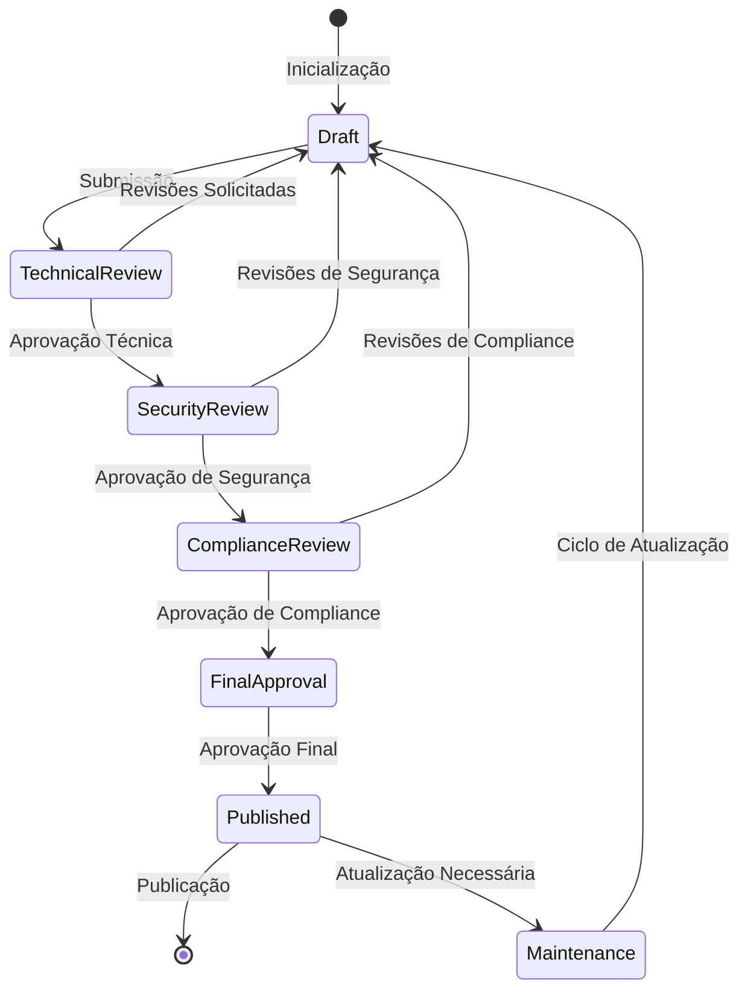

# 🗂️ Índice Master - Plano de Implementação de Autenticação
# INNOVABIZ IAM

```
Data: 31/07/2025
Versão: 1.0.0
Status: Em desenvolvimento
Classificação: Confidencial - Interno
Responsáveis: Equipe de Arquitetura INNOVABIZ
Aprovado por: Comitê de Arquitetura e Segurança
```

## 📑 Visão Geral da Documentação

Este índice master organiza toda a documentação técnica relacionada à implementação de autenticação na plataforma INNOVABIZ IAM. A documentação segue uma abordagem modular, com componentes especializados para cada método de autenticação e aspectos técnicos comuns, garantindo conformidade com frameworks internacionais, regulações regionais e requisitos de segurança da plataforma.

### 🏆 Objetivos da Documentação

- **Padronização**: Assegurar implementações consistentes e seguras através de documentação técnica detalhada
- **Compliance**: Garantir conformidade com frameworks internacionais (NIST, ISO, FIDO) e regulações regionais
- **Qualidade**: Fornecer diretrizes precisas para implementação de alta qualidade
- **Governança**: Suportar o processo de aprovação e garantia de qualidade para componentes de autenticação
- **Escalabilidade**: Permitir expansão controlada de métodos de autenticação no ecossistema

### 📚 Estrutura da Documentação

A documentação está organizada nas seguintes categorias:

1. **Plano Geral de Implementação** - Visão estratégica, princípios e organização
2. **Especificações por Método** - Documentação técnica para cada método de autenticação
3. **Componentes Técnicos Comuns** - Arquitetura de referência e componentes reutilizáveis
4. **Matrizes de Conformidade** - Mapeamento detalhado de requisitos regulatórios
5. **Guias de Integração** - Orientação para integrações com outros sistemas
6. **Recomendações de Segurança** - Diretrizes específicas para implementação segura
7. **Modelos de Referência** - Código e configurações de referência
8. **Documentos de Suporte** - Materiais adicionais e recursos

## 📋 Catálogo de Documentos

### 1️⃣ Plano Geral de Implementação

| Documento | Descrição | Status | Última Atualização | Responsável |
|-----------|-----------|--------|-------------------|-------------|
| [`AuthenticationImplementationPlan_Part1.md`](./AuthenticationImplementationPlan_Part1.md) | Estrutura e princípios fundamentais | ✅ Concluído | 31/07/2025 | Equipe de Arquitetura |
| `AuthenticationImplementationPlan_Part2.md` | Roadmap e governança técnica | 🚧 Em desenvolvimento | - | Equipe de Arquitetura |
| `AuthenticationImplementationPlan_Part3.md` | Matriz de capacidades e integração | 📝 Planejado | - | Equipe de Arquitetura |

### 2️⃣ Especificações por Método de Autenticação

#### Métodos Prioritários (P0/P1)

| Documento | Descrição | Status | Última Atualização | Responsável |
|-----------|-----------|--------|-------------------|-------------|
| `WebAuthn_FIDO2_Specification.md` | Implementação de WebAuthn/FIDO2 | 🚧 Em desenvolvimento | - | Equipe de Segurança |
| `MultiFactorAuthentication_Specification.md` | Implementação de MFA | 📝 Planejado | - | Equipe de Segurança |
| `BiometricFacial_Specification.md` | Implementação de autenticação facial | 📝 Planejado | - | Equipe de IA e Segurança |
| `AdaptiveAuthentication_Specification.md` | Implementação de autenticação adaptativa | 📝 Planejado | - | Equipe de Segurança |
| `TOTP_HOTP_Specification.md` | Implementação de TOTP/HOTP | 📝 Planejado | - | Equipe de Segurança |

#### Métodos Secundários (P2/P3)

| Documento | Descrição | Status | Última Atualização | Responsável |
|-----------|-----------|--------|-------------------|-------------|
| `MagicLinks_Specification.md` | Implementação de magic links | 📝 Planejado | - | Equipe de Desenvolvimento |
| `SMS_Email_OTP_Specification.md` | Implementação de OTP por SMS/Email | 📝 Planejado | - | Equipe de Desenvolvimento |
| `FingerprintBiometric_Specification.md` | Implementação de autenticação por impressão digital | 📝 Planejado | - | Equipe de IA e Segurança |
| `ContinuousAuthentication_Specification.md` | Implementação de autenticação contínua | 📝 Planejado | - | Equipe de Segurança |
| `VoiceBiometric_Specification.md` | Implementação de biometria de voz | 📝 Planejado | - | Equipe de IA e Segurança |

#### Métodos Futuros (P4)

| Documento | Descrição | Status | Última Atualização | Responsável |
|-----------|-----------|--------|-------------------|-------------|
| `BehavioralBiometrics_Specification.md` | Implementação de biometria comportamental | 📝 Planejado | - | Equipe de IA e Segurança |
| `QRCodeAuthentication_Specification.md` | Implementação de autenticação via QR Code | 📝 Planejado | - | Equipe de Desenvolvimento |

### 3️⃣ Componentes Técnicos Comuns

| Documento | Descrição | Status | Última Atualização | Responsável |
|-----------|-----------|--------|-------------------|-------------|
| `Authentication_Reference_Architecture.md` | Arquitetura de referência para autenticação | 📝 Planejado | - | Equipe de Arquitetura |
| `Credential_Storage_Framework.md` | Framework para armazenamento seguro de credenciais | 📝 Planejado | - | Equipe de Segurança |
| `AuthN_AuthZ_Integration.md` | Integração entre autenticação e autorização | 📝 Planejado | - | Equipe de Arquitetura |
| `Session_Management_Framework.md` | Framework para gestão de sessões | 📝 Planejado | - | Equipe de Desenvolvimento |
| `Encryption_Standards.md` | Padrões de criptografia para autenticação | 📝 Planejado | - | Equipe de Segurança |
| `Authentication_API_Standards.md` | Padrões de API para serviços de autenticação | 📝 Planejado | - | Equipe de API |
| `Event_Logging_Framework.md` | Framework para registro de eventos de autenticação | 📝 Planejado | - | Equipe de Observabilidade |

### 4️⃣ Matrizes de Conformidade

| Documento | Descrição | Status | Última Atualização | Responsável |
|-----------|-----------|--------|-------------------|-------------|
| `Regulatory_Compliance_Matrix.md` | Matriz de conformidade regulatória global | 📝 Planejado | - | Equipe de Compliance |
| `Regional_Compliance_Requirements.md` | Requisitos específicos por região | 📝 Planejado | - | Equipe de Compliance |
| `NIST_Compliance_Matrix.md` | Matriz de conformidade com NIST SP 800-63 | 📝 Planejado | - | Equipe de Segurança |
| `ISO_27001_Compliance_Matrix.md` | Matriz de conformidade com ISO/IEC 27001 | 📝 Planejado | - | Equipe de Segurança |
| `PCI_DSS_Authentication_Requirements.md` | Requisitos de autenticação PCI DSS | 📝 Planejado | - | Equipe de Compliance |

### 5️⃣ Guias de Integração

| Documento | Descrição | Status | Última Atualização | Responsável |
|-----------|-----------|--------|-------------------|-------------|
| `IAM_Core_Integration_Guide.md` | Integração com componentes core do IAM | 📝 Planejado | - | Equipe de Integração |
| `KrakenD_API_Gateway_Integration.md` | Integração com API Gateway | 📝 Planejado | - | Equipe de API |
| `Identity_Provider_Integration.md` | Integração com provedores externos de identidade | 📝 Planejado | - | Equipe de Integração |
| `Mobile_Integration_Guide.md` | Integração com aplicações móveis | 📝 Planejado | - | Equipe Mobile |
| `Web_Integration_Guide.md` | Integração com aplicações web | 📝 Planejado | - | Equipe Frontend |
| `MCP_Integration_Guide.md` | Integração com Model Context Protocol | 📝 Planejado | - | Equipe de IA |

### 6️⃣ Recomendações de Segurança

| Documento | Descrição | Status | Última Atualização | Responsável |
|-----------|-----------|--------|-------------------|-------------|
| `Authentication_Security_Checklist.md` | Checklist de segurança para implementação | 📝 Planejado | - | Equipe de Segurança |
| `Threat_Modeling_Guide.md` | Guia para modelagem de ameaças | 📝 Planejado | - | Equipe de Segurança |
| `Cryptography_Best_Practices.md` | Melhores práticas criptográficas | 📝 Planejado | - | Equipe de Segurança |
| `Key_Management_Guide.md` | Guia para gestão de chaves criptográficas | 📝 Planejado | - | Equipe de Segurança |
| `Account_Recovery_Security.md` | Segurança para recuperação de contas | 📝 Planejado | - | Equipe de Segurança |

### 7️⃣ Modelos de Referência

| Documento | Descrição | Status | Última Atualização | Responsável |
|-----------|-----------|--------|-------------------|-------------|
| `WebAuthn_Reference_Implementation.md` | Implementação de referência para WebAuthn | 📝 Planejado | - | Equipe de Desenvolvimento |
| `MFA_Reference_Implementation.md` | Implementação de referência para MFA | 📝 Planejado | - | Equipe de Desenvolvimento |
| `Biometric_Reference_Implementation.md` | Implementação de referência para biometria | 📝 Planejado | - | Equipe de IA e Segurança |
| `Database_Schema_Reference.md` | Schema de referência para banco de dados | 📝 Planejado | - | Equipe de Dados |
| `API_Contracts_Reference.md` | Contratos de API de referência | 📝 Planejado | - | Equipe de API |

### 8️⃣ Documentos de Suporte

| Documento | Descrição | Status | Última Atualização | Responsável |
|-----------|-----------|--------|-------------------|-------------|
| `Authentication_Glossary.md` | Glossário de termos de autenticação | 📝 Planejado | - | Equipe de Documentação |
| `Authentication_FAQs.md` | Perguntas frequentes sobre autenticação | 📝 Planejado | - | Equipe de Documentação |
| `Authentication_Decision_Framework.md` | Framework para decisões de autenticação | 📝 Planejado | - | Equipe de Arquitetura |
| `Implementation_Templates.md` | Templates para implementação | 📝 Planejado | - | Equipe de Desenvolvimento |
| `Testing_Templates.md` | Templates para testes | 📝 Planejado | - | Equipe de QA |

## 🔄 Status do Projeto e Próximos Passos

### Status Atual
- **Documentos Concluídos**: 1 (1%)
- **Documentos Em Desenvolvimento**: 2 (3%)
- **Documentos Planejados**: 42 (96%)

### Próximos Passos Prioritários
1. Finalizar `WebAuthn_FIDO2_Specification.md` (P0)
2. Iniciar `MultiFactorAuthentication_Specification.md` (P0)
3. Desenvolver `Authentication_Reference_Architecture.md` (Componente Comum)
4. Elaborar `Regulatory_Compliance_Matrix.md` (Conformidade)

## 🏗️ Metodologia de Desenvolvimento

### Ciclo de Vida do Documento



### Templates e Padrões

Todos os documentos de implementação devem seguir os templates padronizados disponíveis em:
- [`/CoreModules/IAM/templates/implementation/`](../../templates/implementation/)

Os principais templates incluem:
- `method_specification_template.md` - Para especificações de método
- `technical_component_template.md` - Para componentes técnicos
- `compliance_matrix_template.md` - Para matrizes de conformidade

### Controle de Versão e Histórico

Cada documento deve incluir uma seção de controle de versão seguindo o formato:

```markdown
## Controle de Versão

| Versão | Data | Autor | Descrição da Alteração |
|--------|------|-------|------------------------|
| 0.1 | 2025-07-31 | Equipe de Arquitetura | Versão inicial |
| 0.2 | 2025-08-15 | Equipe de Segurança | Revisão de segurança |
| 1.0 | 2025-08-30 | Comitê de Aprovação | Versão aprovada |
```

## 📊 Métricas e Monitoramento

### Métricas de Qualidade

| Métrica | Objetivo | Método de Avaliação | Frequência |
|---------|----------|---------------------|------------|
| Cobertura Técnica | 100% dos métodos de autenticação | Auditoria de documentação | Mensal |
| Precisão Técnica | 0 erros técnicos | Revisão por especialistas | Por documento |
| Conformidade Regulatória | 100% de requisitos atendidos | Matriz de rastreabilidade | Trimestral |
| Implementabilidade | 95% dos casos de uso cobertos | Validação com desenvolvedores | Por documento |
| Atualização | 100% dos documentos revisados | Processo de gestão de mudanças | Trimestral |

### Dashboard de Status

Um dashboard interativo de status está disponível em:
- [`/CoreModules/IAM/dashboards/implementation_status.html`](../../dashboards/implementation_status.html)

## 👥 Equipes e Contatos

| Equipe | Responsável | Email | Área de Responsabilidade |
|--------|-------------|-------|--------------------------|
| Arquitetura | Carlos Mendez | carlos.mendez@innovabiz.com | Visão geral, arquitetura de referência |
| Segurança | Lucia Pereira | lucia.pereira@innovabiz.com | Especificações de segurança, revisões |
| Desenvolvimento | Marcos Silva | marcos.silva@innovabiz.com | Implementações de referência, modelos |
| Compliance | Jennifer Wu | jennifer.wu@innovabiz.com | Matrizes de conformidade, requisitos regionais |
| IA e Biometria | Ahmed Khalid | ahmed.khalid@innovabiz.com | Especificações biométricas, IA |
| Observabilidade | Sandra Lopez | sandra.lopez@innovabiz.com | Logging, monitoramento, alertas |
| API | Rafael Torres | rafael.torres@innovabiz.com | Padrões de API, integração |
| QA | Nina Johnson | nina.johnson@innovabiz.com | Testes, garantia de qualidade |

## 📚 Recursos e Referências

### Frameworks e Padrões Internacionais

- [NIST SP 800-63-4](https://pages.nist.gov/800-63-4/) - Digital Identity Guidelines
- [FIDO Alliance Specifications](https://fidoalliance.org/specifications/) - WebAuthn, CTAP2, UAF
- [ISO/IEC 27001:2022](https://www.iso.org/standard/27001) - Information Security Management
- [OWASP Authentication Best Practices](https://owasp.org/www-project-authentication-best-practices/)
- [OpenID Connect Core 1.0](https://openid.net/specs/openid-connect-core-1_0.html)

### Recursos Internos INNOVABIZ

- [INNOVABIZ Security Framework](../../../security/framework/)
- [IAM Architecture Overview](../../architecture/)
- [Multi-Context Implementation Guide](../../../architecture/multi-context/)
- [INNOVABIZ Compliance Guidelines](../../../compliance/)

---

*Este documento é de propriedade da INNOVABIZ e de distribuição restrita. Contém informações confidenciais e estratégicas.*

*Preparado pela Equipe de Arquitetura INNOVABIZ | Última Atualização: 31/07/2025*