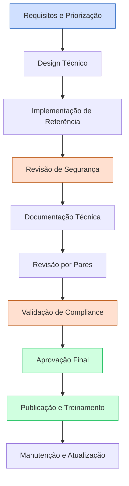
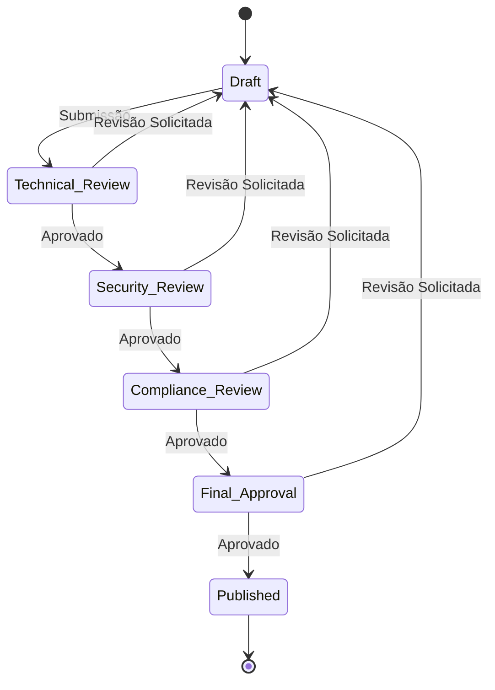

# 🛠️ Plano de Implementação para Guias Técnicos de Autenticação
# INNOVABIZ IAM - Parte 1: Estrutura e Princípios

```
Data: 31/07/2025
Versão: 1.0.0
Status: Em desenvolvimento
Classificação: Confidencial - Interno
```

## 📋 Visão Geral do Plano

Este documento estabelece o plano detalhado para implementação dos guias técnicos de autenticação do módulo IAM (Identity and Access Management) da plataforma INNOVABIZ. O plano está alinhado aos princípios arquiteturais, requisitos regulatórios e melhores práticas internacionais de segurança e implementação.

### 🎯 Objetivos do Plano

1. Estabelecer uma **estrutura padronizada** para todos os guias técnicos de implementação de autenticação
2. Definir os **componentes essenciais** a serem documentados para cada método de autenticação
3. Priorizar o desenvolvimento dos guias conforme critérios estratégicos e técnicos
4. Garantir a **aderência a frameworks** internacionais e requisitos regulatórios
5. Fornecer uma **abordagem consistente** para implementações técnicas seguras
6. Estabelecer **critérios de qualidade** mensuráveis para cada guia
7. Criar **cronograma e marcos** para o desenvolvimento e revisão dos guias

### 📊 Métricas de Sucesso

| Métrica | Objetivo | Método de Avaliação |
|---------|----------|---------------------|
| Cobertura de métodos de autenticação | 100% dos métodos definidos no documento de requisitos | Revisão estruturada dos documentos concluídos |
| Conformidade com frameworks | 100% das exigências de NIST SP 800-63, ISO 27001, FIDO Alliance, GDPR/LGPD | Auditoria de compliance |
| Consistência técnica | 100% dos guias seguindo o template padronizado | Revisão por pares |
| Precisão técnica | 0 erros técnicos ou omissões críticas | Validação por especialistas e testes de implementação |
| Aplicabilidade | 95% dos casos de uso cobertos | Cenários de validação e feedback de desenvolvedores |
| Manutenibilidade | Atualização trimestral ou sob mudança significativa | Processo de gestão de mudanças |

## 🏛️ Princípios Arquiteturais e Normativos

### Princípios Fundamentais

```yaml
architectural_principles:
  security_by_design:
    definition: "Segurança como atributo intrínseco e não como adição posterior"
    requirements:
      - "Modelagem de ameaças integrada ao processo de design"
      - "Análise de riscos em cada componente de autenticação"
      - "Defesa em profundidade e princípio de privilégio mínimo"
      
  zero_trust:
    definition: "Verificar sempre, nunca confiar implicitamente"
    requirements:
      - "Autenticação contínua e contextual"
      - "Verificação de identidade em cada transação crítica"
      - "Segmentação de acesso e isolamento de contextos"
      
  privacy_by_default:
    definition: "Proteção de dados pessoais como configuração padrão"
    requirements:
      - "Minimização de dados coletados para autenticação"
      - "Armazenamento seguro de credenciais e templates biométricos"
      - "Implementação de anonimização e pseudonimização"
      
  user_centricity:
    definition: "Experiência do usuário como fator crítico de segurança"
    requirements:
      - "Equilíbrio entre segurança e usabilidade"
      - "Transparência nas operações de autenticação"
      - "Opções de recuperação seguras e acessíveis"
```

### Frameworks e Regulações Aplicáveis

#### Principais Frameworks Técnicos

1. **NIST SP 800-63-4** (Digital Identity Guidelines)
   - Níveis de garantia de identidade (IAL)
   - Níveis de garantia de autenticação (AAL)
   - Níveis de garantia federada (FAL)
   
2. **FIDO Alliance Specifications**
   - FIDO2/WebAuthn
   - CTAP2
   - FIDO UAF
   
3. **OAuth 2.1 e OpenID Connect 1.0**
   - Fluxos de autorização padronizados
   - JWT como formato de token
   - PKCE para aplicações públicas
   
4. **ISO/IEC 27001:2022**
   - Controles de gestão de acesso
   - Criptografia
   - Segurança em desenvolvimento

#### Regulações por Região

```yaml
regulatory_frameworks:
  brazil:
    - name: "LGPD"
      key_requirements:
        - "Consentimento explícito para coleta de dados biométricos"
        - "Finalidade específica para uso de dados de autenticação"
        - "Direito de exclusão de dados"
      implementation_impact:
        - "Armazenamento segregado de dados biométricos"
        - "APIs para exclusão de dados de autenticação"
        - "Registros de auditoria para consentimento"
        
  european_union:
    - name: "GDPR"
      key_requirements:
        - "Base legal para processamento de dados biométricos"
        - "Direitos do titular dos dados"
        - "Avaliação de impacto para tecnologias biométricas"
      implementation_impact:
        - "Processos de data portability para credenciais"
        - "Mecanismos de data minimization"
        - "Documentação de decisões de design"
        
    - name: "eIDAS 2.0"
      key_requirements:
        - "Níveis de garantia para identidade eletrônica"
        - "Interoperabilidade entre sistemas nacionais"
      implementation_impact:
        - "Suporte a wallets de identidade europeus"
        - "Interfaces para validação transfronteiriça"
        
  united_states:
    - name: "NIST 800-63"
      key_requirements:
        - "Níveis de garantia específicos por caso de uso"
        - "Requisitos de verificação de identidade"
      implementation_impact:
        - "Implementação de controles específicos por AAL"
        - "Procedimentos de identity proofing"
        
  angola:
    - name: "Lei de Proteção de Dados (Lei n.º 22/11)"
      key_requirements:
        - "Consentimento para coleta e processamento"
        - "Medidas técnicas de proteção"
      implementation_impact:
        - "Adaptação de interfaces para consentimento"
        - "Controles de segurança específicos"
```

## 🗂️ Estrutura de Documentação Padronizada

### Template para Guias Técnicos de Implementação

Cada guia técnico de implementação de método de autenticação seguirá uma estrutura padronizada:

```yaml
document_structure:
  - section: "1. Visão Geral"
    subsections:
      - "1.1 Descrição e Casos de Uso"
      - "1.2 Benefícios e Limitações"
      - "1.3 Níveis de Garantia (conforme NIST SP 800-63)"
      - "1.4 Compatibilidade com Dispositivos e Plataformas"
      
  - section: "2. Arquitetura de Referência"
    subsections:
      - "2.1 Diagrama de Componentes"
      - "2.2 Fluxos de Autenticação"
      - "2.3 Armazenamento de Dados e Criptografia"
      - "2.4 Integração com IAM Core"
      
  - section: "3. Requisitos de Implementação"
    subsections:
      - "3.1 Requisitos Funcionais"
      - "3.2 Requisitos Não-Funcionais"
      - "3.3 Requisitos de Segurança"
      - "3.4 Requisitos Regulatórios e de Compliance"
      
  - section: "4. Implementação Backend"
    subsections:
      - "4.1 Stack Tecnológica Recomendada"
      - "4.2 Modelo de Dados"
      - "4.3 APIs e Endpoints"
      - "4.4 Tratamento de Erros e Exceções"
      - "4.5 Exemplos de Código"
      
  - section: "5. Implementação Frontend"
    subsections:
      - "5.1 Stack Tecnológica Recomendada"
      - "5.2 Componentes UI/UX"
      - "5.3 Validações Client-Side"
      - "5.4 Acessibilidade"
      - "5.5 Exemplos de Código"
      
  - section: "6. Armazenamento e Proteção de Dados"
    subsections:
      - "6.1 Modelo de Dados e Schema"
      - "6.2 Criptografia e Proteção"
      - "6.3 Ciclo de Vida dos Dados"
      - "6.4 Backup e Recuperação"
      
  - section: "7. Estratégias de Teste"
    subsections:
      - "7.1 Testes Unitários"
      - "7.2 Testes de Integração"
      - "7.3 Testes de Segurança"
      - "7.4 Testes de Performance"
      - "7.5 Testes de Conformidade"
      
  - section: "8. Monitoramento e Observabilidade"
    subsections:
      - "8.1 Métricas Chave"
      - "8.2 Alertas e Thresholds"
      - "8.3 Logs e Trilhas de Auditoria"
      - "8.4 Dashboards Recomendados"
      
  - section: "9. Operação e Manutenção"
    subsections:
      - "9.1 Procedimentos Operacionais"
      - "9.2 Gestão de Incidentes"
      - "9.3 Recuperação de Desastres"
      - "9.4 Atualizações e Patches"
      
  - section: "10. Considerações de Compliance"
    subsections:
      - "10.1 Conformidade por Região"
      - "10.2 Checklist de Verificação"
      - "10.3 Documentação Requerida"
      
  - section: "11. Referências e Recursos"
    subsections:
      - "11.1 Padrões Técnicos"
      - "11.2 Documentação Relacionada"
      - "11.3 Exemplos de Implementação"
```

### Padronização de Artefatos Técnicos

Cada guia incluirá os seguintes artefatos técnicos padronizados:

1. **Diagramas de Arquitetura** (formato Mermaid)
   - Diagrama de Componentes
   - Diagrama de Sequência para Fluxos Principais
   - Diagrama de Estado para Ciclo de Vida

2. **Especificações de API** (formato OpenAPI 3.1/YAML)
   - Endpoints REST
   - Modelos de Dados
   - Códigos de Erro
   - Exemplos de Requisição/Resposta

3. **Modelos de Dados** (formato SQL/JSON Schema)
   - Esquemas de Banco de Dados
   - Índices e Otimizações
   - Políticas de Segurança (RLS/FGAC)

4. **Exemplos de Código** (múltiplas linguagens)
   - Java/Spring Boot
   - TypeScript/Node.js
   - Python/FastAPI
   - Kotlin (Mobile)
   - Swift (iOS)

5. **Configurações de Segurança** (formato YAML)
   - Políticas de Acesso
   - Configurações de Criptografia
   - Integração com HSMs/KMS

## 🚀 Priorização e Roadmap de Implementação

### Critérios de Priorização

```yaml
prioritization_criteria:
  security_impact:
    weight: 30%
    description: "Impacto na postura geral de segurança"
    
  regulatory_requirements:
    weight: 25%
    description: "Exigências regulatórias e prazos de compliance"
    
  business_value:
    weight: 20%
    description: "Valor para negócio e alinhamento estratégico"
    
  technical_complexity:
    weight: 15%
    description: "Complexidade e esforço de implementação"
    
  user_experience:
    weight: 10%
    description: "Impacto na experiência e adoção pelo usuário"
```

### Métodos de Autenticação Priorizados

| Método de Autenticação | Prioridade | Justificativa | Marcos de Entrega |
|------------------------|------------|---------------|-------------------|
| WebAuthn/FIDO2 | P0 (Crítico) | Standard moderno para autenticação sem senha, eliminação de riscos de phishing, forte segurança | Agosto/2025 |
| Autenticação Multifator (MFA) | P0 (Crítico) | Requisito fundamental para compliance com PCI DSS, NIST AAL2/3 | Agosto/2025 |
| Biometria Facial | P1 (Alta) | Forte demanda de mercado, integração mobile first | Setembro/2025 |
| Autenticação Adaptativa | P1 (Alta) | Balanço entre segurança e experiência, redução de fricção | Setembro/2025 |
| TOTP/HOTP | P1 (Alta) | Fallback universal para MFA, baixa complexidade técnica | Setembro/2025 |
| Magic Links | P2 (Média) | Implementação rápida, boa UX, menor segurança que WebAuthn | Outubro/2025 |
| SMS/Email OTP | P2 (Média) | Familiar aos usuários, cobertura universal, questões de segurança | Outubro/2025 |
| Biometria por Impressão Digital | P2 (Média) | Integração com dispositivos, questões de privacidade | Outubro/2025 |
| Autenticação Contínua | P3 (Baixa) | Complexidade técnica alta, valor para segurança de sessão | Novembro/2025 |
| Autenticação por Reconhecimento de Voz | P3 (Baixa) | Casos de uso específicos, complexidade técnica | Novembro/2025 |
| Biometria Comportamental | P4 (Futura) | Tecnologia emergente, aplicações específicas | Q1/2026 |
| QR Code Authentication | P4 (Futura) | Casos de uso específicos | Q1/2026 |

---

## 🔄 Ciclo de Desenvolvimento e Governança

### Processo de Desenvolvimento



### Papéis e Responsabilidades

| Papel | Responsabilidades | Artefatos |
|-------|-------------------|-----------|
| Arquiteto de Segurança | Design e revisão de segurança, modelagem de ameaças | Arquitetura de segurança, requisitos de segurança |
| Especialista em Compliance | Validação regulatória, checklists de compliance | Matriz de conformidade, documentação regulatória |
| Desenvolvedor Senior | Implementação de referência, exemplos de código | Código de referência, bibliotecas, exemplos |
| UX/UI Designer | Design de interfaces, fluxos de usuário | Wireframes, guidelines de UX |
| DevOps/SRE | Configurações, observabilidade, escalabilidade | Configurações, dashboards, alertas |
| QA/Tester | Estratégias e casos de teste | Planos de teste, casos de teste automatizados |
| Gerente Técnico | Coordenação, priorização, cronograma | Roadmap, relatórios de status |

### Ciclo de Aprovação e Revisão



### Gestão de Mudanças

- **Versionamento**: Semântico (MAJOR.MINOR.PATCH)
- **Gatilhos de atualização**:
  - Mudanças em frameworks ou regulações
  - Descoberta de vulnerabilidades
  - Novas tecnologias ou métodos
  - Feedback de implementadores
- **Processos**:
  - Revisão trimestral de todos os guias
  - Atualizações emergenciais para questões de segurança
  - Notificação automática para stakeholders

## 🔍 Garantia de Qualidade

### Critérios de Qualidade

| Dimensão | Critérios | Método de Verificação |
|----------|-----------|----------------------|
| Completude | Todos os componentes e seções requeridos | Checklist de revisão estruturada |
| Precisão Técnica | Informação correta e atualizada | Revisão por especialistas, implementação de referência |
| Alinhamento com Frameworks | Conformidade com NIST, ISO, etc. | Matriz de rastreabilidade de requisitos |
| Segurança | Sem vulnerabilidades introduzidas | Revisão de segurança, STRIDE/DREAD |
| Clareza | Compreensível para o público-alvo | Revisão por implementadores representativos |
| Aplicabilidade | Exemplos práticos e implementáveis | Prova de conceito, implementação de referência |
| Consistência | Alinhamento com outros guias e padrões | Revisão cruzada com documentação existente |

### Testes de Implementação

Para cada guia, serão desenvolvidos:

1. **Implementação de referência** funcional e segura
2. **Conjunto de testes** para validação de conformidade
3. **Ambiente de sandbox** para experimentação segura
4. **Casos de uso** implementados como exemplos

---

*Este documento continua na Parte 2, que detalha os componentes específicos para cada método de autenticação e os requisitos técnicos detalhados.*

*Preparado pela Equipe de Arquitetura INNOVABIZ | Última Atualização: 31/07/2025*