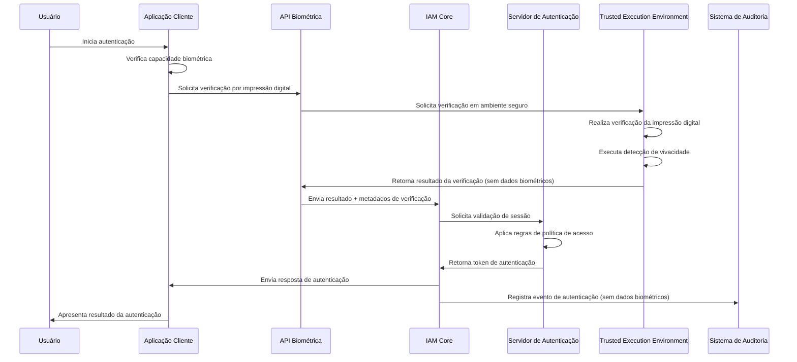
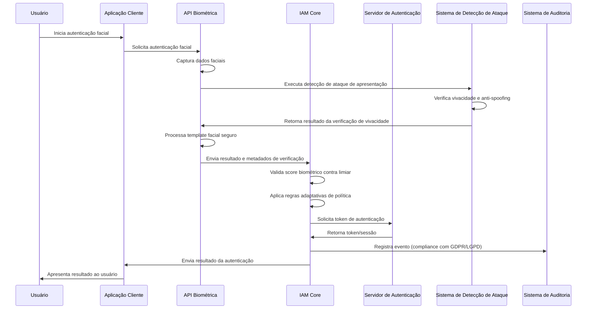
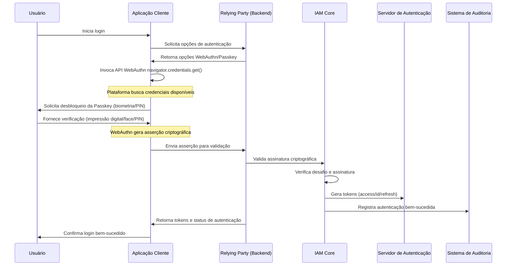
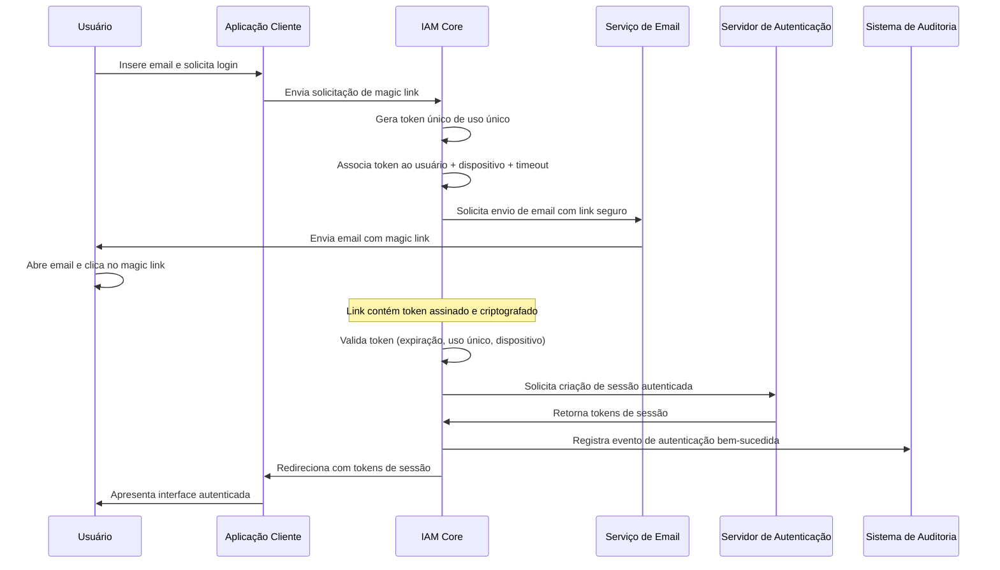
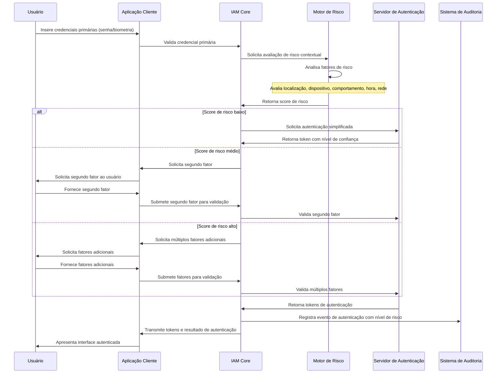
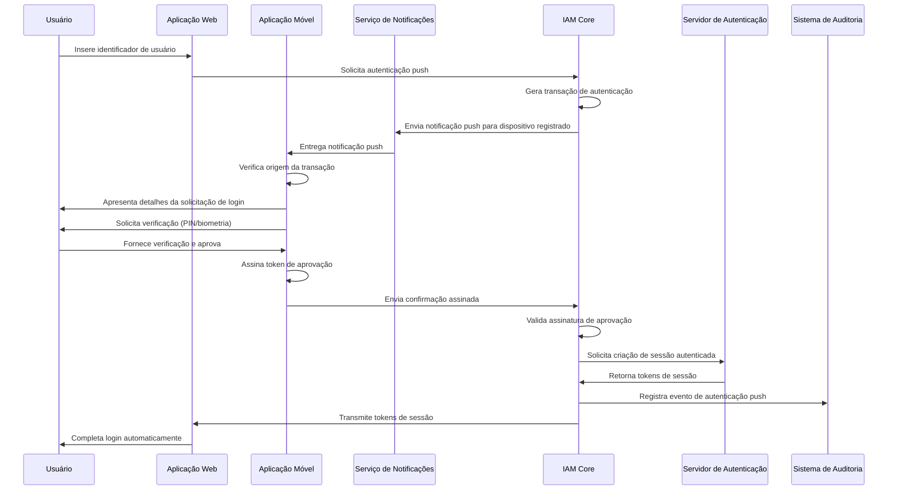
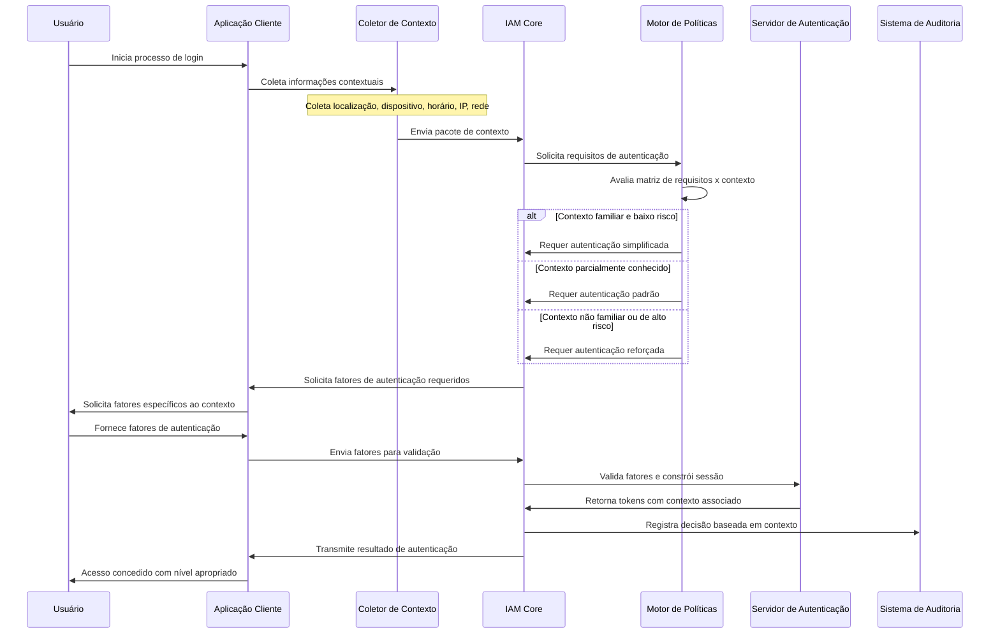

# 🔄 Fluxos de Trabalho de Autenticação - Parte 1

## 📖 Visão Geral

Este documento técnico define os fluxos de trabalho detalhados para implementação dos métodos de autenticação no módulo IAM da plataforma INNOVABIZ. Os workflows apresentados seguem os padrões da indústria (ISO/IEC 27001, NIST 800-63, FIDO, OpenID Connect, OAuth 2.0), incorporando controles de segurança robustos e promovendo uma experiência do usuário otimizada.

## 🔐 Fluxos de Trabalho de Autenticação Biométrica

### Autenticação por Impressão Digital

### Autenticação Facial

## 🔑 Fluxos de Trabalho de Autenticação Sem Senha

### Autenticação com Passkeys

### Autenticação por Magic Link

## 🛡️ Fluxos de Trabalho de Autenticação Multi-Fator

### Autenticação Multi-Fator Baseada em Risco

### Autenticação Push com Aprovação Explícita

## 🌐 Fluxos de Trabalho de Autenticação Contextual

### Autenticação Adaptativa Baseada em Contexto

