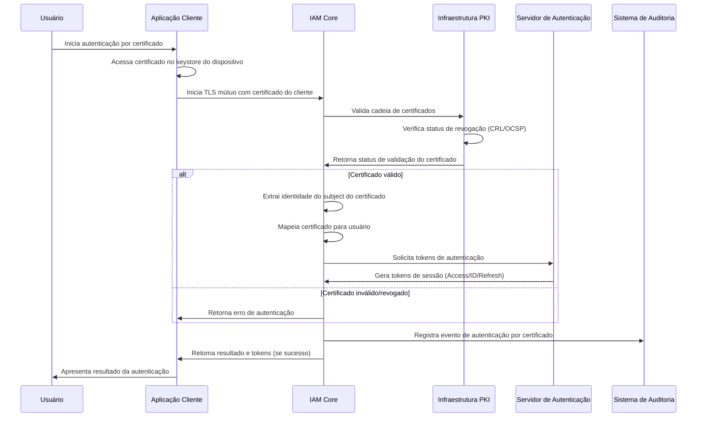
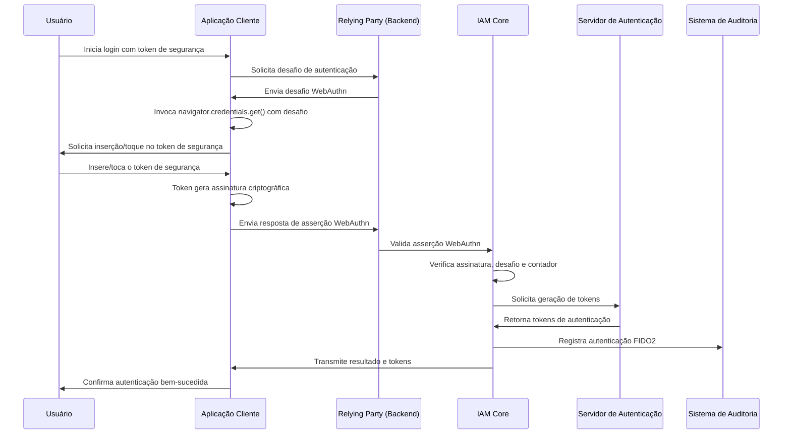
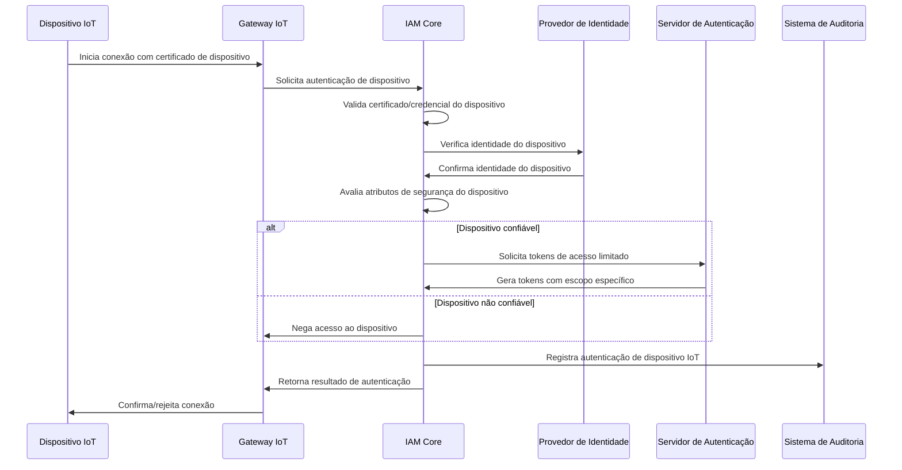
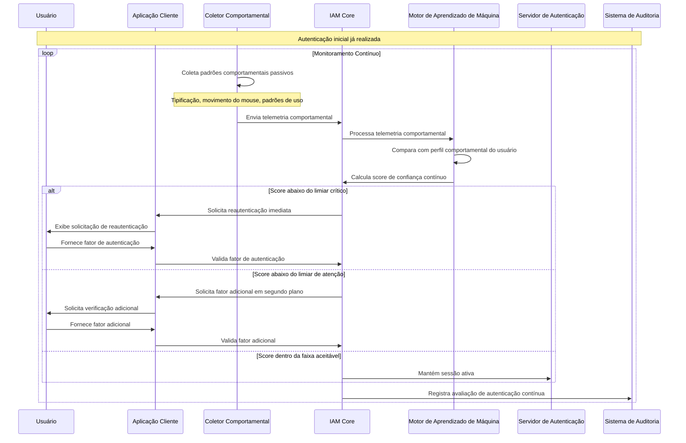
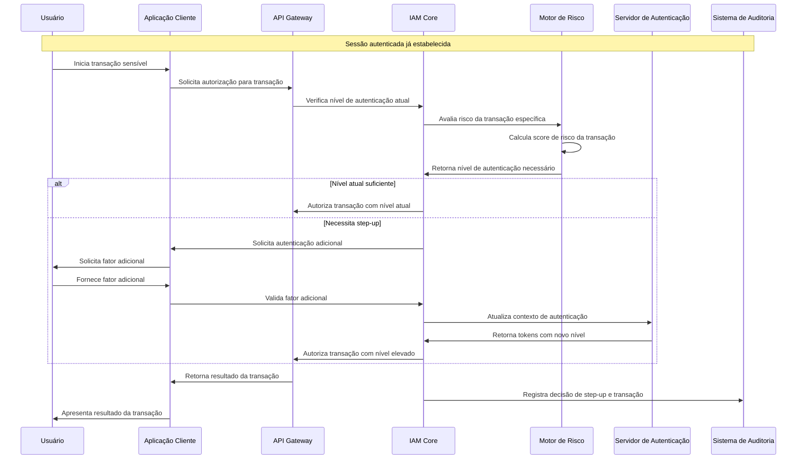
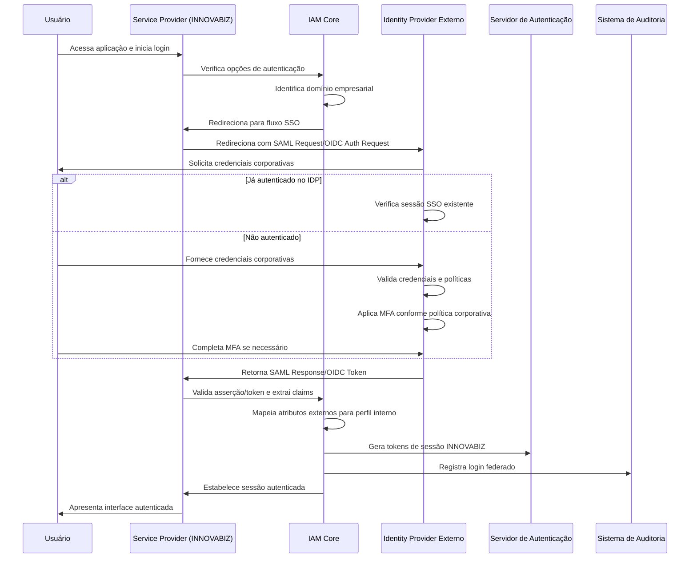
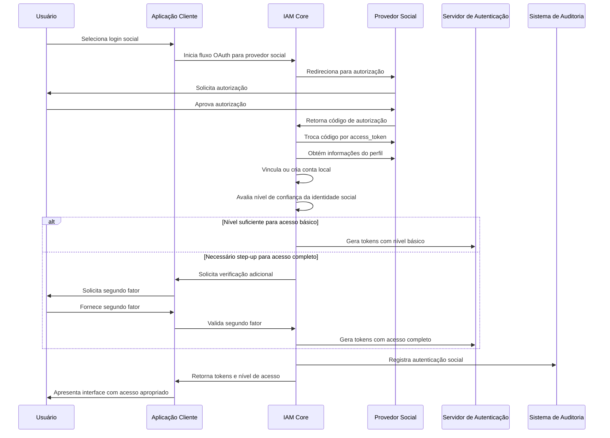
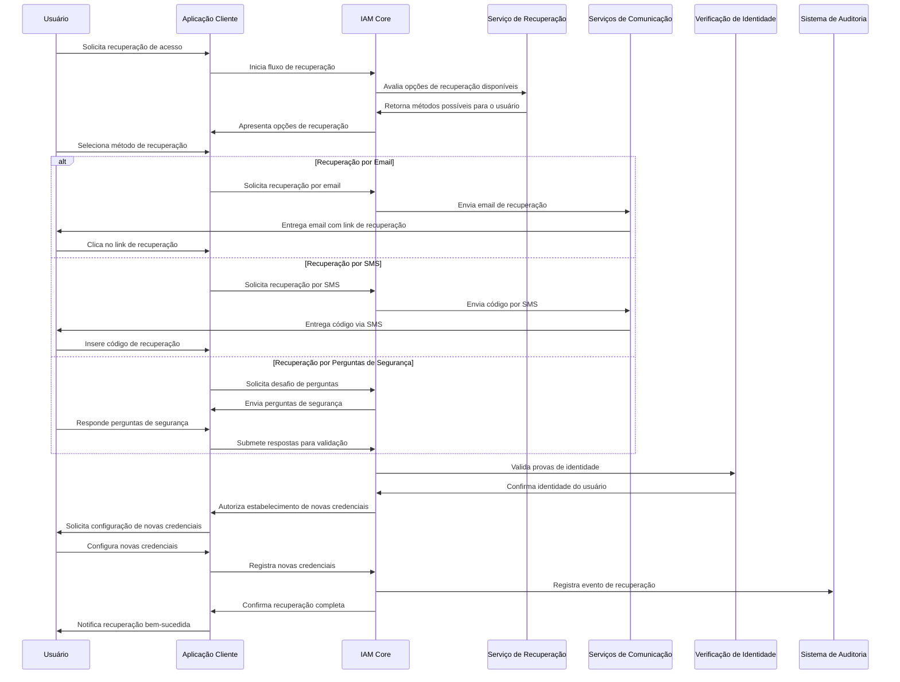
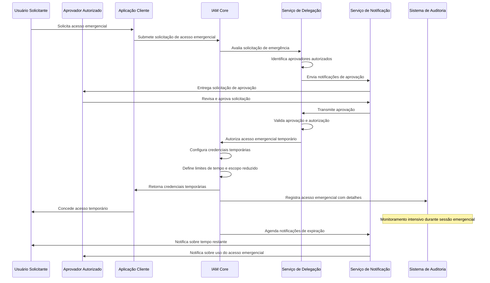

# 🔄 Fluxos de Trabalho de Autenticação - Parte 2

## 📖 Visão Geral

Este documento continua a definição dos fluxos de trabalho para implementação dos métodos de autenticação no módulo IAM da plataforma INNOVABIZ, seguindo os padrões ISO/IEC 27001, NIST 800-63, FIDO, OpenID Connect e OAuth 2.0, alinhados com os princípios de Arquitetura de Integração Total e Governança Aumentada.

## 📱 Fluxos de Trabalho de Autenticação por Dispositivo

### Autenticação por Certificado em Dispositivo

### Autenticação por Token de Hardware FIDO2

### Autenticação por Dispositivo de IoT

## 🔄 Fluxos de Autenticação Contínua

### Autenticação Contínua Comportamental

### Autenticação Step-Up para Transação de Alto Risco

## 🌐 Fluxos de Trabalho de Federação e SSO

### Autenticação via SSO Empresarial

### Autenticação Social com Step-Up

## 🛡️ Fluxos de Recuperação e Delegação

### Recuperação de Acesso Sem Senha

### Delegação de Autenticação (Break-Glass)

