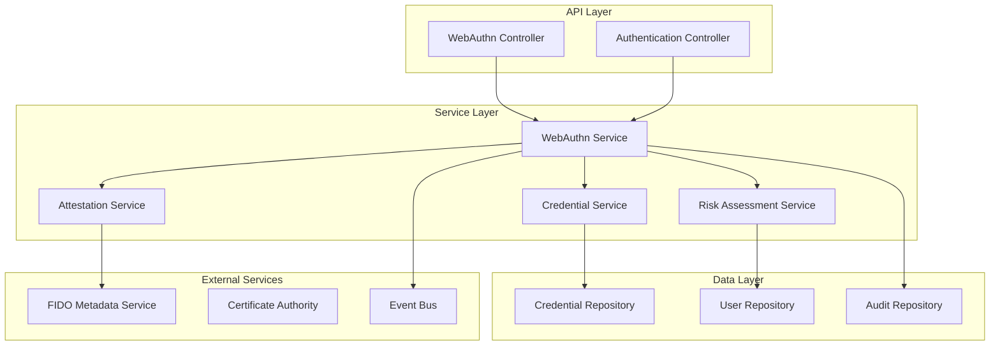

# 🛠️ Guia de Implementação Backend WebAuthn/FIDO2
# INNOVABIZ IAM

```yaml
version: 1.0.0
date: 31/07/2025
status: Em desenvolvimento
classification: Confidencial - Interno
```

## 📑 Visão Geral

Este guia fornece orientações práticas para implementação dos serviços backend WebAuthn/FIDO2 na plataforma INNOVABIZ IAM. Cobre arquitetura, componentes, configuração, segurança e exemplos de código para Node.js/TypeScript.

### 🎯 Objetivos do Guia

- Implementar serviços WebAuthn seguindo padrões W3C e FIDO
- Configurar validação de attestation e assertion
- Implementar armazenamento seguro de credenciais
- Integrar com arquitetura multi-contexto INNOVABIZ
- Garantir performance e escalabilidade

## 🏗️ Arquitetura Backend

### Componentes Principais



### Stack Tecnológico

```yaml
backend_stack:
  runtime: "Node.js 18+"
  framework: "Express.js 4.18+"
  language: "TypeScript 5.0+"
  database: "PostgreSQL 15+"
  cache: "Redis 7+"
  messaging: "Apache Kafka 3.5+"
  
libraries:
  webauthn: "@simplewebauthn/server@8.3+"
  crypto: "node:crypto (built-in)"
  validation: "joi@17.9+"
  logging: "winston@3.10+"
  monitoring: "prometheus-client@14.2+"
```

## 🔧 Configuração do Ambiente

### 1. Dependências NPM

```json
{
  "dependencies": {
    "@simplewebauthn/server": "^8.3.0",
    "@simplewebauthn/typescript-types": "^8.3.0",
    "express": "^4.18.2",
    "joi": "^17.9.2",
    "jsonwebtoken": "^9.0.1",
    "pg": "^8.11.1",
    "redis": "^4.6.7",
    "winston": "^3.10.0",
    "prometheus-client": "^14.2.0"
  },
  "devDependencies": {
    "@types/node": "^20.4.0",
    "@types/express": "^4.17.17",
    "typescript": "^5.1.6",
    "jest": "^29.6.1"
  }
}
```

### 2. Configuração TypeScript

```typescript
// src/config/webauthn.ts
export interface WebAuthnConfig {
  rpName: string;
  rpID: string;
  origin: string[];
  timeout: number;
  attestation: AttestationConveyancePreference;
  authenticatorSelection: AuthenticatorSelectionCriteria;
}

export const webauthnConfig: WebAuthnConfig = {
  rpName: process.env.WEBAUTHN_RP_NAME || 'INNOVABIZ',
  rpID: process.env.WEBAUTHN_RP_ID || 'innovabiz.com',
  origin: process.env.WEBAUTHN_ORIGINS?.split(',') || ['https://app.innovabiz.com'],
  timeout: parseInt(process.env.WEBAUTHN_TIMEOUT || '60000'),
  attestation: (process.env.WEBAUTHN_ATTESTATION as AttestationConveyancePreference) || 'indirect',
  authenticatorSelection: {
    authenticatorAttachment: 'platform',
    userVerification: 'preferred',
    residentKey: 'preferred'
  }
};
```

### 3. Schema de Banco de Dados

```sql
-- Tabela principal de credenciais WebAuthn
CREATE TABLE webauthn_credentials (
    id UUID PRIMARY KEY DEFAULT gen_random_uuid(),
    user_id UUID NOT NULL REFERENCES users(id) ON DELETE CASCADE,
    tenant_id UUID NOT NULL,
    credential_id TEXT NOT NULL UNIQUE,
    public_key BYTEA NOT NULL,
    sign_count BIGINT NOT NULL DEFAULT 0,
    aaguid UUID,
    attestation_format TEXT,
    attestation_data JSONB,
    user_verified BOOLEAN NOT NULL DEFAULT false,
    backup_eligible BOOLEAN NOT NULL DEFAULT false,
    backup_state BOOLEAN NOT NULL DEFAULT false,
    transports TEXT[],
    device_type TEXT CHECK (device_type IN ('platform', 'cross-platform')),
    friendly_name TEXT,
    status TEXT NOT NULL DEFAULT 'active' CHECK (status IN ('active', 'revoked', 'suspended')),
    created_at TIMESTAMP WITH TIME ZONE DEFAULT NOW(),
    updated_at TIMESTAMP WITH TIME ZONE DEFAULT NOW(),
    last_used_at TIMESTAMP WITH TIME ZONE
);

-- Índices para performance
CREATE INDEX idx_webauthn_credentials_user_tenant ON webauthn_credentials(user_id, tenant_id);
CREATE INDEX idx_webauthn_credentials_credential_id ON webauthn_credentials(credential_id);
CREATE INDEX idx_webauthn_credentials_status ON webauthn_credentials(status) WHERE status = 'active';

-- Tabela de eventos de autenticação
CREATE TABLE webauthn_authentication_events (
    id UUID PRIMARY KEY DEFAULT gen_random_uuid(),
    credential_id UUID REFERENCES webauthn_credentials(id),
    user_id UUID NOT NULL,
    tenant_id UUID NOT NULL,
    event_type TEXT NOT NULL CHECK (event_type IN ('registration', 'authentication', 'failure')),
    client_data JSONB,
    authenticator_data BYTEA,
    signature BYTEA,
    user_verified BOOLEAN,
    sign_count BIGINT,
    ip_address INET,
    user_agent TEXT,
    result TEXT NOT NULL CHECK (result IN ('success', 'failure')),
    error_code TEXT,
    risk_score DECIMAL(3,2),
    created_at TIMESTAMP WITH TIME ZONE DEFAULT NOW()
);

-- Particionamento por data para performance
CREATE TABLE webauthn_authentication_events_y2025m07 PARTITION OF webauthn_authentication_events
FOR VALUES FROM ('2025-07-01') TO ('2025-08-01');
```

## 🔐 Implementação dos Serviços

### 1. WebAuthn Service Principal

```typescript
// src/services/WebAuthnService.ts
import {
  generateRegistrationOptions,
  verifyRegistrationResponse,
  generateAuthenticationOptions,
  verifyAuthenticationResponse
} from '@simplewebauthn/server';
import { CredentialService } from './CredentialService';
import { AttestationService } from './AttestationService';
import { RiskAssessmentService } from './RiskAssessmentService';

export class WebAuthnService {
  constructor(
    private credentialService: CredentialService,
    private attestationService: AttestationService,
    private riskService: RiskAssessmentService
  ) {}

  async generateRegistrationOptions(
    userId: string,
    tenantId: string,
    options: RegistrationOptionsRequest
  ): Promise<PublicKeyCredentialCreationOptions> {
    // Buscar credenciais existentes para exclusão
    const existingCredentials = await this.credentialService.getUserCredentials(userId, tenantId);
    
    const excludeCredentials = existingCredentials.map(cred => ({
      id: Buffer.from(cred.credentialId, 'base64url'),
      type: 'public-key' as const,
      transports: cred.transports as AuthenticatorTransport[]
    }));

    // Gerar opções de registro
    const registrationOptions = await generateRegistrationOptions({
      rpName: webauthnConfig.rpName,
      rpID: webauthnConfig.rpID,
      userID: Buffer.from(userId),
      userName: options.username,
      userDisplayName: options.displayName,
      timeout: webauthnConfig.timeout,
      attestationType: options.attestation || webauthnConfig.attestation,
      excludeCredentials,
      authenticatorSelection: {
        ...webauthnConfig.authenticatorSelection,
        ...options.authenticatorSelection
      },
      supportedAlgorithmIDs: [-7, -257, -8, -37, -38, -39] // ES256, RS256, EdDSA, PS256, PS384, PS512
    });

    // Armazenar challenge temporariamente (Redis)
    await this.storeChallenge(userId, tenantId, registrationOptions.challenge);

    return registrationOptions;
  }

  async verifyRegistration(
    userId: string,
    tenantId: string,
    response: RegistrationResponseJSON
  ): Promise<CredentialRegistrationResult> {
    // Recuperar challenge
    const expectedChallenge = await this.getChallenge(userId, tenantId);
    if (!expectedChallenge) {
      throw new Error('Challenge not found or expired');
    }

    // Verificar resposta de registro
    const verification = await verifyRegistrationResponse({
      response,
      expectedChallenge,
      expectedOrigin: webauthnConfig.origin,
      expectedRPID: webauthnConfig.rpID,
      requireUserVerification: true
    });

    if (!verification.verified || !verification.registrationInfo) {
      throw new Error('Registration verification failed');
    }

    const { registrationInfo } = verification;

    // Validar attestation se necessário
    if (registrationInfo.attestationObject) {
      await this.attestationService.validateAttestation(
        registrationInfo.attestationObject,
        registrationInfo.aaguid
      );
    }

    // Armazenar credencial
    const credential = await this.credentialService.storeCredential({
      userId,
      tenantId,
      credentialId: Buffer.from(registrationInfo.credentialID).toString('base64url'),
      publicKey: registrationInfo.credentialPublicKey,
      signCount: registrationInfo.counter,
      aaguid: registrationInfo.aaguid,
      attestationFormat: registrationInfo.fmt,
      userVerified: registrationInfo.userVerified,
      backupEligible: registrationInfo.credentialBackedUp,
      backupState: registrationInfo.credentialDeviceType === 'multiDevice',
      transports: response.response.transports || [],
      deviceType: registrationInfo.credentialDeviceType === 'multiDevice' ? 'cross-platform' : 'platform'
    });

    // Limpar challenge
    await this.clearChallenge(userId, tenantId);

    // Registrar evento
    await this.logAuthenticationEvent({
      credentialId: credential.id,
      userId,
      tenantId,
      eventType: 'registration',
      result: 'success',
      clientData: response.response.clientDataJSON,
      userVerified: registrationInfo.userVerified
    });

    return {
      credentialId: credential.credentialId,
      verified: true,
      attestationFormat: registrationInfo.fmt,
      userVerified: registrationInfo.userVerified
    };
  }

  async generateAuthenticationOptions(
    userIdOrUsername?: string,
    tenantId?: string,
    options: AuthenticationOptionsRequest = {}
  ): Promise<PublicKeyCredentialRequestOptions> {
    let allowCredentials: PublicKeyCredentialDescriptor[] = [];

    // Se usuário especificado, buscar suas credenciais
    if (userIdOrUsername && tenantId) {
      const credentials = await this.credentialService.getUserCredentials(userIdOrUsername, tenantId);
      allowCredentials = credentials.map(cred => ({
        id: Buffer.from(cred.credentialId, 'base64url'),
        type: 'public-key' as const,
        transports: cred.transports as AuthenticatorTransport[]
      }));
    }

    // Gerar opções de autenticação
    const authenticationOptions = await generateAuthenticationOptions({
      rpID: webauthnConfig.rpID,
      timeout: webauthnConfig.timeout,
      allowCredentials: allowCredentials.length > 0 ? allowCredentials : undefined,
      userVerification: options.userVerification || 'preferred'
    });

    // Armazenar challenge
    const challengeKey = userIdOrUsername ? `${userIdOrUsername}:${tenantId}` : 'anonymous';
    await this.storeChallenge(challengeKey, 'auth', authenticationOptions.challenge);

    return authenticationOptions;
  }

  async verifyAuthentication(
    response: AuthenticationResponseJSON,
    userIdOrUsername?: string,
    tenantId?: string
  ): Promise<AuthenticationResult> {
    // Buscar credencial
    const credential = await this.credentialService.getCredentialById(
      Buffer.from(response.id, 'base64url').toString('base64url')
    );

    if (!credential || credential.status !== 'active') {
      throw new Error('Credential not found or inactive');
    }

    // Recuperar challenge
    const challengeKey = userIdOrUsername ? `${userIdOrUsername}:${tenantId}` : 'anonymous';
    const expectedChallenge = await this.getChallenge(challengeKey, 'auth');
    if (!expectedChallenge) {
      throw new Error('Challenge not found or expired');
    }

    // Verificar resposta de autenticação
    const verification = await verifyAuthenticationResponse({
      response,
      expectedChallenge,
      expectedOrigin: webauthnConfig.origin,
      expectedRPID: webauthnConfig.rpID,
      authenticator: {
        credentialID: Buffer.from(credential.credentialId, 'base64url'),
        credentialPublicKey: credential.publicKey,
        counter: credential.signCount,
        transports: credential.transports as AuthenticatorTransport[]
      },
      requireUserVerification: true
    });

    if (!verification.verified || !verification.authenticationInfo) {
      throw new Error('Authentication verification failed');
    }

    const { authenticationInfo } = verification;

    // Verificar sign count (detecção de clonagem)
    if (authenticationInfo.newCounter <= credential.signCount && credential.signCount > 0) {
      await this.handleSignCountAnomaly(credential, authenticationInfo.newCounter);
      throw new Error('Sign count anomaly detected - possible credential cloning');
    }

    // Atualizar credencial
    await this.credentialService.updateCredentialUsage(
      credential.id,
      authenticationInfo.newCounter
    );

    // Avaliação de risco
    const riskScore = await this.riskService.assessAuthenticationRisk({
      userId: credential.userId,
      credentialId: credential.id,
      userAgent: response.response.clientDataJSON,
      ipAddress: '', // Será injetado pelo middleware
      userVerified: authenticationInfo.userVerified
    });

    // Limpar challenge
    await this.clearChallenge(challengeKey, 'auth');

    // Registrar evento
    await this.logAuthenticationEvent({
      credentialId: credential.id,
      userId: credential.userId,
      tenantId: credential.tenantId,
      eventType: 'authentication',
      result: 'success',
      clientData: response.response.clientDataJSON,
      authenticatorData: response.response.authenticatorData,
      signature: response.response.signature,
      userVerified: authenticationInfo.userVerified,
      signCount: authenticationInfo.newCounter,
      riskScore
    });

    return {
      userId: credential.userId,
      credentialId: credential.credentialId,
      verified: true,
      userVerified: authenticationInfo.userVerified,
      riskScore,
      authenticationLevel: this.determineAAL(credential, authenticationInfo.userVerified)
    };
  }

  private determineAAL(credential: any, userVerified: boolean): 'AAL1' | 'AAL2' | 'AAL3' {
    // AAL3: Hardware authenticator com user verification
    if (credential.deviceType === 'cross-platform' && userVerified) {
      return 'AAL3';
    }
    
    // AAL2: Multi-factor authentication
    if (userVerified || credential.deviceType === 'platform') {
      return 'AAL2';
    }
    
    // AAL1: Single factor
    return 'AAL1';
  }

  private async storeChallenge(key: string, type: string, challenge: string): Promise<void> {
    // Implementar armazenamento em Redis com TTL
    await redis.setex(`webauthn:challenge:${type}:${key}`, 300, challenge);
  }

  private async getChallenge(key: string, type: string): Promise<string | null> {
    return await redis.get(`webauthn:challenge:${type}:${key}`);
  }

  private async clearChallenge(key: string, type: string): Promise<void> {
    await redis.del(`webauthn:challenge:${type}:${key}`);
  }

  private async handleSignCountAnomaly(credential: any, newCounter: number): Promise<void> {
    // Suspender credencial
    await this.credentialService.suspendCredential(credential.id, 'SIGN_COUNT_ANOMALY');
    
    // Alertar segurança
    await this.notifySecurityTeam({
      type: 'CREDENTIAL_CLONING_SUSPECTED',
      credentialId: credential.id,
      userId: credential.userId,
      expectedCounter: credential.signCount,
      receivedCounter: newCounter
    });
  }
}
```

### 2. Controller de API

```typescript
// src/controllers/WebAuthnController.ts
import { Request, Response } from 'express';
import { WebAuthnService } from '../services/WebAuthnService';
import { validateRegistrationOptions, validateAuthenticationOptions } from '../validators/webauthn';

export class WebAuthnController {
  constructor(private webauthnService: WebAuthnService) {}

  async generateRegistrationOptions(req: Request, res: Response): Promise<void> {
    try {
      const { error, value } = validateRegistrationOptions(req.body);
      if (error) {
        res.status(400).json({
          error: {
            code: 'INVALID_REGISTRATION_REQUEST',
            message: error.details[0].message
          }
        });
        return;
      }

      const userId = req.user!.id;
      const tenantId = req.context!.tenantId;

      const options = await this.webauthnService.generateRegistrationOptions(
        userId,
        tenantId,
        value
      );

      res.json(options);
    } catch (error) {
      res.status(500).json({
        error: {
          code: 'REGISTRATION_OPTIONS_FAILED',
          message: 'Failed to generate registration options'
        }
      });
    }
  }

  async verifyRegistration(req: Request, res: Response): Promise<void> {
    try {
      const userId = req.user!.id;
      const tenantId = req.context!.tenantId;

      const result = await this.webauthnService.verifyRegistration(
        userId,
        tenantId,
        req.body
      );

      res.status(201).json(result);
    } catch (error) {
      res.status(400).json({
        error: {
          code: 'REGISTRATION_VERIFICATION_FAILED',
          message: error.message
        }
      });
    }
  }

  async generateAuthenticationOptions(req: Request, res: Response): Promise<void> {
    try {
      const { username } = req.body;
      const tenantId = req.context?.tenantId;

      const options = await this.webauthnService.generateAuthenticationOptions(
        username,
        tenantId,
        req.body
      );

      res.json(options);
    } catch (error) {
      res.status(500).json({
        error: {
          code: 'AUTHENTICATION_OPTIONS_FAILED',
          message: 'Failed to generate authentication options'
        }
      });
    }
  }

  async verifyAuthentication(req: Request, res: Response): Promise<void> {
    try {
      const { username } = req.body;
      const tenantId = req.context?.tenantId;

      const result = await this.webauthnService.verifyAuthentication(
        req.body,
        username,
        tenantId
      );

      // Gerar tokens JWT se autenticação primária
      if (!req.user) {
        const tokens = await this.generateAuthTokens(result.userId, tenantId);
        res.json({ ...result, ...tokens });
      } else {
        // Step-up authentication
        const stepUpToken = await this.generateStepUpToken(result.userId, result.authenticationLevel);
        res.json({ ...result, stepUpToken });
      }
    } catch (error) {
      res.status(400).json({
        error: {
          code: 'AUTHENTICATION_VERIFICATION_FAILED',
          message: error.message
        }
      });
    }
  }
}
```

## 📊 Monitoramento e Observabilidade

### Métricas Prometheus

```typescript
// src/metrics/webauthn.ts
import { Counter, Histogram, Gauge } from 'prom-client';

export const webauthnMetrics = {
  registrationAttempts: new Counter({
    name: 'webauthn_registration_attempts_total',
    help: 'Total number of WebAuthn registration attempts',
    labelNames: ['tenant_id', 'result', 'attestation_format']
  }),

  authenticationAttempts: new Counter({
    name: 'webauthn_authentication_attempts_total',
    help: 'Total number of WebAuthn authentication attempts',
    labelNames: ['tenant_id', 'result', 'aal_level']
  }),

  verificationDuration: new Histogram({
    name: 'webauthn_verification_duration_seconds',
    help: 'Time spent verifying WebAuthn responses',
    labelNames: ['operation_type'],
    buckets: [0.1, 0.5, 1, 2, 5]
  }),

  activeCredentials: new Gauge({
    name: 'webauthn_active_credentials_total',
    help: 'Total number of active WebAuthn credentials',
    labelNames: ['tenant_id', 'device_type']
  }),

  signCountAnomalies: new Counter({
    name: 'webauthn_sign_count_anomalies_total',
    help: 'Total number of sign count anomalies detected',
    labelNames: ['tenant_id']
  })
};
```

## 🔒 Considerações de Segurança

### 1. Validação de Origem

```typescript
// Validar origem rigorosamente
const validateOrigin = (origin: string, allowedOrigins: string[]): boolean => {
  return allowedOrigins.some(allowed => {
    try {
      const allowedUrl = new URL(allowed);
      const originUrl = new URL(origin);
      return allowedUrl.origin === originUrl.origin;
    } catch {
      return false;
    }
  });
};
```

### 2. Rate Limiting

```typescript
// src/middleware/rateLimiting.ts
import rateLimit from 'express-rate-limit';

export const webauthnRateLimit = rateLimit({
  windowMs: 60 * 1000, // 1 minuto
  max: 5, // 5 tentativas por minuto
  keyGenerator: (req) => `${req.ip}:${req.user?.id || 'anonymous'}`,
  message: {
    error: {
      code: 'RATE_LIMIT_EXCEEDED',
      message: 'Too many WebAuthn attempts'
    }
  }
});
```

### 3. Auditoria Completa

```typescript
// src/services/AuditService.ts
export class AuditService {
  async logWebAuthnEvent(event: WebAuthnAuditEvent): Promise<void> {
    await this.auditRepository.create({
      eventType: event.type,
      userId: event.userId,
      tenantId: event.tenantId,
      credentialId: event.credentialId,
      ipAddress: event.ipAddress,
      userAgent: event.userAgent,
      result: event.result,
      riskScore: event.riskScore,
      metadata: event.metadata,
      timestamp: new Date()
    });

    // Publicar evento para análise de segurança
    await this.eventBus.publish('iam.webauthn.audit', event);
  }
}
```

## 🧪 Testes

### Testes Unitários

```typescript
// tests/services/WebAuthnService.test.ts
describe('WebAuthnService', () => {
  let service: WebAuthnService;
  let mockCredentialService: jest.Mocked<CredentialService>;

  beforeEach(() => {
    mockCredentialService = createMockCredentialService();
    service = new WebAuthnService(mockCredentialService, mockAttestationService, mockRiskService);
  });

  describe('generateRegistrationOptions', () => {
    it('should generate valid registration options', async () => {
      const options = await service.generateRegistrationOptions('user-id', 'tenant-id', {
        username: 'test@example.com',
        displayName: 'Test User'
      });

      expect(options.challenge).toBeDefined();
      expect(options.rp.id).toBe('innovabiz.com');
      expect(options.user.name).toBe('test@example.com');
    });

    it('should exclude existing credentials', async () => {
      mockCredentialService.getUserCredentials.mockResolvedValue([
        { credentialId: 'existing-cred-id', transports: ['internal'] }
      ]);

      const options = await service.generateRegistrationOptions('user-id', 'tenant-id', {
        username: 'test@example.com'
      });

      expect(options.excludeCredentials).toHaveLength(1);
      expect(options.excludeCredentials[0].id).toEqual(
        Buffer.from('existing-cred-id', 'base64url')
      );
    });
  });
});
```

---

*Preparado pela Equipe de Segurança INNOVABIZ | Última Atualização: 31/07/2025*